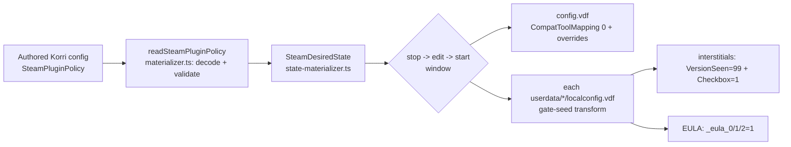
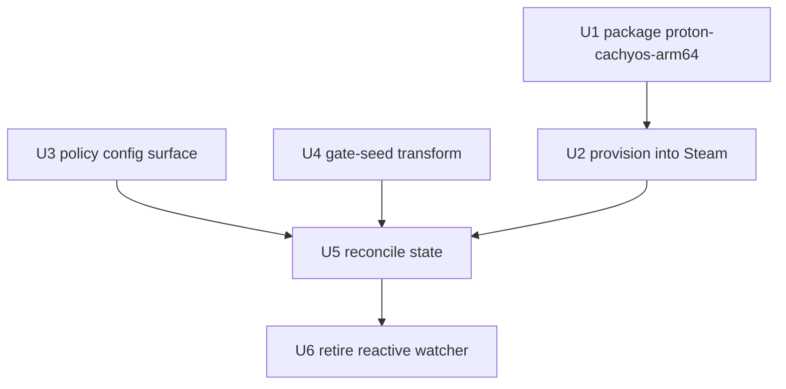

# feat: Productize ARM64 proton-cachyos + declarative Steam state policy

## Summary

Make ARM64-native proton-cachyos the durable, declarative Steam runtime on Bandai: package the Proton payload as a Nix artifact owned by the proton-runtime plugin, provision it as the global default compat tool, and turn Steam first-launch state-seeding (compat-tool mapping + Deck configurator interstitials + per-app EULA) into configurable Steam-plugin policy fields that the materializer reconciles inside its existing Steam-stopped write window.

---

## Problem Frame

Everything that makes ARM64 proton-cachyos work today is hand-installed device state under `/var/lib/korri/steam` (the compat tool with `require_tool_appid` stripped, the `CompatToolMapping "0"` default, and the interstitial/EULA seeds). A Steam reseed wipes all of it, and the gate behavior is currently either absent or handled reactively by a console-log watcher. The fix is to make each piece declarative — packaged in Nix and driven by authored plugin config — so the kiosk runtime is reproducible and tunable without code changes.

---

## Requirements

- R1. proton-cachyos-arm64 is a packaged Nix artifact (with `require_tool_appid` stripped from its `toolmanifest.vdf`), provisioned declaratively into `compatibilitytools.d` on each materialization, preserving the Steam-FHS execution invariant.
- R2. ARM64 proton-cachyos is selectable as the global default compat tool (`CompatToolMapping "0"`), policy-driven, with optional per-AppID overrides.
- R3. Steam first-launch gates — Deck configurator interstitials and per-app EULA acceptance — are suppressible via declarative Steam-plugin policy fields with kiosk-correct defaults, overridable in authored Korri config with no code change. (Steam Cloud is out of scope — see Deferred to Follow-Up Work.)
- R4. Compat-tool mapping and gate seeding are applied by the materializer inside its existing stop→edit→start window, targeting all real `userdata/*/config/localconfig.vdf` files (fixing the current `userdata/0` hardcode).
- R5. The obsolete reactive `ShowInterstitials` console-watcher is removed once pre-seed is in place.
- R6. Config decode rejects malformed policy blocks; the gate-seed transform is pure and unit-tested, including idempotency across repeated materializations.
- R7. The materializer validates the configured compat tool exists in `compatibilitytools.d` before writing the mapping and errors clearly on drift. Authored config is the source of truth — the reconciler re-applies policy each materialization, reverting manual Steam-UI compat-tool changes (challenge round 2).

---

## Scope Boundaries

- Not fixing the engine-specific render regressions (UE3-black/Antichamber, MonoGame-black/Stardew, D3DX9/30XX).
- Not migrating the fangame plugins onto a shared ARM64-Proton runtime.
- Not repairing the x86 Proton `AppError_51` path.
- Not changing the Steam service envelope, the gamescope launch session, or the launch-spec contract.

### Deferred to Follow-Up Work

- Engine-specific render regressions + x86 `AppError_51`: backlog `01KVJZ1KJBM8WV7H4ATZHMTMFK`.
- Fangame shared-runtime generalization: backlog `01KVF59A8A6Y5WXSM6F5BJGTAX`.
- Promoting proton-cachyos-arm64 from a proton-runtime payload to its own plugin (only if multiple Proton flavors materialize).
- Steam Cloud toggle as a policy option (registry.vdf): backlog `01KVM30NNNZFA2H8BAK8XP3FAF` (cut from this plan — different file, no observed need).

---

## Context & Research

### Relevant Code and Patterns

- `product/plugins/steam/src/state-materializer.ts` — already implements the stop→edit→start lifecycle (`shutdown`/`waitForShutdown`/`start`/`waitUntilReady`) and already reads/writes `localconfig.vdf` + `config.vdf` via `parseVdf`/`setVdfPath`/`renderVdf`. Currently writes `CompatToolMapping[<appid>]` per-app and hardcodes `userdata/0`.
- `product/plugins/steam/src/materializer.ts` — `readSteamPluginPolicy(context)` decodes/validates the plugin policy payload (`DecodedSteamPluginPolicy`) and builds `SteamDesiredState`. The validation pattern for `extra.args` / `launch-options` is the template for new config blocks.
- `product/plugins/steam/src/plugin.ts` — `SteamPluginPolicy` interface + `defaultSteamPluginPolicy` + `contributes.config`. The home for the new `defaults` / `first-launch` fields.
- `product/plugins/steam/packages/steam-korri/scripts/steam-arm64-seed` + `steam-arm64-bootstrap` — existing compat-tool provisioning (symlink `compatibilitytools.d/Proton11ARM` → `steamapps/common/Proton 11.0 (ARM64)`, gated by `STEAM_ENABLE_PROTON11_ARM64`).
- `product/plugins/steam/packages/steam-korri/resources/compatibilitytool.vdf` — the compat-tool registration manifest template.
- `product/plugins/proton-runtime/packages/proton-runtime/default.nix` + `nix/composition.nix` — existing proton-runtime packaging pattern (currently only a `setup-env` helper).
- `product/plugins/steam/nix/nixos-module.nix` (≈ lines 671, 723–764) — `localconfig_files()` enumerator (reuse for multi-user seeding) and the reactive `ShowInterstitials` watcher (to retire).

### Institutional Learnings

- `docs/solutions/runtime-errors/steam-arm64-proton-cachyos-default-matrix-2026-06-20.md` — the validation matrix, the decompiled `HasUserSeenInterstitial` gate model, and the process-detection correction.
- `docs/solutions/tooling-decisions/arm64-native-proton-cachyos-steam-runtime-bandai-2026-06-20.md` — the decision rationale + FHS invariant + playbook.

### External References

- None required — the mechanism was derived first-hand from the on-device gamepadui JS and validated live this session.

---

## Key Technical Decisions

- **Payload lives in proton-runtime, not a new plugin**: keeps the `@korri:proton` boundary as the owner of Proton artifacts; promote to a standalone plugin only if multiple Proton flavors appear.
- **Materializer becomes a config-driven reconciler**: every Steam state knob (default tool, per-game overrides, interstitials, EULA) is a `SteamPluginPolicy` field with a default; the materializer enforces whatever policy declares each run. Authored config is the source of truth — manual Steam-UI compat-tool changes are reverted on the next materialization (challenge round 2). No hardcoded seed behavior.
- **Interstitial suppression uses VersionSeen=99 + Checkbox=1**: `Deck_ConfiguratorInterstitialsVersionSeen_<Base>` is the real gate (null ⇒ always show); set to `99` to stay ≥ any future `unVersion`. For once-per-game types, `Deck_ConfiguratorInterstitialsCheckbox_<Base>="1"` suppresses globally for all apps — no per-app array enumeration needed.
- **`accept-eulas` defaults true everywhere**: a deliberate, auditable config flag (challenge Q2) rather than silent behavior — convenient for every consumer, still overridable per deployment.
- **Seed targets all `userdata/*` localconfigs unconditionally**: fixes the latent `userdata/0` hardcode; seeding placeholder accounts (`0`/`anonymous`) is intentional and harmless because the transform is idempotent (challenge Q4).
- **Build is vendored, not fetched**: the validated proton-cachyos-arm64 build is kept as a self-contained input under our control (challenge Q1), so it can't disappear upstream; rollback is reverting that input.
- **proton-cachyos-arm64 is THE global default; per-game overrides are the only deviation path**: no parallel old-Proton tool is kept for rollback (challenge Q5). A game needing a different Proton uses `compat-tool-overrides`; library-level rollback is reverting the vendored build.
- **Gate-seed is a pure VDF transform**: a separate module operating on a parsed VDF object, invoked by the materializer only when the corresponding policy flag is on — isolates the logic and makes it unit-testable in isolation.
- **Fail loud on compat-tool drift**: the materializer checks the configured tool is present in `compatibilitytools.d` before writing `CompatToolMapping`, erroring clearly rather than letting Steam silently fall back (challenge round 2).
- **Config key names (locked)**: kebab-case under `settings.plugin`, kept flat like `launch-options` — `compat-tool` (global default), `compat-tool-overrides` (`{ appid: tool }`), and a `first-launch` group with `suppress-interstitials` + `accept-eulas` (challenge round 2).

---

## Open Questions

### Resolved During Planning

- Where do gate keys persist? — `localconfig.vdf` (confirmed live: the `Deck_Configurator*` and `<appid>_eula_*` keys already appear there; `m_localStorage` is backed by it).
- Do we need per-app interstitial arrays? — No; the per-type `Checkbox=1` global supersedes per-app arrays for once-per-game types.
- New plugin vs payload? — Payload inside proton-runtime (see Key Technical Decisions).
- Proton build source? — Vendored, self-contained input (challenge Q1), not a network fetch.
- Replace or keep `Proton11ARM`? — Fully replace; proton-cachyos is THE default and per-game overrides handle deviation (challenge Q5).
- Rollback model? — Per-game `compat-tool-overrides` for individual games; library-level rollback = revert the vendored build commit (challenge Q5).
- Steam Cloud in scope? — Cut; tracked as backlog `01KVM30NNNZFA2H8BAK8XP3FAF` (challenge round 2).
- Verification with no device in CI? — CI runs unit tests; "done" also requires one on-device smoke check (challenge round 2; see Documentation / Operational Notes).
- Config key naming? — Locked: `compat-tool`, `compat-tool-overrides`, `first-launch.{suppress-interstitials, accept-eulas}` (kebab-case under `settings.plugin`) (challenge round 2).

### Deferred to Implementation

- Exact VDF parent path of the `Deck_Configurator*` keys (sibling of `apps` under `UserLocalConfigStore>Software>Valve>Steam`) — confirm with a 2-minute on-device read before wiring the path constant in U4.

---

## Output Structure

    product/plugins/proton-runtime/packages/
    └── proton-cachyos-arm64/
        └── default.nix                # new derivation (U1)

    product/plugins/steam/src/
    ├── steam-gate-seed.ts             # new pure VDF transform (U4)
    └── steam-gate-seed.test.ts        # new (U4)

(Everything else modifies existing files.)

---

## High-Level Technical Design

> *This illustrates the intended approach and is directional guidance for review, not implementation specification. The implementing agent should treat it as context, not code to reproduce.*

Config-to-state reconciliation flow:

Interstitial suppression decision model (the gate the seed satisfies):

| Type mode | Key written | Value | Suppresses |
|---|---|---|---|
| Once (Intro, NonVerifiedGame, Gyro, …) | `VersionSeen_<Base>` | `99` | globally |
| OncePerGame (AppHasSmallText, AppLauncherInteractionIssues, …) | `VersionSeen_<Base>` **and** `Checkbox_<Base>` | `99` / `1` | globally (Checkbox=1 ⇒ all apps) |
| EveryTime (GamepadRequired, VRRequired) | — | — | not suppressible |

---

## Implementation Units

### U1. Package proton-cachyos-arm64 as a Nix derivation

**Goal:** Turn the hand-installed Proton build into a reproducible artifact owned by proton-runtime, with `require_tool_appid` stripped.

**Requirements:** R1

**Dependencies:** None

**Files:**
- Create: `product/plugins/proton-runtime/packages/proton-cachyos-arm64/default.nix`
- Modify: `product/plugins/proton-runtime/nix/composition.nix`
- Add (vendored): the validated proton-cachyos-arm64 build as a pinned self-contained input (out-of-tree/LFS or local Nix-store path; not a raw multi-GB git blob)

**Approach:**
- Add a derivation that unpacks the proton-cachyos-arm64 build into a dist dir; in `postInstall`, remove the `require_tool_appid` line from `toolmanifest.vdf`.
- Expose the dist path via `passthru` (mirroring the existing `proton-runtime` `passthru.setupEnv` convention) so the Steam seed (U2) can reference a stable store path.
- Source the build from a **vendored, self-contained input** (challenge Q1) — not a network fetch. Given the build's size, vendor it as a pinned out-of-tree/LFS artifact or local Nix-store input rather than a raw multi-GB blob in git; rollback = revert that input.

**Patterns to follow:**
- `product/plugins/proton-runtime/packages/proton-runtime/default.nix` (stdenvNoCC, `passthru`, install layout).

**Test scenarios:**
- Test expectation: none — packaging derivation; validated by Nix build + the consuming check in U2. (Nix-level assertion, not a bun unit test.)

**Verification:**
- The package builds; its dist contains a `toolmanifest.vdf` with no `require_tool_appid`; the dist path is reachable via `passthru`.

### U2. Provision the packaged tool into Steam compatibilitytools.d

**Goal:** Symlink/register the U1 artifact into `compatibilitytools.d` each materialization, preserving the FHS invariant.

**Requirements:** R1

**Dependencies:** U1

**Files:**
- Modify: `product/plugins/steam/packages/steam-korri/resources/compatibilitytool.vdf`
- Modify: `product/plugins/steam/packages/steam-korri/scripts/steam-arm64-seed`
- Modify: `product/plugins/steam/packages/steam-korri/scripts/steam-arm64-bootstrap`
- Modify (check): `product/plugins/steam/packages/steam-korri/check.nix`

**Approach:**
- Register the cachyos tool in `compatibilitytool.vdf` (internal name, `install_path`, `display_name`).
- In `steam-arm64-seed`, symlink the U1 store path into `compatibilitytools.d/<tool>`, **replacing** the `Proton11ARM` placeholder — proton-cachyos is THE default; per-game deviation is via overrides, not a parallel tool (challenge Q5).
- The tool must remain launched **inside** the Steam FHS bwrap — provision only the symlink + manifest; do not alter the FHS entrypoint.

**Patterns to follow:**
- Existing `Proton11ARM` symlink + `atomic_copy` of `compatibilitytool.vdf` in `steam-arm64-seed` / `steam-arm64-bootstrap`.

**Test scenarios:**
- Test expectation: none for bun — covered by the steam-korri Nix `check.nix` (assert the tool dir + manifest land in `compatibilitytools.d`). Extend the existing check rather than adding a unit test.

**Verification:**
- After seed, `compatibilitytools.d` contains the registered cachyos tool resolving to the U1 dist; Steam lists it as a selectable compat tool.

### U3. Extend SteamPluginPolicy with `defaults` + `first-launch` config blocks

**Goal:** Add the declarative config surface and decode/validate it.

**Requirements:** R2, R3, R6

**Dependencies:** None

**Files:**
- Modify: `product/plugins/steam/src/plugin.ts`
- Modify: `product/plugins/steam/src/materializer.ts`
- Test: `product/plugins/steam/src/materializer.test.ts`

**Approach:**
- Extend `SteamPluginPolicy` (under `settings.plugin`, kebab-case, flat like `launch-options`) with the **locked** keys: `compat-tool` (global default tool), `compat-tool-overrides` (`{ "<appid>": "<tool>" }`), and a `first-launch` group: `suppress-interstitials`, `accept-eulas`. Cloud is out of scope (backlog `01KVM30NNNZFA2H8BAK8XP3FAF`).
- Set kiosk-correct defaults in `defaultSteamPluginPolicy` (cachyos tool as default; suppress-interstitials + accept-eulas true).
- Extend `readSteamPluginPolicy` to decode/validate the new blocks, mirroring the `extra.args` / `launch-options` validation (reject non-object, wrong types).

**Execution note:** Implement the decode/validate logic test-first — it is a pure, high-value validation seam.

**Patterns to follow:**
- `readSteamPluginPolicy` existing validation of `state.root` / `extra.args` / `launch-options` (`isRecord` guards + `SteamStateMutationFailed`-style errors).

**Test scenarios:**
- Happy path: a policy with `compat-tool` + `compat-tool-overrides` + full `first-launch` decodes to the expected typed shape.
- Edge case: missing `compat-tool` / `first-launch` falls back to `defaultSteamPluginPolicy` values.
- Error path: non-object `first-launch` is rejected with a clear reason.
- Error path: a `compat-tool-overrides` entry with a non-string value is rejected.

**Verification:**
- `readSteamPluginPolicy` returns a typed policy with new fields; malformed inputs throw with actionable reasons; defaults applied when omitted.

### U4. steam-gate-seed pure VDF transform (interstitials + EULA)

**Goal:** A pure function over a parsed VDF object that applies the gate seeds.

**Requirements:** R3, R6

**Dependencies:** None (consumes the VDF helpers already in `state-materializer.ts`)

**Files:**
- Create: `product/plugins/steam/src/steam-gate-seed.ts`
- Create: `product/plugins/steam/src/steam-gate-seed.test.ts`

**Approach:**
- Export pure transforms taking a parsed localconfig VDF object + options and returning the mutated object:
  - interstitials: for every type in the enum table, set `Deck_ConfiguratorInterstitialsVersionSeen_<Base>="99"`; for once-per-game types also set `Deck_ConfiguratorInterstitialsCheckbox_<Base>="1"`.
  - EULA: for each managed appid, set `<appid>_eula_0/1/2="1"` under the app block.
  - (Cloud is out of scope for this plan — backlog `01KVM30NNNZFA2H8BAK8XP3FAF`.)
- Encode the type table (Base name + mode) as a module constant. Confirm the exact VDF parent path for the `Deck_Configurator*` keys before finalizing (Deferred to Implementation).

**Execution note:** Pure transform — implement test-first.

**Patterns to follow:**
- `setVdfPath` / `parseVdf` / `renderVdf` usage in `state-materializer.ts`.

**Test scenarios:**
- Happy path: interstitial seed sets VersionSeen=99 for all types and Checkbox=1 for once-per-game types only.
- Happy path: EULA seed adds `_0/_1/_2` keys under each managed appid's block.
- Edge case: idempotent — running twice yields identical output (R6).
- Edge case: existing user keys for unrelated apps/interstitials are preserved (no clobber).
- Edge case: EveryTime types (GamepadRequired/VRRequired) are intentionally not written.
- Error path: malformed/empty VDF object is handled (returns a valid seeded object, not a throw).

**Verification:**
- Given a representative localconfig fixture, the transform produces the expected keys, is idempotent, and preserves unrelated state.

### U5. Reconcile policy into SteamDesiredState + state-materializer

**Goal:** Apply global default tool + per-game overrides + gate seeds across all `userdata/*` localconfigs, inside the existing write window.

**Requirements:** R2, R3, R4, R7

**Dependencies:** U3, U4, U2

**Files:**
- Modify: `product/plugins/steam/src/state-materializer.ts`
- Modify: `product/plugins/steam/src/materializer.ts`
- Test: `product/plugins/steam/src/state-materializer.test.ts`

**Approach:**
- Extend `SteamDesiredState` with `defaultCompatTool?`, `compatToolOverrides?`, `suppressInterstitials?`, `acceptEulas?`.
- Before writing the mapping, **validate the configured tool exists** in `compatibilitytools.d` and error clearly if not (R7); the reconciler re-applies policy each run, so manual Steam-UI compat-tool changes are reverted (config is source of truth).
- In the existing `lock.withLock` / shutdown→edit→start block: write `CompatToolMapping["0"]` (global default) and per-AppID override entries; invoke the U4 transform on each discovered localconfig when the flags are on.
- Replace the hardcoded `steamLocalConfigPath` (`userdata/0`) with enumeration of all `userdata/*/config/localconfig.vdf` (reuse the `localconfig_files()` approach from `nixos-module.nix`); seeding placeholder accounts (`0`/`anonymous`) is intentional and harmless since the transform is idempotent (challenge Q4).
- `materializer.ts` builds the new `SteamDesiredState` fields from the decoded policy (U3).

**Patterns to follow:**
- Existing per-app `CompatToolMapping` write + `parseVdfOrEmpty`/`renderVdf`/`writeTextAtomic` in `state-materializer.ts`.

**Test scenarios:**
- Happy path: global default writes `CompatToolMapping["0"]` to the cachyos tool.
- Happy path: per-game override writes `CompatToolMapping[<appid>]`.
- Integration: with `suppress-interstitials` + `accept-eulas` true, every discovered `userdata/*` localconfig is seeded (multi-user fixture proves the `userdata/0` fix).
- Edge case: flags false → no gate keys written.
- Edge case: writes occur only within the shutdown→start window (lifecycle ordering asserted, as existing tests do).
- Error path: a malformed existing localconfig surfaces `SteamStateMutationFailed` (existing behavior preserved).
- Error path: a configured compat tool absent from `compatibilitytools.d` errors clearly before any mapping write (R7).
- Integration: a pre-existing manual per-game mapping is overwritten to match policy on re-run (config-wins reconcile).

**Verification:**
- After materialization on a multi-user fixture: `config.vdf` has the global default (+ overrides), and each `userdata/*` localconfig carries the gate seeds when enabled; nothing is written when disabled.

### U6. Retire the reactive ShowInterstitials watcher

**Goal:** Remove the now-obsolete console-log interstitial watcher.

**Requirements:** R5

**Dependencies:** U5

**Files:**
- Modify: `product/plugins/steam/nix/nixos-module.nix` (≈ lines 723–764)
- Modify (if assertions reference it): `product/plugins/steam/nix/nixos-module.test.ts`

**Approach:**
- Remove the `LaunchApp waiting for user response to ShowInterstitials` watch/confirm path now that pre-seed prevents the prompt.
- Keep the `localconfig_files()` helper (now reused by U5's reconciler logic / referenced for discovery).

**Test scenarios:**
- Test expectation: none beyond updating any module test that asserted the watcher's presence — this is removal of dead logic gated on U5 being proven.

**Verification:**
- Module builds/check passes without the watcher; a fresh owned game still reaches `WaitingGameWindow → Completed` with no interstitial wait (manual on-device confirmation, e.g. Trine 2 35720).

---

## System-Wide Impact

- **Interaction graph:** materializer lifecycle (shutdown/start), sessiond, and the gamescope launch session consume the resulting Steam state; the retired watcher (U6) removes a console-driven side path.
- **State lifecycle risks:** all writes confined to the Steam-stopped window (existing lifecycle); multi-`userdata` enumeration must not clobber *unrelated* keys (covered by U4 idempotency + preserve tests). By design the reconciler DOES overwrite policy-owned keys each run — manual Steam-UI compat-tool changes are reverted (config-wins, challenge round 2).
- **API surface parity:** `SteamPluginPolicy` is authored config consumed by the Korri config graph — the new fields are a config contract; defaults must be safe for devices that don't set them.
- **Unchanged invariants:** Steam service envelope, gamescope session, and the launch-spec contract are untouched; proton-cachyos still runs inside the Steam FHS bwrap.

---

## Risks & Dependencies

| Risk | Mitigation |
|------|------------|
| Provisioning the tool outside the Steam FHS breaks Proton (nix-ld/python/glibc/vulkan) | Provision only a symlink + manifest into `compatibilitytools.d`; keep launch inside the existing FHS entrypoint (U2) |
| Steam rewrites localconfig and clobbers seeds | Write only inside the existing shutdown→edit→start window (U5) |
| Future Steam client bumps interstitial `unVersion` | Write `VersionSeen=99` (≥ any plausible future version) (U4) |
| EULA auto-accept legal posture | Explicit, default-documented config flag (`accept-eulas`); device-owner choice, auditable (U3) |
| proton-cachyos-arm64 source availability / reproducibility | Build vendored as a self-contained input (challenge Q1); rollback = revert the vendored input (U1) |
| Global default Proton regresses many games at once | Accepted as THE default; per-game `compat-tool-overrides` pin affected games; library rollback = revert the vendored build (challenge Q5) |
| Exact VDF parent path for `Deck_Configurator*` keys wrong | Confirm on-device before wiring the path constant (U4 deferred item) |

---

## Documentation / Operational Notes

- **Acceptance gate:** CI runs `npm test` (unit). Marking this work done additionally requires one **on-device smoke check** on Bandai: launch a fresh owned AppID through the `steam-gamescope` session and confirm it reaches gameplay with no interstitial/EULA prompt and the default proton-cachyos tool in effect (challenge round 2). This is a manual step, not covered by CI.
- Update the matrix doc (`docs/solutions/runtime-errors/steam-arm64-proton-cachyos-default-matrix-2026-06-20.md`) if the provisioned tool name or default policy changes.

---

## Sources & References

- Institutional: `docs/solutions/runtime-errors/steam-arm64-proton-cachyos-default-matrix-2026-06-20.md`, `docs/solutions/tooling-decisions/arm64-native-proton-cachyos-steam-runtime-bandai-2026-06-20.md`
- Backlog: `01KVJSZTH66G6R06AC46TR53Y3`, `01KVKZQ8H628H1NNXXG7WGQGNX`, `01KVKH3S1GKTFY4B87HZAWYZAB`, `01KVKAKZH2CHPANX25NH71DAB9`, `01KVJZ1KJBM8WV7H4ATZHMTMFK` (deferred), `01KVF59A8A6Y5WXSM6F5BJGTAX` (deferred)
- Code: `product/plugins/steam/src/{plugin,materializer,state-materializer}.ts`, `product/plugins/steam/packages/steam-korri/scripts/steam-arm64-seed`, `product/plugins/proton-runtime/`
