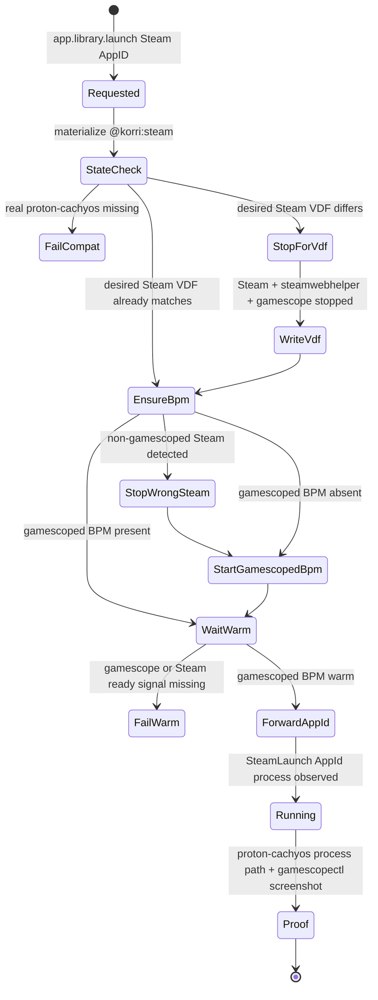

# fix: Enforce gamescoped Steam Big Picture warm gate

## Summary

Route every Korrid-controlled Steam AppID launch through one Steam-owned launcher contract that ensures Steam Big Picture is running inside gamescope before the AppID is forwarded. The implementation should remove non-gamescoped Steam fallbacks, add a concrete gamescoped-BPM warm readiness gate, and prove the real ARM64 `proton-cachyos-11.0-20260601-slr-arm64` payload is installed, selected, and used by the final Bandai launch proof.

---

## Problem Frame

Manual validation proved Flinthook can run on Bandai only when Steam Big Picture is already running inside the managed gamescope session and the AppID is launched into that Steam session. Current product paths do not enforce that topology: readable materialization can still return raw `steam -applaunch`, and `korri-steam-app` can start or reuse non-gamescoped Steam before forwarding an AppID.

The consequence is a launch that appears successful in logs but violates the controller-safe Steam/Input topology and can silently regress to placeholder or non-working Proton behavior.

---

## Requirements

- R1. All `@korri:steam` AppID launches initiated by Korrid resolve to a single Steam plugin-owned AppID launcher contract, not raw `steam -applaunch`.
- R2. Steam for game launches must always run as Steam Big Picture/Gamepad UI inside gamescope.
- R3. If the gamescoped Steam Big Picture session is absent, the launch path starts it before forwarding the AppID.
- R4. If non-gamescoped Steam is running against the managed Steam home, the launch path must not reuse it for a game launch; it must stop/refuse it before starting the gamescoped session.
- R5. The AppID is forwarded only after a gamescoped Steam warm gate confirms both gamescope presence and Steam readiness.
- R6. No fallback path may start desktop/non-gamescoped Steam for an AppID launch.
- R7. VDF mutations for compat-tool, LaunchOptions, EULA, and interstitial state occur only while Steam and steamwebhelper are stopped.
- R8. Real `proton-cachyos-11.0-20260601-slr-arm64` must be installed, selected as the default compat tool, and observed in the live AppID process chain by completion.
- R9. Flinthook AppID `401710` must be validated through the gamescoped Steam path with `gamescopectl` screenshot proof.
- R10. The parked per-game Steam LaunchOptions gamescope wrapper must remain out of the default path.

---

## Scope Boundaries

- Do not reintroduce per-game `gamescope %command%` LaunchOptions wrapping as the default mechanism.
- Do not launch Steam games by direct game executable, ad-hoc SSH Steam commands, or non-Steam Steamworks bypasses.
- Do not build a new portal UI for Steam lifecycle state in this slice; use existing logs/diagnostics and tests unless a minimal error surface is required.
- Do not solve unrelated per-title Proton regressions beyond requiring that Flinthook and the default ARM64 proton-cachyos path work.
- Do not productize a new dynamic plugin marketplace or third-party plugin runtime.

### Deferred to Follow-Up Work

- Generalize hardcoded game-audio repair beyond 30XX if it remains necessary for arbitrary Steam AppIDs.
- Add richer portal-visible diagnostics for Steam warm-gate failures once the launch topology is enforced.
- Repair x86 Proton Experimental fallback (`AppError_51`) separately; this plan treats ARM64 proton-cachyos as the required default.
- Productize broader Steam client asset repair/migration for every possible mixed Steam state; this plan may add guards needed for the gated path but should not turn into a full Steam updater rewrite.

---

## Context & Research

### Relevant Code and Patterns

- `product/plugins/steam/src/plugin.ts` owns `@korri:steam`, the Steam app contribution, and `DEFAULT_STEAM_COMPAT_TOOL`.
- `product/plugins/steam/src/launch-spec.ts` currently renders either raw `-applaunch` or wrapper AppID-only args; it is the right place to centralize the AppID launch contract.
- `product/plugins/steam/src/materializer.ts` owns `steamReadableLaunchIntegration`, Steam launch metadata, and the current gamescope companion guard.
- `product/plugins/steam/src/state-materializer.ts` owns VDF mutation, compat-tool existence checks, and the `SteamLifecycle` seam (`shutdown`, `waitForShutdown`, `start`, `waitUntilReady`).
- `product/plugins/steam/nix/nixos-module.nix` generates `korri-steam-guest`, `korri-steam-app`, Steam services, warmup helper, and runtime-prep units.
- `product/plugins/steam/nix/nixos-module.test.ts` uses source-text assertions for generated shell/Nix invariants.
- `product/plugins/steam/nix/module-check.nix` is the pure-Nix module-evaluation contract for exposed units, packages, environment, and service relationships.
- `product/plugins/gamescope/src/launch-companion/wrapper.ts` already knows how Steam launch metadata turns into gamescope Steam-session behavior (`-e`); the Steam plan should reuse plugin-owned gamescope composition rather than platform Steam branches.
- `product/plugins/proton-runtime/packages/proton-cachyos-arm64/**` vendors the real ARM64 payload; the Steam seed/runtime-prep path must preserve it as the managed compat tool.

### Institutional Learnings

- `docs/solutions/architecture-patterns/steam-inside-gamescope-preserves-steam-input-2026-06-15.md`: the validated topology is gamescope wrapping Steam Big Picture, then forwarding `steam://rungameid/<appid>` into that session.
- `docs/solutions/architecture-patterns/steam-appid-launch-ux-policy-2026-06-20.md`: product proof requires `korri-steam-app <appid>`, Steam-owned `SteamLaunch AppId=<appid>` evidence, `gamescopectl` screenshot, and cleanup back to home.
- `docs/solutions/runtime-errors/flinthook-arm64-proton-fna-opengl-2026-06-20.md`: Flinthook renders only through ARM64-native proton-cachyos and the controller-safe `steam-gamescope` path.
- `docs/solutions/runtime-errors/steam-arm64-proton-cachyos-default-matrix-2026-06-20.md`: ARM64 proton-cachyos is the working default for the tested library; `gamescopectl`, not `grim`, is the proof mechanism.
- `docs/solutions/tooling-decisions/arm64-native-proton-cachyos-steam-runtime-bandai-2026-06-20.md`: proton-cachyos must run inside the Korri Steam FHS envelope; x86 Proton/FEX fallback is not a reliable rescue path.
- `docs/solutions/architecture-patterns/steam-applaunch-with-silent-steam-and-per-app-launchoptions-gamescope-wrap-aka-x86-2026-05-27.md`: VDF writes while Steam is running are silently clobbered; stop Steam and steamwebhelper first.

### External References

External research was skipped. The task is governed by repo-local plugin/Nix architecture and recent Bandai validation docs rather than external API behavior.

---

## Key Technical Decisions

- **Canonical Korrid launch spec is `korri-steam-app <appid>`:** `@korri:steam` materialization should not return raw `steam -applaunch` for Korrid-controlled games. The wrapper becomes the single plugin-owned enforcement point for gamescoped BPM warm-up and AppID forwarding.
- **Add a gamescoped Steam Big Picture service/wrapper, do not reuse desktop `korri-steam.service` for games:** The existing service starts Steam without gamescope and is not a valid game-launch substrate. Add or promote a distinct gamescoped session unit/launcher and make `korri-steam-app` target it.
- **Remove direct non-gamescoped fallback:** If gamescoped service control fails, fail with a clear launch error rather than starting `korri-steam-guest` directly.
- **Warm means gamescope plus Steam readiness:** The gate should require a managed gamescope socket/process and Steam readiness signals such as the D-Bus ownership/log readiness already used for Steam warm-up. Steam process liveness alone is not enough.
- **Forward AppIDs into warm Steam using the already-running client path:** Prefer the proven `steam://rungameid/<appid>` forwarding once gamescoped BPM is warm, while preserving Steam-owned `SteamLaunch AppId=<appid>` process evidence.
- **Make state reconciliation diff-aware:** When VDF state already matches desired compat-tool/gate seeds, do not stop a warm gamescoped Steam session solely to rewrite equivalent state. When VDF differs, stop Steam/gamescope fully before writing.
- **Keep proton-cachyos as a hard launch prerequisite and final proof requirement:** Missing real payload or placeholder fixture state should fail before AppID forwarding; completion requires live process evidence using the real proton path.

---

## Open Questions

### Resolved During Planning

- **Should the plan use the existing non-gamescoped `korri-steam.service`?** No. It can remain for non-game utility if needed, but Korrid-controlled game launches must target a gamescoped BPM service/session.
- **Should service-control failure fall back to direct Steam?** No. Direct fallback violates the invariant and must be removed or replaced with a gamescoped start path.
- **Should the plan auto-download proton-cachyos during a game launch?** No. Launch should fail early if the managed compat tool is missing; seed/runtime-prep owns installation/repair before launch.
- **Should per-game LaunchOptions gamescope wrapping be revived?** No. It remains parked because Steam Input requires Steam itself inside gamescope.

### Deferred to Implementation

- Exact helper names for the gamescoped service, readiness probe, and AppID-forwarding script may be chosen during implementation, as long as the public launch contract remains `korri-steam-app <appid>`.
- Exact gamescope backend/default dimensions may reuse Bandai-proven defaults first and be made module-configurable if implementation finds an existing policy seam.
- Exact typed error names for launch-service failure and warm-gate timeout may be selected to fit existing `LaunchFailed`/sessiond error conventions.

---

## High-Level Technical Design

> *This illustrates the intended approach and is directional guidance for review, not implementation specification. The implementing agent should treat it as context, not code to reproduce.*

---

## Implementation Units

### U1. Make `korri-steam-app <appid>` the only Steam AppID launch spec

**Goal:** Ensure readable `@korri:steam` materialization never returns raw `steam -applaunch` for Korrid-controlled AppID launches.

**Requirements:** R1, R2, R6, R10

**Dependencies:** None

**Files:**
- Modify: `product/plugins/steam/src/plugin.ts`
- Modify: `product/plugins/steam/src/launch-spec.ts`
- Modify: `product/plugins/steam/src/materializer.ts`
- Test: `product/plugins/steam/src/launch-spec.test.ts`
- Test: `product/plugins/steam/src/materializer.test.ts`
- Test: `product/platform/library/proseql/library-repository.test.ts`
- Test: `product/plugins/library-source-layer.test.ts`

**Approach:**
- Change the Steam plugin-owned launcher contribution/default command so provider-qualified Steam AppID launches materialize to the wrapper contract.
- Remove the current escape where `korri-steam-app` bypasses the gamescope companion guard; the wrapper is not an exemption anymore, it is the enforcement point.
- Preserve launch metadata (`appProviderId: @korri:steam`, `steamSession: true`, foreground cleanup appId) so sessiond and Gamescope-related diagnostics still identify Steam AppID launches.
- Treat raw `steam` command overrides for `@korri:steam` AppID launches as invalid unless a later explicit non-Korrid/debug path is introduced outside the product launch surface.

**Execution note:** Start with the materializer regression test that currently expects `steam -applaunch`; change it to the desired wrapper contract before implementation.

**Patterns to follow:**
- `product/plugins/steam/src/launch-spec.ts` command rendering and `isKorriSteamAppCommand` helper.
- `product/plugins/steam/src/materializer.test.ts` memory filesystem/lifecycle test style.
- `product/platform/library/proseql/library-repository.test.ts` readable launch integration coverage.

**Test scenarios:**
- Happy path: provider-qualified Steam context with target `steam://rungameid/401710` resolves to `korri-steam-app` with AppID-only args.
- Happy path: launch metadata still includes `appProviderId: @korri:steam`, `steamSession: true`, and foreground cleanup appId.
- Error path: a Steam context that tries to use raw `steam` as the Korrid app launcher fails materialization or is normalized to the wrapper according to the chosen implementation boundary; it must not return `steam -applaunch`.
- Edge case: invalid Steam target still fails before any VDF writes.
- Regression: provider-qualified missing-integration behavior still fails closed when `@korri:steam` is not enabled.

**Verification:**
- Dry-run for a Steam game reports `korri-steam-app <appid>` as the selected launch spec.
- Repository and plugin-layer tests no longer assert raw `steam -applaunch` for `@korri:steam` AppID launches.

---

### U2. Add a gamescoped Steam Big Picture service/launcher contract

**Goal:** Provide a Nix-owned service or launcher target that starts Steam Big Picture inside gamescope and is the only service `korri-steam-app` may start for game launches.

**Requirements:** R2, R3, R4, R6

**Dependencies:** U1

**Files:**
- Modify: `product/plugins/steam/nix/nixos-module.nix`
- Modify: `product/plugins/steam/nix/module-check.nix`
- Test: `product/plugins/steam/nix/nixos-module.test.ts`

**Approach:**
- Add a distinct gamescoped Steam BPM unit/helper (for example a `korri-steam-gamescope` target) that wraps `korri-steam-guest` with gamescope and passes the proven Gamepad UI flags.
- Make `korri-steam-app` start/check this gamescoped target instead of accepting a running desktop/non-gamescoped `korri-steam.service` as warm.
- Declare mutual exclusion with the non-gamescoped Steam service so two Steam clients do not share the same state root.
- Remove the direct fallback that starts `korri-steam-guest` without gamescope when service control fails.
- Keep install/runtime-prep/uinput prerequisites wired before the gamescoped service starts.

**Execution note:** Characterize the generated module text before editing: the tests should first prove the direct fallback and non-gamescoped service target are present today, then change them to the new invariant.

**Patterns to follow:**
- Existing `steamAppLauncher`, `steamWarmup`, and `steamServiceControl` generated scripts in `product/plugins/steam/nix/nixos-module.nix`.
- Existing text-based assertions in `product/plugins/steam/nix/nixos-module.test.ts`.
- Existing pure Nix service assertions in `product/plugins/steam/nix/module-check.nix`.

**Test scenarios:**
- Happy path: the enabled module exposes a gamescoped Steam BPM service/helper and the generated `korri-steam-app` refers to it.
- Happy path: the gamescoped service command contains gamescope and Steam Big Picture/Gamepad UI flags.
- Error path: generated `korri-steam-app` no longer contains the direct fallback string that starts Steam without gamescope.
- Edge case: non-gamescoped `korri-steam.service` and gamescoped BPM service are mutually exclusive or otherwise cannot run against the same state root at the same time.
- Integration: module-check asserts required packages/services/environment are present when `services.korri.steam.enable = true`.

**Verification:**
- Generated Nix module text and pure Nix checks prove `korri-steam-app` can only start/check the gamescoped Steam BPM path for AppID launches.

---

### U3. Define and enforce gamescoped Steam warm readiness

**Goal:** Replace Steam-process-only readiness with a warm gate that proves the managed gamescope session and Steam BPM are both ready before AppID forwarding.

**Requirements:** R3, R5, R6

**Dependencies:** U2

**Files:**
- Modify: `product/plugins/steam/nix/nixos-module.nix`
- Modify: `product/plugins/steam/src/state-materializer.ts`
- Test: `product/plugins/steam/nix/nixos-module.test.ts`
- Test: `product/plugins/steam/src/state-materializer.test.ts`

**Approach:**
- Give `SteamLifecycle.waitUntilReady` a documented semantic contract: gamescoped Steam Big Picture is warm and can accept an AppID forwarding request.
- In the generated launcher, gate on gamescope presence (socket/process tied to the managed session) plus Steam readiness (D-Bus ownership and/or existing console-log readiness tokens).
- Ensure a non-gamescoped Steam process cannot satisfy the readiness predicate.
- Keep timeout behavior bounded and observable; failures should surface as launch failure rather than hanging until a generic process timeout.

**Patterns to follow:**
- `SteamReadinessTimeout` in `product/plugins/steam/src/state-materializer.ts`.
- Existing `wait_for_steam_ready` shell helper in `product/plugins/steam/nix/nixos-module.nix`.
- Institutional readiness learning from `docs/solutions/runtime-errors/steam-manual-launch-x86-eager-xwayland-dbus-readiness-2026-05-26.md`.

**Test scenarios:**
- Happy path: lifecycle mock records start then warm readiness before returned launch spec is used.
- Error path: readiness timeout maps to a Steam materialization/launch failure that names the state root or gamescoped service context.
- Error path: generated readiness logic cannot pass when only Steam log readiness is present and gamescope evidence is absent.
- Edge case: gamescope socket/process exists but Steam readiness never arrives; the launcher times out before forwarding the AppID.
- Edge case: Steam readiness arrives but gamescope process exits; the launcher fails rather than forwarding to desktop Steam.

**Verification:**
- A reviewer can identify the exact warm gate and see that both gamescope and Steam readiness are required.

---

### U4. Make Steam state reconciliation safe for warm sessions and real proton-cachyos

**Goal:** Preserve the Steam-stopped VDF safety rule while avoiding unnecessary teardown of an already-warm gamescoped Steam session when desired state already matches; require the real proton-cachyos payload before launch.

**Requirements:** R5, R7, R8

**Dependencies:** U1, U2

**Files:**
- Modify: `product/plugins/steam/src/state-materializer.ts`
- Modify: `product/plugins/steam/src/materializer.ts`
- Modify: `product/plugins/steam/packages/steam-korri/scripts/steam-arm64-seed`
- Modify: `product/plugins/steam/packages/steam-korri/scripts/steam-guest-runtime-prep`
- Modify: `product/plugins/steam/packages/steam-korri/tests/steam-guest-runtime-prep-smoke.sh`
- Test: `product/plugins/steam/src/state-materializer.test.ts`
- Test: `product/plugins/steam/src/materializer.test.ts`
- Test: `product/plugins/steam/packages/steam-korri/check.nix`

**Approach:**
- Compare desired VDF state against on-disk state before deciding whether a Steam shutdown/restart is required.
- If VDF differs, stop the full gamescoped Steam session before writing and wait until Steam/steamwebhelper are gone.
- If VDF already matches, skip mutation and preserve the warm gamescoped session.
- Strengthen compat-tool validation from "directory exists" to "real managed payload is present": the `proton` launcher exists, the tool manifest has no `require_tool_appid`, and the path is not the placeholder fixture.
- Ensure seed/runtime-prep keeps `proton-cachyos-11.0-20260601-slr-arm64` installed into the managed Steam home as a real mutable compat tool.

**Execution note:** Use characterization coverage around current VDF write behavior before introducing diff-aware reconciliation; this area is stateful and Steam rewrites files on exit.

**Patterns to follow:**
- Existing `parseVdf`, `renderVdf`, `SteamStateFileSystem`, and `SteamStateLock` seams in `product/plugins/steam/src/state-materializer.ts`.
- Existing runtime-prep smoke tests under `product/plugins/steam/packages/steam-korri/tests/`.
- Proton payload derivation under `product/plugins/proton-runtime/packages/proton-cachyos-arm64/`.

**Test scenarios:**
- Happy path: missing or stale VDF state triggers lifecycle shutdown, write, start, and wait-ready in order.
- Happy path: matching desired VDF state performs no VDF writes and does not restart a warm gamescoped session.
- Error path: missing `proton-cachyos-11.0-20260601-slr-arm64` fails before any AppID forwarding.
- Error path: placeholder fixture payload or manifest requiring an unavailable tool appid is rejected or repaired before launch.
- Edge case: stale nested Steam state root produces a diagnostic that distinguishes wrong state root from missing compat tool where possible.
- Integration: runtime-prep smoke proves the managed compat tool contains a real `proton` launcher and stripped manifest.

**Verification:**
- State materializer tests prove VDF safety and warm-session preservation.
- Steam package checks prove the real proton-cachyos payload contract is present and not replaced by the placeholder fixture.

---

### U5. Forward AppIDs only after the warm gate and preserve Steam-owned evidence

**Goal:** Change the wrapper behavior so AppID forwarding happens only after gamescoped BPM is warm, using the proven running-client forwarding path while preserving Steam-owned launch evidence.

**Requirements:** R1, R5, R8, R9

**Dependencies:** U2, U3, U4

**Files:**
- Modify: `product/plugins/steam/nix/nixos-module.nix`
- Modify: `product/plugins/steam/src/launch-spec.ts`
- Modify: `product/plugins/steam/src/observability/log-signals.ts`
- Modify: `product/plugins/steam/src/observability/launch-state.ts`
- Test: `product/plugins/steam/nix/nixos-module.test.ts`
- Test: `product/plugins/steam/src/launch-spec.test.ts`
- Test: `product/plugins/steam/src/observability/launch-state.test.ts`

**Approach:**
- Make `korri-steam-app` wait for the U3 warm gate before forwarding any AppID.
- Prefer forwarding as `steam://rungameid/<appid>` into the already-running gamescoped Steam client, unless implementation proves `-applaunch` is equally routed and safer; either way, no second non-gamescoped Steam process may be spawned.
- Preserve the existing observation contract: Steam logs/processes still show `SteamLaunch AppId=<appid>`, and lifecycle observation still tracks `Game process added/removed`.
- Include the real proton-cachyos path in proof/diagnostics expectations so placeholder payload regressions are caught.

**Patterns to follow:**
- Existing `korri-steam-app` log polling and process tree observation in `product/plugins/steam/nix/nixos-module.nix`.
- Steam lifecycle/log parser tests in `product/plugins/steam/src/observability/`.
- Existing process cleanup matching in `product/plugins/steam/src/session/foreground-processes.ts`.

**Test scenarios:**
- Happy path: generated wrapper forwards AppID only after the warm readiness helper succeeds.
- Happy path: wrapper forwarding command uses the chosen running-client protocol for `401710` and does not start another Steam client outside gamescope.
- Integration: log parser still recognizes `Game process added : AppID 401710` and `SteamLaunch AppId=401710` after the forwarding change.
- Error path: if forwarding succeeds but no `SteamLaunch AppId=<appid>` appears before timeout, the launcher fails with AppID launch timeout.
- Error path: if Steam reports a first-launch prompt that cannot be pre-seeded, the failure context includes the last Steam launch task rather than a generic hang.

**Verification:**
- Wrapper and observability tests prove the launch command is gated and the existing Steam-owned process evidence remains intact.

---

### U6. Add Bandai acceptance gate for Flinthook with real proton-cachyos

**Goal:** Define and automate as much as practical of the final proof that Flinthook launches through gamescoped Steam and real ARM64 proton-cachyos.

**Requirements:** R8, R9

**Dependencies:** U1, U2, U3, U4, U5

**Files:**
- Modify: `packages/pi-korrid-tools/src/korrid-tools.ts`
- Modify: `packages/pi-korrid-tools/tests/korrid-tools.test.ts`
- Modify: `product/plugins/steam/src/observability/diagnostics.ts`
- Test: `product/plugins/steam/src/observability/diagnostics.test.ts`

**Approach:**
- Extend existing read-only launch observation tooling or diagnostics so it can report the three completion facts: gamescoped Steam BPM is the active substrate, the game process chain includes `proton-cachyos-11.0-20260601-slr-arm64/proton`, and the AppID process remains alive long enough to capture proof.
- Keep screenshot proof grounded in `gamescopectl` with `GAMESCOPE_WAYLAND_DISPLAY=gamescope-0`; do not fall back to `grim`.
- Make the manual Bandai acceptance checklist explicit in the plan and, where feasible, encode checks in existing `pi-korrid-tools` observers so future sessions can rerun them without bespoke shell archaeology.

**Patterns to follow:**
- Existing Pi Korrid tooling in `packages/pi-korrid-tools/src/korrid-tools.ts`.
- Existing Steam diagnostics and lifecycle observers under `product/plugins/steam/src/observability/`.
- Proof expectations in `docs/solutions/architecture-patterns/steam-appid-launch-ux-policy-2026-06-20.md`.

**Test scenarios:**
- Happy path: diagnostics/observer data containing a gamescope process, `SteamLaunch AppId=401710`, and proton-cachyos path classifies the proof as valid.
- Error path: diagnostics/observer data with a Steam process but no gamescope evidence is invalid.
- Error path: diagnostics/observer data with placeholder proton fixture or no proton-cachyos path is invalid.
- Error path: screenshot command metadata using `grim` is not accepted as the canonical proof path.
- Integration: a simulated Flinthook process chain with `S:\common\Flinthook\Flinthook.exe` and proton-cachyos is summarized without truncating process names.

**Verification:**
- Final implementation is not complete until Bandai proof shows Flinthook AppID `401710` launched from Korrid through gamescoped Steam BPM, real `proton-cachyos-11.0-20260601-slr-arm64/proton` in the process chain, and a non-black `gamescopectl` screenshot.

---

## System-Wide Impact

- **Interaction graph:** `app.library.launch` resolves `@korri:steam` through plugin materialization, sessiond launches `korri-steam-app`, the Steam Nix module ensures gamescoped BPM, and Steam itself owns AppID/game process creation.
- **Error propagation:** Missing compat tool, non-gamescoped Steam conflict, gamescope start failure, and warm-readiness timeout should surface as launch failures rather than silently falling back to desktop Steam.
- **State lifecycle risks:** VDF writes are persistent and Steam rewrites them on exit; diff-aware reconciliation must never write while Steam or steamwebhelper is live.
- **API surface parity:** Dry-run and launch should agree on the wrapper contract; diagnostics/proof tools should report the same AppID/proton/gamescope evidence expected by manual validation.
- **Integration coverage:** Unit tests prove spec/rendering/state decisions; Nix checks prove generated units; Bandai proof is required because gamescope, Steam, and proton-cachyos interact at runtime.
- **Unchanged invariants:** Steam remains the install and launch authority; Steamworks games are not launched directly; per-game LaunchOptions gamescope wrapping remains parked.

---

## Risks & Dependencies

| Risk | Mitigation |
|------|------------|
| A launch appears to work but used non-gamescoped Steam | Remove non-gamescoped fallback and require gamescope evidence in warm readiness and diagnostics. |
| Steam VDF writes are lost or corrupted | Keep shutdown/wait-before-write lifecycle and add diff-aware skip when no write is needed. |
| New gamescoped service conflicts with existing `korri-steam.service` | Add explicit mutual exclusion or fail-fast detection before starting gamescoped BPM. |
| Placeholder proton payload reappears after deploy | Strengthen compat-tool validation and package/runtime-prep checks to reject fixture payloads. |
| Flinthook proof captures a stale gamescope frame | Require process-chain evidence plus fresh `gamescopectl` screenshot, with stale/black capture checks from the docs. |
| The work expands into all Steam client repair | Keep client asset repair deferred unless it blocks the required gamescoped BPM/proton-cachyos acceptance gate. |

---

## Documentation / Operational Notes

- Update or append a solution doc only if implementation discovers a new durable runtime behavior; otherwise reference existing Steam-inside-gamescope and proton-cachyos docs.
- Bandai rollout should use debug visibility (`KORRI_STEAM_KEEP_VISIBLE=1` or equivalent) for the final proof, then verify production hide behavior still hands focus to the game.
- Completion requires a device acceptance run, not just CI: Korrid launch, gamescoped Steam BPM warm evidence, Flinthook process chain through real proton-cachyos, `gamescopectl` screenshot, and clean session stop.

---

## Sources & References

- **Origin item:** [work/items/active/01KVMD7VX7SYJ4W2FJHY2YAZYE-enforce-gamescoped-steam-big-picture-warm-gate/item.md](item.md)
- Related code: `product/plugins/steam/src/plugin.ts`
- Related code: `product/plugins/steam/src/launch-spec.ts`
- Related code: `product/plugins/steam/src/materializer.ts`
- Related code: `product/plugins/steam/src/state-materializer.ts`
- Related code: `product/plugins/steam/nix/nixos-module.nix`
- Related code: `product/plugins/steam/nix/module-check.nix`
- Related code: `product/plugins/gamescope/src/launch-companion/wrapper.ts`
- Related code: `product/plugins/proton-runtime/packages/proton-cachyos-arm64/default.nix`
- Institutional learning: `docs/solutions/architecture-patterns/steam-inside-gamescope-preserves-steam-input-2026-06-15.md`
- Institutional learning: `docs/solutions/architecture-patterns/steam-appid-launch-ux-policy-2026-06-20.md`
- Institutional learning: `docs/solutions/runtime-errors/flinthook-arm64-proton-fna-opengl-2026-06-20.md`
- Institutional learning: `docs/solutions/runtime-errors/steam-arm64-proton-cachyos-default-matrix-2026-06-20.md`
- Institutional learning: `docs/solutions/tooling-decisions/arm64-native-proton-cachyos-steam-runtime-bandai-2026-06-20.md`
- Institutional learning: `docs/handoffs/steam-launchoptions-wrapper-parked-2026-06-15.md`

---

## Acceptance Checklist

- [ ] `@korri:steam` dry-run for Flinthook resolves to `korri-steam-app 401710` and not `steam -applaunch 401710`.
- [ ] `korri-steam-app` starts or verifies a gamescoped Steam Big Picture session before forwarding the AppID.
- [ ] Generated module code contains no AppID-launch fallback to non-gamescoped `korri-steam-guest` or raw desktop Steam.
- [ ] VDF writes are performed only after Steam/steamwebhelper are stopped; no-op reconciliation preserves a warm session.
- [ ] Real `proton-cachyos-11.0-20260601-slr-arm64` is present in `compatibilitytools.d`, selected as the default compat tool, and not the placeholder fixture.
- [ ] Bandai Flinthook process chain includes `SteamLaunch AppId=401710`, `proton-cachyos-11.0-20260601-slr-arm64/proton`, and `Flinthook.exe`.
- [ ] `gamescopectl screenshot` captures non-black gameplay proof from `gamescope-0`.
- [ ] Clean stop returns Bandai to Korri home/session without orphaned game or non-gamescoped Steam processes.
