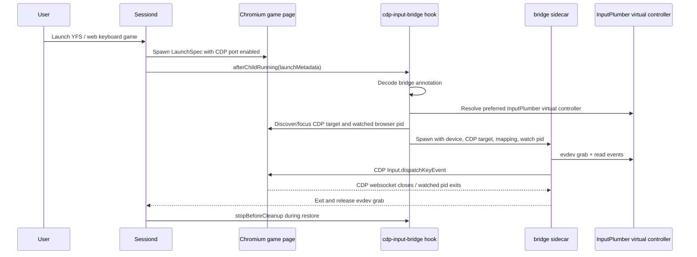
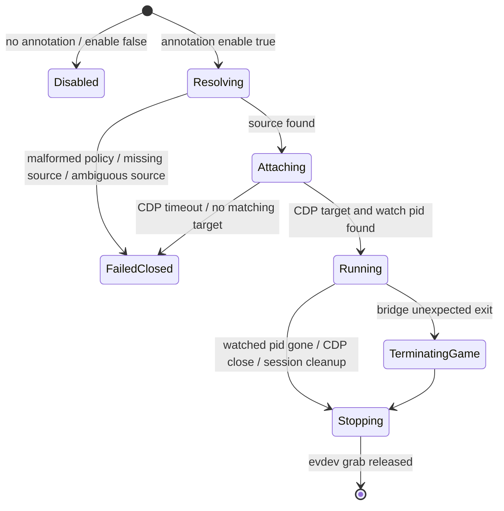

# feat: Productize launch-owned CDP input bridge for web keyboard games

## Summary

Productize the Sobo-validated controller-to-keyboard bridge as a launch-owned Chromium CDP sidecar. The implementation should read only the InputPlumber normalized virtual controller, dispatch keyboard events only to the launched Chromium target, avoid all host-seat virtual keyboards, and prove cleanup through session lifecycle ownership.

---

## Problem Frame

Keyboard-only web games such as Yoshi's Fabrication Station need controller support, but a normal uinput/ydotool keyboard is visible to Korri home and can leak after the game exits. The Sobo spike proved a safer shape: read the InputPlumber virtual controller, send `Input.dispatchKeyEvent` to one Chromium CDP page, and exit when the watched Chromium process or CDP websocket closes (see origin: `work/items/active/01KVNDFR0QH8X92ZP7HVS70MSF-spike-private-launch-input-scope-for-gamepad-to-keyboard-map/item.md`).

---

## Requirements

- R1. Source input only from an InputPlumber normalized virtual controller; never open raw physical gamepad devices.
- R2. Do not use global InputPlumber profile switching, `ydotoold`, uinput virtual keyboards, or any other host-seat keyboard mapper.
- R3. Deliver mapped keyboard events only to the intended launched Chromium page through CDP.
- R4. The mapping must be launch-owned: start only for launches that opt in, stop during cleanup, and exit when the watched Chromium target exits or the CDP websocket closes.
- R5. Fail closed on missing/ambiguous source selection, malformed bridge policy, CDP attach failure, or bridge startup failure.
- R6. Preserve the validated YFS mapping: D-pad, left stick, and right stick to arrow keys; west/X to `Z`; south/A to `A`; east/B to `X`; north/Y to `S`; start to `P`.
- R7. Keep the bridge reusable for future Chromium/web keyboard games by carrying mapping and target selection through typed plugin-owned policy, not hardcoded YFS-only script behavior.
- R8. Provide unit/integration coverage for policy decoding, source resolution, lifecycle hook behavior, bridge translation, cleanup, and YFS opt-in launch metadata.

---

## Scope Boundaries

- This plan targets Chromium/CDP web runtimes only. Native/PortMaster keyboard-only games still require a separate private-seat or runtime-specific input plan.
- This plan does not productize host-seat uinput or ydotool fallback behavior; the unsafe baseline remains validation evidence only.
- This plan does not require gamescope. If a web game is gamescope-wrapped, the CDP input bridge must remain independent of gamescope composition.
- This plan does not finish the broader `@korri:web-runtime` engine plugin effort. It must integrate cleanly with that work later, but can ship as a standalone opt-in plugin sidecar first.
- This plan does not add portal UI for editing mappings; mappings are plugin policy in v1.

### Deferred to Follow-Up Work

- Browser Gamepad API local shim as an optimization for pages where `navigator.getGamepads()` works reliably.
- Dynamic per-launch CDP port allocation owned by the future `korri-web-runtime` wrapper; v1 may use a configured per-launch/default port if that is the current YFS path.
- Private-seat/uinput isolation for non-CDP runtimes.
- Portal diagnostics for live input bridge state beyond structured launch failure messages and logs.

---

## Context & Research

### Relevant Code and Patterns

- `product/platform/plugin/session-lifecycle.ts` defines `KorriSessionLifecycleHook`, `afterChildRunning`, `stopBeforeCleanup`, and `failurePolicy: "fail-launch"`; this is the correct launch-owned sidecar seam.
- `product/services/device/sessiond.ts` starts lifecycle hooks after child spawn and awaits `stopBeforeCleanup` before cleanup; failures from hooks with `failurePolicy: "fail-launch"` terminate the launch.
- `product/plugins/gamescope/src/session/lifecycle-hook.ts` is the canonical sidecar lifecycle pattern: spawn after child running, return a handle, and clean residual processes later.
- `product/plugins/index.ts` registers first-party session lifecycle hook factories; the new bridge factory must be added there and gated by plugin enablement.
- `product/platform/input/native/inputplumber-virtual-gamepad.ts` already distinguishes InputPlumber virtual controllers from raw controllers and has `found` / `missing` / `ambiguous` outcomes.
- `product/platform/library/config/inheritable-fields.ts` and related cascade tests preserve provider-keyed `launch.with` policy maps; launch metadata already carries provider-keyed annotations to sessiond.
- `product/plugins/yoshis-fabrication-station/index.ts` and `product/plugins/yoshis-fabrication-station/yfs` are the initial opt-in consumer.
- `work/items/active/01KVHR5K9P7M2YQF3WX8B6N4DT-web-game-runtime-plugins/plan.md` defines the broader web runtime direction; the bridge should not block that plan, but should be shaped so the future runtime can own CDP port allocation cleanly.

### Institutional Learnings

- `work/items/active/01KVNDFR0QH8X92ZP7HVS70MSF-spike-private-launch-input-scope-for-gamepad-to-keyboard-map/item.md` records the live Sobo proof: browser Gamepad API reported `gp=none`, CDP dispatch worked, analog sticks required hysteresis, and lifecycle validation showed bridge/`evtest` exit on Chromium death.
- `docs/research/yoshis-fabrication-station-browser-runtime-capture.md` documents YFS controls and Chromium as the performant YFS runtime. It also warns that scoped `evsieve` alone is insufficient without isolation proof.
- `docs/research/stargrove-scramble-web-runtime-spike.md` shows CDP input for web games must be paired with Sway-level focus; CDP events can be technically delivered while visible gameplay remains gated if the window is not focused.
- `docs/solutions/architecture-patterns/sessiond-operator-model-2026-05-29.md` establishes the session cleanup expectation: foreground process residue must be gone before restore is considered complete.
- `docs/solutions/architecture-patterns/gamescope-as-plugin-owned-composition-2026-06-17.md` reinforces that runtime/plugin behavior must live behind plugin-owned seams, not generic platform hardcoding.
- `docs/solutions/integration-issues/steam-uinput-permissions-block-virtual-xinput-2026-06-13.md` is a cautionary contrast: uinput device creation is a separate permission surface that this CDP path intentionally avoids.

### External References

None gathered. Local spike evidence and repository patterns are strong and directly applicable.

---

## Key Technical Decisions

- **Standalone `@korri:cdp-input-bridge` plugin owns v1.** This avoids coupling productization to the unfinished broader web-runtime plugin while keeping the bridge reusable. YFS opts in through launch metadata; future `@korri:web-runtime` can emit the same metadata.
- **Use launch metadata annotations for the bridge contract.** The bridge policy belongs in `launchMetadata.annotations["@korri:cdp-input-bridge"]`, with strict decode at hook entry. Avoid parsing arbitrary Chromium argv as the primary contract.
- **Keep source resolution fail-closed, but add explicit preference policy.** The existing resolver should remain ambiguous by default. The bridge may pass a preferred virtual target name so Sobo's dual InputPlumber targets can select the validated Xbox Series controller without weakening unrelated callers.
- **Use exclusive evdev grab for CDP-bridged games.** This prevents duplicate browser/gamepad input while the bridge is active. CDP bridging is opt-in for games that need keyboard synthesis; games relying on Gamepad API should not enable it.
- **Bridge death should stop the watched Chromium target unless cleanup is already in progress.** If the input sidecar dies unexpectedly while the game is still alive, the launch should fail closed rather than leave a keyboard-only game running without mapped input.
- **Sway focus is part of successful attach.** The launch path should focus the target Chromium window before or during bridge readiness so CDP-delivered keyboard events advance the visible game.

---

## Open Questions

### Resolved During Planning

- **Should v1 use browser-local Gamepad API?** No. It was tested on Sobo and did not see the controller (`gp=none`), so CDP remains the product path for YFS-style web games.
- **Can the bridge select one Sobo InputPlumber source while preserving fail-closed safety?** Yes, by adding explicit preferred-target policy to the existing resolver while leaving the default ambiguous behavior unchanged.
- **Does mapping die with the wrapped process?** The spike validated the intended bridge behavior with a watched Chromium pid and CDP websocket close; product code must preserve and test this lifecycle.

### Deferred to Implementation

- **Exact CDP target selector defaults.** The plan requires typed selectors and tests, but the final selector fields may be adjusted to match the launcher's materialized URL/app-id shape.
- **Exact Nix packaging shape.** Follow local package conventions discovered during implementation; the binary location and env variable name are part of the plan, but derivation internals are implementation-time details.
- **Future dynamic CDP port allocation.** V1 may use configured/default port behavior for YFS; the future web-runtime wrapper can replace it with per-launch allocation while retaining the same bridge contract.

---

## Output Structure

    product/plugins/cdp-input-bridge/
      index.ts
      plugin.test.ts
      src/
        policy.ts
        policy.test.ts
        mapping.ts
        mapping.test.ts
        bridge-process.ts
        bridge-process.test.ts
        session-lifecycle-hook.ts
        session-lifecycle-hook.test.ts
      packages/
        korri-cdp-input-bridge/
          index.ts
          package.json
          README.md
      nix/
        cdp-input-bridge.nix

---

## High-Level Technical Design

> *This illustrates the intended approach and is directional guidance for review, not implementation specification. The implementing agent should treat it as context, not code to reproduce.*





---

## Implementation Units

### U1. Define bridge policy and mapping model

**Goal:** Create the typed contract for opt-in CDP input bridging, including the validated YFS mapping and target/source selection options.

**Requirements:** R5, R6, R7, R8

**Dependencies:** None

**Files:**
- Create: `product/plugins/cdp-input-bridge/src/policy.ts`
- Create: `product/plugins/cdp-input-bridge/src/policy.test.ts`
- Create: `product/plugins/cdp-input-bridge/src/mapping.ts`
- Create: `product/plugins/cdp-input-bridge/src/mapping.test.ts`

**Approach:**
- Define strict Effect Schema decoding for `launchMetadata.annotations["@korri:cdp-input-bridge"]`.
- Model `enable`, `cdpPort`, optional `pageUrlPattern`/target selector, `sourcePreference`, `mapping`, and `axis` thresholds.
- Ship a named `yfs-default` mapping matching Sobo validation.
- Keep mapping reusable by allowing structured overrides, but reject malformed or excess fields loudly.
- Treat `mapping: "none"` as a valid diagnostic mode only if explicitly requested.

**Execution note:** Implement policy and mapping tests first; these encode the contract other units consume.

**Patterns to follow:**
- `product/plugins/gamescope/src/launch-companion/policy.ts` for strict provider-owned policy decoding.
- `product/plugins/retroarch/src/policy.ts` for typed enum/literal policy surfaces.

**Test scenarios:**
- Happy path: decoding `{ enable: true, cdpPort: 9333, mapping: "yfs-default" }` returns a normalized policy with all YFS button/stick bindings.
- Happy path: `yfs-default` maps D-pad, left stick, right stick, west/south/east/north/start to the expected DOM key/code/keyCode values.
- Edge case: custom axis thresholds override defaults while preserving hysteresis semantics.
- Edge case: `enable` absent or false normalizes to a disabled policy that the hook can skip.
- Error path: excess properties, invalid provider target selector fields, invalid key codes, and unknown mapping names fail decode with actionable messages.
- Error path: malformed annotation payload never falls back to unsafe defaults.

**Verification:** Policy decode and mapping unit tests establish the exact bridge contract and validated default mapping.

---

### U2. Add preferred InputPlumber virtual controller selection

**Goal:** Preserve fail-closed source discovery while allowing the bridge to select the validated primary InputPlumber virtual controller when multiple virtual targets exist.

**Requirements:** R1, R5, R8

**Dependencies:** U1

**Files:**
- Modify: `product/platform/input/native/inputplumber-virtual-gamepad.ts`
- Modify: `product/platform/input/native/inputplumber-virtual-gamepad.test.ts`
- Reference: `tools/testing/fixtures/proc/bus-input-devices-inputplumber-ambiguous.txt`

**Approach:**
- Extend resolver options with an explicit preference field such as preferred device name(s), device ID, or event-node policy.
- Preserve current behavior when no preference is supplied: multiple virtual targets still return `status: "ambiguous"`.
- When a preference is supplied, return `found` only if exactly one candidate matches the preference; otherwise return `ambiguous` or `missing` with enough detail for fail-closed diagnostics.
- Use the policy from U1 to prefer the Sobo-validated `Microsoft Xbox Series S|X Controller` for YFS/CDP bridge launches.

**Patterns to follow:**
- Existing discriminated union shape in `product/platform/input/native/inputplumber-virtual-gamepad.ts`.
- Existing fixture-driven resolver tests in `product/platform/input/native/inputplumber-virtual-gamepad.test.ts`.

**Test scenarios:**
- Happy path: existing single virtual controller fixtures still resolve unchanged.
- Happy path: ambiguous fixture with preferred Xbox Series target resolves to that target.
- Edge case: ambiguous fixture without preference remains `status: "ambiguous"`.
- Error path: preference matching multiple candidates remains ambiguous.
- Error path: preference matching no candidate returns a fail-closed outcome with raw/virtual candidate diagnostics.
- Regression: raw physical Xbox or AYN hardware devices are never selected by preference alone.

**Verification:** Existing resolver callers keep their fail-closed defaults; the CDP bridge can select the validated InputPlumber virtual target only through explicit policy.

---

### U3. Productize the CDP input bridge binary

**Goal:** Package the validated bridge as a first-party Bun/Nix binary that translates evdev events from the selected InputPlumber controller into CDP keyboard events for one Chromium page.

**Requirements:** R1, R2, R3, R4, R6, R8

**Dependencies:** U1, U2

**Files:**
- Create: `product/plugins/cdp-input-bridge/packages/korri-cdp-input-bridge/index.ts`
- Create: `product/plugins/cdp-input-bridge/packages/korri-cdp-input-bridge/package.json`
- Create: `product/plugins/cdp-input-bridge/packages/korri-cdp-input-bridge/README.md`
- Create: `product/plugins/cdp-input-bridge/nix/cdp-input-bridge.nix`
- Create: `product/plugins/cdp-input-bridge/src/bridge-process.ts`
- Create: `product/plugins/cdp-input-bridge/src/bridge-process.test.ts`

**Approach:**
- Build the bridge around explicit CLI/config inputs: evdev device path, CDP port, target selector, mapping policy, watched pid, attach timeout, and cleanup behavior.
- Connect to Chromium through `/json/list` and target exactly one page based on decoded policy.
- Dispatch keys via CDP `Input.dispatchKeyEvent`; never start `ydotoold`, open `/dev/uinput`, or create virtual devices.
- Read evdev with an implementation that can be unit-tested through a fake event source. If using `evtest --grab` in v1, isolate process management behind an injectable interface; if direct evdev parsing is feasible, reuse existing parser patterns rather than shell parsing.
- Preserve validated analog hysteresis defaults: press threshold `12000`, release threshold `8000`.
- Exit on watched pid disappearance, CDP websocket close/error, CDP target loss, device removal/read failure, or process signal.
- On normal shutdown, release all pressed key states before exit.
- On unexpected bridge failure while the watched pid is still alive, terminate the watched pid so a keyboard-only game is not left running without mapped input.

**Execution note:** Characterize the Sobo bridge behavior in unit tests around translation/lifecycle before changing process implementation details.

**Technical design:** *(directional guidance, not implementation specification)*

```text
source evdev event -> source-state accumulator -> action-state union -> DOM key event pair -> CDP target
```

Keep source-state separate from action-state so D-pad and sticks can both hold the same direction without releasing it prematurely when only one source returns to neutral.

**Patterns to follow:**
- `product/plugins/gamescope/src/runtime-control/` process-manager pattern for spawn/stop and readiness.
- Existing input parser/test fixture patterns under `product/platform/input/native/`.

**Test scenarios:**
- Happy path: `BTN_WEST` down/up emits `KeyZ` down/up to a fake CDP client.
- Happy path: D-pad, left stick, and right stick each emit arrow key events using the same mapping table.
- Edge case: D-pad-left and left-stick-left held together keep `ArrowLeft` pressed until both sources release.
- Edge case: analog values inside the release threshold do not jitter key states.
- Error path: CDP websocket close causes bridge shutdown and releases all pressed key states.
- Error path: watched pid disappears and bridge exits without leaving the evdev reader running.
- Error path: bridge process detects its own unexpected failure mode and terminates the watched pid if configured to fail closed.
- Error path: CDP attach timeout exits non-zero with an actionable message.
- Regression: no code path invokes `ydotoold`, `/dev/uinput`, or host-seat keyboard creation.

**Verification:** The packaged bridge can be started by tests with fake evdev/CDP dependencies and by Nix/device packaging with the real command path.

---

### U4. Add session lifecycle hook and process manager

**Goal:** Start and stop the CDP bridge as a session-owned sidecar, fail launch when the bridge cannot safely start, and clean up before session restore.

**Requirements:** R3, R4, R5, R7, R8

**Dependencies:** U1, U2, U3

**Files:**
- Create: `product/plugins/cdp-input-bridge/index.ts`
- Create: `product/plugins/cdp-input-bridge/plugin.test.ts`
- Create: `product/plugins/cdp-input-bridge/src/session-lifecycle-hook.ts`
- Create: `product/plugins/cdp-input-bridge/src/session-lifecycle-hook.test.ts`
- Modify: `product/plugins/index.ts`
- Test: `product/services/device/sessiond.test.ts` or an existing session lifecycle test if sessiond behavior needs coverage beyond hook tests

**Approach:**
- Define `@korri:cdp-input-bridge` as a first-party plugin with a session lifecycle hook factory.
- In `afterChildRunning`, decode the bridge annotation. If absent or disabled, no-op.
- Resolve InputPlumber source via U2 with policy-specified preference; fail launch on missing/ambiguous.
- Resolve CDP port and target selector from annotation/env, focus the target Chromium/Sway window when enough target identity is available, and discover the watched Chromium pid.
- Spawn the bridge process through an injectable process manager.
- Return a handle with `stopBeforeCleanup` that terminates the bridge and awaits evdev grab release.
- Monitor bridge process exit; if it exits unexpectedly before cleanup while the watched pid is still alive, terminate the watched pid to keep the session fail-closed.
- Register the hook in `firstPartySessionLifecycleHookFactories` behind plugin enablement.

**Patterns to follow:**
- `product/plugins/gamescope/src/session/lifecycle-hook.ts` for hook lifecycle and injected process manager.
- `product/plugins/steam/src/session/lifecycle-hook.ts` for annotation-aware session behavior.
- `product/services/device/sessiond.ts` existing `failurePolicy: "fail-launch"` behavior.

**Test scenarios:**
- Happy path: enabled annotation starts bridge with decoded mapping, resolved InputPlumber path, CDP port, target selector, and watch pid.
- Happy path: `stopBeforeCleanup` calls bridge stop and waits for completion.
- Edge case: absent annotation or `enable: false` skips the bridge without failing launch.
- Error path: malformed annotation fails launch with a clear policy error.
- Error path: InputPlumber missing/ambiguous fails launch and does not start the bridge.
- Error path: CDP target not reachable within timeout fails launch and terminates the child through sessiond's existing fail-launch path.
- Error path: bridge unexpected exit while watched pid is alive sends a termination signal to the watched pid.
- Integration: sessiond hook failure with `failurePolicy: "fail-launch"` returns a failed launch result and invokes cleanup for already-started handles.

**Verification:** Hook tests prove launch-owned start/stop/fail-closed semantics independent of real Chromium or real input devices.

---

### U5. Opt YFS into the bridge and expose a CDP-capable launch

**Goal:** Make YFS launches request the CDP bridge with the validated YFS mapping and start Chromium with an attachable CDP endpoint.

**Requirements:** R3, R4, R5, R6, R8

**Dependencies:** U1, U3, U4

**Files:**
- Modify: `product/plugins/yoshis-fabrication-station/index.ts`
- Modify: `product/plugins/yoshis-fabrication-station/plugin.test.ts`
- Modify: `product/plugins/yoshis-fabrication-station/yfs`
- Create or Modify: `product/plugins/yoshis-fabrication-station/src/readable-launch-integration.ts` if the current catalog path cannot materialize launch metadata/env directly
- Modify: `product/plugins/index.ts` if adding a YFS readable launch integration export is required

**Approach:**
- Add bridge annotation to YFS materialized launches with `enable: true`, `mapping: "yfs-default"`, preferred InputPlumber target, CDP target selector, and CDP port.
- Ensure the YFS Chromium invocation receives `--remote-debugging-port=<port>` only when the bridge is enabled.
- Prefer a typed YFS launch materialization path if direct catalog records cannot carry both launch metadata and env cleanly.
- Keep user-facing YFS settings game-meaningful; do not expose CDP ports, evdev paths, or bridge internals as user config.
- Preserve existing YFS direct-launch behavior and Chromium flags except for the opt-in CDP endpoint.

**Patterns to follow:**
- `product/plugins/steam` and `product/plugins/retroarch` readable launch integration registration patterns if materialization is needed.
- Existing YFS plugin catalog/module contribution shape in `product/plugins/yoshis-fabrication-station/index.ts`.
- `product/platform/library/sessiond-managed-launch-client.test.ts` for ensuring launch metadata reaches sessiond.

**Test scenarios:**
- Happy path: resolving YFS launch produces a launch spec with CDP port env/arg and launch metadata annotation for `@korri:cdp-input-bridge`.
- Happy path: YFS annotation selects `yfs-default` and the preferred Sobo InputPlumber virtual target.
- Edge case: CDP bridge disabled by override or environment omits the remote-debugging flag and annotation.
- Error path: malformed YFS bridge policy fails at decode rather than launching with partial mapping.
- Regression: YFS still contributes the same playable id, executable module, and existing non-input settings/behavior.

**Verification:** Dry-run/launch-resolution tests prove YFS opts into the bridge without leaking bridge internals into ordinary user config.

---

### U6. Device validation harness and operational documentation

**Goal:** Preserve the Sobo validation gates as product verification guidance and make failures diagnosable during rollout.

**Requirements:** R2, R4, R5, R8

**Dependencies:** U3, U4, U5

**Files:**
- Create: `product/plugins/cdp-input-bridge/README.md`
- Create: `product/plugins/cdp-input-bridge/src/diagnostics.ts`
- Create: `product/plugins/cdp-input-bridge/src/diagnostics.test.ts`
- Modify: `product/plugins/cdp-input-bridge/index.ts`
- Reference: `work/items/active/01KVNDFR0QH8X92ZP7HVS70MSF-spike-private-launch-input-scope-for-gamepad-to-keyboard-map/item.md`

**Approach:**
- Document the validated Sobo gates as operational checks: no `ydotoold`, no `ydotoold virtual device`, bridge running, `evtest --grab` on the selected InputPlumber event, and lifecycle death on Chromium exit.
- Add plugin diagnostics that can report configured command path, annotation decode status, source resolution status, and whether a bridge process was expected for a launch.
- Keep ad-hoc `/storage/korri-input-validation` scripts as spike artifacts, not production scripts; translate their checks into README guidance and automated tests where possible.
- Capture on-device validation expectations for YFS: mapping works, analog sticks work, no host virtual keyboard appears, kill Chromium and bridge exits.

**Patterns to follow:**
- Existing `diagnostics.collect` plugin handler style where applicable.
- README style in `product/plugins/yoshis-fabrication-station/README.md` and other first-party plugins.

**Test scenarios:**
- Happy path: diagnostics report bridge enabled and source preference configured from a sample annotation.
- Error path: diagnostics describe missing command path, missing InputPlumber source, and malformed annotation separately.
- Operational: README validation matrix includes the lifecycle kill test and no-host-keyboard checks from the Sobo spike.

**Verification:** The productized bridge has both automated diagnostics and a documented on-device validation matrix matching the spike evidence.

---

## System-Wide Impact

- **Interaction graph:** Library launch resolution produces launch metadata; sessiond passes metadata to lifecycle hooks; `@korri:cdp-input-bridge` hook starts a sidecar; the sidecar reads InputPlumber evdev and targets Chromium CDP. YFS is the initial consumer.
- **Error propagation:** Policy/source/CDP startup failures are hook errors under `failurePolicy: "fail-launch"`; sessiond surfaces them as launch failures with actionable stderr tails.
- **State lifecycle risks:** The bridge holds an exclusive evdev grab while active. `stopBeforeCleanup`, watched pid exit, and CDP websocket close must all release the grab before Korri UI/session restore resumes.
- **Security posture:** CDP remote debugging is enabled for the launched Chromium runtime. Bind to loopback/local namespace only, use per-launch target selectors, and avoid leaving a reusable debugging endpoint after cleanup.
- **Packaging:** Nix/device configuration must include the bridge binary and any required evdev reader dependency. It must not add uinput permissions for this feature.
- **Plugin composition:** The bridge is independent of gamescope. If both are enabled, gamescope remains display composition and the CDP bridge remains input delivery.
- **Testing scope:** Most safety guarantees are unit/integration-testable with fake CDP and fake evdev sources. Final assurance still needs an on-device YFS validation pass.

---

## Failure Modes and Required Behavior

| Failure mode | Required behavior |
|---|---|
| Bridge annotation absent | No-op; launch proceeds without bridge |
| Bridge annotation malformed | Fail launch closed |
| InputPlumber virtual controller missing | Fail launch closed |
| Multiple matching virtual controllers without explicit preference | Fail launch closed |
| Preference matches raw physical device only | Fail launch closed |
| CDP port unavailable / target not found | Fail launch closed and stop child |
| CDP websocket closes | Bridge exits and releases evdev grab |
| Watched Chromium pid exits | Bridge exits and releases evdev grab |
| Bridge exits unexpectedly while Chromium alive | Terminate watched Chromium pid |
| Session cleanup begins | Stop bridge before restore; release pressed keys and evdev grab |
| `ydotoold`, uinput, or host virtual keyboard path requested | Treat as unsupported for this plugin |

---

## Validation Plan

### Automated

- `bun test product/plugins/cdp-input-bridge`
- `bun test product/platform/input/native/inputplumber-virtual-gamepad.test.ts`
- `bun test product/plugins/yoshis-fabrication-station`
- `bun test product/plugins/index.test.ts`
- `bun test product/platform/library/sessiond-managed-launch-protocol.test.ts product/platform/library/sessiond-managed-launch-client.test.ts product/services/device/sessiond.test.ts`
- `just typecheck`
- `just lint`

### On-device Sobo smoke

Use the productized path rather than `/storage/korri-input-validation` scripts once implemented.

1. Launch YFS through Korri/sessiond with CDP bridge enabled.
2. Confirm controller mapping works in gameplay: arrows/sticks, `Z`, `A`, `X`, `S`, `P`.
3. Confirm no `ydotoold` process exists.
4. Confirm no `ydotoold virtual device` or new host-seat virtual keyboard is present in `/proc/bus/input/devices`.
5. Confirm the bridge selected the InputPlumber virtual controller, not `/dev/input/.inputplumber/sources/*` raw hardware.
6. Kill the watched Chromium pid and verify the bridge exits and releases its evdev grab.
7. Return to Korri UI and verify controller input is not converted into keyboard events in portal/home.

---

## Risks & Mitigations

- **Risk: CDP endpoint remains open outside the launch.** Mitigate by binding to loopback, enabling it only for bridge-enabled launches, and killing Chromium through session cleanup.
- **Risk: ambiguous InputPlumber topology changes across devices.** Mitigate with explicit preference policy plus fail-closed behavior and diagnostics listing candidates.
- **Risk: analog stick jitter causes stuck or repeated arrow states.** Mitigate with hysteresis and source/action state separation tests.
- **Risk: sidecar process exits while game continues.** Mitigate with lifecycle hook monitoring that terminates the watched pid unless cleanup is already underway.
- **Risk: YFS catalog path cannot carry launch metadata.** Mitigate by adding a small YFS readable launch integration rather than broadening generic config schema prematurely.
- **Risk: focus mismatch causes CDP events to be delivered but not visible in gameplay.** Mitigate by including focus/target checks in hook readiness and on-device validation.

---

## Review Checklist

- [ ] No raw `/dev/input/event*` physical gamepad source is selected.
- [ ] No `ydotoold`, `/dev/uinput`, or global virtual keyboard path is introduced.
- [ ] Bridge policy is opt-in and provider-scoped.
- [ ] Malformed policy and ambiguous source discovery fail launch closed.
- [ ] YFS launch resolution carries both CDP enablement and bridge annotation.
- [ ] Bridge exits on watched pid death and CDP websocket close.
- [ ] Session cleanup stops bridge before restore.
- [ ] Unexpected bridge exit terminates watched Chromium target.
- [ ] Tests cover D-pad, left stick, right stick, buttons, hysteresis, shared key state, and cleanup.
- [ ] On-device validation matrix is documented.

---

## Completion Criteria

- Product code contains a reusable `@korri:cdp-input-bridge` plugin and packaged bridge binary.
- YFS launches opt into the bridge with the validated mapping and CDP target configuration.
- Automated tests pass for policy, mapping, source resolution, process lifecycle, YFS integration, and plugin registration.
- On Sobo, YFS can be controlled from the physical controller through the InputPlumber virtual controller without any host-seat virtual keyboard.
- Killing the launched Chromium target kills/releases the bridge and controller mapping cannot affect Korri home after restore.
