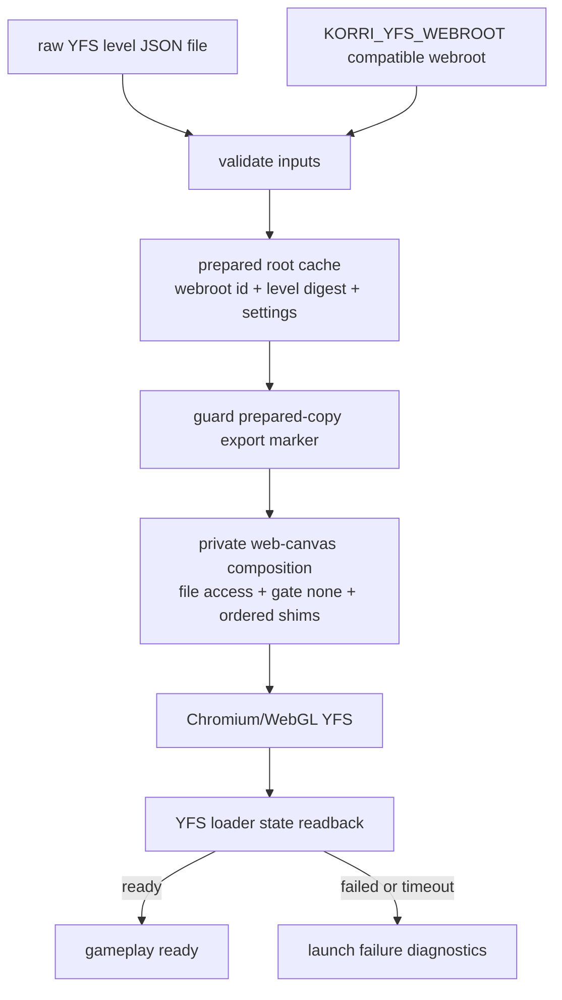

# feat: Productize YFS level launcher over web-canvas

## Summary

Productize Yoshi's Fabrication Station as its own launcher surface that privately composes the proven web-canvas runtime. The launcher takes a supplied raw YFS level JSON artifact, prepares a cacheable launch root from an already-compatible YFS webroot, starts Chromium through web-canvas, and fails with YFS-specific diagnostics if the level does not reach gameplay.

---

## Problem Frame

YFS now has a proven Sobo path: Chromium/Wayland, hardware WebGL, roughly 120fps rAF cadence, and a real Level Share Square level loaded from raw YFS JSON. That proof still depends on manual staging and CDP intervention, and it leaks implementation details (`@korri:web-canvas/chromium`, file-access flags, shims, and temporary payload edits) that should belong behind a first-class YFS launcher.

---

## Requirements

- R1. YFS exposes a public launcher command shaped as `yfs-launch <level-file>`; the web-canvas launcher remains a private implementation detail.
- R2. The YFS webroot is supplied by the extraction/package environment (`KORRI_YFS_WEBROOT`) and must already be compatible/patched by that layer; `yfs-launch` validates it and fails fast when unsupported.
- R3. The level artifact is a raw YFS level JSON string. The launcher performs basic validation only: exists, readable, non-empty, bounded size, and JSON parseable.
- R4. The launcher prepares a reusable launch root keyed by compatible webroot identity, level digest, launcher version, and relevant settings; identical inputs share roots.
- R5. Prepared roots contain `level.json` and launch YFS via the proven relative `code_url=level.json` path.
- R6. Prepared-root creation is atomic enough to detect incomplete/corrupt roots; corrupt roots rebuild once and then fail clearly.
- R7. The launcher applies only guarded prepared-copy compatibility checks, including WebView2 export marker handling; it never mutates the source webroot.
- R8. web-canvas supports ordered app shims before navigation and during startup, so YFS shims run without one-off CDP plumbing.
- R9. YFS settings (audio, GBA sounds, quick death, play timer, BGM/SFX volume, debug, metrics) are YFS launcher settings, not generic web-canvas settings.
- R10. The default YFS settings/helper path does not enable `preserveDrawingBuffer`; the 120fps Chromium/WebGL path stays the performance target.
- R11. Level-loader failures, timeouts, and stale states propagate to the launcher/session as launch failures with diagnostics.
- R12. Done requires unit tests plus a real Sobo proof through `yfs-launch <level-file>`: gameplay reached, hardware WebGL confirmed, and roughly 120fps-class rAF cadence observed.

---

## Scope Boundaries

- This plan does not model Level Share Square YFS levels as releases or extend acquisition. It consumes a supplied raw level artifact path.
- This plan does not support raw upstream YFS extracts in `yfs-launch`. Extraction/package is responsible for producing a compatible webroot.
- This plan does not bundle new levels or change level acquisition semantics.
- This plan does not productize scoped controller-to-keyboard input.
- This plan does not replace the DOM loader with a direct Construct gameplay jump.
- This plan does not productize alternate runtime lanes (Luakit/WebKit, Electrobun CEF, gamescope-first Chromium).
- This plan does not expose `@korri:web-canvas/chromium` as a YFS authoring surface.

### Deferred to Follow-Up Work

- Extend Level Share Square acquisition for YFS artifacts and release/catalog modeling: backlog `01KVNHPPYGV1GK015GGDKFK1AY`.
- Replace DOM level-loader automation with a direct Construct gameplay jump: backlog `01KVNHQ1JM28EPNY2VZRQDCRTJ`.
- Productize scoped controller-to-keyboard input for YFS-style web games: backlog `01KVNHQKSVADKGYYNTD6G699R9`.
- Preserve alternate runtime lanes as future explorations: backlog `01KVNHR0G9K4YYD70THDSZHPP7`.
- Consider raw-upstream YFS extract support only after compatible-webroot launcher behavior ships.

---

## Context & Research

### Relevant Code and Patterns

- `product/plugins/yoshis-fabrication-station/index.ts` currently contributes a catalog entry and executable module for the older `yfs` wrapper; the new launcher should keep YFS as the public plugin surface.
- `product/plugins/yoshis-fabrication-station/package.nix` already prepares a compatible YFS webroot at package time: WebView2→HTML5 export patch, data transition seam patches, `c3main` settings hooks, and direct-launch script injection.
- `product/plugins/yoshis-fabrication-station/check.nix` is the colocated package-shape check pattern for wrapper binaries, launch-setting metadata, and static webroot assertions.
- `product/plugins/yoshis-fabrication-station/scripts/direct-launch-pre.js` contains the existing YFS settings helper plus the `preserveDrawingBuffer` patch that must not carry into the default launcher path.
- `product/plugins/yoshis-fabrication-station/scripts/direct-launch.js` contains the existing DOM loader and exposes `window.__YFS_DIRECT_LAUNCH`, but currently marks `ready` even when gameplay replacement times out.
- `product/plugins/web-canvas/src/canvas.ts` owns canvas presentation, gate driving, CDP live startup loops, and app shim injection; it needs ordered app shims available before navigation plus once-per-document startup evaluation, not future-document-only registration.
- `product/plugins/web-canvas/src/runtime/korri-web-canvas.ts` already supports private Chromium flags through `KORRI_WEBPAGE_EXTRA_FLAGS`; YFS should use that for `--allow-file-access-from-files` rather than making file access a universal canvas default.
- `product/plugins/webpage/src/runtime/webpage.ts` owns Chromium launch, CDP connection, profile path, and private extra flags via the caller.
- `product/plugins/AGENTS.md` defines plugin descriptor, handler, launch companion, and Nix package conventions.
- `docs/research/yoshis-fabrication-station-browser-runtime-capture.md` records the earlier YFS runtime evidence and should be updated with the new Sobo proof and decisions.

### Institutional Learnings

- `docs/solutions/architecture-patterns/gamescope-as-plugin-owned-composition-2026-06-17.md` — platform code must not name plugin-specific ids; plugin-owned composition belongs behind enabled plugin handlers/descriptors.
- `docs/solutions/architecture-patterns/korri-plugin-architecture-2026-06-02.md` — plugins contribute declarative config plus handlers behind host-owned seams; input contracts and capabilities stay explicit.
- `docs/solutions/best-practices/product-owned-composition-keeps-shared-layers-reusable-2026-05-03.md` — generic/shared layers must not import product/plugin-specific code; YFS-specific canvas behavior belongs in the YFS plugin.
- `docs/solutions/runtime-errors/kiosk-renderer-local-launch-rpc-decode-failure-2026-05-27.md` — renderer/browser diagnostics need explicit transport; do not rely on browser console logs as the only signal.

### External References

None. Local code and device evidence are strong and more relevant than general web-game guidance.

---

## Key Technical Decisions

- **YFS is the public launcher; web-canvas is the private substrate.** Users and catalog authors should select the YFS launcher/release shape, not `@korri:web-canvas/chromium`.
- **`KORRI_YFS_WEBROOT` must be an already-compatible webroot.** The extraction/package layer owns the full source compatibility patch set. The launcher validates that output and only performs guarded prepared-copy marker normalization; it does not duplicate raw-upstream patching.
- **Prepared roots are cache/store-like by explicit user decision.** They are keyed by webroot identity, level digest, launcher version, and relevant settings; identical inputs share roots. Cleanup/GC is separate from process exit.
- **Prepared roots contain level data.** The supplied raw level JSON is copied into the prepared root as `level.json` so the proven relative `code_url=level.json` path remains the browser contract.
- **YFS uses `gate: none` privately.** Generic web-canvas auto-gate clicks can interfere with the YFS Load Level UI automation; YFS relies on autoplay policy rather than trusted click activation.
- **`--allow-file-access-from-files` stays private to YFS/local file launch.** It is required for the local prepared root but is not a generic web-canvas default for arbitrary web URLs.
- **The settings helper excludes `preserveDrawingBuffer`.** That patch helped old boot-frame capture but risks WebGL performance and was not needed for the proven 120fps path.
- **YFS shims must be available before page boot when required.** web-canvas needs a pre-navigation/document-start path for ordered app shims so settings hooks are present before Construct module evaluation.
- **The loader must be host-observable.** In-page failure must be visible to the launcher through CDP/readback or another explicit diagnostic surface, not only through `console.error`.

---

## Open Questions

### Resolved During Planning

- Should `KORRI_YFS_WEBROOT` support raw upstream extracts? **No.** It must point to a compatible/patched webroot supplied by extraction/package.
- Should the launcher deeply validate YFS level semantics? **No.** Basic file/JSON validation only; YFS validates game semantics.
- Should prepared roots be deleted on exit? **No.** Treat them like shared cache/store roots, with GC as a separate concern.
- Should the level be copied into the prepared root? **Yes.** Use `level.json` and relative `code_url=level.json`.
- Should `preserveDrawingBuffer` remain? **No by default.** Keep the fast Chromium/WebGL path.

### Deferred to Implementation

- Exact cache directory and manifest field names: choose local conventions during implementation, but the manifest must detect incomplete roots and support rebuild-once.
- Exact maximum accepted level-file size: choose a conservative initial bound based on observed real YFS levels and leave it configurable if needed.
- Exact diagnostic transport for loader state: likely CDP polling of `window.__YFS_DIRECT_LAUNCH`, but implementation may use an equivalent explicit host-observable mechanism. The chosen transport must report JavaScript evaluation exceptions rather than collapsing them into timeouts.
- Exact Sobo renderer string: acceptance should reject software renderers (`llvmpipe`, `SwiftShader`) and record the observed hardware renderer.

---

## Output Structure

    product/plugins/yoshis-fabrication-station/
      README.md
      index.ts
      plugin.test.ts
      package.nix
      check.nix
      scripts/
        direct-launch.js
        direct-launch-pre.js
        yfs-launch-settings.js
        yfs-level-loader.js
      src/
        launcher/
          cache.ts
          diagnostics.ts
          settings.ts
          validate.ts
          yfs-launch.ts

The tree shows the expected launcher modules while keeping this slice on the existing YFS plugin layout. A broader plugin-layout migration is out of scope unless implementation proves a small extraction is necessary for testability.

---

## High-Level Technical Design

> *This illustrates the intended approach and is directional guidance for review, not implementation specification. The implementing agent should treat it as context, not code to reproduce.*

Prepared-root state model:

| State | Meaning | Next action |
|---|---|---|
| missing | cache key has no root | build prepared root |
| incomplete | root exists without valid manifest/ready marker | rebuild once |
| valid | manifest matches expected inputs | reuse |
| rebuild failed | root still invalid after rebuild | fail launch with diagnostics |

---

## Implementation Units

### U1. Teach web-canvas to run ordered app shims before and during startup

**Goal:** Make web-canvas reliably run app-provided shims before page boot when needed, on the already-loaded document when safe, and on future documents, preserving the launcher-supplied order.

**Requirements:** R8, R11

**Dependencies:** None

**Files:**
- Modify: `product/plugins/web-canvas/src/canvas.ts`
- Modify: `product/plugins/web-canvas/src/settings.ts`
- Modify: `product/plugins/webpage/src/runtime/webpage.ts`
- Modify: `product/plugins/webpage/src/runtime/cdp.ts`
- Test: `product/plugins/web-canvas/src/canvas.test.ts`
- Test: `product/plugins/web-canvas/src/settings.test.ts`
- Test: `product/plugins/webpage/src/runtime/cdp.test.ts`

**Approach:**
- Keep `settings.plugin.shim` as an ordered internal composition surface.
- Add a pre-navigation path where webpage can open a neutral page, register ordered shims with `Page.addScriptToEvaluateOnNewDocument`, then navigate to the prepared YFS URL. This is required for settings hooks that must exist before Construct module evaluation.
- For safe live startup evaluation, run app shims once per document using a stable shim id/sentinel; do not repeatedly re-run side-effectful YFS loader code the way the presentation shim is reasserted.
- Preserve ordering: for YFS the settings helper runs before the loader helper.
- Keep missing/failed shim behavior explicit. A YFS-required shim should fail launch rather than silently continue.
- Make CDP evaluation surface JavaScript exceptions so shim failures and WebGL/rAF readback failures do not collapse into later timeouts.
- Do not add YFS-specific code to web-canvas; it only executes the ordered sources it is given.

**Patterns to follow:**
- Presentation shim reassertion already used in `product/plugins/web-canvas/src/canvas.ts`.
- Strict settings decode pattern in `product/plugins/web-canvas/src/settings.ts`.

**Test scenarios:**
- Happy path: two shim sources are registered before navigation and execute in the same order on the target document.
- Edge case: repeated startup iterations do not rerun side-effectful app shims in the same document.
- Error path: a required shim path that cannot be read fails with a typed/observable error rather than being swallowed.
- Error path: a thrown JavaScript exception during CDP evaluation is surfaced as a diagnostic error, not `undefined`.
- Integration: YFS-style settings shim followed by loader shim results in Construct-time settings being available before the page's main module runs.

**Verification:**
- App shims are no longer future-document-only; tests prove ordered pre-navigation registration and once-per-document startup evaluation.

---

### U2. Split and harden single-purpose YFS browser shims without `preserveDrawingBuffer`

**Goal:** Provide YFS-specific settings and `code_url=level.json` loader shims suitable for the fast Chromium/WebGL path.

**Requirements:** R9, R10, R11

**Dependencies:** U1

**Files:**
- Create: `product/plugins/yoshis-fabrication-station/scripts/yfs-launch-settings.js`
- Create: `product/plugins/yoshis-fabrication-station/scripts/yfs-level-loader.js`
- Modify: `product/plugins/yoshis-fabrication-station/scripts/direct-launch-pre.js` if it remains as a compatibility wrapper
- Modify: `product/plugins/yoshis-fabrication-station/scripts/direct-launch.js` if it remains as a compatibility wrapper
- Test: `product/plugins/yoshis-fabrication-station/src/launcher/loader-shim.test.ts`

**Approach:**
- Derive the settings behavior from `direct-launch-pre.js`: audio, GBA sounds, quick death, play timer, BGM volume, and SFX volume.
- Remove the WebGL `preserveDrawingBuffer` monkey patch from the default path.
- Make the new loader single-purpose for the productized launcher: raw level file copied as `level.json`, launched through `code_url=level.json`. Legacy transports (`sample`, `code`, `code_b64`, sessionStorage) may remain in compatibility scripts but are not part of this launcher's done criteria.
- Either remove the boot-frame capture/overlay behavior or make it non-blocking and not dependent on `canvas.toDataURL` success.
- Harden the loader so `waitForGameplayToReplaceLoadUi()` returning false marks `state.status = "failed"` with `lastError`, not `ready`.
- Preserve `window.__YFS_DIRECT_LAUNCH` as the host-observable state surface.

**Execution note:** Add characterization around current `direct-launch.js` state transitions before modifying failure behavior.

**Patterns to follow:**
- Existing YFS scripts under `product/plugins/yoshis-fabrication-station/scripts/`.
- Research notes in `docs/research/yoshis-fabrication-station-browser-runtime-capture.md` for direct-launch seam and no-preserveDrawingBuffer rationale.

**Test scenarios:**
- Happy path: settings query parameters create the expected `__YFS_LAUNCH_SETTINGS` keys without patching `HTMLCanvasElement.getContext`.
- Happy path: `code_url=level.json` causes loader state to reach `ready` after the load UI disappears.
- Error path: failed `code_url` fetch or timeout waiting for load UI sets `status: failed` and a useful `lastError`.
- Error path: load UI remains after gameplay timeout; state stays failed and never reports ready.
- Performance guard: generated settings helper does not include `preserveDrawingBuffer`.

**Verification:**
- YFS shims are ordered, host-observable, and safe for the fast WebGL path.

---

### U3. Build prepared-root cache and input validation for `yfs-launch`

**Goal:** Implement the launcher-side preparation layer: validate inputs, compute a stable cache key, build/reuse a prepared root, copy `level.json`, and detect incomplete cache state.

**Requirements:** R2, R3, R4, R5, R6, R7

**Dependencies:** None for the settings schema and level-file validation; U2 for shim file naming conventions.

**Files:**
- Create: `product/plugins/yoshis-fabrication-station/src/launcher/cache.ts`
- Create: `product/plugins/yoshis-fabrication-station/src/launcher/validate.ts`
- Create: `product/plugins/yoshis-fabrication-station/src/launcher/settings.ts`
- Test: `product/plugins/yoshis-fabrication-station/src/launcher/cache.test.ts`
- Test: `product/plugins/yoshis-fabrication-station/src/launcher/validate.test.ts`
- Test: `product/plugins/yoshis-fabrication-station/src/launcher/settings.test.ts`

**Approach:**
- Validate `KORRI_YFS_WEBROOT` before cache preparation: required files include `index.html`, `scripts/main.js`, `scripts/c3main.js`, and the build-time YFS hooks expected from the package/extraction layer.
- Treat compatible webroot identity as a digest/manifest input, not as an implicit path string.
- Validate the level file with basic checks only: existence, readability, non-empty, size bound, and JSON parse.
- Compute a cache key from webroot identity, level digest, launcher version, and settings that alter generated files or URL/shim behavior.
- Build prepared roots atomically: write into a staging directory, copy the full compatible webroot, copy the level as `level.json`, apply guarded prepared-copy marker normalization, then write a manifest/ready marker.
- If an existing prepared root fails manifest validation, rebuild once; if it still fails, return a clear error.
- Treat WebView2 marker normalization as a prepared-copy guard only: source compatibility remains owned by extraction/package. Accept already-html5, normalize windows-webview2 if encountered in the prepared copy, and fail for unknown markers. Do not mutate `KORRI_YFS_WEBROOT`.

**Patterns to follow:**
- Guarded patch assertions in `product/plugins/yoshis-fabrication-station/package.nix`.
- Strict settings schema style used in `product/plugins/web-canvas/src/settings.ts` and `product/plugins/webpage/src/core/settings.ts`.

**Test scenarios:**
- Happy path: valid compatible webroot and valid raw level JSON produce a prepared root containing `index.html`, `scripts/main.js`, manifest, and `level.json`.
- Happy path: identical webroot, level, version, and settings reuse the same prepared root.
- Edge case: different level digest or relevant setting produces a different cache key.
- Error path: missing `KORRI_YFS_WEBROOT`, missing `index.html`, missing `scripts/main.js`, missing YFS hooks, or unsupported export marker fails before launching Chromium.
- Error path: missing, empty, oversized, unreadable, or invalid-JSON level file fails before preparing a root.
- Error path: existing incomplete prepared root rebuilds once and either becomes valid or returns a rebuild-failed diagnostic.
- Integration: prepared-copy WebView2 marker patch leaves source webroot unchanged.

**Verification:**
- Prepared roots are deterministic, cacheable, and safe against partial writes.

---

### U4. Implement `yfs-launch <level-file>` as the YFS runtime wrapper

**Goal:** Add the public YFS launcher command that composes web-canvas internally, starts the prepared root URL, and maps in-page loader state to launcher success/failure.

**Requirements:** R1, R5, R8, R9, R10, R11

**Dependencies:** U1, U2, U3

**Files:**
- Create: `product/plugins/yoshis-fabrication-station/src/launcher/yfs-launch.ts`
- Create: `product/plugins/yoshis-fabrication-station/src/launcher/diagnostics.ts`
- Test: `product/plugins/yoshis-fabrication-station/src/launcher/yfs-launch.test.ts`
- Test: `product/plugins/yoshis-fabrication-station/src/launcher/diagnostics.test.ts`

**Approach:**
- Accept exactly the public command shape `yfs-launch <level-file>`.
- Resolve the prepared root from U3 and launch `file://<prepared-root>/index.html?code_url=level.json`, with optional YFS settings projected into query parameters.
- Privately compose web-canvas/webpage behavior rather than exposing the generic web-canvas launcher to authors.
- Pass `--allow-file-access-from-files` through the private Chromium flag seam.
- Use `gate: none` and YFS's ordered shim bundle.
- Keep CDP/readback open long enough to observe `window.__YFS_DIRECT_LAUNCH`: success requires `status: ready`; failure includes `status: failed`, `lastError`, attempts, input/canvas flags, prepared root identity, and cache key.
- Use timeouts as launch failures with diagnostics, not as silent title-screen fallthrough.
- Preserve Chromium lifetime after the loader reaches ready; the launcher process should still represent the foreground session lifetime.
- On pre-ready shim/page/loader failure or timeout, close CDP, terminate the spawned Chromium/process group with escalation as needed, wait for exit, and report diagnostics.

**Technical design:** *(directional guidance, not implementation specification)*

| Loader state | Launcher interpretation |
|---|---|
| `ready` | Launch automation succeeded; continue foreground session. |
| `failed` | Fail launch with YFS diagnostics. |
| absent after startup window | Fail launch; shims did not run or page did not boot. |
| waiting states after timeout | Fail launch; include last observed state. |

**Patterns to follow:**
- `product/plugins/web-canvas/src/runtime/korri-web-canvas.ts` for composing webpage + canvas concerns.
- `product/plugins/webpage/src/runtime/webpage.ts` for Chromium/CDP process lifecycle.
- `docs/solutions/architecture-patterns/stream-control-command-outcome-contract-2026-06-03.md` for distinguishing command acceptance from observed ready state.

**Test scenarios:**
- Happy path: valid prepared root and simulated `__YFS_DIRECT_LAUNCH.status = "ready"` keeps the launch alive and reports success.
- Error path: no level argument prints usage/diagnostic and exits non-zero.
- Error path: loader state becomes `failed`; launcher terminates Chromium and exits non-zero with `lastError` and prepared-root identity.
- Error path: loader state never appears; launcher terminates Chromium, times out, and fails with shim/page diagnostics.
- Error path: loader remains in waiting state past timeout; launcher terminates Chromium and fails with last observed state.
- Integration: launched Chromium args include file URL, private file-access flag, private `gate: none`, and YFS shim paths; `gate` is not exposed as a public/catalog authoring setting.

**Verification:**
- `yfs-launch` can be exercised in unit tests through a real local CDP/page harness and in package checks through the runtime launcher seam using concrete implementations only.

---

### U5. Wire YFS plugin descriptor, Nix package, and registry tests

**Goal:** Expose `yfs-launch` through the YFS plugin/package without leaking web-canvas internals into the authored launcher surface.

**Requirements:** R1, R2, R9

**Dependencies:** U3, U4

**Files:**
- Modify: `product/plugins/yoshis-fabrication-station/index.ts`
- Modify: `product/plugins/yoshis-fabrication-station/plugin.test.ts`
- Modify: `product/plugins/yoshis-fabrication-station/package.nix`
- Modify: `product/plugins/yoshis-fabrication-station/check.nix`
- Create: `product/plugins/yoshis-fabrication-station/packages/yfs-launch/default.nix` only if implementation proves package splitting is necessary; otherwise keep this slice in the existing `package.nix`

**Approach:**
- Keep plugin identity stable: `@korri:yoshis-fabrication-station`.
- Add or update the executable module so the fulfilled binary is `yfs-launch` for level launches while preserving any existing `yfs` behavior that remains needed.
- Add the launcher descriptor shape aligned with the launcher-standardization design already researched: YFS-specific launcher id, command `yfs-launch`, args containing the level target placeholder, and `settings.plugin` for YFS settings.
- Do not expose `@korri:web-canvas/chromium` or generic web-canvas settings in YFS catalog authoring.
- Package the launcher with defaults for `KORRI_YFS_WEBROOT` and any shim/package paths required by the runtime.
- Update Nix/check metadata so package checks assert the new binary, settings helper, loader helper, and no-`preserveDrawingBuffer` invariant.

**Patterns to follow:**
- Plugin layout guidance in `product/plugins/AGENTS.md`.
- Existing enabled/disabled registry tests in `product/plugins/yoshis-fabrication-station/plugin.test.ts`.
- Descriptor shape from `product/plugins/webpage/index.ts`, `product/plugins/web-canvas/index.ts`, `product/plugins/retroarch/src/plugin.ts`, and the launcher-standardization research notes.

**Test scenarios:**
- Happy path: disabled plugin contributes no catalog/resources; enabled plugin contributes YFS playable and `yfs-launch` executable/launcher.
- Happy path: YFS launcher settings schema accepts audio, GBA sounds, quick death, play timer, BGM/SFX volume, debug, and metrics.
- Error path: settings schema rejects unknown keys, invalid volume range, and wrong boolean spellings.
- Integration: first-party plugin registry accepts YFS plus webpage/web-canvas plugins together.
- Package check: generated package exposes `yfs-launch`, compatible webroot, YFS shims, and metadata listing supported launcher settings.

**Verification:**
- Registry tests and package checks prove YFS exposes a YFS launcher surface, not a generic web-canvas launcher.

---

### U6. Update documentation and research record

**Goal:** Preserve the non-obvious decisions and Sobo evidence so future maintainers do not re-litigate them.

**Requirements:** R10, R12

**Dependencies:** U1, U2, U3, U4, U5

**Files:**
- Modify: `product/plugins/yoshis-fabrication-station/README.md`
- Modify: `docs/research/yoshis-fabrication-station-browser-runtime-capture.md`
- Test expectation: none -- documentation-only update.

**Approach:**
- Document the public launcher contract: `yfs-launch <level-file>`, `KORRI_YFS_WEBROOT`, raw level JSON, compatible webroot prerequisite, prepared root cache, and failure diagnostics.
- Document that extraction/package owns full source compatibility, while prepared roots may perform guarded marker normalization; raw upstream extract support is out of scope.
- Document why `preserveDrawingBuffer` is absent from the default path.
- Add the current Sobo proof: hardware WebGL renderer class, prepared-root local file launch, acquired Level Share Square raw level JSON, gameplay reached, and roughly 120fps-class rAF cadence.
- Keep alternate runtime lanes explicitly deferred rather than deleted.

**Patterns to follow:**
- Existing YFS README and research doc tone.
- Product documentation rule: only create/update docs because this plan explicitly calls for it.

**Test scenarios:**
- Test expectation: none -- documentation update only.

**Verification:**
- A reviewer can understand the YFS launcher contract and major trade-offs without reading this chat transcript.

---

### U7. Validate through unit tests and real Sobo launcher proof

**Goal:** Close the plan with the agreed done criteria: local tests plus device proof through the public YFS launcher command, not manual CDP.

**Requirements:** R12

**Dependencies:** U1, U2, U3, U4, U5, U6

**Files:**
- Modify: `product/plugins/yoshis-fabrication-station/README.md` if validation notes need a short reproducible record
- Test: `product/plugins/yoshis-fabrication-station/src/launcher/yfs-launch.test.ts`
- Test: `product/plugins/web-canvas/src/canvas.test.ts`

**Approach:**
- Run the local verification surface from the plan frontmatter.
- On Sobo, use a supplied raw YFS level JSON artifact and a compatible YFS webroot; launch through `yfs-launch <level-file>`.
- Confirm gameplay reached via loader state, not just page/canvas presence.
- Confirm hardware WebGL by rejecting software renderer strings (`llvmpipe`, `SwiftShader`) and recording the observed renderer.
- Confirm roughly 120fps-class behavior with a short rAF sample after gameplay, comparable to the proven ~122fps path.
- Confirm failure diagnostics by exercising at least one safe negative case locally or on device: missing webroot, invalid level JSON, or loader timeout fixture.

**Patterns to follow:**
- Existing Sobo validation discipline from `docs/research/yoshis-fabrication-station-browser-runtime-capture.md`.
- `korri_steam_app_observe`-style read-only observer pattern: observe renderer/process state without mutating unrelated device state.

**Test scenarios:**
- Integration: real YFS launcher command reaches gameplay with a supplied raw level artifact.
- Integration: WebGL renderer readback is not software and rAF cadence is at least 100fps-class on Sobo.
- Error path: invalid level JSON fails before browser launch with a clear diagnostic.
- Error path: incompatible webroot fails before browser launch with a clear diagnostic.

**Verification:**
- Local tests pass and the Sobo proof uses `yfs-launch <level-file>` end-to-end with no manual CDP intervention.

---

## System-Wide Impact

- **Interaction graph:** YFS launcher → prepared root cache → private web-canvas/webpage launch → Chromium/CDP → YFS in-page shims → loader state readback.
- **Error propagation:** Input/webroot/cache errors fail before browser spawn. Shim/page/loader errors fail through host-observable diagnostics. Browser process failures remain foreground-session failures.
- **State lifecycle risks:** Prepared roots contain level data and are shared by digest; stale/corrupt roots require manifest validation and rebuild-once behavior. Cleanup/GC is intentionally separate from launcher exit.
- **API surface parity:** The public contract is YFS-specific launcher settings and `yfs-launch <level-file>`; generic web-canvas remains an implementation substrate.
- **Integration coverage:** Unit tests alone cannot prove hardware WebGL, file-access behavior, or Construct UI automation timing. Sobo proof is part of completion.
- **Unchanged invariants:** Generic platform code must not name YFS or web-canvas internals. `--allow-file-access-from-files` must not become a universal web-canvas default.

---

## Risks & Dependencies

| Risk | Mitigation |
|------|------------|
| Compatible webroot contract is misunderstood and raw upstream extracts are passed to `yfs-launch`. | Validate package-time hooks and fail fast with an error that names extraction/package as the owner. |
| web-canvas future-document-only shim registration misses the pre-boot or current YFS document. | Make ordered pre-navigation registration and once-per-document startup evaluation a hard prerequisite (U1). |
| DOM loader reports ready when gameplay did not start. | Harden loader state transitions and map timeout to failure (U2, U4). |
| Prepared cache reuses stale or partial roots. | Manifest/ready marker validation plus rebuild-once behavior (U3). |
| `preserveDrawingBuffer` accidentally returns and hurts performance. | Create settings helper without the WebGL context patch and add package/test grep guards (U2, U5). |
| File access flag leaks into generic web-canvas behavior. | Pass `--allow-file-access-from-files` privately from YFS only (U4, U5). |
| Sobo proof validates only page boot, not gameplay. | Require loader `ready`, gameplay screenshot/state, hardware renderer, and rAF sample (U7). |

---

## Documentation / Operational Notes

- Update `product/plugins/yoshis-fabrication-station/README.md` with the public launcher contract and compatible webroot requirement.
- Update `docs/research/yoshis-fabrication-station-browser-runtime-capture.md` with the new proof and the decision that Chromium/web-canvas is the default YFS runtime lane.
- Prepared roots are cache/store artifacts containing level data; future cleanup/GC work should treat them as sensitive local content.
- Sobo validation remains manual/operational for now because it proves hardware/browser behavior that unit tests cannot.

---

## Sources & References

- **Origin item:** [work/items/active/01KVNHNGEAY8F6KZN4F0G6HV6F-productize-yfs-launcher-over-web-canvas/item.md](work/items/active/01KVNHNGEAY8F6KZN4F0G6HV6F-productize-yfs-launcher-over-web-canvas/item.md)
- Related plan: [work/items/active/01KVHR5K9P7M2YQF3WX8B6N4DT-web-game-runtime-plugins/plan.md](work/items/active/01KVHR5K9P7M2YQF3WX8B6N4DT-web-game-runtime-plugins/plan.md)
- YFS plugin: [product/plugins/yoshis-fabrication-station/index.ts](product/plugins/yoshis-fabrication-station/index.ts)
- YFS package: [product/plugins/yoshis-fabrication-station/package.nix](product/plugins/yoshis-fabrication-station/package.nix)
- YFS scripts: [product/plugins/yoshis-fabrication-station/scripts/direct-launch.js](product/plugins/yoshis-fabrication-station/scripts/direct-launch.js), [product/plugins/yoshis-fabrication-station/scripts/direct-launch-pre.js](product/plugins/yoshis-fabrication-station/scripts/direct-launch-pre.js)
- Web canvas runtime: [product/plugins/web-canvas/src/canvas.ts](product/plugins/web-canvas/src/canvas.ts)
- Webpage runtime: [product/plugins/webpage/src/runtime/webpage.ts](product/plugins/webpage/src/runtime/webpage.ts)
- YFS research: [docs/research/yoshis-fabrication-station-browser-runtime-capture.md](docs/research/yoshis-fabrication-station-browser-runtime-capture.md)
- Plugin authoring: [product/plugins/AGENTS.md](product/plugins/AGENTS.md)
- Architecture learning: [docs/solutions/architecture-patterns/gamescope-as-plugin-owned-composition-2026-06-17.md](docs/solutions/architecture-patterns/gamescope-as-plugin-owned-composition-2026-06-17.md)
