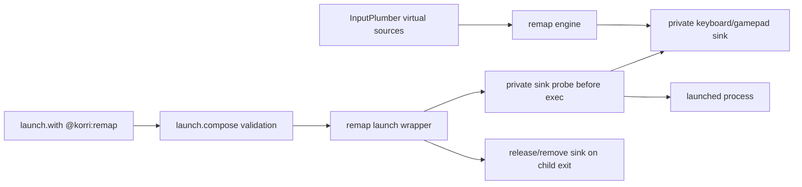

# refactor: Build Remap launch companion

## Summary

Build a general `@korri:remap` launch companion around a Remap-owned wrapper. Authored config lives under `launch.with`, uses fixed player slots (`p1`-`p4`), and supports both gamepad-to-keyboard and gamepad-to-gamepad remaps for wrapper-launched processes while preserving fail-closed launch-scoped isolation.

---

## Problem Frame

The CDP bridge direction was the wrong abstraction: it coupled Remap to Chromium instead of solving launch-scoped process input. Korri needs the durable product model to be a general process launch companion: users author controls and bindings, and the Remap wrapper proves or refuses an isolated sink before the child process starts.

---

## Requirements

- R1. Replace the CDP-shaped input bridge work with single-word provider id `@korri:remap`.
- R2. Author remap policy under `launch.with."@korri:remap"`, following the Gamescope launch companion convention.
- R3. Keep authored config and Remap implementation free of CDP, Chrome, Chromium, browser-target, profile, and preset concepts.
- R4. Support fixed player slots `p1` through `p4` in one launch policy; arbitrary controller ids are out of scope for v1.
- R5. Support explicit dot-path bindings such as `p1.dpad.down: key.down`.
- R6. Use kebab-case for authored multi-word identifiers.
- R7. Support gamepad-to-keyboard bindings for wrapper-launched processes.
- R8. Support gamepad-to-gamepad bindings for native wrapper-launched processes.
- R9. Consume only InputPlumber-normalized controller sources by default; do not regress to raw physical gamepad reads.
- R10. Preserve strong launch-scoped fail-closed behavior: if source resolution, sink isolation, attach, bridge readiness, or cleanup cannot be proven, the launch must not proceed or must terminate safely.
- R11. Preserve YFS as the first concrete consumer while removing YFS-specific mapping presets from authored config.
- R12. Treat native v1 as wrapper-only: Remap supports arbitrary native processes only when they are launched through the Remap-owned wrapper.
- R13. Require Sobo validation before Remap support is considered complete.
- R14. Run a native wrapper sink spike first; do not proceed to product implementation until it proves keyboard and gamepad output isolation.

---

## Scope Boundaries

- No user-facing remap editor UI.
- No runtime profile system.
- No arbitrary controller ids in v1; only `p1`, `p2`, `p3`, and `p4` are valid authored controller slots.
- No direct native Remap support for processes that bypass the Remap-owned wrapper.
- No global InputPlumber profile switching.
- No ambient host-seat keyboard mapper as an acceptable product path.
- No raw `/dev/input/event*` physical gamepad source reads.
- No public config fields or internal Remap backend named after CDP, Chrome, Chromium, or browser internals.

### Deferred to Follow-Up Work

- Broader catalog migration beyond YFS: migrate additional keyboard-only games once `@korri:remap` is validated.
- Runtime live-control UI for remap state: add only after the launch-time contract is stable.
- Browser/page-targeted delivery: do not build a CDP backend; browser games must go through the same process/wrapper model unless a future non-CDP isolated sink is proven.

---

## Context & Research

### Relevant Code and Patterns

- `product/platform/plugin/launch-companion.ts` is the generic `launch.with` composition seam and already produces structured diagnostics for missing, disabled, or invalid providers.
- `product/plugins/gamescope/src/launch-companion/policy.ts` is the policy-shape precedent: provider-owned schema, defaults, and launch companion extraction under `launch.with."@korri:gamescope"`.
- `product/platform/plugin/catalog-library-source.ts` already forwards plugin catalog `launch.with` to `ResolvedLaunch.launchCompanions`.
- `product/platform/control/korri-control-live.ts` composes launch companions before spawn and passes launch metadata into compose handlers.
- `product/platform/plugin/session-lifecycle.ts` is the sidecar lifecycle seam that can fail launch, start after child running, and stop before cleanup.
- `product/plugins/cdp-input-bridge/**` is prior work to remove or discard from the public/product path; do not carry its CDP backend forward into Remap.
- `product/platform/input/native/inputplumber-virtual-gamepad.ts` contains the current InputPlumber virtual-controller resolver and fail-closed ambiguity behavior.
- `product/plugins/yoshis-fabrication-station/index.ts` is the first catalog consumer and currently exposes the wrong CDP-shaped metadata.

### Institutional Learnings

- `docs/solutions/architecture-patterns/gamescope-as-plugin-owned-composition-2026-06-17.md` establishes the rule: plugin-owned launch behavior is authored under `launch.with.<provider-id>`, not top-level core fields or generic metadata annotations.
- `docs/solutions/architecture-patterns/sessiond-operator-model-2026-05-29.md` establishes sessiond as the lifecycle authority; remap sidecars must integrate with session lifecycle rather than owning foreground state themselves.
- `docs/solutions/integration-issues/steam-uinput-permissions-block-virtual-xinput-2026-06-13.md` shows that virtual gamepad output depends on `/dev/uinput` permissions and must prove both source and synthesis sides of the chain.
- `docs/solutions/architecture-patterns/steam-inside-gamescope-preserves-steam-input-2026-06-15.md` warns that input routing across Gamescope/Steam/session boundaries is fragile; native gamepad sinks need explicit isolation proof, not assumptions.

### External References

- External research skipped: the repo already has strong local plugin, launch companion, session lifecycle, and input-device patterns; the risky part is local device isolation, not a missing framework convention.

---

## Key Technical Decisions

- Use `@korri:remap` as the provider id: short, single-word, product-facing, and not tied to a backend.
- Make a clean break from `@korri:cdp-input-bridge`: no authored compatibility path and no CDP backend reuse in Remap.
- Treat `@korri:remap` primarily as a launch companion: compose-time validation catches bad config, and the Remap-owned wrapper creates/probes isolated input before exec.
- Avoid `launchMetadata.annotations` for behavior. If any lifecycle hook remains necessary, it must receive provider-keyed `launch.with` policy generically rather than reading annotations.
- Use a remap-owned launch wrapper for native v1; “any process” means any process launched through this wrapper with private input isolation proven before exec.
- Require native v1 to support both keyboard and gamepad output; do not call native Remap complete if only gamepad output is proven.
- Use fixed controller slots `p1`-`p4` for v1 instead of arbitrary controller names.
- Model remaps as controller-slot dot paths to target dot paths: this keeps common cases compact while supporting multi-controller bindings and gamepad targets.
- Split remap into source, binding graph, and private wrapper sink adapters; all delivery must be process-scoped and non-global.
- Make Sobo validation a completion gate: keyboard and gamepad delivery to the wrapped process, no delivery to Korri UI, and cleanup after child exit must be proven before the plan is done.
- Use the validated native wrapper candidate from the spike: hidden uinput devices marked ignored for libinput, ACLs stripped, access granted only to a dedicated launch identity, and child processes run under that identity/private context.
- Keep YFS-authored bindings explicit: no `yfs-default` preset in public config, even if tests use shared fixtures internally.

---

## Open Questions

### Resolved During Planning

- Should native/gamepad sink support land now or later? Resolved: plan native gamepad and keyboard sinks now, but only for processes launched through the Remap-owned wrapper.
- Should CDP appear anywhere in Remap? Resolved: no; CDP was a mistake for this product path and must be removed rather than hidden.
- Should old `@korri:cdp-input-bridge` config stay compatible? Resolved: no, make a clean break to `@korri:remap`.
- Is a spike needed? Resolved: yes, run the native wrapper sink spike before product implementation.
- Should controller ids be arbitrary? Resolved: no, v1 uses fixed `p1`-`p4` slots.
- Is Sobo validation required? Resolved: yes, native support is not complete without on-device proof of delivery, non-global behavior, and cleanup.
- Which native sink shape is viable? Resolved by spike: a privileged Remap wrapper can create hidden synthetic devices, strip ambient ACLs, grant access to a dedicated launch identity, and keep Korri/Sway from observing events while the dedicated launch user receives keyboard and gamepad events.

### Deferred to Implementation

- Exact production identity/permission names for the dedicated launch user and group: implementation should replace the spike's `nobody` stand-in with a product-owned identity.
- Exact sink mechanism names in diagnostics: provider-facing diagnostics should explain remap/source/sink status without exposing backend internals in authored config.

---

## Output Structure

    product/plugins/remap/
      index.ts
      plugin.test.ts
      README.md
      nix/remap.nix
      packages/korri-remap-bridge/
        index.ts
        package.json
      src/
        policy.ts
        policy.test.ts
        control-ref.ts
        control-ref.test.ts
        bindings.ts
        bindings.test.ts
        sources.ts
        sources.test.ts
        sinks.ts
        sinks.test.ts
        bridge-process.ts
        bridge-process.test.ts
        session-lifecycle-hook.ts
        session-lifecycle-hook.test.ts
        diagnostics.ts
        diagnostics.test.ts

---

## High-Level Technical Design

> *This illustrates the intended approach and is directional guidance for review, not implementation specification. The implementing agent should treat it as context, not code to reproduce.*

Authored shape:

```yaml
launch:
  with:
    "@korri:remap":
      controllers:
        p1:
          source: inputplumber-virtual-gamepad
          prefer:
            name: microsoft-xbox-series-s-x-controller
        p2:
          source: inputplumber-virtual-gamepad
          prefer:
            name: second-inputplumber-controller
      bindings:
        p1.dpad.up: key.up
        p1.dpad.down: key.down
        p1.dpad.left: key.left
        p1.dpad.right: key.right
        p1.button.west: key.z
        p1.button.south: key.a
        p1.button.east: p1.button.south
        p2.button.south: p2.button.east
```

Flow:



The same binding graph should drive keyboard and gamepad target events through the Remap wrapper. If the wrapper cannot prove a private launch-scoped sink for the requested target type before exec, `@korri:remap` returns diagnostics or fails launch.

---

## Implementation Units

### U9. Spike private Remap wrapper sink

**Goal:** Prove the native wrapper can deliver keyboard and gamepad output only to the wrapped process, with cleanup on exit, before productizing the Remap implementation.

**Requirements:** R7, R8, R10, R12, R13, R14

**Dependencies:** None

**Files:**
- Create: `product/plugins/remap/spikes/native-wrapper/README.md`
- Create: `product/plugins/remap/spikes/native-wrapper/wrapper.ts`
- Create: `product/plugins/remap/spikes/native-wrapper/input-probe.ts`
- Create: `product/plugins/remap/spikes/native-wrapper/validate-sobo.sh`

**Approach:**
- Build a minimal wrapper-shaped spike, not the final product plugin.
- The wrapper must create/probe the private keyboard and gamepad sink before launching the probe process.
- The probe process must log which keyboard and gamepad events it receives at startup and during runtime.
- The validation must also observe Korri UI or an equivalent sentinel and prove remapped output does not leak there.
- If the spike cannot prove private delivery and cleanup, stop and revise the product plan rather than implementing a global mapper.

**Patterns to follow:**
- `docs/solutions/integration-issues/steam-uinput-permissions-block-virtual-xinput-2026-06-13.md`
- `docs/solutions/architecture-patterns/sessiond-operator-model-2026-05-29.md`
- `product/platform/input/native/inputplumber-virtual-gamepad.ts`

**Test scenarios:**
- Happy path: wrapped probe receives keyboard target events generated from controller input.
- Happy path: wrapped probe receives gamepad target events generated from controller input.
- Isolation: Korri UI or a sentinel process outside the wrapper does not receive remapped keyboard or gamepad output.
- Cleanup: after child exit or forced kill, remap output stops and target devices/handles are released.
- Error path: if private sink setup fails, the child process is not launched.

**Verification:**
- Sobo validation produces durable evidence for keyboard delivery, gamepad delivery, non-global behavior, and cleanup; otherwise implementation must not proceed.
- Current spike evidence lives in `product/plugins/remap/spikes/native-wrapper/sobo-dedicated-wrapper-result.json` and shows the dedicated launch user received keyboard/gamepad events while Korri readers got access denied and Sway did not list the synthetic devices.

---

### U1. Define Remap provider and authored policy grammar

**Goal:** Introduce `@korri:remap` as the public provider and define the compact, backend-neutral policy model.

**Requirements:** R1, R2, R3, R4, R5, R6, R7, R8, R11

**Dependencies:** U9

**Files:**
- Create: `product/plugins/remap/index.ts`
- Create: `product/plugins/remap/src/policy.ts`
- Create: `product/plugins/remap/src/control-ref.ts`
- Create: `product/plugins/remap/src/bindings.ts`
- Test: `product/plugins/remap/plugin.test.ts`
- Test: `product/plugins/remap/src/policy.test.ts`
- Test: `product/plugins/remap/src/control-ref.test.ts`
- Test: `product/plugins/remap/src/bindings.test.ts`
- Modify: `product/plugins/index.ts`
- Modify: `product/plugins/index.test.ts`

**Approach:**
- Add a new first-party plugin with provider id `@korri:remap`.
- Decode strict provider-owned policy from `launch.with."@korri:remap"`.
- Accept optional `controllers` keyed only by fixed player slots `p1`, `p2`, `p3`, and `p4`.
- Accept `bindings` as a map from source control refs to target control refs or target-ref arrays.
- Parse refs by namespace: controller refs (`p1.dpad.down`, `p1.button.south`, `p1.stick.left.up`) and keyboard refs (`key.down`, `key.z`, `key.enter`).
- Canonicalize keyboard aliases so `key.up/down/left/right` map to keyboard arrow events internally.
- Reject preset/profile fields and backend-named fields, including `browser-target`.

**Execution note:** Implement policy decoding test-first because this is the new public contract.

**Patterns to follow:**
- `product/plugins/gamescope/src/launch-companion/policy.ts`
- `product/platform/plugin/launch-companion.ts`

**Test scenarios:**
- Happy path: a minimal policy with only `bindings` decodes and defaults `p1` to an InputPlumber virtual gamepad source.
- Happy path: a policy with `p1` and `p2` controllers decodes distinct controller slots and preferences.
- Happy path: `p1.dpad.down: key.down` canonicalizes to a keyboard down-arrow target without exposing `arrow` in authored config.
- Happy path: `p1.button.east: p1.button.south` decodes as a gamepad-to-gamepad binding.
- Edge case: one source binding maps to an array of targets and preserves target order.
- Error path: malformed refs, unknown namespaces, empty controller ids, arbitrary controller ids, `p5`, and non-kebab multi-word names are rejected.
- Error path: `cdp`, `chrome`, `chromium`, `browser-target`, `profile`, or `preset` policy fields are rejected as excess properties.
- Error path: bindings referring to undefined explicit controllers are rejected.

**Verification:**
- `@korri:remap` is registered as a first-party plugin and the policy tests document the public YAML shape.

---

### U2. Route launch companion policy into session lifecycle hooks

**Goal:** Make `launch.with` policy available to session lifecycle hooks generically so `@korri:remap` does not need authored launch metadata annotations.

**Requirements:** R2, R3, R10

**Dependencies:** U1

**Files:**
- Modify: `product/platform/plugin/session-lifecycle.ts`
- Modify: `product/platform/library/launcher.ts`
- Modify: `product/platform/library/sessiond-managed-launch-protocol.ts`
- Modify: `product/platform/library/sessiond-managed-launch-protocol.test.ts`
- Modify: `product/platform/library/sessiond-managed-launch-client.ts`
- Modify: `product/platform/control/korri-control-live.ts`
- Modify: `product/platform/control/korri-control-live.test.ts`
- Modify: `product/services/device/sessiond.ts`
- Test: `product/platform/plugin/launch-companion.test.ts`

**Approach:**
- Extend lifecycle start and cleanup requests with a provider-keyed `launchCompanions` map.
- Add `launchCompanions` to launch extras and the managed sessiond start request/response path so `ResolvedLaunch.launchCompanions` survives local launch, sessiond launch, spawn client serialization, and cleanup.
- Preserve `launchMetadata` for descriptive metadata only; do not move authored remap config into annotations.
- Keep the extension generic: no platform or sessiond code should name `@korri:remap`.
- Ensure dry-run/prepare/compose still validate companion policies before process spawn.

**Patterns to follow:**
- `product/platform/plugin/launch-companion.ts`
- `product/platform/control/korri-control-live.ts`
- `product/platform/library/sessiond-managed-launch-protocol.test.ts`

**Test scenarios:**
- Happy path: a resolved launch carrying `launch.with."@fixture:companion"` forwards the provider map into lifecycle start requests.
- Integration: managed `launcher.spawn` protocol encodes and decodes launch companions without losing launch metadata.
- Integration: `spawnViaSessiond`, `requestSessiondManagedLaunchStart`, `startManagedLaunch`, lifecycle start, and lifecycle cleanup all preserve the provider map.
- Error path: absent launch companions remain absent and preserve current launch behavior.
- Error path: malformed managed protocol payloads with invalid companion maps are rejected strictly.
- Regression: platform/sessiond tests contain no `@korri:remap` special cases.

**Verification:**
- Lifecycle hooks can read provider-owned launch companion policy from a generic request field.

---

### U3. Support multiple InputPlumber-normalized controller sources

**Goal:** Resolve one or more launch-scoped logical controllers from InputPlumber virtual gamepads without reading raw physical devices.

**Requirements:** R4, R6, R9, R10

**Dependencies:** U1

**Files:**
- Create: `product/plugins/remap/src/sources.ts`
- Test: `product/plugins/remap/src/sources.test.ts`
- Modify: `product/platform/input/native/inputplumber-virtual-gamepad.ts` only if a small policy-free primitive is missing
- Modify: `product/platform/input/native/inputplumber-virtual-gamepad.test.ts` only with characterization coverage for that primitive
- Modify: `tools/testing/fixtures/proc/bus-input-devices-inputplumber-ambiguous.txt` if additional fixtures are needed

**Approach:**
- Keep the existing single-controller resolver behavior for current callers.
- Keep remap-owned multi-controller resolution in `product/plugins/remap/src/sources.ts`, mapping configured fixed controller slots (`p1`-`p4`) to distinct InputPlumber virtual devices.
- Normalize authored preference names to kebab-case slugs while still matching discovered device names safely.
- Preserve fail-closed ambiguity: no controller id may silently bind to a raw device or an ambiguous virtual target.
- Ensure two logical controllers cannot resolve to the same event node unless explicitly allowed by a future policy field.

**Execution note:** Start with characterization tests around the existing ambiguity behavior before extending resolution.

**Patterns to follow:**
- `product/platform/input/native/inputplumber-virtual-gamepad.test.ts`
- `product/platform/input/native/discover-devices.ts`

**Test scenarios:**
- Happy path: `p1` resolves by normalized preferred name from an otherwise ambiguous InputPlumber topology.
- Happy path: `p1` and `p2` resolve to distinct event nodes using stable normalized preferences such as `prefer.name`.
- Edge case: omitted controllers create a default `p1` source only when exactly one InputPlumber virtual gamepad exists.
- Error path: raw gamepads are never accepted as sources.
- Error path: missing preferred controller fails with a diagnostic that names the controller id.
- Error path: two controller ids resolving to the same event node fail closed.

**Verification:**
- Multi-controller source resolution is deterministic, normalized, and raw-device-safe.

---

### U4. Build the Remap engine and sink abstraction

**Goal:** Build a backend-neutral remap engine that can drive private keyboard and gamepad targets through the Remap wrapper.

**Requirements:** R5, R7, R8, R10

**Dependencies:** U1, U3

**Files:**
- Create: `product/plugins/remap/src/sinks.ts`
- Create: `product/plugins/remap/src/bridge-process.ts`
- Test: `product/plugins/remap/src/sinks.test.ts`
- Test: `product/plugins/remap/src/bridge-process.test.ts`
- Remove or replace: `product/plugins/cdp-input-bridge/src/bridge-process.ts`
- Remove or replace: `product/plugins/cdp-input-bridge/packages/korri-cdp-input-bridge/index.ts`

**Approach:**
- Build remap-owned input parsing, pressed-source tracking, axis hysteresis, and release-all behavior.
- Translate source events into canonical target events.
- Add sink interfaces for private keyboard targets and private gamepad targets.
- Keep actual sink activation disabled until U5 proves wrapper-scoped isolation.
- Treat sink capability mismatch as a launch failure, not a warning.

**Patterns to follow:**
- `product/platform/input/native/gamepad-mapper.ts`
- `product/platform/input/native/discover-devices.ts`

**Test scenarios:**
- Happy path: button press/release produces keyboard target down/up events.
- Happy path: button press/release produces gamepad target down/up events.
- Happy path: one source mapped to multiple targets presses and releases all targets.
- Happy path: overlapping sources mapped to the same target keep the target pressed until all sources release.
- Edge case: stick direction changes release the old direction before pressing the new direction.
- Edge case: release threshold prevents jitter around neutral.
- Error path: requested keyboard target on a sink that only supports gamepad fails before event handling.
- Error path: requested gamepad target on a sink that only supports keyboard fails before event handling.
- Cleanup: `releaseAll` releases every pressed keyboard and gamepad target before bridge exit.

**Verification:**
- The remap engine has no CDP dependency and can target both private keyboard and private gamepad sink interfaces.

---

### U5. Prove and implement native launch-scoped sink isolation

**Goal:** Add shippable native process support for both gamepad-to-gamepad and gamepad-to-keyboard remaps through a Remap-owned wrapper that proves isolation before child startup.

**Requirements:** R7, R8, R10, R12, R13

**Dependencies:** U1, U4

**Files:**
- Create: `product/plugins/remap/packages/korri-remap-bridge/index.ts`
- Create: `product/plugins/remap/packages/korri-remap-bridge/package.json`
- Create: `product/plugins/remap/nix/remap.nix`
- Test: `product/plugins/remap/src/native-sink.test.ts`
- Test: `product/plugins/remap/src/launch-wrapper.test.ts`
- Test: `product/plugins/remap/src/sinks.test.ts`
- Modify: `product/systems/nixos/**` only where product composition exposes plugin-owned Remap runtime assets

**Approach:**
- Implement native sink setup through a remap-owned launch wrapper so isolated keyboard and gamepad target devices exist before the child process enumerates input.
- Treat `/dev/uinput` access as necessary but not sufficient: tests and validation must prove the host Korri UI cannot observe remap output after launch cleanup begins or after the child exits.
- Preserve sessiond process-group ownership: the wrapper must `exec` or supervise the child in a way that keeps termination and cleanup behavior compatible with managed launches.
- Productize the spike-proven mechanism: install a Remap-owned udev rule for Remap synthetic devices, create uinput devices, strip ambient ACLs after creation, grant access only to the dedicated launch identity, disable any matching Sway input as a safety belt, then launch the child under that identity/private context.
- If private device setup or runtime routing cannot be proven for either keyboard or gamepad target output, native Remap v1 is incomplete and the adapter must refuse the target type with diagnostics.
- Keep any raw uinput or private-seat mechanism behind plugin-owned package/Nix code; generic platform code should see only provider diagnostics and lifecycle handles.

**Execution note:** Characterization-first on device: prove non-global delivery and cleanup before enabling native sink success paths in product composition.

**Patterns to follow:**
- `docs/solutions/integration-issues/steam-uinput-permissions-block-virtual-xinput-2026-06-13.md`
- `docs/solutions/architecture-patterns/sessiond-operator-model-2026-05-29.md`
- `product/plugins/gamescope/src/session/lifecycle-hook.ts`
- `product/platform/input/native/inputplumber-virtual-gamepad.test.ts`

**Test scenarios:**
- Happy path: a native sink capability reports support for keyboard and gamepad targets and accepts both gamepad-to-keyboard and gamepad-to-gamepad bindings.
- Happy path: native wrapper creates/probes the private sink before child startup and then launches the child under the same managed process group.
- Integration: a native fixture child that enumerates input at process start sees only the private remap sink expected for the launch.
- Cleanup: wrapper/bridge teardown releases targets before sessiond restores Korri UI.
- Error path: missing private sink capability fails in the wrapper before child input is exposed.
- Error path: `/dev/uinput` present but not isolated fails closed for keyboard targets.
- Error path: sink isolation probe failure produces structured diagnostics and no launched-game input sidecar remains.
- On-device validation: physical controller input affects the launched native test process through both keyboard and gamepad target outputs and not Korri home; after killing the child, no remap output reaches Korri UI.

**Verification:**
- Native Remap support only succeeds through the Remap wrapper with explicit private launch input context evidence for keyboard and gamepad outputs; otherwise launches fail closed.

---

### U6. Replace CDP bridge plugin with Remap plugin

**Goal:** Remove the CDP-shaped plugin path and register `@korri:remap` as the product-owned launch companion.

**Requirements:** R1, R2, R3, R7, R10

**Dependencies:** U1, U2, U3, U4, U5

**Files:**
- Create: `product/plugins/remap/src/session-lifecycle-hook.ts`
- Test: `product/plugins/remap/src/session-lifecycle-hook.test.ts`
- Create: `product/plugins/remap/src/diagnostics.ts`
- Test: `product/plugins/remap/src/diagnostics.test.ts`
- Modify: `product/plugins/index.ts`
- Modify: `product/plugins/index.test.ts`
- Remove: `product/plugins/cdp-input-bridge/**` after Remap coverage exists; do not leave an authored compatibility provider

**Approach:**
- Register the Remap plugin in the first-party plugin registry.
- Read policy from `launch.with` / launch companions, not `launchMetadata.annotations`.
- Compose the Remap wrapper only when `@korri:remap` is enabled and validated.
- Preserve fail-launch semantics, wrapper readiness/probe failure handling, unexpected-exit termination, and cleanup behavior.
- Rename diagnostics to remap concepts: policy, controllers, bindings, source resolution, sink capability, isolation, and sidecar status.
- Keep developer diagnostics able to name the internal backend when necessary, but never require authored backend fields.

**Patterns to follow:**
- `product/plugins/gamescope/src/plugin.ts`
- `product/platform/plugin/launch-companion.ts`

**Test scenarios:**
- Happy path: launch companion composes the Remap wrapper from `launch.with."@korri:remap"`.
- Happy path: disabled remap policy is skipped.
- Integration: compose-time policy validation and lifecycle-time startup consume the same provider-keyed policy shape.
- Error path: ambiguous source selection fails launch.
- Error path: unsupported sink target fails launch.
- Error path: wrapper exits before readiness/probe success and the launch fails closed.
- Cleanup: unexpected wrapper exit terminates the launched session unless cleanup is already underway.
- Regression: no test requires authored `launchMetadata.annotations."@korri:cdp-input-bridge"` or `launch.with."@korri:cdp-input-bridge"`.

**Verification:**
- `@korri:remap` owns wrapper composition and diagnostics, and the old CDP-named provider is removed from the product path.

---

### U7. Migrate YFS to explicit Remap bindings

**Goal:** Update Yoshi's Fabrication Station to consume `@korri:remap` through the wrapper with explicit bindings and no CDP-shaped config.

**Requirements:** R2, R3, R5, R7, R10, R11

**Dependencies:** U1, U2, U6

**Files:**
- Modify: `product/plugins/yoshis-fabrication-station/index.ts`
- Modify: `product/plugins/yoshis-fabrication-station/plugin.test.ts`
- Modify: `product/plugins/yoshis-fabrication-station/yfs` if runtime env names change
- Test: `product/plugins/yoshis-fabrication-station/plugin.test.ts`

**Approach:**
- Replace `launchMetadata.annotations."@korri:cdp-input-bridge"` with `launch.with."@korri:remap"`.
- Write explicit YFS bindings in the compact dot-path map.
- Route YFS through the same Remap wrapper model; do not add browser/CDP-specific Remap configuration.
- Update plugin requirements to depend on `@korri:remap` session lifecycle / launch compose capability.
- Remove public `mapping: yfs-default` usage.

**Patterns to follow:**
- `product/plugins/yoshis-fabrication-station/index.ts`
- `product/plugins/yoshis-fabrication-station/plugin.test.ts`
- `docs/research/yoshis-fabrication-station-browser-runtime-capture.md` only as historical context for YFS controls, not as a CDP backend precedent

**Test scenarios:**
- Happy path: YFS release has `launch.with."@korri:remap"` with explicit D-pad, button, and start bindings.
- Happy path: YFS requires `@korri:remap`, not `@korri:cdp-input-bridge`.
- Regression: serialized YFS launch config contains no `cdp`, `chrome`, `chromium`, `browser-target`, `mapping`, `preset`, or `profile` remap fields.
- Integration: YFS launch uses the Remap wrapper path rather than a page/debug-protocol adapter.
- Integration: resolving the YFS plugin catalog entry carries remap launch companions through `ResolvedLaunch`.

**Verification:**
- YFS remains launchable through the plugin catalog and its remap policy matches the compact authored shape.

---

### U8. Package, document, and validate Remap on device

**Goal:** Provide plugin-owned package/Nix wiring, concise docs, and Sobo validation covering the Remap wrapper path.

**Requirements:** R1, R3, R7, R8, R9, R10

**Dependencies:** U5, U6, U7

**Files:**
- Create: `product/plugins/remap/README.md`
- Modify: `product/plugins/remap/nix/remap.nix`
- Modify: `product/systems/nixos/**` only at plugin composition points needed to expose remap assets
- Test: `product/plugins/remap/plugin.test.ts`
- Test: `product/plugins/remap/src/diagnostics.test.ts`

**Approach:**
- Package the Remap wrapper as plugin-owned runtime code.
- Keep wrapper command selection plugin-owned and injected through composition, not hard-coded in generic platform code.
- Document the authored YAML shape and explicitly state that sink setup is wrapper-owned and fail-closed.
- Include validation notes for: source selection, keyboard sink, gamepad sink, lifecycle cleanup, and non-global delivery.
- Require native wrapper evidence before claiming arbitrary-process support.

**Patterns to follow:**
- `docs/solutions/architecture-patterns/gamescope-as-plugin-owned-composition-2026-06-17.md`
- `docs/solutions/integration-issues/steam-uinput-permissions-block-virtual-xinput-2026-06-13.md`

**Test scenarios:**
- Happy path: diagnostics report enabled remap policy, controller ids, binding counts, and sink support.
- Error path: diagnostics report invalid bindings without throwing.
- Error path: diagnostics report missing native isolation capability distinctly from missing InputPlumber source.
- Documentation smoke: examples show `@korri:remap` under `launch.with`, use only `p1`-`p4` controller slots, and contain no authored CDP/Chrome/browser-target fields.

**Verification:**
- Remap package and docs are plugin-owned, and required Sobo validation proves wrapper-launched processes obey launch-scoped delivery and cleanup.

---

## System-Wide Impact

- **Interaction graph:** Library resolution carries `launch.with` to launch companion composition; control live/sessiond forwards it to lifecycle hooks; Remap sidecar consumes InputPlumber sources and emits only through selected launch-scoped sinks.
- **Error propagation:** Bad policy, missing plugin, unsupported sink, source ambiguity, readiness timeout, and isolation failure should return structured launch diagnostics or fail launch before Korri UI is exposed to leaked mappings.
- **State lifecycle risks:** Held target inputs must release on normal cleanup, child death, bridge death, attach failure, and timeout; failure to release is a launch-fatal condition.
- **API surface parity:** Dry-run and actual launch must both validate `@korri:remap`; local and managed sessiond paths must carry the same companion policy.
- **Integration coverage:** Unit tests prove schema/engine behavior; lifecycle tests prove fail-closed sidecar behavior; Sobo validation proves non-global delivery.
- **Unchanged invariants:** Gamescope stays authored under `launch.with."@korri:gamescope"`; generic platform code remains provider-keyed and must not special-case Remap; existing InputPlumber raw-device rejection remains intact.

---

## Risks & Dependencies

| Risk | Mitigation |
|------|------------|
| Native sink isolation cannot be proven safely | Keep the contract but fail closed; do not call native v1 complete and do not ship a host-seat mapper as success. |
| uinput permissions are mistaken for isolation | Require explicit non-global delivery validation; treat `/dev/uinput` access as only one prerequisite. |
| The compact binding map cannot express multi-target mappings | Allow binding values to be a string or array of strings. |
| Replacing the CDP path breaks existing YFS launch | Migrate YFS tests first and route YFS through the Remap wrapper; do not keep a CDP adapter as fallback. |
| Platform code becomes Remap-aware | Add tests and review guidance that platform/sessiond only carry provider-keyed maps generically. |
| Multi-controller resolution accidentally grabs raw devices | Extend source resolver tests with raw-device and ambiguity fixtures. |

---

## Documentation / Operational Notes

- Document `@korri:remap` as a launch companion, not as a global input feature.
- Document that wrapper sink setup is internal and may fail closed when it cannot provide an isolated sink.
- Require Sobo validation notes and evidence before declaring arbitrary native wrapper process support complete.
- Mention that the old `@korri:cdp-input-bridge` direction was replaced by `@korri:remap`; do not document it as supported compatibility.

---

## Sources & References

- Related code to remove/replace: `product/plugins/cdp-input-bridge/**`
- Related code: `product/plugins/gamescope/src/launch-companion/policy.ts`
- Related code: `product/platform/plugin/launch-companion.ts`
- Related code: `product/platform/plugin/session-lifecycle.ts`
- Related code: `product/platform/control/korri-control-live.ts`
- Related code: `product/platform/input/native/inputplumber-virtual-gamepad.ts`
- Related code: `product/plugins/yoshis-fabrication-station/index.ts`
- Institutional learning: `docs/solutions/architecture-patterns/gamescope-as-plugin-owned-composition-2026-06-17.md`
- Institutional learning: `docs/solutions/architecture-patterns/sessiond-operator-model-2026-05-29.md`
- Institutional learning: `docs/solutions/integration-issues/steam-uinput-permissions-block-virtual-xinput-2026-06-13.md`
