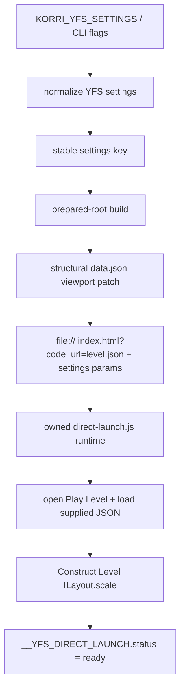

# feat: Add YFS viewport and engine zoom runtime config

## Summary

Add first-class YFS launcher configuration for viewport/aspect and Construct engine zoom. The plan keeps boot-time viewport facts in prepared-root JSON metadata, applies zoom through owned in-page runtime code, and guards against expanding generated Construct patches.

---

## Problem Frame

The packaged YFS launcher now boots supplied level JSON from `file://` without CDP mouse clicks. Square/aspect experiments showed that changing the Construct viewport can make the game feel zoomed out, while live Sobo probing confirmed the `Level` layout exposes a public `ILayout.scale` engine-zoom seam. The next slice needs to make those controls durable at config level without turning every YFS upgrade into a fragile generated-code patch exercise.

---

## Requirements

- R1. YFS launcher settings expose viewport/aspect intent and Construct engine zoom at config level, with CLI overrides for local testing.
- R2. Browser zoom and CSS-only canvas scaling are not accepted as the primary zoom mechanism; zoom must use Construct layout scale through the in-page runtime.
- R3. Default zoom is aspect-aware rather than a raw fixed `1`, using native YFS `832x448` as the reference and allowing a multiplier.
- R4. Fixed zoom override is supported for calibration and per-release/device tuning.
- R5. Viewport/aspect changes are cache-keyed so prepared roots cannot be reused across incompatible viewport metadata.
- R6. The source YFS webroot is never mutated at launch time; viewport changes apply only to prepared-root copies.
- R7. Runtime behavior lives in owned YFS scripts (`direct-launch-pre.js` / `direct-launch.js`) rather than CDP click automation or new `c3main.js` patches.
- R8. Existing launch invariants remain: `file://` launch, no HTTP server, no duplicate CDP shims, no CDP mouse clicks in `yfs-launch.ts`, and no `preserveDrawingBuffer` on the `yfs-launch` path; this includes the packaged `direct-launch-pre.js` script that currently runs for `code_url` launches.
- R9. Package/Nix checks, manifest metadata, plugin descriptors, and tests all reflect the new settings surface.
- R10. Sobo validation proves a configured square viewport reaches gameplay unattended, applies the expected Construct layout scale, and does not stretch the canvas.

---

## Scope Boundaries

- This plan does not add browser/page zoom.
- This plan does not introduce localhost HTTP serving for YFS.
- This plan does not replace YFS with a libretro/core-extraction boot path.
- This plan does not change Level Share Square acquisition, catalog modeling, or bundled level content.
- This plan does not expose `@korri:web-canvas` as the public YFS authoring surface.
- This plan does not productize a general web-game viewport/zoom API outside the YFS plugin.
- This plan does not make CDP input automation part of the launch path.

### Deferred to Follow-Up Work

- Runtime replacement for the existing `c3main.js` setting-read patch: backlog `01KVR43FHRSBD0WQAV0BY51CQC`.
- Generalize viewport/engine-zoom controls to other Construct/web-canvas games after YFS proves the product shape.
- Explore core-extraction/direct Construct gameplay boot separately from viewport and zoom configuration.

---

## Context & Research

### Relevant Code and Patterns

- `product/plugins/yoshis-fabrication-station/src/launcher/settings-runtime.ts` owns dependency-light runtime settings normalization, URL query projection, JSON env parsing, and stable settings cache keys.
- `product/plugins/yoshis-fabrication-station/src/launcher/settings.ts` provides strict Effect Schema validation and should mirror runtime settings exactly.
- `product/plugins/yoshis-fabrication-station/src/launcher/cache.ts` builds prepared roots keyed by launcher version, webroot identity, level digest, and `stableSettingsKey(settings)`.
- `product/plugins/yoshis-fabrication-station/scripts/direct-launch.js` is the owned in-page launch/runtime script that now handles title-to-Play-Level transition and supplied level loading.
- `product/plugins/yoshis-fabrication-station/scripts/direct-launch-pre.js` and `scripts/yfs-launch-settings.js` show the existing query-param-to-YFS-settings pattern.
- `product/plugins/yoshis-fabrication-station/tools/patch-c3main.mjs` currently patches only static Construct setting reads after `package.nix` prettifies `scripts/c3main.js`.
- `product/plugins/yoshis-fabrication-station/package.nix` owns upstream webroot packaging, WebView2→HTML5 compatibility, `data.json` direct-launch seam patches, `c3main.js` setting hooks, script injection, wrapper generation, and manifest metadata.
- `product/plugins/yoshis-fabrication-station/check.nix` is the static package-shape guard surface for wrapper env, script presence, manifest strings, and no-`preserveDrawingBuffer` invariants.
- `product/plugins/yoshis-fabrication-station/src/launcher/loader-shim.test.ts` uses source-level invariant tests for browser scripts.
- `product/plugins/yoshis-fabrication-station/src/launcher/yfs-launch.test.ts`, `settings.test.ts`, `cache.test.ts`, and `validate.test.ts` are the colocated launcher behavior tests to extend.
- `product/plugins/yoshis-fabrication-station/plugin.test.ts` asserts descriptor shape and must track new public settings descriptors.
- `docs/research/yoshis-fabrication-station-browser-runtime-capture.md` records YFS runtime evidence and should capture the viewport/zoom proof.

### Institutional Learnings

- `docs/solutions/architecture-patterns/korri-plugin-architecture-2026-06-02.md` — first-party plugin behavior and settings belong under the plugin, not in generic platform layers.
- `docs/solutions/architecture-patterns/gamescope-as-plugin-owned-composition-2026-06-17.md` — plugin-owned policy payloads should flow through host seams without generic platform code naming plugin-specific fields.
- `docs/solutions/design-patterns/explicit-cascade-folded-policy-over-incidental-signal-heuristics-2026-05-27.md` — make intent explicit in policy/settings instead of sniffing runtime signals or relying on invisible heuristics.
- `docs/solutions/runtime-errors/retroarch-bare-passthru-wrapper-injects-l-coredir-2026-05-27.md` — compose owned behavior explicitly and add guard comments/tests for helper or wrapper traps.
- `docs/solutions/architecture-patterns/architectural-posture-as-nix-image-default-2026-05-27.md` — device/image-specific defaults belong at image/config level, not in neutral reusable module defaults.

### External References

None. Local package/runtime evidence and Sobo experiments are more actionable than generic Construct guidance for this slice.

---

## Key Technical Decisions

- **Separate viewport from zoom.** Viewport/aspect is boot-time Construct project metadata; zoom is runtime `ILayout.scale`. They share settings but use different application points.
- **Use native YFS `832x448` as the reference frame.** Auto zoom uses the configured viewport relative to that native area; fixed zoom bypasses the formula.
- **Default zoom mode is `auto-area`.** For viewport `w x h`, compute a scale equivalent to the square root of the configured viewport area divided by native viewport area, then apply an optional multiplier. This preserves roughly comparable visible world area while allowing aspect shape to change.
- **Fixed zoom is an explicit override.** A fixed scale supports calibration values such as `0.5`, `1.35`, `1.857`, or `3.0` without changing viewport metadata.
- **Patch `data.json` structurally in prepared roots for viewport metadata.** Parse JSON, validate the expected top-level `project` shape, update only `project[10]`, `project[11]`, and `project[12]`, and write the prepared copy. Do not text-substitute upstream source.
- **Apply zoom in `direct-launch.js` after the Level layout exists.** Use a small runtime-access helper around the observed Construct runtime bridge (`c3_runtimeInterface`) and set the public `GetILayout().scale` wrapper on the current `Level` layout; do not add CDP mouse or CSS-transform zoom.
- **Keep generated-code patching frozen.** Do not add zoom/viewport behavior to `patch-c3main.mjs`; keep the existing `c3main.js` patch for current setting reads and route runtime-replacement characterization to backlog `01KVR43FHRSBD0WQAV0BY51CQC`.
- **No duplicate CDP shim lane.** The packaged webroot already includes the owned direct-launch scripts; `yfs-launch.ts` remains a launcher/readiness observer and does not inject a second competing loader.
- **Settings are cache-significant.** Viewport and zoom participate in `stableSettingsKey` so prepared roots and URLs stay aligned.

---

## Open Questions

### Resolved During Planning

- Should zoom use browser zoom? **No.** The user explicitly rejected browser zoom; live probing confirmed Construct layout scale is available.
- Should zoom be a `data.json` patch? **No.** Construct initializes layout scale to `1`; use runtime `ILayout.scale` after gameplay starts.
- Should viewport be runtime-only? **No for this slice.** The stable path is structural prepared-root metadata patching because Construct uses project viewport/fullscreen settings during boot.
- Should the default zoom stay `1`? **No.** The default should compensate for aspect/area changes, with fixed override for calibration.
- Should this update the existing original YFS launcher plan? **No.** The user chose a new follow-up active plan.

### Deferred to Implementation

- Exact config descriptor UI labels and help text: keep them concise and aligned with existing YFS settings descriptors.
- Exact zoom rounding precision: choose a stable rounding policy before cache key/query projection so computed floats are deterministic.
- Whether the existing `c3main.js` setting patch can be eliminated: characterize separately and fall back to retaining the current patch if timing or Construct internals make the runtime hook brittle.
- Exact Sobo default values: validate `auto-area` first, then tune image/local config with a multiplier or fixed scale if handheld feel warrants it.

---

## High-Level Technical Design

> *This illustrates the intended approach and is directional guidance for review, not implementation specification. The implementing agent should treat it as context, not code to reproduce.*

| Setting shape | Prepared-root effect | Runtime effect |
|---|---|---|
| no viewport, no zoom | native `832x448`, fullscreen mode `4` | auto zoom resolves to `1` |
| viewport aspect/policy | patches `project[10]`, `project[11]`, `project[12]` | auto zoom uses resolved viewport |
| zoom auto + multiplier | no additional file patch beyond viewport | applies computed `ILayout.scale` |
| zoom fixed | no additional file patch beyond viewport | applies fixed `ILayout.scale` |

---

## Implementation Units

### U1. Extend YFS settings for viewport and zoom policy

**Goal:** Add a validated, cache-keyed settings model for viewport/aspect and zoom without changing launch behavior yet.

**Requirements:** R1, R3, R4, R5, R9

**Dependencies:** None

**Files:**
- Modify: `product/plugins/yoshis-fabrication-station/src/launcher/settings-runtime.ts`
- Modify: `product/plugins/yoshis-fabrication-station/src/launcher/settings.ts`
- Modify: `product/plugins/yoshis-fabrication-station/src/launcher/yfs-launch.ts`
- Modify: `product/plugins/yoshis-fabrication-station/index.ts`
- Test: `product/plugins/yoshis-fabrication-station/src/launcher/settings.test.ts`
- Test: `product/plugins/yoshis-fabrication-station/src/launcher/yfs-launch.test.ts`
- Test: `product/plugins/yoshis-fabrication-station/plugin.test.ts`

**Approach:**
- Add settings for resolved viewport dimensions or an aspect/policy pair, plus zoom mode, fixed scale, and multiplier.
- Keep CLI flags as implementation/test overrides that fold over `KORRI_YFS_SETTINGS`; config/env remains the primary integration path.
- Validate viewport dimensions as positive bounded integers and zoom values as finite positive numbers within a conservative range.
- Represent default zoom as an explicit mode, not an omitted magic value, so the query/cache representation is clear.
- Include settings in URL query projection using stable, readable parameter names that the page script can parse.
- Preserve strict excess-property behavior in both runtime and Effect Schema layers.

**Patterns to follow:**
- Existing settings normalization and URL projection in `product/plugins/yoshis-fabrication-station/src/launcher/settings-runtime.ts`.
- Descriptor separation between runtime defaults and `yfsLauncherSettingDescriptors` in `product/plugins/yoshis-fabrication-station/index.ts`.

**Test scenarios:**
- Happy path: settings JSON with square viewport and `auto-area` zoom normalizes to the expected settings object and query parameters.
- Happy path: fixed zoom from CLI overrides env-provided auto zoom.
- Edge case: native viewport with default zoom computes/projections remain equivalent to scale `1` behavior.
- Error path: zero, negative, non-integer, or excessively large viewport values are rejected.
- Error path: zero, negative, non-finite, or excessively large fixed zoom values are rejected.
- Integration: plugin descriptor exposes the new YFS-specific settings without leaking generic web-canvas settings.

**Verification:**
- Settings parse, normalize, query-project, descriptor, and CLI tests cover the new public configuration surface.

---

### U2. Patch prepared-root `data.json` viewport metadata structurally

**Goal:** Make viewport/aspect changes take effect before Construct boot by patching only prepared-root copies of `data.json`.

**Requirements:** R1, R5, R6, R8, R9

**Dependencies:** U1

**Files:**
- Modify: `product/plugins/yoshis-fabrication-station/src/launcher/cache.ts`
- Modify: `product/plugins/yoshis-fabrication-station/src/launcher/validate.ts`
- Test: `product/plugins/yoshis-fabrication-station/src/launcher/cache.test.ts`
- Test: `product/plugins/yoshis-fabrication-station/src/launcher/validate.test.ts`

**Approach:**
- Add a small viewport resolver that maps settings to concrete dimensions using native `832x448` as the default.
- Support an expand-only aspect policy for square/aspect changes so UI is not clipped by default.
- During prepared-root build, parse `data.json`, validate the expected `project` array and native-compatible indices, update only viewport width, viewport height, and fullscreen mode, then write JSON back.
- Keep fullscreen mode at Construct letterbox-scale (`4`) so the canvas does not stretch.
- Include viewport settings in the prepared-root manifest expectations so incomplete or mismatched roots rebuild cleanly.
- Add an inline rationale comment near the patch explaining why viewport is a prepared-root patch while zoom is runtime injection.

**Patterns to follow:**
- Prepared-copy-only mutation and rebuild-once behavior in `product/plugins/yoshis-fabrication-station/src/launcher/cache.ts`.
- Validation style in `product/plugins/yoshis-fabrication-station/src/launcher/validate.ts`.

**Test scenarios:**
- Happy path: no viewport setting leaves `data.json` at native `832x448` and fullscreen mode `4`.
- Happy path: square expand-only settings patch `data.json` to `832x832` and fullscreen mode `4`.
- Edge case: explicit viewport dimensions patch only the intended `project` indices.
- Error path: malformed `data.json`, missing `project`, or non-array project data fails clearly before launch.
- Integration: changing viewport settings changes the cache key and prepared-root manifest; identical viewport settings reuse the same root.

**Verification:**
- Prepared roots show structurally patched viewport metadata only in the cache copy, never in the source webroot.

---

### U3. Apply aspect-aware Construct engine zoom in owned runtime JS

**Goal:** Apply default and fixed Construct layout zoom from `direct-launch.js` after YFS reaches gameplay, without CDP clicks or generated-code patches.

**Requirements:** R2, R3, R4, R7, R8, R10

**Dependencies:** U1, U2

**Files:**
- Modify: `product/plugins/yoshis-fabrication-station/scripts/direct-launch.js`
- Modify: `product/plugins/yoshis-fabrication-station/scripts/direct-launch-pre.js` if shared query parsing should live there
- Modify: `product/plugins/yoshis-fabrication-station/scripts/yfs-launch-settings.js` if `yfs-launch` query parsing needs mirrored helpers
- Test: `product/plugins/yoshis-fabrication-station/src/launcher/loader-shim.test.ts`
- Test: `product/plugins/yoshis-fabrication-station/src/launcher/yfs-launch.test.ts`

**Approach:**
- Parse zoom/viewport query parameters in owned page JS and expose diagnostic state showing requested mode, resolved scale, and whether scale was applied.
- Remove `preserveDrawingBuffer` from the `code_url`/`yfs-launch` path in `direct-launch-pre.js` so scripts used by packaged `yfs-launch` satisfy the no-preserveDrawingBuffer invariant. If any legacy branch retains that hook, it must be outside the `code_url` path and outside the static check target.
- After supplied-level gameplay reaches the `Level` layout, use the observed `c3_runtimeInterface` bridge to get the local runtime, confirm the current layout is `Level`, and set the current layout's public scale interface.
- Use fixed scale when configured; otherwise compute `auto-area` from resolved viewport dimensions and native `832x448`, with multiplier and deterministic rounding.
- Preserve current direct-launch state transitions and failure reporting; a zoom application failure should be diagnostic and explicit rather than a silent no-op.
- Do not use CSS transforms as the zoom implementation except possibly as a documented non-goal/fallback rejection.
- Do not add `Input.dispatchMouseEvent` or reintroduce `openYfsLoadUi` in `yfs-launch.ts`.

**Execution note:** Add source-level and diagnostic-state characterization before altering the launch script state machine.

**Patterns to follow:**
- `window.__YFS_DIRECT_LAUNCH` diagnostics pattern in `direct-launch.js`.
- Existing source invariant tests in `loader-shim.test.ts`.

**Test scenarios:**
- Happy path: direct-launch source contains the runtime layout-scale application path and records applied zoom diagnostics.
- Happy path: fixed zoom query takes precedence over auto zoom.
- Happy path: square `832x832` with auto-area computes a scale around `1.36` after deterministic rounding.
- Edge case: missing viewport params default to native dimensions and scale `1`.
- Error path: missing Construct runtime/layout marks zoom application failed or skipped with a diagnostic reason, not a silent ready state.
- Regression: `yfs-launch.ts` still does not contain `Input.dispatchMouseEvent` or CDP Play Level click logic.
- Regression: packaged `direct-launch-pre.js` no longer enables `preserveDrawingBuffer` for the `yfs-launch`/`code_url` path.

**Verification:**
- The page-owned runtime script applies Construct layout scale and exposes enough state for the launcher/device validation to prove it.

---

### U4. Update package, validation, and static checks for the new surface

**Goal:** Keep Nix/package metadata and validation gates aligned with the new settings and runtime hooks.

**Requirements:** R8, R9

**Dependencies:** U1, U2, U3

**Files:**
- Modify: `product/plugins/yoshis-fabrication-station/package.nix`
- Modify: `product/plugins/yoshis-fabrication-station/check.nix`
- Modify: `product/plugins/yoshis-fabrication-station/src/launcher/validate.ts`
- Test: `product/plugins/yoshis-fabrication-station/src/launcher/validate.test.ts`

**Approach:**
- Update package manifest `yfs-launch-settings` metadata to include viewport and zoom settings.
- Add static guards that the package still contains owned direct-launch scripts and the runtime zoom hook, while preserving the no-`preserveDrawingBuffer` invariant across the actual packaged `yfs-launch` path, including `direct-launch-pre.js`.
- Keep `package.nix` upstream patches narrow: WebView2/HTML5 compatibility, direct-launch seam, existing setting hooks, and script injection. Do not add zoom or viewport logic to `patch-c3main.mjs`.
- Extend `validateYfsWebroot` only for hooks that must be present at runtime; avoid making validation depend on transient implementation details.

**Patterns to follow:**
- Existing manifest/check greps in `product/plugins/yoshis-fabrication-station/check.nix`.
- Package patch rationale comments in `product/plugins/yoshis-fabrication-station/package.nix`.

**Test scenarios:**
- Happy path: compatible packaged webroot with direct-launch runtime zoom hook validates.
- Error path: webroot missing required runtime hook fails early with a clear message.
- Regression: check fixture still rejects missing `__YFSGetSetting` only while the current `c3main.js` settings patch remains required.
- Static package check expectation: no `preserveDrawingBuffer` appears in scripts used by the `yfs-launch`/`code_url` path.

**Verification:**
- Nix package build/check surfaces stale manifest, missing script, or missing hook regressions before device deployment.

---

### U5. Guard the generated-code patch boundary

**Goal:** Prevent viewport/zoom work from expanding the generated `c3main.js` patch surface.

**Requirements:** R7, R8

**Dependencies:** U3, U4

**Files:**
- Modify: `product/plugins/yoshis-fabrication-station/tools/patch-c3main.mjs`
- Modify: `product/plugins/yoshis-fabrication-station/package.nix`
- Modify: `product/plugins/yoshis-fabrication-station/README.md`
- Test: `product/plugins/yoshis-fabrication-station/src/launcher/loader-shim.test.ts`

**Approach:**
- Add or tighten comments/tests making it explicit that `patch-c3main.mjs` is not the extension point for viewport or zoom.
- Keep the existing generated-code setting hooks unchanged in this slice.
- Document that runtime replacement for existing setting hooks is deferred to backlog `01KVR43FHRSBD0WQAV0BY51CQC`.
- Ensure package/static tests fail if viewport or zoom are added to the generated-code patch key list.

**Patterns to follow:**
- Existing fail-fast occurrence-count guards in `patch-c3main.mjs`.
- README patch-strategy explanation in `product/plugins/yoshis-fabrication-station/README.md`.

**Test scenarios:**
- Happy path: source invariant tests prove viewport and zoom are absent from `patch-c3main.mjs` key lists.
- Regression: existing setting hooks still fail the Nix build clearly if expected occurrences disappear.
- Documentation check: README explains which patch surfaces remain and why runtime replacement is deferred.

**Verification:**
- Generated-code patching remains frozen for this viewport/zoom slice, with a durable follow-up item for any broader patch reduction.

---

### U6. Validate productized viewport and zoom on Sobo and document evidence

**Goal:** Prove the configured path on real hardware through `yfs-launch`/Korri resolver/sessiond rather than a one-off CDP mutation.

**Requirements:** R8, R10

**Dependencies:** U1, U2, U3, U4

**Files:**
- Modify: `docs/research/yoshis-fabrication-station-browser-runtime-capture.md`
- Modify: `product/systems/nixos/images/platforms/rocknix-sm8550.nix` if Sobo/image defaults should be set there
- Test: `tools/testing/nix/korri-rocknix-sm8550-config-check.nix` if image-level defaults or package assertions change

**Approach:**
- Validate default native launch still reaches gameplay with no stretching and no CDP clicks.
- Validate square expand-only viewport with auto-area zoom reaches gameplay unattended, exposes the expected `__YFS_DIRECT_LAUNCH` zoom diagnostics, and reports a square canvas.
- Validate fixed zoom values that bracket the feel (`0.5`, handheld candidate such as `1.35`, and a high value such as `3.0`) through productized settings rather than live CDP mutation.
- If Sobo should ship a non-native default, set it at image/local config level, not as a neutral module default.
- Record proof paths, observed canvas dimensions, layout scale, renderer status, and final chosen default/tuning rationale.

**Patterns to follow:**
- Existing SM8550 config-check assertions in `tools/testing/nix/korri-rocknix-sm8550-config-check.nix`.
- Prior YFS proof style in `docs/research/yoshis-fabrication-station-browser-runtime-capture.md`.

**Test scenarios:**
- Integration: Korri dry-run resolves a YFS level with viewport/zoom settings into `yfs-launch` and `KORRI_YFS_SETTINGS` payload.
- Integration: real Sobo launch with square viewport and auto-area zoom reaches `status: ready` and visible gameplay without manual clicks.
- Integration: real Sobo launch with fixed zoom applies the requested layout scale and remains responsive.
- Regression: stopping the session returns sessiond/korrid to home state cleanly.

**Verification:**
- Device evidence demonstrates the productized config path, not only a temporary CDP experiment.

---

## System-Wide Impact

- **Interaction graph:** YFS plugin settings flow through readable launch config into `KORRI_YFS_SETTINGS`, then `yfs-launch.ts`, prepared-root cache, file URL query params, and owned page JS.
- **Error propagation:** Invalid settings fail before browser spawn; malformed `data.json` fails during prepared-root build; runtime zoom failures surface through `__YFS_DIRECT_LAUNCH` diagnostics.
- **State lifecycle risks:** Prepared-root cache keys must include viewport and zoom; otherwise stale roots can silently serve the wrong viewport metadata.
- **API surface parity:** CLI flags, plugin descriptors, settings schemas, manifest metadata, Nix checks, and docs must stay in sync.
- **Integration coverage:** Unit tests cannot prove title-button coordinates and engine layout scale on Sobo; real device validation remains required.
- **Unchanged invariants:** Public launcher remains `yfs-launch <level-file>` / YFS plugin surface; web-canvas stays private; `file://` remains the launch transport; CDP remains an observer/diagnostics channel, not an input automation path. Page-owned pointer/click events inside `direct-launch.js` may still drive YFS UI transitions, but CDP does not synthesize input.

---

## Risks & Dependencies

| Risk | Mitigation |
|------|------------|
| Auto zoom formula feels wrong on handheld | Ship `auto-area` plus multiplier and fixed scale override; validate candidate values on Sobo before choosing image defaults. |
| Viewport patch clips title/load UI before gameplay | Default to expand-only policy and retain page-owned direct-launch transition probes validated for square expanded viewport; add Sobo proof for productized path. |
| Generated-code patch surface grows accidentally | Explicitly reject viewport/zoom in `patch-c3main.mjs`, add comments/tests, and keep broader patch-reduction work deferred to backlog `01KVR43FHRSBD0WQAV0BY51CQC`. |
| Cache serves stale viewport roots | Include viewport and zoom settings in `stableSettingsKey` and prepared-root manifest expectations. |
| Runtime zoom fails silently after a YFS upstream update | Add validation/static guards for the owned runtime hook and expose applied zoom diagnostics through `__YFS_DIRECT_LAUNCH`. |
| Sobo deployment blocked by unrelated Steam seed failure | Treat deployment failure as unrelated backlog; validate package/temporary launches as needed and do not expand this plan into Steam repair. |

---

## Documentation / Operational Notes

- Update `product/plugins/yoshis-fabrication-station/README.md` with viewport/zoom settings, auto-area behavior, fixed override examples, and patch-boundary rationale.
- Update `docs/research/yoshis-fabrication-station-browser-runtime-capture.md` with the Sobo productized proof and final default/tuning evidence.
- If Sobo image defaults are changed, keep them in SM8550 image/config surfaces and extend `tools/testing/nix/korri-rocknix-sm8550-config-check.nix` accordingly.

---

## Sources & References

- Existing YFS launcher plan: `work/items/active/01KVNHNGEAY8F6KZN4F0G6HV6F-productize-yfs-launcher-over-web-canvas/plan.md`
- Work item: `work/items/active/01KVR33GX90663PBCRJ6AJT17W-yfs-viewport-zoom-runtime-config/work.md`
- Related code: `product/plugins/yoshis-fabrication-station/src/launcher/settings-runtime.ts`
- Related code: `product/plugins/yoshis-fabrication-station/src/launcher/cache.ts`
- Related code: `product/plugins/yoshis-fabrication-station/scripts/direct-launch.js`
- Related code: `product/plugins/yoshis-fabrication-station/package.nix`
- Related code: `product/plugins/yoshis-fabrication-station/tools/patch-c3main.mjs`
- Research evidence: `docs/research/yoshis-fabrication-station-browser-runtime-capture.md`
- Institutional learning: `docs/solutions/architecture-patterns/korri-plugin-architecture-2026-06-02.md`
- Institutional learning: `docs/solutions/design-patterns/explicit-cascade-folded-policy-over-incidental-signal-heuristics-2026-05-27.md`
