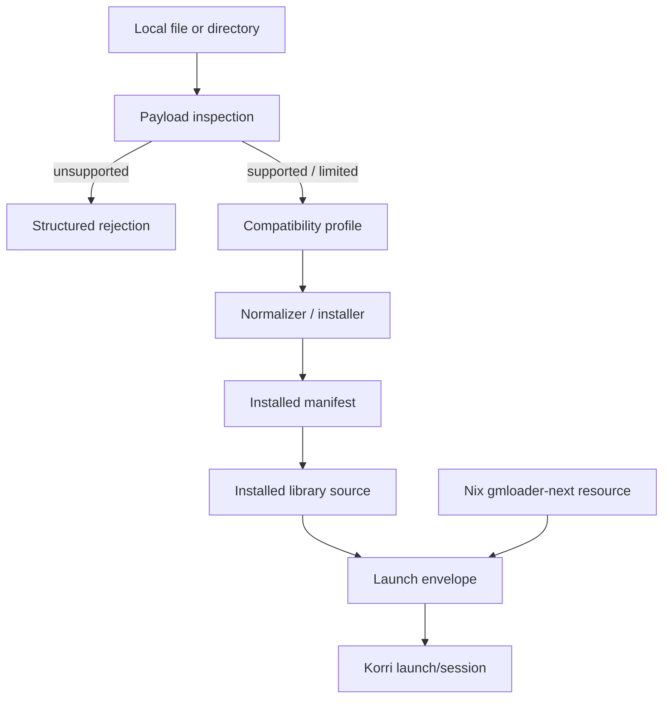

# feat: Add a source-agnostic GMLoader plugin

## Summary

Build a first-party `@korri:gmloader` plugin that turns arbitrary local GameMaker payloads into launchable Korri library entries. The implementation should inspect payload shape, normalize supported APK/ZIP/`.port`/directory inputs into one GMLoader run layout, resolve a reusable Nix-provided GMLoader Next runtime, and launch installed games without core branches for PortMaster, itch.io, or any future source provider.

---

## Problem Frame

The RG353M spike proved that Chromium/HTML5 GameMaker exports are too slow for Stargrove Scramble on this hardware, while native GMLoader launches of Stargrove, Spelunky, and many unrelated arm64 GameMaker APKs reach visible menus/gameplay at promising speed. The current spike artifacts are still source-shaped: PortMaster ZIPs are packaged under the PortMaster plugin, and itch.io was used as a discovery pool. The product need is a reusable Korri launcher capability whose core contract is payload-shape based: given a local file or directory, identify whether it contains a compatible GameMaker Android runner payload, normalize it safely, and expose it through Korri like any other installed playable.

---

## Requirements

- R1. Add a new first-party `@korri:gmloader` plugin; do not extend the PortMaster plugin for core GMLoader behavior.
- R2. Accept arbitrary local file/path inputs for install/inspection, including APK, ZIP/`.port`, and already-extracted directories.
- R3. Detect payload shape by contents and runner requirements, not by source/provenance. Core logic must not branch on PortMaster, itch.io, or catalog identity.
- R4. Support the proven happy path: arm64 GameMaker Android payloads containing `assets/game.droid` plus `lib/arm64-v8a/libyoyo.so`.
- R5. Normalize supported payloads into a canonical run directory with generated `gmloader.json`, extracted runner assets/libs, compatibility metadata, and an installed manifest.
- R6. Detect and report unsupported/limited classes distinctly: not a ZIP/APK, not GameMaker, missing `game.droid`, missing `libyoyo.so`, 32-bit-only, compressed `game.droid` needing normalization, asset-manager-required/runtime-incompatible, and corrupt archive.
- R7. Treat arbitrary local path/archive intake as hostile input: bound archive/file sizes, reject unsafe member paths, avoid following symlinks outside the source/install roots, and confine every write under the GMLoader install root.
- R8. Provide a reusable Nix package/resource for GMLoader Next and shared runtime/shim dependencies instead of per-game bundled runners.
- R9. Expose installed GMLoader games through the live library source and resolve launches through normal Korri launch/session flows.
- R10. Preserve user data on reinstall/update or refuse to clobber an existing install unless the caller explicitly opts into overwrite semantics.
- R11. Carry RG353M caveats as compatibility/profile data and diagnostics, not as source-specific branches: dummy audio fallback, Remap/SDL controller env, EGL/GBM prerequisites, stored `game.droid`, and known asset-manager limitation.
- R12. Keep PortMaster and itch.io as future adapters only. They may call the same generic installer later, but this plan does not add catalog/download/auth integration for either source.
- R13. Maintain/update the compatibility matrix so implementation validation preserves the spike learnings.

---

## Scope Boundaries

- No PortMaster catalog integration in the GMLoader plugin MVP.
- No itch.io auth, scraping, download resolution, or provider-specific source adapter in the MVP.
- No promise of universal Android compatibility; GMLoader loads compatible GameMaker runner payloads and rejects other Android apps.
- No 32-bit/armhf GMLoader runtime in the MVP. 32-bit-only payloads should be classified clearly and routed to follow-up work.
- No full Android asset-manager shim in the MVP. Asset-manager-required failures should be represented as a known compatibility class and linked to follow-up work.
- No broad Korri GUI redesign. The install/inspection operation can start as plugin handlers/CLI-compatible plumbing; richer portal UX can follow.
- No attempt to fix device-level EGL/GBM discovery inside this plugin. The plugin may document required env/profile fields, but compositor/Mesa path robustness remains separate work.

### Deferred to Follow-Up Work

- Source adapters that discover/download from PortMaster, itch.io, or other catalogs and then hand a local artifact to `@korri:gmloader`.
- armhf/32-bit GMLoader runtime and compatibility validation.
- Android asset-manager/JNI shim completion for newer GameMaker exports.
- Real handheld audio baseline beyond opt-in `SDL_AUDIODRIVER=dummy` fallback.
- Touch or game-specific input mapping authoring UI.
- Artwork/title enrichment from APK resources beyond minimal manifest/file-name metadata.

---

## Context & Research

### Relevant Code and Patterns

- `product/platform/plugin/index.ts` defines first-party plugin IDs, handlers, provider config, executable resources, and arbitrary plugin operations. `@korri:gmloader` should follow this contract with provider ID `@korri:gmloader`.
- `product/plugins/index.ts` registers first-party plugins. The new plugin must be added there so `KORRI_ENABLED_PLUGINS=@korri:gmloader,...` works consistently.
- `product/plugins/portmaster/src/plugin.ts` is the closest handler pattern: custom operations such as `portmaster.install` and `portmaster.prepare-launch`, Nix executable module contribution, and provider metadata.
- `product/plugins/portmaster/src/installer.ts` contains useful archive, safe ZIP path, manifest, atomic write, digest, and binary-inspection patterns. GMLoader should reuse/extract the generic ZIP reading pieces rather than copy source-specific installer behavior.
- `product/plugins/portmaster/src/library-source.ts` shows how installed manifests are overlaid onto the live `LibrarySourceService`; GMLoader should add a parallel `withGmloaderInstalledLibrarySource` and wire it in `product/plugins/library-source-layer.ts` when the plugin is enabled.
- `product/plugins/portmaster/src/envelope.ts` shows launch-envelope preparation and compatibility-profile env assembly. GMLoader should use a smaller, GMLoader-specific envelope rather than PortMaster control-file emulation.
- `product/systems/nixos/flake/plugins.nix` auto-discovers plugin `nix/composition.nix` files, so a new `product/plugins/gmloader/nix/composition.nix` is sufficient to expose packages/checks through the flake merge path.
- `.worktrees/spike/gmloader-nix/product/plugins/portmaster/packages/gmloader-port/default.nix` and `check.nix` are spike references for wrapper pitfalls, required runtime libs, and known-good launch packaging, but should be migrated conceptually into a standalone GMLoader package/resource.
- `.worktrees/spike/gmloader-nix/docs/research/gmloader-apk-compatibility-matrix.md` is the compatibility evidence base to preserve and extend.

### Spike Learnings to Preserve

- GMLoader expects GameMaker Android runner payloads, not arbitrary Android apps.
- The generic APK payload shape is `assets/game.droid` plus `lib/<abi>/libyoyo.so`.
- arm64 payloads are the MVP lane; 32-bit-only payloads need a future armhf runtime.
- `assets/game.droid` must be normalized to a stored/uncompressed layout for reliable GMLoader reads.
- Some successful APKs needed Android shim/support libs seeded from a known-working baseline.
- Asset-manager mode failures are a distinct compatibility class, not proof the payload is non-GameMaker.
- RG353M launches may need explicit Mesa/EGL/GBM environment outside the plugin's core ownership.
- Dummy SDL audio is acceptable for visual/performance validation but should be profile-controlled, not hard-coded forever.
- Remap can expose an SDL-visible Korri gamepad to GMLoader, but game-specific input/touch behavior remains incomplete.

### External References

External research is already represented by the spike's GMLoader-next/YoYo Loader/PortMaster prior-art pass. No additional web research is required for the plan: the implementation decisions are dominated by Korri's plugin/library/Nix architecture and observed RG353M payload behavior.

---

## Key Technical Decisions

- **New plugin boundary:** Implement `@korri:gmloader` as a first-party plugin with its own package, manifest, installer, envelope, tests, and library source. PortMaster becomes only one possible future source adapter.
- **Payload-shape classification:** Detection should produce a typed compatibility profile from observed files, compression methods, ABIs, and runtime signals. Source URL, catalog ID, and filename may appear in metadata/evidence but must not change core behavior.
- **Separate install from launch:** `gmloader.install` inspects and normalizes a local path once, then writes a manifest. `gmloader.prepare-launch` / library launch resolution reads the manifest and builds the launch envelope without re-detecting the source artifact.
- **Executable resource owned by the plugin:** The plugin contributes a Nix executable resource/module for `gmloader-next` rather than a separate runtime plugin initially. Split it later only if multiple plugins need independent runtime resolution.
- **Canonical installed layout:** Normalize every accepted payload into a run directory under the GMLoader install root. Preserve the Android-like asset/lib paths unless an empirical layout test proves GMLoader Next prefers a flatter shape.
- **Generated manifest is the source of truth:** Installed entries should include schema version, provider ID, stable playable ID, title/source metadata, input hash, detected payload profile, transforms applied, run paths, runtime requirements, and compatibility notes.
- **Stable ID prefers Android package identity:** Derive the playable ID from APK package metadata when cheaply parseable; otherwise fall back to a deterministic content-hash/file-stem ID and record the fallback reason in the manifest.
- **No silent overwrite:** Reinstall/update must either preserve known mutable user-data paths or refuse to replace an existing run directory without explicit overwrite input.
- **Rejections are valid classifications:** Detection should return structured `GmloaderPayloadRejection` values. Plugin handler boundaries may map rejected installs to `AcquisitionError(reason: "caller")`, but internal detection should not treat unsupported payloads as defective providers.
- **Compatibility profile controls risky env:** `SDL_AUDIODRIVER=dummy`, `SDL_GAMECONTROLLERCONFIG`, EGL/GBM path hints, and shim-lib selection belong in launch/profile metadata so device and game-specific policy remains explicit.
- **Asset-manager and 32-bit are staged classes:** The MVP should classify and document these cases, not hide them behind generic launch failures.

---

## High-Level Technical Design

> This design is directional guidance for review and execution, not implementation pseudocode.



Canonical install tree should be stable and source-neutral, for example:

```text
<installRoot>/
  manifests/<playable-id>.json
  games/<playable-id>/
    assets/game.droid
    lib/arm64-v8a/libyoyo.so
    lib/arm64-v8a/<support libs>
    gmloader.json
    compatibility-profile.json
    saves/                 # reserved/preserved mutable data convention if used
```

If empirical testing shows GMLoader Next requires a different `gmloader.json` relationship between `main_apk`, `apk_directory`, `assets/game.droid`, and library paths, the implementer should adjust the canonical layout before landing Unit 3 rather than support multiple layouts in the MVP.

---

## Implementation Units

### Unit 1 — Plugin shell, registration, and Nix composition

**Goal:** Add the empty but enabled-by-config first-party plugin boundary and package surface.

**Primary files**

- `product/plugins/gmloader/index.ts`
- `product/plugins/gmloader/src/plugin.ts`
- `product/plugins/gmloader/src/manifest.ts`
- `product/plugins/gmloader/nix/composition.nix`
- `product/plugins/gmloader/packages/gmloader-next/default.nix`
- `product/plugins/gmloader/packages/gmloader-next/check.nix`
- `product/plugins/index.ts`
- `product/systems/nixos/flake/plugins.test.ts`

**Plan**

- Define `KORRI_GMLOADER_PLUGIN_ID = "@korri:gmloader"` and `createGmloaderPlugin` / `gmloaderPlugin` exports.
- Contribute provider metadata with `enabledByDefault: false` and a Nix executable/module for `gmloader-next`.
- Add plugin registration to `firstPartyPlugins`.
- Add Nix composition exposing `gmloader-next` and `gmloader-next-check` through the existing plugin composition merge.
- Keep handlers stubbed or limited to `provider.validate` until detection/install units land.

**Tests**

- `product/plugins/gmloader/src/plugin.test.ts`
  - plugin ID/provider metadata are stable;
  - executable resource/module references the expected Nix installable and binary;
  - plugin is disabled by default unless explicitly enabled.
- `product/systems/nixos/flake/plugins.test.ts`
  - plugin composition auto-discovers `gmloader` package/check names.
- `product/plugins/index.test.ts` if present/added
  - first-party registry includes `@korri:gmloader` and respects `KORRI_ENABLED_PLUGINS` parsing.
- Nix check
  - `gmloader-next-check` verifies the packaged binary is executable and has expected runtime libs available.

---

### Unit 2 — Shared archive reader and payload detection

**Goal:** Classify local payloads into supported profiles or structured rejections without modifying disk state.

**Primary files**

- `product/platform/archive/zip.ts`
- `product/platform/archive/zip.test.ts`
- `product/plugins/portmaster/src/installer.ts`
- `product/plugins/portmaster/src/installer.test.ts`
- `product/plugins/gmloader/src/payload.ts`
- `product/plugins/gmloader/src/payload.test.ts`
- `product/plugins/gmloader/src/android-manifest.ts`
- `product/plugins/gmloader/src/android-manifest.test.ts`

**Plan**

- Extract or introduce a small ZIP central-directory reader that exposes entry path, compression method, compressed/uncompressed size, and lazy/extracted bytes with safe member-path handling.
- Keep PortMaster behavior green after switching any shared ZIP logic, or leave PortMaster private logic in place if extraction would make this unit too risky. The key requirement is that GMLoader detection can inspect compression method and bytes safely.
- Implement local source resolution for files and directories: allow absolute or relative caller-supplied source paths after NUL/readability/stat checks, but ensure all writes later remain confined under the GMLoader install root.
- Add defensive intake limits before extraction: maximum source size, maximum expanded bytes, maximum entry count, no device/special files, no symlink traversal outside the source directory for directory inputs, and no archive member paths that escape the install destination.
- Classify:
  - APK/ZIP/`.port` archive with `assets/game.droid`;
  - extracted directory with equivalent files;
  - arm64 vs armhf/32-bit-only vs missing native runner;
  - stored vs deflated `game.droid`;
  - support/shim library presence;
  - optional Android package/title metadata where available.
- Return a typed detection result with evidence and a typed rejection for unsupported classes.

**Tests**

- `product/platform/archive/zip.test.ts`
  - reads stored and deflated entries;
  - rejects/trims unsafe member paths;
  - reports corrupt/truncated archive distinctly;
  - exposes compression method for `assets/game.droid`.
- `product/plugins/gmloader/src/payload.test.ts`
  - classifies minimal arm64 GameMaker APK fixture as supported;
  - classifies compressed `game.droid` as supported-with-normalization-required;
  - classifies armhf-only payload as unsupported `arm32-only`;
  - rejects non-ZIP file, non-GameMaker ZIP, missing `libyoyo.so`, and corrupt APK with distinct tags;
  - classifies an extracted directory the same as an archive with equivalent contents;
  - does not inspect or branch on source provider names.
- `product/plugins/gmloader/src/android-manifest.test.ts`
  - extracts package/title metadata from a minimal fixture when supported;
  - falls back deterministically when manifest parsing fails.

---

### Unit 3 — Installer, normalizer, manifests, and update safety

**Goal:** Convert a supported detection result into an installed run directory and durable manifest.

**Primary files**

- `product/plugins/gmloader/src/installer.ts`
- `product/plugins/gmloader/src/installer.test.ts`
- `product/plugins/gmloader/src/manifest.ts`
- `product/plugins/gmloader/src/manifest.test.ts`
- `product/plugins/gmloader/src/gmloader-json.ts`
- `product/plugins/gmloader/src/gmloader-json.test.ts`
- `product/plugins/gmloader/src/compatibility.ts`
- `product/plugins/gmloader/src/compatibility.test.ts`

**Plan**

- Add `installGmloaderPayload` that accepts provider ID, source path, install root, optional title/profile overrides, installed timestamp, and overwrite/update policy.
- Generate stable IDs from detected package metadata when possible; otherwise use a deterministic fallback and record it.
- Normalize `assets/game.droid` into the canonical run layout, ensuring the installed representation satisfies GMLoader's stored/uncompressed requirement even when the source archive used DEFLATE.
- Extract `lib/arm64-v8a/libyoyo.so` and relevant support libraries; seed known reusable shim libs from the GMLoader runtime package/profile only when the payload lacks them and the transform is declared in compatibility metadata.
- Generate `gmloader.json` and `compatibility-profile.json` from the detected profile and caller overrides.
- Write manifests atomically under `manifests/`; include source hash, source display path, transformed files, detected ABIs, compression facts, applied transforms, launch env/profile hints, and known limitations.
- On reinstall, preserve a documented mutable data convention or refuse unless explicit overwrite is set. Avoid `rm -rf` of an existing game directory as the default path.

**Tests**

- `product/plugins/gmloader/src/installer.test.ts`
  - installs a supported APK fixture into the expected canonical layout;
  - normalizes a deflated `game.droid` fixture;
  - writes manifest atomically and rejects invalid schema on read;
  - refuses to overwrite an existing install by default;
  - preserves configured mutable data path or requires explicit overwrite;
  - records transforms and source hashes;
  - confines writes to install root even with hostile archive member names;
  - rejects oversized or over-expanded archives before writing partial installs;
  - rejects directory payload symlinks that would copy files outside the selected source tree.
- `product/plugins/gmloader/src/gmloader-json.test.ts`
  - generated config matches the canonical run layout;
  - profile overrides can change platform/audio/input fields without mutating detection facts.
- `product/plugins/gmloader/src/manifest.test.ts`
  - decodes only supported schema/provider versions;
  - rejects malformed manifests and wrong provider IDs;
  - keeps compatibility/rejection fields serializable.

---

### Unit 4 — Plugin operations and local-path install contract

**Goal:** Expose inspection/install/prepare operations through the plugin handler seam.

**Primary files**

- `product/plugins/gmloader/src/plugin.ts`
- `product/plugins/gmloader/src/plugin.test.ts`
- `product/platform/acquisition/errors.ts` or local GMLoader error types if no platform change is needed
- `product/platform/protocol/acquisition/errors.ts` only if the public reason taxonomy must be extended

**Plan**

- Add custom operations:
  - `gmloader.payload.inspect` for non-mutating classification;
  - `gmloader.install` for mutating local install;
  - `gmloader.prepare-launch` for manifest-to-envelope preparation.
- Keep internal rejection results structured. At operation boundaries, map rejected installs to caller-facing errors only where the existing plugin harness requires an error.
- Accept local paths explicitly and document that this operation is local-user-authorized, not a remote download resolver.
- Provide enough output from inspect/install for UI/CLI callers: playable ID, title, supported/unsupported class, evidence, transforms required/applied, and manifest path.
- Avoid `claims.search`, `claims.parse-url`, and `artifact.resolve-download` for MVP so the plugin cannot accidentally become source-catalog-shaped.

**Tests**

- `product/plugins/gmloader/src/plugin.test.ts`
  - `gmloader.payload.inspect` returns supported profile for a local fixture without writing files;
  - `gmloader.install` writes a manifest and returns install metadata;
  - unsupported payload install returns a caller-facing diagnostic with the structured rejection embedded or recoverable;
  - `gmloader.prepare-launch` delegates to envelope preparation for valid manifests;
  - missing/invalid local path is reported as caller/input failure, not defective provider;
  - provider-source strings do not affect classification.

---

### Unit 5 — Installed library source overlay

**Goal:** Make installed GMLoader games appear and launch from the Korri library when the plugin is enabled.

**Primary files**

- `product/plugins/gmloader/src/library-source.ts`
- `product/plugins/gmloader/src/library-source.test.ts`
- `product/plugins/library-source-layer.ts`
- `product/plugins/gmloader/index.ts`

**Plan**

- Implement `defaultGmloaderInstallRoot`, mirroring the PortMaster install-root pattern with `KORRI_GMLOADER_INSTALL_ROOT` override and XDG fallback.
- Implement `withGmloaderInstalledLibrarySource(base, options)` to scan manifests, skip malformed entries with warnings/soft failure, and append playable entries.
- Use playable IDs that are stable and provider-scoped enough not to collide with other library sources.
- Resolve launch specs for installed entries through the GMLoader envelope and delegate misses to the base source.
- Wire the wrapper in `PluginLibrarySourceLayerLive` only when `@korri:gmloader` is enabled.

**Tests**

- `product/plugins/gmloader/src/library-source.test.ts`
  - empty install root returns base library unchanged;
  - valid manifests become launchable playable entries with title/system/userData;
  - malformed/wrong-provider manifests are skipped;
  - launch resolution returns a GMLoader spec for installed IDs and delegates non-GMLoader IDs;
  - release mismatch behaves consistently with PortMaster's installed-release behavior.
- `product/plugins/library-source-layer.test.ts` if present/added
  - enabling `@korri:gmloader` wraps the live source with the GMLoader overlay;
  - disabled plugin does not scan the install root.

---

### Unit 6 — Launch envelope, runtime resource resolution, and compatibility env

**Goal:** Produce a concrete `LaunchSpec` for installed payloads using the Nix GMLoader Next runtime.

**Primary files**

- `product/plugins/gmloader/src/envelope.ts`
- `product/plugins/gmloader/src/envelope.test.ts`
- `product/plugins/gmloader/src/runtime.ts`
- `product/plugins/gmloader/src/runtime.test.ts`
- `product/plugins/gmloader/packages/gmloader-next/default.nix`
- `product/plugins/gmloader/packages/gmloader-next/check.nix`

**Plan**

- Resolve the `gmloader-next` executable through the existing plugin Nix out-link resolver/resource path.
- Build launch env from manifest/profile:
  - game lib path before inherited `LD_LIBRARY_PATH`;
  - GMLoader runtime/support library paths as required;
  - optional SDL audio fallback;
  - optional SDL controller mapping/remap-friendly env;
  - explicit EGL/GBM hints only when supplied by device/profile policy.
- Set `cwd` to the installed run directory and arguments/config to the generated `gmloader.json`.
- Fail with `LibraryError(reason: "config")` when installed files are missing and `LibraryError(reason: "unavailable")` when the runtime resource cannot be resolved.
- Keep Gamescope/presentation composition out of this plugin unless an existing launcher/profile layer requires it; GMLoader should produce a normal process launch first.

**Tests**

- `product/plugins/gmloader/src/envelope.test.ts`
  - produces command/args/cwd/env for a valid manifest and resolved runtime;
  - prepends game library paths without dropping inherited env;
  - includes dummy audio only when profile says so;
  - includes controller mapping only when provided;
  - reports missing installed files as config errors;
  - reports missing runtime resource as unavailable.
- `product/plugins/gmloader/src/runtime.test.ts`
  - maps plugin resource resolution failures to launch/library errors correctly;
  - keeps package binary/resource names aligned with plugin contributions.
- Nix check
  - packaged `gmloader-next` closure includes SDL/OpenGL/bzip2/runtime deps discovered during the spike.

---

### Unit 7 — Compatibility fixtures, matrix, and RG353M validation path

**Goal:** Prove the generic path against known examples and preserve compatibility evidence.

**Primary files**

- `docs/research/gmloader-apk-compatibility-matrix.md`
- `docs/research/stargrove-scramble-web-runtime-spike.md`
- `product/plugins/gmloader/fixtures/README.md`
- `product/plugins/gmloader/src/payload-fixtures.test.ts`
- `product/plugins/gmloader/packages/gmloader-next/check.nix`
- Optional small metadata-only fixture descriptors under `product/plugins/gmloader/fixtures/`

**Plan**

- Move or copy the spike compatibility matrix from `.worktrees/spike/gmloader-nix/docs/research/gmloader-apk-compatibility-matrix.md` into the main worktree path if it is not already present.
- Avoid committing copyrighted APK payloads. Use tiny synthetic ZIP/APK fixtures for automated tests and metadata descriptors for real titles.
- Keep real-title validation manual/device-gated but documented: Stargrove Scramble, Spelunky, Piggy Butchery, Mini Splatoon, Animalcules or another non-Reality-Blind pass, plus one known asset-manager failure.
- Update the matrix with the new generic install/launch result columns: detection class, transforms applied, manifest/profile result, launch result, input/audio status, and failure reason.
- For RG353M final proof, install and launch at least five compatible titles through `@korri:gmloader` with Korri GUI closed, pixel scaler/presentation policy where applicable, and screenshots/logs recorded outside the repo.

**Tests / Validation**

- `product/plugins/gmloader/src/payload-fixtures.test.ts`
  - synthetic fixtures encode the same classes as the matrix: supported arm64, compressed `game.droid`, 32-bit-only, missing `libyoyo`, asset-manager-likely marker if one is statically detectable.
- Manual RG353M validation checklist
  - `@korri:gmloader` enabled in `KORRI_ENABLED_PLUGINS`;
  - `gmloader.install` succeeds from arbitrary local paths;
  - library lists installed entries;
  - launch reaches visible screen for at least five known-compatible titles;
  - an asset-manager failure is classified/documented rather than reported as generic crash;
  - 32-bit-only payload is rejected before launch.

---

## Sequencing

1. Land Unit 1 so the plugin/package boundary exists and Nix composition can build independently.
2. Land Unit 2 detection before any mutating installer work; this protects the arbitrary-path contract with characterization tests.
3. Land Unit 3 installer/manifest with synthetic fixtures; do not wire library launch until update/clobber behavior is safe.
4. Land Unit 4 handlers once detection/install APIs are stable.
5. Land Unit 5 library overlay so installed manifests become playable entries.
6. Land Unit 6 launch envelope and runtime resolution; perform the first device smoke with one known-good title here.
7. Land Unit 7 compatibility-matrix updates and broader RG353M validation after the generic path launches one title successfully.

---

## Verification Plan

### Automated

- `bun test product/platform/archive product/plugins/gmloader`
- `bun test product/plugins/index.test.ts product/systems/nixos/flake/plugins.test.ts` where those tests exist or are added
- `just typecheck`
- `just lint`
- `nix build --impure .#checks.$system.gmloader-next-check --no-link`
- If PortMaster ZIP helper code is shared/refactored: `bun test product/plugins/portmaster`

### Device / Manual

- Build/copy the GMLoader runtime closure to RG353M using the same `fuji` build-host approach proven in the spike.
- Ensure Korri GUI is closed during performance tests.
- Enable `@korri:gmloader` plus required display/input plugins.
- Install from local file paths for at least five compatible titles.
- Launch through normal Korri session path and capture screen/log evidence.
- Validate rejection paths with a 32-bit-only payload and an asset-manager-known failure.
- Update `docs/research/gmloader-apk-compatibility-matrix.md` with outcomes.

---

## Risks and Mitigations

- **Data loss on update:** GMLoader games may write saves inside the run directory. Mitigate by refusing default overwrite until a preserved mutable-data convention is implemented and tested.
- **Archive/path abuse:** The plugin intentionally accepts arbitrary local paths, so hostile archives and symlink-heavy directories can cause path traversal, ZIP-bomb, or accidental sensitive-file copy issues. Mitigate with bounded intake, safe member paths, symlink containment checks, and install-root-confined writes before any device validation.
- **Runtime layout uncertainty:** The exact `gmloader.json` expectations for extracted vs APK-like layouts must be empirically verified early with one known-good title. Do not support multiple layouts until the canonical one is proven.
- **APK manifest parsing complexity:** Android binary XML parsing may be more work than needed. Keep it minimal and optional; fallback ID/title generation must be deterministic and visible in the manifest.
- **False compatibility positives:** Some payloads have `game.droid` and `libyoyo.so` but need asset-manager/JNI behavior not yet shimmed. Mitigate with compatibility classes, launch diagnostics, and matrix tracking.
- **Device env fragility:** EGL/GBM and audio issues can masquerade as GMLoader defects. Keep device prerequisites/profile env explicit and cross-link the separate RG353M EGL/GBM backlog item.
- **Scope creep into source providers:** PortMaster/itch integration is tempting because the spike used them. Keep the MVP local-path only; adapters can be separate units after the core loader is stable.

---

## Open Questions

### Resolved for This Plan

- **Plugin identity:** Use a new `@korri:gmloader` first-party plugin.
- **Source coupling:** Core detection/normalization is source-agnostic; no PortMaster or itch-specific branches.
- **MVP architecture:** Local install and launch are separate operations backed by installed manifests.
- **Runtime ownership:** The plugin owns the initial Nix `gmloader-next` resource/package.
- **Unsupported classes:** 32-bit-only and asset-manager-required payloads are explicit classifications, not MVP blockers.

### Deferred to Implementation

- **Exact canonical layout:** Confirm with a known-good title before locking `gmloader.json` generation.
- **Exact manifest metadata fields:** Preserve the required facts above; concrete field names can follow implementation conventions.
- **Minimal Android binary XML support:** Implement only what stable ID/title extraction needs; fallback is acceptable.
- **Real audio default:** Start with profile-controlled dummy audio support and revisit once the handheld audio baseline is fixed.
- **Remap input policy:** Set SDL-compatible env when available, but game-specific keyboard/touch mapping remains separate.
