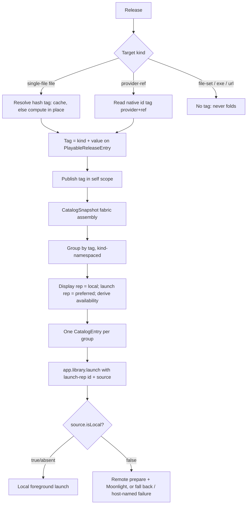

# Federated release folding by exact identifier

## Summary

Give a release an exact, trustworthy "tag" — a single-file content hash or a `provider-ref` native id (Steam/itch/etc.) — carried as identity metadata alongside its existing location, publish that tag in the federated catalog, and fold releases that share a tag into one user-facing item that prefers a locally launchable copy, falls back to remote streaming, and exposes an availability signal each surface can render its own way.

---

## Problem Frame

Federation v1 lets a device see games from peers, but every peer copy is emitted as a separate `CatalogEntry`, so the same game shows as multiple tiles. The desired model is `Game -> Release -> Storage`: a game is metadata (zero or more releases), a release is the concrete playable thing, and storages are the places a release exists.

Folding needs an exact, cross-device identity on the **release**, because that is the unit that can carry one. Two truths shape the design:

- **Internal ids are never a match key.** The slug/playable id we assign to a release (or a game) is arbitrary and cannot be guaranteed identical host-to-host, so it never participates in folding.
- **An exact identity ("tag") comes in kinds.** A single-file ROM has a content hash. A store game has a native id — and the schema already models this: a `provider-ref` target carries `{ provider, ref }` (Steam app ids are even pre-extracted onto the runtime entry today via `app-install-metadata.ts`). The hash is the strongest case for raw files but only matches byte-identical files; native ids are format-immune and already present.

The codebase already has the right hash primitive — content-addressed artifacts keyed by `sha256:<hex64>` (`product/platform/library/config/records/artifact.ts`) — but it is **not wired through releases**: a release `file` target is `{ kind, storage, path }` with no identity, the artifact link exists only on the legacy game record, and hand-added config games have no artifact at all. So today a federated release cannot tell another device its content identity, and folding has nothing to compare.

This plan adds release-level identity narrowly (two tag sources) and additively, in a shape forward-compatible with the broader `contentPath -> artifact` location migration, so nothing here is throwaway.

---

## Requirements

- R1. A release can carry an exact content identity ("tag") of a kind: a single-file content hash (reusing the existing `sha256:<hex64>` artifact model) or a `provider-ref` native id `{ provider, ref }`. No new parallel hash field; no reliance on internal ids.
- R2. Tags are compared like-for-like (kind-namespaced): a hash only matches a hash, and a provider id only matches the same provider's id. A hash can never collide with a native id.
- R3. Identity is additive metadata orthogonal to a release's location/target. It does not replace the file path and does not impose an "exactly one content source" rule; a release keeps its location and *also* may carry a tag.
- R4. A device computes the hash-kind tag only for its own local single-file files, reading them in place and never copying. Provider-ref tags are read from existing release data with no computation. Remote copies arrive already carrying the owning host's published tags.
- R5. A release's resolved tag is published in the federated catalog (`PlayableReleaseEntry`) so other devices compare it without fetching or re-hashing remote files.
- R6. Releases that share a tag fold into one user-facing catalog item. Grouping is transitive (connected components) and kind-namespaced; in v1 each release has at most one tag, so grouping reduces to simple same-tag classes, implemented in a shape that allows future multi-tag chaining without rework.
- R7. Internal/arbitrary release and game ids are never a fold key.
- R8. The folded item prefers a locally launchable copy; if local exists but cannot launch, it prefers a launchable remote via existing Moonlight/Sunshine routing. On launch, it falls back to another launchable copy in the fold when the preferred target is unreachable, and otherwise fails with a message naming the host — never a generic error.
- R9. When a local candidate exists, its display metadata stays authoritative even when the launch target is remote; launch identity/source come from the launch target.
- R10. Folding and its availability signal are computed by the daemon/catalog layer; surfaces consume ready-folded catalog truth.
- R11. The folded item exposes a structured availability signal (local-launchable / remote-available / remote-unreachable) derived from fold state plus peer presence, so each surface can choose its own treatment.
- R12. While the user is actively navigating a rail, folds do not reflow it; pending merges settle on the next navigation/screen change/idle moment, and if a merge touches the focused tile, focus moves to the surviving tile.
- R13. v1's tag sources are exactly two: a single-file `file` target (computed content hash) and a `provider-ref` target (native id). `file-set`, `executable`, and `url` targets carry no tag and never fold in v1 (a safe miss).
- R14. The release identity is forward-compatible with the planned broader `contentPath -> artifact` location migration; path-based releases keep working unchanged.
- R15. v1 excludes: format-normalized and multi-file hashing, durable cluster persistence, manual merge/split overrides, the signaling-assisted (tier 2) and manual-curation (tier 3) folding tiers, copy-over launching, full per-surface presence UI, a source-picker UI, and config write-back of computed tags.

---

## Scope Boundaries

- v1 folds only releases that have one of the two exact tags (single-file hash or provider-ref native id). Everything else is tagless and never folds.
- Identity is additive and orthogonal to location: a release keeps its target/path and may also carry a tag. No "exactly one content source" rule for the tag, and no big-bang `contentPath -> artifact` conversion.
- Hash-kind tags fold only byte-identical single files; differently-stored copies (zip vs raw, `.cue/.bin` vs `.chd`, header variants) do not fold in v1. Format-normalized identity is deferred.
- Fingerprinting never copies a file: a device hashes its own files in place. Byte adoption into the artifact blob store stays the import/acquisition path's job.
- Native-id tags are read from existing `provider-ref` data; v1 does not build new provider integrations or new id extraction beyond what already exists.
- v1 ships the availability signal; full per-surface presence treatments (home fade/pop, library disabled-but-favoritable) are phased follow-ups.
- v1 does not rewrite user config YAML to persist computed tags; computation is resolved/cached at runtime. Config write-back is scanner-owned.
- Peer trust posture stays federation v1 trusted-LAN/no-auth; no pairing/authorization added.

### Deferred to Follow-Up Work

- Format-normalized / multi-file identity (decompress + strip headers; sorted manifest-of-hashes; DAT/CHD header SHA1).
- Tier 2 (automated folding assisted by signaling) and tier 3 (assisted manual curation) — captured in backlog `01KVXQJ1TPKPMPVSJW30GQ3MSE`.
- Surfacing additional identity kinds (e.g. external-id lists) that would let one release carry multiple tags and activate transitive chaining.
- Broader `contentPath -> artifact` *location* migration for all target kinds (owned by `docs/plans/2026-06-04-002-feat-native-artifact-import-plan.md`).
- Durable cluster persistence with stable ids and manual merge/split/reject overrides.
- Source-picker UI exposing all storages for a folded release.
- Config write-back of computed tags (scanner-owned).
- Copy-over/download-to-local launch path.
- Remote-source SSRF/`controlUrl` trust hardening, parked at `work/parking-lot/01KTPAJV8ZF1N4WCXSZ9XVZ2KE-constrain-remote-source-controlurl-to-discovered-trusted-peers.md`.

---

## Context & Research

### Relevant Code and Patterns

- `product/platform/library/config/records/artifact.ts` — `ArtifactRecord.id = sha256:<hex64>`, `digests`/`expectedDigests` (claimed vs verified), `externalIds`. The hash home.
- `product/platform/protocol/artifact/artifact.ts` — `ArtifactId`, `DigestSet`, `ExpectedDigestSet`.
- `product/platform/library/config/records/library-item.ts` — strict `LibraryReleasePayload`; `file` target `{ kind, storage, path }`; `provider-ref` target `{ kind, provider, ref }` (already a kind-namespaced native id). New optional fields must be declared (strict `onExcessProperty: "error"`).
- `product/platform/library/config/app-install-metadata.ts` — already extracts the Steam app id from `steam://rungameid/<appid>` and surfaces it on the runtime entry's `install`; precedent for reading a native id with no new wiring.
- `product/platform/library/playable-library.ts` — runtime `PlayableReleaseEntry` / `PlayableLibraryEntry`; no identity tag today.
- `product/platform/library/config/records/game.ts` — legacy game record's `content: { artifactId }` and "exactly one of contentPath/artifactId" rule; informs the artifact id *shape* but is a *location* rule, not the identity model used here.
- `product/platform/library/proseql/library-repository.ts` — `toPlayableReleaseEntry` projection; artifact import already writes `ArtifactRecord` + a `file`-target release.
- `product/platform/artifacts/artifact-import-service.ts` / `artifact-store.ts` — SHA-256 compute and content-addressed identity; reuse the *hashing*, not the byte-copy/adoption side effect.
- `product/apps/portal/api/catalog/catalog-snapshot.ts` — assembles `entries: [...localTagged, ...remoteTagged]`; fold seam and self-scope publish point.
- `product/apps/portal/api/catalog/snapshot.rpc.ts` — `CatalogEntry = PlayableLibraryEntry + EntrySource`.
- `product/apps/portal/peers/peer-source-fetcher.ts` — retags only `source`; release tags round-trip once on `PlayableReleaseEntry`.
- `product/apps/portal/api/library/launch.rpc-handler.ts` — `source.isLocal === false` routes to remote Moonlight prepare/launch.
- `product/apps/portal/features/home/launcher-layer-rpc.ts` — forwards `LaunchOptions.source` through `app.library.launch`.
- `product/surfaces/web/shift/catalog/shift-catalog-state.ts`, `product/surfaces/web/shift/organisms/ShiftHomeRail.tsx` — catalog consumption and focus/`data-tile-id` handling.

### Institutional Learnings

- `docs/research/game-library-entity-resolution-deduplication.md` — tiered identity + false-positive warning: auto-fold only on high-confidence exact identity; fuzzy/title is a later, curated tier.
- `docs/plans/2026-06-04-002-feat-native-artifact-import-plan.md` — the artifact id shape and the deferred `contentPath -> artifact` location migration this plan stays compatible with.
- `docs/solutions/runtime-errors/effect-rpc-server-headers-concat-undefined-crash-2026-05-27.md` — keep the RPC envelope guard on the LAN-exposed federation path.
- `docs/solutions/runtime-errors/kiosk-renderer-local-launch-rpc-decode-failure-2026-05-27.md` — local-source launches go through `app.library.launch`, never a renderer-to-bun bridge.
- `docs/solutions/design-patterns/explicit-cascade-folded-policy-over-incidental-signal-heuristics-2026-05-27.md` — stamp preference/availability facts in the daemon; do not infer them in the UI.

### External References

- Plex/Jellyfin: one logical item, multiple versions/sources; auto-prefer local, manual choice as progressive disclosure.
- RomM / Playmatch / Hasheous: hash-first ROM identity; name only as low-confidence fallback.
- Nix substituters / IPFS providers: content-addressed identity with multiple providers and local/nearest preference.

---

## Key Technical Decisions

- Fold on an exact release **tag**, never on internal ids. A tag is `(kind, value)`: `hash` of a single-file, or a `provider-ref` native id `(provider, ref)`. Internal release/game ids are arbitrary and excluded.
- Identity is orthogonal to location: a tag is additive metadata that rides alongside the release's existing target. No "exactly one content source" rule for the tag; the future `contentPath -> artifact` change is a separate *location* migration.
- Tags are kind-namespaced and compared like-for-like, so a hash and a native id can never collide.
- Two tag sources in v1: single-file `file` target → computed content hash; `provider-ref` target → its existing `(provider, ref)`. `file-set`/`executable`/`url` are tagless and never fold.
- Hash tags are computed locally and in place: a device hashes only files it physically holds, where they sit, never copying bytes into the blob store. Background compute after boot; stat-keyed (path+size+mtime) local cache to avoid re-reads; the cache never crosses devices and plays no part in matching.
- Provider-ref tags need no computation: read `(provider, ref)` (and the already-extracted Steam app id where present) from existing release data.
- Each host publishes its own releases' tags in `self` scope; other devices compare published tags and never fetch or re-hash remote files.
- Grouping is transitive connected-components, kind-namespaced — but v1 has at most one tag per release, so it reduces to simple same-tag classes. Implement simple grouping shaped to allow future chaining; do not build heavy graph machinery now.
- Fold in the daemon catalog path; surfaces consume folded output.
- Expose an availability signal on each folded entry (local-launchable / remote-available / remote-unreachable) from fold state plus peer presence; surfaces own presentation; per-surface treatments are phased.
- Separate display from launch: local non-identity display fields stay authoritative when a local candidate exists, but `id`, release-selection context, and `source` come from the launch target so a remote launch addresses the remote peer's own playable id.
- Prefer local launchable, then deterministic launchable remote (order by `source.controlUrl`, then `source.hostId`, then entry id); on launch, fall back to another launchable copy in the fold before failing, and fail with a host-named message.
- Keep additive fold/availability metadata topology-blind (no per-peer host lists on each entry). Keep peer `entryCount` diagnostics raw (pre-fold).
- Do not mutate user config YAML in v1; resolve/compute at runtime and cache.

---

## Open Questions

### Resolved During Planning

- What do we fold on? An exact release tag — a single-file content hash or a provider-ref native id. Never internal/arbitrary ids (release or game).
- Are native ids in v1? Yes. `provider-ref` already carries `(provider, ref)`; Steam app id is already extracted. Folding on them is cheap and format-immune.
- Is identity the same as location? No. Identity (the tag) is additive metadata alongside the existing location; no "exactly one" rule for it.
- Does fingerprinting copy files? No. Local single-file hashing happens in place; only the import path copies bytes.
- When does hashing run? In the background after boot; games appear immediately, folds settle in; results cached. Stat cache avoids re-reads and is not part of matching.
- Who computes a remote game's tag? The host that holds it; other devices compare its published tag and never re-hash it.
- How do groups form? Transitive connected-components, kind-namespaced — but v1 has one tag per release, so it is simple same-tag grouping; build it to allow chaining later without a heavy algorithm now.
- Different storage formats of the same game? Hash tags fold only byte-identical files; format-normalized identity is deferred. Native-id games fold regardless of file shape.
- Unreachable remote target at launch? Fall back to another copy in the fold, else fail naming the host; surfaces also get the availability signal.
- System label in the match? No. Tags alone are the identity; system labels never gate or block a fold.

### Deferred to Implementation

- Exact shape of the additive tag field on the release/runtime entry (a normalized `(kind, value)` carried on `PlayableReleaseEntry`) — decide against the existing `install`/`provider-ref` projection so both kinds land uniformly.
- Exact local cache location/format for computed hashes — decide against current artifact-store helpers; ensure single-flight so concurrent snapshots don't double-hash one file.
- Whether the first uncached snapshot returns unfolded while background hashing fills in, or briefly blocks — decide against observed library sizes and the existing peer-refresh background pattern.
- Mixed-version old-coordinator/new-peer decode tolerance for the added tag field — characterize on the peer client path; capture a rollout note rather than expanding scope.

---

## High-Level Technical Design

> *This illustrates the intended approach and is directional guidance for review, not implementation specification. The implementing agent should treat it as context, not code to reproduce.*

The new critical path is `R -> T -> P` (a release knowing and publishing its tag). Grouping (`F`) is a simple same-tag step in v1.

---

## Implementation Units

### U1. Define and project a release identity tag (additive, two kinds)

**Goal:** Give a release an optional normalized identity tag `(kind, value)` as metadata alongside its location, derived from a `provider-ref` target today and carrying a single-file content hash when resolved.

**Requirements:** R1, R2, R3, R13, R14

**Dependencies:** None

**Files:**
- Modify: `product/platform/library/config/records/library-item.ts`
- Modify: `product/platform/library/playable-library.ts`
- Modify: `product/platform/library/proseql/library-repository.ts`
- Test: `product/platform/library/config/records/library-item.test.ts`
- Test: `product/platform/library/proseql/library-repository.test.ts`

**Approach:**
- Add an optional, kind-namespaced identity tag to the runtime `PlayableReleaseEntry` (e.g. `{ kind: "hash" | "provider", value }`), additive and orthogonal to `target`. Do not impose an "exactly one content source" rule.
- Derive the provider-kind tag from an existing `provider-ref` target's `(provider, ref)` (and reuse the already-extracted Steam app id where present) during projection — no new declared field needed for that kind.
- Allow an optional declared content-hash tag for `file` targets (validated as `ArtifactId` shape) so an importer/scanner can pre-populate it; the computed value (U2) fills it otherwise.
- Leave `file-set`/`executable`/`url` targets tagless.

**Execution note:** Add characterization tests for current path-only release projection before adding the tag.

**Patterns to follow:**
- `provider-ref` target and `install` projection in `product/platform/library/config/app-install-metadata.ts`.
- `toPlayableReleaseEntry` in `product/platform/library/proseql/library-repository.ts`.

**Test scenarios:**
- Happy path: a `provider-ref` release projects a `(provider, ref)` tag onto `PlayableReleaseEntry`.
- Happy path: a single-file `file` release with a declared hash projects a `hash` tag; a path-only `file` release projects no tag yet (filled by U2).
- Happy path: an existing path-only release still decodes/launches unchanged (tag is additive, not required).
- Edge case: a `file-set`/`executable`/`url` release projects no tag.
- Error path: a malformed declared hash is rejected.

**Verification:**
- Releases optionally carry a kind-namespaced tag; existing releases are unaffected.

---

### U2. Compute the hash tag in place for single-file releases

**Goal:** Resolve the `hash` tag for a device's own single-file releases — declared when present, else computed in place — with a single-flight, stat-keyed cache and no file copying.

**Requirements:** R4, R14

**Dependencies:** U1

**Files:**
- Create: `product/platform/library/content-identity/release-content-identity.ts` *(name/location finalized against artifact-store layout)*
- Modify: `product/platform/library/proseql/library-repository.ts`
- Test: `product/platform/library/content-identity/release-content-identity.test.ts`
- Test: `product/platform/library/proseql/library-repository.test.ts`

**Approach:**
- Resolve hash tags only for local files; remote entries carry published tags and are never read/re-hashed here.
- If a declared/verified hash exists, use it; else read the file in place, check the stat-keyed cache (`path+size+mtime -> sha256`), and on miss compute SHA-256 once **without copying the file into the blob store**, then cache. Single-flight so concurrent snapshots don't double-hash one file.
- Treat declared-but-unverified hashes as claimed (expected) until computed/verified.
- Do not write computed tags back to config YAML.
- Keep computation off the catalog hot path: callers get a fast cached answer; uncached files resolve in the background and folds settle in.

**Execution note:** Test-first with real temp files and real hashing (no mock hashers).

**Patterns to follow:**
- SHA-256 compute in `product/platform/artifacts/artifact-import-service.ts` (reuse hashing, not adoption); stat/cache discipline like `product/platform/library/game-assets/candidate-cache.ts`.

**Test scenarios:**
- Happy path: a single-file release with only a path computes its hash in place and returns the tag.
- Edge case: computing the hash does not create a second copy in the blob store (assert no blob write).
- Edge case: a second resolution of an unchanged file uses the cache and does not re-read it.
- Edge case: a changed file (different size/mtime) recomputes and updates the cache.
- Edge case: concurrent resolutions of the same uncached file hash it once (single-flight).
- Edge case: a missing/unreadable file yields no tag and does not throw.
- Edge case: a remote entry is never read/hashed locally.

**Verification:**
- Local single-file releases get a hash tag with no copying; repeated/concurrent resolution is cheap; remote tags are consumed, not recomputed.

---

### U3. Publish release tags in the catalog snapshot

**Goal:** Surface each release's resolved tag on the federated `PlayableReleaseEntry` so peers can compare.

**Requirements:** R5, R10

**Dependencies:** U1, U2

**Files:**
- Modify: `product/platform/library/playable-library.ts`
- Modify: `product/apps/portal/api/catalog/catalog-snapshot.ts`
- Modify: `product/apps/portal/api/catalog/snapshot.rpc.ts` *(only if a wire field beyond the projected tag is needed)*
- Test: `product/apps/portal/api/catalog/snapshot.rpc-handler.test.ts`
- Test: `product/apps/portal/api/catalog/snapshot.rpc.test.ts`

**Approach:**
- Ensure both tag kinds ride on the runtime/wire `PlayableReleaseEntry` for `self` and `fabric` scopes; keep `self` a complete, unfolded source feed.
- Provider-ref tags are available immediately; hash tags use U2 with the cache, so the snapshot stays responsive and fills in over refreshes.
- Keep the tag field additive/optional so peers without it remain decodable.

**Patterns to follow:**
- `CatalogSnapshotLive.getSnapshot` assembly; additive optional schema fields.

**Test scenarios:**
- Happy path: a `self` snapshot exposes a provider-ref tag and a resolved hash tag on the relevant releases.
- Integration: a tag derived from a config/library record is observable on the corresponding `PlayableReleaseEntry` end to end.
- Edge case: a release whose hash is not yet cached returns without a tag rather than blocking the snapshot.
- Edge case: tagless target kinds carry no tag and never fold.
- Integration: RPC response decodes with the additive field; characterize old-coordinator tolerance on the peer client path.

**Verification:**
- Releases publish their tags in `self` and `fabric` snapshots.

---

### U4. Build a pure fold adapter (group by tag, choose reps, derive availability)

**Goal:** Deterministically group catalog entries sharing a tag, choose display and launch representatives, and derive the availability signal.

**Requirements:** R6, R7, R8, R9, R11

**Dependencies:** U3

**Files:**
- Create: `product/apps/portal/api/catalog/fold-catalog-entries.ts`
- Test: `product/apps/portal/api/catalog/fold-catalog-entries.test.ts`

**Approach:**
- Group foldable candidates by tag `(kind, value)`, compared like-for-like. Entries without a tag are not foldable and pass through unchanged even if internal ids match.
- Implement grouping as connected-components shaped, but rely on the v1 invariant (one tag per release → simple same-tag classes); do not build heavy graph machinery.
- Launch representative order: local launchable, then deterministic launchable remote (`source.controlUrl`, then `source.hostId`, then entry id), else deterministic first candidate.
- Display representative: when any local candidate exists, keep its non-identity display fields and local system label; take `id`, release-selection context, and `source` from the launch representative.
- Carry the launch representative's whole `source`; a remote-preferred fold carries `source.isLocal === false` and the remote peer's playable id.
- Derive availability per group from copies + peer presence: `local-launchable`, `remote-available` (preferred target is a present peer), `remote-unreachable` (only remote, none present). Topology-blind.

**Execution note:** Pure adapter, test-first, no Effect runtime; take peer presence as an input argument.

**Technical design:** *(directional guidance, not implementation specification)*

| Candidates (same tag) | Display rep | Launch rep | Availability | Visible |
|---|---|---|---|---|
| local launchable + remote launchable | local | local | local-launchable | 1 |
| local not launchable + remote launchable (present) | local non-identity | remote id/release/source | remote-available | 1 |
| remote launchable only (present) | first remote | first remote | remote-available | 1 |
| remote only, no present peer | first remote | first remote | remote-unreachable | 1 |
| same tag, hash kind, different internal ids | preferred display | preferred launch | derived | 1 |
| same tag, provider kind (Steam/itch) | preferred display | preferred launch | derived | 1 |
| no tag / different tag value | no fold | no fold | n/a | unchanged |

**Patterns to follow:**
- Pure ADT/adapter style in `product/surfaces/web/shift/catalog/shift-catalog-state.ts`; `EntrySource` in `product/platform/api/rpc/entry-source.ts`.

**Test scenarios:**
- Happy path: local + remote with the same hash tag (different internal ids) fold to one entry.
- Happy path: local + remote with the same provider-ref tag fold to one entry.
- Happy path: local launchable + remote, same tag -> display/source local, availability `local-launchable`.
- Happy path: local not launchable + remote launchable (present) -> local non-identity display, remote launch id + `source.isLocal === false`, availability `remote-available`.
- Edge case: remote-only with no present peer -> availability `remote-unreachable`.
- Edge case: two entries with different tag values stay separate.
- Edge case: tagless entries never fold even with identical internal ids.
- Edge case: a hash tag and a provider tag with the same string value never collide (kind-namespaced).
- Edge case: empty input -> empty output.

**Verification:**
- One visible entry per tag group; never folds on internal id; availability derived deterministically.

---

### U5. Apply folding in fabric catalog responses

**Goal:** Insert the fold adapter into the daemon catalog assembly so all surfaces receive folded `fabric` entries.

**Requirements:** R6, R10

**Dependencies:** U4

**Files:**
- Modify: `product/apps/portal/api/catalog/catalog-snapshot.ts`
- Test: `product/apps/portal/api/catalog/snapshot.rpc-handler.test.ts`

**Approach:**
- Fold only `scope: "fabric"` after local + remote entries are assembled; leave `scope: "self"` unfolded.
- Pass current peer presence (already in the snapshot's peer states) into the pure adapter for availability.
- Keep peer health and `entryCount` raw; document the expected post-fold mismatch where visible `entries.length` can be smaller than summed peer counts.
- Keep folding a pure projection; no new background refresh or stateful cluster cache.

**Patterns to follow:**
- `CatalogSnapshotLive.getSnapshot` flow; peer-failure degradation in `product/apps/portal/peers/peer-source-fetcher.ts`.

**Test scenarios:**
- Happy path: `fabric` with local + remote same-tag entries returns one folded entry.
- Happy path: `self` returns unfolded entries with tags intact.
- Integration: peer `entryCount` stays raw while visible `entries` are folded; test asserts the mismatch is expected.
- Edge case: remote refresh failure still returns local folded candidates and does not fail the snapshot.
- Edge case: old peer entries without tags remain visible as separate entries.

**Verification:**
- `fabric` folds same-tag candidates; `self` stays a complete source feed.

---

### U6. Launch routing, in-fold fallback, and host-named failure

**Goal:** Prove the folded entry's launch representative `source` drives existing routing, falls back to another copy in the fold when the preferred target is unreachable, and fails with a host-named message — no new launch path.

**Requirements:** R8, R9

**Dependencies:** U4, U5

**Files:**
- Modify: `product/apps/portal/api/library/launch.rpc-handler.ts`
- Modify: `product/apps/portal/api/library/launch.rpc-handler.test.ts`
- Modify: `product/apps/portal/features/home/launcher-layer-rpc.ts` *(only if tests reveal source/release threading gaps)*
- Test: `product/apps/portal/api/library/launch.rpc-handler.test.ts`

**Approach:**
- Local-preferred folded entry launches locally; remote-preferred calls `RemoteStreamPrepare` then Moonlight.
- Assert the routing invariant: a remote-preferred folded entry carries the remote `source` with `source.isLocal === false` and the remote peer's playable id.
- When the preferred remote target is unreachable, fall back to another launchable copy in the same fold; if none remains, fail with a host-named message, not a generic error.
- Add no UI-side fallback logic and no new launcher bridge.

**Patterns to follow:**
- Federation routing in `launch.rpc-handler.ts`; source forwarding in `launcher-layer-rpc.ts`.

**Test scenarios:**
- Happy path: `source.isLocal === true` launches via the local path.
- Happy path: `source.isLocal === false` calls remote prepare before Moonlight.
- Edge case: local present but not launchable -> remote launch id/source used, local display retained.
- Edge case: preferred remote unreachable but another launchable copy exists -> falls back to it.
- Error path: preferred remote unreachable, no fallback -> failure names the host.
- Error path: remote prepare failure returns the existing failed launch response shape.

**Verification:**
- No new launch transport; routing, in-fold fallback, and host-named failure observable in tests.

---

### U7. Shift: render folded output, consume availability, keep focus stable

**Goal:** Render folded output as ordinary entries with no UI-side dedupe, read the availability signal, and keep focus stable during live merges.

**Requirements:** R10, R11, R12, R15

**Dependencies:** U5

**Files:**
- Modify: `product/surfaces/web/shift/catalog/shift-catalog-state.test.ts`
- Modify: `product/surfaces/web/shift/catalog/shift-catalog-state.ts` *(only if additive fold/availability metadata needs explicit preservation in the ADT)*
- Modify: `product/surfaces/web/shift/templates/ShiftHomeRoot.tsx` and/or `product/surfaces/web/shift/organisms/ShiftHomeRail.tsx` *(focus-stability behavior)*
- Test: `product/surfaces/web/shift/catalog/shift-catalog-state.test.ts`

**Approach:**
- Keep `ShiftCatalogState.fromResult` a pure adapter over `CatalogSnapshotResponse.entries`; it must not fold or infer source preference, but it carries the availability signal through.
- Focus stability: do not reflow a rail the user is actively navigating; settle pending merges on the next navigation/screen change/idle; if a merge touches the focused tile, move focus to the surviving tile.
- v1 consumes the availability signal minimally (enough to prove it is present and usable); full per-surface treatments are phased.
- No source badges, picker, North/Y menu, or launch-option UI in v1.

**Patterns to follow:**
- Shift state ADT; focus/`data-tile-id` handling in `ShiftHomeRail.tsx`.

**Test scenarios:**
- Happy path: a snapshot with one folded entry produces `Ready` with one game.
- Happy path: the availability signal is preserved through `fromResult` to the view model.
- Edge case: a live merge while the user is on the rail does not reflow it; it settles on next navigation/idle.
- Edge case: a merge touching the focused tile moves focus to the survivor (no dead cursor).
- Edge case: old tagless duplicate entries still produce multiple games.
- Edge case: empty folded snapshot produces `Empty`.
- Error path: load error / defect handling unchanged.

**Verification:**
- No UI-side folding; availability consumable; focus never jumps under the user during a live merge.

---

### U8. Fixtures for both tag kinds across storages

**Goal:** Provide realistic same-tag-across-storage fixtures for federation tests, covering both tag kinds.

**Requirements:** R6, R7, R13

**Dependencies:** U3, U5

**Files:**
- Modify: `product/platform/fixtures` *(specific file chosen against current fixture layout)*
- Modify: `tools/testing/fixtures` *(only if catalog RPC tests draw from these)*
- Test: `product/apps/portal/api/catalog/snapshot.rpc-handler.test.ts`

**Approach:**
- Add minimal fixtures: two storages sharing a hash tag (different internal ids); two storages sharing a provider-ref tag; and a tagless/different-tag negative case.
- Prefer existing fixture factories; no new global fixture directories.

**Test scenarios:**
- Integration: same hash tag folds into one entry.
- Integration: same provider-ref tag folds into one entry.
- Integration: different/absent tags stay separate.

**Verification:**
- Both tag kinds are exercised with realistic fixtures.

---

### U9. Cross-instance folding proof + manual two-device smoke checklist

**Goal:** Prove the publish -> fetch -> compare -> fold chain across a process boundary, and give a manual real-hardware check.

**Requirements:** R5, R6, R10

**Dependencies:** U3, U5, U6

**Files:**
- Create: `product/apps/portal/api/catalog/federated-fold.integration.test.ts` *(name/location finalized against existing integration-test layout)*
- Create: `work/items/active/01KVVMYE5SFC4H8X5H0EBY7WG3-federated-single-file-folding/smoke-checklist.md` *(manual two-device steps; lives beside the work item, not in the plan body)*

**Approach:**
- Stand up two in-process catalog servers on loopback; have one discover/fetch the other through the real peer/RPC path; assert the same game folds end to end and launch routing picks the right `source`.
- Use real in-process servers (no mocks), matching the project's testing posture.
- Document a short manual two-device smoke checklist: same ROM on two devices folds to one tile; a Steam game on two devices folds; launching prefers local; a remote-only game falls back / fails by name when its host sleeps.

**Test scenarios:**
- Integration: device-A-published tag is fetched by device B and folds into one entry over the real wire path.
- Integration: a tag that resolves locally also survives serialization and compares equal across the boundary.
- Integration: launch on the folded entry routes to the correct (local or remote) source across instances.

**Verification:**
- The cross-device chain is proven in an automated two-instance test; the manual checklist exists for real hardware.

---

## System-Wide Impact

- **Interaction graph:** release tag (U1/U2) -> `PlayableReleaseEntry` (U3) -> `CatalogSnapshotLive` fold (U5) -> Shift atoms -> `app.library.launch` (U6). Behavior change concentrates in tag resolution and the daemon projection.
- **Error propagation:** malformed declared tags surface as readable-library config errors; unresolved/missing tags yield no fold (never a snapshot failure); peer fetch failures stay partial.
- **State lifecycle risks:** the stat-keyed hash cache must invalidate on file change and single-flight concurrent reads; folding is stateless (no durable clusters in v1); do not re-hash whole libraries every boot.
- **Performance:** first-time hashing of a large single-file library is the main cost; provider-ref tags are free; mitigate hashing with persistent cache + background, off-hot-path resolution.
- **Trust boundary risks:** peer-provided tags are trusted under federation v1 trusted-LAN/no-auth; folding can make a remote launch target less obvious, so local display stays authoritative and the parked `controlUrl` hardening remains relevant.
- **API surface parity:** `self` stays a complete tag-bearing source feed; `fabric` becomes the folded user-facing view.
- **Migration alignment:** the tag is identity metadata, orthogonal to the deferred `contentPath -> artifact` *location* migration; it must not be conflated with that change.
- **Unchanged invariants:** `EntrySource` stays the structural source-routing tag; path-based releases keep working; peer discovery and trust posture unchanged; tagless/old entries stay visible rather than guessed into folds.

---

## Risks & Dependencies

| Risk | Mitigation |
|------|------------|
| Real-world hash folds rarely fire because copies are stored differently | Provider-ref native ids fold format-independently; document hash-kind limit; defer format-normalized identity. |
| Fingerprinting doubles disk by copying files | Hash in place; never copy to fingerprint; reserve blob adoption for the import path. |
| Hashing large libraries stalls the catalog/handheld | Background, single-flight, off-hot-path; persistent stat cache; first snapshot may be unfolded and fill in. |
| Identity conflated with location and over-constrained | Tag is additive metadata; no "exactly one content source" rule; location migration stays separate. |
| Tag kinds collide (a hash equals a native id string) | Tags are kind-namespaced; only same-kind same-value matches. |
| Over-building grouping for a one-tag-per-release v1 | Implement simple same-tag grouping shaped for future chaining; no heavy graph algorithm. |
| Internal ids leak into matching | Fold only on exact tags; never on release/game internal ids. |
| False-positive merge collapses different games | Fold only on exact tags; fuzzy/title is the deferred curated tier. |
| Live merge moves a tile under the user's cursor | Don't reflow an active rail; settle on navigation/idle; pin focus to survivor. |
| Remote-only game's host unreachable at launch | Fall back to another copy in the fold; else fail naming the host; expose availability signal. |
| Additive tag field breaks strict readable-library decode | Declare on `LibraryReleasePayload`/runtime entry; cover strict decode tests. |
| Mixed-version old coordinator rejects the new tag field | Characterize peer-client decode tolerance; document software-before-config rollout. |
| Cross-device wire bug passes single-process tests | U9 two-instance integration test + manual smoke checklist. |
| v1 quietly swallows the broader location migration | Tag is identity only; hard scope to two tag sources; no config write-back. |

---

## Documentation / Operational Notes

- Coordinate with `docs/plans/2026-06-04-002-feat-native-artifact-import-plan.md` so the tag/identity work stays compatible with the deferred `contentPath -> artifact` location migration.
- Broaden backlog `01KVXQJ1TPKPMPVSJW30GQ3MSE` to name tier 2 (signaling-assisted automated folding) and tier 3 (assisted manual curation/split) as the future folding tiers.
- Roll out daemon software that understands the additive tag field before any config declares it (strict decode rejects unknown fields on older software).
- No Nix module/image default changes expected for v1; folding runs inside existing `korrid` catalog handling. If a future durable cluster service or LAN-visible endpoint is added, apply image-level federation posture checks from `docs/solutions/architecture-patterns/architectural-posture-as-nix-image-default-2026-05-27.md`.

---

## Alternative Approaches Considered

- New `contentDigest` field on releases (first draft): rejected — reinvents the artifact model and conflates identity with location.
- "Exactly one of path or artifact" for the tag: rejected — a tag is identity *about* an in-place file, not an alternative location for its bytes.
- Hash-only v1 (no native ids): rejected — `provider-ref` already carries a clean native id; excluding it leaves easy, format-immune wins on the table.
- Direct-only (non-transitive) grouping: rejected as the model — transitive connected-components is the right forward design; v1 degenerates to simple grouping anyway.
- Full `contentPath -> artifact` migration now: rejected for v1 — that is a separate location migration; v1 takes the additive identity slice.
- Client-side Shift folding: rejected — duplicates matching across surfaces and desyncs diagnostics.

---

## Phased Delivery

### Phase 1 — v1 exact-identifier folding (this plan)

- Release identity tag (hash for single files, provider-ref native id) as additive metadata.
- Publish tags; fold `fabric` by tag; prefer local launchable; expose availability; cross-instance proof.

### Phase 2 — broader and stronger identity

- Format-normalized / multi-file hashing; additional identity kinds (external-id lists) that activate transitive chaining.

### Phase 3 — assisted folding tiers + location migration

- Tier 2 signaling-assisted automation and tier 3 manual curation/split; durable clusters with overrides; broader `contentPath -> artifact` location migration.

---

## Sources & References

- Work item: `work/items/active/01KVVMYE5SFC4H8X5H0EBY7WG3-federated-single-file-folding/work.md`
- Backlog (future tiers): `01KVXQJ1TPKPMPVSJW30GQ3MSE`
- Related plan (location migration): `docs/plans/2026-06-04-002-feat-native-artifact-import-plan.md`
- Research: `docs/research/game-library-entity-resolution-deduplication.md`
- Artifact model: `product/platform/library/config/records/artifact.ts`, `product/platform/protocol/artifact/artifact.ts`
- Native id sourcing: `product/platform/library/config/app-install-metadata.ts`, `product/platform/library/config/records/library-item.ts` (`provider-ref`)
- Release schema/projection: `product/platform/library/playable-library.ts`, `product/platform/library/proseql/library-repository.ts`
- Hash compute: `product/platform/artifacts/artifact-import-service.ts`
- Catalog assembly: `product/apps/portal/api/catalog/catalog-snapshot.ts`, `product/apps/portal/api/catalog/snapshot.rpc.ts`
- Launch router: `product/apps/portal/api/library/launch.rpc-handler.ts`
- Shift catalog state: `product/surfaces/web/shift/catalog/shift-catalog-state.ts`
