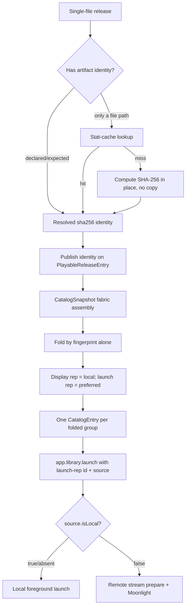

# Federated single-file release folding

## Summary

Give releases a way to resolve to a content-addressed fingerprint (reusing the existing `sha256:<hex64>` artifact model), compute that fingerprint in place for a device's own single-file files without copying them, publish it in the federated catalog, and then fold same-fingerprint releases across storages into one user-facing item that prefers a locally launchable copy, falls back to remote streaming, and carries an availability signal each surface can render in its own way.

---

## Problem Frame

Federation v1 lets a device see games from peers, but every peer copy is emitted as a separate `CatalogEntry`, so the same game shows as multiple tiles. The desired model is `Game -> Release -> Storage`: a game is metadata, a release is the concrete playable thing, and storages are the places a release exists.

Folding requires a trustworthy cross-device identity. Slugs are explicitly untrusted across storages. The codebase already has the right identity primitive — content-addressed artifacts keyed by `sha256:<hex64>` with a `digests`/`expectedDigests` shape (`product/platform/library/config/records/artifact.ts`, established by the native artifact import work). However, that identity is **not wired through releases**: a release `file` target is `{ kind, storage, path }` with no artifact reference, the artifact link exists only on the legacy game record, and hand-added config games have no artifact at all. So today a federated release cannot tell another device its content hash, and folding has nothing to compare.

This plan builds the missing foundation narrowly (single-file releases only, additive, no big-bang migration) but in the exact shape the future broader `contentPath -> artifact` migration will use, so nothing here is throwaway.

---

## Requirements

- R1. A release can resolve to a content-addressed identity (a "fingerprint") using the existing artifact model, not a new parallel hash field. The fingerprint is identifier-kind-agnostic: a content hash today, with native identifiers (e.g. Steam/itch) using the same mechanism later.
- R2. A device computes the fingerprint only for its own local single-file files, reading them in place and never copying the file. Remote copies arrive already carrying the owning host's published fingerprint.
- R3. A release's resolved fingerprint is published in the federated catalog (`PlayableReleaseEntry`) so other devices can compare it without fetching or re-hashing remote files.
- R4. Releases with the same fingerprint across storages fold into one user-facing catalog item. The fingerprint alone is the identity; the system label is not part of the match and never blocks a fold.
- R5. Slug/playable IDs are never a folding key; same-slug entries without a matching fingerprint stay distinct.
- R6. The folded item prefers a locally launchable copy; if local exists but cannot launch, it prefers a launchable remote and uses existing Moonlight/Sunshine federation routing.
- R7. When a local candidate exists, its display metadata stays authoritative even when the launch target is a remote copy; launch identity/source come from the launch target.
- R8. The release fingerprint reference is additive and forward-compatible with the planned broader `contentPath -> artifact` migration; path-based releases keep working unchanged.
- R9. Folding and its availability signal are computed by the daemon/catalog layer; surfaces consume ready-folded catalog truth.
- R10. The folded item exposes structured availability signal — which copies exist, which are local vs remote, which are launchable now, and whether the preferred copy's host is currently reachable — so each surface can choose its own state treatment.
- R11. Pressing launch on a folded item falls back to another launchable copy in the same fold when the preferred target is unreachable, and otherwise fails with a specific message naming the host; it never surfaces a generic error.
- R12. While the user is actively navigating a rail, folds do not reflow it; pending merges settle on the next navigation/screen change/idle moment, and if a merge touches the focused tile, focus moves to the surviving tile.
- R13. v1 excludes multi-file/manifest hashing, wiring native identifiers (Steam/itch) into the catalog, fuzzy/title scoring, durable cluster persistence, copy-over launching, full per-surface presence UI, and a source-picker UI. The fold mechanism is identifier-agnostic, but v1 only populates content-hash fingerprints.

---

## Scope Boundaries

- Only single-file `file`-target releases get fingerprint resolution and folding in v1.
- Fingerprinting never copies a file: a device hashes its own files in place. Byte adoption into the artifact blob store stays the import/acquisition path's job.
- The release fingerprint reference is additive: a release may resolve to one, but path-only releases remain valid and unchanged. No big-bang `contentPath -> artifact` conversion.
- v1 ships the availability signal on folded entries; full per-surface presence treatments (home fade/pop, library disabled-but-favoritable) are phased follow-ups, not v1.
- v1 does not rewrite user config YAML to persist computed fingerprints; computation is resolved/cached at runtime. Config write-back belongs to the future scanner/importer.
- `file-set`, executable, URL, and provider-ref targets are out of scope for v1 artifact resolution and folding.
- No multi-file manifest hashing, Steam/native-ID folding, fuzzy/title matching, or non-intrusive "similar games" suggestions.
- No durable `GameCluster` records, stable cluster IDs, or user merge/split/reject overrides in v1.
- No source-picker UI (North/Y menu); Shift simply shows fewer, folded tiles.
- No copy-over/download-to-local launch path.
- Peer trust posture stays federation v1 trusted-LAN/no-auth; no pairing/authorization added.

### Deferred to Follow-Up Work

- Broader `contentPath -> artifact` migration for all targets (owned by the native artifact import effort, `docs/plans/2026-06-04-002-feat-native-artifact-import-plan.md`).
- Multi-file release identity via sorted manifest-of-hashes / DAT / CHD header SHA1.
- Steam appid and other native-ID folding once `externalIds` are surfaced into the catalog wire shape.
- Durable cluster persistence with stable IDs, and manual merge/split/reject overrides.
- Source-picker UI exposing all storages for a folded release.
- Config write-back of computed artifact references (scanner-owned).
- Copy-over/download-to-local launch path.
- Remote-source SSRF/`controlUrl` trust hardening, parked at `work/parking-lot/01KTPAJV8ZF1N4WCXSZ9XVZ2KE-constrain-remote-source-controlurl-to-discovered-trusted-peers.md`.

---

## Context & Research

### Relevant Code and Patterns

- `product/platform/library/config/records/artifact.ts` — settled artifact shape: `ArtifactRecord.id = sha256:<hex64>`, `digests` (`DigestSet`, sha256 required), `expectedDigests` (claimed-but-unverified), plus `externalIds`. This is the one hash home.
- `product/platform/protocol/artifact/artifact.ts` — `ArtifactId` (`sha256:<hex64>`), `DigestSet`, `ExpectedDigestSet` definitions.
- `product/platform/library/config/records/game.ts` — already enforces "exactly one of `contentPath` or `content.artifactId`" on the legacy game record; this is the established reference shape to mirror at the release level.
- `product/platform/library/config/records/library-item.ts` — strict `LibraryReleasePayload`; `file` target is `{ kind, storage, path }` with no artifact link. New optional fields must be explicitly declared (strict `onExcessProperty: "error"`).
- `product/platform/library/playable-library.ts` — runtime `PlayableReleaseEntry` / `PlayableLibraryEntry`; no content identity field today.
- `product/platform/library/proseql/library-repository.ts` — `toPlayableReleaseEntry` projection; artifact import already writes `ArtifactRecord` + a `file`-target release and a legacy `content: { artifactId }` (lines ~695-766), and resolves artifact blob paths for launch.
- `product/platform/artifacts/artifact-import-service.ts` / `artifact-store.ts` — existing SHA-256 compute and content-addressed identity; reuse the hashing for in-place fingerprinting, not the byte-copy/adoption side effect.
- `product/platform/library/proseql/config-graph-db.ts` / `library-db-core.ts` — the `artifacts` sidecar collection where artifact records live and are looked up.
- `product/apps/portal/api/catalog/catalog-snapshot.ts` — assembles `entries: [...localTagged, ...remoteTagged]`; the fold seam and the place self-scope publishes release identity.
- `product/apps/portal/api/catalog/snapshot.rpc.ts` — `CatalogEntry = PlayableLibraryEntry + EntrySource`.
- `product/apps/portal/peers/peer-source-fetcher.ts` — retags only `source`; release content identity round-trips once it exists on `PlayableReleaseEntry`.
- `product/apps/portal/api/library/launch.rpc-handler.ts` — routes `source.isLocal === false` to remote Moonlight prepare/launch; local/absent source launches locally.
- `product/apps/portal/features/home/launcher-layer-rpc.ts` — forwards `LaunchOptions.source` through `app.library.launch`.
- `product/surfaces/web/shift/catalog/shift-catalog-state.ts`, `product/surfaces/web/shift/templates/ShiftHomeRoot.tsx` — consume catalog entries as provided.

### Institutional Learnings

- `docs/research/game-library-entity-resolution-deduplication.md` — identity cascade + false-positive warning: only auto-fold on high-confidence identity (hash/exact id); never on title in v1.
- `docs/plans/2026-06-04-002-feat-native-artifact-import-plan.md` (U5) — the blessed `content: { artifactId }` + "exactly one of path/artifact" pattern this plan mirrors at the release level; this plan is a dependency-aligned forward slice, not a competing design.
- `docs/solutions/runtime-errors/effect-rpc-server-headers-concat-undefined-crash-2026-05-27.md` — keep the RPC envelope guard on the LAN-exposed federation path.
- `docs/solutions/runtime-errors/kiosk-renderer-local-launch-rpc-decode-failure-2026-05-27.md` — local-source launches must go through `app.library.launch`, never a renderer-to-bun bridge.
- `docs/solutions/design-patterns/explicit-cascade-folded-policy-over-incidental-signal-heuristics-2026-05-27.md` — stamp preference facts in the daemon; do not infer source priority in the UI.

### External References

- Plex/Jellyfin: one logical item with multiple versions/sources; auto-prefer local/direct-play, manual version choice as progressive disclosure.
- RomM / Playmatch / Hasheous: hash-first ROM identity; name only as low-confidence fallback.
- Nix substituters / IPFS providers: content-addressed identity with multiple providers and local/nearest preference — the direct analogy for "same hash, prefer local copy."

---

## Key Technical Decisions

- One fingerprint home: folding identity is the existing content-addressed artifact (`sha256:<hex64>`), reached via a release artifact reference. No new parallel hash field on releases.
- Identity is the fingerprint alone, not `(system, fingerprint)`: an exact fingerprint match proves the files are identical, so the system label must not gate folding. Differing system labels across hosts (e.g. `gb` vs `gameboy`) must never block a valid fold; use the local label for display. System/title/metadata are reserved for the future fuzzy scoring tier (backlogged, `01KVXQJ1TPKPMPVSJW30GQ3MSE`).
- Identifier-kind-agnostic mechanism: model the fold key as a typed content identity so a content hash is one kind and a native identifier (Steam/itch) is another, sharing one fold path. v1 only populates content-hash fingerprints.
- Mirror the blessed reference shape: add `content: { artifactId }` to releases with the same "exactly one of `contentPath`/path-target or `artifactId`" spirit already enforced on the legacy game record, so the future broader migration applies the identical shape.
- Fingerprinting is local-only and in place: a device computes fingerprints solely for files it physically holds, reading them where they sit and never copying bytes into the artifact blob store. Byte adoption/copying stays the import/acquisition path's job. Hybrid claimed-vs-verified maps onto the existing `expectedDigests` (claimed) vs `digests` (verified) contract.
- Compute lazily in the background and cache locally: never hash on the hot path uncached. A device fingerprints its un-fingerprinted local files in the background after boot; games appear immediately and folds settle in. Use a cheap stat-keyed (path + size + mtime) local cache purely to avoid re-reading files; this cache never crosses devices and plays no part in matching.
- Publish identity, resolve privately for launch: the resolved fingerprint rides on the federated `PlayableReleaseEntry`; blob-path resolution for launch stays local.
- Fold in the daemon catalog path on the fingerprint; surfaces consume folded output.
- Expose availability signal on the folded entry: derive local-launchable / remote-available / remote-unreachable from fold state plus peer presence (the snapshot already tracks peer status), so surfaces can fade, disable, pop, or favorite as fits their context. v1 provides the signal; per-surface treatments are phased.
- Separate display from launch without breaking launch RPC: local non-identity display fields (title, media, collections, display) stay authoritative when a local candidate exists, but `id`, release-selection context, and `source` come from the launch target so a remote launch addresses the remote peer's own playable id.
- Prefer local launchable, then deterministic launchable remote (order by `source.controlUrl`, then `source.hostId`, then entry id); existing `source.isLocal === false` routing handles streaming. On launch, fall back to another launchable copy in the fold before failing, and fail with a host-named message.
- Keep additive fold metadata topology-blind (count/boolean only, no per-peer host/controlUrl lists on each entry).
- Keep peer `entryCount` diagnostics raw (pre-fold) so federation health stays debuggable.
- Do not mutate user config YAML in v1; resolve/compute at runtime and cache. Config write-back is scanner-owned.

---

## Open Questions

### Resolved During Planning

- Where do hashes live? In the existing content-addressed artifact model (`digests`/`expectedDigests`, id `sha256:<hex64>`); releases reference an artifact, not a new field.
- Declared vs computed? Hybrid: declared/expected wins, else compute in place — the existing claimed-vs-verified split.
- Is the system label part of the match? No. The fingerprint alone is the identity; differing system labels never block a fold.
- Does fingerprinting copy files? No. Local files are hashed in place; only the import path copies bytes.
- When does fingerprinting run? In the background after boot; games appear immediately and folds settle in; results are cached.
- Unreachable remote target at launch? Fall back to another copy in the fold, else fail naming the host; surfaces also get an availability signal to pre-empt it.
- Who fingerprints a remote game? The host that holds it; other devices compare its published fingerprint and never re-hash it.
- Does the release->artifact link exist today? No. It exists on the legacy game record only; releases use path targets. v1 adds it at the release level, single-file only.
- Is the stat cache part of matching? No. It is a local re-hash-avoidance cache only; cross-device identity is the SHA-256.
- How wide is v1? Single-file `file` targets only, additive, no migration, but in the migration's eventual shape.
- Default launch behavior? Prefer local launchable; else launchable remote via existing routing.
- Does v1 write computed hashes back to config? No; runtime-resolved + cached. Write-back is deferred to the scanner.

### Deferred to Implementation

- Exact placement of the release artifact reference (on the `file` target vs a release-level `content: { artifactId }`) — pick the option that most cleanly mirrors `game.ts` and the planned migration; keep the "exactly one content source" invariant.
- Exact local cache location/format for computed digests (reuse artifact-store/library sidecar conventions vs a small dedicated cache) — decide against current artifact-store helpers.
- Whether the first uncached snapshot returns unfolded entries while background hashing fills in, or blocks briefly — decide based on observed library sizes and the existing peer-refresh background pattern.
- Mixed-version old-coordinator/new-peer decode tolerance for the added release field — characterize on the peer client path while implementing; capture a rollout note rather than expanding scope.

---

## High-Level Technical Design

> *This illustrates the intended approach and is directional guidance for review, not implementation specification. The implementing agent should treat it as context, not code to reproduce.*

The new critical path is `R -> ID -> P` (a release knowing and publishing its content identity). Folding (`F`) is the small final step on top.

---

## Implementation Units

### U1. Add a release-level artifact reference (additive, single-file)

**Goal:** Let a release reference a content-addressed artifact in the same shape as the legacy game record, preserving path-based releases.

**Requirements:** R1, R8

**Dependencies:** None

**Files:**
- Modify: `product/platform/library/config/records/library-item.ts`
- Modify: `product/platform/library/playable-library.ts`
- Modify: `product/platform/library/proseql/library-repository.ts`
- Test: `product/platform/library/config/records/library-item.test.ts`
- Test: `product/platform/library/proseql/library-repository.test.ts`

**Approach:**
- Add an optional artifact reference to a release (mirroring `content: { artifactId }` on `game.ts`), validated with `ArtifactId`.
- Keep path targets valid; enforce a "release declares at most one concrete content source" rule consistent with the game-level "exactly one" invariant, scoped so existing path-only releases stay valid.
- Project the reference through `toPlayableReleaseEntry` onto `PlayableReleaseEntry` so it can ride in the catalog later.
- Restrict the new reference's v1 meaning to single-file `file` content; do not add it to `file-set`/executable/url/provider-ref semantics.

**Execution note:** Add characterization tests for current path-only release decode before adding the artifact reference.

**Patterns to follow:**
- `content: { artifactId }` + "exactly one" rule in `product/platform/library/config/records/game.ts`.
- `toPlayableReleaseEntry` projection in `product/platform/library/proseql/library-repository.ts`.

**Test scenarios:**
- Happy path: a release with a valid `artifactId` decodes and projects the reference onto `PlayableReleaseEntry`.
- Happy path: an existing path-only release still decodes and launches unchanged.
- Error path: a release declaring both a file target and an `artifactId` is rejected by the "exactly one content source" rule.
- Error path: a malformed `artifactId` is rejected.
- Edge case: a non-file target with an `artifactId` is rejected or ignored per the chosen v1 restriction.

**Verification:**
- Releases can carry an optional artifact reference; path-only releases are unaffected.

---

### U2. Resolve and compute fingerprint in place for single-file releases

**Goal:** Produce a resolved fingerprint for a device's own single-file releases — from a declared reference when present, otherwise by computing it in place — with a local cache that avoids re-reading files and without ever copying the file.

**Requirements:** R2, R8

**Dependencies:** U1

**Files:**
- Create: `product/platform/library/content-identity/release-content-identity.ts` *(name/location finalized against existing artifact-store layout)*
- Modify: `product/platform/library/proseql/library-repository.ts`
- Test: `product/platform/library/content-identity/release-content-identity.test.ts`
- Test: `product/platform/library/proseql/library-repository.test.ts`

**Approach:**
- Resolve identity only for local files. Remote entries already carry the owning host's published fingerprint and are never read or re-hashed here.
- For a local single-file release: if it already references an artifact (declared) or a verified digest exists, use that identity.
- Otherwise resolve the file via its storage/path, check the stat-keyed cache (`path + size + mtime -> sha256`), and on miss compute the SHA-256 once **reading the file in place — never copying it into the artifact blob store** — record the content-addressed identity (an artifact record/digest entry that can reference the existing location), and cache the result.
- Treat declared-but-unverified identities as `expectedDigests` until computed/verified, consistent with the artifact model.
- Do not write the computed reference back into user config YAML in v1.
- Keep computation off the catalog hot path: callers get a fast cached answer; uncached files resolve in the background and folds settle in on later refreshes.

**Execution note:** Implement compute/cache test-first using real temp files and real hashing (no mock hashers).

**Patterns to follow:**
- SHA-256 compute in `product/platform/artifacts/artifact-import-service.ts` (reuse the hashing, not the byte-copy/adoption side effect) and `artifact-store.ts`.
- Stat/cache discipline like `product/platform/library/game-assets/candidate-cache.ts`.

**Test scenarios:**
- Happy path: a release referencing an existing artifact resolves to that fingerprint without recomputation.
- Happy path: a local single-file release with only a path computes its fingerprint in place and returns the identity.
- Edge case: computing identity does not create a second copy of the file in the artifact blob store (assert no blob write/duplication).
- Edge case: a second resolution of an unchanged file uses the cache and does not re-read the file (assert via a recording filesystem/real temp file).
- Edge case: a changed file (different size/mtime) recomputes and updates the cache.
- Edge case: a missing/unreadable file yields no identity and does not throw the caller.
- Edge case: a remote entry is never read/hashed locally; its published fingerprint is used as-is.
- Error path: a declared-but-mismatched digest is surfaced as unverified/expected, not silently trusted as verified.

**Verification:**
- Local single-file releases obtain a fingerprint with no file copying; repeated resolution is cheap; remote fingerprints are consumed, not recomputed.

---

### U3. Publish resolved content identity in the catalog snapshot

**Goal:** Surface each single-file release's resolved content identity on the federated `PlayableReleaseEntry` so peers can compare it.

**Requirements:** R3, R9

**Dependencies:** U2

**Files:**
- Modify: `product/platform/library/playable-library.ts`
- Modify: `product/apps/portal/api/catalog/catalog-snapshot.ts`
- Modify: `product/apps/portal/api/catalog/snapshot.rpc.ts` *(only if a wire field beyond the projected reference is needed)*
- Test: `product/apps/portal/api/catalog/snapshot.rpc-handler.test.ts`
- Test: `product/apps/portal/api/catalog/snapshot.rpc.test.ts`

**Approach:**
- Ensure the resolved identity (the artifact `sha256`, i.e. `ArtifactId`) is present on the runtime/wire `PlayableReleaseEntry` for single-file releases, populated for both `self` and `fabric` scopes.
- Keep `self` scope a complete source-of-truth feed (identity present, no folding) so peers can fetch and compare.
- Resolve identity using U2 with the cache; the snapshot must stay responsive (return what is cached, fill in over refreshes).
- Keep the field additive and optional so peers without it remain decodable.

**Patterns to follow:**
- `CatalogSnapshotLive.getSnapshot` assembly in `product/apps/portal/api/catalog/catalog-snapshot.ts`.
- Additive optional schema fields per the native-artifact additive approach.

**Test scenarios:**
- Happy path: a `self` snapshot exposes the resolved `sha256` identity on a single-file release.
- Integration: identity resolved from a config/library record is observable on the corresponding `PlayableReleaseEntry` in the snapshot, end to end.
- Edge case: a release whose identity is not yet cached returns without the identity rather than blocking the snapshot.
- Edge case: path-only releases without resolvable identity simply carry no identity and never fold.
- Integration: RPC response decodes successfully with the additive field; characterize old-coordinator tolerance on the peer client path.

**Verification:**
- Single-file releases publish their content identity in `self` and `fabric` snapshots.

---

### U4. Build a pure catalog folding adapter

**Goal:** Deterministically fold catalog entries sharing the same fingerprint, choose display and launch representatives, and derive the availability signal.

**Requirements:** R4, R5, R6, R7, R10, R13

**Dependencies:** U3

**Files:**
- Create: `product/apps/portal/api/catalog/fold-catalog-entries.ts`
- Test: `product/apps/portal/api/catalog/fold-catalog-entries.test.ts`

**Approach:**
- Group foldable candidates by the resolved fingerprint alone. The system label is never part of the key; identical fingerprints fold even when hosts label the system differently. Entries without a resolved fingerprint are not foldable and pass through unchanged even if slugs match.
- Fold across different slugs when the fingerprint matches; slug equality is never part of the positive match path.
- Restrict v1 folding to unambiguous single-release entries (or entries where every emitted release shares the same single-file fingerprint); do not partially merge one release inside a multi-release entry.
- Launch representative order: local launchable, then deterministic launchable remote (`source.controlUrl`, then `source.hostId`, then entry id), else deterministic first candidate.
- Display representative: when any local candidate exists, keep its non-identity display fields (title, media, collections, display) and use the local system label; take `id`, release-selection context, and `source` from the launch representative.
- Carry the launch representative's whole `source`; a remote-preferred fold must carry `source.isLocal === false` and the remote peer's playable id.
- Derive an availability signal per folded entry from the copies and peer presence: `local-launchable`, `remote-available` (preferred target is a currently-present peer), or `remote-unreachable` (only remote copies, none on a present peer). Keep it topology-blind (no per-peer host lists on the entry).
- Keep any fold metadata additive and topology-blind.

**Execution note:** Pure adapter, test-first, no Effect runtime. Take peer-presence as an input argument so the adapter stays pure.

**Technical design:** *(directional guidance, not implementation specification)*

| Candidates (same fingerprint) | Display rep | Launch rep | Availability | Visible count |
|---|---|---|---|---|
| local launchable + remote launchable | local | local | local-launchable | 1 |
| local not launchable + remote launchable (present peer) | local non-identity display | remote id/release/source | remote-available | 1 |
| remote launchable only (present peer) | first deterministic remote | first deterministic remote | remote-available | 1 |
| remote only, no present peer | first deterministic remote | first deterministic remote | remote-unreachable | 1 |
| different slug, same fingerprint | preferred display candidate | preferred launch candidate | derived | 1 |
| same slug, no/different fingerprint | no fold | no fold | n/a | unchanged |
| different system label, same fingerprint | local display + local label | preferred launch | derived | 1 (folds) |
| partial match in a multi-release entry | no fold in v1 | no fold in v1 | n/a | unchanged |

**Patterns to follow:**
- Pure ADT/adapter style in `product/surfaces/web/shift/catalog/shift-catalog-state.ts`.
- `EntrySource` identity in `product/platform/api/rpc/entry-source.ts`.

**Test scenarios:**
- Happy path: local + remote, different slugs, same fingerprint fold to one entry.
- Happy path: local launchable + remote, same fingerprint -> display and source local, availability `local-launchable`.
- Happy path: local not launchable + remote launchable on a present peer -> local non-identity display, remote launch id + `source.isLocal === false`, availability `remote-available`.
- Happy path: same fingerprint but different system labels across hosts -> still folds into one entry; display uses the local label.
- Happy path: two launchable remotes, no local -> one deterministic remote by documented order.
- Edge case: remote-only fold with no present peer -> availability `remote-unreachable`.
- Edge case: same slug, different fingerprint -> separate.
- Edge case: same slug, no fingerprint -> separate.
- Edge case: multi-release partial match -> no fold in v1.
- Edge case: empty input -> empty output.

**Verification:**
- One visible entry per same-fingerprint group regardless of system label; never folds on slug; availability derived deterministically.

---

### U5. Apply folding in fabric catalog responses

**Goal:** Insert the fold adapter into the daemon catalog assembly so all surfaces receive folded `fabric` entries.

**Requirements:** R4, R9

**Dependencies:** U4

**Files:**
- Modify: `product/apps/portal/api/catalog/catalog-snapshot.ts`
- Test: `product/apps/portal/api/catalog/snapshot.rpc-handler.test.ts`

**Approach:**
- Fold only `scope: "fabric"` after local + remote entries are assembled; leave `scope: "self"` unfolded.
- Pass current peer presence (already tracked in the snapshot's peer states) into the pure fold adapter so each folded entry's availability signal is derived consistently.
- Keep peer health and `entryCount` based on raw results; document the expected post-fold mismatch where visible `entries.length` can be smaller than summed peer counts.
- Keep folding a pure projection over the current snapshot; no new background refresh or stateful cluster cache.

**Patterns to follow:**
- `CatalogSnapshotLive.getSnapshot` flow and peer-failure degradation in `product/apps/portal/peers/peer-source-fetcher.ts`.

**Test scenarios:**
- Happy path: `fabric` with local + remote same-identity entries returns one folded entry.
- Happy path: `self` returns unfolded entries with identity intact.
- Integration: peer `entryCount` stays raw while visible `entries` are folded; test asserts the mismatch is expected.
- Edge case: remote refresh failure still returns local folded candidates and does not fail the snapshot.
- Edge case: old peer entries without identity remain visible as separate entries.

**Verification:**
- `fabric` folds same-identity candidates; `self` stays a complete source feed.

---

### U6. Verify launch routing for folded entries

**Goal:** Prove the folded entry's launch representative `source` drives existing local/remote routing, falls back to another copy in the fold when the preferred target is unreachable, and fails with a host-named message — without a new launch path.

**Requirements:** R6, R7, R11

**Dependencies:** U4, U5

**Files:**
- Modify: `product/apps/portal/api/library/launch.rpc-handler.ts`
- Modify: `product/apps/portal/api/library/launch.rpc-handler.test.ts`
- Modify: `product/apps/portal/features/home/launcher-layer-rpc.ts` *(only if tests reveal source/release threading gaps)*
- Test: `product/apps/portal/api/library/launch.rpc-handler.test.ts`

**Approach:**
- Cover both branches: local-preferred folded entry launches locally; remote-preferred folded entry calls `RemoteStreamPrepare` then Moonlight.
- Assert the routing invariant explicitly: a remote-preferred folded entry carries the remote `source` with `source.isLocal === false` and the remote peer's playable id.
- When the preferred remote target is unreachable, fall back to another launchable copy in the same fold; if none remains, fail with a specific message naming the host, not a generic error.
- Add no UI-side fallback logic and no new launcher bridge.

**Patterns to follow:**
- Federation routing in `product/apps/portal/api/library/launch.rpc-handler.ts`; source forwarding in `product/apps/portal/features/home/launcher-layer-rpc.ts`.

**Test scenarios:**
- Happy path: folded entry with `source.isLocal === true` launches via the local path.
- Happy path: folded entry with `source.isLocal === false` calls remote prepare before Moonlight.
- Edge case: local present but not launchable -> remote launch id/source used, local display retained.
- Edge case: preferred remote unreachable but another launchable copy exists in the fold -> launch falls back to that copy.
- Error path: preferred remote unreachable and no fallback copy -> failure message names the host; not a generic error.
- Error path: remote prepare failure returns the existing failed launch response shape.

**Verification:**
- No new launch transport; preferred-source routing, in-fold fallback, and host-named failure observable in tests.

---

### U7. Shift consumption: render folded output, consume availability, keep focus stable

**Goal:** Ensure Shift renders folded catalog output as ordinary entries with no UI-side dedupe, can read the availability signal, and keeps focus stable when folds settle live.

**Requirements:** R9, R10, R12, R13

**Dependencies:** U5

**Files:**
- Modify: `product/surfaces/web/shift/catalog/shift-catalog-state.test.ts`
- Modify: `product/surfaces/web/shift/catalog/shift-catalog-state.ts` *(only if additive fold/availability metadata needs explicit preservation in the ADT)*
- Modify: `product/surfaces/web/shift/templates/ShiftHomeRoot.tsx` and/or `product/surfaces/web/shift/organisms/ShiftHomeRail.tsx` *(focus-stability behavior)*
- Test: `product/surfaces/web/shift/catalog/shift-catalog-state.test.ts`

**Approach:**
- Keep `ShiftCatalogState.fromResult` a pure adapter over `CatalogSnapshotResponse.entries`; it must not fold or infer source preference, but it should carry the availability signal through to the view.
- Focus stability: do not reflow a rail the user is actively navigating. Settle pending merges on the next navigation/screen change/idle moment; if a merge touches the focused tile, move focus to the surviving tile rather than dropping it.
- v1 consumes the availability signal minimally (enough to prove it is present and usable); full per-surface treatments (fade/pop on the home stack, disabled-but-favoritable in the library) are phased follow-ups.
- No source badges, picker, North/Y menu, or launch-option UI in v1.

**Patterns to follow:**
- Shift state ADT in `product/surfaces/web/shift/catalog/shift-catalog-state.ts`; functional state-component pattern.
- Focus/`data-tile-id` handling in `product/surfaces/web/shift/organisms/ShiftHomeRail.tsx`.

**Test scenarios:**
- Happy path: a snapshot with one folded entry produces `Ready` with one game.
- Happy path: the availability signal is preserved through `fromResult` to the view model.
- Edge case: a live merge while the user is on the rail does not reflow it; the merge settles on next navigation/idle.
- Edge case: a merge that touches the focused tile moves focus to the surviving tile (no dead cursor).
- Edge case: old non-identity duplicate entries still produce multiple games (daemon did not fold them).
- Edge case: empty folded snapshot produces `Empty`.
- Error path: load error / defect handling unchanged.

**Verification:**
- No UI-side folding required; availability signal is consumable; focus never jumps under the user during a live merge.

---

### U8. Add federated single-file fixtures

**Goal:** Provide realistic same-identity-across-storage fixtures for federation tests.

**Requirements:** R4, R5

**Dependencies:** U3, U5

**Files:**
- Modify: `product/platform/fixtures` *(specific file chosen against current fixture layout)*
- Modify: `tools/testing/fixtures` *(only if catalog RPC tests draw from these)*
- Test: `product/apps/portal/api/catalog/snapshot.rpc-handler.test.ts`

**Approach:**
- Add minimal fixtures for two storages sharing an identity and for a same-slug/different-identity negative case.
- Prefer existing fixture factories; do not create new global fixture directories.

**Test scenarios:**
- Integration: fixture-fed snapshot folds same identity into one entry.
- Integration: fixture-fed snapshot keeps same-slug/different-identity entries separate.
- Edge case: fixture with old peer data lacking identity remains compatible.

**Verification:**
- Federation folding is exercised with realistic fixtures.

---

## System-Wide Impact

- **Interaction graph:** release artifact reference -> resolved identity (U2) -> `PlayableReleaseEntry` (U3) -> `CatalogSnapshotLive` fold (U5) -> Shift atoms -> `app.library.launch`. The behavior change concentrates in identity resolution and the daemon projection.
- **Error propagation:** schema errors for malformed references surface as readable-library config errors; unresolved/missing identity yields no fold (never a snapshot failure); peer fetch failures stay partial.
- **State lifecycle risks:** the stat-keyed cache must invalidate on file change; folding is stateless (no durable clusters in v1). The compute path must not re-hash whole libraries every boot — persist/reuse cached identities.
- **Performance:** first-time hashing of a large single-file library is the main cost; mitigate with persistent cache + off-hot-path resolution. Snapshots must remain responsive.
- **Trust boundary risks:** peer-provided identity is trusted under federation v1 trusted-LAN/no-auth; folding can make a remote launch target less visually obvious, so local display stays authoritative and the parked `controlUrl` hardening remains relevant.
- **API surface parity:** `self` scope stays a complete identity-bearing source feed; `fabric` becomes the folded user-facing view.
- **Migration alignment:** the release artifact reference is the forward slice of the native-artifact `contentPath -> artifact` migration; it must not diverge from that intended shape.
- **Unchanged invariants:** `EntrySource` stays the structural source-routing tag; path-based releases keep working; peer discovery and trust posture unchanged; old peers without identity stay visible rather than guessed into folds.

---

## Risks & Dependencies

| Risk | Mitigation |
|------|------------|
| Release fingerprint reference diverges from the planned migration shape and becomes throwaway | Mirror `game.ts` `content: { artifactId }` + "exactly one" rule; coordinate with `docs/plans/2026-06-04-002`. |
| Fingerprinting doubles disk by copying files into the blob store | Hash in place; never copy a file to fingerprint it; reserve blob adoption for the import path. |
| Hashing large libraries stalls the catalog/handheld | Background fingerprinting after boot; persistent stat-keyed cache; resolve off the hot path; first snapshot may be unfolded and fill in. |
| System labels differ across hosts and block valid folds | Fold on the fingerprint alone; never gate on system; use the local label for display. |
| False-positive merge collapses different games | Fold only on an exact fingerprint match; never on slug/title in v1 (fuzzy scoring is a backlogged later tier). |
| Live merge moves a tile under the user's cursor | Don't reflow an actively-navigated rail; settle on next navigation/idle; pin focus to the surviving tile. |
| Remote-only game's host is unreachable at launch | Fall back to another launchable copy in the fold; else fail with a host-named message; expose availability signal so surfaces can pre-empt. |
| Peer-crafted identity makes a remote source win a fold under trusted-LAN assumptions | Accept under v1 trusted-LAN posture; keep local display authoritative; topology-blind fold metadata. |
| Folding hides that a remote `controlUrl` is the launch target | Keep parked SSRF/controlUrl hardening visible; test that remote-preferred entries carry `source.isLocal === false`. |
| Additive release field breaks strict readable-library decode if declared in the wrong layer | Declare on `LibraryReleasePayload`; cover strict decode tests. |
| Mixed-version old coordinator rejects the new peer field | Characterize peer-client decode tolerance; document software-before-config rollout if needed. |
| v1 quietly swallows the broader migration | Hard scope to single-file `file` targets, additive, no config write-back, no other target kinds. |

---

## Documentation / Operational Notes

- Coordinate with `docs/plans/2026-06-04-002-feat-native-artifact-import-plan.md` (U5) so the release artifact reference matches the migration's intended shape; note this plan as the first release-level slice.
- Roll out daemon software that understands the additive release reference before any config starts declaring it (strict decode rejects unknown fields on older software).
- No Nix module/image default changes expected for v1; folding runs inside existing `korrid` catalog handling. If a future durable cluster service or LAN-visible endpoint is added, apply image-level federation posture checks from `docs/solutions/architecture-patterns/architectural-posture-as-nix-image-default-2026-05-27.md`.

---

## Alternative Approaches Considered

- New `contentDigest` field on releases (original draft): rejected — it reinvents the artifact model and creates a second hash home that would be ripped out.
- Side cache of file hashes separate from artifacts: rejected — two hash homes to reconcile later; conflicts with the one-home decision.
- Full `contentPath -> artifact` migration now: rejected for v1 — balloons scope into the native-artifact plan's deferred epic; v1 takes the narrow forward slice instead.
- Client-side Shift folding: rejected — duplicates matching across surfaces and desyncs diagnostics from what users see.
- Slug-based folding: rejected — slugs are untrusted across storages; false positives are worse than missed folds.

---

## Phased Delivery

### Phase 1 — v1 single-file folding (this plan)

- Release fingerprint reference (single-file, additive) + in-place compute + cache.
- Publish the fingerprint in the catalog; fold `fabric` on the fingerprint alone; prefer local launchable; expose availability signal.
- Keep Shift simple; verify one visible item.

### Phase 2 — stronger identity inputs

- Surface `externalIds` (Steam appid and friends) into catalog releases; add exact-ID folding tiers.

### Phase 3 — durable and fuzzy grouping + broader migration

- Multi-file manifest/DAT/CHD identity; durable clusters with overrides; non-intrusive similar-game suggestions; broader `contentPath -> artifact` migration.

---

## Sources & References

- Work item: `work/items/active/01KVVMYE5SFC4H8X5H0EBY7WG3-federated-single-file-folding/work.md`
- Related plan (dependency-aligned): `docs/plans/2026-06-04-002-feat-native-artifact-import-plan.md`
- Research: `docs/research/game-library-entity-resolution-deduplication.md`
- Artifact model: `product/platform/library/config/records/artifact.ts`, `product/platform/protocol/artifact/artifact.ts`
- Game-level reference shape: `product/platform/library/config/records/game.ts`
- Release schema: `product/platform/library/config/records/library-item.ts`, `product/platform/library/playable-library.ts`
- Repository projection + artifact import: `product/platform/library/proseql/library-repository.ts`, `product/platform/artifacts/artifact-import-service.ts`
- Catalog assembly: `product/apps/portal/api/catalog/catalog-snapshot.ts`, `product/apps/portal/api/catalog/snapshot.rpc.ts`
- Launch router: `product/apps/portal/api/library/launch.rpc-handler.ts`
- Shift catalog state: `product/surfaces/web/shift/catalog/shift-catalog-state.ts`
