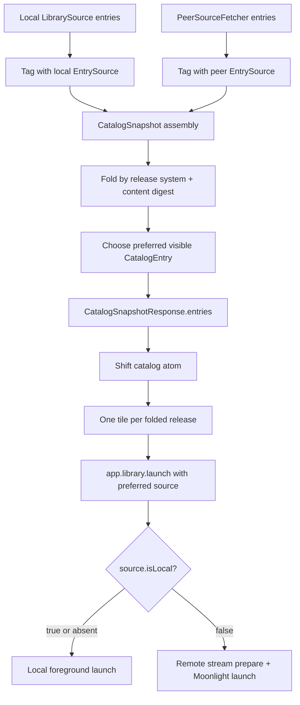

# Federated single-file release folding

## Summary

Add v1 federated release folding for single-file content hashes: the daemon will recognize identical single-file releases across local and remote storages, emit one preferred catalog entry, and preserve existing launch routing so Shift's default action runs a local launchable copy when available and falls back to remote streaming when it is not.

---

## Problem Frame

Federation v1 lets a device see games from peer devices, but it currently emits every peer copy as a separate `CatalogEntry`. That produces duplicate tiles for the same release and pushes storage/location complexity into the user experience. The desired model is `Game -> Release -> Storage`: a game is metadata, a release is the concrete playable thing, and storages are the places where that release exists.

For the first shippable pass, only strong single-file identity is in scope. Slug IDs are not trusted across storages. A matching `sha256:<hex64>` content digest on single-file releases is strong enough to fold automatically.

---

## Requirements

- R1. A release with the same single-file content digest on multiple storages appears as one user-facing catalog item instead of multiple peer tiles.
- R2. Slug/playable IDs are not used as a folding key; entries with the same slug but different or missing content digests remain distinct.
- R3. Folding is computed by the daemon/catalog layer, not independently by each surface, so surfaces receive ready-to-render catalog truth.
- R4. The preferred folded entry selects a locally launchable copy when one exists.
- R5. If the local storage has the release but cannot launch it, the folded entry can prefer a launchable remote copy and use existing Moonlight/Sunshine federation routing.
- R6. The v1 contract is schema-additive and backward-compatible for peers that do not yet emit content digest metadata.
- R7. The v1 implementation does not introduce fuzzy matching, multi-file manifest hashing, Steam/native-ID folding, copy-over behavior, or a source-picker UI.
- R8. When a local candidate exists, local display metadata remains authoritative even if launch preference falls back to a remote source.

---

## Scope Boundaries

- Single-file content-digest folding only; `file-set`, executable, URL, provider-ref, Steam/native-ID, and fuzzy title matching are excluded from v1 automatic folding.
- Partial folding of multi-release entries is excluded from v1. To avoid corrupting release selection semantics, the v1 fold adapter should only fold unambiguous single-release entries or equivalently constrained entries where every emitted release participates in the same single-file digest identity.
- Content digests are declared/projected from library metadata in v1; the daemon must not scan and hash ROM files during catalog listing.
- The existing `app.catalog.snapshot` response remains the primary catalog path; this plan does not add a new standalone federation endpoint.
- The existing `app.library.launch` source routing remains the launch transport; this plan does not add a new launch bridge, new Moonlight path, or file-copy transaction.
- Shift should benefit from fewer catalog entries, but this plan does not build the North/Y explicit source picker.
- Peer trust/auth posture remains federation v1 trusted-LAN/no-auth; this plan does not add pairing or authorization.

### Deferred to Follow-Up Work

- Multi-file release identity via sorted manifest-of-hashes.
- Steam appid and other provider/native-ID folding once native identifiers are surfaced into the catalog wire shape.
- Non-intrusive fuzzy-match suggestions and manual merge/split/reject workflows.
- Durable `GameCluster` persistence with stable cluster IDs and user overrides.
- Source-picker UI that exposes all storages for a folded release.
- Copy-over/download-to-local launch path.
- Remote-source SSRF hardening for `source.controlUrl` trust boundaries, already parked separately in `work/parking-lot/01KTPAJV8ZF1N4WCXSZ9XVZ2KE-constrain-remote-source-controlurl-to-discovered-trusted-peers.md`.

---

## Context & Research

### Relevant Code and Patterns

- `product/apps/portal/api/catalog/catalog-snapshot.ts` assembles `localTagged` and `remoteTagged` entries, then currently returns `entries: [...localTagged, ...remoteTagged]`. This is the natural daemon-side fold seam.
- `product/apps/portal/api/catalog/snapshot.rpc.ts` defines `CatalogEntry = PlayableLibraryEntry + EntrySource`; adding digest metadata to `PlayableReleaseEntry` flows into catalog entries structurally.
- `product/platform/library/playable-library.ts` defines `PlayableReleaseEntry` and `PlayableLibraryEntry`; releases currently have `id`, `system`, `target`, `launch`, `display`, `install`, and `launchable`, but no content digest.
- `product/platform/library/config/records/library-item.ts` defines strict readable-library release payloads. New release fields must be explicitly declared or strict decode rejects them as excess properties.
- `product/platform/protocol/artifact/artifact.ts` already defines `ArtifactId` as canonical `sha256:<hex64>` and `DigestSet` / `ExpectedDigestSet` patterns.
- `product/platform/library/proseql/library-repository.ts` converts readable-library releases through `toPlayableReleaseEntry`; digest propagation should happen at this boundary.
- `product/apps/portal/peers/peer-source-fetcher.ts` preserves peer entries and retags only `source`, so peer-emitted release digest metadata will round-trip through federation once it exists on `PlayableReleaseEntry`.
- `product/apps/portal/api/library/launch.rpc-handler.ts` already routes `source.isLocal === false` to remote Moonlight prepare/launch and treats local/absent source as local.
- `product/apps/portal/features/home/launcher-layer-rpc.ts` forwards `LaunchOptions.source` through `app.library.launch`; local launches should continue using this standard RPC path.
- `product/surfaces/web/shift/catalog/shift-catalog-state.ts` and `product/surfaces/web/shift/templates/ShiftHomeRoot.tsx` consume catalog entries as provided; basic v1 folding should not require UI-side dedupe.

### Institutional Learnings

- `docs/research/game-library-entity-resolution-deduplication.md` establishes the identity cascade and the false-positive warning: auto-fold only on high-confidence identifiers; fuzzy matching needs a review UX and is not v1.
- `docs/solutions/runtime-errors/effect-rpc-server-headers-concat-undefined-crash-2026-05-27.md` reinforces keeping the existing RPC envelope guard on the LAN-exposed federation path.
- `docs/solutions/runtime-errors/kiosk-renderer-local-launch-rpc-decode-failure-2026-05-27.md` reinforces that local-source launches must go through `app.library.launch`, not a renderer-to-bun-to-server bridge.
- `docs/solutions/design-patterns/explicit-cascade-folded-policy-over-incidental-signal-heuristics-2026-05-27.md` argues for daemon-stamped preference facts rather than UI-side source heuristics.
- `docs/solutions/best-practices/proseql-canonical-library-with-derived-yaml-ids-2026-05-06.md` will matter for future durable clusters, but v1 intentionally stays stateless to keep scope small.
- `docs/solutions/best-practices/react-state-components-over-result-render-props-for-effect-atoms-2026-05-03.md` remains the UI pattern if a source-picker state surface is added later.

### External References

- Plex/Jellyfin prior art: one logical media item can have multiple versions/sources, with automatic default playback and manual version choice as progressive disclosure.
- Playnite DuplicateHider prior art: one game tile can hide lower-priority copies, but title-based automatic matching is fragile and needs manual escape hatches.
- RomM / Playmatch / Hasheous prior art: ROM identity is strongest when anchored on content hashes and external databases; name fallback is lower confidence.
- IPFS/Nix analogies: content-addressed identity maps naturally to multiple providers/substituters, with local/nearest preferred.

---

## Key Technical Decisions

- Compute v1 folding in the daemon catalog path: `CatalogSnapshotLive` already has local and remote entries together, so it can provide one consistent grouped truth to all surfaces.
- Use release-level content digest as the fold key: v1 folds the same release across storages, not whole games by slug or title.
- Reuse canonical `ArtifactId` shape for single-file digest metadata: this keeps `sha256:<hex64>` validation consistent with artifact and game-asset code.
- Match by release-level `(release.system, release.contentDigest)`, not by digest alone, entry-level `system`, or entry slug: release `system` is required where entry `system` is optional, and slugs are explicitly untrusted across storages.
- Keep v1 output compatible with `CatalogEntry[]`: emit one visible entry per folded group, with launch identity/routing fields drawn from the launch-preferred representative and non-identity display fields drawn from the best local representative when one exists.
- Separate display representative from launch representative without breaking launch RPC: local title, media, collections, and display metadata remain authoritative when a local candidate exists, but `id`, release-selection context, and `source` must come from the launch representative so remote launches address the remote peer's own playable id.
- Prefer local launchable entries over remote launchable entries during fold selection; if local exists but is not launchable, prefer a launchable remote so existing `source.isLocal === false` launch routing streams from the peer.
- Use deterministic remote tie-breaking for v1 when no local candidate is launchable: order launchable remotes by `source.controlUrl`, then `source.hostId`, then entry id.
- Keep additive fold metadata topology-blind in v1: expose at most count/boolean-style facts needed by future UI, not per-peer `controlUrl` or host lists on each entry.
- Keep peer diagnostics pre-folded: peer `entryCount` should continue to describe what each peer returned, not the post-fold visible count, so federation health remains debuggable.

---

## Open Questions

### Resolved During Planning

- Should slug IDs fold entries? No. Slug/playable IDs are not trusted across storages.
- What is v1 identity proof? Single-file content hash only, using canonical SHA-256-style digest metadata.
- Who computes the grouping? The daemon/catalog layer computes grouping; surfaces consume the result.
- What is the default launch behavior? Prefer a locally launchable copy; otherwise use a launchable remote via existing federation routing.
- Should different slugs with the same digest fold? Yes. Digest identity wins; the visible entry uses local display identity when a local candidate exists, otherwise the deterministic preferred remote representative.
- What level supplies the system key? Release-level `release.system`, because entry-level `system` is optional.
- What happens to multi-release partial matches? They are not folded in v1 unless the entry shape is unambiguous; partial release-level folding is deferred.
- How are multiple remotes ordered? Deterministically by `source.controlUrl`, then `source.hostId`, then entry id.

### Deferred to Implementation

- Exact additive field name for release digest metadata: choose a readable name that aligns with existing config conventions while preserving the `ArtifactId` validation shape.
- Exact fold metadata shape on the returned `CatalogEntry`: keep it additive and minimal for v1; do not block v1 on the future source-picker contract.
- Mixed-version old-coordinator/new-peer behavior: characterize the current peer RPC decode path while implementing U3. If old coordinators reject additive release fields, document software-before-metadata rollout ordering; do not block v1 on backwards-compatible behavior for already-deployed old coordinators.
- Whether existing fixtures need digest annotations to exercise integration paths: U3 may use inline fixtures for focused coverage; U6 can add shareable fixtures after the behavior is proven.

---

## High-Level Technical Design

> *This illustrates the intended approach and is directional guidance for review, not implementation specification. The implementing agent should treat it as context, not code to reproduce.*

The important boundary is between `E` and `F`: all candidate entries are still diagnosable, but the visible response becomes folded before any surface receives it.

---

## Implementation Units

### U1. Add single-file release digest metadata

**Goal:** Let readable-library releases declare a canonical single-file content digest and carry it into runtime `PlayableReleaseEntry` records.

**Requirements:** R1, R2, R6

**Dependencies:** None

**Files:**
- Modify: `product/platform/library/config/records/library-item.ts`
- Modify: `product/platform/library/playable-library.ts`
- Modify: `product/platform/library/proseql/library-repository.ts`
- Test: `product/platform/library/config/records/library-item.test.ts`
- Test: `product/platform/library/proseql/library-repository.test.ts`

**Approach:**
- Add an optional release-level field for canonical single-file digest metadata, validated with the existing `ArtifactId` shape from `product/platform/protocol/artifact/artifact.ts`.
- Keep the field optional and release-scoped; peers that lack digest metadata remain valid and simply do not participate in v1 folding.
- Propagate the field through readable-library hydration into `PlayableReleaseEntry` so it appears in `CatalogEntry.releases` without adding a parallel catalog-only type.
- Do not add digest fields to `FileSetTarget` or compute digests from the filesystem in this unit.

**Execution note:** Implement new domain behavior test-first; schema changes are strict and should fail before the field is declared.

**Patterns to follow:**
- `ArtifactId` validation in `product/platform/protocol/artifact/artifact.ts`.
- Strict readable-record decode tests in `product/platform/library/config/records/library-item.test.ts`.
- `toPlayableReleaseEntry` projection pattern in `product/platform/library/proseql/library-repository.ts`.

**Test scenarios:**
- Happy path: a library release with a valid `sha256:<hex64>` digest decodes successfully and preserves the digest on the runtime playable release.
- Edge case: a release without digest metadata still decodes and produces a playable release with no digest field.
- Error path: a release with a malformed digest is rejected by readable-library schema validation.
- Error path: a digest on a non-file target remains accepted only if the field is intentionally release-level; if implementation chooses to restrict v1 to `target.kind === "file"`, schema or projection tests must assert the chosen restriction.
- Integration: `listPlayableEntries` / repository hydration returns the digest on `PlayableReleaseEntry` so `CatalogSnapshot` can fold without reaching back into config records.

**Verification:**
- Runtime playable entries expose optional digest metadata on releases.
- Existing readable-library records without the field remain valid.

---

### U2. Build a pure catalog folding adapter

**Goal:** Create a deterministic, side-effect-free function that folds catalog entries sharing the same single-file release digest and chooses the preferred visible entry.

**Requirements:** R1, R2, R4, R5, R7

**Dependencies:** U1

**Files:**
- Create: `product/apps/portal/api/catalog/fold-catalog-entries.ts`
- Test: `product/apps/portal/api/catalog/fold-catalog-entries.test.ts`

**Approach:**
- Group foldable release candidates by release-level `(release.system, release.contentDigest)`.
- Treat entries without digest metadata as not foldable; they pass through unchanged even if slug IDs match.
- Fold different slugs when the release-level digest key matches; slug identity must not be part of the positive match path.
- Restrict v1 folding to unambiguous single-release entries, or equivalently constrained entries where every emitted release participates in the same single-file digest identity; do not partially merge one release inside a multi-release entry.
- Choose the launch representative in this order: locally launchable candidate, deterministic launchable remote candidate, otherwise deterministic first candidate.
- Choose the display representative separately for non-identity fields: when any local candidate exists, keep local title, media, collections, and display metadata even if the launch representative is remote.
- Carry the launch representative's `id`, release-selection context, and entire `source` object. When the preferred launch representative is remote, the folded visible entry must carry the remote peer's playable id and `source.isLocal === false` so existing launch routing streams from that peer.
- Keep any all-source/fold metadata additive, topology-blind, and non-authoritative for v1; the preferred entry remains the visible item.
- Make ordering deterministic so UI focus and tests remain stable across refreshes.

**Execution note:** Implement the pure adapter test-first; it has no Effect runtime dependencies.

**Technical design:** *(directional guidance, not implementation specification)*

Decision matrix for a group with the same `(system, digest)`:

| Candidates | Display representative | Launch representative | Visible count |
|---|---|---|---|
| local launchable + remote launchable | local | local | 1 |
| local present but not launchable + remote launchable | local non-identity display fields | remote id/release/source | 1 |
| remote launchable only | first deterministic remote | first deterministic remote | 1 |
| no launchable candidates | first deterministic candidate | first deterministic candidate | 1 |
| different slug but same release digest | preferred display candidate | preferred launch candidate | 1 |
| same slug but missing/different digest | no fold | no fold | unchanged |
| partial match inside a multi-release entry | no fold in v1 | no fold in v1 | unchanged |

**Patterns to follow:**
- Pure ADT/adapter style used by `product/surfaces/web/shift/catalog/shift-catalog-state.ts`.
- Federation identity via `EntrySource` in `product/platform/api/rpc/entry-source.ts`.

**Test scenarios:**
- Happy path: local and remote entries with different slugs but the same release digest fold into one visible entry.
- Happy path: local and remote entries with the same release digest fold into one entry whose display fields and `source` are local when local is launchable.
- Happy path: local non-launchable entry and remote launchable entry with the same digest fold into one entry that keeps local non-identity display fields but carries the remote launch id and remote `source` with `source.isLocal === false`.
- Happy path: two launchable remote entries with no local fold to one deterministic remote entry using the documented remote ordering.
- Edge case: entries with the same slug but different digests remain separate.
- Edge case: entries with the same slug but no digest remain separate.
- Edge case: entries with the same digest but different release systems remain separate.
- Edge case: a multi-release entry with only one digest-matched release does not partially fold in v1.
- Edge case: empty input returns empty output.
- Error path: malformed digest values should be impossible after schema validation; if tests construct malformed objects directly, the adapter should ignore them or treat them as non-foldable rather than throwing.

**Verification:**
- The adapter produces one visible entry for same-digest candidates and does not fold on slug equality.
- The adapter is deterministic and covered without network, RPC, or Effect layer setup.

---

### U3. Apply folding in catalog snapshot responses

**Goal:** Insert the pure folding adapter into the daemon's federated catalog assembly so all surfaces receive folded entries from `app.catalog.snapshot`.

**Requirements:** R1, R3, R4, R5, R6

**Dependencies:** U2

**Files:**
- Modify: `product/apps/portal/api/catalog/catalog-snapshot.ts`
- Test: `product/apps/portal/api/catalog/snapshot.rpc-handler.test.ts`
- Test: `product/apps/portal/api/catalog/snapshot.rpc.test.ts`

**Approach:**
- Apply folding only to `scope: "fabric"` responses after local and remote entries are assembled.
- Keep `scope: "self"` self-only output unchanged so peer fetchers can retrieve source-local facts without recursive federation folding.
- Keep peer health and peer `entryCount` based on raw local/remote results so diagnostics continue to show what each peer contributed; document the expected post-fold mismatch where visible `entries.length` can be smaller than raw peer counts.
- Preserve generation/update semantics; folding should be a pure projection over the current snapshot, not a new background refresh or stateful cache.
- Characterize additive-field behavior through the peer fetch/RPC decode path while implementing tests; if mixed-version old coordinator behavior is not lenient, capture the rollout note rather than changing v1 scope.

**Patterns to follow:**
- Current `CatalogSnapshotLive.getSnapshot` flow in `product/apps/portal/api/catalog/catalog-snapshot.ts`.
- Peer failure degradation in `product/apps/portal/peers/peer-source-fetcher.ts`.

**Test scenarios:**
- Happy path: `fabric` scope with a local and remote same-digest entry returns one folded entry.
- Happy path: `self` scope with a local digest-bearing entry returns the self entry unchanged and exposes the digest for peer fan-out.
- Integration: digest declared in readable library config is observable on the corresponding `PlayableReleaseEntry` in a catalog snapshot response.
- Integration: peer `entryCount` still reflects raw peer result counts even when visible `entries` are folded, and the test asserts that this mismatch is expected.
- Edge case: remote refresh failure still returns local folded candidates where possible and does not fail the snapshot.
- Edge case: old peer entries without digest metadata remain visible as separate entries.
- Integration: Effect RPC response decodes successfully after optional digest metadata is added; characterize whether unknown additive fields are tolerated on the peer client path.

**Verification:**
- `app.catalog.snapshot({ scope: "fabric" })` emits folded entries for same-digest candidates.
- `app.catalog.snapshot({ scope: "self" })` remains a self-only source feed for federation fan-out.

---

### U4. Verify launch behavior for preferred folded entries

**Goal:** Prove the folded entry's preferred `source` drives the existing local/remote launch router without adding a new launch path.

**Requirements:** R4, R5

**Dependencies:** U2, U3

**Files:**
- Modify: `product/apps/portal/api/library/launch.rpc-handler.test.ts`
- Modify: `product/apps/portal/features/home/launcher-layer-rpc.ts` *(only if tests reveal the existing source threading misses release selection data)*
- Test: `product/apps/portal/api/library/launch.rpc-handler.test.ts`

**Approach:**
- Add coverage around the existing branch: preferred local folded entries launch through the local path; preferred remote folded entries launch through `RemoteStreamPrepare` and Moonlight composition.
- Assert the source-routing invariant explicitly: a remote-preferred folded entry carries the remote representative's `source` object with `source.isLocal === false`.
- Do not introduce UI-side fallback logic or a new launcher bridge.
- Preserve current `releaseId` threading behavior; because partial multi-release folding is deferred, v1 should not require Shift to invent release selection for folded multi-release entries.

**Patterns to follow:**
- Existing federation routing comments and tests in `product/apps/portal/api/library/launch.rpc-handler.ts` and `product/apps/portal/api/library/launch.rpc-handler.test.ts`.
- Launcher source forwarding in `product/apps/portal/features/home/launcher-layer-rpc.ts`.

**Test scenarios:**
- Happy path: a folded representative with `source.isLocal === true` launches through the local resolver/foreground-session path.
- Happy path: a folded representative with `source.isLocal === false` calls remote stream prepare before launching Moonlight.
- Edge case: local entry exists but is not launchable; the catalog fold keeps local non-identity display fields, carries remote launch id/source, and the launch handler uses remote routing.
- Error path: remote prepare failure still returns the existing failed launch response shape.
- Integration: renderer-layer launch source forwarding remains sufficient for the selected folded representative.

**Verification:**
- No new launch bridge or transport path is added.
- Preferred source selection is observable through existing launch-handler tests.

---

### U5. Keep Shift consumption simple and regression-covered

**Goal:** Ensure Shift treats folded catalog output as ordinary catalog entries and renders one item without adding UI-side dedupe logic.

**Requirements:** R1, R3, R7

**Dependencies:** U3

**Files:**
- Modify: `product/surfaces/web/shift/catalog/shift-catalog-state.test.ts`
- Modify: `product/surfaces/web/shift/catalog/shift-catalog-state.ts` *(only if the additive fold metadata needs explicit preservation in the ADT)*
- Test: `product/surfaces/web/shift/catalog/shift-catalog-state.test.ts`

**Approach:**
- Keep `ShiftCatalogState.fromResult` as a seam that adapts `CatalogSnapshotResponse.entries` into the Shift ADT; it should not fold or infer source preference.
- Add fixture coverage showing that folded catalog output remains a single `Ready` item and that empty/error states remain unchanged.
- Avoid source badges, source picker, North/Y menu, or launch-option UI in v1.

**Patterns to follow:**
- Current Shift state ADT in `product/surfaces/web/shift/catalog/shift-catalog-state.ts`.
- Functional state component pattern from project React conventions.

**Test scenarios:**
- Happy path: a snapshot with one folded/preferred entry produces `Ready` with one game.
- Edge case: a snapshot with old non-digest duplicate entries still produces multiple games because daemon did not fold them.
- Edge case: empty folded snapshot still produces `Empty`.
- Error path: load error and defect handling remain unchanged.

**Verification:**
- Shift tests prove no UI-side folding is required.
- Existing rail/key behavior continues to work with the smaller folded entry set.

---

### U6. Add fixture/config coverage for federated single-file examples

**Goal:** Provide representative digest-bearing library fixtures so future federation tests have realistic same-release-across-storage examples.

**Requirements:** R1, R2, R6

**Dependencies:** U1, U3

**Files:**
- Modify: `product/platform/fixtures` *(specific fixture file to be selected during implementation based on current fixture organization)*
- Modify: `tools/testing/fixtures` *(only if catalog RPC tests already draw from these fixtures)*
- Test: `product/apps/portal/api/catalog/snapshot.rpc-handler.test.ts`

**Approach:**
- Add minimal fixture data for two storages/peers that share a digest and for a same-slug/different-digest negative case.
- Keep fixture additions small and focused on catalog/federation behavior; do not expand into full metadata enrichment fixtures.
- Prefer existing fixture factories over new global fixture directories.

**Patterns to follow:**
- Existing catalog snapshot test fixtures in `product/apps/portal/api/catalog/snapshot.rpc-handler.test.ts`.
- Existing readable-library test fixtures in `product/platform/library/proseql/library-repository.test.ts`.

**Test scenarios:**
- Integration: fixture-fed catalog snapshot folds same digest into one visible entry.
- Integration: fixture-fed catalog snapshot keeps same-slug/different-digest entries separate.
- Edge case: fixture with old peer data lacking digest remains compatible.

**Verification:**
- Tests can exercise v1 folding without constructing unrealistic hand-made objects in every case.

---

## System-Wide Impact

- **Interaction graph:** `LibraryReleasePayload` -> `PlayableReleaseEntry` -> `CatalogEntry` -> `CatalogSnapshotLive` -> Shift catalog atoms -> `app.library.launch`. The core behavior change is in the daemon projection, not in UI rendering.
- **Error propagation:** Schema validation failures for malformed digests should surface as readable-library config errors. Peer fetch failures remain partial catalog failures and must not break local snapshots.
- **State lifecycle risks:** Folding is stateless in v1; it should not create durable clusters, caches, or override records. This avoids stale cluster state while the identity model is still single-file only.
- **Trust boundary risks:** Peer-provided digest metadata is trusted under federation v1's trusted-LAN/no-auth posture. Folding can make a remote launch target less visually obvious, so display metadata should remain local when available and the existing `controlUrl` hardening backlog item remains important.
- **API surface parity:** `scope: "self"` must stay self-only and unfurled enough for peers to fetch source-local facts. `scope: "fabric"` becomes the folded user-facing view.
- **Integration coverage:** RPC decode coverage is needed because catalog response schemas cross peers and browser clients. Launch routing coverage is needed because the chosen `source` determines local vs remote behavior.
- **Unchanged invariants:** EntrySource remains the structural source-routing tag. Peer discovery and trusted-LAN/no-auth posture remain unchanged. Old peers without digest metadata remain visible rather than being guessed into folds.

---

## Risks & Dependencies

| Risk | Mitigation |
|------|------------|
| False-positive merge collapses different releases into one item | Fold only on explicit single-file digest plus system; never on slug/title in v1. |
| Digest metadata is absent for most current library records | Keep field optional; absence means no fold, not an error. |
| UI accidentally reintroduces source preference heuristics | Do daemon-side preference selection and keep Shift tests focused on consuming output, not inferring source choice. |
| `scope: "self"` gets folded and breaks peer fan-out semantics | Test self scope separately and keep folding only on fabric scope. |
| Peer diagnostics become confusing if folded visible count replaces raw peer count | Keep peer `entryCount` raw and only fold `entries`. |
| Peer-crafted digest metadata can make a remote source join or win a fold under trusted-LAN assumptions | Accept under v1 trusted-LAN/no-auth posture, keep local display metadata authoritative when local exists, and do not expose peer topology in per-entry fold metadata. |
| Folding makes remote `controlUrl` launches less visually obvious when local is non-launchable | Keep the SSRF/controlUrl hardening item visible as a follow-up risk and explicitly test that remote-preferred entries carry `source.isLocal === false`. |
| Remote-source launch remains capable of targeting arbitrary `controlUrl` | Keep this outside v1 but reference the existing parked SSRF hardening item. |
| Additive schema field breaks strict readable-library decode if declared in the wrong layer | Add the field to `LibraryReleasePayload` and cover strict decode tests. |
| Library config is annotated before daemon software understands the new field | Document software-before-metadata rollout ordering because strict readable-library decode rejects excess fields. |

---

## Documentation / Operational Notes

- Update or extend `docs/research/game-library-entity-resolution-deduplication.md` only if implementation decisions materially change the researched v1 scope; otherwise it remains an input reference, not an implementation doc.
- No Nix module or image default changes are expected for v1 because folding runs inside existing `korrid` catalog handling.
- Roll out daemon software that declares the optional digest field before annotating library YAML with digest metadata; strict decode will reject unknown fields on older software.
- If a future durable cluster service or LAN-visible endpoint is introduced, apply image-level federation posture checks from `docs/solutions/architecture-patterns/architectural-posture-as-nix-image-default-2026-05-27.md`.

---

## Alternative Approaches Considered

- Client-side Shift folding: rejected for v1 because it would duplicate matching logic across surfaces and make daemon/API diagnostics disagree with what users see.
- Slug-based phase 1 folding: rejected because the user explicitly does not trust IDs across storages and false-positive folds are worse than missed folds.
- Durable `GameCluster` persistence in v1: deferred because the first pass only needs exact single-file digest folding; durable overrides become valuable once fuzzy/manual grouping exists.
- New `app.catalog.foldedSnapshot` RPC: rejected for v1 because `app.catalog.snapshot` is already the catalog fabric contract and can evolve additively.

---

## Phased Delivery

### Phase 1 — v1 single-file folding

- Add optional single-file digest metadata on releases.
- Fold `fabric` catalog entries by `(system, digest)`.
- Prefer local launchable source, then launchable remote.
- Keep Shift simple and verify one visible item.

### Phase 2 — stronger identity inputs

- Surface Steam appid and provider/native IDs into catalog releases.
- Add exact-ID folding tiers before hash or beside hash as appropriate.

### Phase 3 — durable and fuzzy grouping

- Add durable clusters, user merge/split/reject overrides, multi-file manifest hashing, and non-intrusive similar-game suggestions.

---

## Sources & References

- Work item: `work/items/active/01KVVMYE5SFC4H8X5H0EBY7WG3-federated-single-file-folding/work.md`
- Research: `docs/research/game-library-entity-resolution-deduplication.md`
- Catalog snapshot assembly: `product/apps/portal/api/catalog/catalog-snapshot.ts`
- Catalog RPC schema: `product/apps/portal/api/catalog/snapshot.rpc.ts`
- Playable library schema: `product/platform/library/playable-library.ts`
- Readable library release schema: `product/platform/library/config/records/library-item.ts`
- Repository projection: `product/platform/library/proseql/library-repository.ts`
- Artifact digest schema: `product/platform/protocol/artifact/artifact.ts`
- Launch router: `product/apps/portal/api/library/launch.rpc-handler.ts`
- Shift catalog state: `product/surfaces/web/shift/catalog/shift-catalog-state.ts`
- External prior art: Plex/Jellyfin versions, Playnite DuplicateHider, RomM/Playmatch/Hasheous, IPFS content addressing, Nix substituter preference.
