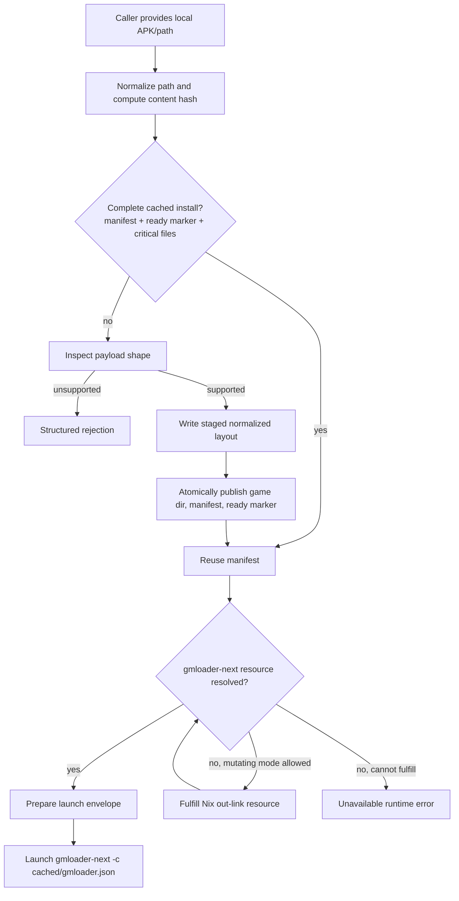

# feat: Add nix-run-like GMLoader path launch caching

## Summary

Add a one-action GMLoader path launch flow: a caller can provide a local APK/path, Korri idempotently prepares a normalized cached payload, ensures the packaged `gmloader-next` runtime resource is available through the plugin resource system, and returns a launch spec. The existing explicit install + installed-library manifest model remains the durable cache substrate; this plan adds the `nix run`-like front door over it.

---

## Problem Frame

The current GMLoader plugin shape separates importing a compatible APK from launching an installed entry. That is safe, but it does not match the desired user mental model: “I have an APK; run it, building/preparing whatever is missing and reusing cache next time.”

---

## Assumptions

*This plan was authored without a synchronous confirmation loop after the scope synthesis. The items below are agent inferences that should be reviewed before implementation proceeds.*

- The target base branch includes the completed `@korri:gmloader` plugin and self-contained `gmloader-next` runtime package from commit `a4db7c1a` or its equivalent on `trunk`.
- The high-level “background build” behavior should use Korri’s existing plugin executable-resource fulfillment/out-link model, not a literal `nix run` shell-out during launch.
- It is acceptable for the mutating path-launch/materialization operation to have side effects; read-only `canResolve` and library listing paths must remain side-effect-free.
- The first version does not need a full progress UI. It should expose enough diagnostics to distinguish cache hit, cache miss/materialized, runtime fulfilled, runtime missing, and unsupported payload.

---

## Requirements

- R1. Accept an arbitrary local source path for a compatible GameMaker Android payload, especially an APK downloaded outside Korri.
- R2. On first launch, inspect and normalize the payload into Korri-owned GMLoader state before launching.
- R3. On subsequent launches of the same byte-for-byte payload, reuse the cached normalized install rather than re-extracting.
- R4. Ensure the `gmloader-next` runtime through the plugin-owned executable resource path; do not require `KORRI_GMLOADER_NEXT_BIN` for normal devices.
- R5. Keep source handling source-agnostic: no itch.io, PortMaster, or filename provenance branches in the core launch path.
- R6. Preserve safety boundaries: hostile archive limits, no symlink escape, no partial install treated as complete, no accidental overwrite of valid installs.
- R7. Surface structured, actionable errors for unsupported payloads, missing runtime, partial/corrupt cache, and missing installed files.
- R8. Keep explicit install and installed-library launching working; the path-run flow is an additional front door, not a replacement.

---

## Scope Boundaries

- Does not add 32-bit/armhf GMLoader runtime support.
- Does not implement the newer Android asset-manager compatibility shim.
- Does not require a PortMaster or itch.io adapter.
- Does not solve RG353M EGL/GBM environment discovery; that remains a platform follow-up.
- Does not add full portal UI for browsing arbitrary APKs unless an existing caller already exposes a path picker.
- Does not remove or redesign installed GMLoader manifests.

### Deferred to Follow-Up Work

- Add uninstall and cache pruning for installed/cached GMLoader payloads: tracked as `01KVXCY3TYKEBKN32S3N87GKVW`.
- Validate the full path-run flow on RG353M with real payloads: continue under `01KVW0GSM85F7RY7ATYDB4DN63` after this plan lands.
- Add asset-manager-mode support for newer GameMaker APKs: continue under `01KVVERQWZ1W8AWWGE06MCRTQT`.

---

## Context & Research

### Relevant Code and Patterns

- `product/plugins/gmloader/src/plugin.ts` defines current explicit operations: `gmloader.payload.inspect`, `gmloader.install`, and `gmloader.prepare-launch`.
- `product/plugins/gmloader/src/installer.ts` already normalizes supported payloads and derives content-hash-backed install IDs.
- `product/plugins/gmloader/src/library-source.ts` reads installed manifests and resolves installed entries through a runtime resolver.
- `product/plugins/gmloader/src/envelope.ts` builds the final `gmloader-next -c <gmloader.json>` launch spec and validates critical installed files.
- `product/plugins/library-source-layer.ts` resolves the `gmloader-next` executable resource for installed-library launches.
- `product/plugins/ryubing/src/materializer.ts` is the closest pattern for idempotent state-root creation and atomic config writes.
- `product/plugins/retroarch/src/materializer.ts` is the closest pattern for launch-time materialization, partial cleanup, and cache/artifact root management.
- `product/plugins/steam/src/materializer.ts` and `product/plugins/steam/src/state-materializer.ts` establish the typed materializer + lock pattern for stateful plugin launch prep.
- `product/platform/library/proseql/library-repository.ts` owns `ReadableLaunchIntegration`, `canResolve`, and `materialize` handoff behavior.
- `product/plugins/AGENTS.md` requires plugin-owned Nix artifacts, explicit resource fulfillment, no `nix run` at launch time, and focused plugin tests.

### Institutional Learnings

- Plugin-owned runtime/composition boundaries should stay under the owning plugin, following the Gamescope plugin-owned composition lesson.
- Normalize external sources once into Korri-owned state, then run from the normalized result; this matches the ProseQL canonical-library learning.
- Explicit compatibility/profile facts should be written during inspection/materialization rather than re-sniffed at launch time.
- Background or lazy runtime fulfillment is not a broad established pattern in the repo; the plan uses the existing explicit Nix out-link fulfiller as the controlled side-effect surface.

### External References

- No external research used. The repo already has direct local patterns for plugin materializers, resource fulfillment, cache identity, and launch spec construction.

---

## Key Technical Decisions

- **Add a GMLoader path-run service over the existing installer:** The explicit install path already owns payload inspection, safe extraction, and manifest writing; reusing it avoids a second cache format.
- **Use content hash as the cache key:** It makes repeated launches of the same APK idempotent even when the file moves or is renamed.
- **Keep valid install overwrite explicit:** A valid installed payload is reused by default; destructive replacement remains opt-in until save-data location is empirically validated.
- **Use staging plus a ready sentinel for cache completion:** A manifest alone is not enough to distinguish interrupted installs from complete installs.
- **Separate read-only resolution from mutating materialization:** `canResolve`/listing paths should not build or extract; the path-run/materializer operation may prepare state and fulfill resources.
- **Resolve/fulfill runtime through plugin resources, not shell `nix run`:** This preserves Korri’s resource-root/out-link model and host capability controls.
- **Expose both a direct handler and a readable launch integration when practical:** The handler serves “agent/API passed me a path”; the readable integration serves authored library entries with `content.path`.

---

## Open Questions

### Resolved During Planning

- **Should extraction live inside the `gmloader-next` package wrapper?** No. The runtime wrapper should only wrap the AArch64 runner. Mutable payload preparation belongs in plugin code where cache identity, manifest writing, and errors are typed.
- **Should the path-run flow replace explicit install?** No. Explicit install remains useful for library import workflows and for showing installed entries.
- **Should first launch literally call `nix run`?** No. The UX is `nix run`-like, but implementation should use the existing Nix out-link resource resolver/fulfiller.

### Deferred to Implementation

- **Exact public operation name:** The plan uses `gmloader.launch.path.prepare` directionally. The implementer should choose the final operation name that fits the local handler vocabulary and tests, keeping it namespaced and stable.
- **Save-data preservation details:** Do not add destructive overwrite/preserve behavior until RG353M validation confirms where GMLoader Next writes saves for representative games.
- **Progress surface:** First implementation may return diagnostics only. If the existing caller needs streaming progress, capture that as follow-up rather than blocking the core cache/launch path.

---

## Output Structure

```text
product/plugins/gmloader/
  src/
    cache.ts                 # optional helper for ready sentinel / cache lookup / locks
    cache.test.ts
    path-launch.ts           # one-shot source path -> ensure payload -> ensure runtime -> launch envelope
    path-launch.test.ts
    materializer.ts          # readable launch integration for authored path-backed GMLoader entries
    materializer.test.ts
    runtime.ts               # optional runtime resolve/fulfill helper
    runtime.test.ts
```

The exact helper split is flexible. The important boundary is one reusable service that both the handler and readable integration can call.

---

## High-Level Technical Design

> *This illustrates the intended approach and is directional guidance for review, not implementation specification. The implementing agent should treat it as context, not code to reproduce.*



---

## Implementation Units

### U1. Make GMLoader payload installation idempotent and cache-aware

**Goal:** Convert the existing install path into a reusable “ensure installed” primitive that returns a complete manifest for a source path, reusing valid cached installs and safely recovering from interrupted attempts.

**Requirements:** R1, R2, R3, R5, R6, R8

**Dependencies:** Target base includes the existing `@korri:gmloader` plugin and installer.

**Files:**
- Modify: `product/plugins/gmloader/src/installer.ts`
- Modify: `product/plugins/gmloader/src/installer.test.ts`
- Modify: `product/plugins/gmloader/src/manifest.ts`
- Create: `product/plugins/gmloader/src/cache.ts` *(optional if helper extraction is useful)*
- Create: `product/plugins/gmloader/src/cache.test.ts` *(if `cache.ts` is created)*

**Approach:**
- Add an `ensureGmloaderPayloadInstalled`-style API that computes the same content hash/id as install and checks for an existing complete install.
- Define “complete” as: manifest decodes, manifest source hash matches, game root exists, critical files exist, and a GMLoader-ready marker exists.
- Use a staging directory for all writes and publish only after normalization succeeds; abandon or clean staging on failure.
- Keep explicit `installGmloaderPayload` behavior compatible by calling the same lower-level primitive with strict overwrite semantics.
- Introduce a per-cache-key in-memory lock or equivalent serialization so two same-APK materializations cannot interleave writes.
- Preserve the existing refusal to overwrite valid installs unless the caller explicitly requests overwrite; do not invent save-preservation behavior in this unit.

**Execution note:** Add characterization tests around current duplicate-install behavior before refactoring it into reusable ensure/cache behavior.

**Patterns to follow:**
- Atomic write pattern from `product/plugins/ryubing/src/materializer.ts`.
- Partial cleanup pattern from `product/plugins/retroarch/src/materializer.ts`.
- Existing GMLoader installer tests in `product/plugins/gmloader/src/installer.test.ts`.

**Test scenarios:**
- Happy path: supported APK/path with no prior cache materializes a game dir, manifest, compatibility profile, and ready marker.
- Happy path: same APK/path called twice returns the existing manifest on the second call without rewriting normalized files.
- Edge case: same APK reached through a different filesystem path still resolves to the same content-hash cache entry.
- Edge case: valid manifest exists but ready marker is missing; ensure treats it as incomplete and repairs through staging rather than treating it as a cache hit.
- Error path: unsupported 32-bit-only or non-GameMaker payload returns the existing structured rejection and leaves no ready marker.
- Error path: interrupted/failed staging cleanup does not remove an existing complete install.
- Concurrency: two concurrent ensure calls for the same APK return one coherent manifest and do not interleave writes into the published game root.
- Regression: explicit install without overwrite still refuses to replace an already-valid install.

**Verification:**
- A valid cached payload is reused by content hash.
- Partial installs cannot be mistaken for complete installs.
- Existing install/import tests still pass.

---

### U2. Add a GMLoader runtime resolve-or-fulfill helper

**Goal:** Provide a reusable way for mutating GMLoader launch preparation to ensure the plugin-owned `gmloader-next` executable resource is available, while preserving read-only failure semantics where fulfillment is not allowed.

**Requirements:** R4, R7, R8

**Dependencies:** Self-contained `gmloader-next` package and `gmloader-next-check` are available from the target base.

**Files:**
- Create: `product/plugins/gmloader/src/runtime.ts`
- Create: `product/plugins/gmloader/src/runtime.test.ts`
- Modify: `product/plugins/library-source-layer.ts` *(only if shared resolver plumbing belongs there)*
- Modify: `product/plugins/library-source-layer.test.ts`

**Approach:**
- Wrap the existing plugin executable-resource resolver for the `@korri:gmloader/gmloader-next` resource.
- In read-only mode, return a structured unavailable error if the out-link is absent.
- In mutating mode, if a fulfiller is configured through `KORRI_NIX_COMMAND`, run the explicit resource fulfillment path and then resolve again.
- Do not call `nix run` and do not rely on `PATH`; keep Nix as an explicit host capability.
- Return diagnostics indicating whether the runtime was already cached, fulfilled during this call, or unavailable.

**Patterns to follow:**
- `createNixOutLinkResolver`, `createNixOutLinkFulfiller`, and `createPluginResourceFulfillerFromEnv` in `product/plugins/library-source-layer.ts`.
- Plugin resource contribution in `product/plugins/gmloader/src/plugin.ts`.

**Test scenarios:**
- Happy path: existing resource out-link resolves to `bin/gmloader-next` without invoking fulfillment.
- Happy path: missing out-link in mutating mode invokes the fulfiller and resolves the resulting command.
- Error path: missing out-link in read-only mode fails with an actionable unavailable error.
- Error path: missing out-link with no configured Nix command fails without attempting to spawn Nix.
- Error path: fulfillment failure propagates as a GMLoader runtime unavailable diagnostic, not as an untyped exception.

**Verification:**
- Runtime preparation behaves like a controlled `nix run` cache miss: fulfill when explicitly allowed, otherwise fail closed.
- Installed-library launch resolution remains read-only unless this unit intentionally wires a mutating caller.

---

### U3. Add the direct source-path prepare-and-launch operation

**Goal:** Add the main `nix run`-like callable path: given a local APK/path, ensure the payload cache and runtime resource, then produce the same launch envelope used by installed entries.

**Requirements:** R1, R2, R3, R4, R5, R7, R8

**Dependencies:** U1, U2

**Files:**
- Create: `product/plugins/gmloader/src/path-launch.ts`
- Create: `product/plugins/gmloader/src/path-launch.test.ts`
- Modify: `product/plugins/gmloader/src/plugin.ts`
- Modify: `product/plugins/gmloader/src/plugin.test.ts`
- Modify: `product/plugins/gmloader/index.ts`
- Modify: `product/plugins/gmloader/src/envelope.ts` *(only if envelope input needs diagnostics metadata)*
- Modify: `product/plugins/gmloader/src/envelope.test.ts` *(only if envelope behavior changes)*

**Approach:**
- Add a plugin handler for a source-path launch preparation operation, directionally `gmloader.launch.path.prepare`.
- Handler input should include a source path and optional title/compatibility overrides; it should not require the caller to know the eventual manifest path.
- Compose U1 + U2 + `prepareGmloaderLaunchEnvelope`.
- Return plain data suitable for callers: manifest/playable id, cache status, runtime status, and launch spec/envelope.
- Keep validation at the handler boundary and map payload rejections to caller/actionable acquisition errors.
- Do not silently overwrite valid cached installs.

**Patterns to follow:**
- Handler validation style in `product/plugins/gmloader/src/plugin.ts`.
- Launch envelope construction in `product/plugins/gmloader/src/envelope.ts`.
- Error wrapping conventions from existing GMLoader handlers.

**Test scenarios:**
- Happy path: first call with a supported APK returns a launch spec using `gmloader-next -c <cached gmloader.json>` and reports cache miss/materialized.
- Happy path: second call with the same APK returns a launch spec for the same manifest and reports cache hit.
- Edge case: optional title override affects the manifest/library title without changing cache identity.
- Error path: missing `sourcePath` is rejected at the handler boundary.
- Error path: unsupported payload is rejected with the same reason as `gmloader.payload.inspect`.
- Error path: runtime unavailable after attempted fulfillment returns a structured unavailable error and leaves the completed payload cache intact.
- Integration: the returned launch spec has working directory, environment, and library paths equivalent to installed-library launches.

**Verification:**
- A caller can hand the plugin a path and receive a launchable spec without manually calling `gmloader.install` first.
- The same operation is safe to repeat and naturally reuses cache.

---

### U4. Add readable launch integration for authored path-backed GMLoader entries

**Goal:** Allow authored/readable library config to express a GMLoader app whose content is a local APK/path, so standard Korri launch resolution can materialize on first launch and reuse cache afterward.

**Requirements:** R1, R2, R3, R4, R5, R7, R8

**Dependencies:** U1, U2, U3

**Files:**
- Create: `product/plugins/gmloader/src/materializer.ts`
- Create: `product/plugins/gmloader/src/materializer.test.ts`
- Modify: `product/plugins/gmloader/index.ts`
- Modify: `product/plugins/index.ts`
- Modify: `product/plugins/index.test.ts`
- Test: `product/platform/library/proseql/library-repository.test.ts` *(add or adjust only if repository integration coverage is needed)*

**Approach:**
- Implement a `ReadableLaunchIntegration` for `kind: "@korri:gmloader"` / `providerId: "@korri:gmloader"`.
- `canResolve` should be cheap and side-effect-free: verify the context has a source path through `content.path` or an explicit plugin policy field and that the plugin kind matches.
- `materialize` should call the shared path-launch service from U3 and return the launch spec plus diagnostics.
- Register the integration through `firstPartyLaunchIntegrationsForRegistry` so it is active only when the GMLoader plugin is enabled.
- Avoid adding new platform concepts unless the existing readable integration hook cannot carry the required path and diagnostics.

**Patterns to follow:**
- `product/plugins/retroarch/src/materializer.ts` for content-path materialization.
- `product/plugins/ryubing/src/materializer.ts` for state-root validation and typed errors.
- `product/plugins/steam/src/materializer.ts` for provider/kind guards.

**Test scenarios:**
- Happy path: readable context with `content.path` for a supported APK materializes and returns a GMLoader launch spec.
- Happy path: cache hit path returns the same manifest-backed launch spec without reinstalling.
- Edge case: context has plugin policy source path but no `content.path`; materializer uses the policy path if supported by the chosen config shape.
- Error path: wrong app kind fails with `AppMaterializationFailed` rather than launching through generic process behavior.
- Error path: missing source path makes `canResolve` false and materialization fail with an actionable reason.
- Integration: `firstPartyLaunchIntegrationsForRegistry` includes the GMLoader integration only when `@korri:gmloader` is enabled.

**Verification:**
- Authored Korri library entries can behave like `nix run` for a local APK path.
- Existing RetroArch, Ryubing, Steam, and installed GMLoader launch integrations remain unaffected.

---

### U5. Surface cache/runtime diagnostics consistently

**Goal:** Make the first-run and cache-hit behavior understandable to callers without requiring them to inspect logs or infer state from timing.

**Requirements:** R3, R4, R7

**Dependencies:** U3, U4

**Files:**
- Modify: `product/plugins/gmloader/src/path-launch.ts`
- Modify: `product/plugins/gmloader/src/materializer.ts`
- Modify: `product/plugins/gmloader/src/path-launch.test.ts`
- Modify: `product/plugins/gmloader/src/materializer.test.ts`
- Modify: `product/platform/library/launch-artifacts.ts` *(only if existing diagnostics shape cannot carry the needed data)*

**Approach:**
- Return or attach concise diagnostics such as `payload-cache-hit`, `payload-materialized`, `runtime-cache-hit`, `runtime-fulfilled`, and `runtime-unavailable`.
- Keep diagnostics descriptive, not a progress protocol.
- Ensure errors preserve the original category: caller input vs unsupported payload vs unavailable runtime vs corrupt install.
- Do not add UI strings in this unit unless an existing consumer needs them.

**Patterns to follow:**
- Diagnostics arrays from `product/plugins/retroarch/src/materializer.ts` and `product/plugins/ryubing/src/materializer.ts`.
- `LibraryError` / `AppMaterializationFailed` / `AcquisitionError` category boundaries already used in launch and handler paths.

**Test scenarios:**
- Happy path: first run diagnostics identify payload materialization and runtime state.
- Happy path: second run diagnostics identify payload cache hit.
- Error path: payload rejection diagnostics do not claim runtime fulfillment happened.
- Error path: runtime fulfillment failure includes enough context to tell the user/device operator what capability is missing.
- Integration: readable materializer propagates diagnostics to the library repository result when supported.

**Verification:**
- Callers can distinguish “preparing for first run” from “launching from cache” and “runtime missing.”

---

### U6. Add end-to-end regression coverage around the path-run flow

**Goal:** Lock the complete behavior down with tests that exercise the user-visible flow rather than only helper-level units.

**Requirements:** R1, R2, R3, R4, R6, R7, R8

**Dependencies:** U1, U2, U3, U4, U5

**Files:**
- Test: `product/plugins/gmloader/src/path-launch.test.ts`
- Test: `product/plugins/gmloader/src/materializer.test.ts`
- Test: `product/plugins/gmloader/src/plugin.test.ts`
- Test: `product/plugins/index.test.ts`
- Test: `product/plugins/library-source-layer.test.ts`
- Test: `product/platform/library/proseql/library-repository.test.ts`

**Approach:**
- Build small synthetic APK/ZIP fixtures in tests using existing archive helpers rather than committing binary fixtures.
- Use temporary install/resource roots so tests prove content-addressed caching and runtime resolution behavior without touching real user state.
- Include a fake executable-resource resolver/fulfiller so tests can simulate runtime cache miss and fulfillment without running Nix.
- Keep hardware/device behavior out of this unit; RG353M validation remains a follow-up.

**Patterns to follow:**
- Existing synthetic GMLoader payload tests in `product/plugins/gmloader/src/payload.test.ts` and `product/plugins/gmloader/src/installer.test.ts`.
- Resource seeding helpers in `product/plugins/library-source-layer.test.ts`.

**Test scenarios:**
- Integration: direct path handler first run writes one normalized install and returns a launch spec.
- Integration: direct path handler second run does not rewrite/install again and returns the same playable identity.
- Integration: readable launch integration first run produces the same launch spec shape as explicit install + installed-library launch.
- Integration: runtime missing but fulfillable causes exactly one fulfillment attempt and then launch spec creation.
- Error path: partial cache state is repaired or rejected deterministically, never launched.
- Error path: corrupt archive produces a caller-facing unsupported/rejected result, not a defective-provider crash.
- Regression: existing explicit `gmloader.install` and installed-library launch tests continue passing.

**Verification:**
- The targeted verification command passes on a local developer machine without hardware access.
- The tests prove the first-run and second-run user stories directly.

---

## System-Wide Impact

- **Interaction graph:** Adds a new GMLoader launch front door that composes payload inspection/installation, plugin resource fulfillment, and launch envelope creation. It touches plugin handlers, readable launch integrations, and the live plugin library source layer.
- **Error propagation:** Unsupported payloads should remain caller/actionable errors; runtime resource failures should be unavailable errors; corrupt cache or missing installed files should be config/state errors.
- **State lifecycle risks:** Partial install, concurrent materialization, duplicate APK paths, and stale manifests are the main risks. Staging, ready markers, and per-cache-key serialization are required mitigations.
- **API surface parity:** Direct handler and readable launch integration should share the same path-launch service so agent/API callers and authored library entries behave consistently.
- **Integration coverage:** Unit tests must cover both direct handler and readable integration paths because helper tests alone will not prove the `nix run`-like flow.
- **Unchanged invariants:** Plugin resources stay plugin-owned; launch resolution does not call arbitrary `nix run`; installed-library manifests remain the source of truth for durable GMLoader library entries.

---

## Risks & Dependencies

| Risk | Mitigation |
|------|------------|
| Current checkout may not include the GMLoader plugin yet | Execute from a base that includes the completed `@korri:gmloader` plugin and self-contained runtime package, or merge that branch first. |
| Side effects during launch resolution could violate read-only expectations | Keep `canResolve` and listing side-effect-free; restrict writes to explicit materialization/handler paths. |
| Interrupted first run leaves corrupt cache | Use staging directories, atomic publish, cleanup, and a ready marker checked before reuse. |
| Concurrent launches of the same APK race | Serialize by content hash or use an equivalent lock/staging strategy. |
| Runtime build/download takes too long or is unavailable on-device | Use the existing out-link fulfiller only when configured; otherwise fail with actionable unavailable diagnostics. Prefer pre-realized `gmloader-next` on device images. |
| Save data may live in the run directory | Do not add automatic destructive overwrite/preserve behavior until hardware validation confirms save paths. |
| Path-run flow could drift from explicit install behavior | Implement both through one shared ensure/path-launch service and cover parity in tests. |

---

## Documentation / Operational Notes

- The user-facing model should be documented as: “first run prepares and caches; later runs launch from cache.”
- Device images that enable `@korri:gmloader` should include or fulfill `.#gmloader-next`; otherwise the first-run path should report a runtime-resource diagnostic.
- RG353M validation should test both cold first-run materialization and warm cache-hit launch with the Korri GUI closed.

---

## Sources & References

- Origin work item: `work/items/active/01KVXCYHNPPZY9FAQDS26CX70W-gmloader-path-run-cache/work.md`
- Existing GMLoader plan: `work/items/active/01KVVAD3QZ3H7YCKPBA2ANY4Y8-build-a-nixified-generic-gamemaker-apk-compatibility-layer/plan.md`
- Runtime follow-up: `work/items/parking-lot/01KVW0GE04T54611NY9PSH0FJ6-package-a-self-contained-gmloader-next-runtime.md`
- RG353M validation follow-up: `work/items/parking-lot/01KVW0GSM85F7RY7ATYDB4DN63-validate-generic-gmloader-plugin-on-rg353m.md`
- GMLoader plugin target files: `product/plugins/gmloader/src/plugin.ts`, `product/plugins/gmloader/src/installer.ts`, `product/plugins/gmloader/src/library-source.ts`, `product/plugins/gmloader/src/envelope.ts`
- Materializer patterns: `product/plugins/retroarch/src/materializer.ts`, `product/plugins/ryubing/src/materializer.ts`, `product/plugins/steam/src/materializer.ts`
- Plugin resource wiring: `product/plugins/library-source-layer.ts`, `product/plugins/index.ts`, `product/platform/plugin/resources.ts`
- Repository materializer seam: `product/platform/library/proseql/library-repository.ts`
