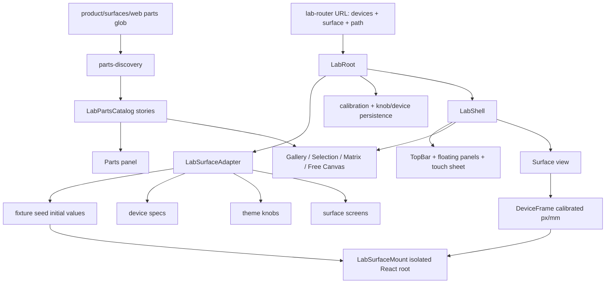

# feat: Convert dev-lab into the first-class design tool

## Summary

Convert `just dev-lab` from the current fixed device-lab chrome into the prototype-led design tool: movable panels, hideable chrome, real-size draggable parts, Matrix view, fixture-only Sources, loader States, adapter-driven Inspector, and touch-first canvas controls. The implementation should preserve the existing auto-discovered parts system and full-surface `LabSurfaceMount` workflow instead of replacing them with prototype mock data.

---

## Problem Frame

The prototype proves a better design-tool experience, but it is currently a hardcoded demo under `tools/theme-workshop/lab/prototype/`. The real lab still uses fixed chrome, a separate parts catalog path, and current device-frame workflows. A full conversion needs to graduate the prototype interaction model while keeping the repo's existing lab contracts: no manifests, convention-based part discovery, fixture-backed previews, physical calibration, and `tools/` as dev-only infrastructure.

---

## Requirements

- R1. Make `just dev-lab` the canonical design-tool experience; the prototype route must no longer be a separate throwaway surface.
- R2. Preserve convention-based part discovery from `product/surfaces/web/**/*.part.tsx`; do not introduce manifests or adapter-maintained part lists.
- R3. Render real discovered stories, not hardcoded prototype `PART_VIEWS` / `PARTS_TREE` data.
- R4. Preserve full-surface mounting via `LabSurfaceMount`, `makeSeedInitialValues`, and surface adapters so Shift, Pico, and Boxbuster keep their screen-level workflows.
- R5. Support the prototype interaction model: draggable/collapsible panels, hideable chrome, real-size movable multi-selection, canvas camera, arrange tools, Gallery, Selection, Surface, and Matrix views.
- R6. Keep Sources and States as separate user concepts: Sources mean fixture datasets; States mean loader/display states. No live product-data or external-art network calls are introduced for lab previews.
- R7. Keep device previews physically meaningful by preserving px/mm calibration, device dimensions, and adapter-driven theme knobs.
- R8. Keep the lab touch-first: panel access without a keyboard, large tap targets, touch pan, and pinch zoom for real-size objects.
- R9. Retire or redirect the old `dev-theme-workshop` path without breaking reusable pieces still needed by `dev-lab`.
- R10. Add focused tests for the conversion seams: route state, part projection, canvas object model, source/state behavior, surface mount preservation, touch/pointer interactions, and `tools/` boundary safety.
- R11. Avoid product runtime changes made solely for the lab; shipped surface behavior should not change unless a `.part.tsx` preview or fixture-story convention explicitly needs lab-only metadata.

---

## Scope Boundaries

- Do not rebuild every Pico, Shift, or Boxbuster part as part of this conversion.
- Do not add a manifest format for parts, sources, states, devices, or screens.
- Do not make lab previews depend on a running `korrid` server, external art proxy, or other live network service.
- Do not solve unrelated repo-wide typecheck failures.
- Do not ship code from `tools/`; this plan keeps the lab dev-only. If a future product app needs this UI, that work must move the relevant code to `product/apps` separately.
- Do not persist every scratch-canvas placement in the first conversion; the initial conversion should preserve durable calibration/knob/device settings and keep free-canvas layouts session-scoped unless later work proves URL or workspace persistence is required.
- Do not add central source/state/variant registries, adapter-maintained part lists, or required per-surface catalog authoring. Optional story metadata must stay local to discovered `.part.tsx` files or fixture seed helpers.
- Do not change shipped product runtime components or theme behavior solely to satisfy the lab. Lab-only metadata, fixture stories, and tooling wrappers are in scope; product behavior changes are not.

### Deferred to Follow-Up Work

- Shareable workspace scenes with full object positions, camera, panel layout, selected parts, and undo history.
- Visual diff / onion-skin comparison overlays.
- Controller or gamepad play mode inside the design tool.
- Live `korrid` source integration, if ever wanted, behind an explicit opt-in adapter path that cannot run accidentally in the fixture lab.

---

## Context & Research

### Relevant Code and Patterns

- `tools/theme-workshop/lab/LabRoot.tsx` owns current adapter resolution, seed loading, calibration persistence, and lab context wiring.
- `tools/theme-workshop/lab/Lab.context.tsx` is the current lab state boundary.
- `tools/theme-workshop/lab/lab-router.tsx` owns the existing URL shape for selected devices, surface adapter, and surface path.
- `tools/theme-workshop/lab/components/LabStage.tsx` currently chooses between `/parts` rendering and full-surface device frames.
- `tools/theme-workshop/lab/LabSurfaceMount.tsx` imperatively mounts each product surface into its own React root with memory history; this is the correct seam to preserve.
- `tools/theme-workshop/lab/parts-discovery.ts` and `product/surfaces/web/parts-glob.ts` already provide the no-manifest part discovery engine.
- `tools/theme-workshop/lab/surface-registry.ts` is the correct explicit adapter seam for surface-level concerns: device specs, seeds, knobs, screens, and surface mounting.
- `tools/theme-workshop/lab/prototype/ShellPrototype.tsx` and `tools/theme-workshop/lab/prototype/prototype.css` are the interaction reference for shell chrome, panels, Matrix, canvas camera, snapping, real-size multi-selection, Sources, States, and touch sheet behavior.
- `tools/theme-workshop/device-lab/Calibrator.tsx` is the current physical-size calibration UI that must be preserved inside the new chrome.
- Existing test patterns live in `tools/theme-workshop/lab/*.test.tsx`, `tools/theme-workshop/lab/components/*.test.tsx`, and adapter tests under `tools/theme-workshop/lab/adapters/`.

### Institutional Learnings

- `docs/solutions/architecture-patterns/korri-product-platform-theme-architecture-2026-06-03.md`: `tools/` is never delivered, and themes should remain autonomous apps; the lab discovers entrypoints/conventions and must not become a product runtime dependency.
- `docs/solutions/best-practices/mode-as-composition-for-layout-primitives-2026-05-01.md`: model major display strategies as composed roots sharing context rather than one boolean-heavy component.
- `docs/solutions/best-practices/fluid-theme-tokens-and-container-queries-2026-05-01.md`: device canvases should be real containers, not viewport-scaled mockups; the lab should help validate handheld-to-TV scaling.
- `docs/solutions/best-practices/css-length-props-with-sentinel-resolution-2026-05-01.md`: layout sentinels must resolve inside the preview/canvas cascade, not in an outer shell.
- `docs/solutions/best-practices/product-owned-composition-keeps-shared-layers-reusable-2026-05-03.md`: lab composition belongs in `tools/`; shared/product code must not import lab-specific files.
- `docs/solutions/best-practices/per-level-storybook-coverage-for-atomic-themes-2026-05-01.md`: plans that decompose surfaces into atomic previews need explicit coverage decisions per atomic level.

### External References

- Not used. Local code and existing prototype coverage are strong enough for this conversion, and the request is repo-specific rather than framework-risky.

---

## Key Technical Decisions

- Preserve `LabSurfaceAdapter` for surface-level concerns: Auto-discovery applies to parts; adapters remain the explicit launch seam for devices, seed data, knobs, screens, and real surface mounting.
- Keep `LabSurfaceMount` unchanged at the boundary: The new design shell should wrap and place full surfaces, not rewrite product surfaces into the lab's React tree.
- Replace prototype mock data with discovered `Story` records: canvas objects should reference stable discovered story IDs, not human names from hardcoded arrays.
- Treat Sources as fixture datasets only: the lab can label sources as curated datasets, but no Source in this conversion should call live services. This requires an explicit adapter seed-variant seam and a small seed cache so more than one source/state binding can render at the same time.
- Treat States as story variants or surface seed states, not generic injected props for every part: existing `Story.render()` takes no data argument, so the UI must not pretend arbitrary atoms can be rebound to loader states unless the story or mounted surface exposes that state. The metadata must be optional, convention-local, and explicitly not a manifest.
- Add a Surface canvas view: Gallery, Selection, Matrix, and Free Canvas cover parts; Surface preserves the current full-screen workflow for Shift/Pico/Boxbuster.
- Make Matrix selection-scoped: large catalogs such as Pico's should not render every part × every axis combination by default.
- Keep calibration inside the new chrome: the Devices panel should host or open the existing calibration controls instead of removing physical-size review. `LabContext` must expose the calibration controller needed by that panel, not just read-only values.
- Keep first conversion state modest: persist calibration, device edits, and knob values per surface; keep scratch canvas object layout and selected parts session-local unless a later workspace feature adds durable scenes. Copy-link remains limited to the current route state.
- Preserve surface-owned controls: `adapter.useControls` currently drives surface-specific settings and must move into the new panel system rather than disappear behind generic Inspector knobs.
- Contain preview failures deliberately: story render errors need a preview boundary, and full-surface mount errors need local mount error reporting because ordinary render error boundaries do not catch every mount-time failure path.
- Treat legacy `/parts` URLs as lab view aliases: `/lab/<devices>/<surface>/parts` should open the new Gallery/Parts view and normalize mounted surface path to `/`, preserving old deep links without treating `/parts` as a product route.
- Define gesture precedence before implementation: panel handles drag panels, object handles drag objects, empty canvas pans, two-pointer gestures zoom/pan the camera, and source/state rows bind only when dropped on eligible objects.
- Keep panel state session-local in the first conversion: default open panels are mode-specific, focus/z-order follows last interaction, collapse and hide are distinct, variant switches can reset unsafe positions, and the touch sheet remembers its tab only for the session.
- Define Matrix unavailable states up front: unsupported state/source combinations, seed errors, loading cells, no selected parts, and no state variants should render explicit cell states instead of blank or misleading previews.
- Provide non-drag access paths: selected object actions must expose source/state binding through menus, arrange tools through buttons, and panels through keyboard/focusable controls even though touch remains the primary posture.
- Keep the no-network invariant strict: Boxbuster lab previews should use an offline texture fixture mode rather than the existing external art proxy path.

---

## Open Questions

### Resolved During Planning

- Should full-surface mounting survive? Yes. The new lab gets a Surface view that uses the existing `LabSurfaceMount` adapter flow.
- Are Sources allowed to be live network calls? No. They are fixture datasets in this conversion.
- Is Matrix global over all discovered parts? No. It is scoped to current selection to avoid huge render grids.
- Does the Calibrator stay? Yes. It moves into the new Devices/Calibrate panel experience.
- Is pinch zoom required? Yes. Touch-first real-size canvas work requires pinch zoom, not wheel-only zoom.
- Should copy-link encode selected parts? No. First conversion copy-link stays at today's route state: devices, surface adapter, and mounted surface path. Selected parts and object layouts are deferred to workspace scenes.
- Should the boundary test ban every `product/` import from `tools/`? No. It should target runtime lab/tool imports and allow known type-only or test-only tooling until a separate shared-contract extraction is planned.
- What should happen to old `/parts` links? They remain supported as lab aliases that open the new Parts/Gallery experience while keeping the mounted surface path at `/`.
- Does Boxbuster art fetching violate fixture-only previews? Yes. The conversion should add or select a lab/offline texture fixture mode for Boxbuster and prevent preview-time external `fetch` in the lab path.

### Deferred to Implementation

- Exact internal component names after extraction: the file layout below is the intended shape, but implementation may adjust names if tests and ownership stay clear.
- Exact state-variant metadata shape: implementation should choose the smallest extension that lets discovered stories advertise state variants without turning into a manifest.
- Exact visual polish of the panel chrome: the prototype CSS is the reference, but final spacing and tokens may be tuned during implementation.

---

## Output Structure

The expected target shape is modularized from the prototype rather than one giant shell file. This tree is a scope guide; implementation may adjust names while keeping the same boundaries.

```text
tools/theme-workshop/lab/
  LabRoot.tsx
  Lab.context.tsx
  LabShell.tsx
  lab-shell.css
  chrome/
    LabFloatingPanel.tsx
    LabFocusRail.tsx
    LabToolRail.tsx
    LabTopBar.tsx
    LabTouchSheet.tsx
  panels/
    LabDevicesPanel.tsx
    LabInspectorPanel.tsx
    LabPartsPanel.tsx
    LabSurfaceControlsPanel.tsx
    LabSourcesPanel.tsx
    LabStatesPanel.tsx
  canvas/
    LabCanvasBoard.tsx
    LabCanvasContent.tsx
    LabDraggablePart.tsx
    LabGalleryView.tsx
    LabMatrixView.tsx
    LabSelectionView.tsx
    LabSurfaceView.tsx
  model/
    lab-calibration-state.ts
    lab-canvas-state.ts
    lab-part-model.ts
    lab-preview-boundary.tsx
    lab-source-state.ts
```

---

## High-Level Technical Design

> *This illustrates the intended approach and is directional guidance for review, not implementation specification. The implementing agent should treat it as context, not code to reproduce.*



The key separation is: the shell owns design-tool state; discovered stories own isolated part rendering; `LabSurfaceMount` owns full product surface rendering; adapters own seed/device/knob concerns.

---

## Implementation Units

### U1. Establish the real LabShell state boundary

**Goal:** Introduce the replacement shell as the new owner of design-tool state while preserving the current router, adapter loading, calibration persistence, and error/loading handling.

**Requirements:** R1, R4, R7, R10

**Dependencies:** None

**Files:**
- Create: `tools/theme-workshop/lab/LabShell.tsx`
- Create: `tools/theme-workshop/lab/model/lab-canvas-state.ts`
- Create: `tools/theme-workshop/lab/model/lab-calibration-state.ts`
- Modify: `tools/theme-workshop/lab/LabRoot.tsx`
- Modify: `tools/theme-workshop/lab/Lab.context.tsx`
- Modify: `tools/theme-workshop/lab/lab-router.tsx`
- Test: `tools/theme-workshop/lab/LabRoot.test.tsx`
- Test: `tools/theme-workshop/lab/LabShell.test.tsx`
- Test: `tools/theme-workshop/lab/model/lab-canvas-state.test.ts`
- Test: `tools/theme-workshop/lab/lab-route-state.test.ts`

**Approach:**
- Keep `LabRoot` responsible for adapter lookup, seed loading, calibration load/save, and route-provided surface/device/path state.
- Add `LabShell` as the rendered experience inside `LabContext.Provider` instead of the fixed `LabDevicePicker` / `LabRouteBar` / `LabSurfaceControls` / `LabStage` stack.
- Expand the context boundary to expose a calibration controller for the new Devices/Calibrate panel: px/mm updates, device add/remove/patch/reset, knob updates, and the storage key.
- Define a canvas state model that tracks selected story IDs, placed object instances, canvas view, chrome mode, camera, and session-only UI state.
- Keep TanStack Router's existing `/lab/$devices/$themeId/$` shape for surface, selected devices, and mounted surface path so old links continue to land in the right surface (`themeId` is the current route parameter for the surface adapter ID).
- Preserve legacy `/parts` links as a view alias: entering `/parts` should open the new Gallery/Parts view for the active surface while the mounted Surface view remains normalized to `/`.
- On surface switch, clear incompatible selected story/object state and return to a safe Gallery or Surface view. If a user has placed objects, show a clear confirmation rather than leaving broken orphan objects.

**Patterns to follow:**
- `tools/theme-workshop/lab/LabRoot.tsx` for adapter and calibration lifecycle.
- `tools/theme-workshop/lab/lab-route-state.ts` for route normalization.
- Prototype `ShellPrototype` for shell-owned UI state, but split into smaller files.

**Test scenarios:**
- Happy path: opening `/lab/all/shift/` resolves the Shift adapter, loads seed values, and renders `LabShell` with the active surface set to Shift.
- Happy path: changing the active surface through shell controls updates the lab route while keeping route normalization behavior from `lab-route-state.ts`.
- Happy path: visiting `/lab/all/pico/parts` opens the new Parts/Gallery view rather than attempting to mount a product `/parts` route.
- Edge case: an unknown surface adapter produces the existing user-visible load error rather than rendering an empty shell.
- Edge case: switching surfaces with selected/placed parts clears or confirms clearing object state and does not render stale stories from the previous surface.
- Error path: failed `makeSeedInitialValues()` displays a load failure and does not mount partial canvas content.
- Integration: persisted calibration and knob values still load from the existing per-surface storage key after the shell replacement.
- Integration: Devices/Calibrate panel actions can update px/mm, devices, reset state, and knob values through context without reaching back into `LabRoot` internals.

**Verification:**
- The default `just dev-lab` route opens the new design shell, not the old fixed-stage UI.
- Existing surface URLs still resolve to the correct adapter and surface path.

---

### U2. Project discovered stories into the design-tool part model

**Goal:** Replace prototype `PARTS_TREE` and `PART_VIEWS` with a model built from real `LabPartsCatalog.stories`.

**Requirements:** R2, R3, R6, R10, R11

**Dependencies:** U1

**Files:**
- Create: `tools/theme-workshop/lab/model/lab-part-model.ts`
- Create: `tools/theme-workshop/lab/panels/LabPartsPanel.tsx`
- Modify: `tools/theme-workshop/lab/parts-discovery.ts`
- Create: `tools/theme-workshop/lab/model/lab-preview-boundary.tsx`
- Modify: `tools/theme-workshop/types.ts`
- Test: `tools/theme-workshop/lab/model/lab-part-model.test.ts`
- Test: `tools/theme-workshop/lab/panels/LabPartsPanel.test.tsx`
- Test: `tools/theme-workshop/lab/model/lab-preview-boundary.test.tsx`
- Test: `tools/theme-workshop/lab/parts-discovery.test.ts`

**Approach:**
- Load parts with `loadSurfaceParts(adapter.id)` and group by `Story.layer` in the existing top-down order.
- Use `Story.id` as the stable canvas object reference; avoid object identity based on display name.
- Preserve `rootProps` and `classNames` from the catalog so previews still resolve surface-specific CSS and catalog chrome.
- Add the smallest story metadata extension needed for state-aware variants. The intended model is that a module may expose related variants for states such as ready/loading/empty/error, but a normal single story remains just a single story. This metadata must live on discovered story exports or story specs; it must not become a central registry.
- Change part loading to support partial failure results: the shell should be able to render successfully loaded stories while showing which module imports failed.
- Add a reusable preview boundary for discovered story renders so Gallery, Selection, Matrix, and canvas objects can contain render failures per preview.
- The Parts panel should expose layer selection, single selection, multi selection, and touch-friendly all-per-layer affordances without requiring keyboard modifiers.
- Loading and error states from dynamic imports should render in the Parts panel and Gallery, not only in the old `LabStage`.

**Patterns to follow:**
- `tools/theme-workshop/lab/parts-discovery.ts` for module normalization.
- `tools/theme-workshop/Parts.tsx` for existing story rendering expectations.
- Prototype `PartsTree` interaction, with hardcoded data replaced by discovered story groups.

**Test scenarios:**
- Happy path: a surface with atom, molecule, organism, template, and page stories groups them in catalog order with stable IDs.
- Happy path: a module exporting an array of state variants is projected as related variants without requiring a manifest or adapter-maintained part list.
- Edge case: a surface with no `.part.tsx` files shows a clear empty state naming the filename convention.
- Edge case: a story with duplicate display name but different export/source path remains selectable through distinct IDs.
- Error path: one part module import failure renders an actionable per-module error while other successfully loaded stories remain visible.
- Error path: one story render throws and is contained by the preview boundary for that card/object/cell.
- Integration: `rootProps` and `classNames` from the catalog are applied to preview hosts so surface-scoped CSS still works.

**Verification:**
- Pico, Shift, and Boxbuster parts render from discovered files only; no prototype hardcoded part list remains in the active shell.

---

### U3. Implement the source/state model without fake live data

**Goal:** Make Sources and States first-class, separate axes using real adapter and story capabilities rather than prototype mock injection.

**Requirements:** R4, R6, R10, R11

**Dependencies:** U1, U2

**Files:**
- Create: `tools/theme-workshop/lab/model/lab-source-state.ts`
- Create: `tools/theme-workshop/lab/panels/LabSourcesPanel.tsx`
- Create: `tools/theme-workshop/lab/panels/LabStatesPanel.tsx`
- Modify: `tools/theme-workshop/lab/surface-registry.ts`
- Modify: `tools/theme-workshop/lab/adapters/shift.ts`
- Modify: `tools/theme-workshop/lab/adapters/pico.ts`
- Modify: `tools/theme-workshop/lab/adapters/boxbuster.ts`
- Modify: `tools/theme-workshop/lab/seed/shift-seed.ts`
- Test: `tools/theme-workshop/lab/model/lab-source-state.test.ts`
- Test: `tools/theme-workshop/lab/panels/LabSourcesPanel.test.tsx`
- Test: `tools/theme-workshop/lab/panels/LabStatesPanel.test.tsx`
- Test: `tools/theme-workshop/lab/adapters/shift.test.ts`
- Test: `tools/theme-workshop/lab/adapters/pico.test.ts`
- Test: `tools/theme-workshop/lab/adapters/boxbuster.test.ts`

**Approach:**
- Define Sources as adapter-provided fixture datasets or seed variants. The default source should preserve today's `makeSeedInitialValues()` behavior.
- Add an explicit seed-preparation path keyed by source/state binding, plus a small cache keyed by adapter/source/state so Surface view and Matrix cells can render different bindings concurrently without sharing stale `initialValues`.
- Do not label any Source as live unless it is still fixture-backed. If a future live source is needed, it should be a separate explicit opt-in feature.
- Define States as the common loader/display states used by the lab: ready, loading, empty, and error. Where real state-machine tags are available, the adapter or story metadata can expose them; otherwise use the common lab list.
- For full-surface Surface view objects, source/state binding changes the seed variant used by `LabSurfaceMount`; the mount lifecycle must observe seed identity changes and remount or refresh safely.
- For isolated discovered stories, state binding selects a related story variant when one exists. If no variant exists, the States UI should show that the object has no state variants instead of pretending the state changed the render.
- Drag payloads must distinguish source and state binds so dropping a State only changes state and dropping a Source only changes source.

**Patterns to follow:**
- Existing adapter tests for seed values and surface metadata.
- Prototype `Sources`, `StatesPanel`, and `parseBind` behavior.
- `tools/theme-workshop/lab/seed/` patterns for fixture assembly.

**Test scenarios:**
- Happy path: dragging a Source onto a data-aware object changes only its source binding.
- Happy path: dragging a State onto a state-aware object changes only its state binding or selected state variant.
- Happy path: full-surface preview remounts with the requested fixture source/state seed while preserving memory-history routing.
- Edge case: a single-variant atom shows disabled or explanatory state controls instead of changing nothing silently.
- Edge case: unknown source or state IDs fall back to default fixture/ready behavior and surface a non-fatal UI warning.
- Error path: a fixture source that fails to prepare seed values renders an object-level or Surface-view error without crashing the shell.
- Integration: no source binding path performs a network call during lab preview rendering.
- Integration: Boxbuster lab preview fixture selection does not call external art or Steam image endpoints.
- Integration: two Surface/Matrix cells with different source/state bindings render from different seed values without leaking one binding into the other.

**Verification:**
- Sources and States are separate draggable windows/panels in the real lab, and both bind independently to eligible previews.

---

### U4. Build the real canvas views and object interactions

**Goal:** Graduate the prototype's Gallery, Selection, Free Canvas, Matrix, camera, arrange tools, and real-size object placement onto discovered stories.

**Requirements:** R3, R5, R8, R10

**Dependencies:** U1, U2, U3

**Files:**
- Create: `tools/theme-workshop/lab/canvas/LabCanvasContent.tsx`
- Create: `tools/theme-workshop/lab/canvas/LabGalleryView.tsx`
- Create: `tools/theme-workshop/lab/canvas/LabSelectionView.tsx`
- Create: `tools/theme-workshop/lab/canvas/LabCanvasBoard.tsx`
- Create: `tools/theme-workshop/lab/canvas/LabDraggablePart.tsx`
- Create: `tools/theme-workshop/lab/canvas/LabMatrixView.tsx`
- Modify: `tools/theme-workshop/lab/model/lab-canvas-state.ts`
- Test: `tools/theme-workshop/lab/canvas/LabCanvasContent.test.tsx`
- Test: `tools/theme-workshop/lab/canvas/LabGalleryView.test.tsx`
- Test: `tools/theme-workshop/lab/canvas/LabCanvasBoard.test.tsx`
- Test: `tools/theme-workshop/lab/canvas/LabMatrixView.test.tsx`

**Approach:**
- Gallery is a scaled overview of discovered stories grouped by layer.
- Selection shows a single selected story at an appropriate preview scale with metadata and source/state controls only when meaningful.
- Multi selection uses real-size movable objects on a free canvas, not a scaled contact sheet.
- Free Canvas keeps the prototype shelf-pack behavior for first placement, pinned user-moved objects, snap guides, align/distribute/tidy tools, pan, wheel zoom, and fit/reset controls.
- Add pinch-to-zoom using the same camera state as wheel zoom so touch users can work without a physical keyboard or mouse wheel. Define gesture precedence explicitly: panel handles never pan the canvas, object handles drag objects, empty canvas pans, and two-pointer gestures control camera zoom/pan.
- Matrix is scoped to the current selection and supports axes for Parts, Sources, States, and Devices. Empty selection should nudge the user to select parts first rather than rendering the entire catalog. Default axes are Parts × States; users can swap row/column axes through visible selectors.
- Matrix cells need explicit states for loading, seed error, unsupported source/state, missing device, and no state variant.
- Device-axis cells should use adapter device dimensions/aspect information; object rendering should honor real preview containers and surface-scoped CSS.

**Patterns to follow:**
- Prototype `CanvasBoard`, `DraggablePart`, `MatrixView`, `GalleryCard`, and `SelectionView` behavior.
- `tools/theme-workshop/lab/components/LabStage.tsx` for stage-level CSS variable application.
- `tools/theme-workshop/device-lab/DeviceFrame` for real device frame sizing where a cell represents a device or surface.

**Test scenarios:**
- Happy path: selecting one story renders Selection view with the discovered story render output.
- Happy path: selecting multiple stories renders each as a separate real-size canvas object with stable object IDs.
- Happy path: duplicate and split-across-states create independent object instances without changing tree selection unexpectedly.
- Edge case: newly placed objects are measured and packed without top-left flashing or overlap.
- Edge case: user-moved objects remain pinned when new objects are added or tidy is run.
- Edge case: Matrix with no selected parts shows a helpful empty state and does not render every Pico part.
- Error path: a story render error is contained to its card/object/cell by the shared preview boundary and does not crash the whole shell.
- Integration: dragging a Source or State row onto an eligible object updates only that object's binding.
- Touch: two-pointer pinch adjusts camera scale around the gesture midpoint and remains clamped to the allowed zoom range.
- Accessibility: source/state binding is possible through object menus without drag/drop, and arrange tools are reachable as buttons with focusable labels.

**Verification:**
- Multi means real-size movable objects side by side; Gallery remains a separate scaled overview.

---

### U5. Replace fixed chrome with draggable design-tool panels

**Goal:** Replace `LabDevicePicker`, `LabRouteBar`, `LabSurfaceControls`, and standalone `Calibrator` placement with the prototype-style movable/hideable panel system.

**Requirements:** R1, R5, R7, R8, R10

**Dependencies:** U1, U2, U3, U4

**Files:**
- Create: `tools/theme-workshop/lab/chrome/LabFloatingPanel.tsx`
- Create: `tools/theme-workshop/lab/chrome/LabTopBar.tsx`
- Create: `tools/theme-workshop/lab/chrome/LabToolRail.tsx`
- Create: `tools/theme-workshop/lab/chrome/LabFocusRail.tsx`
- Create: `tools/theme-workshop/lab/chrome/LabTouchSheet.tsx`
- Create: `tools/theme-workshop/lab/lab-shell.css`
- Create: `tools/theme-workshop/lab/panels/LabInspectorPanel.tsx`
- Create: `tools/theme-workshop/lab/panels/LabSurfaceControlsPanel.tsx`
- Create: `tools/theme-workshop/lab/panels/LabDevicesPanel.tsx`
- Modify: `tools/theme-workshop/lab/components/LabDevicePicker.tsx`
- Modify: `tools/theme-workshop/lab/components/LabRouteBar.tsx`
- Modify: `tools/theme-workshop/lab/components/LabSurfaceControls.tsx`
- Modify: `tools/theme-workshop/device-lab/Calibrator.tsx`
- Create: `tools/theme-workshop/lab/chrome/LabFloatingPanel.test.tsx`
- Create: `tools/theme-workshop/lab/chrome/LabTouchSheet.test.tsx`
- Create: `tools/theme-workshop/lab/panels/LabInspectorPanel.test.tsx`
- Create: `tools/theme-workshop/lab/panels/LabSurfaceControlsPanel.test.tsx`
- Create: `tools/theme-workshop/lab/panels/LabDevicesPanel.test.tsx`

**Approach:**
- Port the prototype's dock, float, and focus layouts as shell modes, but split them into small chrome components. Define default open panels per mode, session-local z-order, collapse vs hide behavior, and reset/reseat behavior for off-screen panels.
- Keep hide/show chrome controls available as visible buttons; keyboard shortcuts may exist but cannot be the only access path.
- Make Parts, Sources, States, Inspector, and Devices/Calibrate separate windows or separate touch-sheet tabs.
- Inspector should be adapter-driven: render `adapter.knobs` and write their `cssVar` values to the canvas/stage style, replacing the prototype-only `--k-*` variables.
- Devices panel should control selected device visibility and expose calibration. If `Calibrator` is too coupled to its old floating panel, extract a presentational body that can render inside the new Devices panel while preserving the old calibration math and persistence.
- Surface navigation and screen path controls from `LabRouteBar` move into `LabTopBar` or a compact context bar. Copy-link should stay limited to route state that already exists: surface adapter, selected devices, and mounted surface path; selected parts and object layout links are deferred.
- Preserve `adapter.useControls` by rendering surface-owned controls in a dedicated panel or Inspector section separate from generic theme knobs.
- Touch layout uses `LabTouchSheet` with no modifier-key-only flows and tap targets sized for coarse pointers. Touch-sheet tab selection should persist for the current session only.

**Patterns to follow:**
- Prototype `FloatingPanel`, `TopBar`, `ToolRail`, `FocusRail`, and `TouchSheet`.
- Current `LabDevicePicker`, `LabRouteBar`, and `LabSurfaceControls` for existing navigation/control behavior.
- `Calibrator.tsx` for physical calibration UX and NDJSON export.

**Test scenarios:**
- Happy path: opening the lab in dock mode shows separate Parts, Sources, States, Inspector, and Devices panels.
- Happy path: switching to float mode renders draggable windows with independent positions and collapse state.
- Happy path: hiding chrome leaves a visible way to show it again.
- Happy path: adapter knobs render in Inspector and update the CSS variables consumed by previews.
- Edge case: variant switching re-seats panels that would otherwise be off-screen.
- Edge case: touch/coarse-pointer layout replaces floating panels with a tabbed bottom sheet including Parts, Sources, States, Inspector, and Devices.
- Integration: changing device visibility through the Devices panel updates selected-device state and the route device segment.
- Integration: adapter-owned controls still render and update for surfaces such as Pico after `LabSurfaceControls` is absorbed into the new chrome.
- Integration: calibration changes still persist under the existing lab storage namespace and still affect physical preview sizing.
- Accessibility: panels, controls, and touch sheet tabs expose names/roles and can be reached without dragging.

**Verification:**
- The old fixed top/bottom/right chrome no longer defines the primary lab experience; the design-tool shell does.

---

### U6. Preserve full-surface preview as a Surface canvas view

**Goal:** Keep the current real surface/device workflow inside the new design tool rather than losing it during the prototype conversion.

**Requirements:** R4, R5, R7, R10

**Dependencies:** U1, U3, U5

**Files:**
- Create: `tools/theme-workshop/lab/canvas/LabSurfaceView.tsx`
- Modify: `tools/theme-workshop/lab/LabSurfaceMount.tsx`
- Modify: `tools/theme-workshop/lab/model/lab-source-state.ts`
- Modify: `tools/theme-workshop/lab/LabShell.tsx`
- Modify: `tools/theme-workshop/lab/lab-shell.css`
- Test: `tools/theme-workshop/lab/canvas/LabSurfaceView.test.tsx`
- Test: `tools/theme-workshop/lab/LabSurfaceMount.test.tsx`
- Test: `tools/theme-workshop/lab/LabShell.test.tsx`

**Approach:**
- Add Surface as a first-class canvas view alongside Gallery, Selection, Matrix, and Free Canvas.
- Render selected adapter devices through `DeviceFrame`, applying px/mm calibration and max-height safeguards.
- Mount each full surface with `LabSurfaceMount` using the same boundary as today: isolated React root, adapter seed initial values, memory history, and route-to-history synchronization. Extend the lifecycle only enough to respond to seed-binding identity changes and report mount failures locally.
- Screen navigation from the new top/context bar should update `surfacePath` and keep memory-history sync working.
- Source/state selection in Surface view should choose fixture seed variants where available; otherwise it falls back to the default ready fixture.
- Mount-time error handling should isolate failures per device/surface frame; do not rely only on a render error boundary for effects or imperative mount failures.

**Patterns to follow:**
- Existing non-parts branch in `components/LabStage.tsx`.
- `LabSurfaceMount.test.tsx` for history bridge behavior.
- `DeviceFrame` usage in current lab stage.

**Test scenarios:**
- Happy path: Surface view renders one `LabSurfaceMount` per selected device with calibrated `DeviceFrame` sizing.
- Happy path: screen navigation updates the mounted surface's memory history and route path.
- Edge case: no selected devices shows a Devices-panel nudge rather than an empty canvas.
- Edge case: changing selected devices mounts/unmounts only the affected frames.
- Edge case: changing device visibility through the Devices panel updates Surface view device frames.
- Error path: one mount or seed failure reports the failing surface/device without preventing other selected device frames from rendering.
- Integration: source/state fixture changes remount or refresh the Surface view without leaking old seed values.
- Integration: Boxbuster Surface view uses an offline lab texture mode and does not call the external art proxy during lab preview rendering.

**Verification:**
- Shift, Pico, and Boxbuster still have full-screen preview workflows after the shell conversion.

---

### U7. Retire the prototype and old workshop path safely

**Goal:** Remove or redirect obsolete entry points after the new shell is active, while keeping reusable utilities and enforcing the `tools/` boundary.

**Requirements:** R1, R9, R10, R11

**Dependencies:** U1, U2, U3, U4, U5, U6

**Files:**
- Modify: `justfile`
- Modify: `tools/theme-workshop/lab/index.html`
- Modify: `tools/theme-workshop/lab/main.tsx`
- Modify: `tools/theme-workshop/lab/vite.config.mjs`
- Modify: `tools/theme-workshop/ThemeWorkshopApp.tsx`
- Modify: `tools/theme-workshop/standalone.tsx`
- Delete or archive: `tools/theme-workshop/lab/prototype/index.html`
- Delete or archive: `tools/theme-workshop/lab/prototype/main.tsx`
- Delete or archive: `tools/theme-workshop/lab/prototype/ShellPrototype.tsx`
- Delete or archive: `tools/theme-workshop/lab/prototype/prototype.css`
- Create: `tools/theme-workshop/lab/lab-boundary.test.ts`
- Test: `tools/theme-workshop/lab/LabRoot.test.tsx`

**Approach:**
- Once the real shell covers prototype functionality, remove the `/prototype/` route or replace it with a redirect/explanatory page pointing to `/lab/all/<default>/`.
- Retire `dev-theme-workshop` as an active command path if no remaining workflow depends on it. If some reusable files are still needed, keep them as shared utilities but remove the obsolete standalone app entry.
- Keep `Parts.tsx`, `DeviceFrame`, and type definitions if they are reused by the new lab; do not delete shared utilities just because the old app used them.
- Add a scoped boundary test that scans product runtime source files for imports from lab/tool runtime modules so the conversion does not accidentally make lab code shippable. Allow known type-only workshop contracts and test-only tooling until a separate extraction plan exists.
- Update comments/documentation around `just dev-lab` to make it the canonical place for design-tool work.

**Patterns to follow:**
- Current `justfile` recipes for `dev-lab` and `dev-theme-workshop`.
- Existing lab tests for entrypoint behavior.
- Institutional learning: product-owned composition keeps shared layers reusable.

**Test scenarios:**
- Happy path: `dev-lab` entry serves the new shell at the existing lab URL shape.
- Happy path: obsolete prototype URL no longer serves a divergent hardcoded design tool.
- Edge case: reusable workshop utilities still imported by the lab remain available after old entrypoint cleanup.
- Error path: boundary scan fails if a `product/` runtime file imports lab/tool runtime modules, while documented type-only and test-only allowances remain explicit.
- Integration: the default lab redirect lands in the new shell and not in the retired standalone workshop.

**Verification:**
- There is one canonical design-tool entry: `just dev-lab`.
- Prototype-only code is gone from the active runtime path.

---

## System-Wide Impact

- **Interaction graph:** `LabRoot` still receives router state and adapter data, but delegates UI to `LabShell`. `LabShell` coordinates panels, canvas views, discovered stories, source/state binds, and surface mounts.
- **Error propagation:** Adapter/seed load errors remain root-level. Part import errors should be catalog-level. Story render and object mount errors should be contained to the preview object/cell/frame where possible.
- **State lifecycle risks:** Surface switches can orphan placed objects; the plan resolves this by clearing/confirming incompatible object state. Source/state fixture changes can require remounting surface frames; stale seeds must not leak across previews.
- **API surface parity:** The adapter contract remains the surface-level API. The `Story` contract may gain minimal optional metadata for variants, but normal `render()` stories remain valid.
- **Integration coverage:** Unit tests need to cover discovered story projection, object binding, matrix scoping, and `LabSurfaceMount` preservation. Manual visual verification should still check Pico, Shift, and Boxbuster in the browser.
- **Unchanged invariants:** No manifests. No live network previews. `tools/` remains dev-only. Product surfaces remain autonomous and do not import the lab.

---

## Risks & Dependencies

| Risk | Mitigation |
|------|------------|
| Prototype hardcoded data leaks into real shell | U2 requires discovered `Story` records and tests that render from catalog IDs only. |
| Full-surface workflows regress for Shift/Boxbuster | U6 keeps `LabSurfaceMount` as a first-class Surface view. |
| Source/state controls mislead users on parts that cannot change state | U3 disables or explains controls when no fixture/variant exists. |
| Matrix renders too much and becomes unusable for Pico | U4 scopes Matrix to selected parts and shows an empty-state nudge. |
| Touch users cannot zoom real-size objects | U4 includes pinch zoom as a required first-slice behavior. |
| Physical-size review is lost | U5 keeps Calibrator behavior inside Devices/Calibrate chrome. |
| `tools/` code becomes product dependency | U7 adds a scoped runtime boundary scan test and keeps lab code in `tools/`. |
| Old workshop cleanup deletes reusable utilities | U7 distinguishes obsolete entrypoints from shared `Parts`, `DeviceFrame`, `WorkshopControls`, and type utilities. |
| Source/state support turns into a hidden manifest | U2/U3 keep metadata optional and local to discovered stories or fixture seed helpers; no central source/state/variant registries or adapter-maintained part lists. |
| Touch gestures conflict with each other | U4 defines gesture precedence for panels, objects, canvas pan, source/state drops, and pinch gestures before implementation. |
| Pointer-first implementation excludes keyboard or screen-reader users | U4/U5 require non-drag binding paths, focusable arrange tools, and named panel controls. |
| Fixture-only promise is undermined by external art fetches | U6 requires Boxbuster offline lab texture fixtures and tests that prevent preview-time external art fetches. |

---

## Documentation / Operational Notes

- Update `justfile` comments so `dev-lab` is documented as the canonical design tool and `dev-theme-workshop` is retired or clearly deprecated.
- If story variant metadata is introduced, document it as optional local story metadata rather than a central catalog or manifest.
- Add a short lab developer note if story variant metadata is introduced, explaining how to expose state variants by convention without manifests.
- Keep manual browser verification explicit for `http://localhost:3130/lab/all/pico/parts`, `http://localhost:3130/lab/all/shift/parts`, and `http://localhost:3130/lab/all/boxbuster/parts` after implementation; these URLs should prove the legacy `/parts` alias opens the new Parts/Gallery view.
- Document the Boxbuster offline texture fixture path so future agents know the lab must not use the external art proxy during preview rendering.
- Slack tools are available in this environment, but Slack context was not requested for this plan.

---

## Sources & References

- Related prototype: `tools/theme-workshop/lab/prototype/ShellPrototype.tsx`
- Related prototype CSS: `tools/theme-workshop/lab/prototype/prototype.css`
- Current lab root: `tools/theme-workshop/lab/LabRoot.tsx`
- Current lab context: `tools/theme-workshop/lab/Lab.context.tsx`
- Current lab router: `tools/theme-workshop/lab/lab-router.tsx`
- Current stage rendering: `tools/theme-workshop/lab/components/LabStage.tsx`
- Full-surface mount seam: `tools/theme-workshop/lab/LabSurfaceMount.tsx`
- Surface adapter seam: `tools/theme-workshop/lab/surface-registry.ts`
- Part discovery: `tools/theme-workshop/lab/parts-discovery.ts`
- Surface-local part glob: `product/surfaces/web/parts-glob.ts`
- Workshop story types: `tools/theme-workshop/types.ts`
- Physical calibration: `tools/theme-workshop/device-lab/Calibrator.tsx`
- Architecture learning: `docs/solutions/architecture-patterns/korri-product-platform-theme-architecture-2026-06-03.md`
- Layout learning: `docs/solutions/best-practices/mode-as-composition-for-layout-primitives-2026-05-01.md`
- Theme scaling learning: `docs/solutions/best-practices/fluid-theme-tokens-and-container-queries-2026-05-01.md`
- Boundary learning: `docs/solutions/best-practices/product-owned-composition-keeps-shared-layers-reusable-2026-05-03.md`
