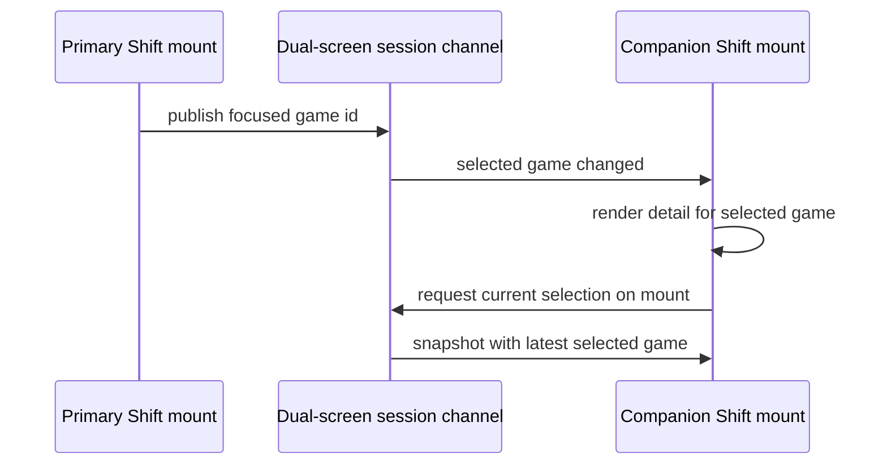
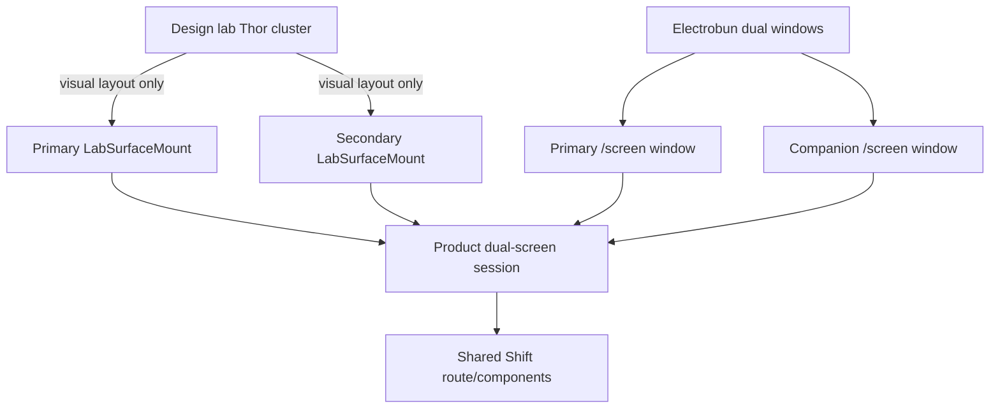

# feat: Share Thor screen selection state

## Summary

Wire Thor's primary and companion screens through the existing product-side dual-screen session so focusing a game on the top Shift screen updates the bottom screen's live game detail. The design lab and Electrobun should both use the same shared session contract and transport shape; the lab only differs by rendering two physical screens inside one canvas.

---

## Problem Frame

Thor can now be represented as a multi-screen device in the design lab, and the bottom screen can mount real Shift content. That proves two independent mounts work, but it does not yet prove the useful dual-screen behavior: the companion does not react to the primary screen. The user explicitly wants the shared-state mechanism to be production-shaped, not a shortcut hidden in the design tool.

Recent lab work also added Inspect/Live state axes using product-side preview singletons. Those are intentionally design-tool seams for freezing and inspecting states; this plan keeps cross-screen production behavior separate from that tooling path.

---

## Requirements

- R1. The primary Shift screen publishes the currently focused/highlighted game as live dual-screen UI state.
- R2. The companion/bottom screen reads that shared state and renders detail for the selected game.
- R3. The design lab and Electrobun dual-window production path use the same product-side shared-state contract and transport shape, not a lab-only bridge.
- R4. The lab's screen cluster remains visual-only; it arranges frames but never carries state between screens.
- R5. The new behavior does not use the lab Inspect/Live preview singletons as the production state-sharing mechanism.
- R6. A newly opened companion screen reaches the current selection without waiting for the next focus move.
- R7. Single-screen Shift and existing lab Inspect/Live behavior remain unchanged.
- R8. The implementation preserves product/tool boundaries: product runtime must not import `tools/theme-workshop/lab/*`.

---

## Scope Boundaries

- This plan starts with one shared value: the selected/focused game id.
- This plan does not build 60fps cursor mirroring, scroll mirroring, or high-frequency gesture sharing.
- This plan does not introduce a general-purpose window-to-window message bus.
- This plan does not move the design-tool Inspect/Live preview singletons into the production sharing path.
- This plan does not design the final DS-style bottom UI; the first companion can reuse Shift's game-detail presentation.
- This plan does not make all lab axes per-screen isolated. The companion route should avoid reading tool-only preview pins unless a future unit explicitly adds per-screen Inspect support.

### Deferred to Follow-Up Work

- Durable/shared state through korrid or another daemon-backed service if future behavior must survive process restarts or coordinate across origins/devices.
- Additional dual-screen events beyond game focus, such as launch state, companion action focus, or scroll position.
- Shareable lab URLs that encode both primary route and companion-selected game.
- A purpose-built companion information architecture once the shared-state mechanism is proven.

---

## Context & Research

### Relevant Code and Patterns

- `product/platform/react/display/dual-screen/dual-screen-events.ts` already defines `DualScreenEvent`, `DualScreenState`, `DualScreenRole`, and a reducer for `GameFocused` events.
- `product/platform/react/display/dual-screen/DualScreenSession.context.tsx` exposes `useDualScreenSession()` and the `focusGame` action.
- `product/platform/react/display/dual-screen/DualScreenBroadcastSessionRoot.tsx` already provides a product-side `BroadcastChannel` transport with an injectable channel factory for tests.
- `product/platform/react/display/dual-screen/DualScreenSessionRoot.tsx` provides an in-memory provider for same-tree tests and previews.
- `product/surfaces/web/shift/pages/ShiftCinematicHome.tsx` owns the focused rail index but does not yet publish it outward.
- `product/surfaces/web/shift/routes/ShiftHomeRoute.tsx` maps catalog entries to cinematic games and is the right place to connect focus publication to the dual-screen session while preserving the presentational page.
- `product/surfaces/web/shift/pages/ShiftGameDetailScreen.tsx` is already a presentational game-detail view and is the right building block for the companion screen.
- `product/surfaces/web/shift/routes/route-tree.tsx` currently has `/` and `/game/$id`; a companion route must be added to Shift's internal route tree.
- `tools/theme-workshop/lab/canvas/LabSurfaceView.tsx` mounts primary and secondary independent surfaces today; the secondary is hard-coded to `/game/hollow-knight` and should move to the shared-state companion route.
- `tools/theme-workshop/lab/components/LabDeviceCluster.tsx` already supplies `renderSecondary`, so the cluster can remain visual-only.
- `tools/theme-workshop/lab/surface-registry.ts` and `tools/theme-workshop/lab/LabSurfaceMount.tsx` are the lab host seam for passing role/channel options into real surface mounts.
- `product/apps/desktop/window-options.ts` already creates two windows for `KORRI_DESKTOP_DUAL_SCREEN=1`, pointing at `/screen?role=primary` and `/screen?role=companion`.
- `product/apps/portal/routes/__virtual.ts` currently lacks `/screen`; `product/apps/portal/routes/+index.tsx` shows the `SurfaceHost surfaceId="shift"` pattern to reuse.

### Institutional Learnings

- `docs/solutions/best-practices/prefer-real-implementations-over-mocks-2026-05-02.md` — the lab substitute should be a real implementation of the same seam, not a fake parallel path.
- `docs/solutions/best-practices/react-state-components-over-result-render-props-for-effect-atoms-2026-05-03.md` — keep component trees identical and swap only the edge implementation of a shared seam.
- `docs/solutions/best-practices/product-owned-composition-keeps-shared-layers-reusable-2026-05-03.md` — keep shared state/product-agnostic pieces separate from surface-specific composition.
- `docs/solutions/best-practices/derive-component-states-from-state-machines-2026-06-25.md` — when this grows beyond selected game id, model state explicitly and derive lab variants instead of hand-authoring state lists.

### External References

- None. Repository-local patterns are direct, current, and already tested.

---

## Key Technical Decisions

- Use the existing product dual-screen session rather than inventing a new lab store. `DualScreenBroadcastSessionRoot` is already product code and can run in both same-origin Electrobun windows and the lab's same-page independent mounts. This satisfies the user's “same mechanism” requirement while avoiding a design-tool-only bridge.
- Extend the dual-screen event protocol for late-joining companions. `BroadcastChannel` does not replay missed messages, so the session should support a request/snapshot handshake (or equivalent product-side replay mechanism) so a companion opened after the primary can receive the current selected game.
- Keep `ShiftCinematicHome` presentational. It should expose an optional focus callback instead of importing dual-screen context directly; the route/composition layer owns publishing to the shared session.
- Add a Shift companion route instead of driving the secondary mount's router to `/game/:id` on every focus change. The companion route reads shared session state and renders the appropriate detail view, which avoids imperative route pushing and keeps companion behavior inside the product surface.
- Pass dual-screen role/channel through host seams. Lab and production both configure the same surface mount with role information; the lab does not use the cluster as a state channel.
- Do not use Inspect/Live preview singletons for cross-screen production state. Companion rendering should read live catalog data and dual-screen session state; preview pins remain design-tool controls for inspectable page state.

---

## Open Questions

### Resolved During Planning

- Should shared state be carried by the lab's multi-screen cluster? → No. The cluster remains visual-only.
- Should the new Inspect/Live preview singletons be used for production sharing? → No. They are tool-only state pins.
- Should the plan invent a new daemon service now? → No. Current repo already has a product-side `BroadcastChannel` dual-screen session intended for cross-window use; use and harden that first. A daemon-backed implementation is deferred until persistence/cross-origin requirements appear.
- Should the bottom screen be driven by route changes to `/game/:id`? → No for v1. A companion route that reads session state avoids extra router synchronization and is closer to a real companion surface.

### Deferred to Implementation

- Exact naming for the companion route component and role option objects may adjust to fit existing route/mount conventions.
- The exact late-join replay event names are implementation details as long as they remain typed, serializable, and covered by tests.
- The exact copy/design for the no-selection waiting state can be refined during implementation; the behavior is fixed: do not synthesize a selected game.

---

## High-Level Technical Design

> *This illustrates the intended approach and is directional guidance for review, not implementation specification. The implementing agent should treat it as context, not code to reproduce.*

The important boundary is that both lab and Electrobun reach the same product dual-screen session. The lab differs only by drawing the two screens inside one canvas; production differs only by letting the OS/Electrobun create two real windows.

---

## Implementation Units

### U1. Harden the product dual-screen session contract

**Goal:** Make the existing dual-screen session robust enough for real primary/companion mounts, including a no-selection state and late-join synchronization.

**Requirements:** R3, R6, R8

**Dependencies:** None

**Files:**
- Modify: `product/platform/react/display/dual-screen/dual-screen-events.ts`
- Modify: `product/platform/react/display/dual-screen/DualScreenSession.context.tsx`
- Modify: `product/platform/react/display/dual-screen/DualScreenSessionRoot.tsx`
- Modify: `product/platform/react/display/dual-screen/DualScreenBroadcastSessionRoot.tsx`
- Test: `product/platform/react/display/dual-screen/dual-screen-events.test.ts`
- Test: `product/platform/react/display/dual-screen/DualScreenSessionRoot.test.tsx`
- Test: `product/platform/react/display/dual-screen/DualScreenBroadcastSessionRoot.test.tsx`

**Approach:**
- Keep `GameFocused` as the first production event, but allow the state to represent “no game selected yet.”
- Add a non-throwing optional session access seam for route/components that may render outside dual-screen mode. Routes must be able to ask “is a session present?” without crashing normal single-screen Shift.
- Add a typed, serializable late-join flow so a companion can request and receive the current selected game after it mounts.
- Define replay authority and ordering: primary sessions answer snapshot requests, companions do not overwrite the primary with stale/no-selection snapshots, and stale snapshots are ignored via monotonic revision or an equivalent channel-scoped ordering rule.
- Preserve the injectable channel factory so tests can use an in-process channel double while production and lab use the browser `BroadcastChannel` implementation.
- Keep the session module in `product/platform/react/display/dual-screen/`; do not introduce any dependency on lab files.

**Patterns to follow:**
- Existing reducer in `dual-screen-events.ts`.
- Existing channel factory and in-process test double in `DualScreenBroadcastSessionRoot` tests.
- `useSyncExternalStore`-style single-source updates from the preview singletons only as an eventing shape reference, not as the shared-state mechanism.

**Test scenarios:**
- Happy path: primary publishes `GameFocused("hollow-knight")`; companion context updates to `selectedGameId = "hollow-knight"`.
- Edge case: publishing the same game from the same source does not create a redundant state transition.
- Edge case: initial state can represent no selected game without throwing or forcing a fake game id.
- Edge case: route/components can use optional session access outside a provider and receive an absent session rather than an exception.
- Integration: companion mounts after primary has already published a game, requests current state, and receives the latest selected game without waiting for another focus move.
- Edge case: an older/no-selection snapshot cannot overwrite a newer primary `GameFocused` event.
- Error path: malformed channel messages are ignored without corrupting state.

**Verification:**
- Dual-screen package tests prove same-tree and broadcast-backed roots share the same reducer semantics and late-join behavior.

---

### U2. Thread dual-screen role/session options through Shift mounting seams

**Goal:** Let both production and lab Shift mounts opt into the dual-screen session by role while keeping normal single-screen Shift unchanged.

**Requirements:** R3, R7, R8

**Dependencies:** U1

**Files:**
- Modify: `product/surfaces/web/shift/mount-shift.tsx`
- Modify: `product/surfaces/web/shift/entry.tsx`
- Modify: `tools/theme-workshop/lab/surface-registry.ts`
- Modify: `tools/theme-workshop/lab/adapters/shift.ts`
- Modify: `tools/theme-workshop/lab/LabSurfaceMount.tsx`
- Test: `product/surfaces/web/shift/mount-shift.test.tsx` or nearest existing Shift mount test if one exists
- Test: `tools/theme-workshop/lab/adapters/shift.test.ts`
- Test: `tools/theme-workshop/lab/LabSurfaceMount.test.tsx`

**Approach:**
- Add a mount option that identifies a surface instance as primary or companion and provides the session channel identity.
- Define the outer/inner route contract explicitly: the host route gets the browser to the surface (`/screen?...` in production, lab canvas in tools), while the Shift internal route remains `/` for primary and `/companion` for companion.
- Wrap the Shift router with the dual-screen session only when this option is present; the default single-screen mount must remain provider-free or behaviorally equivalent.
- Preserve existing `beforeRouter` runtime chrome behavior.
- Let the lab adapter forward role/channel options to `mountShift` without knowing any Shift internals beyond the adapter contract.

**Patterns to follow:**
- `mountShift` already accepts injected data and navigation adapters; dual-screen session configuration should follow that host-option style.
- `entry.tsx` already converts the platform bridge into surface runtime layers and reads runtime config at the surface boundary.

**Test scenarios:**
- Happy path: mounting Shift without dual-screen options renders as before and does not require a dual-screen provider.
- Happy path: mounting Shift with role `primary` installs a dual-screen session provider around routed content.
- Happy path: lab `mountSurface` passes role/channel options through to Shift without changing seed data or navigation behavior.
- Edge case: changing only the lab route path still updates the existing mounted router without recreating the dual-screen session unexpectedly.

**Verification:**
- Existing Shift route/mount tests remain green; new tests prove role-aware mounting is opt-in.

---

### U3. Publish primary focus from the real Shift home

**Goal:** When the top Shift rail focus moves, publish the focused game id into the dual-screen session.

**Requirements:** R1, R3, R7

**Dependencies:** U1, U2

**Files:**
- Modify: `product/surfaces/web/shift/pages/ShiftCinematicHome.tsx`
- Modify: `product/surfaces/web/shift/routes/ShiftHomeRoute.tsx`
- Test: `product/surfaces/web/shift/pages/ShiftCinematicHome.test.tsx`
- Test: `product/surfaces/web/shift/routes/ShiftHomeRoute.test.ts` or nearest existing route test

**Approach:**
- Add an optional focus callback to `ShiftCinematicHome` so the presentational page reports the currently focused game id without importing dual-screen session code.
- Publish the initial focused game once the ready game list resolves, then publish subsequent rail focus changes.
- In the route/composition layer, connect the optional callback to the dual-screen session when a session is present.
- Avoid double-publishing from click/launch paths; focus movement is the shared-state source.

**Patterns to follow:**
- Existing `onLaunch` prop on `ShiftCinematicHome` keeps host behavior outside the presentational component.
- `makeLaunchHandler` in `ShiftHomeRoute.tsx` shows how route-level code resolves ids back to catalog entries.

**Test scenarios:**
- Happy path: rendering `ShiftCinematicHome` with three games calls the focus callback for the initial focused game.
- Happy path: focusing another tile calls the focus callback with that game's id.
- Edge case: an empty game list does not call the focus callback and renders safely.
- Integration: Shift home route with a dual-screen session publishes the selected game when the ready catalog renders.
- Regression: Shift home route without a dual-screen session still renders, focuses, and launches normally using optional/absent session access.

**Verification:**
- Tests prove focus publication comes from the real home and does not require design-tool APIs.

---

### U4. Add the Shift companion route and screen composition

**Goal:** Render a bottom/companion Shift route that reads the shared selected game and shows the corresponding real game-detail presentation.

**Requirements:** R2, R5, R7

**Dependencies:** U1, U2

**Files:**
- Create: `product/surfaces/web/shift/routes/ShiftCompanionRoute.tsx`
- Modify: `product/surfaces/web/shift/routes/route-tree.tsx`
- Modify: `product/surfaces/web/shift/pages/ShiftGameDetailScreen.tsx` if a small controlled-selection seam is needed
- Test: `product/surfaces/web/shift/routes/ShiftCompanionRoute.test.tsx`
- Test: `product/surfaces/web/shift/routes/route-tree.test.tsx` if route-tree coverage exists or is added

**Approach:**
- Add an internal Shift route for companion mode.
- The route reads the dual-screen session's selected game id and the live catalog snapshot, resolves the selected entry, and renders `ShiftGameDetailScreen` with the matching game.
- Handle no-selection, loading, empty, load-error, and game-not-found states explicitly. The no-selection state is neutral waiting UI, not a first-game fallback.
- Do not consult the design-tool catalog preview singleton in this companion route; companion behavior should be driven by live catalog data plus the shared dual-screen session.

**Patterns to follow:**
- `ShiftGameDetailRoute.tsx` for catalog-state body handling and mapping catalog entries to detail view data.
- `ShiftHomeRoute.tsx` for catalog snapshot access and refresh behavior.

**Test scenarios:**
- Happy path: with selected game `hollow-knight` and a ready catalog containing that id, the companion route renders Hollow Knight detail.
- Happy path: when the session selection changes to another game id, the companion route updates to that game's detail without route navigation.
- Edge case: with no selected game, the companion route renders a safe waiting/selection state and does not show the first catalog game as if it were selected.
- Edge case: selected game id not present in the ready catalog renders a clear not-found/fallback state.
- Error path: loading, load-error, defect, and empty catalog states render safe companion states and do not crash.
- Regression: setting a design-tool catalog preview pin for home does not become the companion's production state source.

**Verification:**
- Route tests prove the companion reads session state rather than URL params or lab globals.

---

### U5. Wire Thor's lab primary and secondary mounts to the same session

**Goal:** Make the design lab's Thor top and bottom screens exercise the same product dual-screen session used by production.

**Requirements:** R2, R3, R4, R5, R7, R8

**Dependencies:** U1, U2, U3, U4

**Files:**
- Modify: `tools/theme-workshop/lab/canvas/LabSurfaceView.tsx`
- Modify: `tools/theme-workshop/lab/canvas/LabScreenView.tsx` if selected screen/page-part mode should also render companion content
- Modify: `tools/theme-workshop/lab/components/LabDeviceCluster.tsx` only if the render callback needs screen role metadata not already supplied
- Test: `tools/theme-workshop/lab/canvas/LabSurfaceView.test.tsx`
- Test: `tools/theme-workshop/lab/canvas/LabScreenView.test.tsx` if modified
- Test: `tools/theme-workshop/lab/lab-boundary.test.ts` if boundary coverage needs updating

**Approach:**
- Give each displayed device a stable dual-screen channel identity derived from the lab surface/device context.
- Mount the primary screen with role `primary` at the current surface path.
- Mount secondary screens with role `companion` at the Shift companion route instead of the fixed `/game/hollow-knight` route.
- Keep `LabDeviceCluster` limited to layout and rendering callbacks; it should not know about selected game state.
- Ensure multi-device comparison does not accidentally share one device's selected game with another device's companion screen.

**Patterns to follow:**
- Existing `renderPrimary` / `renderSecondary` split in `LabDeviceCluster`.
- `LabSurfaceMount` route synchronization and no-remount behavior.
- Lab route/source/state binding through `initialValuesForBinding`.

**Test scenarios:**
- Happy path: selecting Thor renders two surface mounts, primary home and secondary companion.
- Integration: focusing a different game in the primary Shift rail updates the secondary companion detail in the lab.
- Edge case: two devices visible at once use separate session identities; focusing a game on Thor does not update another device's companion.
- Regression: single-screen devices still render one surface mount and do not require dual-screen options.
- Regression: the lab cluster does not import or call dual-screen session APIs directly.
- Regression: no product runtime file imports from `tools/theme-workshop/lab`.

**Verification:**
- Lab tests prove real cross-root session behavior without using preview singleton state as the bridge.

---

### U6. Restore production `/screen` entry for Electrobun dual windows

**Goal:** Make the existing Electrobun dual-window option URLs resolve to role-aware Shift surfaces.

**Requirements:** R2, R3, R6, R7, R8

**Dependencies:** U1, U2, U3, U4

**Files:**
- Create: `product/apps/portal/routes/+screen.tsx`
- Modify: `product/apps/portal/routes/__virtual.ts`
- Modify: `product/apps/desktop/window-options.ts`
- Test: `product/apps/portal/routes/screen-route.test.tsx` or nearest portal route test location
- Test: `product/apps/desktop/window-options.test.ts`

**Approach:**
- Add a `/screen` portal route that hosts the Shift surface, preserving the `SurfaceHost` pattern from the index route while explicitly accepting that `/screen` is now a real dual-screen production entry rather than a throwaway eyeballing route.
- Ensure the primary window starts at the Shift internal home route and the companion window starts at the Shift internal companion route. A concrete acceptable contract is `/screen?role=primary&session=<id>` paired with Shift internal `/`, and `/screen?role=companion&session=<same-id>` paired with Shift internal `/companion`; implementation may use hash or equivalent existing Shift navigation conventions to express the internal route.
- Pass both role and shared session/channel identity through URL/runtime parsing that the Shift entrypoint can translate into dual-screen mount options. Primary and companion URLs created for the same desktop launch must share the same channel/session value; missing channel falls back to a documented single-instance default.
- Keep the existing `KORRI_DESKTOP_DUAL_SCREEN=1` startup branch; this unit makes its generated URLs real rather than replacing the window lifecycle.

**Patterns to follow:**
- `product/apps/portal/routes/+index.tsx` for `SurfaceHost` usage.
- `product/apps/desktop/window-options.ts` for desktop URL construction and profile-independent tests.

**Test scenarios:**
- Happy path: portal virtual route list includes `/screen`.
- Happy path: `createDesktopDualScreenWindowOptions` returns primary and companion URLs that include role identity, share one session/channel identity, and route the companion to the companion surface.
- Edge case: invalid or missing role falls back to safe single-screen/primary behavior rather than crashing.
- Edge case: missing channel/session uses the documented single-instance default consistently for both roles.
- Integration: both `/screen?role=primary` and `/screen?role=companion` host the Shift surface entrypoint.

**Verification:**
- Desktop URL tests and portal route tests prove production dual-window entry points are reachable.

---

## System-Wide Impact

- **Interaction graph:** Primary focus events now leave `ShiftCinematicHome` through a callback, enter the route/composition layer, publish to the product dual-screen session, and update companion route rendering. Lab and Electrobun both configure roles at mount/entry boundaries.
- **Error propagation:** Malformed channel messages should be ignored. Missing provider/session should degrade to no shared selection rather than crashing normal single-screen Shift. Catalog load failures should render companion-safe states.
- **State lifecycle risks:** Broadcast channels do not replay messages by default; U1's late-join synchronization is required for production startup. Channel identity must be scoped so multiple devices or multiple lab frames do not collide.
- **API surface parity:** `mountShift`, `LabSurfaceAdapter.mountSurface`, and desktop `/screen` route parsing need matching role/session concepts. The same role vocabulary should be reused everywhere.
- **Integration coverage:** Unit tests alone are insufficient; the lab must have an integration test where a primary focus change updates the secondary mounted surface.
- **Unchanged invariants:** Single-screen Shift keeps using the same `/` and `/game/$id` routes. The lab Inspect/Live axis model remains a design-tool feature. Product runtime continues to avoid lab imports.

---

## Risks & Dependencies

| Risk | Mitigation |
|------|------------|
| BroadcastChannel late join leaves companion stale | Add typed request/snapshot replay in U1 and cover with tests. |
| Lab and production accidentally diverge | Route both through `DualScreenBroadcastSessionRoot`; lab only supplies role/channel options. |
| Inspect/Live preview singletons contaminate companion behavior | Companion route reads live catalog/session state, not preview pins; add regression coverage. |
| Single-screen Shift starts requiring a dual-screen provider | Make dual-screen mount options opt-in and add no-provider regression tests. |
| Multiple devices/windows share one fixed channel | Scope channel identity by device/session in the lab and by desktop app session in production where needed. |
| Companion UI scope grows into final DS design | Reuse `ShiftGameDetailScreen` first; defer purpose-built companion IA. |

---

## Documentation / Operational Notes

- Update `tools/theme-workshop/lab/AGENTS.md` or nearby lab guidance to state that multi-screen lab layout is visual-only and shared state flows through product dual-screen session code.
- If `/screen?role=...` becomes an operator-facing desktop URL, note the role semantics near `product/apps/desktop/window-options.ts` tests or desktop runtime docs.
- No migration or rollout flag is required beyond the existing `KORRI_DESKTOP_DUAL_SCREEN=1` branch.

---

## Sources & References

- Related plan: `work/items/active/01KVXF5CGMQXZRAE27TZ3QHXRC-lab-multi-device-surface-routing/plan.md`
- Related plan: `work/items/active/01KXM7Q3V8WPK2YB6CD9NRTF4G-lab-inspect-live-states/plan.md`
- Product dual-screen session: `product/platform/react/display/dual-screen/`
- Shift mount and routes: `product/surfaces/web/shift/mount-shift.tsx`, `product/surfaces/web/shift/routes/route-tree.tsx`
- Lab mounting seam: `tools/theme-workshop/lab/LabSurfaceMount.tsx`, `tools/theme-workshop/lab/canvas/LabSurfaceView.tsx`
- Desktop dual-window entry: `product/apps/desktop/window-options.ts`, `product/apps/desktop/main.ts`
- Portal host routes: `product/apps/portal/routes/__virtual.ts`, `product/apps/portal/routes/+index.tsx`
- Institutional learning: `docs/solutions/best-practices/prefer-real-implementations-over-mocks-2026-05-02.md`
- Institutional learning: `docs/solutions/best-practices/react-state-components-over-result-render-props-for-effect-atoms-2026-05-03.md`
- Institutional learning: `docs/solutions/best-practices/product-owned-composition-keeps-shared-layers-reusable-2026-05-03.md`
- Institutional learning: `docs/solutions/best-practices/derive-component-states-from-state-machines-2026-06-25.md`
