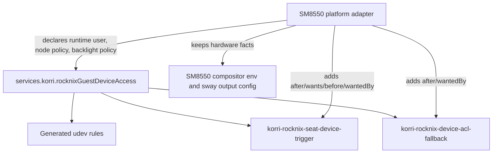

# Refactor RockNIX guest device access

## Summary

Extract the reusable RockNIX guest device-access mechanics from the SM8550 platform adapter into an opt-in Korri NixOS module. The shared module will own host-bound device retriggering, ACL convergence, and generated udev rules; the SM8550 adapter will keep hardware facts and service ordering.

---

## Problem Frame

Recent platform-policy cleanup moved RetroArch/InputPlumber, InputPlumber data wiring, RockNIX guest-profile activation, and RockNIX audio bootstrap behavior behind shared seams. SM8550 still carries generic guest device convergence inline: it retriggers guest udev for host-bound devices, grants ACLs on DRM/input/sound/TTY nodes, re-applies those ACLs after greetd, and repairs backlight brightness permissions. That behavior describes a reusable RockNIX guest contract, not an SM8550-only product policy.

---

## Requirements

- R1. Provide an opt-in shared NixOS module for RockNIX guest device-access convergence.
- R2. Preserve current SM8550 behavior: soft-failing udev retrigger, pre-greetd ACL grant, post-greetd ACL fallback, backlight brightness group repair, and static DRM/input udev rules.
- R3. Keep true platform facts in adapters, including service ordering against greetd/substrate units, DSI output transforms, Gamescope preferred output, and wlroots direct-session environment.
- R4. Define the shared module contract with pure Nix module checks and keep composed SM8550 checks at the platform seam.
- R5. Avoid behavior changes for RK3566 and x86 in this slice; they may import or adopt the new module later only when their device-access posture is explicitly decided.
- R6. Preserve existing Steam/input ACL behavior unless implementation reveals a direct regression; do not broaden this slice into Steam controller policy.

---

## Scope Boundaries

- No inputd device/action profile extraction.
- No Gamescope graphics runtime profile or wlroots compositor-option redesign.
- No Moonlight/compositor package neutral-option cleanup.
- No FEX/Wine package helper extraction.
- No RK3566 adoption in this slice; if implementation shows adoption is desirable or likely no-op, capture it as follow-up work rather than enabling it.
- No live hardware deployment or Bandai/Sobo validation in this plan; execution may add that separately if requested.

### Deferred to Follow-Up Work

- Evaluate RK3566 adoption of the guest device-access module after its root-compositor/main-space-audio posture is reviewed.
- Consider a separate compositor module option for the wlroots guest/direct-session environment once device access is no longer inline in the SM8550 adapter.
- Revisit broad input event ACL fallback versus Steam's more-specific virtual-controller ACL stripping if a Steam input regression appears.

---

## Context & Research

### Relevant Code and Patterns

- `product/systems/nixos/images/platforms/rocknix-sm8550.nix` currently owns the seat-device setup script, device ACL fallback script, udev rules, service ordering, and SM8550 compositor direct-session environment.
- `tools/testing/nix/korri-rocknix-sm8550-config-check.nix` currently asserts the SM8550 udev rules, service names, ordering, and wlroots direct-session environment.
- `product/systems/nixos/modules/korri-rocknix-guest-profile.nix` is the nearest shared RockNIX module pattern: small option namespace, opt-in enable flag, standalone flake registration, and module check.
- `product/systems/nixos/modules/korri-rocknix-audio-bootstrap.nix` is the nearest behavioral script-rendering module pattern: shared script mechanics behind declarative options, with platform ordering left outside the module.
- `tools/testing/nix/korri-rocknix-audio-bootstrap-module-check.nix` and `tools/testing/nix/korri-rocknix-guest-profile-module-check.nix` are the module-evaluation check patterns to follow.
- `product/systems/nixos/flake/modules.nix` and `product/systems/nixos/flake/checks.nix` are the registration points for standalone modules and check owner metadata.

### Institutional Learnings

- `docs/solutions/architecture-patterns/architectural-posture-as-nix-image-default-2026-05-27.md`: shared modules should keep conservative opt-in mechanics; image/platform layers assert appliance posture.
- `docs/solutions/design-patterns/explicit-cascade-folded-policy-over-incidental-signal-heuristics-2026-05-27.md`: device capability decisions should be explicit named policy/options, not runtime probing heuristics.
- `docs/solutions/integration-issues/steam-uinput-permissions-block-virtual-xinput-2026-06-13.md`: device-access convergence must handle already-existing nodes and late/device-manager-created nodes consistently.
- `docs/solutions/runtime-errors/gamescope-backend-auto-fights-sway-for-drm-master-2026-05-27.md`: compositor backend/session posture must be explicit policy; do not let shared layers guess from environment.

### External References

- External research skipped: the repo has current, directly relevant NixOS module patterns and institutional learnings for this exact platform-seam shape.

---

## Key Technical Decisions

- Create `services.korri.rocknixGuestDeviceAccess` in `product/systems/nixos/modules/korri-rocknix-guest-device-access.nix`: the name matches the existing RockNIX module vocabulary while making the host-bound guest-device responsibility explicit.
- Preserve the current canonical service names `korri-rocknix-seat-device-trigger` and `korri-rocknix-device-acl-fallback`: this reduces check churn and keeps the operational names already visible in logs/status output.
- Keep systemd ordering in platform adapters: the shared module should emit service bodies and udev rules, but not `wantedBy`, `after`, `before`, `wants`, or `requires` edges to `greetd.service`, `systemd-udevd.service`, or substrate-specific units.
- Pass the runtime user explicitly through a module option: the module should not import `korri-runtime` just to discover a username, and it must not hardcode `korri`.
- Make device-access posture explicit with options: retriggered subsystems, ACL node globs, fallback delay, backlight repair, backlight group, static DRM seat tagging, and input udev ACL emission should be declared, not inferred from live `/dev` contents.
- Leave `WLR_SESSION = "direct"` and `LIBSEAT_BACKEND = "builtin"` in the SM8550 adapter for this slice: they are compositor session posture tied to SM8550/Sobo's nspawn DRM constraint, not device-access script mechanics.
- Preserve current broad ACL behavior first: this refactor should move behavior without changing which nodes receive ACLs; Steam-specific ACL exclusions are a separate behavioral decision.

---

## Open Questions

### Resolved During Planning

- Should this slice enable the new module on RK3566? Resolved: no, not by default. RK3566 currently has different root/main-space posture and should not inherit SM8550 device ACL behavior without a separate decision.
- Should the shared module own service ordering? Resolved: no. Service ordering remains platform-owned so substrate dependencies and display-manager choices do not leak into the shared module.
- Should wlroots direct-session environment move with this module? Resolved: no. Keep it in SM8550 for now and document it as related but separate compositor posture.

### Deferred to Implementation

- Exact option names for node glob lists and backlight group: choose names that match nearby module style while preserving the planned option surface.
- Whether the module renders one shared ACL helper or separate setup/fallback helpers internally: implementation can choose the simpler script shape as long as checks prove both services converge the same node policy.
- Whether any existing SM8550 check should keep source-text assertions temporarily: prefer option/service assertions, but implementation may retain narrow source-text guards when they are the only practical regression check.

---

## Output Structure

    product/systems/nixos/modules/
      korri-rocknix-guest-device-access.nix
    tools/testing/nix/
      korri-rocknix-guest-device-access-module-check.nix

---

## High-Level Technical Design

> *This illustrates the intended approach and is directional guidance for review, not implementation specification. The implementing agent should treat it as context, not code to reproduce.*

The shared module should expose explicit posture options and render reusable mechanics. Platform adapters supply facts and ordering. Composed checks prove SM8550 still gets the same operational wiring, while module checks prove disabled/enabled behavior independent of SM8550.

---

## Implementation Units

### U1. Add shared RockNIX guest device-access module

**Goal:** Create the opt-in module that renders reusable udev rules and canonical device-access oneshot services without platform-specific ordering.

**Requirements:** R1, R2, R3, R6

**Dependencies:** None

**Files:**
- Create: `product/systems/nixos/modules/korri-rocknix-guest-device-access.nix`
- Test: `tools/testing/nix/korri-rocknix-guest-device-access-module-check.nix`

**Approach:**
- Follow the option/module style in `product/systems/nixos/modules/korri-rocknix-audio-bootstrap.nix` and `product/systems/nixos/modules/korri-rocknix-guest-profile.nix`.
- Add an explicit `enable` flag and runtime-user option that is required when the module is enabled.
- Expose options for retriggered subsystems, ACL node globs, fallback delay, static DRM seat tagging, input udev ACL rule emission, backlight repair, and backlight repair group.
- Render the existing setup/fallback behavior behind the current canonical service names.
- Do not emit platform ordering or display-manager dependencies from the module.
- Keep service failure posture aligned with current SM8550 behavior: udev retrigger and ACL/backlight repair attempts are best-effort and must not fail boot when host-bound nspawn sysfs refuses change events.

**Execution note:** Start with module-evaluation checks before migrating SM8550 so the module contract is explicit before platform behavior moves.

**Patterns to follow:**
- `product/systems/nixos/modules/korri-rocknix-audio-bootstrap.nix`
- `product/systems/nixos/modules/korri-rocknix-guest-profile.nix`
- `tools/testing/nix/korri-rocknix-audio-bootstrap-module-check.nix`

**Test scenarios:**
- Happy path: module disabled -> no udev rules and neither canonical service is emitted.
- Happy path: module enabled with a runtime user -> both canonical services are emitted with oneshot/RemainAfterExit service config.
- Happy path: enabled static DRM seat tagging -> generated udev rules include the DRM seat/master-of-seat rule.
- Happy path: enabled input udev ACL -> generated udev rules include the input event rule using the configured runtime user.
- Happy path: configured retrigger subsystem list -> setup script reflects that list instead of a hardcoded SM8550-only assumption.
- Edge case: custom ACL node globs -> setup and fallback scripts use the configured node policy consistently.
- Edge case: custom fallback delay -> fallback script reflects the configured delay without the shared module naming a display-manager dependency.
- Edge case: backlight repair disabled -> scripts do not attempt brightness group/mode repair.
- Edge case: backlight repair enabled with a custom group -> scripts use the configured group instead of hardcoding the platform adapter.
- Error path: enabled without a runtime user -> NixOS assertion fails with a clear module-option message.
- Integration: module service output does not include `wantedBy`, `after`, `before`, `wants`, or `requires` edges to `greetd.service` or SM8550 substrate services.

**Verification:**
- The new module check proves disabled/enabled behavior, required options, generated udev rules, script posture options, and absence of platform ordering.

---

### U2. Register the module and check in the Nix flake surfaces

**Goal:** Make the new module and its pure check discoverable through the existing flake module/check registry.

**Requirements:** R1, R4

**Dependencies:** U1

**Files:**
- Modify: `product/systems/nixos/flake/modules.nix`
- Modify: `product/systems/nixos/flake/checks.nix`
- Test: `tools/testing/nix/korri-rocknix-guest-device-access-module-check.nix`

**Approach:**
- Register the module as a standalone `nixosModules` entry, following the guest-profile/audio-bootstrap pattern.
- Register the module check in `checks.nix` and include it in the standard native/module-owner matrix.
- Do not add the module to broad aggregate modules unless an existing aggregate pattern explicitly requires it; platform adapters should import it deliberately.

**Patterns to follow:**
- `product/systems/nixos/flake/modules.nix` entries for `korri-rocknix-guest-profile` and `korri-rocknix-audio-bootstrap`
- `product/systems/nixos/flake/checks.nix` entries for their module checks

**Test scenarios:**
- Integration: the flake exposes the module check under the expected check name.
- Integration: `korri-standard-native` includes the new module check owner entry.
- Edge case: module identity audit includes the new module file and does not flag literal runtime users, hardcoded `/run/user/<uid>` paths, or forbidden service mutations.

**Verification:**
- The new check can be selected by name and standard native validation sees it.

---

### U3. Migrate SM8550 to the shared device-access module

**Goal:** Remove inline device-access scripts/rules from the SM8550 adapter and configure the shared module with equivalent posture.

**Requirements:** R2, R3, R5, R6

**Dependencies:** U1, U2

**Files:**
- Modify: `product/systems/nixos/images/platforms/rocknix-sm8550.nix`
- Test: `tools/testing/nix/korri-rocknix-sm8550-config-check.nix`

**Approach:**
- Import the new module in the SM8550 platform adapter.
- Enable `services.korri.rocknixGuestDeviceAccess` with the current SM8550 behavior: runtime user from the platform runtime, DRM/input/sound retrigger posture, current ACL node set, input udev ACL rule, static DRM seat tagging, fallback delay corresponding to the existing post-greetd repair, and backlight repair for the video group.
- Preserve existing canonical service names and merge SM8550-specific ordering onto those services in the adapter: pre-greetd setup after `systemd-udevd.service` and the substrate sound-card hydrate service, before `greetd.service`; fallback after `greetd.service`.
- Keep `WLR_SESSION`, `LIBSEAT_BACKEND`, DSI transform, Gamescope preferred output, and substrate audio/power facts in SM8550.
- Do not enable this module in RK3566 or x86 during this unit.

**Patterns to follow:**
- SM8550's existing migration to `services.korri.rocknixAudioBootstrap`
- SM8550's existing migration to `services.korri.rocknixGuestProfile`

**Test scenarios:**
- Happy path: SM8550 config has `services.korri.rocknixGuestDeviceAccess.enable = true` with runtime user following the Korri runtime user.
- Happy path: SM8550 pre-greetd service still runs before `greetd.service` and after/wants `rocknix-sound-card-udev-hydrate.service`.
- Happy path: SM8550 fallback service still runs after `greetd.service`.
- Happy path: SM8550 generated udev rules still include DRM seat tagging and input event ACL grant.
- Edge case: Sobo/read-only DRM uevent posture remains best-effort and does not introduce a boot-failing unit.
- Integration: compositor direct-session environment remains in the SM8550 adapter and continues to depend on the setup units' grants.
- Integration: no RK3566 config assertion changes are required for this migration.

**Verification:**
- SM8550 composed config still exposes the same operational service names/order while sourcing reusable mechanics from the shared module options.

---

### U4. Move SM8550 checks from inline implementation shape to module seam

**Goal:** Update composed platform checks so they prove the shared module is configured correctly and SM8550-specific ordering/facts remain local.

**Requirements:** R2, R3, R4, R5

**Dependencies:** U3

**Files:**
- Modify: `tools/testing/nix/korri-rocknix-sm8550-config-check.nix`
- Test: `tools/testing/nix/korri-rocknix-sm8550-config-check.nix`

**Approach:**
- Add checks against `cfg.services.korri.rocknixGuestDeviceAccess` option values for the SM8550 posture.
- Keep composed checks for adapter-owned ordering against `greetd.service`, `systemd-udevd.service`, and `rocknix-sound-card-udev-hydrate.service`.
- Keep composed checks for true hardware facts such as DSI transform and wlroots direct-session environment.
- Remove or narrow source-text checks that only existed because the behavior was inline in `rocknix-sm8550.nix`.
- Preserve the existing substrate sound-card hydration guard: the adapter must order against the substrate service without taking ownership of substrate-internal sound state.

**Patterns to follow:**
- Recent SM8550 checks around `rocknixGuestProfile` and `rocknixAudioBootstrap`
- Module-level assertions in `tools/testing/nix/korri-rocknix-audio-bootstrap-module-check.nix`

**Test scenarios:**
- Happy path: composed SM8550 check verifies module enablement and option values for DRM/input/ACL/backlight posture.
- Happy path: composed SM8550 check verifies service names and adapter-owned ordering.
- Edge case: composed SM8550 check does not require the shared module itself to own greetd ordering.
- Integration: composed SM8550 check continues to verify direct-session compositor environment and DSI transform remain unchanged.

**Verification:**
- The platform check fails if SM8550 stops enabling the shared module or loses platform-owned ordering, without re-coupling to inline script definitions.

---

### U5. Validate module identity and full target check set

**Goal:** Ensure the new shared module fits Korri's NixOS module constraints and the bounded migration does not regress existing platform checks.

**Requirements:** R4, R5, R6

**Dependencies:** U1, U2, U3, U4

**Files:**
- Test: `tools/testing/nix/korri-module-identity-audit-check.nix`
- Test: `tools/testing/nix/korri-rocknix-guest-device-access-module-check.nix`
- Test: `tools/testing/nix/korri-rocknix-sm8550-config-check.nix`
- Test: `tools/testing/nix/korri-standard-native-check.nix`

**Approach:**
- Run the new module check, module identity audit, SM8550 composed check, and standard native check as the completion gate.
- Treat live USB config failures as outside this plan unless the new module directly caused them.
- Treat unrelated untracked work-item artifacts as out of scope for the implementation slice.

**Patterns to follow:**
- Verification posture from the recent RockNIX audio-bootstrap and guest-profile seam refactors.

**Test scenarios:**
- Integration: module identity audit passes with the new module file.
- Integration: SM8550 composed config passes with the module enabled and platform ordering preserved.
- Integration: standard native check includes and passes the new module check.
- Error path: if a check fails due to a pre-existing unrelated invariant, record it explicitly rather than broadening this plan.

**Verification:**
- The configured verification command passes or any unrelated pre-existing failure is isolated and documented before shipping.

---

## System-Wide Impact

- **Interaction graph:** The change affects NixOS evaluation, udev rule generation, systemd system units, greetd ordering, and SM8550 compositor startup prerequisites. It should not touch TypeScript runtime services.
- **Error propagation:** Device retrigger and ACL repair remain best-effort so read-only nspawn sysfs and transient device-node failures do not block boot. Required option omissions fail at Nix evaluation time.
- **State lifecycle risks:** Host-bound devices may exist before guest udev rules load or appear later. The module must preserve both paths: startup convergence through oneshot services and late-device convergence through udev rules.
- **API surface parity:** This introduces a new NixOS module option surface only. Existing platform service names are preserved.
- **Integration coverage:** Module checks prove standalone behavior; SM8550 composed checks prove real platform ordering and facts.
- **Unchanged invariants:** SM8550 remains the only enabled platform in this slice; RK3566, x86, RetroArch, InputPlumber, audio bootstrap, Steam, and compositor package policy should not change behavior.

---

## Risks & Dependencies

| Risk | Mitigation |
|------|------------|
| Shared module accidentally owns SM8550-only ordering or substrate service names | Module check asserts no default greetd/substrate ordering; SM8550 composed check asserts adapter-owned ordering separately. |
| Refactor changes service names or operational observability | Preserve `korri-rocknix-seat-device-trigger` and `korri-rocknix-device-acl-fallback`. |
| Runtime user gets hardcoded in shared module | Use required runtime-user option and run module identity audit. |
| Broad input ACL fallback interacts with Steam virtual input ACL stripping | Preserve current behavior; document the interaction and defer behavioral changes unless a regression is reproduced. |
| Future platforms inherit SM8550 posture unintentionally | Module is opt-in and not added to broad aggregates; RK3566 adoption is explicitly deferred. |
| Backlight repair leaks Sobo-specific assumptions | Gate it behind an explicit option with configurable group; enable it only in SM8550 for this slice. |

---

## Documentation / Operational Notes

- No user-facing documentation required for the bounded refactor.
- Module comments should explain the host-bound RockNIX guest constraint and why retrigger/ACL failures are best-effort.
- If implementation discovers RK3566 needs the module, capture that as a separate follow-up rather than expanding this plan silently.

---

## Sources & References

- Related code: `product/systems/nixos/images/platforms/rocknix-sm8550.nix`
- Related code: `tools/testing/nix/korri-rocknix-sm8550-config-check.nix`
- Related pattern: `product/systems/nixos/modules/korri-rocknix-audio-bootstrap.nix`
- Related pattern: `product/systems/nixos/modules/korri-rocknix-guest-profile.nix`
- Related pattern: `tools/testing/nix/korri-rocknix-audio-bootstrap-module-check.nix`
- Related pattern: `tools/testing/nix/korri-rocknix-guest-profile-module-check.nix`
- Related learning: `docs/solutions/architecture-patterns/architectural-posture-as-nix-image-default-2026-05-27.md`
- Related learning: `docs/solutions/design-patterns/explicit-cascade-folded-policy-over-incidental-signal-heuristics-2026-05-27.md`
- Related learning: `docs/solutions/integration-issues/steam-uinput-permissions-block-virtual-xinput-2026-06-13.md`
- Related learning: `docs/solutions/runtime-errors/gamescope-backend-auto-fights-sway-for-drm-master-2026-05-27.md`
