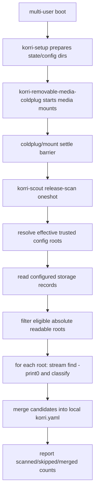

# feat: Boot-scan configured release storage

## Summary

Extend the existing Korri Scout scanner so appliances can scan declared storage roots once at boot. The boot path reuses the current merge-only readable-library YAML pipeline, runs after removable-media coldplug, and never overwrites or deletes authored entries.

---

## Problem Frame

Manual Scout scans already remove most of the repetitive work of turning a release folder into authorable Korri library records. The remaining operator gap is convergence: if the config declares a storage root, the appliance should be able to scan it during boot without relying on a human to run the explicit-root command.

---

## Requirements

- R1. Keep the explicit-root `korri scout scan releases` command working for manual operator scans.
- R2. Add a configured-storage scan mode that reads storage records from the effective trusted config graph and scans eligible storage roots.
- R3. Add an opt-in boot service that invokes configured-storage scanning once after Korri setup and removable-media coldplug.
- R4. Enumeration must continue to stream through `find -print0`; packaged/Nix runs must use a Nix-provided `find` via `KORRI_FIND_BIN`, not ambient `PATH`.
- R5. Candidate generation must remain conservative: only high-confidence, known-launchable releases are emitted; unsupported/ambiguous/excluded files are diagnostics.
- R6. Merge behavior must remain additive: add missing storage/library entries, skip existing library IDs, reject conflicting storage IDs, and never overwrite or delete durable authored records.
- R7. Missing, non-directory, unreadable, non-absolute, or unresolved-template storage roots must be skipped with structured diagnostics rather than failing boot.
- R8. The boot service must run as the Korri runtime user under systemd hardening, with a narrow writable path for the local config target.
- R9. This slice must not widen the removable-config trust boundary, add hotplug watchers, write ProseQL directly, scrape media art, hash full ROMs, or reconcile stale entries.

---

## Scope Boundaries

- No long-running Scout daemon.
- No re-scan-on-hotplug behavior; this plan covers boot/coldplug only.
- No automatic deletion of stale library entries when files disappear.
- No overwriting or reconciling hand-authored records.
- No direct ProseQL upserts; readable YAML remains the convergence surface.
- No image/art scraping, full content hashing, or fuzzy duplicate folding.
- No broad filesystem probing such as scanning `/run/media` by convention. Storage records are the scan inventory.
- No `storage` contribution from untrusted removable config roots in this slice. Current removable roots are data-limited; local/trusted config must declare storage roots that point at mounted media.
- No per-storage scan policy field in this slice. The module-level boot-scan option enables automation; eligible configured storage roots are scanned.

### Deferred to Follow-Up Work

- Hotplug-triggered scans for newly added config roots after boot.
- Per-storage scan policy fields if real configs need declared non-ROM storage excluded.
- Generated-record provenance metadata and stale-entry cleanup semantics.
- ProseQL import/upsert flow after merge-only readable YAML proves useful.
- Trusted removable storage declarations with containment rules, if card-owned storage config becomes a requirement.
- Plugin-declared discovery metadata rather than Scout-local v0 classifier tables.

---

## Existing Foundation

The following foundation already exists in this work item and should be treated as a dependency/regression surface, not re-planned from scratch:

- `product/platform/library/discovery/rom-scan-classifier.ts` classifies storage-relative paths into candidate/excluded/unsupported/ignored/ambiguous results.
- `product/platform/library/discovery/release-candidate-scan.ts` streams `find -print0`, renders readable `storage:`/`library:` YAML, and merges candidates atomically without overwrite/delete.
- `product/surfaces/terminal/korri-cli/scout-command.ts` exposes manual `korri scout scan releases` behavior.
- `product/surfaces/terminal/korri-cli/package.nix` wraps the CLI with `KORRI_FIND_BIN=${pkgs.findutils}/bin/find` without broad `PATH` injection.
- `product/platform/library/discovery/release-candidate-scan.test.ts` and `product/surfaces/terminal/korri-cli/korri-cli.test.ts` cover scanner, merge, CLI, idempotency, and readable-library launch-resolution smoke.

---

## Context & Research

### Relevant Code and Patterns

- `product/platform/library/config/records/storage.ts` defines storage records with `root`; this plan reads existing records and does not extend the schema.
- `product/platform/library/library-source-layer-live.ts` exposes `resolveAllConfigGraphRoots`, combining static `KORRI_CONFIG_ROOTS` and dynamic `KORRI_CONFIG_ROOTS_DIR` roots.
- `product/platform/library/proseql/config-graph-db.ts` restricts untrusted removable roots to `library`, `collections`, and `users`; this plan must not assume card anchors can declare `storage`.
- `product/systems/nixos/modules/korri-daemon.nix` owns `services.korri.config.*`, the effective config-root environment, and imports the CLI module. Boot Scout should extend this existing wiring rather than duplicating config-root option declarations in a standalone module.
- `product/systems/nixos/modules/korri-removable-media.nix` mounts media present at boot and publishes config anchors, but its coldplug script starts per-device mount units with `--no-block`; boot Scout needs an explicit completion/settle barrier, not just `After=korri-removable-media-coldplug.service`.
- `tools/testing/nix/korri-removable-media-check.nix` is the pattern for pure Nix module checks over emitted units, assertions, ordering, and environment.
- `tools/testing/nix/korri-rocknix-sm8550-config-check.nix` is the platform config check surface for SM8550 image posture.

### Institutional Learnings

- `docs/solutions/architecture-patterns/boot-scoped-control-plane-with-session-scoped-runner-2026-05-19.md`: boot-scoped NixOS services should be opt-in, non-root, path-derived, and hardened.
- `docs/solutions/architecture-patterns/architectural-posture-as-nix-image-default-2026-05-27.md`: module defaults stay conservative; product/platform images opt into automatic behavior.
- `docs/solutions/design-patterns/explicit-cascade-folded-policy-over-incidental-signal-heuristics-2026-05-27.md`: declared policy beats filesystem heuristics. Storage config decides what is scanned.
- `docs/solutions/best-practices/korri-api-on-aarch64-handheld-via-bun-bundle-2026-05-27.md`: constrained handheld tooling should be Nix-built and bundle/wrap its runtime dependencies explicitly.
- `docs/solutions/best-practices/temporary-rocknix-sidecar-media-instead-of-es-gamelist-edits-2026-05-03.md`: Korri-derived data should stay Korri-owned and not mutate stock OS metadata.

### External References

- None. Local NixOS/module patterns and the Bandai scan spike are sufficient for this bounded plan.

---

## Key Technical Decisions

- Storage declarations are the scan inventory: when boot scanning is enabled, Scout scans eligible storage roots from the trusted effective config graph.
- The boot service lives in the existing daemon/config module wiring, not as a separate module that re-declares `services.korri.config.*`.
- The boot service is a systemd oneshot independent of `korrid` startup; it runs after setup/coldplug and does not block daemon RPC startup.
- The merge target is the durable local config file under `services.korri.config.localRoot`; the boot service passes it explicitly and never relies on the first `KORRI_CONFIG_ROOTS` entry.
- Eligibility is narrower than reachability: Scout scans roots that are absolute, readable directories and skips missing/non-directory/unreadable/template-like roots with diagnostics.
- Removable card config roots do not gain `storage` privileges in this slice; local/trusted config may point storage roots at coldplug-mounted media.
- Existing merge semantics remain additive: no stale cleanup, no overwrite, and no generated-record ownership model in this slice.
- `KORRI_FIND_BIN` remains a package/runtime contract supplied by the Nix CLI wrapper and service environment.

---

## Open Questions

### Resolved During Planning

- Should Scout infer scan roots from folders under `/run/media`? No. Configured storage is the signal.
- Should the boot scan require a per-storage schema flag? No for this slice. Module-level enable turns on automation, and eligible storage records define the scan inventory.
- Should untrusted removable anchors be allowed to declare storage? No for this slice; keep the existing removable config allowlist unchanged.
- Should boot scanning write directly to ProseQL? No. Merge-only readable YAML remains the convergence surface.
- Should missing storage roots fail boot? No. They are skipped with diagnostics.

### Deferred to Implementation

- Exact configured-mode report shape: implementation should keep the current JSON report style but may choose the clearest nested per-storage structure.
- Exact coldplug completion barrier: implementation should choose the simplest reliable bounded wait or service-ordering change after reading the current coldplug/mount-unit behavior.
- Exact systemd hardening set: implementation should follow existing Korri service patterns and keep only the read/write paths needed by the scan.
- Exact CLI grammar: the plan prefers `korri scout scan releases --from-config --config <path>`, but an equivalent subcommand is acceptable if it fits Effect CLI better.

---

## High-Level Technical Design

> *This illustrates the intended approach and is directional guidance for review, not implementation specification. The implementing agent should treat it as context, not code to reproduce.*



Boot Scout consumes the same config-root environment as runtime library reads, but writes to the explicit local config file. Platform defaults and operator roots can contribute storage records; untrusted removable anchors remain restricted unless a future containment design expands that trust boundary.

---

## Implementation Units

### U4. Add configured-storage scan mode

**Goal:** Add a Scout mode that reads trusted configured storage records, scans eligible roots, and merges candidates into an explicit target config file.

**Requirements:** R2, R4, R5, R6, R7, R9

**Dependencies:** Existing foundation from U1-U3

**Files:**
- Modify: `product/platform/library/discovery/release-candidate-scan.ts`
- Modify: `product/surfaces/terminal/korri-cli/scout-command.ts`
- Test: `product/platform/library/discovery/release-candidate-scan.test.ts`
- Test: `product/surfaces/terminal/korri-cli/korri-cli.test.ts`

**Approach:**
- Add an orchestration seam above `scanReleaseCandidates`; keep the low-level scanner focused on one root.
- Resolve the same effective config roots used by runtime library reads.
- Read storage records from trusted/effective config graph roots; do not widen removable root collection permissions.
- Define eligible scan roots as absolute, readable directories that are not unresolved template strings.
- Skip ineligible roots with structured diagnostics and continue scanning other storage records.
- Merge successful scans into the explicit `--config` target using existing additive semantics.
- Default configured-mode output to counts and diagnostics; keep full candidate YAML previews only for explicit/manual output or a clearly human-facing flag.

**Technical design:**

> *Directional only: helper names and exact report shapes should follow the existing module style.*

```text
configured scan
  -> resolve effective config roots
  -> read storage records
  -> classify storage roots as eligible/skipped
  -> for each eligible storage: explicit-root scan
  -> merge candidate YAML into local config target
  -> summarize scanned/skipped/merged results
```

**Patterns to follow:**
- `resolveAllConfigGraphRoots` in `product/platform/library/library-source-layer-live.ts`.
- Config graph opening/Effect scoping from `product/platform/library/discovery/release-candidate-scan.test.ts`.
- Existing Scout JSON report style in `product/surfaces/terminal/korri-cli/scout-command.ts`.

**Test scenarios:**
- Happy path: a temp config root declares `storage.sd-releases.root`; configured mode scans that root and merges candidates into the target config.
- Happy path: multiple configured storages scan independently and produce per-storage merge counts.
- Edge case: missing, non-directory, unreadable, non-absolute, and unresolved-template roots are skipped without invoking `find`.
- Edge case: storage from restricted removable roots remains unavailable unless already declared by a trusted root.
- Error path: invalid config graph/readable YAML returns a command diagnostic and does not write partial candidate records.
- Integration: second configured scan over unchanged roots reports storage/library skips and produces no duplicate records.

**Verification:**
- Configured-mode tests prove storage discovery, eligibility filtering, skip policy, merge behavior, and idempotency without requiring a running daemon.

---

### U5. Add opt-in boot scan service in the Nix config/daemon wiring

**Goal:** Emit an opt-in systemd oneshot that runs configured-storage Scout scanning after setup and coldplug, using the packaged CLI and local config target.

**Requirements:** R2, R3, R4, R7, R8, R9

**Dependencies:** U4

**Files:**
- Modify: `product/systems/nixos/modules/korri-daemon.nix`
- Modify: `product/systems/nixos/flake/checks.nix`
- Create: `tools/testing/nix/korri-scout-check.nix` *(or extend the existing daemon-module check if that keeps the check surface simpler)*

**Approach:**
- Add an opt-in option under the existing Korri service tree, with default `false`.
- Reuse `services.korri.config.localRoot`, effective config-root environment, runtime user/group, and CLI package wiring already available in `korri-daemon.nix`.
- Default the merge target to the local root's `korri.yaml`, and assert the target is absolute and under the configured local root unless explicitly overridden.
- Emit a `Type=oneshot` system service that runs as the Korri runtime user and invokes configured-storage scanning with an explicit config target.
- Order after `korri-setup.service`, `systemd-tmpfiles-setup.service`, and removable-media coldplug when removable media is enabled.
- Add a bounded coldplug/mount-settle barrier because the current coldplug service starts mount units asynchronously.
- Scope write access to the local config root or target file's parent; do not grant broad write access to media roots.
- Include `KORRI_FIND_BIN` in the service environment even though the packaged CLI wrapper also supplies it, so the service contract remains visible in unit evaluation.

**Patterns to follow:**
- Existing config-root environment construction in `product/systems/nixos/modules/korri-daemon.nix`.
- Existing runtime user/path assertions in `product/systems/nixos/modules/korri-runtime.nix`.
- Coldplug service behavior in `product/systems/nixos/modules/korri-removable-media.nix`.
- Pure module checks in `tools/testing/nix/korri-removable-media-check.nix`.

**Test scenarios:**
- Happy path: enabling the option emits a Scout release-scan oneshot with the expected `ExecStart` and explicit config target.
- Happy path: the unit runs as the configured Korri runtime user/group.
- Edge case: when removable media is enabled, the unit includes coldplug ordering plus the settle barrier; when removable media is disabled, it does not depend on a missing service.
- Error path: a relative or unsafe config target fails Nix evaluation with a clear assertion.
- Error path: disabling/removing the CLI package path fails evaluation rather than producing a broken unit.
- Integration: the unit environment includes `KORRI_CONFIG_ROOTS`, optional `KORRI_CONFIG_ROOTS_DIR`, and `KORRI_FIND_BIN`.

**Verification:**
- Nix module checks evaluate enabled/disabled defaults, assertions, unit ordering, coldplug barrier, environment, runtime user, and write-path hardening.

---

### U6. Wire SM8550 platform enablement and validation surfaces

**Goal:** Enable the boot scan on the SM8550/RockNix product posture and guard the package/platform contract with checks.

**Requirements:** R3, R4, R8, R9

**Dependencies:** U5

**Files:**
- Modify: `product/systems/nixos/images/platforms/rocknix-sm8550.nix`
- Modify: `tools/testing/nix/korri-rocknix-sm8550-config-check.nix`
- Modify: `product/surfaces/terminal/korri-cli/package.nix`
- Modify: `tools/testing/nix/korri-package-outputs-check.nix`

**Approach:**
- Enable Scout release boot scanning for SM8550/RockNix products that already opt into removable media and the Korri CLI.
- Keep the module default off; platform/image posture owns enablement.
- Extend package checks to prove the `korri` wrapper carries `KORRI_FIND_BIN` and can run configured scanning under an isolated environment.
- Extend SM8550 config checks to assert the boot scan service exists, uses the Korri runtime user, includes coldplug ordering/barrier, and writes to the local config target rather than a Nix store root.
- Do not require live Bandai validation to land the plan, but keep manual device validation as the final operational proof when Bandai is online.

**Patterns to follow:**
- Existing SM8550 removable-media posture in `product/systems/nixos/images/platforms/rocknix-sm8550.nix`.
- Existing target package checks in `tools/testing/nix/korri-rocknix-sm8550-config-check.nix`.
- Existing `korri-cli` install checks in `product/surfaces/terminal/korri-cli/package.nix`.

**Test scenarios:**
- Happy path: SM8550 config evaluation includes the Scout boot scan service when the platform opts in.
- Edge case: the service uses the local config target and does not point at a Nix store platform-defaults root.
- Error path: package check fails if `KORRI_FIND_BIN` disappears from the wrapper.
- Integration: package smoke seeds a config with a storage root, runs configured scan under `env -i`, and verifies the merged candidate appears.

**Verification:**
- Nix package, daemon module, and SM8550 config checks pass locally; later device validation confirms the service is idempotent on Bandai with existing `sd-releases` entries.

---

## System-Wide Impact

- **Interaction graph:** Boot sequence gains one opt-in systemd oneshot after setup/coldplug. It is independent from `korrid` startup and does not add a daemon loop or API endpoint.
- **Error propagation:** Internal tool/config failures fail the oneshot and land in the journal; missing/unavailable storage roots are per-storage skips and do not fail boot.
- **State lifecycle risks:** The local config file is durable and merge-only. Stale records can persist if files are deleted; cleanup is explicitly deferred.
- **API surface parity:** The CLI gains configured-storage mode while preserving explicit-root scanning. No HTTP/RPC contract changes are planned.
- **Integration coverage:** Tests must cover scanner → trusted config graph storage discovery → merge target, plus Nix unit emission and package wrapper isolation.
- **Unchanged invariants:** Hand-authored config remains authoritative for existing IDs. Scout never overwrites or deletes authored records in this slice.

---

## Risks & Dependencies

| Risk | Mitigation |
|------|------------|
| Boot scan writes to a read-only platform-defaults root | Service passes the local config target explicitly; checks assert it does not use the first `KORRI_CONFIG_ROOTS` root as write target. |
| Coldplug returns before mount units finish | Add a bounded settle/completion barrier before configured scanning starts. |
| Untrusted card config declares unsafe storage | Do not widen removable config root collections in this slice; trusted/local config must declare storage roots. |
| Declared non-ROM storage is scanned | This follows the user decision that storage declaration is the scan signal; conservative classification and root eligibility checks limit harm. Per-storage scan policy is deferred if real configs need it. |
| Boot is delayed by large scans | The scan is a separate oneshot, not daemon startup. Device performance should be measured on Bandai when it is back online. |
| Missing removable media causes boot failure | Configured mode pre-skips missing roots and reports them as diagnostics. |
| Automatic merge overwrites operator edits | Existing library IDs are skipped and storage conflicts are rejected; no overwrite/delete path is added. |
| Nix/systemd isolation blocks `find` or config writes | Package wrapper and service environment provide `KORRI_FIND_BIN`; write access is scoped to the local config target/root. |
| Hotplug after boot does not scan | Documented non-goal; future event-triggered scan can build on configured-mode scan. |

---

## Documentation / Operational Notes

- CLI help should describe configured-storage mode as boot-service friendly and merge-only.
- Operator-facing output should make skipped storage roots visible without failing normal boot.
- Manual Bandai validation, when the device is online, should run the packaged/wrapped CLI as `korri` and expect idempotent results for already-merged `sd-releases` entries: storage skipped, zero library added, existing library entries skipped.
- If platform enablement lands before live Bandai validation, rollback is disabling the module option or restoring the pre-scan local config backup.

---

## Sources & References

- Existing work item: `work/items/active/01KW5XFTPQBKCJB56QSZF4FXNN-rom-yaml-candidate-generator/work.md`
- Existing plan being updated: `work/items/active/01KW5XFTPQBKCJB56QSZF4FXNN-rom-yaml-candidate-generator/plan.md`
- Existing scanner/classifier: `product/platform/library/discovery/release-candidate-scan.ts`
- Existing scanner tests: `product/platform/library/discovery/release-candidate-scan.test.ts`
- CLI Scout command: `product/surfaces/terminal/korri-cli/scout-command.ts`
- CLI package wrapper: `product/surfaces/terminal/korri-cli/package.nix`
- Storage schema: `product/platform/library/config/records/storage.ts`
- Config roots resolver: `product/platform/library/library-source-layer-live.ts`
- Config graph trust boundary: `product/platform/library/proseql/config-graph-db.ts`
- Daemon/config-root environment: `product/systems/nixos/modules/korri-daemon.nix`
- Removable media coldplug module: `product/systems/nixos/modules/korri-removable-media.nix`
- Nix module check pattern: `tools/testing/nix/korri-removable-media-check.nix`
