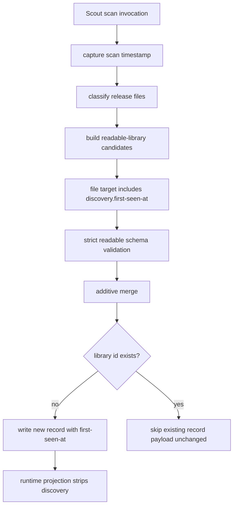

# feat: Add file-target discovery metadata

## Summary

Add first-class discovery observation metadata to readable-library file targets so newly generated release candidates record when Korri first saw the target locator. The metadata uses product vocabulary and existing readable-library naming style: `target.discovery.first-seen-at`.

---

## Problem Frame

Korri Scout can now discover release files and merge durable readable-library records automatically, but newly generated records do not preserve the time at which the target file was first observed. That timestamp is useful for later diagnostics and operator understanding, but it must not introduce Scout-branded provenance, ownership semantics, or stale reconciliation behavior.

---

## Requirements

- R1. File targets in readable-library release records may carry optional discovery metadata at `target.discovery.first-seen-at`.
- R2. Discovery metadata and touched generated-readable output must use Korri product vocabulary and kebab-case/nested readable-library style; no `scout`, `x-korri-*`, deprecated `source`, or implementation-branded provenance language in the durable YAML shape or generated YAML comments.
- R3. Generated release candidates include `target.discovery.first-seen-at` for newly added file-target releases.
- R4. Existing authored library payloads are never semantically patched to add, update, or remove discovery metadata; this does not require byte-preserving YAML edits when a merge adds other new records.
- R5. Repeated scans remain idempotent: the original first-seen timestamp survives because existing library IDs are skipped.
- R6. Launch resolution and config-graph loading continue to ignore discovery metadata for runtime behavior while accepting it in persisted YAML.
- R7. Tests use an injected clock seam so generated YAML remains deterministic.

---

## Scope Boundaries

- No Scout-branded keys, generated YAML comments, or generic provenance model.
- No `last-seen-at`, `missing-since`, stale cleanup, auto-delete, or availability reconciliation.
- No dedicated UI/reporting surface for discovery metadata beyond the existing release-scan CLI candidate YAML output; do not add separate discovery-specific report fields.
- No changes to non-file target behavior unless needed for strict schema compatibility.
- No semantic patching of existing records, including authored records that lack discovery metadata.
- No systemd time-sync dependency change in this slice; boot scans use the device clock available at scan time.

### Deferred to Follow-Up Work

- Missing-file/stale diagnostics that read `first-seen-at` without deleting records.
- A broader target-observation model if non-file targets later need equivalent metadata.
- Operator/UI presentation of discovery dates.

---

## Context & Research

### Relevant Code and Patterns

- `product/platform/library/config/records/library-item.ts` defines the strict readable-library release and target schemas. `FileTarget` is the schema seam for `target.kind: file`.
- `product/platform/library/config/records/library-item.ts` already uses quoted kebab-case keys such as `version-of`, and strict decoding rejects undeclared fields.
- `product/platform/library/config/records/game.ts` has persisted time-like field precedent through `GameUserData.lastPlayed`, while other runtime code serializes timestamps with `Date.toISOString()`.
- `product/platform/library/discovery/rom-scan-classifier.ts` builds generated `LibraryItemPayload` records and validates them with `decodeLibraryItemPayload` before returning candidates.
- `product/platform/library/discovery/release-candidate-scan.ts` merges generated candidate YAML additively by library ID and skips existing IDs, which naturally preserves first-write metadata.
- `product/platform/library/config/source-target-resolution.ts` resolves file targets using `kind`, `storage`, and `path`; discovery metadata should remain invisible to target resolution.
- `product/platform/library/proseql/library-repository.ts` projects readable releases into runtime `PlayableLibraryEntry` records, while `product/platform/library/playable-library.ts` defines a narrower runtime target schema. This boundary must strip or omit persisted discovery metadata rather than leaking it to runtime/API consumers.
- `product/platform/library/discovery/release-candidate-scan.test.ts` already covers deterministic YAML, merge idempotency, configured scans, and launch resolution through the config graph.

### Institutional Learnings

- `docs/solutions/best-practices/proseql-canonical-library-with-derived-yaml-ids-2026-05-06.md`: Korri YAML should use product-owned schema vocabulary and key-derived IDs; importers/scanners provide evidence but should not leak implementation names into durable records.
- `docs/solutions/design-patterns/constrained-llm-entrypoint-classification-2026-05-24.md`: scanner output should be validated and converted into stable Korri YAML shape before persistence.
- `docs/solutions/design-patterns/explicit-cascade-folded-policy-over-incidental-signal-heuristics-2026-05-27.md`: name durable facts explicitly at the product seam rather than relying on implementation-side heuristics or branded internal signals.

### External References

- None. Existing Korri schema, discovery, and institutional patterns are sufficient for this bounded slice.

---

## Key Technical Decisions

- Put the metadata under `target.discovery`, not the release or library item: the fact describes observation of this file locator (`storage` + `path`), not ownership or abstract release identity.
- Scope the schema to `FileTarget` only: this slice records discovery of scanned release files. Non-file target observation semantics are deferred until there is a concrete need.
- Use `first-seen-at` as a first-write fact: generated entries get the timestamp at creation; later scans do not update existing entries.
- Generate ISO UTC strings in candidate generation, but keep schema validation permissive enough for authorable YAML by requiring a non-empty string rather than rejecting operator-authored date variants at config-load time.
- Add an injectable clock seam for deterministic tests. Configured scans should capture one timestamp per configured scan invocation and pass it through each storage scan so a single boot/configured run has one consistent first-seen value.
- Do not add time-sync ordering to the boot service in this slice. A wrong device clock is an operational limitation of first-write timestamps, but blocking offline boot scans on time sync would be a larger behavior change.
- Keep discovery metadata as persistence-only library evidence. Runtime playable records and launch APIs should not expose `target.discovery` in this slice.

---

## Open Questions

### Resolved During Planning

- Should the field use Scout-branded provenance? No. Durable YAML should name the product fact, not the tool that observed it.
- Should the field be camelCase? No. Use nested readable-library style and kebab-case: `target.discovery.first-seen-at`.
- Should the field live under `target`? Yes. The observation is about the target locator.
- Should existing records be enriched on later scans? No. Merge semantics remain additive and skip existing library IDs.

### Deferred to Implementation

- Exact helper names for the clock seam and timestamp formatting are implementation details; the behavior is one injected timestamp per scan operation with a production default of current ISO time.

---

## High-Level Technical Design

> *This illustrates the intended approach and is directional guidance for review, not implementation specification. The implementing agent should treat it as context, not code to reproduce.*

---

## Implementation Units

### U1. Extend file-target readable schema

**Goal:** Allow persisted readable-library file targets to carry optional discovery metadata at `target.discovery.first-seen-at`.

**Requirements:** R1, R2, R6

**Dependencies:** None

**Files:**
- Modify: `product/platform/library/config/records/library-item.ts`
- Test: `product/platform/library/config/records/library-item.test.ts`
- Test: `product/platform/library/config/records/readable-schema.test.ts`

**Approach:**
- Add a small discovery payload under the existing `FileTarget` schema.
- Keep the field optional so existing authored file targets continue to decode unchanged.
- Use a quoted `first-seen-at` key to match readable-library kebab-case style.
- Require a non-empty string. Generated values should be ISO UTC strings, but strict config loading should not reject hand-authored date strings in this slice.
- Do not add discovery metadata to provider-ref, URL, executable, or file-set targets unless implementation reveals a strict-union compatibility issue.

**Patterns to follow:**
- Kebab-case field handling in `product/platform/library/config/records/library-item.ts`.
- Strict schema decode tests in `product/platform/library/config/records/library-item.test.ts`.
- Broad readable schema regression coverage in `product/platform/library/config/records/readable-schema.test.ts`.

**Test scenarios:**
- Happy path: a file target with `discovery.first-seen-at` decodes successfully.
- Happy path: a file target without `discovery` still decodes successfully.
- Error path: a file target with an empty `first-seen-at` value is rejected.
- Edge case: a non-file target with `discovery` is rejected if discovery is intentionally file-only.
- Integration: existing readable-library fixture decoding continues to pass.

**Verification:**
- The readable schema accepts `target.discovery.first-seen-at` only where intended and no existing fixture becomes invalid.

---

### U2. Emit discovery metadata from generated release candidates

**Goal:** Add first-seen metadata to newly generated file-target candidate records while preserving deterministic testability.

**Requirements:** R2, R3, R7

**Dependencies:** U1

**Files:**
- Modify: `product/platform/library/discovery/rom-scan-classifier.ts`
- Modify: `product/platform/library/discovery/release-candidate-scan.ts`
- Test: `product/platform/library/discovery/release-candidate-scan.test.ts`

**Approach:**
- Add a clock/timestamp seam to candidate generation and scan orchestration.
- Production scans should default to the current ISO UTC timestamp.
- Explicit-root scans should pass one captured timestamp into candidate generation for that scan invocation.
- Configured scans should capture one timestamp per configured scan invocation and reuse it across all storage roots in that invocation.
- Keep discovery metadata generation in the candidate-building path so manual explicit-root scans and boot/configured scans share behavior.
- Continue validating generated `LibraryItemPayload` records immediately after construction.

**Patterns to follow:**
- Existing candidate record construction in `product/platform/library/discovery/rom-scan-classifier.ts`.
- Existing deterministic scan tests in `product/platform/library/discovery/release-candidate-scan.test.ts`.

**Test scenarios:**
- Happy path: scanning a GBA file with an injected timestamp emits YAML containing `target.discovery.first-seen-at` with that exact value.
- Happy path: multiple candidates in one explicit-root scan share the injected scan timestamp.
- Happy path: configured scan over multiple storage roots uses one timestamp across all newly generated records in that invocation.
- Edge case: deterministic YAML tests remain deterministic when file creation order changes and the same injected timestamp is used.
- Error path: generated candidates still fail fast if schema validation rejects the discovery payload.

**Verification:**
- Generated candidate YAML includes the new discovery block and all existing scan reports/counts remain unchanged apart from the added YAML field.

---

### U3. Preserve first-seen metadata through additive merges

**Goal:** Prove the existing merge behavior preserves first-seen timestamps without semantically patching authored record payloads.

**Requirements:** R4, R5, R6

**Dependencies:** U1, U2

**Files:**
- Test: `product/platform/library/discovery/release-candidate-scan.test.ts`
- Test: `product/surfaces/terminal/korri-cli/korri-cli.test.ts`

**Approach:**
- Keep merge behavior whole-record additive: add missing library IDs, skip existing IDs, and never patch existing entry payloads to add discovery metadata.
- Add tests around the existing merge semantics rather than adding surgical/comment-preserving YAML editing.
- Treat “unchanged authored entry” as a semantic parsed-payload invariant, not a byte-for-byte file formatting guarantee when a merge also adds other records.
- Ensure release scan CLI output remains parseable JSON and includes candidate YAML containing the discovery block where appropriate.
- Update generated candidate YAML comments touched by this path to use neutral release-scan wording rather than Scout-branded wording.

**Patterns to follow:**
- Existing idempotency tests for `scanConfiguredReleaseCandidates`.
- Existing CLI tests for `korri scout scan releases` and `korri scout scan configured`.

**Test scenarios:**
- Integration: first scan writes `first-seen-at`; second scan with a different injected timestamp reports library skips and leaves the original timestamp unchanged in config.
- Integration: an authored existing library entry without discovery metadata remains semantically unchanged after scanning the same file ID.
- Integration: an authored existing library entry with hand-authored discovery metadata keeps its original parsed value after scanning the same file ID.
- Integration: merged config graph loads successfully and launch resolution still resolves the generated RetroArch/mGBA release with discovery metadata present.
- CLI: explicit-root scan JSON remains parseable and exposes candidate YAML with the discovery block.
- CLI: generated candidate YAML/comments use neutral release-scan wording and do not contain Scout-branded text.

**Verification:**
- Discovery metadata is first-write-only in practice, and generated YAML output avoids implementation-branded discovery language.

---

### U4. Keep runtime target projection discovery-free

**Goal:** Ensure persisted discovery metadata stays out of runtime playable/launch records in this slice.

**Requirements:** R6

**Dependencies:** U1

**Files:**
- Modify: `product/platform/library/proseql/library-repository.ts`
- Test: `product/platform/library/proseql/library-repository.test.ts`
- Test: `product/platform/library/discovery/release-candidate-scan.test.ts`

**Approach:**
- Treat `target.discovery` as persisted readable-library evidence, not as part of the runtime `PlayableLibraryEntry` target contract.
- At the repository projection boundary, omit discovery metadata from runtime targets instead of widening the runtime/API schema.
- Keep launch resolution behavior unchanged: the runtime target still carries only the fields needed to locate and launch the file.

**Patterns to follow:**
- Target projection logic in `product/platform/library/proseql/library-repository.ts`.
- Runtime target schema in `product/platform/library/playable-library.ts`.
- Existing provider-ref and file-target projection tests in `product/platform/library/proseql/library-repository.test.ts`.

**Test scenarios:**
- Integration: a readable-library file target with `discovery.first-seen-at` loads through the repository and produces a runtime playable release whose target omits `discovery`.
- Integration: the same record still resolves launch information correctly through the existing RetroArch/mGBA path.
- Edge case: provider-ref and non-file targets continue projecting unchanged.

**Verification:**
- Discovery metadata is accepted in persisted YAML but not exposed through runtime playable release targets.

---

## System-Wide Impact

- **Interaction graph:** The change touches persisted readable-library schema, release-scan candidate generation, manual CLI output, configured boot-scan output, config-graph loading, and repository projection into runtime playable records. It should not touch launch execution or plugin materialization.
- **Error propagation:** Schema rejection should surface through existing scan/generation validation or config-graph load errors; no new error channel is needed.
- **State lifecycle risks:** The timestamp is first-write-only. Wrong device time at first scan remains wrong until an operator edits or removes the entry; this is accepted for this slice.
- **API surface parity:** Manual explicit-root scan and configured/boot scan should emit the same discovery shape because they share candidate generation.
- **Integration coverage:** Tests should prove schema decode, generated YAML, merge idempotency, CLI JSON shape, repository projection, and launch resolution through the config graph.
- **Unchanged invariants:** Existing authored entries are not rewritten, storage conflict behavior is unchanged, and generated records remain normal readable-library records rather than tool-owned records.

---

## Risks & Dependencies

| Risk | Mitigation |
|------|------------|
| Strict schema rejects generated records if schema and generator diverge | Land schema and generator changes together and keep generation-time `decodeLibraryItemPayload` validation. |
| Non-deterministic timestamps break existing deterministic YAML tests | Add an injected timestamp/clock seam and use fixed values in tests. |
| Operators mistake discovery metadata for Scout ownership/provenance | Use neutral product vocabulary and avoid `scout`, `source`, and `x-korri-*` fields or generated YAML comments. |
| First boot records a stale clock value | Accept as a documented limitation; do not add time-sync ordering in this slice. |
| Future stale cleanup assumes generated ownership | Scope this plan to observation metadata only; no deletion or reconciliation behavior. |

---

## Documentation / Operational Notes

- No operator documentation is required for this slice beyond tests and schema naming.
- If a generated YAML example or fixture is updated, keep the discovery block visually normal and authorable; do not comment that it is Scout-owned.
- Follow-up stale diagnostics should treat `first-seen-at` as an observation fact, not as permission to mutate or delete records.

---

## Sources & References

- Related plan: `work/items/active/01KW5XFTPQBKCJB56QSZF4FXNN-rom-yaml-candidate-generator/plan.md`
- Related schema: `product/platform/library/config/records/library-item.ts`
- Candidate generation: `product/platform/library/discovery/rom-scan-classifier.ts`
- Scan/merge tests: `product/platform/library/discovery/release-candidate-scan.test.ts`
- Institutional learning: `docs/solutions/best-practices/proseql-canonical-library-with-derived-yaml-ids-2026-05-06.md`
- Institutional learning: `docs/solutions/design-patterns/constrained-llm-entrypoint-classification-2026-05-24.md`
- Institutional learning: `docs/solutions/design-patterns/explicit-cascade-folded-policy-over-incidental-signal-heuristics-2026-05-27.md`
