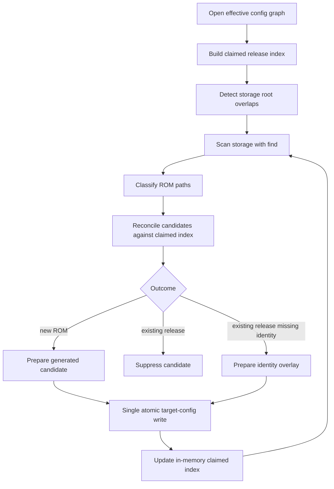

# fix: Deduplicate ROM scanner candidates against authored entries

## Summary

Teach the ROM release scanner to reconcile scanned files against the effective library before writing generated candidates. The scanner will suppress duplicate candidates, conservatively backfill missing hash identity into a safe local overlay when an existing entry already claims the file, and warn when overlapping storage roots make duplicate scans likely.

---

## Problem Frame

The Bandai SD-card cleanup showed that scanner output can duplicate games already represented by hand-authored entries because the current scanner only reserves generated IDs. A curated entry may point at the same ROM path, equivalent physical path through another storage root, or eventually the same content hash, yet the scanner still emits a new item when its generated ID differs.

The user also clarified that hand-authored entries may not include SHA/content identity. In those cases, a scan should enrich the existing authored entry rather than creating a duplicate solely because durable identity was missing.

---

## Requirements

- R1. Build scanner reconciliation from the effective library, not only from reserved item IDs, so authored entries can claim scanned ROM files.
- R2. Suppress scanner-generated candidates that match an existing file release by normalized storage/path, equivalent resolved physical path, or known content hash.
- R3. When a matched existing file release lacks a hash identity, backfill the missing identity into the scanner target config as a safe local overlay while preserving curated metadata when safe overlay visibility can be proven; otherwise suppress the duplicate and report skipped backfill.
- R4. Detect and report overlapping storage roots so the same physical tree is not scanned twice silently.
- R5. Preserve current scanner behavior for genuinely new ROMs, unsupported files, skipped storage roots, and deterministic YAML output.
- R6. Cover manual-entry dedupe, identity backfill, overlapping-root behavior, and cross-storage scan ordering with real filesystem/config fixtures.
- R7. Keep scanner entry points behaviorally aligned so the configured scan path and explicit `scout scan releases --config` path do not diverge on duplicate handling.

---

## Scope Boundaries

- No device-local Bandai cleanup, ROM deletion, or manual catalog surgery.
- No fuzzy title-based or metadata-similarity duplicate merger.
- No portal UI changes for duplicate display.
- No broad ProseQL persistence redesign.
- No attempt to edit arbitrary origin config files during backfill; backfill writes a safe local overlay to the scanner target file or suppresses the duplicate without backfill when a safe overlay cannot be proven.

### Deferred to Follow-Up Work

- Catalog-wide duplicate folding for non-ROM/plugin-provided entries such as duplicate titles from separate providers.
- Rich UI/CLI diagnostics for reviewing overlap warnings beyond the scanner result shape.
- A bulk migration/backfill tool that walks the whole library independently of a scanner run.

---

## Context & Research

### Relevant Code and Patterns

- `product/platform/library/discovery/release-candidate-scan.ts` owns configured scans, storage eligibility, candidate YAML rendering, and atomic config merge.
- `product/platform/library/discovery/rom-scan-classifier.ts` keeps path classification and candidate record creation pure; config-graph-aware dedupe should stay outside this classifier boundary.
- `product/platform/library/discovery/release-candidate-scan.test.ts` already uses real temp directories, real ROM files, real config roots, and `find` shims for scanner tests.
- `product/platform/library/content-identity/release-content-identity.ts` provides SHA-256 identity resolution with bounded concurrency and cache persistence.
- `product/platform/library/config/records/library-item.ts` defines optional release `identity` and restricts hash identity to file targets.
- `product/platform/library/proseql/config-graph-db.ts` is the effective config graph read boundary; scanner planning should preserve this scoped Effect boundary rather than moving Effect into pure classifier code.
- `AGENTS.md` requires reading nearby patterns first, doing exactly the requested scope, and avoiding bonus refactors.

### Institutional Learnings

- `docs/solutions/best-practices/proseql-canonical-library-with-derived-yaml-ids-2026-05-06.md`: persisted YAML keys derive IDs; the scanner is an incremental reconciler and must consciously differ from bulk importers that fail on non-empty libraries.
- `docs/solutions/design-patterns/explicit-cascade-folded-policy-over-incidental-signal-heuristics-2026-05-27.md`: prefer explicit identity and config-graph policy over heuristic duplicate guesses.
- `docs/solutions/design-patterns/constrained-llm-entrypoint-classification-2026-05-24.md`: keep the pipeline deterministic: scan, annotate, reconcile, validate, write.
- `docs/solutions/best-practices/prefer-real-implementations-over-mocks-2026-05-02.md`: scanner/config behavior should be tested with real filesystem and YAML fixtures rather than mocks.

### External References

- External research skipped: the repo already has direct scanner, ProseQL, identity-cache, and test patterns for this work.

---

## Key Technical Decisions

- Keep classification pure and add reconciliation in the scan orchestration layer: dedupe depends on effective config, storage roots, and hash identity, none of which belong in `rom-scan-classifier.ts`'s path-only classifier.
- Use a claimed-release index keyed per release, not per library item: multi-release entries must claim only the specific file release that matches a scanned file.
- Treat content hash as durable identity, but do not require authored entries to already have hashes: path matches should trigger conservative hash backfill so future renamed/moved-file scans have a durable signal.
- Write backfill as a local overlay in the scanner target file: this satisfies the user's enrichment requirement without editing arbitrary source roots that may be read-only or externally managed.
- Backfill overlays must preserve effective release arrays safely: because release arrays are not assumed to deep-merge by release ID, a cross-root overlay must write a full effective item/release shape with only the missing identity added, not a minimal identity-only release fragment. Safe overlay visibility means the target config path is an included fragment under a library-contributing root whose order can override the matched effective contributor; otherwise suppress the duplicate and report backfill as skipped rather than writing unsafe data.
- Treat any matched existing file release as backfillable regardless of whether it was originally hand-authored or scanner-generated: the persisted payload has no durable authored/generated discriminant after YAML parsing, so behavior should be based on file-release claims and missing identity, not on comment/provenance guesses.
- Use case-preserving path normalization for storage/path keys and rely on resolved realpaths or hashes for case-insensitive physical aliases; global lowercase folding would incorrectly conflate distinct files on case-sensitive filesystems.
- Detect overlapping roots with exact, prefix, and resolved-realpath comparisons when roots are eligible/readable: warn rather than skipping by default, relying on reconciliation and mid-loop index updates to suppress duplicates.
- Update the claimed index as each storage scan produces accepted/backfilled outcomes, including newly added hash claims: otherwise two overlapping storages with no pre-existing authored entries can duplicate each other within the same scan run.
- Hash candidates that miss path and resolved-path checks when the claimed index contains known content hashes; otherwise hash-based dedupe cannot catch renamed files whose authored release already has identity.

---

## Open Questions

### Resolved During Planning

- Where should identity backfill be written when the matching authored entry came from another config root? Resolve by writing a local overlay in the scanner target config file.
- Should backfill be part of this plan rather than a later migration? Yes; it is in scope because the user explicitly called out hand-authored entries without SHA identity.
- Should overlap detection warn or skip? Warn in this plan, so existing configured scans continue to run while dedupe prevents duplicate writes.

### Deferred to Implementation

- Exact helper/type names for claim records, reconciliation outcomes, write batches, and report fields: decide while editing `release-candidate-scan.ts`.
- Exact serialization order/format for safe full-effective-item overlays: verify with snapshot-style YAML assertions while implementing.
- Whether strict concurrent scanner locking is necessary: this plan treats concurrent scanner invocations against the same target config as unsupported and requires idempotent recovery, but a lock can remain follow-up unless implementation reveals common concurrent callers.

---

## High-Level Technical Design

> *This illustrates the intended approach and is directional guidance for review, not implementation specification. The implementing agent should treat it as context, not code to reproduce.*

Reconciliation should be deterministic and signal-based: normalize storage/path claims, add resolved physical-path claims when roots are readable, compare known hash identities, then choose add/suppress/backfill outcomes without fuzzy title matching.

---

## Implementation Units

### U1. Add claimed-release indexing and reconciliation result types

**Goal:** Define the internal data structures that represent authored file-release claims, candidate match signals, and scan reconciliation outcomes.

**Requirements:** R1, R2, R3

**Dependencies:** None

**Files:**
- Modify: `product/platform/library/discovery/release-candidate-scan.ts`
- Test: `product/platform/library/discovery/release-candidate-scan.test.ts`

**Approach:**
- Add scanner-internal types for claimed file releases, normalized storage/path keys, resolved absolute-path keys, and content-hash keys.
- Model claims per release target and include enough metadata for later backfill: library item ID, release ID/index, target storage/path, existing identity when present, and effective payload needed for a safe local overlay.
- Add reconciliation outcome counters that can distinguish added candidates, deduplicated candidates, identity backfills, and overlap warnings without changing classifier semantics.
- Keep these types local to `release-candidate-scan.ts` unless tests or callers need a narrow export.

**Execution note:** Add characterization tests around current ID-reservation behavior before changing merge semantics, then revise expectations in later units as reconciliation lands.

**Patterns to follow:**
- `RomScanResult`, `ConfiguredStorageScanResult`, and `MergeReleaseCandidateConfigResult` discriminated/structured result style in `product/platform/library/discovery/release-candidate-scan.ts`.
- `LibraryReleasePayload` identity constraints in `product/platform/library/config/records/library-item.ts`.

**Test scenarios:**
- Happy path: existing `createRomLibraryCandidates` still emits deterministic, schema-valid candidates when no claimed index is supplied.
- Edge case: a library item with two file-target releases yields two independent release claims rather than one item-level claim.
- Edge case: non-file targets are ignored by the claimed-release index and cannot suppress ROM file candidates.
- Error path: malformed existing library fragments surface through config-graph diagnostics/skipped-fragment behavior rather than being hidden by the index builder; malformed writable target YAML still fails through the existing merge/read error path.

**Verification:**
- The scanner has an explicit internal representation for existing file-release claims and reconciliation outcomes.
- No config-graph-aware logic is added to the pure path classifier.

---

### U2. Build the effective claimed-content index and overlap diagnostics

**Goal:** Extend configured-scan snapshot loading so each scan starts with storage records, existing library IDs, effective file-release claims, and storage-root overlap diagnostics.

**Requirements:** R1, R2, R4

**Dependencies:** U1

**Files:**
- Modify: `product/platform/library/discovery/release-candidate-scan.ts`
- Test: `product/platform/library/discovery/release-candidate-scan.test.ts`

**Approach:**
- Extend the configured snapshot read to query effective library items, not just item IDs.
- Index every release with `target.kind: file` by normalized `storage + path`.
- Resolve absolute file paths using effective storage roots when roots are absolute and accessible; inaccessible roots should still contribute storage/path claims.
- Index existing `identity.value` for file releases that already declare a hash identity.
- Detect storage root overlaps by exact root, prefix root, and realpath-equivalent root where realpath is available.
- Report overlap warnings in configured scan results without skipping scan execution by default.

**Patterns to follow:**
- `readConfiguredScanSnapshot()` as the single config graph read seam.
- `storageScanEligibility()` reason/message style for readable operator diagnostics.

**Test scenarios:**
- Happy path: an authored entry with `storage: sd-roms` and `path: gba/Metroid Fusion.gba` contributes a storage/path claim before scanning.
- Happy path: an authored entry whose storage root resolves to the same physical file contributes a resolved-path claim.
- Happy path: an authored entry with `identity: { kind: hash }` contributes a content-hash claim.
- Edge case: an inaccessible storage root still contributes storage/path claims and does not throw while building resolved-path claims.
- Edge case: exact duplicate roots, parent/child roots, and symlink/realpath-equivalent roots produce overlap diagnostics.
- Edge case: non-absolute and templated roots preserve current skipped-storage behavior.

**Verification:**
- Configured scan snapshots contain enough information to reconcile candidates before merge.
- Overlapping roots are visible in scanner results without making current valid scans fail.

---

### U3. Reconcile scanned candidates before rendering generated YAML

**Goal:** Filter or annotate scan candidates against the claimed index so duplicate candidates are suppressed before they reach ID-based YAML merge.

**Requirements:** R1, R2, R4, R5

**Dependencies:** U1, U2

**Files:**
- Modify: `product/platform/library/discovery/release-candidate-scan.ts`
- Modify: `product/platform/library/discovery/rom-scan-classifier.ts` only if candidate creation needs a narrow optional identity field; avoid config-aware changes here.
- Test: `product/platform/library/discovery/release-candidate-scan.test.ts`

**Approach:**
- Keep `classifyRomScanPath()` path-only and deterministic.
- Add a post-classification reconciliation step that receives candidate classifications, current storage, root, and claimed index.
- Suppress candidates that match by storage/path, resolved absolute path, or known content hash.
- For candidates that miss path and resolved-path checks while the claimed index contains hashes, compute a bounded candidate hash so hash-only matches for renamed files can suppress duplicates.
- Record dedupe reason and matched existing entry information in scan report samples/counters.
- Generate YAML only for candidates that remain unclaimed.
- After each storage merge/backfill batch, add newly accepted generated releases and newly computed identities to the in-memory claimed index so later storage scans in the same run cannot duplicate earlier ones.

**Execution note:** Implement storage/path suppression first, then resolved-path suppression, then hash-based suppression/backfill so each tier can be tested independently.

**Patterns to follow:**
- Existing report counting in `recordClassification()` and `freezeReport()`.
- Existing deterministic candidate sorting in `createRomLibraryCandidatesFromClassifications()`.

**Test scenarios:**
- Happy path: scanner finds a ROM with the same storage/path as an authored entry; result adds no new library entry and increments deduped reporting.
- Happy path: scanner finds a ROM through a different storage key but the same resolved physical path; result adds no duplicate.
- Happy path: scanner finds a genuinely new ROM; generated YAML and `libraryAdded` behavior match current scanner expectations.
- Happy path: authored release already has a hash identity, the file is found at a different path, and bounded candidate hashing suppresses the duplicate by hash.
- Edge case: two overlapping storages with no pre-existing library entries scan sequentially; the second storage's duplicate candidate is suppressed because the in-memory index was updated after the first storage.
- Edge case: duplicate generated IDs for distinct files still use the existing deterministic suffixing behavior.
- Error path: if a storage scan fails, later storages still run and the claimed index is not corrupted by the failed scan.

**Verification:**
- Duplicate ROM candidates are removed before generated YAML merge.
- Scan results explain when candidates were deduplicated rather than simply reporting zero additions.

---

### U4. Backfill missing release identity through local overlay writes

**Goal:** When a scanned file matches an existing release that lacks hash identity, compute the file hash and write a conservative local overlay into the scanner target config.

**Requirements:** R2, R3, R5

**Dependencies:** U1, U2, U3

**Files:**
- Modify: `product/platform/library/discovery/release-candidate-scan.ts`
- Modify: `product/platform/library/content-identity/release-content-identity.ts` only if dependency injection/test isolation requires a narrow public hook.
- Test: `product/platform/library/discovery/release-candidate-scan.test.ts`

**Approach:**
- Use the existing release content identity resolver to compute `sha256:` identity for matched file releases that lack identity.
- Add identity only for the matched file release; do not replace curated title, display metadata, launch fields, or unrelated releases.
- Write the backfill into the scanner target config file as a local overlay keyed by the existing library item ID.
- Preserve existing target-file content when the item is already present locally; when the item originates elsewhere, write a full effective item payload with the matched release identity added so release arrays do not get replaced by a minimal fragment.
- Validate overlay graph safety before relying on a local overlay: the scanner target config must be an included fragment under a library-contributing root whose order can override the matched effective contributor. Use config-graph diagnostics/provenance if available; otherwise prove visibility with a read-after-write effective-graph test fixture. If safety cannot be proven, suppress the duplicate and report backfill as skipped.
- Apply generated-candidate additions and backfill overlays in one atomic target-config write per storage pass so partial state has a clear idempotent recovery path.
- Count identity backfills separately from library additions and skipped ID collisions.
- If hashing fails, the file disappears between scan and backfill, or the resolver cannot prove a fresh stat/hash relationship, suppress the duplicate by path match but report that identity backfill was not written.

**Patterns to follow:**
- `defaultReleaseContentIdentityResolver` behavior and bounded hashing in `product/platform/library/content-identity/release-content-identity.ts`.
- Atomic write behavior in `mergeReleaseCandidateConfig()`.
- Schema validation with `decodeLibraryItemPayload()` before writing any backfilled library payload.

**Test scenarios:**
- Happy path: authored entry in the scanner target file has matching storage/path and no identity; scan writes `identity` for that release and adds no duplicate item.
- Happy path: authored entry from another config root has matching storage/path and no identity; scan writes a full local overlay in the target file and the effective library still has the curated title/launch fields.
- Happy path: authored entry already has identity; scan suppresses duplicate without rewriting that identity.
- Edge case: item has multiple releases; backfill affects only the matched release and leaves sibling releases intact.
- Edge case: a hash match for a different path suppresses the candidate and does not overwrite authored target/path metadata.
- Edge case: target config is not in the effective graph at useful precedence; duplicate is suppressed, backfill is skipped, and no unsafe overlay is written.
- Error path: hash resolution returns no identity because the file is unreadable, disappears, or cannot be trusted as fresh; duplicate is still suppressed by path match and the report records no successful backfill.

**Verification:**
- Hand-authored entries without SHA identity become enriched during scanner reconciliation.
- The scanner does not create duplicate items as a side effect of missing identity.
- Existing curated fields survive a scan/backfill round trip.

---

### U5. Tighten merge/reporting semantics and regression coverage

**Goal:** Make scanner output observable and stable after reconciliation by updating merge counters, scan reports, and regression tests for all acceptance scenarios.

**Requirements:** R4, R5, R6

**Dependencies:** U3, U4

**Files:**
- Modify: `product/platform/library/discovery/release-candidate-scan.ts`
- Test: `product/platform/library/discovery/release-candidate-scan.test.ts`

**Approach:**
- Extend scan and merge result objects additively with counters such as deduplicated candidates, identity backfills, and overlap warnings.
- Keep existing `librarySkipped` ID-collision behavior as a defensive fallback, but ensure normal duplicate ROM suppression is visible through the new dedupe counters.
- Ensure re-running the configured scanner is idempotent: a second scan should not add duplicates or rewrite already-backfilled identities unnecessarily.
- Include partial-state recovery coverage for a target config that already contains generated candidates but is missing the intended identity backfill.
- Update existing tests that currently expect duplicate suffixes across storages so the new expected behavior reflects content claims rather than ID-only reservation.

**Patterns to follow:**
- Existing `ScanConfiguredReleaseCandidatesResult` aggregate count style.
- Existing `RomScanReport.samples` bounded sample behavior.

**Test scenarios:**
- Happy path: first scan adds new ROM entries; second scan reports dedupe/skips without changing YAML content unexpectedly.
- Happy path: overlapping root warning appears in configured scan results while scan status remains successful.
- Edge case: scanner output is deterministic across file creation order after dedupe/backfill fields are included.
- Edge case: configured scans still continue after one storage scan fails.
- Integration: full scan over two config roots and two storage roots proves authored entries, generated entries, backfilled overlays, and new candidates compose through the effective ProseQL graph.
- Integration: interrupted/partial prior state with candidates already present but identity missing is reconciled on the next scan without adding duplicates.

**Verification:**
- The targeted scanner test file covers every backlog acceptance criterion and the user's backfill clarification.
- Existing scanner behavior outside duplicate reconciliation remains stable.

---

### U6. Align Scout CLI scan entry points

**Goal:** Ensure user-facing Scout commands route through the same reconciliation semantics instead of leaving a raw scan path that can still create duplicates.

**Requirements:** R5, R7

**Dependencies:** U3, U4, U5

**Files:**
- Modify: `product/surfaces/terminal/korri-cli/scout-command.ts`
- Test: `product/surfaces/terminal/korri-cli/korri-cli.test.ts`

**Approach:**
- Audit both `scout scan configured` and `scout scan releases --config` paths.
- Route explicit release scans through a shared reconciliation/merge API when a config path is provided.
- If an explicit root/storage scan lacks enough effective config context to reconcile safely, fail or report the unsupported dedupe mode clearly instead of silently falling back to raw duplicate-producing merge behavior.
- Keep command output additive and consistent with scanner result counters.

**Patterns to follow:**
- Existing CLI tests for `scout scan configured` and `scout scan releases` in `product/surfaces/terminal/korri-cli/korri-cli.test.ts`.
- Existing `scout-command.ts` command split between explicit-root and configured-root scans.

**Test scenarios:**
- Happy path: `scout scan configured --config` reports dedupe/backfill counters from the shared scanner path.
- Happy path: `scout scan releases --config` dedupes against the provided config when enough config context is available; otherwise it reports that dedupe-safe mode is unsupported rather than doing a raw duplicate-producing merge.
- Edge case: explicit scan merge conflict diagnostics remain JSON-compatible with existing tests.

**Verification:**
- No user-facing Scout command path silently keeps the old duplicate-producing behavior when a config context is available.
- Targeted verification covers both `product/platform/library/discovery/release-candidate-scan.test.ts` and `product/surfaces/terminal/korri-cli/korri-cli.test.ts`.

---

## System-Wide Impact

- **Interaction graph:** Configured scan now reads effective storage and library data, reconciles candidates, writes generated entries/backfill overlays to the target config, and relies on ProseQL reloads/tests to prove effective graph behavior.
- **Error propagation:** Config-load, scan, hash, and merge failures should keep existing diagnostic result patterns. Hash/backfill failure for a matched duplicate should not turn into a duplicate add.
- **State lifecycle risks:** The scanner now mutates identity metadata as well as adding new entries; generated additions and backfill overlays should be batched into one atomic write per storage pass, and second scans must recover partial prior state idempotently.
- **API surface parity:** Public scanner result shapes and Scout CLI output receive additive counters/diagnostics. Existing callers that inspect only `status`, `scanned`, `skipped`, or `failed` should continue working.
- **Integration coverage:** Unit-level candidate helpers are insufficient; configured scan and CLI tests must cover real temp roots, YAML merge, and effective config graph reads.
- **Concurrency boundary:** Concurrent scanner invocations against the same target config remain unsupported unless implementation adds a lock; the plan relies on single-writer operation plus idempotent recovery.
- **Unchanged invariants:** File path classification remains path-only, generated IDs remain deterministic for truly new entries, and non-file library targets remain outside ROM scanner dedupe.

---

## Risks & Dependencies

| Risk | Mitigation |
|------|------------|
| Backfill overlay accidentally shadows curated upstream metadata | Never write minimal identity-only release fragments across roots; write a full effective item payload with only identity added, and prove effective metadata survives reload. |
| Target config is not part of the effective graph or loses precedence | Detect this before relying on local overlay backfill; suppress duplicate and report skipped backfill rather than writing invisible/unsafe data. |
| Candidate hashing makes large SD-card scans slow | Hash unmatched candidates only when known hash claims exist, and use the existing bounded resolver/cache. |
| Stale hash cache could backfill the wrong identity on coarse-mtime filesystems | Treat fresh stat/hash validation as part of backfill acceptance; skip backfill if freshness cannot be trusted. |
| Overlap warning without mid-loop index update still permits same-run duplicates | Land overlap diagnostics together with in-memory storage/path, resolved-path, and hash-claim updates after each storage merge. |
| Additive result fields break strict downstream consumers | Keep existing fields/status variants stable; add optional/additive counters rather than replacing current result shape. |

---

## Documentation / Operational Notes

- Update inline scanner comments to distinguish incremental scanner reconciliation from bulk importer reset/fail-fast semantics.
- No user-facing docs are required in this plan unless implementation exposes a CLI/reporting surface for overlap warnings.
- Operators should be able to verify remediation by running a configured scan twice and observing no new duplicate entries on the second pass.

---

## Sources & References

- **Origin item:** [work/items/active/01KWCX54434N0MSHMHWN6FHD37-deduplicate-scanner-candidates/item.md](work/items/active/01KWCX54434N0MSHMHWN6FHD37-deduplicate-scanner-candidates/item.md)
- Related code: [product/platform/library/discovery/release-candidate-scan.ts](product/platform/library/discovery/release-candidate-scan.ts)
- Related code: [product/platform/library/discovery/rom-scan-classifier.ts](product/platform/library/discovery/rom-scan-classifier.ts)
- Related tests: [product/platform/library/discovery/release-candidate-scan.test.ts](product/platform/library/discovery/release-candidate-scan.test.ts)
- Related CLI: [product/surfaces/terminal/korri-cli/scout-command.ts](product/surfaces/terminal/korri-cli/scout-command.ts)
- Related CLI tests: [product/surfaces/terminal/korri-cli/korri-cli.test.ts](product/surfaces/terminal/korri-cli/korri-cli.test.ts)
- Related code: [product/platform/library/content-identity/release-content-identity.ts](product/platform/library/content-identity/release-content-identity.ts)
- Related schema: [product/platform/library/config/records/library-item.ts](product/platform/library/config/records/library-item.ts)
- Institutional learning: [docs/solutions/best-practices/proseql-canonical-library-with-derived-yaml-ids-2026-05-06.md](docs/solutions/best-practices/proseql-canonical-library-with-derived-yaml-ids-2026-05-06.md)
- Institutional learning: [docs/solutions/design-patterns/explicit-cascade-folded-policy-over-incidental-signal-heuristics-2026-05-27.md](docs/solutions/design-patterns/explicit-cascade-folded-policy-over-incidental-signal-heuristics-2026-05-27.md)
