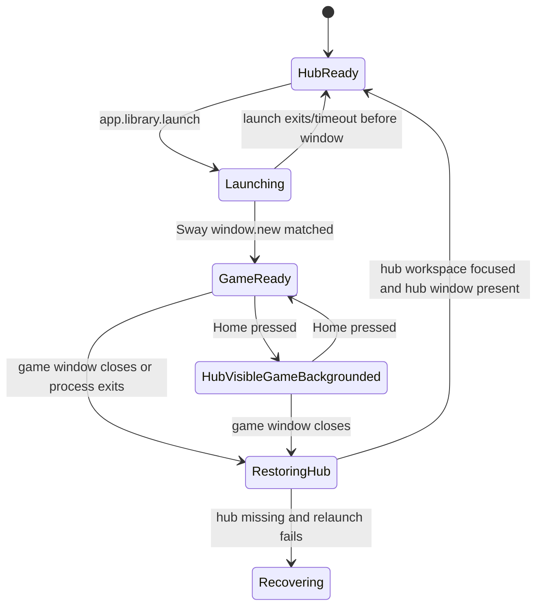
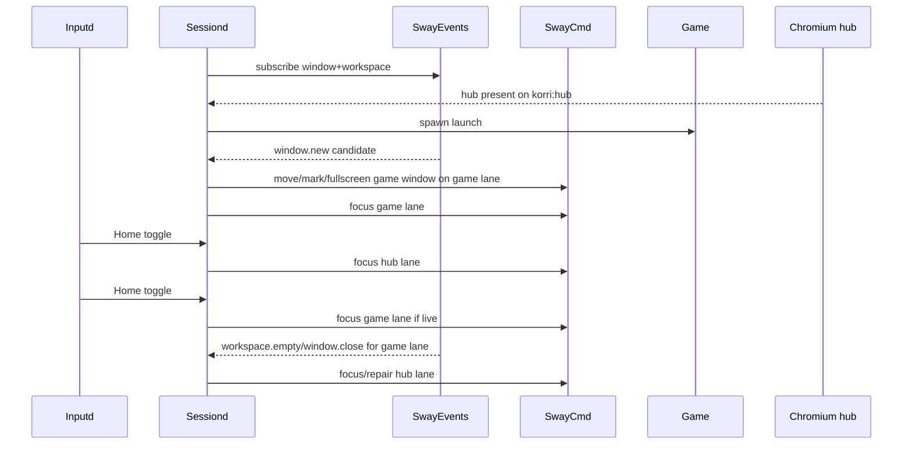

# feat: Add event-driven workspace game lanes

## Summary

Implement a first workspace-backed lane model for Korri kiosk launches: the Chromium hub stays alive on a hub workspace, games are promoted into an active game workspace, and Home toggles between them. Sway window/workspace events become the primary source of lane facts, with one-shot tree snapshots reserved for hydration, timeouts, and recovery.

---

## Problem Frame

Korri currently treats a launch like a foreground takeover: the kiosk renderer can be stopped before a game and recreated afterward. That loses hub state, does not support Steam-Deck-like Home switching, and does not set up a path toward multiple backgrounded or frozen game sessions.

The live Sway spike showed that workspace switching can preserve the hub while presenting a separate game lane. The implementation needs to turn that into a durable, event-driven sessiond model without making surfaces participate in lifecycle orchestration.

---

## Requirements

- R1. Keep the Chromium hub renderer alive while a game is running; do not close or relaunch it as the normal launch path.
- R2. Launch presentation must be surface-agnostic: sessiond/Sway manage windows and workspaces without per-surface snapshot, restore, or pause hooks.
- R3. Home must toggle between hub and the currently active game when a game lane exists, with a safe fallback to hub when no game is available.
- R4. Sway `window` and `workspace` events must drive normal lane state transitions; polling/tree scans are fallback and hydration tools only.
- R5. Korri must not leave the user stranded on an empty non-hub workspace after launch failure, game exit, Sway event loss, or fast crash.
- R6. The first implementation may support one active game lane, but names/state boundaries must leave room for future multiple or frozen lanes.
- R7. Existing managed-launch lifecycle semantics remain coherent: no false `renderer-stopped` event when the hub renderer is still alive, and terminal readiness reflects hub workspace readiness.

---

## Scope Boundaries

- This plan does not implement multiple simultaneous games, a game-lane switcher UI, or frozen/background process control.
- This plan does not add per-surface lifecycle APIs such as `quiesce`, `snapshot`, or `restore`.
- This plan does not replace Sway with a custom compositor or build a Gamescope-equivalent layer.
- This plan does not tune Chromium background throttling flags unless implementation-time validation shows Chromium fails to resume or maintain required hub state.
- This plan does not make Gamescope responsible for hub/game switching; Gamescope remains an optional game presentation adapter inside the Sway/session policy.

### Deferred to Follow-Up Work

- Multiple game lanes and a lane switcher UI: extend the lane registry from one active game lane to `korri:game:<launchId>` lanes.
- Frozen/backgrounded games: add explicit process-group pause/resume semantics after the workspace lane model is proven.
- Surface-visible quiescing: add generic visibility/lifecycle signals for surfaces only if Chromium/Sway background behavior is not sufficient.
- Optional close/relaunch with guaranteed restore: tracked separately as `01KWDARX0QV51R9DMRXJRHYQGX`.

---

## Context & Research

### Relevant Code and Patterns

- `product/services/device/sessiond.ts` owns managed launch sequencing, role hooks, status, and active launch identity.
- `product/services/device/sessiond-role.ts` defines `SessionRole` and the kiosk role; current kiosk behavior stops and relaunches the renderer around launches.
- `product/services/device/sessiond-sway.ts` is the existing Sway command/tree boundary and already includes event payload parsing helpers.
- `product/services/device/game-stream-fullscreen.ts` shows the current launch-surface repair pattern and the polling loop that event-driven lanes should replace or wrap for this path.
- `product/services/device/inputd.ts`, `product/services/device/inputd-actions.ts`, and `product/services/device/sway-actions.ts` own Home/system shortcuts and Sway shortcut command dispatch.
- `product/services/device/sessiond-chromium.ts` is the current renderer controller when `KORRI_RENDERER=chromium` is set.
- `product/systems/nixos/images/kiosk.nix` wires the kiosk renderer, sessiond environment, Sway paths, and inputd action environment on device images.

### Institutional Learnings

- `docs/solutions/architecture-patterns/sessiond-operator-model-2026-05-29.md`: sessiond is the foreground lifecycle authority; keep lifecycle vocabulary and capabilities additive.
- `docs/solutions/architecture-patterns/physical-host-foreground-lifecycle-truth-is-sessiond-2026-05-29.md`: the hub must read lifecycle through existing app/server status surfaces, not become a parallel foreground authority.
- `docs/solutions/architecture-patterns/kiosk-foreground-app-policy-over-gamescope-overlay-2026-05-24.md`: session policy, not Gamescope, owns which surface is foreground; workspace isolation is the recommended durable strategy.
- `docs/solutions/runtime-errors/sessiond-sse-stream-killed-by-bun-idle-timeout-2026-05-27.md`: observer transport liveness must not be treated as domain state; event streams require reconnect/hydration discipline.
- `docs/solutions/best-practices/decoupled-spatial-navigation-2026-05-01.md`: surfaces stay device-agnostic leaves; global input and focus policy belong below/around surfaces.

### External References

- Sway IPC official docs: `https://man.archlinux.org/man/sway-ipc.7.en` — binary framing, `SUBSCRIBE`, `window`/`workspace` events.
- Sway command/criteria docs: `https://man.archlinux.org/man/sway.5.en` — criteria, marks, workspace focus, move-to-workspace, fullscreen commands.
- Gamescope README: `https://raw.githubusercontent.com/ValveSoftware/gamescope/master/README.md` — SteamOS-like game presentation uses a virtual/sandboxed game display and compositor layering, not hub teardown.
- Chrome background behavior references: `https://developer.chrome.com/blog/background_tabs` and `https://developer.mozilla.org/en-US/docs/Web/API/Page_Visibility_API` — background work is throttled/visibility-driven, but app correctness should not depend on per-surface code in this slice.

---

## Key Technical Decisions

- Use named workspaces for semantic lanes (`korri:hub`, `korri:game:active`) in the first slice rather than numeric workspaces. Names make commands self-describing and avoid accidental coupling to user-facing workspace numbers while still allowing future `korri:game:<launchId>` lanes.
- Keep one active game lane initially. The lane model should use explicit lane names and states, but avoid adding a multi-lane registry or UI until the single-lane Home toggle is proven.
- Launch detection is event-first: start observing Sway before/around game spawn, then move/focus the game lane only after a matching window event appears. This avoids intentionally switching the user to an empty game workspace.
- Use one-shot `GET_TREE`/workspace snapshots only for initial hydration, event-stream reconnect, launch timeout diagnosis, and safety repair. Repeated polling is not the normal control loop.
- Sessiond owns lane decisions. Inputd dispatches Home intent to sessiond when possible; Sway events report facts; surfaces do not participate.
- Preserve the existing kiosk role shape by adding a separate lane-aware kiosk role variant selected by configuration. The role-level `emitsRendererStopped` value stays static per role instance: legacy kiosk keeps the close/relaunch semantics; lane-aware kiosk always reports no renderer stop.
- Do not emit `renderer-stopped` for lane-aware launches because the Chromium renderer remains alive.
- Treat Sway compositor restart as a degraded generation change, not a normal event-stream disconnect. Reconnect must rediscover the socket, invalidate cached container ids/marks, hydrate from a fresh tree, and avoid focusing a stale game lane until current facts are known.
- Validate Sway placement/focus commands by observable state, not command success alone. If move/focus/fullscreen has no effect or times out, fail closed to hub visibility or managed-launch failure rather than optimistic lane state.
- Use launch/lane generation tokens so races among `window.new`, `window.close`, child exit, launcher exit, and timeout are idempotent and stale events cannot resurrect an exited lane.

---

## Open Questions

### Resolved During Planning

- Home semantics: Home toggles hub ↔ active game when a game lane is live. When sessiond is reachable but no live game lane exists, sessiond handles the request by focusing/repairing hub or no-oping safely; the legacy system-panel command runs only when sessiond is unavailable or lacks the lane-toggle capability.
- Workspace placement: normal flow waits for a game window event, then moves/focuses it into the game lane; it does not pre-switch to an empty game workspace.
- Lane count: first implementation is one active game lane with future-compatible naming/state boundaries.
- Event ownership: sessiond owns the Sway event subscription because sessiond owns foreground lifecycle and already has Sway environment discovery.
- Role shape: implement lane-aware kiosk behavior as a separate role variant selected by config, not as a per-launch flag on the existing role.
- Sway command confidence: every lane move/focus/fullscreen action needs bounded execution and read-back verification before sessiond treats the lane as active.

### Deferred to Implementation

- Exact Chromium `app_id`/class selector on each target image: implementation should measure live Sway tree output and configure the hub selector through existing Sway selector wiring rather than hard-code one observed device value.
- Exact PID-lineage matching depth: implementation should start with launch-window event filtering plus ignored-window snapshots and add process-group/PID matching where the launcher exposes reliable process metadata.
- Exact public RPC/socket path for Home toggle: choose the smallest additive sessiond control endpoint/client helper consistent with existing sessiond managed-launch clients.
- Exact timeout/backoff values for Sway IPC reconnect and command validation: choose conservative defaults during implementation and cover them with deterministic tests.

---

## High-Level Technical Design

> *This illustrates the intended approach and is directional guidance for review, not implementation specification. The implementing agent should treat it as context, not code to reproduce.*





---

## Implementation Units

### U1. Add narrow Sway event subscription source

**Goal:** Create a tested sessiond Sway event source that reads `window` and `workspace` events without polling, while avoiding a broad reusable Sway client subsystem in the first slice.

**Requirements:** R4, R5

**Dependencies:** None

**Files:**
- Create: `product/services/device/sessiond-sway-events.ts`
- Test: `product/services/device/sessiond-sway-events.test.ts`
- Modify: `product/services/device/sessiond-sway.ts`
- Create or modify: `product/services/device/sessiond-sway-socket.ts`

**Approach:**
- Add a narrow `SessiondSwayEventSource` for sessiond/lane use, not a general-purpose Sway client library.
- Extract or share Sway socket discovery into a small Sway socket seam so both the existing command runner and the event source use the same discovery behavior.
- Use the smallest reliable event transport behind that seam. Direct Sway IPC framing is preferred when implementing the persistent subscriber, but the public plan boundary is the event-source interface rather than a broad reusable subsystem.
- Keep binary frame decoding separate from JSON event parsing. Reuse the existing Sway event payload parser instead of re-implementing a second JSON node decoder.
- Bound buffering and frame sizes so malformed or never-completing partial frames cannot grow memory unbounded.
- Treat event stream disconnect as transport uncertainty: emit a subscriber status/reconnect signal and require callers to hydrate from a snapshot after reconnect.

**Execution note:** Start with subscriber frame decoding and partial-frame characterization tests before wiring it into sessiond.

**Patterns to follow:**
- `product/services/device/sessiond-sway.ts` for Sway node types and socket discovery conventions.
- `product/services/device/inputd.ts` for long-lived event source cleanup and testable stream ownership patterns.

**Test scenarios:**
- Happy path: Sway IPC binary frames are decoded by magic bytes, payload length, message type, and payload body without conflating framing with event JSON parsing.
- Happy path: decoded `window` and `workspace` payload bodies are routed through the shared Sway event payload parser and preserve container/workspace identity.
- Edge case: partial IPC frames split across chunks are buffered until complete and do not emit malformed events.
- Edge case: multiple frames in one chunk emit in order.
- Error path: invalid JSON, an unknown event type, an oversized frame, or an impossible frame length is surfaced as a recoverable subscriber diagnostic rather than crashing sessiond.
- Error path: subscriber close/disconnect produces a transport-status event so the lane controller can hydrate from a tree snapshot.
- Error path: repeated reconnect failures back off instead of retrying hot.

**Verification:**
- The subscriber can be tested without a live Sway process.
- No repeated `swaymsg -t get_tree` loop is needed to observe normal `window`/`workspace` events.

---

### U2. Introduce lane state and event-driven Sway lane controller

**Goal:** Add a sessiond-owned lane controller that maintains hub/game lane facts from Sway events and one-shot snapshots.

**Requirements:** R2, R3, R4, R5, R6

**Dependencies:** U1

**Files:**
- Create: `product/services/device/sessiond-lanes.ts`
- Test: `product/services/device/sessiond-lanes.test.ts`
- Modify: `product/services/device/sessiond-sway.ts`
- Create or modify: `product/services/device/sessiond-sway-socket.ts`
- Test: `product/services/device/sessiond-sway.test.ts`

**Approach:**
- Model lane names and states for a hub lane and one active game lane.
- Make the lane controller the single owner of lane state transitions, placement/read-back validation, Home toggle decisions, and hub repair intents. Role hooks call into it; they do not duplicate lane orchestration.
- Keep lane state outside surface code; it should be driven by Sway event facts and sessiond launch intent.
- Track pending launch windows with an ignored-window baseline and event predicates so existing hub/windows are not mistaken for the new game.
- Reuse or expose the existing stream-surface window discovery/traversal helpers for game-window detection rather than adding a third independent Sway tree walker.
- Add controller operations for focusing hub, focusing active game, moving/marking a candidate game window, and hydrating current lane facts from a tree snapshot.
- Ensure the controller never intentionally focuses a game workspace unless it has a known live game window.
- Serialize lane placement/repair commands per launch and validate their observable effect with a bounded read-back snapshot before recording the lane as active.
- Maintain a launch/lane generation token so late events from a prior launch, timeout, or pre-reconnect socket cannot mutate the current lane.

**Technical design:** Directional state shape:

```text
HubLane: present | missing
GameLane: none | pending | live-backgrounded | live-active | exited | failed
ActivePlace: hub | game | unknown
```

**Patterns to follow:**
- `product/services/device/game-stream-fullscreen.ts` for Sway tree traversal, ignored-window snapshots, and fullscreen repair concepts.
- `product/services/device/sessiond-state.ts` for small explicit state-transition helpers rather than ad-hoc booleans.

**Test scenarios:**
- Happy path: a pending launch plus a matching `window:new` event records a live game lane and emits lane placement intent.
- Happy path: Home toggle from game-active focuses hub and marks the game as backgrounded without changing launch state.
- Happy path: Home toggle from hub with a live game focuses the game lane.
- Edge case: Home toggle from hub with no live game stays/falls back to hub.
- Edge case: a `workspace:empty` event for the game lane marks the game lane exited and requests hub focus.
- Edge case: a `workspace:empty` event for an unrelated workspace is ignored.
- Error path: event-stream reconnect hydrates lane state from a tree snapshot and does not infer game exit solely from transport loss.
- Error path: Sway IPC reconnect with a changed socket invalidates cached container ids/marks before hydration.
- Error path: launch timeout before any window event marks the game lane failed and requests hub focus.
- Error path: `window.new` followed by `window.close` before placement completes does not create a durable running lane.
- Error path: child exit, launcher exit, timeout, and workspace-empty events racing together trigger only one restore/home transition.

**Verification:**
- Lane state transitions are deterministic from event inputs and sessiond intents.
- The controller has no dependency on surface-specific route, scroll, or component state.

---

### U3. Make the kiosk role lane-aware while preserving hub renderer state

**Goal:** Change kiosk launch lifecycle so Chromium remains alive and games are presented via lane focus/placement instead of renderer stop/relaunch.

**Requirements:** R1, R2, R5, R7

**Dependencies:** U1, U2

**Files:**
- Modify: `product/services/device/sessiond-role.ts`
- Modify: `product/services/device/sessiond.ts`
- Modify: `product/services/device/sessiond-renderer.ts`
- Test: `product/services/device/sessiond-role.test.ts`
- Test: `product/services/device/sessiond.test.ts`

**Approach:**
- Add a separate lane-aware kiosk role variant behind an explicit configuration seam so the legacy renderer teardown path can remain available until rollout.
- Keep `emitsRendererStopped` static per role: legacy role emits it, lane-aware role does not.
- Update launch role hooks so `beforeChildLaunch` no longer stops the renderer for lane-aware kiosk sessions.
- Extend role launch context additively where needed so the lane-aware role can correlate launch identity and process metadata with Sway window events.
- Move/focus/fullscreen the game lane after a matching window event is observed; use a timeout path that returns to hub if no window appears.
- Validate lane placement after Sway commands; if the expected window/workspace/fullscreen state is not observed, fail the launch or repair hub rather than continuing optimistically.
- Change restore behavior to focus/repair the hub lane first, then relaunch Chromium only if hub reconciliation proves the renderer window is actually missing.
- Ensure lane-aware role reports no `renderer-stopped` event for normal launches.

**Patterns to follow:**
- `product/services/device/sessiond-role.ts` existing `createKioskSessionRole` composition and ready-evidence pattern.
- `product/services/device/sessiond.ts` managed launch event sequencing and cancellation cleanup.
- `product/services/device/sessiond-chromium.ts` current renderer ownership under `KORRI_RENDERER=chromium`.

**Test scenarios:**
- Happy path: lane-aware launch calls no renderer stop before spawning a game.
- Happy path: when a game window event arrives, role commands move/focus/fullscreen of the game lane and sessiond proceeds to running state.
- Happy path: game exit focuses hub lane and completes home-ready without relaunching Chromium when the hub window is present.
- Edge case: Chromium hub window missing during restore triggers the existing renderer launch/reconcile path.
- Edge case: game process exits before any Sway window appears; restore still focuses hub and completes/fails with a visible hub/recovery state.
- Error path: Sway command failure, timeout, or no-effect read-back during lane placement terminates or fails the launch through existing managed-launch failure propagation instead of leaving a dangling active state.
- Error path: duplicate `window.close`, child-exit, and timeout signals only produce one restore/home-ready sequence.
- Integration: lifecycle events for lane-aware launches omit `renderer-stopped` and still emit `child-running`, terminal child/launcher event, `restoring`, and home readiness in order.

**Verification:**
- Launching a game no longer destroys hub process state in the normal path.
- Failure paths return to hub or recovery; they do not leave Sway focused on an empty game workspace.

---

### U4. Route Home through sessiond as a context-aware lane toggle

**Goal:** Make Home dispatch a global hub/game toggle that works while a game is focused and falls back safely when no game lane exists.

**Requirements:** R3, R5, R7

**Dependencies:** U2, U3

**Files:**
- Modify: `product/services/device/sessiond.ts`
- Modify: `product/services/device/inputd.ts`
- Modify: `product/services/device/inputd-actions.ts`
- Modify: `product/platform/library/sessiond-managed-launch-client.ts`
- Modify: `product/platform/library/sessiond-managed-launch-protocol.ts`
- Test: `product/services/device/sessiond.test.ts`
- Test: `product/services/device/inputd.test.ts`
- Test: `product/services/device/inputd-actions.test.ts`
- Test: `product/platform/library/sessiond-managed-launch-client.test.ts`

**Approach:**
- Refactor the existing Home/system-panel dispatch to be sessiond-first, following the `kill-current-game` pattern: ask sessiond to toggle hub/game when lane capability is available. If sessiond is reachable but no game lane is live, sessiond focuses/repairs hub or no-ops safely; run the legacy system-panel command only when sessiond is unavailable or lacks the lane-toggle capability.
- Add the sessiond server endpoint/control path in `sessiond.ts`; the client/protocol changes alone are not sufficient.
- Preserve the existing system-panel behavior only as a legacy fallback when sessiond is unavailable or lane-toggle capability is absent; no-live-game handling in lane-aware sessiond should focus/repair hub or no-op safely.
- Keep the inputd side generic: inputd dispatches Home intent, sessiond decides hub/game semantics.
- Sequence protocol evolution schema-first: add optional capability/response decoding, then client helper, then server emission/handling.

**Patterns to follow:**
- `product/services/device/inputd-actions.ts` `kill-current-game` path, which already prefers sessiond-aware control and falls back to older command behavior.
- `product/platform/library/sessiond-managed-launch-client.ts` existing sessiond control helpers.

**Test scenarios:**
- Happy path: pressing Home while a game lane is active dispatches the sessiond lane-toggle action rather than spawning another hub renderer.
- Happy path: pressing Home while hub is visible and the game lane is live switches back to game.
- Happy path: the sessiond server endpoint responds to Home-toggle requests and delegates to the lane controller.
- Edge case: pressing Home during pending launch, hydration, or degraded Sway state fails closed to hub/no-op and never focuses a stale game lane.
- Edge case: pressing Home when sessiond is reachable and no game lane is live focuses/repairs hub or no-ops safely and does not run the legacy hub-spawning command.
- Error path: sessiond unreachable or capability-absent uses the configured legacy fallback command and logs a warning rather than swallowing input silently.
- Error path: sessiond accepts Home-toggle but Sway focus fails; the response/status reflects failure and fallback does not create an empty workspace trap.
- Integration: inputd Home tap still broadcasts the expected system action to subscribed clients where that broadcast remains part of the contract.

**Verification:**
- Home works even when the game owns focus because inputd remains the global input authority.
- Home behavior is context-aware without surfaces importing sessiond or Sway details.

---

### U5. Wire kiosk configuration and selectors for Chromium hub lanes

**Goal:** Enable the lane-aware kiosk path on device images with correct hub window matching, Sway workspace names, and environment wiring.

**Requirements:** R1, R2, R5, R7

**Dependencies:** U2, U3, U4

**Files:**
- Modify: `product/systems/nixos/images/kiosk.nix`
- Modify: `product/systems/nixos/modules/korri-sessiond.nix`
- Modify: `product/services/device/sessiond-sway.ts`
- Create or modify: `product/services/device/sessiond-sway-socket.ts`
- Test: `product/services/device/sessiond-sway.test.ts`
- Test: `product/systems/nixos/images/kiosk.test.nix` *(or nearest existing Nix/module check covering kiosk service environment)*

**Approach:**
- Add configuration for hub/game workspace names and lane-aware kiosk mode through typed `services.korri.sessiond` options. Prefer a kiosk renderer/session policy option over expanding the top-level `role` enum unless implementation shows the enum is the smallest safe seam.
- Ensure hub window selection includes the Chromium app-mode identity through configurable selectors rather than productizing a device-local observed value.
- Keep Sway selector defaults conservative; prefer Nix/device config to declare Chromium-specific app IDs/classes where the image owns the renderer shape.
- Preserve `sessiond-sway.ts`'s default-selector fallback semantics for hub discovery; do not borrow the permissive empty-selector behavior used for stream-surface game matching.
- Ensure sessiond's service environment still carries Wayland/Sway socket discovery prerequisites and paths needed by Chromium and Sway IPC.

**Patterns to follow:**
- `product/systems/nixos/images/kiosk.nix` current `KORRI_RENDERER=chromium`, `KORRI_WEB_SURFACE_URL`, and `KORRI_DESKTOP_STATUS_FILE` wiring.
- Existing `realSwayController` environment-list selector pattern in `product/services/device/sessiond.ts` / `product/services/device/sessiond-sway.ts`.

**Test scenarios:**
- Happy path: kiosk/sessiond configuration enables the lane-aware renderer policy and passes semantic workspace names to sessiond while legacy kiosk mode remains selectable.
- Happy path: configured Chromium selector causes `getKorriWindows` to find a representative Chromium app-mode node.
- Edge case: missing optional selector configuration retains legacy matching behavior for non-Chromium or test roles.
- Error path: invalid/empty workspace environment falls back to safe defaults rather than producing blank command strings.

**Verification:**
- The kiosk image can start sessiond with lane-aware mode without hard-coded device-specific Chromium IDs.
- Hub reconciliation finds Chromium in tests using the configured selector.
- The nearest kiosk/sessiond Nix module check covers both legacy and lane-aware configuration modes.

---

### U6. Add recovery, readiness evidence, and integration coverage for empty-workspace safety

**Goal:** Prove the system cannot strand the user on an empty non-hub workspace and expose readiness evidence that matches the lane-aware model.

**Requirements:** R3, R5, R7

**Dependencies:** U2, U3, U4, U5

**Files:**
- Modify: `product/services/device/sessiond-role.ts`
- Modify: `product/services/device/sessiond-smoke.ts`
- Modify: `product/services/device/sessiond-status-sidecar.ts`
- Modify: `product/platform/library/sessiond-lifecycle-projections.ts`
- Test: `product/services/device/sessiond-role.test.ts`
- Test: `product/services/device/sessiond-status-sidecar.test.ts`
- Test: `product/platform/library/sessiond-lifecycle-projections.test.ts`
- Test: `product/services/device/sessiond-smoke.test.ts`

**Approach:**
- Add lane-aware readiness evidence that distinguishes hub workspace readiness from renderer relaunch evidence while keeping existing evidence additive/backward-compatible.
- Add safety reconciliation after launch timeout, game close, event reconnect, explicit Home toggles, and external workspace focus events.
- Treat empty game workspace as a fact that triggers hub focus; treat event-stream loss as uncertainty requiring snapshot hydration, not as game exit.
- Scope hub-window reconciliation to the hub workspace before applying existing home-invariant logic, so intentional hub/surface windows are preserved and game-lane windows are never considered hub duplicates.
- Extend smoke evaluation so lane-aware home readiness allows multiple hub/surface windows where intentional and does not close them as duplicates.

**Patterns to follow:**
- Existing `SessionRoleReadyEvidence` additive union and formatting in `product/services/device/sessiond-role.ts`.
- `product/services/device/sessiond-smoke.ts` for home invariant checks used by device smoke tests.
- `product/platform/library/sessiond-lifecycle-projections.ts` for preserving app-facing lifecycle projections.

**Test scenarios:**
- Happy path: after game exit, home-ready evidence states hub workspace focused and hub renderer present.
- Edge case: focused workspace is a game lane with no windows; reconciliation switches to hub.
- Edge case: an external Sway action focuses an empty or unrelated game workspace; reconciliation switches to hub with bounded retry/cooldown.
- Edge case: multiple Chromium/surface windows on the hub lane are preserved rather than killed as duplicates.
- Error path: Sway event stream disconnect followed by reconnect hydrates snapshot state without emitting a false game-exited event.
- Error path: Sway restart with a changed socket invalidates stale container ids and hydrates hub-only, live-game, and empty-game snapshots safely.
- Error path: hub missing during restore enters recover/relaunch behavior and surfaces failure through existing status sidecar if relaunch fails.
- Integration: sessiond smoke passes for lane-aware hub readiness and fails when hub is missing or focused on an empty game lane.

**Verification:**
- Empty-workspace traps are covered by unit/integration tests.
- Operator/status surfaces receive coherent lane-aware readiness rather than stale renderer-stop/relaunch semantics.

---

## System-Wide Impact

- **Interaction graph:** Inputd Home actions route to sessiond; sessiond drives Sway lane commands; Sway event subscriber feeds lane state; Chromium/surfaces remain passive consumers of visibility/focus.
- **Error propagation:** Sway command/subscriber failures become managed-launch failures or recovery diagnostics. Event-stream loss is uncertainty, not domain state. Launch timeout returns to hub and reports failure through existing sessiond launch result paths. Sway command no-effect or timeout is treated like failure rather than success.
- **State lifecycle risks:** The main risks are false window identification, stale lane state after Sway reconnect/restart, event ordering races, and duplicate/unknown windows after sessiond restart. Snapshot hydration, ignored-window baselines, generation tokens, and idempotent terminal transitions mitigate these without polling loops.
- **API surface parity:** New sessiond Home/lane controls should be additive to strict sessiond protocol/client types. Existing launch/status projections should continue to work for clients that know nothing about lanes.
- **Integration coverage:** Unit tests must cover the lane controller; sessiond role tests must prove managed-launch lifecycle order; inputd tests must prove Home routing and fallback; smoke tests must prove hub readiness invariants.
- **Unchanged invariants:** Sessiond remains the foreground lifecycle authority. Surfaces remain leaves and do not import device/sessiond/Sway internals. Gamescope remains plugin-owned presentation, not session-level foreground policy.

---

## Risks & Dependencies

| Risk | Mitigation |
|------|------------|
| Misidentifying a new window as the game lane | Use ignored-window baselines, event timing, optional PID/process-group data, and selectors as layered signals; keep timeout fallback to hub. |
| Sway event stream disconnects or Sway restarts and lane state becomes stale | Treat disconnect as transport uncertainty; rediscover the socket, invalidate cached ids/marks, reconnect with bounded backoff, and hydrate from a one-shot tree snapshot. |
| Home conflicts with existing system-panel semantics | Make Home context-aware through sessiond; no-live-game stays in hub/no-ops safely when sessiond is reachable, while legacy system-panel fallback is reserved for unavailable or capability-absent sessiond. |
| Chromium hub selector does not match app-mode window | Configure selectors in kiosk image and cover selector behavior in tests; measure live app identity during implementation without hard-coding a single device value. |
| Fast launch failure leaves game workspace empty | Do not switch to game workspace before a window is known; restore path unconditionally focuses hub on failure/exit. |
| Sway command reports success but does not move/focus/fullscreen as expected | Add bounded command execution and read-back validation; fail closed to hub or managed-launch failure when observed state does not match intent. |
| Event ordering races create duplicate restore or stale running state | Use launch generation tokens and idempotent terminal transitions for `window.new`, `window.close`, child exit, launcher exit, timeout, and workspace-empty races. |
| Multi-output workspace behavior differs from single-output spike | Scope first slice to the active kiosk output and use named workspaces; defer multi-output lane policy beyond the first active lane. |
| Current duplicate-window repair fights multiple surfaces | Lane-aware readiness should preserve intentional hub windows and only relaunch when no hub window exists. |

---

## Alternative Approaches Considered

- Single workspace with focus/raise marks: simpler for one game, but it makes future multi-game/frozen lanes and empty/focus recovery harder because hub and game share one layout/focus stack.
- Pre-switch to an empty game workspace before spawn: avoids brief game-on-hub mapping but creates the exact empty-workspace trap on fast launch failure.
- Static Sway `assign`/`for_window` rules: low orchestration for known apps, but does not generalize to arbitrary games, launchers, and plugin-owned presentation wrappers.
- Continue polling `get_tree`: easier to implement using current helpers, but it conflicts with the event-driven goal and adds unnecessary subprocess churn during launch/exit.
- Close/relaunch hub renderer with stronger restore: preserves current lifecycle shape, but loses in-memory state and requires surface-specific restore contracts later.

---

## Documentation / Operational Notes

- Update operator notes only if the implementation changes visible Home behavior or sessiond lifecycle event evidence; no separate docs are needed for internal helper modules.
- Live validation should include a non-destructive Sway workspace spike on `bandai`, then one real managed launch with Home hub↔game toggling, then a fast-fail launch case proving hub fallback.
- Completion verification should include the `verify_command` Bun suite plus the nearest kiosk/sessiond Nix module check for lane-aware and legacy configuration.
- Rollout should keep a config escape hatch for the legacy renderer-stop policy until lane-aware kiosk mode is validated on SM8550.

---

## Sources & References

- **Origin item:** [work/items/active/01KWDTQ1S9S46YCCX4V9SYPBH5-design-workspace-backed-game-lanes-for-home-game-switching/item.md](item.md)
- Related code: `product/services/device/sessiond.ts`
- Related code: `product/services/device/sessiond-role.ts`
- Related code: `product/services/device/sessiond-sway.ts`
- Related code: `product/services/device/sessiond-chromium.ts`
- Related code: `product/services/device/inputd-actions.ts`
- Related code: `product/systems/nixos/images/kiosk.nix`
- Institutional learning: `docs/solutions/architecture-patterns/kiosk-foreground-app-policy-over-gamescope-overlay-2026-05-24.md`
- Institutional learning: `docs/solutions/architecture-patterns/sessiond-operator-model-2026-05-29.md`
- External docs: `https://man.archlinux.org/man/sway-ipc.7.en`
- External docs: `https://man.archlinux.org/man/sway.5.en`
