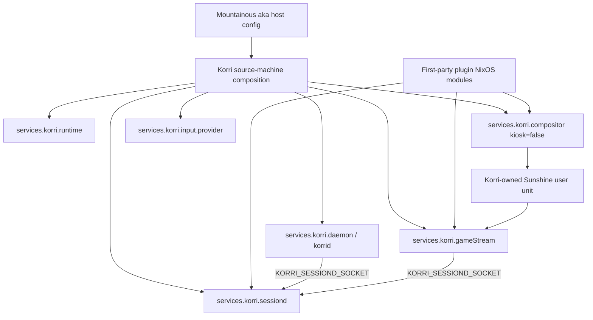
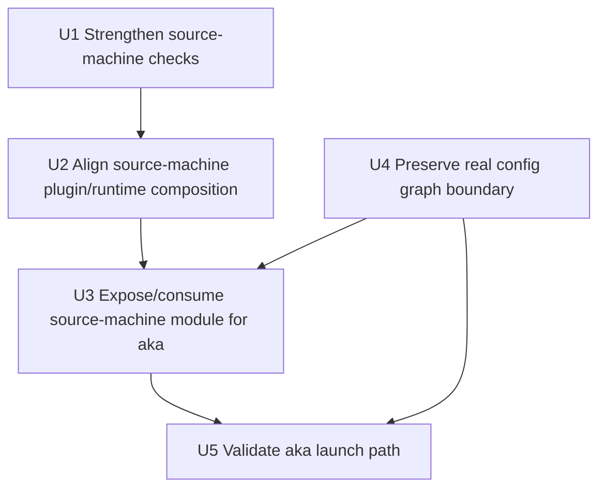
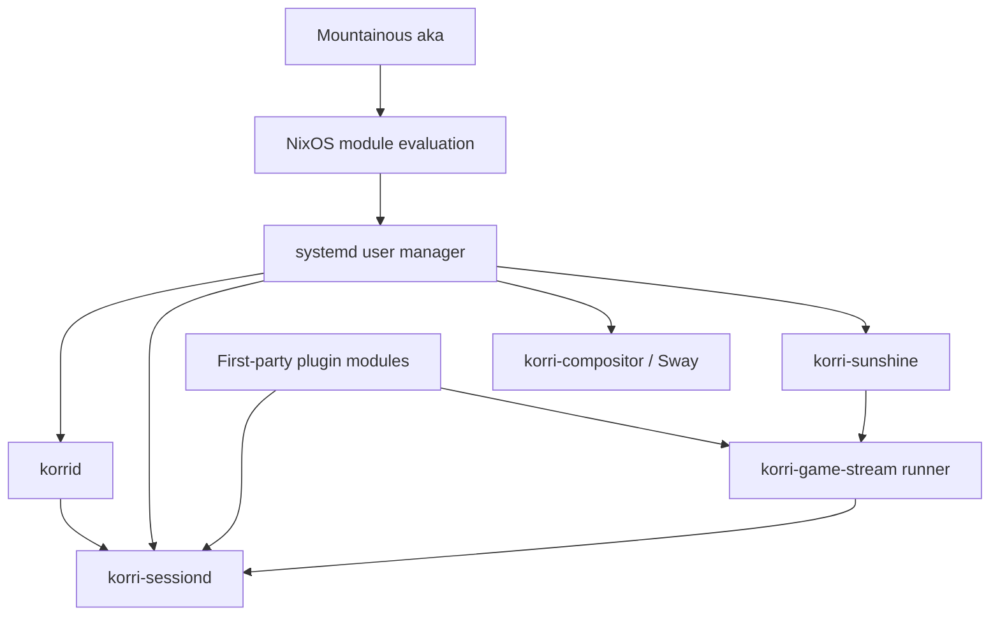

# fix: Align aka with Korri headless stream-host stack

## Summary

Make aka consume the same Korri source-machine launch stack that portable devices use: `korrid` resolves launches, `korri-sessiond` owns foreground lifecycle, the compositor stays alive as the graphical substrate, and Sunshine exposes the remote stream without running a local kiosk GUI. The plan keeps Korri's app-native config graph grounded in its existing readable sections and treats NixOS service wiring as wrapper config, not new Korri YAML schema.

---

## Problem Frame

Aka currently resembles a hand-assembled subset of the portable-device stack. The observed failure (`gamescope` missing from the launching process PATH) is a symptom of the wrong owner spawning foreground processes: `korrid` fell back to an in-process shell launcher instead of delegating to `korri-sessiond`. Portable devices avoid this because their image composition wires sessiond, compositor, game-stream, plugin PATH/env, and daemon delegation together.

The target is not a desktop profile and not a new app-config schema. Aka should be a headless stream host: no local Korri kiosk GUI, but still a real graphical launch substrate for games and Sunshine capture.

---

## Requirements

- R1. Aka must use `simonwjackson` / `users` / `/home/simonwjackson` / `/var/lib/korri` as its Korri runtime identity and state root.
- R2. Launch-capable stream hosts must route product foreground launches through `korri-sessiond`; `korrid` must not be the foreground process owner when sessiond is configured.
- R3. The stream-host stack must include the same core pieces portable devices rely on: daemon, sessiond, compositor substrate, game-stream runner, Sunshine, input provider, and plugin-owned runtime PATH/env.
- R4. Aka must not run the local kiosk renderer or web-surface host as part of the stream-host posture.
- R5. Any NixOS config-shape cleanup must not invent app-native Korri config sections. Generated Korri config must stay within the current readable config graph sections: `host`, `storage`, `providers`, `provider-links`, `systems`, `launchers`, `runtimes`, `profiles`, `collections`, `users`, and `library`.
- R6. Gamescope and other integration-specific runtime contributions must remain plugin-owned composition, not generic daemon/sessiond module policy.
- R7. The plan must leave a clear downstream path for Mountainous aka to consume the canonical Korri stream-host shape without copying the full portable-device image configuration.

---

## Scope Boundaries

- Do not add new Korri app-native YAML sections such as `node`, `stream`, `input`, `surfaces`, or `plugins`.
- Do not introduce a broad `services.korri.role` enum or an aka-specific product role unless implementation proves the existing module-import shape cannot express the host cleanly.
- Do not solve Steam-specific lifecycle hardening in this slice; preserve existing Steam/plugin seams and keep Steam validation as follow-up if Neverball plus one non-Steam Gamescope-wrapped launch succeeds.
- Do not use aka's current Mountainous host config as canonical truth; use Korri's source-machine and portable-device module patterns as the source of truth.
- Do not make the local kiosk GUI run on aka.

### Deferred to Follow-Up Work

- **Full public NixOS facade design:** If the existing source-machine module import still feels too piecemeal after aka is running, shape a separate feature for a typed convenience facade over existing `services.korri.*` modules. That work should remain grounded in NixOS wrapper concerns and the real config graph schema.
- **Steam stream-host validation:** Validate Steamworks-heavy titles through the settled Steam path after the basic native/plugin launch path is healthy.

---

## Context & Research

### Relevant Code and Patterns

- `product/systems/nixos/images/source-machine.nix` already expresses the desired product posture: headless daemon + Sunshine + Sway substrate + sessiond source-machine role + no Korri GUI client.
- `product/systems/nixos/images/kiosk.nix` shows the portable-device wiring pattern where `services.korri.daemon.sessiond.socketPath` and `services.korri.sessiond.socketPath` cannot drift.
- `product/systems/nixos/images/common.nix` is the product-image builder library. Kiosk modules include first-party plugin NixOS modules; source-machine modules currently need review for the same plugin-owned PATH/env composition.
- `product/systems/nixos/modules/korri-daemon.nix` owns `services.korri.config`, `services.korri.daemon`, streaming runtime paths, Sunshine unit integration, and daemon/sessiond env export.
- `product/systems/nixos/modules/korri-sessiond.nix` owns foreground-session supervision, role inference, sessiond PATH/env, and socket IPC.
- `product/systems/nixos/modules/korri-game-stream.nix` owns the Sunshine app runner and exports `KORRI_SESSIOND_SOCKET` when `gameStream.sessiond.socketPath` is set.
- `product/systems/nixos/modules/korri-compositor.nix` owns the Sway/Wayland substrate; `compositor.kiosk.enable = false` is the stream-host/no-local-GUI distinction.
- `product/plugins/gamescope/nix/nixos-module.nix` is the correct seam for adding Gamescope packages to compositor/sessiond/gameStream PATHs.
- `product/platform/library/proseql/library-db-core.ts` and `product/platform/library/proseql/config-graph-db.ts` define the app-native config graph contract; plan work must not add unrelated top-level sections.
- `tools/testing/nix/korri-source-machine-image-check.nix` is the existing Nix eval gate for source-machine invariants.
- `tools/testing/nix/korri-daemon-module-check.nix`, `tools/testing/nix/korri-sessiond-module-check.nix`, and `tools/testing/nix/korri-game-stream-module-check.nix` cover the module-level contracts this work depends on.

### Institutional Learnings

- `docs/solutions/architecture-patterns/boot-scoped-control-plane-with-session-scoped-runner-2026-05-19.md`: headless stream hosts need explicit service-mode/path derivation, tmpfiles ownership, and assertions; `%t`/`%h` guesses are unsafe in system services.
- `docs/solutions/architecture-patterns/sessiond-operator-model-2026-05-29.md`: source-machine sessiond has different readiness vocabulary and lifecycle assumptions than kiosk; one foreground-capable host should have one lifecycle owner.
- `docs/solutions/architecture-patterns/physical-host-foreground-lifecycle-truth-is-sessiond-2026-05-29.md`: sessiond is the source of truth for physical-host foreground lifecycle, while renderer/RPC status consumes projections rather than owning parallel state.
- `docs/solutions/architecture-patterns/kiosk-renderer-ownership-by-sessiond-2026-05-27.md`: sessiond-owned foreground children need explicit PATH and Wayland/session env; compositor-spawned inheritance should not be assumed.
- `docs/solutions/architecture-patterns/gamescope-as-plugin-owned-composition-2026-06-17.md`: generic Korri modules should not name Gamescope policy; Gamescope belongs to plugin-owned composition and `launch.with."@korri:gamescope"` config.
- `docs/solutions/architecture-patterns/architectural-posture-as-nix-image-default-2026-05-27.md`: always-on product posture belongs in image/profile composition, while reusable module defaults stay conservative.

### External References

- NixOS/Home Manager module convention: use typed options for values the module reads at evaluation time; use `settings`/`freeformType` with `pkgs.formats.*` for app-native config content that flows to generated files.
- RFC 42-style module pattern: wrapper concerns (`user`, `group`, `package`, firewall, unit ordering, tmpfiles) should not be mixed with app-native config content.

---

## Key Technical Decisions

- **Use source-machine as the canonical aka posture:** `source-machine.nix` already encodes the desired no-kiosk stream-host composition, so the plan extends and exposes that shape instead of inventing an aka-only role.
- **Keep launch ownership in sessiond:** The functional fix is not adding `gamescope` to `korrid.path`; it is ensuring the daemon, game-stream runner, and sessiond share the same socket delegation contract.
- **Treat local GUI absence separately from graphical substrate:** Aka disables the kiosk/local surface but still runs Sway/Wayland because games and Sunshine need a captureable graphical session.
- **Use plugin-owned PATH/env for Gamescope:** The source-machine composition must import/enable the plugin NixOS modules or downstream hosts must explicitly import them; generic stream-host modules should not hard-code Gamescope behavior.
- **Do not expand Korri app config schema:** Any generated config file/root must use current config graph sections. NixOS service wiring remains `services.korri.*` wrapper configuration.
- **Prefer a module-import/convenience composition before a new option namespace:** The immediate path should make `korri-source-machine` consumable by Mountainous. A richer typed facade is deferred until the existing composition proves insufficient.

---

## Open Questions

### Resolved During Planning

- **Should aka be treated as a desktop machine?** No. It is a headless cloud-gaming stream host with no local kiosk GUI.
- **Should aka run no compositor because it is headless?** No. Headless means no local Korri UI; the graphical launch/capture substrate remains required.
- **Should the launch failure be fixed by putting `gamescope` in `korrid.path`?** No. That preserves the wrong foreground owner.
- **Should the new shape create app-native config sections for node/stream/input/surfaces/plugins?** No. Those were planning sketches and do not match the current config graph contract.

### Deferred to Implementation

- **Exact downstream Mountainous import shape:** Implementation should choose the smallest downstream config that consumes Korri's canonical source-machine module and user overrides. If a clean import is impossible, record the missing export in Korri rather than copying internals into Mountainous.
- **Whether aka's daemon should run in `serviceMode = "system"` immediately:** The module supports it, but the first slice can keep the same user-session lifecycle as the existing source-machine stack only if cold-boot validation proves the user-session stack starts without manual login.
- **Exact live validation game set:** Neverball plus one non-Steam Gamescope-wrapped launch is sufficient for the first stream-host proof; Steam-specific proof should follow separately.

---

## High-Level Technical Design

> *This illustrates the intended approach and is directional guidance for review, not implementation specification. The implementing agent should treat it as context, not code to reproduce.*



---

## Implementation Units



### U1. Strengthen source-machine invariants in Nix checks

**Goal:** Make the desired aka/source-machine posture executable as Nix eval checks before touching downstream host config.

**Requirements:** R2, R3, R4, R6, R7

**Dependencies:** None

**Files:**
- Modify: `tools/testing/nix/korri-source-machine-image-check.nix`
- Modify: `tools/testing/nix/korri-daemon-module-check.nix`
- Modify: `tools/testing/nix/korri-sessiond-module-check.nix`
- Modify: `product/systems/nixos/flake/checks.nix` only if a new check output is introduced
- Test: `tools/testing/nix/korri-source-machine-image-check.nix`
- Test: `tools/testing/nix/korri-daemon-module-check.nix`
- Test: `tools/testing/nix/korri-sessiond-module-check.nix`

**Approach:**
- Extend the existing source-machine check rather than creating an aka-only proof first.
- Assert the three-way socket relationship: `services.korri.sessiond.socketPath`, `services.korri.daemon.sessiond.socketPath`, and `services.korri.gameStream.sessiond.socketPath` must match for a stream-host composition.
- Assert stream-host role posture: compositor enabled, `compositor.kiosk.enable = false`, daemon streaming enabled, input provider enabled, gameStream enabled, and sessiond role resolves to source-machine.
- Assert local kiosk pieces remain off for source-machine composition: client/web-surface host should not become required by stream-host posture.
- Assert plugin-owned runtime PATH contribution if first-party plugin modules are included in the evaluated source-machine image.

**Execution note:** Start with failing Nix eval assertions for the missing/source-machine invariants so implementation cannot accidentally pass by only fixing Mountainous.

**Patterns to follow:**
- `tools/testing/nix/korri-source-machine-image-check.nix` for composed-system assertions.
- `tools/testing/nix/korri-live-usb-config-check.nix` for cross-unit env checks on user services.
- `tools/testing/nix/korri-daemon-module-check.nix` for daemon streaming and service-mode assertions.

**Test scenarios:**
- Happy path: source-machine image has daemon streaming enabled and compositor enabled with kiosk disabled.
- Happy path: daemon, sessiond, and gameStream all share the same sessiond socket path.
- Happy path: source-machine sessiond role resolves to source-machine and is incompatible with kiosk streaming.
- Edge case: disabling local kiosk/client pieces does not disable compositor/sessiond/gameStream.
- Error path: a partial socket wire fails the Nix check rather than falling back to in-process launch.

**Verification:**
- Nix checks describe the stream-host contract clearly enough that a downstream host can be compared against them.

### U2. Align source-machine plugin and runtime composition

**Goal:** Ensure source-machine images receive the same plugin-owned foreground runtime contributions as portable devices, especially packages that foreground children need on PATH.

**Requirements:** R2, R3, R6

**Dependencies:** U1

**Files:**
- Modify: `product/systems/nixos/images/common.nix`
- Modify: `product/systems/nixos/images/source-machine.nix`
- Modify: `product/plugins/gamescope/nix/nixos-module.nix` only if existing plugin PATH contribution is insufficient
- Modify: `tools/testing/nix/korri-source-machine-image-check.nix`
- Test: `tools/testing/nix/korri-source-machine-image-check.nix`

**Approach:**
- Review why `mkKioskModules` receives first-party plugin NixOS modules while `mkSourceMachineModules` does not, and make source-machine composition include the same plugin module list when using Korri's product builder.
- Keep Gamescope-specific packages and env in the Gamescope plugin module; do not add generic Gamescope references to daemon/sessiond/source-machine code.
- Ensure source-machine sessiond and gameStream PATHs receive plugin packages through plugin modules, not through `environment.systemPackages`.
- Ensure the runtime plugin registry is enabled in every process that composes plugin behavior: `korrid`, sessiond foreground children when applicable, and the Sunshine/game-stream runner env. Plugin NixOS modules alone only add packages; they do not prove `KORRI_ENABLED_PLUGINS` is set.
- Ensure source-machine sessiond foreground children receive the Wayland/session identity they need to launch Gamescope and native apps as systemd siblings of Sway, not Sway-spawned descendants.
- Keep base source-machine PATH focused on generic foreground/session tools such as Sway and shell/session utilities.
- If plugin modules assume kiosk-only semantics, split or guard those assumptions so the same plugin module can safely contribute to stream-host source-machine composition.

**Patterns to follow:**
- `product/systems/nixos/images/common.nix` plugin module threading for kiosk images.
- `product/plugins/gamescope/nix/nixos-module.nix` plugin-owned PATH contribution.
- `product/systems/nixos/images/platforms/rocknix-sm8550.nix` for examples of platform/plugin PATH/env additions without changing generic launch composition.

**Test scenarios:**
- Happy path: source-machine image built through Korri's product builder includes the Gamescope plugin package in sessiond/gameStream PATH when the plugin package is available.
- Happy path: source-machine image exports `KORRI_ENABLED_PLUGINS` where plugin registries are constructed, including `@korri:gamescope` for a Gamescope-enabled composition.
- Happy path: source-machine sessiond environment includes the Wayland/session identity required for foreground children to attach to the Sway substrate, or an explicitly tested env-transfer contract replaces static values.
- Happy path: source-machine image still evaluates when no Gamescope plugin package is available or plugin modules are not supplied.
- Edge case: kiosk images keep their existing plugin module behavior after source-machine gets equivalent plugin threading.
- Error path: source-machine launch cannot depend on `/run/current-system/sw/bin/gamescope` being visible to `korrid`.

**Verification:**
- The same product builder mechanism that makes portable devices launch-capable also makes source-machine images launch-capable.

### U3. Expose and consume a canonical source-machine module for aka

**Goal:** Give Mountainous aka a small, idiomatic way to consume Korri's source-machine stack with host-specific runtime identity, instead of copying internal service wiring by hand.

**Requirements:** R1, R2, R3, R4, R7

**Dependencies:** U1, U2, U4

**Files:**
- Modify: `product/systems/nixos/flake/modules.nix`
- Modify: `product/systems/nixos/images/common.nix`
- Modify: `product/systems/nixos/flake/checks.nix` if adding an exported-module eval check
- Test: `tools/testing/nix/korri-source-machine-image-check.nix`
- Downstream modify in repo `mountainous`: `hosts/aka/default.nix`

**Approach:**
- Prefer exposing the existing source-machine composition as a reusable NixOS module over creating a new option namespace.
- Name the export explicitly as a downstream-consumable module, e.g. `inputs.korri.nixosModules.korri-source-machine`, whose imports include the aggregate Korri modules, `korri-sessiond`, source-machine composition, and any stream-host-safe plugin module/id wiring required for plugin PATH/env.
- Keep image-only boot/filesystem defaults out of the exported module so downstream NixOS hosts can import it without becoming a Korri image build.
- The downstream aka host should be mostly host facts: runtime user/group/home/state root, bind/public URL/firewall interface, Sunshine encoder settings, and hardware/pipewire/sway/seatd facts.
- The Korri source-machine import should own daemon/sessiond/gameStream/compositor/input relationships and socket delegation.
- Preserve the user's aka runtime identity explicitly and prove it fans out: runtime, compositor, daemon/systemd user units, sessiond, and gameStream must agree on user `simonwjackson`, group `users`, home `/home/simonwjackson`, state root `/var/lib/korri`, and `createUser = false` unless a unit has a deliberate documented exception.
- Avoid copying `source-machine.nix` internals into Mountainous. If Mountainous cannot import the canonical shape cleanly, fix the Korri export first.

**Technical design:** Directional downstream shape only; implementation should use the final exported module path discovered in U3.

```nix
# repo: mountainous
{
  imports = [ inputs.korri.nixosModules.korri-source-machine ];

  services.korri.runtime = {
    user = "simonwjackson";
    group = "users";
    home = "/home/simonwjackson";
    stateRoot = "/var/lib/korri";
    createUser = false;
  };

  services.korri.daemon = {
    serverId = "aka";
    publicApiBaseUrl = "http://...";
    firewallInterfaces = [ "tailscale0" ];
  };
}
```

**Patterns to follow:**
- `product/systems/nixos/images/common.nix` for product composition modules.
- `product/systems/nixos/flake/modules.nix` for exported downstream-consumable NixOS modules.
- Existing Mountainous host style in repo `mountainous`: `hosts/aka/default.nix`.

**Test scenarios:**
- Happy path: a minimal NixOS eval that imports the source-machine shape plus aka runtime identity produces daemon/sessiond/gameStream/compositor/input services with the correct user/home/state root.
- Happy path: the exported module has no stale `korri` / `/home/korri` compositor or session service paths when aka overrides runtime identity to `simonwjackson`.
- Happy path: downstream aka config no longer needs to set the three sessiond socket options manually.
- Happy path: downstream aka import receives plugin PATH/env composition or explicitly imports the documented plugin module set; an eval check proves Gamescope reaches sessiond and gameStream PATHs for the aka-style configuration.
- Edge case: host-specific Sunshine encoder/settings remain overrideable after importing the source-machine shape.
- Error path: if the downstream config disables sessiond while streaming is enabled, Nix eval fails or the source-machine check catches the invalid posture.

**Verification:**
- Mountainous aka config is smaller and delegates Korri stream-host topology to Korri's canonical source-machine module.

### U4. Keep NixOS wrapper config separate from app-native config graph

**Goal:** Prevent the planned convenience shape from polluting the Korri readable config graph with invented sections while still allowing NixOS to generate valid platform defaults.

**Requirements:** R5, R6

**Dependencies:** None; should be carried through U2 and U3

**Files:**
- Modify: `product/systems/nixos/modules/korri-daemon.nix` only if adding or clarifying generated config/settings options
- Modify: `tools/testing/nix/korri-daemon-module-check.nix`
- Test: `tools/testing/nix/korri-daemon-module-check.nix`

**Approach:**
- Treat `services.korri.runtime`, `daemon`, `sessiond`, `compositor`, `gameStream`, `input`, and `client` as NixOS wrapper/service concerns.
- Treat `services.korri.config.*` and `services.korri.daemon.library.platformDefaults` as the current NixOS-to-config-graph seam.
- Do not add a new operator-facing `settings` escape hatch in this slice. Use the existing `services.korri.config.*` roots and `services.korri.daemon.library.platformDefaults` seam only.
- Prefer documenting the boundary in option descriptions and checks rather than creating a parallel `node/library/launch/stream/input/surfaces/plugins` app config tree.
- Keep `KORRI_ENABLED_PLUGINS` as service/plugin registry environment unless a separate plugin activation feature deliberately moves that into readable config.

**Patterns to follow:**
- `product/systems/nixos/modules/korri-daemon.nix` `platformDefaultsFormat` and generated `platform.korri.yaml` root.
- `product/platform/library/proseql/library-db-core.ts` canonical readable schema.
- `product/platform/library/config/fixtures/steam-full.korri.yaml` for valid config graph examples.

**Test scenarios:**
- Happy path: generated platform defaults still render a valid `*.korri.yaml` fragment with current top-level sections.
- Edge case: service-wrapper options do not appear in generated config graph output.
- Error path: invalid generated app-native sections are rejected by schema validation or Nix eval checks when statically detectable.

**Verification:**
- Plan implementation cannot accidentally ship `node`, `stream`, `input`, `surfaces`, or `plugins` as app-native config graph sections.

### U5. Validate aka launch and service health after downstream switch

**Goal:** Prove aka is actually running the portable-like source-machine stack by launching a native game through Korri and observing sessiond-owned foreground lifecycle.

**Requirements:** R1, R2, R3, R4, R7

**Dependencies:** U2, U3, U4

**Files:**
- Downstream modify in repo `mountainous`: `hosts/aka/default.nix`
- Test expectation: none in Korri repo for the remote manual validation itself; Nix eval checks in U1-U4 cover committed contracts.

**Approach:**
- Rebuild/switch aka after the Mountainous config consumes the canonical Korri source-machine shape.
- Verify Korri service health for the relevant services only: `korri-setup`, `inputplumber`, `seatd`, `korri-session.target`, `korrid`, `korri-compositor`, `korri-sessiond`, and `korri-sunshine`.
- Verify `korrid` has `KORRI_SESSIOND_SOCKET` set and no longer needs `gamescope` on its own PATH for foreground launch ownership.
- Verify `korri-sessiond` and the game-stream wrapper inherit plugin-owned PATH/env that includes the launch runtime packages and enabled plugin ids they need.
- Cold-boot aka and confirm the greetd/PAM user session, `korri-session.target`, `korrid`, `korri-compositor`, `korri-sessiond`, and `korri-sunshine` are available before manual login. If this fails, bring the `daemon.serviceMode = "system"` path into the active fix with absolute runtime paths.
- Launch Neverball through the existing Korri RPC/dry-run path and confirm the foreground process is sessiond-owned rather than a direct `korrid` child.
- Launch one non-Steam Gamescope-wrapped target or fixture so validation exercises the original Gamescope PATH failure mode under sessiond ownership.
- Keep Steam validation as follow-up; do not block the native plus non-Steam Gamescope launch proof on Steam-specific lifecycle work.

**Patterns to follow:**
- `product/systems/nixos/images/source-machine.nix` runtime-dir/status-path/socket conventions.
- `packages/pi-korrid-tools/skills/korrid-tools/SKILL.md` for dry-run and launch RPC usage.
- `docs/solutions/architecture-patterns/physical-host-foreground-lifecycle-truth-is-sessiond-2026-05-29.md` for status/lifecycle interpretation.

**Test scenarios:**
- Integration: dry-run for `nixpkgs-neverball` resolves successfully with the expected release/app identifiers.
- Integration: launch request delegates to sessiond and does not fail with `Executable not found in $PATH: "gamescope"` from `korrid`.
- Integration: a non-Steam Gamescope-wrapped launch resolves and execs Gamescope from the sessiond-owned runtime path.
- Integration: `app.server.status` reports sessiond configured/available for the stream-host path.
- Integration: after a cold boot with no manual login, the user-session Korri stack is available; otherwise the system-mode daemon path is implemented and verified.
- Error path: if sessiond is absent or the socket env is missing, the validation reports the degraded posture instead of trying to patch `korrid.path`.

**Verification:**
- Aka can launch a native game through Korri after rebuild.
- Korri services remain healthy after the launch attempt.
- The launch path proves the invariant: `korrid` coordinates, `sessiond` owns foreground lifecycle.

---

## System-Wide Impact



- **Interaction graph:** Nix module evaluation feeds systemd user services; daemon and game-stream both delegate launches to sessiond; Sunshine captures the compositor session; plugin modules contribute runtime packages/env to foreground paths.
- **Error propagation:** Nix eval checks should catch invalid stream-host posture before deployment. Runtime validation should surface missing sessiond/socket/plugin PATH as degraded launch posture, not as a generic gamescope missing error.
- **State lifecycle risks:** User-session vs system-service lifetime remains a risk for always-on aka. Cold-boot validation is the falsification gate: if the user-session stack does not start before manual login, the implementation must bring `daemon.serviceMode = "system"` into scope with absolute runtime paths.
- **API surface parity:** No RPC contract change is required for the basic fix; `app.server.status`, dry-run, and launch RPCs should continue to work through existing sessiond-aware adapters.
- **Integration coverage:** Nix eval checks prove configuration shape; remote aka launch validation proves the real service/environment path.
- **Unchanged invariants:** Config graph readable schema stays unchanged; Gamescope remains plugin-owned; local kiosk UI remains disabled.

---

## Risks & Dependencies

| Risk | Mitigation |
|------|------------|
| Source-machine composition lacks plugin modules, so sessiond still misses Gamescope | Add/verify plugin module threading for source-machine in U2 and assert PATH contribution in Nix checks. |
| Downstream aka keeps copying internal service toggles and drifts again | Expose/consume a canonical source-machine module in U3 and keep Mountainous config mostly host-specific. |
| New convenience shape invents app config fields that Korri does not read | U4 explicitly gates app-native generated config to current config graph sections. |
| Stream-host boots without a real user-session manager | Require cold-boot validation; if the user-session stack is unavailable before manual login, implement the existing system-mode daemon path with absolute runtime paths. |
| Steam-specific validation distracts from basic launch stack repair | Validate Neverball plus one non-Steam Gamescope-wrapped launch first; track Steamworks-heavy validation as follow-up. |
| Security posture accidentally opens daemon broadly | Preserve host-specific firewall interface scoping and use warnings/assertions around global exposure. |

---

## Documentation / Operational Notes

- Downstream Mountainous should document aka as a Korri source-machine/stream-host consumer, not as a desktop or bespoke daemon composition.
- If implementation adds a new exported module, mention it in the NixOS module export comments so downstream users find the canonical import path.
- Operational validation should use `korri@bandai -p 2222` for portable-device comparisons when live portable behavior is needed; do not use aka's current config as the example of correctness.

---

## Sources & References

- Related code: `product/systems/nixos/images/source-machine.nix`
- Related code: `product/systems/nixos/images/kiosk.nix`
- Related code: `product/systems/nixos/images/common.nix`
- Related code: `product/systems/nixos/modules/korri-daemon.nix`
- Related code: `product/systems/nixos/modules/korri-sessiond.nix`
- Related code: `product/systems/nixos/modules/korri-game-stream.nix`
- Related code: `product/systems/nixos/modules/korri-compositor.nix`
- Related code: `product/plugins/gamescope/nix/nixos-module.nix`
- Related code: `product/platform/library/proseql/library-db-core.ts`
- Related code: `product/platform/library/proseql/config-graph-db.ts`
- Related check: `tools/testing/nix/korri-source-machine-image-check.nix`
- Related check: `tools/testing/nix/korri-daemon-module-check.nix`
- Related check: `tools/testing/nix/korri-sessiond-module-check.nix`
- Related downstream file in repo `mountainous`: `hosts/aka/default.nix`
- Institutional learning: `docs/solutions/architecture-patterns/boot-scoped-control-plane-with-session-scoped-runner-2026-05-19.md`
- Institutional learning: `docs/solutions/architecture-patterns/sessiond-operator-model-2026-05-29.md`
- Institutional learning: `docs/solutions/architecture-patterns/physical-host-foreground-lifecycle-truth-is-sessiond-2026-05-29.md`
- Institutional learning: `docs/solutions/architecture-patterns/gamescope-as-plugin-owned-composition-2026-06-17.md`
