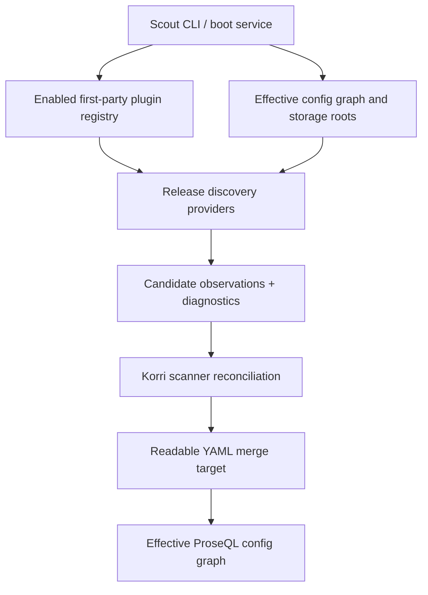

# feat: Add plugin-owned release discovery observations

## Summary

Introduce a plugin-owned release discovery seam where first-party plugins emit candidate observations and Korri reconciles those observations into durable readable-library entries. The first vertical slice moves GBA ROM discovery for RetroArch/mGBA out of Scout's hardcoded classifier while preserving configured scans, boot scans, first-seen metadata, dedupe, identity backfill, and YAML merge behavior.

---

## Problem Frame

Scout currently knows that `.gba` files should become RetroArch/mGBA releases. That couples the generic scanner to one plugin's app/runtime ids and blocks the broader direction where plugins discover content that may not be a file at all. The next slice should make discovery another plugin-owned contribution while keeping Korri's existing reconciliation and persistence path as the canonical library write boundary.

---

## Requirements

- R1. First-party plugins can contribute release discovery providers that are host-invoked and return typed candidate observations rather than durable library records.
- R2. Discovery observations are generic enough to support non-file sources later, while the first implementation supports file-backed observations from configured storage roots.
- R3. RetroArch owns the GBA ROM discovery rule and maps discovered `.gba` files to `@korri:retroarch/retroarch` plus `@korri:retroarch/mgba`; generic platform scanner code must no longer hardcode those ids.
- R4. Korri keeps ownership of reconciliation and persistence: duplicate suppression, resolved-path/hash dedupe, identity backfill, `target.discovery.first-seen-at`, deterministic YAML rendering, and additive merge semantics remain in the existing scanner/reconciler layer.
- R5. Manual explicit-root scans and configured boot scans continue to work through the same discovery/reconciliation semantics.
- R6. Plugin enablement is honored: disabled or absent discovery providers do not emit launchable candidates, and operator reports make unclaimed files diagnosable rather than silently pretending they were scanned successfully.
- R7. Existing operator diagnostics for excluded files, ambiguous file names, unsupported known systems, missing storage roots, and scan failures do not regress.
- R8. The first slice stays first-party only and does not introduce a third-party plugin runtime, marketplace, async background scanner, UI review surface, or stale-entry cleanup.

---

## Scope Boundaries

- No third-party/user-installed discovery plugins or plugin sandboxing.
- No Steam, itch.io, PortMaster, GMLoader, Ryubing, or catalog-provider discovery implementation in this slice.
- No durable schema addition for plugin attribution under `target.discovery`; preserve `first-seen-at` only.
- No replacement of readable YAML/ProseQL persistence with direct plugin writes.
- No automatic deletion, missing-file reconciliation, stale cleanup, or UI for approving observations.
- No broad RetroArch plugin boundary refactor beyond the discovery contribution needed here.

### Deferred to Follow-Up Work

- Add non-file discovery providers such as Steam installed app manifests, acquired itch.io payloads, or PortMaster/GMLoader install manifests.
- Decide whether unsupported-system diagnostics should eventually become plugin-owned capability metadata instead of a central diagnostic fallback.
- Add richer discovery provenance or review tooling if operators need to inspect which plugin classified an existing entry.
- Consider async/content-sniffing discovery providers once a second plugin needs them; the first slice should keep provider execution bounded and deterministic.

---

## Context & Research

### Relevant Code and Patterns

- `product/platform/library/discovery/rom-scan-classifier.ts` currently hardcodes GBA classification and RetroArch/mGBA ids; this is the coupling to remove.
- `product/platform/library/discovery/release-candidate-scan.ts` owns file enumeration, configured storage scans, candidate reconciliation, identity backfill, and YAML merge. Preserve these outcomes while changing how candidates are discovered.
- `product/platform/library/content-identity/release-content-identity.ts` provides the existing SHA-256 identity resolver used by scanner dedupe/backfill.
- `product/surfaces/terminal/korri-cli/scout-command.ts` is the manual/configured Scout CLI entry point and already passes config roots/find binary into the scanner.
- `product/platform/plugin/index.ts` and `product/platform/plugin/registry.ts` define first-party plugin descriptors, config contributions, handlers, registry enablement, and `KORRI_ENABLED_PLUGINS` parsing patterns.
- `product/plugins/retroarch/src/plugin.ts` already exports the stable RetroArch app/runtime/system ids and contributes the mGBA runtime supporting GBA.
- `product/plugins/index.ts` and `product/plugins/index.test.ts` are the first-party plugin registry and enablement test surface.
- `product/plugins/AGENTS.md` defines first-party plugin authoring rules: descriptor in `src/plugin.ts`, thin `index.ts`, stable plugin ids, config contributions for declarative records, handlers/callable behavior behind host-owned seams.
- `product/systems/nixos/modules/korri-daemon.nix` emits the boot `korri scout scan configured` service; image/module checks should prove the service receives plugin enablement where boot discovery depends on plugins.

### Institutional Learnings

- `docs/solutions/architecture-patterns/korri-plugin-architecture-2026-06-02.md`: plugin discovery should follow the `ContentSource` idea — plugins contribute data/actions behind host seams, not presentation or direct library writes.
- `docs/solutions/design-patterns/explicit-cascade-folded-policy-over-incidental-signal-heuristics-2026-05-27.md`: the component that owns a fact should declare it explicitly; delete old heuristics when the explicit policy lands.
- `docs/solutions/best-practices/proseql-canonical-library-with-derived-yaml-ids-2026-05-06.md`: external discovery behaves like an importer; Korri-owned ProseQL/readable YAML remains canonical.
- `docs/solutions/design-patterns/constrained-llm-entrypoint-classification-2026-05-24.md`: keep deterministic scan, typed classification/observation, and deterministic writer boundaries separate.

### External References

- External research skipped: the repo has strong local plugin, scanner, config graph, and boot-service patterns for this work.

---

## Key Technical Decisions

- Add discovery as a descriptor-level plugin contribution (`contributes.discovery`) rather than a side-car factory registry: discovery is a first-class plugin capability like config and handlers, and enabled-plugin registry aggregation should be the only path by which generic scanner code sees providers.
- Use typed discovery-provider contributions rather than letting plugins write library records: plugins own discovery knowledge; Korri owns reconciliation, persistence, and durable schema safety.
- Model provider output as candidate observations, not final YAML: observations can represent file and later non-file discoveries without bypassing duplicate handling or first-seen semantics.
- Discovery observations must not carry timestamps: the scanner applies its single scan `firstSeenAt` value during candidate-record creation so plugins cannot overwrite or drift `target.discovery.first-seen-at`.
- Invoke discovery through enabled first-party plugin registry composition: plugin enablement should affect discovery the same way it affects launch integrations, catalog contributions, and runtime resources.
- For the first file-backed slice, keep filesystem traversal owned by the scanner: Korri enumerates normalized file descriptors once per storage and providers classify those descriptors. Root-level provider enumeration and plugin-owned state inspection are deferred to later non-file providers.
- Normalize provider observations before reconciliation: group by normalized locator, drop same-provider duplicates deterministically, and report cross-provider conflicts before any candidate reaches the claimed index or YAML renderer. This is a minimal safety invariant to avoid duplicate writes, not a full multi-provider priority policy.
- Preserve central scanner diagnostics for exclusions, ambiguous paths, and known-but-unsupported systems in the first slice: those are operator reporting behavior, and moving them to plugins is a separate design decision.
- When provider observations are active, provider-claimed files bypass the legacy launchable-candidate branch; the old `.gba` candidate heuristic becomes dead code before it is deleted, avoiding a dual-candidate window.
- Treat provider conflicts as diagnostics in v1 rather than silently picking a winner: if two enabled providers emit launchable observations for the same file locator, reconciliation should surface the conflict and avoid creating duplicate entries until a priority/multi-release policy is designed.

---

## Open Questions

### Resolved During Planning

- Should plugins own final library records? No. Plugins emit candidate observations; Korri reconciles and persists.
- What first provider should prove the seam? RetroArch/mGBA GBA ROM discovery.
- Should the contract be designed only for files? No. The observation contract should allow future non-file discoveries, even though the first provider uses configured storage files.
- Should the first slice add plugin attribution to `target.discovery`? No. Preserve existing locator observation metadata and defer classifier provenance.

### Deferred to Implementation

- Exact type and helper names for discovery providers, observation tags, and scanner adapters: choose names that fit nearby `product/platform/plugin` and `product/platform/library/discovery` style.
- Whether old `rom-scan-classifier.ts` becomes a generic file-diagnostic helper or is split into smaller modules: decide while preserving tests and avoiding bonus refactors.

---

## Output Structure

```text
product/platform/plugin/
  discovery.ts              # new host-owned discovery provider and observation contracts
  discovery.test.ts          # new contract/registry tests for discovery providers
product/platform/library/discovery/
  discovery-observation-adapter.ts   # new observation normalization/adapter seam if not folded into release-candidate-scan.ts
product/plugins/retroarch/src/
  discovery.ts              # new RetroArch-owned GBA discovery provider
  discovery.test.ts          # new RetroArch discovery behavior tests
```

This structure is a scope declaration, not a constraint for helper placement. The standalone discovery contract test is expected because it is part of the verification surface.

---

## High-Level Technical Design

> *This illustrates the intended approach and is directional guidance for review, not implementation specification. The implementing agent should treat it as context, not code to reproduce.*



The important boundary is that providers stop at observations. They may enumerate files through host utilities or inspect plugin-owned state later, but they do not mutate readable YAML and do not decide whether an existing authored entry should be overwritten.

---

## Implementation Units

### U1. Add the release discovery provider contract

**Goal:** Define the host-owned contract for plugin discovery providers and make enabled providers discoverable from the plugin registry.

**Requirements:** R1, R2, R6, R8

**Dependencies:** None

**Files:**
- Create: `product/platform/plugin/discovery.ts`
- Modify: `product/platform/plugin/index.ts`
- Modify: `product/platform/plugin/registry.ts`
- Test: `product/platform/plugin/registry.test.ts`
- Test: `product/platform/plugin/discovery.test.ts`

**Approach:**
- Add a typed `contributes.discovery` release-provider contribution, separate from static config records, generic handlers, and durable catalog/library entries.
- Model observations with provider identity, confidence, target evidence, suggested system/app/runtime, and enough locator data for Korri to render a file-backed release when appropriate.
- Keep the observation contract open enough for future non-file targets, but require the file-backed variant to carry storage/path data that existing reconciliation can index.
- Explicitly exclude temporal metadata from observations; first-seen timing belongs to the scanner invocation, not to plugin output.
- Extend registry aggregation so only enabled plugins contribute discovery providers, matching existing `KORRI_ENABLED_PLUGINS` semantics.
- Treat duplicate provider ids or malformed provider contributions as registry/contract diagnostics, not scanner-local surprises.

**Patterns to follow:**
- `product/platform/plugin/index.ts` plugin contribution and handler contract style.
- `product/platform/plugin/registry.ts` enabled-plugin aggregation and config-map namespacing.
- `product/plugins/AGENTS.md` handler/contribution guidance.

**Test scenarios:**
- Happy path: an enabled plugin with one release discovery provider appears in the registry discovery provider list with its plugin id attached.
- Happy path: a provider observation omits temporal metadata and later receives the scanner-supplied `firstSeenAt` value only when converted to a candidate record.
- Edge case: a registered but disabled plugin contributes no discovery providers.
- Edge case: enabled-plugin auto-requirement expansion still applies before discovery providers are collected.
- Error path: duplicate provider identity or invalid provider shape fails clearly through the registry/contract layer.
- Integration: existing config contributions and handlers remain unchanged when a plugin also contributes discovery.

**Verification:**
- Plugin registry consumers can enumerate enabled release discovery providers without knowing about RetroArch or mGBA.

---

### U2. Bridge discovery observations into scanner reconciliation

**Goal:** Replace direct hardcoded path classification in the scanner with provider observations while preserving dedupe, backfill, first-seen, and merge outcomes.

**Requirements:** R2, R4, R5, R6, R7

**Dependencies:** U1

**Files:**
- Create: `product/platform/library/discovery/discovery-observation-adapter.ts` if the adapter is not kept small enough to fold into `release-candidate-scan.ts`
- Modify: `product/platform/library/discovery/release-candidate-scan.ts`
- Modify: `product/platform/library/discovery/rom-scan-classifier.ts`
- Test: `product/platform/library/discovery/release-candidate-scan.test.ts`

**Approach:**
- Add a scanner API surface that accepts enabled release discovery providers and invokes them for the scan scope before legacy diagnostic classification.
- Keep filesystem traversal scanner-owned in this slice: enumerate each storage once into normalized file descriptors, pass those descriptors with storage/root context to providers, treat an empty descriptor set as a successful empty provider input, and report provider exceptions per provider/storage.
- Generalize the internal candidate shape so provider observations can supply system/app/runtime ids beyond the old GBA-only literal types while preserving the current GBA YAML output.
- Add an observation adapter that validates provider observations, converts valid file-backed observations into the candidate model, and reports malformed observations as per-observation diagnostics rather than whole-scan failures.
- Normalize observations before reconciliation: group by normalized locator, deterministically drop same-provider duplicates, and report cross-provider conflicts before any candidate reaches `ClaimedContentIndex` or YAML rendering.
- Keep existing `ClaimedContentIndex`, identity backfill, overlap warnings, and YAML merge code as the persistence boundary.
- Preserve central file diagnostics for excluded paths, ambiguous file signals, and known unsupported systems; candidate ownership moves to plugins, but operator diagnostics should not regress.
- Add `unclaimed` and `conflicting` counters additively to `RomScanReport`; do not rename or remove existing counters such as `files`, `candidates`, `excluded`, `unsupported`, `ignored`, `ambiguous`, or `deduplicated`.
- When providers emit observations for a file, bypass the legacy launchable-candidate branch for that file. Paths with no provider observations must use diagnostic-only classification so a disabled RetroArch provider cannot fall back to the old GBA launchable candidate path.
- Leave physical deletion of the hardcoded `.gba → RetroArch/mGBA` branch to U5 after the provider path and CLI/boot wiring make it dead code.

**Execution note:** Add characterization coverage around existing scanner report counts and generated YAML before deleting the hardcoded GBA branch.

**Patterns to follow:**
- `RomScanReport` and bounded `samples` reporting in `release-candidate-scan.ts`.
- `reconcileRomCandidates` and `mergeReleaseCandidateConfig` as the unchanged reconciliation/write boundary.
- Existing configured-scan tests that use real temp directories and real YAML fixtures.

**Test scenarios:**
- Happy path: a file-backed provider observation for `gba/Metroid Fusion.gba` produces the same generated readable-library release shape as the old scanner path, including release id `gba`, system `gba`, and scanner-owned `target.discovery.first-seen-at`.
- Happy path: an authored same-path entry is deduplicated and identity-backfilled when the provider emits a matching observation.
- Happy path: overlapping configured storages still warn and suppress same-run duplicates after provider observations are merged into the claimed index.
- Edge case: no enabled providers claim a `.gba` file; the scan increments `unclaimed`, reports an unclaimed/non-candidate reason, and writes no launchable library entry.
- Edge case: the same provider emits duplicate observations for one normalized file locator; the scan keeps one deterministic candidate, records the discarded duplicate in samples, and writes only one YAML entry.
- Edge case: two enabled providers emit conflicting launchable observations for the same file locator; the scan increments `conflicting`, reports the conflict, writes neither provider's candidate to YAML, and does not add either to the in-memory claimed index.
- Edge case: a provider observation matches an existing release but the target config path is outside effective config roots; identity backfill is skipped and reported through `identityBackfillSkipped`, not written unsafely.
- Error path: one provider emits an observation whose derived library record fails schema validation; that observation is excluded from YAML and reported as a diagnostic while other valid observations proceed.
- Error path: one provider fails for a storage root; the configured scan records that provider/storage failure and continues other providers or storages without corrupting the claimed index.
- Integration: existing unsupported, excluded, ambiguous, and ignored file diagnostics remain stable for non-GBA fixtures.

**Verification:**
- The scanner no longer needs RetroArch/mGBA constants to produce or reconcile release candidates.

---

### U3. Add RetroArch/mGBA release discovery provider

**Goal:** Move GBA ROM discovery into the RetroArch plugin using the plugin's own app/runtime/system ids.

**Requirements:** R1, R3, R5, R6

**Dependencies:** U1, U2

**Files:**
- Create: `product/plugins/retroarch/src/discovery.ts`
- Create: `product/plugins/retroarch/src/discovery.test.ts`
- Modify: `product/plugins/retroarch/src/plugin.ts`
- Modify: `product/plugins/retroarch/index.ts`
- Test: `product/plugins/retroarch/src/plugin.test.ts`
- Test: `product/plugins/index.test.ts`

**Approach:**
- Implement a RetroArch-owned release discovery provider that claims high-confidence `.gba` file targets and emits observations pointing to the existing RetroArch app id, GBA system id, and mGBA runtime id.
- Consume scanner-supplied normalized file descriptors rather than reimplementing `find` logic inside the plugin.
- Keep the provider pure and bounded for the first slice: no filesystem traversal ownership, no content hashing, no title database lookup, no art scraping, no provider-supplied timestamps, and no runtime probing.
- Register the provider on the RetroArch plugin descriptor so enablement follows `@korri:retroarch`.
- Land the scanner adapter and RetroArch provider as one behavioral cutover: provider-claimed GBA files must not also pass through the old platform-owned GBA candidate branch.

**Patterns to follow:**
- `product/plugins/retroarch/src/plugin.ts` constant export and descriptor style.
- `product/plugins/index.test.ts` enabled-plugin contribution assertions.
- `product/plugins/AGENTS.md` standard plugin file layout.

**Test scenarios:**
- Happy path: with `@korri:retroarch` enabled, the provider emits one high-confidence observation for `gba/Wario Land 4.gba` using `@korri:retroarch/retroarch` and `@korri:retroarch/mgba`.
- Happy path: filenames with title decorations still produce observations whose title/input evidence lets the existing candidate renderer derive the same title as before.
- Edge case: `.gb`, `.gbc`, `.zip`, save files, image files, and BIOS/saves/media paths are not claimed by the mGBA provider in this slice.
- Edge case: uppercase or mixed-case `.GBA` extension handling matches the old scanner behavior.
- Error path: unreadable or missing storage roots are reported by the host scan layer rather than by a RetroArch-specific failure path.
- Integration: first-party plugin registry exposes the RetroArch provider only when `KORRI_ENABLED_PLUGINS` includes `@korri:retroarch`.

**Verification:**
- All RetroArch/mGBA discovery knowledge lives under `product/plugins/retroarch/`, not in generic platform scanner code.

---

### U4. Wire Scout CLI and configured scans through enabled plugin providers

**Goal:** Ensure manual scans, configured scans, and the boot service all use the enabled first-party plugin discovery registry.

**Requirements:** R5, R6, R7

**Dependencies:** U1, U2, U3

**Files:**
- Modify: `product/surfaces/terminal/korri-cli/scout-command.ts`
- Test: `product/surfaces/terminal/korri-cli/korri-cli.test.ts`
- Modify: `product/systems/nixos/modules/korri-daemon.nix`
- Modify: `product/systems/nixos/images/platforms/rocknix-sm8550.nix`
- Test: `tools/testing/nix/korri-rocknix-sm8550-config-check.nix`
- Test: `tools/testing/nix/korri-daemon-module-check.nix`

**Approach:**
- Construct the first-party plugin registry for Scout from the same environment convention used by other CLI/runtime surfaces.
- Pass enabled discovery providers into both explicit-root and configured-storage scan paths so CLI behavior and boot behavior cannot diverge.
- Keep explicit-root scanning supported: if the operator does not enable RetroArch, the command should report unclaimed GBA files rather than falling back to hardcoded RetroArch behavior.
- Add a narrow boot-scan environment seam, such as `services.korri.scout.releaseScan.extraEnvironment`, so product images can pass `KORRI_ENABLED_PLUGINS` into the system-level Scout oneshot without coupling generic daemon code to RetroArch.
- Ensure SM8550's release-scan composition passes its existing enabled first-party plugin list to that boot-scan environment.
- Add Nix/module assertions only for environment propagation and service composition; do not move plugin discovery policy into Nix.

**Patterns to follow:**
- `product/surfaces/terminal/korri-cli/korri-cli.ts` plugin registry construction from environment.
- `tools/testing/nix/korri-rocknix-sm8550-config-check.nix` existing `KORRI_ENABLED_PLUGINS` assertions.
- Existing `scout scan releases` and `scout scan configured` tests in `product/surfaces/terminal/korri-cli/korri-cli.test.ts`.

**Test scenarios:**
- Happy path: `scout scan releases` with `KORRI_ENABLED_PLUGINS=@korri:retroarch` writes a GBA candidate using the RetroArch provider.
- Happy path: `scout scan configured` with RetroArch enabled scans configured storage roots and preserves existing merge/dedupe counters.
- Edge case: `scout scan releases` without RetroArch enabled reports unclaimed GBA input and writes no candidate.
- Error path: invalid or unknown plugin ids in `KORRI_ENABLED_PLUGINS` do not crash Scout; they follow existing registry parsing behavior and leave providers absent.
- Integration: the SM8550 composed config exposes `KORRI_ENABLED_PLUGINS` to the boot release scan service when release scanning is enabled.
- Integration: a generated GBA entry from the RetroArch provider can be loaded through the config graph and dry-run launch resolution still selects RetroArch/mGBA.

**Verification:**
- Manual and boot scan entry points share the same plugin-provider discovery path.

---

### U5. Remove the platform-owned GBA candidate heuristic

**Goal:** Delete the old scanner-owned `.gba` launchable-candidate path and leave only generic file diagnostics in platform discovery code.

**Requirements:** R3, R7, R8

**Dependencies:** U2, U3, U4

**Files:**
- Modify: `product/platform/library/discovery/rom-scan-classifier.ts`
- Test: `product/platform/library/discovery/release-candidate-scan.test.ts`
- Test: `product/plugins/retroarch/src/discovery.test.ts`

**Approach:**
- Remove private RetroArch/mGBA constants from platform discovery code.
- Move GBA launchable candidate assertions out of platform classifier tests and into RetroArch discovery tests.
- Keep only generic classification/diagnostic helpers in platform code where they are still needed for exclusions, ambiguity, unsupported known systems, and report samples.
- Make sure there is no fallback that can emit a GBA launchable candidate when RetroArch is disabled.

**Execution note:** Treat this as cleanup after U2/U3's behavioral cutover: provider-claimed GBA files should already bypass the legacy candidate branch before this unit deletes the dead heuristic.

**Patterns to follow:**
- The prior scanner dedupe work's approach of preserving report shape while changing candidate acceptance semantics.
- The explicit-policy learning: delete the heuristic once the declared provider exists.

**Test scenarios:**
- Happy path: platform scanner tests no longer import or assert RetroArch/mGBA ids directly.
- Edge case: with no discovery providers, `.gba` does not become a launchable candidate.
- Edge case: unsupported non-GBA systems still produce the same operator diagnostics as before.
- Integration: with RetroArch provider enabled, end-to-end generated YAML remains equivalent to the pre-refactor GBA output aside from any additive report fields.

**Verification:**
- Searching generic platform scanner code for RetroArch/mGBA ids finds no hardcoded discovery path.

---

### U6. Document the discovery-provider authoring boundary

**Goal:** Capture the new discovery contribution rules where future plugin authors will find them.

**Requirements:** R1, R2, R6, R8

**Dependencies:** U1, U3, U5

**Files:**
- Modify: `product/plugins/AGENTS.md`
- Modify: `product/plugins/retroarch/README.md` if present, otherwise no plugin README change is required
- Test expectation: none -- documentation-only guidance; behavior is covered by U1-U5 tests.

**Approach:**
- Add concise plugin-authoring guidance for release discovery providers: observations not writes, host-owned reconciliation, first-party only, stable provider ids, bounded execution, and file-backed first-slice constraints.
- Document that future non-file providers should still emit observations and should not mutate readable YAML directly.
- Avoid promising third-party plugin support or marketplace semantics.

**Patterns to follow:**
- Existing `product/plugins/AGENTS.md` sections for config contributions, handlers, registration, and resource ownership.

**Test scenarios:**
- Test expectation: none -- documentation-only guidance; implementation behavior is verified in the plugin and scanner test suites.

**Verification:**
- A plugin author reading the guide can tell where discovery providers live, what they may emit, and which layer owns persistence.

---

## System-Wide Impact

- **Interaction graph:** Scout CLI and boot scan now invoke enabled plugin discovery providers before the existing scanner reconciliation/write path. RetroArch becomes the first provider; the scanner remains the canonical reconciler.
- **Error propagation:** Provider failures should be scoped to provider/storage results and surfaced in scan reports without corrupting YAML merges or stopping unrelated storages/providers unnecessarily.
- **State lifecycle risks:** Persistence remains merge-only readable YAML with existing atomic writes. Provider observations are transient and should not outlive the scan unless reconciled into config.
- **API surface parity:** Manual explicit-root scans, configured scans, and boot scans must all accept the same provider registry/input semantics.
- **Integration coverage:** End-to-end tests need real temp storage roots, enabled plugin registry setup, generated YAML assertions, and config-graph launch-resolution smoke to prove the seam.
- **Unchanged invariants:** Removable config roots remain restricted; plugins do not gain authority to contribute executable config from untrusted card roots. Existing authored entries are not overwritten by rediscovery.

---

## Risks & Dependencies

| Risk | Mitigation |
|------|------------|
| Provider contract is too file-specific and blocks future non-file discovery | Model observations generically, with file-backed observations as the first variant rather than the whole contract. |
| Scanner silently stops finding GBA files when RetroArch is not enabled in a boot environment | Wire `KORRI_ENABLED_PLUGINS` into Scout entry points and the boot-scan service environment; add CLI/Nix tests for enabled and disabled compositions. |
| Two providers claim the same file and create duplicate entries | Normalize observations by locator before reconciliation; conflict groups write no candidates and cannot update the claimed index. |
| One provider emits duplicate same-locator observations within a storage scan | Deduplicate same-provider observations before candidate rendering so `uniqueId` suffixing cannot turn duplicates into multiple YAML entries. |
| Malformed provider output aborts a whole scan | Validate each observation before candidate rendering and report per-observation diagnostics while continuing valid observations. |
| Provider timestamps corrupt first-seen semantics | Prohibit temporal metadata in observations; scanner-owned `firstSeenAt` remains the only timestamp used for new candidate records. |
| Deleting the old classifier regresses operator diagnostics for unsupported files | Preserve central diagnostic-only classification for exclusions, ambiguity, and known unsupported systems until a separate plan moves that metadata. |
| Plugin observations bypass authored metadata preservation | Keep all writes inside `mergeReleaseCandidateConfig` and existing reconciliation/backfill code. |
| Platform code imports product plugin modules directly | Pass providers through registry composition; generic platform modules depend on plugin contracts, not `product/plugins/retroarch`. |

---

## Documentation / Operational Notes

- Product images that expect GBA boot scanning must enable `@korri:retroarch` in the runtime environment that invokes Scout.
- Operators running Scout manually without RetroArch enabled should expect unclaimed-file diagnostics instead of generated GBA entries.
- Existing generated entries remain valid because the new provider uses the same stable RetroArch app/runtime/system ids.

---

## Sources & References

- Related requirements: `work/items/active/01KV8NZRAAETDX69P5T73BRVY8-first-party-plugin-system-shape/requirements.md`
- Related plan: `work/items/active/01KW5XFTPQBKCJB56QSZF4FXNN-rom-yaml-candidate-generator/plan.md`
- Related plan: `work/items/active/01KWCX54434N0MSHMHWN6FHD37-deduplicate-scanner-candidates/plan.md`
- Related code: `product/platform/library/discovery/rom-scan-classifier.ts`
- Related code: `product/platform/library/discovery/release-candidate-scan.ts`
- Related code: `product/platform/plugin/index.ts`
- Related code: `product/platform/plugin/registry.ts`
- Related code: `product/plugins/retroarch/src/plugin.ts`
- Related guide: `product/plugins/AGENTS.md`
- Institutional learning: `docs/solutions/architecture-patterns/korri-plugin-architecture-2026-06-02.md`
- Institutional learning: `docs/solutions/design-patterns/explicit-cascade-folded-policy-over-incidental-signal-heuristics-2026-05-27.md`
- Institutional learning: `docs/solutions/best-practices/proseql-canonical-library-with-derived-yaml-ids-2026-05-06.md`
