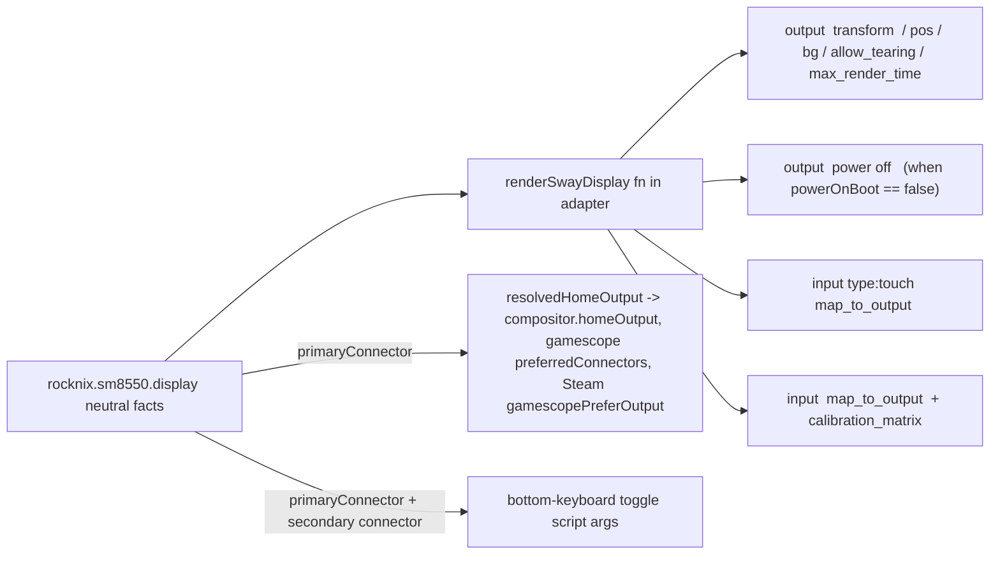

<!--
EXECUTION NOTE (2026-07-03, se-work): Landed trunk-based on both repos.
- nix-on-rocks main d56e2ef: additive neutral display facts (rocknix.device.display.*). preflight green.
- korri trunk 8c6a0421: renders 100% of SM8550 Sway from the neutral facts; drives
  gamescope/Steam output from primaryConnector (fixes a real Odin DSI-2->DSI-1 bug);
  bottom-keyboard toggle + power-off routed through facts; config-check corrected.
  fallow + rocknix-product-payload (real aarch64 thor+odin image builds) green.
Deviations from plan:
- Stage 1 (homeOutput, c65487ba) was NEVER on the shared trunk (lived only on a diverged
  local branch); origin/trunk had a different fix. So U5's hasInfix bridge did not exist to
  delete — instead output selection was driven from the neutral primaryConnector.
- U8/U9 (remove swayDeviceConfig + 2nd bump) DESCOPED: swayDeviceConfig has other in-substrate
  consumers (main-space.nix fallback session, RK3326/RK3566 devices, contract tests), so full
  removal is a substrate-internal migration. Backlogged as 01KWMRR119F9RSC34SCAETEM6C.
- Pre-existing/unrelated: desktop-stage1/stage2 CI is red on trunk due to a stale korri-desktop
  package reference (flake only exposes korri-desktop-lab-system); not caused by this work.
- Pre-existing config-check tailnet MagicDNS failures remain (backlog 01KWMKCN05K84K9PCYJM4SC59T).
-->

# refactor: retire swayDeviceConfig — substrate exposes neutral display facts, Korri renders all Sway

## Summary

Replace the last Sway leak in the ROCKNIX substrate. Today each nix-on-rocks SM8550 deviceProfile exposes `display.swayDeviceConfig` — a literal Sway directive string that Korri splices verbatim and string-parses (`lib.hasInfix "DSI-2" …`) to recover structured facts. This plan mirrors the already-correct video/audio pattern: nix-on-rocks exposes **neutral** structured display facts (primary connector, per-connector rotation/position/power, touch→connector mapping), Korri renders 100% of the Sway itself, and the `resolvedHomeOutput` inference bridge is deleted. Cross-repo, expand→migrate→contract across nix-on-rocks and korri.

---

## Problem Frame

The substrate must not know Korri runs Sway. Video already does this right (`rocknix.sm8550.video.decodeBackend`), audio too (`rocknix.device.audio.route.*` + `rocknix.sm8550.audio.api`). Display is the odd one out: it ships Korri's compositor implementation detail (Sway syntax) as a substrate option, and forces Korri to parse that blob to recover a connector name for lane pinning, gamescope preferred output, and Steam output selection. This leak also produced latent per-device bugs — the Thor-shaped `output DSI-1 power off` and the bottom-keyboard toggle hardcode DSI-1/DSI-2 in ways that are wrong or luck-dependent on single-panel Odin. See origin item for the full Stage 1 context (`item.md`); Stage 1 landed on korri trunk commit `c65487ba`.

---

## Requirements

- R1. nix-on-rocks SM8550 deviceProfiles expose structured, **Sway-free** display facts: primary connector, per-connector rotation, per-connector position/enable/power-at-boot, and touch→connector mapping (including per-device touch match names and calibration matrices).
- R2. Korri renders all Sway output/transform/touch/power directives from those neutral facts; no korri file consumes a Sway string from the substrate.
- R3. The `resolvedHomeOutput` `hasInfix` inference in `rocknix-sm8550.nix` is deleted; `homeOutput` derives from the neutral primary connector.
- R4. `swayDeviceConfig` is removed from nix-on-rocks once no korri consumer references it.
- R5. The by-compatible SM8550 image renders correct per-device Sway without string inference.
- R6. The sm8550 config-check no longer asserts Thor's DSI-1 transform for Odin; per-device rotation is locked from the neutral facts, and the pre-existing Odin rotation mislabel is corrected.
- R7. The two Thor-shaped latent bugs (bottom-keyboard toggle connector literals; `output DSI-1 power off` inference) are routed through the neutral facts.

**Origin actors:** substrate maintainer (nix-on-rocks), Korri platform adapter, Korri compositor module.
**Origin flows:** device boots → compositor renders per-device Sway from neutral facts → primary panel lands on hub lane; Bandai bottom-screen toggle; Moonlight/Steam/gamescope output selection.

---

## Scope Boundaries

- Not changing rk3566 / rk3326 display handling — those adapters do not consume `swayDeviceConfig` and take `homeOutput ? null` unused. Leave them alone.
- Not adding runtime (hot-plug) display reconfiguration — this is boot-time declarative Sway rendering only, same as today.
- Not redesigning the audio/video neutral fact surfaces — display mirrors their established shape, it does not refactor them.
- Not changing the compositor lane-pin mechanism (`homeWorkspacePins` in `korri-compositor.nix`) — only its input source (`homeOutput`) changes provenance.

### Deferred to Follow-Up Work

- The two pre-existing **tailnet MagicDNS** config-check failures on trunk are unrelated to display and are out of scope here. Captured to the backlog so the SM8550 check can eventually go fully green; this plan only requires that no *new* failures are introduced and that the display/rotation assertions pass. (See Open Questions.)

---

## Context & Research

### Relevant Code and Patterns

- **The pattern to mirror (audio):** `nix-on-rocks:guest/modules/device-interface.nix` declares neutral `rocknix.device.audio.route.*` with a `kind` enum; `nix-on-rocks:guest/modules/chipsets/sm8550/audio.nix` + `default.nix` bridge measured Thor defaults via `mkDefault`; `odin2portal.nix` overrides only the measured differences; korri reads `config.rocknix.sm8550.audio.api` / `config.rocknix.device.audio.route` in `rocknix-sm8550.nix`. Display should copy this shape exactly.
- **Video precedent:** `sm8550.video.decodeBackend` — a single neutral enum consumed by korri without any Sway/Linux specifics.
- **Substrate display option today:** `nix-on-rocks:guest/modules/chipsets/sm8550/default.nix` (`rocknix.sm8550.display.swayDeviceConfig`, Thor default block) and `nix-on-rocks:guest/profiles/devices/odin2portal.nix` (Odin override, `transform 270`, single DSI-1 panel). Bridged to `rocknix.device.display.swayDeviceConfig` in `device-interface.nix`.
- **Korri consumers (only 4 sites, all in `product/systems/nixos/images/platforms/rocknix-sm8550.nix`):**
  - line ~62: `resolvedHomeOutput` `hasInfix "DSI-2"` inference (delete — R3).
  - line ~756: `${sm8550.display.swayDeviceConfig}` spliced into `services.korri.compositor.sway.extraConfig` (replace with rendered facts — R2).
  - line ~767: `lib.optionalString (lib.hasInfix "DSI-2" …) "output DSI-1 power off"` (replace with per-connector power-at-boot fact — R7).
  - `korriBandaiBottomKeyboardToggle` (~line 205–222): hardcodes `DSI-1`/`DSI-2` in the toggle script (route through facts — R7).
- **Lane pin already neutral:** `product/systems/nixos/modules/korri-compositor.nix` `homeOutput` option + `homeWorkspacePins` — already a KMS-connector fact, unchanged here.
- **Config-check:** `tools/testing/nix/korri-rocknix-sm8550-config-check.nix` — `checkSystem name system` helper, `check = message: assertion:`, `lib.hasInfix` string containment. Wired into `product/systems/nixos/flake/checks.nix:197`. Note the pre-existing name/system mislabel (`checkSystem "Odin 2 Portal" thorSystem`, `checkSystem "Sobo" soboSystem`) and the `output DSI-1 transform 90` assertion that runs against Odin and is wrong there.
- **Cross-repo pin:** korri's `flake.lock` pins the `nix-on-rocks` node; the substrate source is a local checkout at `/home/simonwjackson/code/sandbox/nix-on-rocks`.

### Institutional Learnings

- Substrate-capability-boundary work (audio/video) established the rule Korri already follows: the adapter must not hard-code substrate hardware literals and must not reach into chipset-private paths for values. The config-check enforces this with literal scans (`sm8550PlatformAdapterFreeOfHardwareLiterals`). Rendering Sway from facts keeps connector names as *data read from the substrate*, not adapter literals — verify this does not trip the literal-scan guards (see Open Questions).

### External References

- None required. This is an internal boundary refactor mirroring an in-repo precedent; no external framework/version research adds value.

---

## Key Technical Decisions

- **Neutral schema shape:** declare display facts as structured options under `rocknix.sm8550.display.*` (chipset, Thor defaults) bridged to a neutral `rocknix.device.display.*` interface, matching how audio splits chipset defaults from the neutral `rocknix.device.audio` surface. Korri reads `config.rocknix.sm8550.display.*` (consistent with how it already reads `sm8550.audio` / `sm8550.video`). See High-Level Technical Design for the proposed field set.
- **Expand → migrate → contract across two repos:** add neutral facts to nix-on-rocks while keeping `swayDeviceConfig` (non-breaking); bump korri to consume facts + delete the bridge; then remove `swayDeviceConfig` from nix-on-rocks; bump korri again. Two `flake.lock` bumps. This avoids a flag-day where korri references an option the pinned substrate hasn't shipped yet.
- **`homeOutput` provenance:** keep the explicit product `homeOutput` declarations in `products.nix` as an authoritative override, but replace the `hasInfix` fallback with `sm8550.display.primaryConnector`. `resolvedHomeOutput = if homeOutput != null then homeOutput else sm8550.display.primaryConnector`. This makes by-compatible correct without string parsing (R3, R5).
- **Korri owns the Sway renderer:** a small Nix function in the sm8550 adapter (or a colocated helper) turns the neutral facts into the `output …`/`input …` directive lines. Keep it in the adapter first; only extract to `korri-compositor.nix` if a second platform needs it (avoid premature abstraction).
- **Touch calibration stays data:** calibration matrices are carried as a list/string value per touch device in the facts, rendered by Korri — not a Sway literal in the substrate.

---

## Open Questions

### Resolved During Planning

- *Where do Korri consumers live?* — Confirmed: only `product/systems/nixos/images/platforms/rocknix-sm8550.nix` (4 sites). No other korri `.nix` reads `swayDeviceConfig`.
- *Does the lane-pin need changing?* — No. `homeOutput` is already neutral; only `resolvedHomeOutput`'s fallback source changes.

### Deferred to Implementation

- **Literal-scan interaction:** rendering `output DSI-2 transform …` in the adapter means the string `"DSI-2"` may appear in adapter-generated Sway. The existing guard `sm8550PlatformAdapterFreeOfHardwareLiterals` scans for `"v4l2m2m"`/`"pulseaudio"` quoted assignments, not connector names — but confirm during implementation that no check flags connector strings, and that connector values genuinely flow from `sm8550.display.*` (substrate data) rather than being hardcoded in the adapter. If a new guard is wanted, add one asserting the adapter contains no quoted `"DSI-1"`/`"DSI-2"` assignments.
- **Exact field names/types** for the neutral schema (e.g. `power-at-boot` as bool vs. a `role` enum; rotation as `int` degrees vs. enum) — settle against the module system when writing the options. Directional shape is in High-Level Technical Design.
- **Two pre-existing tailnet MagicDNS check failures** — determine whether correcting the system mislabel (Thor/Odin swap) also affects them; if unrelated, leave them failing and tracked in the backlog (they are not display-owned).

---

## High-Level Technical Design

> *This illustrates the intended approach and is directional guidance for review, not implementation specification. The implementing agent should treat it as context, not code to reproduce.*

Proposed neutral fact schema (Sway-free), mirroring `rocknix.device.audio.route`:

```
rocknix.sm8550.display = {
  primaryConnector = "DSI-2";            # Thor; Odin overrides to "DSI-1"
  outputs = {
    "DSI-2" = { rotation = 90;  position = { x = 0; y = 0;    }; enable = true; powerOnBoot = true;  allowTearing = true;  maxRenderTime = "off"; };
    "DSI-1" = { rotation = 90;  position = { x = 0; y = 1080; }; enable = true; powerOnBoot = false; };   # Thor bottom panel: configured but dark at boot
  };
  touch = {
    defaultConnector = "DSI-2";
    devices = [
      { match = "0:0:ft5x06-top";    connector = "DSI-2"; calibrationMatrix = "0 -1 1 1 0 0"; }
      { match = "0:0:ft5x06-bottom"; connector = "DSI-1"; calibrationMatrix = "0 -1 1 1 0 0"; }
    ];
  };
};
```

Odin 2 Portal override (single panel):

```
rocknix.sm8550.display = {
  primaryConnector = "DSI-1";
  outputs."DSI-1" = { rotation = 270; position = { x = 0; y = 0; }; enable = true; powerOnBoot = true; allowTearing = true; maxRenderTime = "off"; };
  touch = { defaultConnector = "DSI-1"; devices = [ ]; };
};
```

Korri render (in the sm8550 adapter) — data → Sway:



---

## Implementation Units

### U1. nix-on-rocks: add neutral SM8550 display facts (Thor defaults)

**Goal:** Declare the Sway-free display option set on the chipset with Thor's measured values, bridged into a neutral `rocknix.device.display` interface. Keep `swayDeviceConfig` in place (additive, non-breaking).

**Requirements:** R1

**Dependencies:** None

**Target repo:** nix-on-rocks (`/home/simonwjackson/code/sandbox/nix-on-rocks`)

**Files:**
- Modify: `guest/modules/device-interface.nix` (add neutral `rocknix.device.display.{primaryConnector,outputs,touch}` options alongside the existing `swayDeviceConfig`)
- Modify: `guest/modules/chipsets/sm8550/default.nix` (declare `rocknix.sm8550.display.{primaryConnector,outputs,touch}` with Thor defaults; bridge into `rocknix.device.display.*` via `mkDefault`, mirroring the audio block)

**Approach:**
- Mirror the audio split: chipset options carry measured Thor defaults; `config.rocknix.device.display.*` bridges them with `mkDefault` so device profiles override only differences.
- Encode Thor's existing `swayDeviceConfig` block as structured data: DSI-2 primary (transform 90, pos 0 0, allow_tearing, max_render_time off), DSI-1 secondary (transform 90, pos 0 1080, enable, `powerOnBoot = false` to capture Korri's current "keep the bottom panel dark at boot"), touch default → DSI-2, per-device `ft5x06-top`/`ft5x06-bottom` maps + calibration matrices.
- Use a submodule (`types.submodule`) for `outputs` entries and `touch.devices`.

**Patterns to follow:**
- `guest/modules/device-interface.nix` `rocknix.device.audio.route` submodule-style option group.
- `guest/modules/chipsets/sm8550/default.nix` `config.rocknix.device = { audio = { … mkDefault … }; }` bridge block.

**Test scenarios:**
- Happy path: nix-on-rocks evaluates; `rocknix.device.display.primaryConnector == "DSI-2"` and `outputs."DSI-1".powerOnBoot == false` on the Thor default profile. (Covered by the substrate's own eval/check surface if present; otherwise proven downstream in U7.)
- Edge case: a device profile that sets only `primaryConnector` still gets sane `outputs`/`touch` defaults via `mkDefault`.

**Verification:** nix-on-rocks eval succeeds with both `swayDeviceConfig` (unchanged) and the new neutral facts present.

---

### U2. nix-on-rocks: add Odin 2 Portal neutral display override

**Goal:** Express the Odin 2 Portal single-panel topology as neutral facts (primary `DSI-1`, rotation 270), overriding only the measured differences.

**Requirements:** R1

**Dependencies:** U1

**Target repo:** nix-on-rocks

**Files:**
- Modify: `guest/profiles/devices/odin2portal.nix` (set `rocknix.sm8550.display.primaryConnector = "DSI-1"`, `outputs."DSI-1" = { rotation = 270; … }`, `touch.defaultConnector = "DSI-1"`; keep `swayDeviceConfig` override for now)

**Approach:**
- Override the same neutral options Thor sets; do not restate Thor's DSI-2/bottom-panel facts (Odin is single-panel).
- Keep the existing `swayDeviceConfig` override until U8 so the pinned-old substrate still renders correctly for any consumer during migration.

**Patterns to follow:**
- The existing `rocknix.device.audio` override block in `odin2portal.nix` (overrides only card/ucmCard/route).

**Test scenarios:**
- Happy path: Odin profile eval yields `primaryConnector == "DSI-1"`, `outputs."DSI-1".rotation == 270`, no `DSI-2` output entry.

**Verification:** nix-on-rocks eval succeeds; Odin neutral facts reflect transform 270 single-panel.

---

### U3. korri: bump flake.lock to the nix-on-rocks rev carrying neutral facts

**Goal:** Pin korri to the substrate revision that ships the neutral display facts so korri can consume them.

**Requirements:** R2 (prerequisite)

**Dependencies:** U1, U2 (must be landed/available in the nix-on-rocks checkout)

**Target repo:** korri

**Files:**
- Modify: `flake.lock` (update the `nix-on-rocks` node)

**Approach:**
- Bump the `nix-on-rocks` input to the rev with U1/U2. During local development this may instead be a local `--override-input`; the committed change is the lock bump.
- No korri consumer changes in this unit — isolate the input bump so a regression is bisectable.

**Test scenarios:**
- Test expectation: none — dependency pin bump; behavior proven by U4–U7.

**Verification:** `nix flake metadata` shows the new nix-on-rocks rev; `just test-nix` still passes (korri not yet consuming the new facts).

---

### U4. korri: render Sway display config from neutral facts

**Goal:** Replace `${sm8550.display.swayDeviceConfig}` splicing with a Korri-owned renderer that produces the `output`/`input`/touch/power directives from `rocknix.sm8550.display.*`.

**Requirements:** R2, R5

**Dependencies:** U3

**Target repo:** korri

**Files:**
- Modify: `product/systems/nixos/images/platforms/rocknix-sm8550.nix` (add a `renderSwayDisplay` let-binding; set `services.korri.compositor.sway.extraConfig` from it instead of the substrate string)

**Approach:**
- Read `sm8550.display.{primaryConnector,outputs,touch}`. For each output emit `output <c> transform <rotation>`, `pos <x> <y>`, `bg <color> solid_color`, `allow_tearing yes` / `max_render_time off` when set, and `output <c> power off` when `powerOnBoot == false`.
- Emit `input type:touch map_to_output <touch.defaultConnector>`, then per touch device `input "<match>" map_to_output <connector>` + `calibration_matrix <matrix>`.
- Keep the fixed `seat * hide_cursor 1000` / `default_border none` prelude that already lives in the adapter's `sway.extraConfig`.
- Do not read `swayDeviceConfig` anywhere.

**Execution note:** Characterization-first — before switching, capture the currently rendered `compositor.sway.extraConfig` for Thor and Odin (from a `nix eval`) so the fact-rendered output can be diffed against the known-good Sway. The goal is byte-equivalent (modulo comments/whitespace) directive sets per device.

**Technical design:** *(directional)* see the flowchart in High-Level Technical Design; `renderSwayDisplay` is a pure Nix function `facts -> lines`.

**Patterns to follow:**
- Existing `lib.optionalString` / `lib.concatMapStringsSep` usage already in `rocknix-sm8550.nix`.
- `homeWorkspacePins` in `korri-compositor.nix` as a small render-from-fact example.

**Test scenarios:**
- Happy path (Thor): rendered `sway.extraConfig` contains `output DSI-2 transform 90`, `output DSI-1 transform 90`, `output DSI-1 power off`, `input type:touch map_to_output DSI-2`, and both `ft5x06-*` map + calibration lines.
- Happy path (Odin): rendered config contains `output DSI-1 transform 270`, `input type:touch map_to_output DSI-1`, and **no** `DSI-2` directive and **no** `output DSI-1 power off`.
- Edge case: a profile with an empty `touch.devices` list renders only the `type:touch` default line.
- Integration: `nix eval` of the composed Thor/Odin systems produces the expected `sway.extraConfig` (verified in U7).

**Verification:** Thor and Odin `sway.extraConfig` are semantically equal to the pre-change known-good directives; no reference to `swayDeviceConfig` remains for rendering.

---

### U5. korri: delete resolvedHomeOutput hasInfix bridge

**Goal:** Derive the home output from the neutral `primaryConnector`; remove the `lib.hasInfix "DSI-2"` inference.

**Requirements:** R3, R5

**Dependencies:** U3 (facts available); pairs with U4

**Target repo:** korri

**Files:**
- Modify: `product/systems/nixos/images/platforms/rocknix-sm8550.nix` (`resolvedHomeOutput = if homeOutput != null then homeOutput else sm8550.display.primaryConnector`; drop the `hasInfix` branch)

**Approach:**
- Keep the explicit product `homeOutput` (Thor DSI-2, Odin DSI-1) as the authoritative override; fall back to `primaryConnector` for by-compatible (`homeOutput == null`).
- Everything already routed through `resolvedHomeOutput` (compositor `homeOutput`, gamescope `preferredConnectors`, Steam `gamescopePreferOutput`) is unchanged downstream.

**Patterns to follow:**
- The existing `resolvedHomeOutput` let-binding and its three consumer sites.

**Test scenarios:**
- Happy path: Thor `compositor.homeOutput == "DSI-2"`, Odin `== "DSI-1"` (from explicit product homeOutput, unchanged).
- Edge case (by-compatible): with `homeOutput == null`, `resolvedHomeOutput == sm8550.display.primaryConnector` for the resolved device profile — no `hasInfix` used.
- Integration: gamescope `preferredConnectors` and Steam `gamescopePreferOutput` still equal `resolvedHomeOutput` per device.

**Verification:** No `hasInfix` on `swayDeviceConfig` remains; by-compatible resolves a correct home output from `primaryConnector`.

---

### U6. korri: route bottom-keyboard toggle and power-off through neutral facts

**Goal:** Fix the two Thor-shaped latent bugs — the `output DSI-1 power off` inference and the `korriBandaiBottomKeyboardToggle` hardcoded `DSI-1`/`DSI-2` — so they derive from the neutral facts.

**Requirements:** R7

**Dependencies:** U4

**Target repo:** korri

**Files:**
- Modify: `product/systems/nixos/images/platforms/rocknix-sm8550.nix` (remove the `lib.hasInfix "DSI-2"` power-off block — now handled by U4's `powerOnBoot`; parametrize the bottom-keyboard toggle script with `primaryConnector` and the secondary/bottom connector derived from facts)

**Approach:**
- The `output DSI-1 power off` special-case in `sway.extraConfig` is subsumed by U4's per-output `powerOnBoot == false` rendering — delete it.
- Derive the bottom-screen connector from the facts (the non-primary output on dual-panel devices; on single-panel Odin the toggle is Bandai/Thor-specific device policy and simply has no secondary output — guard the script so it no-ops rather than powering the only panel off).
- Replace the `grep -A30 '"name": "DSI-1"'`, `focus output DSI-2`, `output DSI-1 power off`, `focus output DSI-1` literals with values interpolated from the facts.

**Patterns to follow:**
- The script already interpolates Nix values (`${korriRuntimeDir}`) — extend that to connector names.

**Test scenarios:**
- Happy path (Thor): the toggle script references the primary (`DSI-2`) and bottom (`DSI-1`) connectors from facts, not literals; `sway.extraConfig` still darkens the bottom panel at boot via `powerOnBoot`.
- Edge case (Odin single-panel): the toggle has no secondary connector and does not power off the only panel (no black screen).
- Error path: if facts declare only one output, the bottom-screen toggle guards against acting on a missing secondary.

**Verification:** No connector literals remain in the toggle script or the power-off block; single-panel devices cannot be blanked by the toggle.

---

### U7. korri: correct and extend the SM8550 config-check for neutral display facts

**Goal:** Fix the pre-existing Thor/Odin system mislabel, make the rotation assertion per-device-correct, and lock the neutral facts → rendered Sway contract.

**Requirements:** R6

**Dependencies:** U4, U5, U6

**Target repo:** korri

**Files:**
- Modify: `tools/testing/nix/korri-rocknix-sm8550-config-check.nix`

**Approach:**
- Correct the `checkSystem` labels so `thorSystem` is named "Thor" and `soboSystem` is named "Sobo (Odin 2 Portal)" (today they are swapped in the display name only).
- Replace the single `output DSI-1 transform 90` assertion (which runs against Odin and is wrong there) with per-device assertions: Thor renders `output DSI-2 transform 90` + `output DSI-1 transform 90` + `output DSI-1 power off`; Odin renders `output DSI-1 transform 270` and no `power off`.
- Add assertions that `sm8550.display.primaryConnector` is Thor `DSI-2` / Odin `DSI-1`, and that `compositor.homeOutput == sm8550.display.primaryConnector`.
- Keep the existing Stage-1 home-output and shared-lane-name checks.
- Do not touch the pre-existing tailnet MagicDNS assertions (out of scope; see Deferred).

**Patterns to follow:**
- The existing `check = message: assertion:` + `lib.hasInfix compositor.sway.extraConfig` assertions in this file.
- The Stage-1 `Thor home output is DSI-2` / `Sobo (Odin 2 Portal) home output is DSI-1` top-level checks.

**Test scenarios:**
- Happy path: `just test-nix` runs `korri-rocknix-sm8550-config-check`; all display/rotation/home-output assertions pass for correctly-labelled Thor and Odin systems.
- Edge case: the Odin rotation assertion fails if Odin ever renders `transform 90` (guards the fixed bug).
- Regression: no display assertion depends on `swayDeviceConfig` string containment.

**Verification:** The config-check's display assertions pass; the only remaining failures (if any) are the pre-existing, unrelated tailnet MagicDNS ones tracked in the backlog.

---

### U8. nix-on-rocks: remove swayDeviceConfig

**Goal:** Delete the Sway leak from the substrate now that no korri consumer references it.

**Requirements:** R4

**Dependencies:** U4, U5, U6 (korri no longer reads `swayDeviceConfig`), U7 (checks green on the fact path)

**Target repo:** nix-on-rocks

**Files:**
- Modify: `guest/modules/device-interface.nix` (remove `rocknix.device.display.swayDeviceConfig`)
- Modify: `guest/modules/chipsets/sm8550/default.nix` (remove `rocknix.sm8550.display.swayDeviceConfig` option + its `rocknix.device.display.swayDeviceConfig` bridge)
- Modify: `guest/profiles/devices/odin2portal.nix` (remove the `swayDeviceConfig` override)

**Approach:**
- Grep the nix-on-rocks tree for any remaining internal `swayDeviceConfig` consumers before deleting; the substrate's own `display.nix` comment references `rocknix.device.display.swayDeviceConfig` — update the comment to point at the neutral facts.

**Test scenarios:**
- Happy path: nix-on-rocks eval succeeds with `swayDeviceConfig` gone and neutral facts as the only display surface.
- Regression: no substrate module still references `swayDeviceConfig`.

**Verification:** `swayDeviceConfig` no longer exists anywhere in nix-on-rocks; eval is clean.

---

### U9. korri: bump flake.lock past swayDeviceConfig removal and confirm clean

**Goal:** Pin korri to the substrate rev without `swayDeviceConfig` and prove no korri reference remains.

**Requirements:** R2, R4, R5

**Dependencies:** U8

**Target repo:** korri

**Files:**
- Modify: `flake.lock` (update `nix-on-rocks` node to the U8 rev)

**Approach:**
- Bump the lock; run a repo-wide grep to confirm zero `swayDeviceConfig` references in korri `.nix`.
- Full `just test-nix` and an sm8550 config-check pass on the final pin.

**Test scenarios:**
- Happy path: `just test-nix` passes with the final substrate pin; Thor/Odin/by-compatible systems evaluate and render correct per-device Sway.
- Regression: `rg swayDeviceConfig -- '*.nix'` in korri returns nothing.

**Verification:** No `swayDeviceConfig` reference in korri; SM8550 checks pass on the substrate rev that removed the option.

---

## System-Wide Impact

- **Interaction graph:** `rocknix.sm8550.display.*` (substrate) → `renderSwayDisplay` (adapter) → `compositor.sway.extraConfig`; `primaryConnector` → `resolvedHomeOutput` → compositor lane pin, gamescope `preferredConnectors`, Steam `gamescopePreferOutput`, bottom-keyboard toggle.
- **Cross-repo sequencing:** korri and nix-on-rocks must land in the expand→migrate→contract order (U1/U2 → U3–U7 → U8 → U9). A single-repo reviewer sees only half the change; call this out in both PRs.
- **State lifecycle risks:** the bottom-keyboard toggle mutates live Sway output power; the single-panel guard (U6) prevents blanking the only display on Odin.
- **API surface parity:** rk3566/rk3326 adapters are unaffected (`homeOutput ? null`, no `swayDeviceConfig` consumption) — confirm they still evaluate after the substrate option is removed (they never referenced it).
- **Unchanged invariants:** compositor `homeOutput` option, `homeWorkspacePins`, shared lane names (`korri:hub` / `korri:game:active`), and the Moonlight/Steam/gamescope output wiring are unchanged in shape — only `resolvedHomeOutput`'s fallback source changes.

---

## Risks & Dependencies

| Risk | Mitigation |
|------|------------|
| Fact-rendered Sway drifts from the known-good directive set (wrong rotation/pos → black or misrotated panel) | U4 characterization-first: diff rendered `sway.extraConfig` against the pre-change eval per device before switching; U7 locks per-device rotation. |
| Cross-repo flag-day (korri references facts the pinned substrate lacks, or the reverse on removal) | Two-bump expand→migrate→contract; U3 bumps only after U1/U2 exist, U9 bumps only after U8. |
| Connector strings in the adapter trip literal-scan guards | Confirm guards only scan audio/video literals; connector values flow from `sm8550.display.*` (substrate data), not adapter constants (Open Questions). |
| Pre-existing tailnet MagicDNS check failures block a fully-green run | Explicitly out of scope; tracked in backlog; U7 requires only that display assertions pass and no new failures appear. |
| Odin single-panel regressions from Thor-shaped assumptions | U6 guards the bottom-keyboard toggle; U7 asserts Odin renders 270 with no `power off`. |

---

## Documentation / Operational Notes

- Update the `nix-on-rocks:guest/modules/display.nix` header comment that points at `rocknix.device.display.swayDeviceConfig` to reference the neutral facts (U8).
- Both PRs (korri + nix-on-rocks) should cross-link and state the expand→migrate→contract ordering so reviewers understand the half-changes.
- No device reflash required beyond the normal image rebuild; behavior should be byte-identical Sway per device on the happy path.

---

## Sources & References

- Origin item: [item.md](item.md)
- Korri consumer: `product/systems/nixos/images/platforms/rocknix-sm8550.nix`
- Compositor lane pin: `product/systems/nixos/modules/korri-compositor.nix`
- Product home-output declarations: `product/systems/nixos/flake/products.nix`, `product/systems/nixos/flake/rocknix-platform.nix`
- Config-check: `tools/testing/nix/korri-rocknix-sm8550-config-check.nix` (wired at `product/systems/nixos/flake/checks.nix:197`)
- Substrate: `nix-on-rocks:guest/modules/device-interface.nix`, `nix-on-rocks:guest/modules/chipsets/sm8550/default.nix`, `nix-on-rocks:guest/profiles/devices/odin2portal.nix`, `nix-on-rocks:guest/modules/display.nix`
- Related Stage 1: korri trunk commit `c65487ba`; prior item `01KVTQ7FRZXJT5G8T84911YYTJ`
