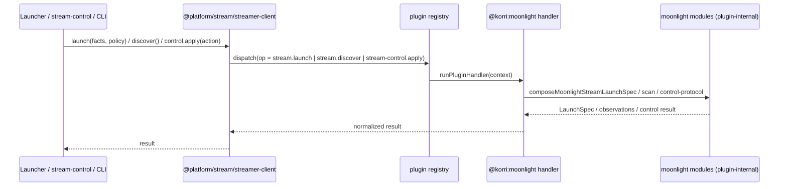

# refactor: Extract Moonlight streaming into a first-party plugin

## Summary

Move Korri's Moonlight streaming integration out of the platform engine into
`product/plugins/moonlight`, so the engine drives "a streamer" through the same
plugin registry seam it already uses for gamescope, steam, and retroarch. The
engine keeps no direct Moonlight imports. Delivered as one branch
(`refactor/moonlight-plugin`), internally sequenced so every commit stays green.
Two foundational units (U1 session extraction, U2 operation seam) are already
landed on the branch; U3–U8 remain.

---

## Problem Frame

Moonlight is the same class of dependency as gamescope/steam/retroarch — a
specific third-party tool the engine invokes — but it predates the first-party
plugin discipline. As a result it is baked into three shared contracts and the
Nix images:

- The `product/platform/stream/` folder physically holds the Moonlight modules
  next to the generic session engine (that mix is fixed in U1).
- `product/platform/library/config/inheritable-fields.ts` declares
  `MoonlightPolicy`/`MoonlightCodec`/`MoonlightRotation`/`MoonlightControlAuthority`
  as first-class library config.
- `product/platform/stream-control/control-contract.ts` hardcodes
  `moonlight.bitrate/fps/resolution` in the built-in control definitions.
- `product/vendor/moonlight-embedded-korri` is referenced by ~11 Nix files
  (compositor module, overlays, per-platform images).

The friction: any change to streaming touches the engine core, ~25 runtime
callers reach directly into Moonlight modules, and there is no seam to host a
second streaming backend. This work removes that coupling.

---

## Requirements

- R1. The platform engine (`product/platform/**` runtime code, apps, services,
  surfaces) contains no direct imports of Moonlight modules; all Moonlight
  behavior is reached through the plugin registry.
- R2. Moonlight launch-spec composition, LAN discovery, local-control protocol,
  and runtime-watch live under `product/plugins/moonlight/`.
- R3. The plugin registers `stream.launch`, `stream.discover`, and
  `stream-control.apply`/`stream-control.describe` handlers and is wired into
  `product/plugin-host/index.ts`.
- R4. `MoonlightPolicy` and its sibling schemas no longer live in
  `@platform/library/config/inheritable-fields`; Moonlight-specific config is
  plugin-owned (breaking migration; authored config updated in-repo).
- R5. `STREAM_CONTROL_BUILT_IN_DEFINITIONS` no longer enumerates `moonlight.*`;
  those controls are plugin-contributed via the existing `pluginControls` seam.
- R6. The Moonlight Nix package is owned by the plugin
  (`product/plugins/moonlight/packages/`) and the ~11 Nix references are rewired
  to the new location.
- R7. Observable streaming behavior is unchanged: the composed Moonlight command,
  flags, input-device preservation, env overlays, control protocol, and LAN
  discovery output are byte-for-byte equivalent to today.
- R8. The full unit suite (`just test-unit`) passes; no new `tsc` errors beyond
  the repo's pre-existing baseline noise (portmaster/remap/yoshis).

---

## Scope Boundaries

- No new streaming backend is added. Seam shape B: dispatch operations are
  generic, payloads stay Moonlight-shaped. The generic payload abstraction is
  deferred until a real second streamer exists (two adapters = real seam).
- No behavior/feature changes to streaming (resolution/bitrate/fps policy,
  control authority, input handling) beyond relocation.
- No marketplace/third-party/sandbox trust-boundary semantics — this is a
  first-party plugin like gamescope.
- The generic foreground-session engine is only relocated (U1), not redesigned.

### Deferred to Follow-Up Work

- Generic streamer payload abstraction (neutral launch/discovery/control types):
  a future iteration when a second streaming backend is real.
- Image build verification of the Nix package move (U8) must run on CI or real
  hardware (`just test-nix` / image build); it cannot be proven in the dev
  sandbox.

---

## Context & Research

### Relevant Code and Patterns

- `product/plugins/gamescope/src/plugin.ts` — reference descriptor: contributes
  `stream-control`, `launch.compose`, `package.expose`, `cli.expose` modules and
  handlers. Direct template for the Moonlight descriptor.
- `product/plugins/gamescope/src/stream-control/` — reference for
  `stream-control.apply`/`describe` handlers backed by a control surface.
- `product/plugins/gamescope/packages/` — reference for a plugin owning its own
  Nix package (the U8 pattern).
- `product/platform/plugin/index.ts` — `PluginOperation` vocabulary (U2 added the
  stream operations); `runPluginHandler` normalizes plain/Promise/Effect results.
- `product/platform/plugin/registry.ts` — how handlers are looked up/dispatched.
- `product/platform/stream-control/control-contract.ts` —
  `streamControlCapabilities(availability, pluginControls)` already merges
  plugin-contributed controls; `StreamControlDefinition.provider?: ProviderId`.
  This is the U7 seam.
- `product/platform/library/launcher.ts`, `product/apps/portal/api/stream/compose-moonlight-launch-spec.ts`,
  `product/apps/portal/stream/moonlight-launcher.ts` — the launch-spec composition
  call path that becomes a `stream.launch` dispatch (U4).
- `product/services/device/lan-stream-advertise.ts`,
  `product/apps/portal/peers/peer-discovery.ts` — LAN discovery consumers that
  become `stream.discover` dispatch (U4).
- `product/surfaces/terminal/korri-cli/moonlight-control.ts`,
  `moonlight-runtime-watch.ts`, `stream-quality.ts` — CLI consumers (U5).
- The Moonlight modules to relocate: `product/platform/stream/moonlight-control-protocol.ts`
  (898 lines), `moonlight-control-client.ts`, `moonlight-launch-spec.ts`,
  `moonlight-runtime-watch-artifact.ts`, `lan-stream-discovery.ts`.

### Institutional Learnings / Precedent Plans

- `work/items/active/01KVE01T9NW7TQ0DMSY345CMND-convert-steam-to-first-party-plugin/`
- `work/items/active/01KVBQ8J0F3E2B6Z9N2X4M5A7C-gamescope-plugin-decoupling/`
- `work/items/active/01KVDSEHGAAGGG872QNN1F8RN3-retroarch-plugin-boundary/`
- `product/plugins/AGENTS.md` — descriptor/handler/registration/config-contribution
  rules; runtime substrate ownership; "do not import plugin internals from runtime
  product code" boundary.

### Environment Notes (verification)

- `bun test <slice>` is the reliable behavior gate and works in the worktree
  (with `node_modules` symlinked from the primary checkout).
- Whole-repo `tsc --noEmit` has pre-existing baseline errors unrelated to this
  work (portmaster/remap/yoshis Bun-global type mismatches). Verify by diffing
  against that known set, not against zero.
- Fallow boundary zones do not define a `product/plugins` zone, so plugins are
  currently unzoned; the "no plugin-internal imports from runtime" rule is a
  design constraint enforced by review, not by the boundary checker.

---

## Key Technical Decisions

- One branch, internally sequenced (U1→U8), each commit green. Squash-on-merge
  keeps it "one large change" for review.
- Seam shape B: generic dispatch operations (`stream.launch`, `stream.discover`,
  `stream-control.*`), Moonlight-shaped payloads. Avoids designing a
  single-example abstraction.
- Session engine relocated to `@platform/session` (already covered by the
  existing `@platform/*` alias — no tsconfig change).
- Breaking config migration: no legacy `moonlight.*` compatibility shim; authored
  config in-repo is migrated in the same branch.
- Nix package moves into the plugin's `packages/`; images/overlays/module rewired.
- Plugin id `@korri:moonlight`. Descriptor mirrors gamescope module/handler shape.
- A platform-side streamer dispatch client (thin helper over the registry) is the
  single seam runtime callers use; they never import plugin internals.

---

## Open Questions

### Resolved During Planning

- Should Moonlight relocation be a pure file move? No — runtime product code may
  not import plugin internals, so the move must land with the dispatch flip.
- Where do the generic session files go? `@platform/session` (U1, done).
- Does the stream-control contract need a new seam for U7? No — the
  `pluginControls` parameter already exists and gamescope uses it.

### Deferred to Implementation

- Exact handler input/output codecs for `stream.launch`/`stream.discover` — settle
  against the real `LaunchSpec`/`MoonlightLaunchFacts` and discovery observation
  shapes while wiring U3/U4.
- Whether the CLI's local-control commands dispatch through a handler or call a
  plugin-exported client directly — decide in U5 based on how much of the
  898-line control protocol must remain callable outside the handler envelope.
- Final list of authored config files needing the breaking `moonlight.*`
  migration — enumerate by grep during U6.

---

## Output Structure

    product/plugins/moonlight/
      index.ts                        # thin public export surface
      README.md
      src/
        plugin.ts                     # @korri:moonlight descriptor + handlers
        plugin.test.ts
        launch-spec/                  # moonlight-launch-spec (relocated)
        control/                      # control-protocol + control-client (relocated)
        discovery/                    # lan-stream-discovery (relocated)
        runtime-watch/                # moonlight-runtime-watch-artifact (relocated)
        config/                       # MoonlightPolicy family (migrated from platform)
        stream-control/               # plugin-contributed control defs + handlers
      packages/
        moonlight-embedded-korri/     # relocated Nix package
    product/platform/stream/streamer-client.ts   # platform-side dispatch seam

---

## High-Level Technical Design

> *This illustrates the intended approach and is directional guidance for review, not implementation specification. The implementing agent should treat it as context, not code to reproduce.*

Runtime callers stop importing Moonlight modules and instead resolve the streamer
capability through the registry:

Payloads crossing the seam stay Moonlight-shaped (`MoonlightLaunchFacts`,
`MoonlightPolicy`, bitrate/fps/resolution). Only the dispatch mechanism is
generic.

---

## Implementation Units

### U1. Extract foreground-session engine to `@platform/session`

**Goal:** Split the generic session engine out of the mislabeled `stream/` folder
so what remains in `stream/` is honestly Moonlight-only.

**Requirements:** R1 (prep)

**Dependencies:** None

**Files:**
- Move: `product/platform/stream/foreground-session-*.ts` → `product/platform/session/`
- Modify: 23 importers repointed to `@platform/session/foreground-session-*`
- Test: `product/platform/session/foreground-session-*.test.ts` (moved)

**Approach:** Pure move + import rewrite; the session engine has zero Moonlight
coupling. `@platform/session/*` is already covered by the `@platform/*` alias.

**Test scenarios:**
- Happy path: moved session tests pass unchanged (owner, lifecycle, gate-state,
  status).
- Integration: repointed importers (library projections, portal home layer, shift
  routes, CLI status) resolve and their tests pass.

**Verification:** `bun test product/platform/session/` green; no stale
`@platform/stream/foreground-session` references remain. **Status: landed on
branch (`69704597`).**

---

### U2. Add `stream.launch` / `stream.discover` operations

**Goal:** Name the streamer capability in the plugin operation vocabulary.

**Requirements:** R3

**Dependencies:** None

**Files:**
- Modify: `product/platform/plugin/index.ts` (`PluginOperation` union)

**Approach:** Additive union members alongside `stream-control.*`; the union
already accepts arbitrary strings, so this is documentation-of-intent plus type
help.

**Test scenarios:** `Test expectation: none — additive type vocabulary`; covered
transitively by `product/platform/plugin/registry.test.ts`.

**Verification:** `bun test product/platform/plugin/registry.test.ts` green.
**Status: landed on branch (`4f48ce57`).**

---

### U3. Scaffold `@korri:moonlight` plugin and relocate Moonlight modules

**Goal:** Create the plugin package, relocate the Moonlight modules into it, and
register handlers + the platform-side dispatch client, keeping the tree green via
temporary re-export shims at the old `@platform/stream/moonlight-*` paths.

**Requirements:** R2, R3

**Dependencies:** U1, U2

**Files:**
- Create: `product/plugins/moonlight/index.ts`, `product/plugins/moonlight/src/plugin.ts`,
  `product/plugins/moonlight/src/plugin.test.ts`, `product/plugins/moonlight/README.md`
- Move: `product/platform/stream/moonlight-launch-spec.ts`,
  `moonlight-control-protocol.ts`, `moonlight-control-client.ts`,
  `moonlight-runtime-watch-artifact.ts`, `lan-stream-discovery.ts` (+ their tests)
  into `product/plugins/moonlight/src/**`
- Create: `product/platform/stream/streamer-client.ts` (dispatch seam over the
  registry)
- Modify: `product/plugin-host/index.ts` (register `moonlightPlugin`,
  `enabledFirstPartyPluginIds` if default-enabled)
- Create (temporary): re-export shims at old `@platform/stream/moonlight-*` paths

**Approach:** Follow `product/plugins/gamescope/src/plugin.ts` shape. Handlers for
`stream.launch` (wraps `composeMoonlightStreamLaunchSpec`), `stream.discover`
(wraps LAN discovery), and `stream-control.apply`/`describe` (wraps the control
protocol/client). Validate `context.input` at each handler boundary; return
plain/Promise/Effect. Shims let U4/U5 flip callers incrementally.

**Patterns to follow:** gamescope descriptor (modules + handlers + input
decoders); `product/plugins/AGENTS.md` descriptor/registration/test rules.

**Test scenarios:**
- Happy path: stable plugin id `@korri:moonlight`; descriptor exposes expected
  modules and handler operation list.
- Happy path: `stream.launch` handler returns the same `LaunchSpec` as calling
  `composeMoonlightStreamLaunchSpec` directly for a representative facts+policy.
- Error path: each handler rejects malformed `context.input`.
- Integration: registry resolves the moonlight handlers via
  `product/platform/plugin/registry.test.ts`-style dispatch.
- Regression: relocated module tests pass unchanged at their new paths.

**Verification:** `bun test product/plugins/moonlight/ product/platform/plugin/`
green; plugin registered in the host; old imports still resolve via shims.

---

### U4. Flip runtime service/app callers to the dispatch client

**Goal:** Repoint the launcher launch-spec composition, stream-control service,
portal stream, device advertise, and desktop forwarder from direct Moonlight
imports to `@platform/stream/streamer-client`.

**Requirements:** R1, R7

**Dependencies:** U3

**Files:**
- Modify: `product/platform/library/launcher.ts`,
  `product/apps/portal/api/stream/compose-moonlight-launch-spec.ts`,
  `product/apps/portal/stream/moonlight-launcher.ts`,
  `product/apps/portal/api/stream-control/service.ts`,
  `product/apps/portal/api/stream-control/rpc-schemas.ts`,
  `product/services/device/lan-stream-advertise.ts`,
  `product/services/device/touch-bounds-coordinator.ts`,
  `product/apps/portal/peers/peer-discovery.ts`,
  `product/apps/desktop/forwarder-upstream.ts`
- Test: the corresponding `*.test.ts` for each

**Approach:** Replace direct module imports with dispatch calls. Preserve exact
inputs/outputs (facts, policy, LaunchSpec, discovery observations). Remove the
old shims for the paths these files used once repointed.

**Execution note:** Characterization-first — assert the composed command/flags and
discovery output are unchanged before and after the flip.

**Test scenarios:**
- Happy path: launcher produces the identical Moonlight `LaunchSpec` (command,
  typed flags, input-device preservation, env sets/unsets) via dispatch.
- Happy path: LAN discovery via `stream.discover` yields the same peer/stream
  observations.
- Error path: streamer capability missing → fail-closed with a typed error, not a
  crash.
- Integration: `stream-control.apply` through the service still drives bitrate/
  fps/resolution against the control protocol.

**Verification:** `bun test` for all modified areas green; no
`@platform/stream/moonlight-*` imports remain in these files.

---

### U5. Flip terminal CLI and web-surface callers

**Goal:** Repoint the CLI (`moonlight-control`, `moonlight-runtime-watch`,
`stream-quality`, `cli-helpers`, `launch-command`, `source-aware-games`) and any
remaining web-surface consumers to the dispatch seam or plugin-exported client,
then delete all remaining temporary shims.

**Requirements:** R1, R7

**Dependencies:** U3, U4

**Files:**
- Modify: `product/surfaces/terminal/korri-cli/moonlight-control.ts`,
  `moonlight-runtime-watch.ts`, `stream-quality.ts`, `cli-helpers.ts`,
  `launch-command.ts`, `source-aware-games.ts`
- Remove: temporary re-export shims created in U3
- Test: corresponding `*.test.ts`

**Approach:** Decide per-caller whether to dispatch a handler or consume a
plugin-exported client (for the local-control protocol used interactively).
After this unit, `grep @platform/stream/moonlight` returns nothing outside the
plugin.

**Test scenarios:**
- Happy path: `korri moonlight-control` behavior unchanged (control actions,
  readbacks).
- Happy path: runtime-watch artifact parsing unchanged.
- Edge case: stream-quality argument parsing unchanged.
- Integration: CLI end-to-end tests that touch streaming still pass.

**Verification:** `bun test` for CLI slices green; zero non-plugin references to
Moonlight modules repo-wide; no shims remain.

---

### U6. Migrate Moonlight config out of library inheritable-fields (breaking)

**Goal:** Move `MoonlightPolicy`, `MoonlightCodec`, `MoonlightRotation`,
`MoonlightControlAuthority` and the `moonlight` inheritable field out of
`@platform/library/config/inheritable-fields` into plugin-owned config, and
migrate authored config in-repo.

**Requirements:** R4

**Dependencies:** U3

**Files:**
- Modify: `product/platform/library/config/inheritable-fields.ts` (remove the
  Moonlight schemas + field)
- Create: `product/plugins/moonlight/src/config/*` (plugin-owned schemas)
- Modify: config consumers (launch-spec handler, stream-control) to read plugin
  config
- Modify: authored/example config files using `moonlight.*` (enumerate by grep)
- Test: config codec/merge tests; a migration/absence test

**Approach:** Breaking — no legacy shim. Plugin contributes its config via
`contributes.config`. Update the deep-merge/inheritance behavior docs where they
name `moonlight`.

**Execution note:** Grep the repo for authored `moonlight.*` config before
editing; migrate every occurrence in the same unit.

**Test scenarios:**
- Happy path: plugin config schema decodes a full Moonlight policy (codec,
  rotation, control authority, environment, extraArgs).
- Edge case: deep-merge/inheritance semantics preserved for nested keys.
- Error path: invalid codec/rotation rejected at the plugin boundary.
- Regression: `inheritable-fields` no longer references `moonlight`; library
  config tests pass without it.

**Verification:** `bun test` for library config + plugin config green; no
`Moonlight` symbols remain in `inheritable-fields.ts`.

---

### U7. De-hardcode the stream-control contract

**Goal:** Remove `moonlight.bitrate/fps/resolution` from
`STREAM_CONTROL_BUILT_IN_DEFINITIONS` and contribute them as plugin controls via
the existing `pluginControls` seam.

**Requirements:** R5

**Dependencies:** U3

**Files:**
- Modify: `product/platform/stream-control/control-contract.ts` (drop the three
  moonlight built-ins; keep brightness/battery)
- Create/Modify: `product/plugins/moonlight/src/stream-control/*` (control defs +
  `stream-control.describe` contribution carrying `provider: "@korri:moonlight"`)
- Modify: `product/platform/stream-control/control-surface.ts` / consumers that
  assume moonlight is built-in (e.g. `StreamControlAvailability.moonlight`)
- Test: `product/platform/stream-control/control-surface.test.ts` and plugin
  control tests

**Approach:** Mirror gamescope's contributed controls. Keep the surface API stable
so consumers still see moonlight controls, now sourced from the plugin.

**Test scenarios:**
- Happy path: capabilities surface still lists bitrate/fps/resolution with correct
  value specs, now provider-tagged `@korri:moonlight`.
- Edge case: availability=false still yields `unsupported` with a reason.
- Regression: built-in definitions no longer contain `subsystem: "moonlight"`.
- Integration: `stream-control.apply` end-to-end still sets and reads back
  bitrate/fps/resolution.

**Verification:** `bun test` for stream-control + plugin controls green; no
`moonlight.` ids in `STREAM_CONTROL_BUILT_IN_DEFINITIONS`.

---

### U8. Move the Nix package into the plugin and rewire images

**Goal:** Relocate `product/vendor/moonlight-embedded-korri` into
`product/plugins/moonlight/packages/moonlight-embedded-korri` and rewire the ~11
Nix references.

**Requirements:** R6

**Dependencies:** U3

**Files:**
- Move: `product/vendor/moonlight-embedded-korri/**` → `product/plugins/moonlight/packages/moonlight-embedded-korri/**`
- Modify: `product/systems/nixos/overlays/korri-packages.nix`,
  `product/systems/nixos/flake/packages.nix`,
  `product/systems/nixos/flake/default.nix`,
  `product/systems/nixos/modules/korri-compositor.nix`,
  `product/systems/nixos/images/common.nix`,
  `product/systems/nixos/images/live-usb-runtime.nix`,
  `product/systems/nixos/images/platforms/{x86,rocknix-rk3326,rocknix-rk3566,rocknix-sm8550}.nix`
- Modify: plugin descriptor to declare the `nix-package` module (mirroring
  gamescope's `packages/` contribution)
- Test: `tools/testing/nix/*` eval checks where applicable

**Approach:** Path-only relocation of the derivation plus reference rewiring; no
derivation content change. Declare the package in the plugin descriptor like
gamescope's `gamescope-korri-package` module.

**Execution note:** Cannot be image-build-verified in the dev sandbox. Verify by
Nix eval / `just test-nix` and defer full image build to CI or hardware (see
Scope Boundaries).

**Test scenarios:**
- `Test expectation: none — path relocation`; guarded by Nix eval.
- Nix eval: overlay/flake still resolve `moonlight-embedded-korri` at the new
  location; compositor module and each platform image evaluate.

**Verification:** `just test-nix` (or targeted eval) green; no references to the
old `product/vendor/moonlight-embedded-korri` path remain.

---

## System-Wide Impact

- **Interaction graph:** launcher launch-spec composition, stream-control RPC
  service, LAN discovery/advertise, desktop forwarder, terminal CLI streaming
  commands, and the NixOS compositor/image graph all route through the new seam.
- **Error propagation:** a missing/disabled streamer capability must fail closed
  with a typed error at the dispatch client, not throw deep in a caller.
- **State lifecycle risks:** the 898-line local-control protocol holds a live
  socket connection; ensure the handler/exported-client boundary preserves
  connect/apply/readback/cleanup ordering.
- **API surface parity:** stream-control RPC schemas and the CLI surface must keep
  the same external shape after the config/contract migration.
- **Integration coverage:** launch → foreground session → stream-control apply is
  a cross-layer path; keep an integration test that exercises it via dispatch.
- **Unchanged invariants:** the generic `@platform/session` engine, brightness/
  battery stream controls, and observable Moonlight command output are explicitly
  unchanged.

---

## Risks & Dependencies

| Risk | Mitigation |
|------|------------|
| Dispatch flip silently changes composed Moonlight command/flags | Characterization tests assert byte-equivalent LaunchSpec before/after (U4/U5) |
| Breaking config migration misses an authored `moonlight.*` file | Grep-enumerate all occurrences in U6; add an absence test on `inheritable-fields` |
| Nix package move breaks images, unverifiable in sandbox | Nix eval / `just test-nix` in U8; gate full image build on CI/hardware before merge |
| Runtime code accidentally imports plugin internals (no fallow zone enforces it) | Review-enforced dispatch-only seam; final repo-wide grep for `@platform/stream/moonlight` and `@product/plugins/moonlight` in runtime code |
| Local-control socket lifecycle regresses behind the handler envelope | Decide handler-vs-exported-client per caller (U5); preserve connect/apply/readback/cleanup ordering with a protocol test |
| Branch state resets between sessions orphan progress | Commit each unit; branch objects survive in reflog; recover via `git log <sha>` |

---

## Documentation / Operational Notes

- Update `product/plugins/AGENTS.md` "Runtime substrate ownership" if a Moonlight
  ownership note is warranted (streaming host vs. compositor).
- The breaking config migration (U6) changes authored config shape — note it in
  the PR description and any deployment/runbook that references `moonlight.*`.
- Image build verification for U8 is a required pre-merge CI/hardware step.

---

## Sources & References

- Branch: `refactor/moonlight-plugin` (U1 `69704597`, U2 `4f48ce57`)
- Reference plugin: `product/plugins/gamescope/`
- Precedent plans: `work/items/active/01KVE01T9NW7TQ0DMSY345CMND-convert-steam-to-first-party-plugin/`,
  `work/items/active/01KVBQ8J0F3E2B6Z9N2X4M5A7C-gamescope-plugin-decoupling/`
- Plugin authoring contract: `product/plugins/AGENTS.md`
- Stream-control seam: `product/platform/stream-control/control-contract.ts`
