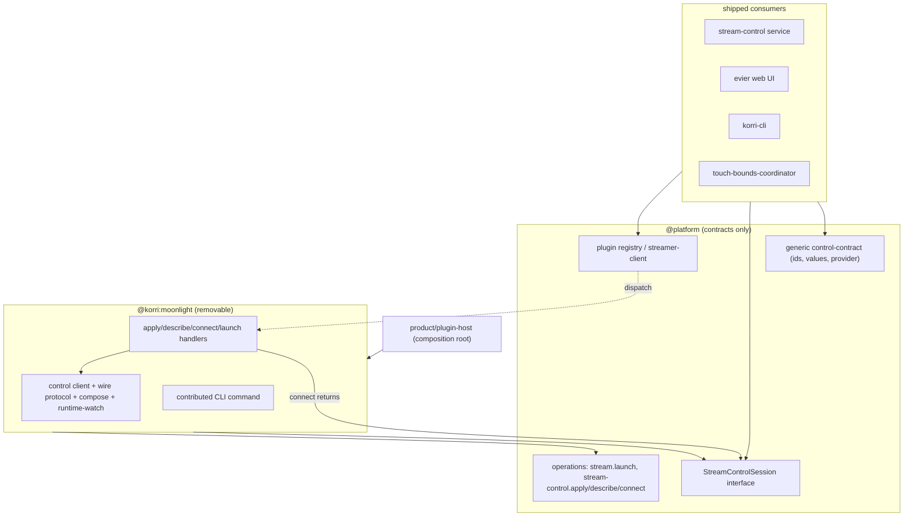

# refactor: Extract Moonlight streaming into a fully removable plugin

## Summary

Move Korri's Moonlight streaming integration out of the platform engine into
`product/plugins/moonlight` so the engine drives "a streamer" only through the
plugin registry — and make the plugin **fully removable**: if the plugin folder
is deleted, the app still builds and boots, with streaming failing closed. U1–U4
have landed the removable launch path; the remaining units genericize the
stream-control subsystem, migrate Moonlight config to an opaque streamer policy,
relocate the Nix package, and delete the temporary shims. This is the re-scoped
plan after the removability constraint was made explicit during execution.

---

## Problem Frame

Moonlight is the same class of dependency as gamescope/steam/retroarch — a
specific third-party tool the engine invokes — but it predates the first-party
plugin discipline, so it is wired into the engine as a **first-class built-in**,
not a plugin:

- The stream-control service exposes `setMoonlightBitrate/Fps/Resolution` methods
  and dedicated RPC endpoints (`set-moonlight-bitrate/fps/resolution.rpc-handler.ts`).
- The stream-control RPC schemas and config/state/controls responses carry fixed
  `moonlight` keys; `STREAM_CONTROL_BUILT_IN_DEFINITIONS` hardcodes
  `moonlight.bitrate/fps/resolution`.
- The Moonlight local-control socket client + wire protocol live in the platform.
- `MoonlightPolicy` (and `MoonlightCodec`/`Rotation`/`ControlAuthority`) is threaded
  through the entire library config cascade (7 files) and the launch pipeline.
- The evier web UI, the CLI, and the device touch-bounds coordinator all consume
  Moonlight-specific platform APIs.
- `product/vendor/moonlight-embedded-korri` is referenced by ~11 Nix files.

The governing requirement (established during execution): the plugin must be
deletable as if it lived in a separate repo, with the app still functioning
(streaming simply unavailable). That forbids **any** shipped-code dependency on
the plugin — including type-only imports — which turns the stream-control work
from "repoint imports" into a genuine genericization of the subsystem.

---

## Requirements

- R1. No shipped code (everything under `product/**` except `*.test.*` and the
  `product/plugin-host` composition root) imports `@product/plugins/moonlight` or
  `@platform/stream/moonlight-*`. All Moonlight behavior is reached through the
  plugin registry or platform-owned contracts.
- R2. Moonlight launch-spec composition, LAN-independent local-control protocol,
  control client, and runtime-watch live under `product/plugins/moonlight/`.
- R3. The plugin registers `stream.launch`, `stream-control.apply`,
  `stream-control.describe`, and `stream-control.connect` handlers and is wired
  into `product/plugin-host/index.ts`.
- R4. `MoonlightPolicy` and siblings no longer live in
  `@platform/library/config/inheritable-fields`; the library config carries an
  **opaque streamer policy** the platform does not type, and the plugin owns the
  Moonlight schema + validation.
- R5. `STREAM_CONTROL_BUILT_IN_DEFINITIONS` and the stream-control RPC
  config/state/controls responses no longer enumerate `moonlight.*`; Moonlight
  controls are contributed by the plugin via `stream-control.describe`.
- R6. The Moonlight Nix package is owned by the plugin
  (`product/plugins/moonlight/packages/`) and the ~11 Nix references are rewired;
  `@korri:moonlight` is in the images' enabled-plugins list.
- R7. Observable streaming behavior is unchanged: composed Moonlight command +
  flags, input-device preservation, env overlays, control apply/readback, and
  runtime-watch output match today's behavior.
- R8. **Removability gate:** deleting `product/plugins/moonlight/` leaves
  `just typecheck` green and the app bootable; streaming operations fail closed
  with a typed "no streamer" error.
- R9. The full unit suite (`just test-unit`) passes; no new `tsc` errors beyond
  the repo's pre-existing baseline noise (portmaster/remap/yoshis).

---

## Scope Boundaries

- No new streaming backend is added. Seam shape B: dispatch operations and the
  session interface are generic, payloads stay Moonlight-shaped. The neutral
  payload abstraction is deferred until a real second streamer exists.
- No streaming feature/behavior changes beyond relocation and genericization.
- No marketplace/third-party/sandbox trust semantics — first-party plugin.
- The generic foreground-session engine (U1) and generic korri-stream discovery
  (U4a) are not redesigned further.

### Deferred to Follow-Up Work

- Neutral (non-Moonlight-shaped) streamer payload/control abstraction: a future
  iteration when a second streaming backend is real.
- Full image-build verification of the Nix move (U8): must run on CI or hardware
  (`just test-nix` / image build); it cannot be proven in the dev sandbox.

---

## Context & Research

### Landed foundation (U1–U4, on `refactor/moonlight-plugin`)

- `69704597` session engine → `@platform/session`; `4f48ce57` stream operations;
  `faca583a` `@korri:moonlight` plugin scaffold + modules relocated; `50192f57`
  generic discovery kept in platform; `876cba13` launch dispatch via
  `product/platform/stream/streamer-client.ts`.
- Removability already holds for the launch path: no shipped code imports the
  plugin; `streamer-client` fails closed when no streamer is enabled.
- Three temporary re-export shims remain in `product/platform/stream/`
  (`moonlight-control-protocol.ts`, `moonlight-control-client.ts`,
  `moonlight-runtime-watch-artifact.ts`) — U9/U5/U12 remove them.

### Relevant Code and Patterns

- `product/plugins/gamescope/src/plugin.ts` + `src/stream-control/` — reference
  for `stream-control.apply`/`describe` handlers and a plugin-owned control
  surface. The generic action path already exists:
  `product/apps/portal/api/stream-control/service.ts` `applyAction` dispatches
  `parsePluginRecordId(action)` → provider `stream-control.apply`. Moonlight must
  join that path instead of the built-in branch.
- `product/platform/stream-control/control-contract.ts` —
  `streamControlCapabilities(availability, pluginControls)` already merges
  plugin-contributed controls with `provider?: ProviderId`. This is the U7 seam.
- Stream-control subsystem coupling to genericize:
  `product/apps/portal/api/stream-control/service.ts`,
  `rpc-schemas.ts`, `set-moonlight-{bitrate,fps,resolution}.rpc-handler.ts`,
  `product/apps/portal/api/{rpc-server,server/rpc-server}.ts`,
  `product/platform/stream-control/{state-normalizer,stream-control-client,runtime-support}.ts`.
- Web UI consumers: `product/apps/portal/features/evier/stream-control-rpc-client.ts`,
  `product/surfaces/web/evier/pages/evier-control-state.ts`.
- CLI consumers: `product/surfaces/terminal/korri-cli/{moonlight-control,moonlight-runtime-watch,stream-quality,stream-control-bench}.ts`.
- Device consumer: `product/services/device/touch-bounds-coordinator.ts` (uses a
  live `MoonlightControlClient`).
- Config cascade carrying `MoonlightPolicy`:
  `product/platform/library/config/{inheritable-fields,cascade-resolver,ephemeral-override,app-integrations,resolved-launch-context}.ts`,
  `product/platform/library/{library-services,proseql/library-repository}.ts`.

### Institutional Learnings / Precedent

- `work/items/active/01KVBQ8J0F3E2B6Z9N2X4M5A7C-gamescope-plugin-decoupling/`,
  `01KVE01T9NW7TQ0DMSY345CMND-convert-steam-to-first-party-plugin/`.
- `product/plugins/AGENTS.md` — descriptor/handler/registration/config rules;
  `cli.expose` shows how a plugin contributes CLI binaries.

### Environment Notes (verification)

- `bun test <slice>` is the reliable behavior gate in the worktree
  (`node_modules` symlinked from the primary checkout).
- Whole-repo `tsc --noEmit` has pre-existing baseline errors unrelated to this
  work (portmaster/remap/yoshis Bun-global type mismatches). Verify by diffing
  against that known set.
- Removability gate is checked two ways: a grep gate (R1) and a temporary
  `git rm -r product/plugins/moonlight` + `tsc`/boot smoke, then restore.

---

## Key Technical Decisions

- **Removability is the governing constraint.** Platform owns *contracts and
  interfaces*; the plugin owns *all implementations*; shipped code touches only
  platform contracts + the registry. Even type-only imports of the plugin are
  forbidden.
- **Live connection via dependency inversion.** The platform defines a
  `StreamControlSession` interface (hello/state/set*/setTouchBounds/subscribe/
  close). A `stream-control.connect` registry operation returns an object
  implementing it; the plugin supplies the concrete socket-backed version. This
  is the sanctioned way to hand back a long-lived connection without a plugin
  import (the earlier "return a handle from a handler" option, justified here).
- **One-shot controls via generic dispatch.** Bitrate/fps/resolution flow through
  the existing generic `stream-control.apply`/`describe` path (as gamescope does),
  not through Moonlight-named service methods or dedicated RPC endpoints.
- **Config becomes opaque at the platform.** The library config cascade carries
  the streamer policy as an untyped passthrough; the plugin parses/validates it.
  Renaming the authored key off `moonlight` to a generic streamer key is the
  breaking part (see Open Questions).
- **Moonlight-specific surfaces are plugin-contributed.** The interactive CLI
  control command is contributed by the plugin (`cli.expose`) so it disappears
  cleanly when the plugin is removed (integration mechanism into `korri-cli` is
  an execution-time question).
- Seam shape B retained; branch stays green per unit; squash-on-merge keeps it
  one change.

---

## Open Questions

### Resolved During Planning

- Can shipped code import the plugin's public API or types? No — removability
  forbids all plugin imports outside tests and the plugin-host composition root.
- How is the live control socket exposed without a plugin import? Platform-owned
  `StreamControlSession` interface + `stream-control.connect` operation (U9).
- Where do Moonlight one-shot controls go? The existing generic
  `stream-control.apply`/`describe` path; dedicated `set-moonlight-*` endpoints
  are removed (U7).

### Deferred to Implementation

- Exact authored-config key for the streamer policy (keep `moonlight`, or a
  generic `streamer`/`@korri:moonlight` key). Leaning generic; settle in U6 and
  migrate authored/example config accordingly.
- Mechanism for a plugin-contributed `korri-cli` subcommand vs a thin in-CLI
  command that drives the platform `StreamControlSession` interface — settle in
  U5 based on how `korri-cli` composes its command tree.
- Whether `touch-bounds-coordinator` consumes `stream-control.connect` directly
  or receives an injected `StreamControlSession` from its caller — settle in U11.
- Final `StreamControlSession` method set (subscribe/event-stream shape) — settle
  against the real control-client surface in U9.

---

## High-Level Technical Design

> *This illustrates the intended approach and is directional guidance for review, not implementation specification. The implementing agent should treat it as context, not code to reproduce.*

Dependency inversion so nothing shipped depends on the plugin:

Delete the plugin → `HANDLERS` are simply absent → the registry finds no
provider → `streamer-client` and `stream-control.*` fail closed. No shipped
import breaks because shipped code only referenced Platform contracts.

---

## Implementation Units

<!-- U1–U4 are landed on the branch; listed as context. U-IDs are stable and never
     renumbered. U5–U8 are re-scoped from the original plan; U9–U12 are new units
     introduced by the removability constraint. Dependency order is noted per unit;
     the doc lists them ascending by id. -->

### U1. Extract foreground-session engine to `@platform/session` — LANDED (`69704597`)

**Goal:** Split the generic session engine out of the mislabeled `stream/` folder.

**Verification:** `bun test product/platform/session/` green; no
`@platform/stream/foreground-session` references remain. Done.

---

### U2. Add stream operations to the plugin vocabulary — LANDED (`4f48ce57`)

**Goal:** Name `stream.launch`/`stream.discover` in `PluginOperation`.
`stream-control.connect` is added in U9.

**Verification:** registry tests green. Done.

---

### U3. Scaffold `@korri:moonlight` and relocate modules — LANDED (`faca583a`)

**Goal:** Create the plugin, relocate launch-spec/control-protocol/control-client/
runtime-watch, register in the host. (Generic discovery returned to platform in
U4a, `50192f57`.)

**Verification:** `bun test product/plugins/moonlight/` green. Done.

---

### U4. Dispatch stream launch through the registry — LANDED (`876cba13`)

**Goal:** Platform `streamer-client` seam; portal compose/launcher/RPC handler
flip to dispatch; launch-spec shim removed; fails closed.

**Verification:** launch path has no plugin import; 87 tests green. Done.

---

### U6. Migrate Moonlight config to an opaque streamer policy

**Goal:** Remove `MoonlightPolicy` (and siblings) from platform library config;
the cascade carries the streamer policy opaquely; the plugin owns the schema and
validates it in its `stream.launch` handler.

**Requirements:** R1, R4

**Dependencies:** U4

**Files:**
- Modify: `product/platform/library/config/inheritable-fields.ts` (drop the
  Moonlight schemas; replace the typed `moonlight` field with an opaque
  passthrough)
- Modify: `product/platform/library/config/{cascade-resolver,ephemeral-override,app-integrations,resolved-launch-context}.ts`,
  `product/platform/library/{library-services,proseql/library-repository}.ts`
  (treat the field opaquely; preserve deep-merge/inheritance semantics)
- Create: `product/plugins/moonlight/src/config/*` (Moonlight policy schema +
  validation, consumed by the `stream.launch` handler)
- Modify: authored/example config using `moonlight.*` if the key is renamed
- Test: config codec/merge tests; `product/plugins/moonlight/src/config/*.test.ts`

**Approach:** The platform stops typing the streamer policy. Inheritance/merge
must still work on the opaque value (record deep-merge). The plugin's launch
handler decodes it (it already receives `policy: unknown` via `streamer-client`).
Key rename (if chosen) is the breaking migration.

**Execution note:** Characterization-first — capture current cascade/merge output
for a representative `moonlight` policy before making the field opaque.

**Test scenarios:**
- Happy path: a full Moonlight policy round-trips through the opaque cascade and
  the plugin decodes it into the same LaunchSpec as today.
- Edge case: nested-key deep-merge and ephemeral-override precedence preserved on
  the opaque value.
- Error path: invalid codec/rotation rejected at the plugin boundary (not the
  platform).
- Integration: `inheritable-fields` exports no `Moonlight*` symbols; library
  config tests pass without them.

**Verification:** no `Moonlight*` symbols in platform library config; `bun test`
for library config + plugin config green.

---

### U7. Genericize the stream-control service, schemas, and endpoints

**Goal:** Remove Moonlight as a stream-control built-in. Route bitrate/fps/
resolution through the generic `stream-control.apply`/`describe` path; the plugin
contributes the control definitions and readback; delete the dedicated
`set-moonlight-*` endpoints and the fixed `moonlight` response keys.

**Requirements:** R1, R3, R5, R7

**Dependencies:** U9

**Files:**
- Modify: `product/apps/portal/api/stream-control/service.ts` (drop
  `setMoonlight*`, the built-in `moonlight` branches in `applyAction`, and the
  hardcoded `moonlight` config/state/controls keys; keep brightness/battery)
- Modify: `product/apps/portal/api/stream-control/rpc-schemas.ts` (remove the
  `moonlight` struct + `MOONLIGHT_CONTROL_PROTOCOL_LIMITS` import; controls/state
  come from the generic plugin path)
- Remove: `product/apps/portal/api/stream-control/set-moonlight-{bitrate,fps,resolution}.rpc-handler.ts`
  and their registration in `product/apps/portal/api/{rpc-server,server/rpc-server}.ts`
- Modify: `product/platform/stream-control/state-normalizer.ts` (move Moonlight
  normalization into the plugin's `stream-control.describe` output)
- Create/Modify: `product/plugins/moonlight/src/stream-control/*` (control defs +
  `apply`/`describe` handlers, provider-tagged `@korri:moonlight`)
- Test: `product/apps/portal/api/stream-control/stream-control.rpc-handler.test.ts`,
  `product/platform/stream-control/control-surface.test.ts`, plugin control tests

**Approach:** Mirror gamescope's contributed controls. The generic action id
becomes provider-qualified (`@korri:moonlight/…`) or the plugin maps the existing
`app.stream-control.moonlight-*` action strings; keep external action strings
stable if the web UI still sends them until U10 switches it.

**Execution note:** Characterization-first on `controls()`/`state()`/`applyAction`
output for Moonlight before/after.

**Test scenarios:**
- Happy path: `controls()` still lists bitrate/fps/resolution with correct value
  specs, now provider-tagged `@korri:moonlight`.
- Edge case: streamer disabled → `unsupported` with reason; no crash.
- Error path: apply with no streamer enabled fails closed.
- Regression: `STREAM_CONTROL_BUILT_IN_DEFINITIONS` and the RPC schemas contain no
  `moonlight` keys; no `set-moonlight-*` endpoints registered.
- Integration: bitrate/fps/resolution apply+readback works end-to-end through the
  plugin.

**Verification:** `bun test` for stream-control + plugin controls green; no
Moonlight symbols in the platform stream-control layer.

---

### U8. Move the Nix package into the plugin and rewire images

**Goal:** Relocate `product/vendor/moonlight-embedded-korri` into
`product/plugins/moonlight/packages/` and rewire the ~11 Nix references; ensure
`@korri:moonlight` is in the images' enabled-plugins list.

**Requirements:** R6

**Dependencies:** U3

**Files:**
- Move: `product/vendor/moonlight-embedded-korri/**` →
  `product/plugins/moonlight/packages/moonlight-embedded-korri/**`
- Modify: `product/systems/nixos/overlays/korri-packages.nix`,
  `product/systems/nixos/flake/{packages,default}.nix`,
  `product/systems/nixos/modules/korri-compositor.nix`,
  `product/systems/nixos/images/{common,live-usb-runtime}.nix`,
  `product/systems/nixos/images/platforms/{x86,rocknix-rk3326,rocknix-rk3566,rocknix-sm8550}.nix`
  (path + `enabledFirstPartyPlugins` include `@korri:moonlight`)
- Modify: plugin descriptor to declare the `nix-package` module (mirror
  gamescope's `packages/` contribution)

**Approach:** Path-only relocation of the derivation + reference rewiring; declare
the package in the descriptor like `gamescope-korri-package`.

**Execution note:** Cannot be image-build-verified in the sandbox; verify by Nix
eval / `just test-nix` and defer full image build to CI/hardware.

**Test scenarios:**
- `Test expectation: none — path relocation`; guarded by Nix eval.
- Nix eval: overlay/flake resolve `moonlight-embedded-korri` at the new location;
  compositor module and each platform image evaluate; `@korri:moonlight` present
  in the enabled-plugins env.

**Verification:** `just test-nix` (or targeted eval) green; no references to the
old `product/vendor/moonlight-embedded-korri` path remain.

---

### U9. Platform stream session interface + relocate control client/protocol into the plugin

**Goal:** Define a platform-owned `StreamControlSession` interface and a
`stream-control.connect` operation; move the Moonlight local-control client and
wire protocol into the plugin as the concrete implementation. This is the
foundational removability move for stream-control.

**Requirements:** R1, R2, R3, R8

**Dependencies:** U3

**Files:**
- Create: `product/platform/stream-control/stream-control-session.ts`
  (`StreamControlSession` interface: hello/state/setBitrate/setFps/setResolution/
  setTouchBounds/subscribe/close, in platform-owned generic types)
- Modify: `product/platform/plugin/index.ts` (add `stream-control.connect`)
- Move: `product/plugins/moonlight/src/moonlight-control-client.ts` +
  `moonlight-control-protocol.ts` become the concrete session implementation;
  add a `stream-control.connect` handler returning a `StreamControlSession`
- Remove: the `@platform/stream/moonlight-control-{protocol,client}.ts` shims
- Test: `product/plugins/moonlight/src/stream-control/*.test.ts`,
  session-interface conformance test

**Approach:** Dependency inversion — platform declares the interface, the plugin
returns an implementation via the registry. The interface uses generic types
(no Moonlight wire types leak into platform). Consumers (U7, U11, U5) type against
the interface only.

**Execution note:** Start from the interface contract test (what a session must
do), then move the client behind it.

**Test scenarios:**
- Happy path: `stream-control.connect` returns a session; `state()`/`setBitrate`
  behave as the direct client does today.
- Edge case: socket path absent → connect fails closed with a typed error.
- Error path: malformed protocol frames handled as today (preserve
  connect/apply/readback/cleanup ordering).
- Integration: a caller drives the session purely through the platform interface
  with no Moonlight import.

**Verification:** `bun test` for the plugin control + session green; the two
control shims are deleted; platform stream-control has no Moonlight import.

---

### U5. Convert the CLI Moonlight commands

**Goal:** Move the CLI off the Moonlight shims. The interactive local-control
command becomes plugin-contributed (or drives the platform `StreamControlSession`);
`moonlight-runtime-watch`, `stream-quality`, and `stream-control-bench` use the
generic contract / plugin-provided client.

**Requirements:** R1, R7

**Dependencies:** U9, U7

**Files:**
- Modify/Move: `product/surfaces/terminal/korri-cli/{moonlight-control,moonlight-runtime-watch,stream-quality,stream-control-bench}.ts`
- Create (if plugin-contributed): `product/plugins/moonlight/src/cli/*` +
  descriptor `cli.expose`
- Remove: the `@platform/stream/moonlight-runtime-watch-artifact.ts` shim
- Test: the corresponding `*.test.ts`

**Approach:** Decide plugin-contributed subcommand vs in-CLI command over the
platform interface (Open Questions). Either way, no `@platform/stream/moonlight-*`
import remains in `korri-cli`.

**Test scenarios:**
- Happy path: `moonlight-control` behavior unchanged (actions, readbacks) via the
  session interface.
- Happy path: runtime-watch artifact parsing unchanged.
- Edge case: `stream-quality` argument parsing unchanged.
- Integration: CLI streaming end-to-end tests pass.

**Verification:** `bun test` for CLI slices green; zero `@platform/stream/moonlight-*`
imports in `korri-cli`.

---

### U10. Switch the evier web UI and stream-control client to the generic path

**Goal:** Move `stream-control-client.ts`, the evier RPC client, and
`evier-control-state.ts` off the dedicated Moonlight endpoints/schemas onto the
generic `stream-control.apply`/`describe`/`controls` path.

**Requirements:** R1, R5, R7

**Dependencies:** U7

**Files:**
- Modify: `product/platform/stream-control/stream-control-client.ts`,
  `product/apps/portal/features/evier/stream-control-rpc-client.ts`,
  `product/surfaces/web/evier/pages/evier-control-state.ts`
- Test: the corresponding `*.test.ts`

**Approach:** The UI reads controls/state generically (provider-tagged) and sends
generic actions; it no longer calls `setMoonlight*`. Keep the visible control set
identical (bitrate/fps/resolution still present, now sourced from the plugin).

**Test scenarios:**
- Happy path: the control panel renders the same Moonlight controls from the
  generic controls payload.
- Edge case: streamer disabled → controls show unsupported/hidden per current UX.
- Integration: applying a control from the UI drives the generic action and reads
  back the new value.

**Verification:** `bun test` for evier UI + stream-control client green; no
Moonlight-specific endpoint calls remain in the UI/client.

---

### U11. Convert touch-bounds-coordinator to the platform session interface

**Goal:** The device touch-bounds coordinator drives a `StreamControlSession`
(platform interface) instead of a `MoonlightControlClient`.

**Requirements:** R1, R7

**Dependencies:** U9

**Files:**
- Modify: `product/services/device/touch-bounds-coordinator.ts` (type against
  `StreamControlSession`; obtain it via `stream-control.connect` or injection)
- Test: `product/services/device/touch-bounds-coordinator.test.ts`

**Approach:** Replace the `MoonlightControlClient` type + `MoonlightControlTouchBounds`
with the platform interface's generic touch-bounds type. Preserve
hello/state/setTouchBounds ordering.

**Test scenarios:**
- Happy path: setting touch bounds still calls the session's `setTouchBounds`
  with the mapped values.
- Edge case: session unavailable → coordinator no-ops/handles as today.
- Integration: coordinator drives a real in-memory session implementation.

**Verification:** `bun test product/services/device/touch-bounds-coordinator.test.ts`
green; no Moonlight import in the device service.

---

### U12. Delete temp shims and enforce the removability gate

**Goal:** Remove any remaining `@platform/stream/moonlight-*` shims and add a
standing check that the plugin is removable.

**Requirements:** R1, R8

**Dependencies:** U5, U7, U9, U10, U11

**Files:**
- Remove: any remaining `product/platform/stream/moonlight-*.ts` shims
- Create: `product/plugins/moonlight/removability.test.ts` (or a platform-side
  guard) asserting no shipped import of the plugin
- Modify: `product/plugin-host/index.ts` only if enablement defaults change

**Approach:** A test/grep gate asserts no non-test, non-plugin-host file imports
`@product/plugins/moonlight` or `@platform/stream/moonlight-*`. Manually verify by
temporarily `git rm -r product/plugins/moonlight` and running `tsc` + a boot smoke
(streaming fails closed), then restore.

**Test scenarios:**
- Happy path (gate): grep finds zero shipped imports of the plugin.
- Integration (manual, documented): with the plugin folder removed, `just typecheck`
  is green and app boot succeeds; a stream launch/control returns the typed
  "no streamer" failure.

**Verification:** gate test green; documented plugin-removal smoke passes.

---

## System-Wide Impact

- **Interaction graph:** stream-control service + RPC endpoints, evier web UI, CLI
  streaming commands, device touch-bounds, the library config cascade, and the
  Nix image graph all shift onto platform contracts + registry dispatch.
- **Error propagation:** a missing/disabled streamer fails closed with a typed
  error at `streamer-client` / `stream-control.*`, surfaced consistently to UI,
  CLI, and RPC callers.
- **State lifecycle risks:** the live control socket (U9) must preserve
  connect/apply/readback/cleanup ordering behind the session interface.
- **API surface parity:** removing `set-moonlight-*` endpoints changes the RPC
  wire surface; the evier UI (U10) must move to the generic action in lockstep to
  avoid a broken control panel.
- **Integration coverage:** launch → foreground session → stream-control apply is
  a cross-layer path; keep an integration test exercising it via dispatch.
- **Unchanged invariants:** `@platform/session`, brightness/battery controls,
  generic korri-stream discovery, and observable Moonlight command/control output
  are unchanged.

---

## Risks & Dependencies

| Risk | Mitigation |
|------|------------|
| Removing `set-moonlight-*` endpoints breaks the evier control panel | Sequence U10 with U7; keep visible controls identical via the generic controls payload; integration test the panel |
| Making the config field opaque breaks cascade merge/inheritance | Characterization-first on cascade output (U6); preserve deep-merge on the opaque value |
| Live-socket session regresses behind the interface | Interface conformance test + preserve ordering (U9); drive a real in-memory session in consumer tests |
| A type-only plugin import slips into shipped code | Standing removability gate test + manual plugin-removal smoke (U12) |
| Nix move unverifiable in sandbox | Nix eval / `just test-nix`; gate full image build on CI/hardware before merge |
| Authored-config key rename breaks existing configs | Decide key in U6; migrate authored/example config in the same unit; document in PR |
| Session/branch reset between sessions | Commit each unit; branch objects survive in reflog |

---

## Documentation / Operational Notes

- Update `product/plugins/AGENTS.md` with a Moonlight streamer-ownership note if
  warranted.
- The config-key rename (U6) and removed RPC endpoints (U7) are wire/authored-config
  changes — call them out in the PR and any deployment/runbook referencing
  `moonlight.*` or `set-moonlight-*`.
- Image-build verification for U8 is a required pre-merge CI/hardware step.

---

## Sources & References

- Branch: `refactor/moonlight-plugin` (U1 `69704597`, U2 `4f48ce57`, U3 `faca583a`,
  U4a `50192f57`, U4b `876cba13`)
- Backlog: `01KWN7SEZ151SVHFVW67YK0WNM` (removability re-architecture)
- Reference plugin: `product/plugins/gamescope/`
- Plugin authoring contract: `product/plugins/AGENTS.md`
- Stream-control seam: `product/platform/stream-control/control-contract.ts`
