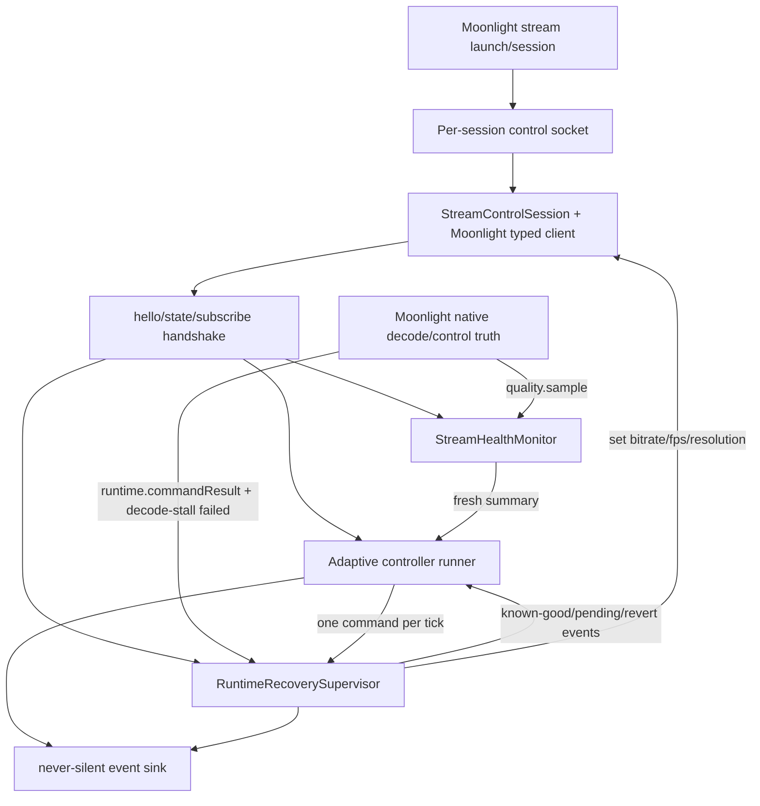
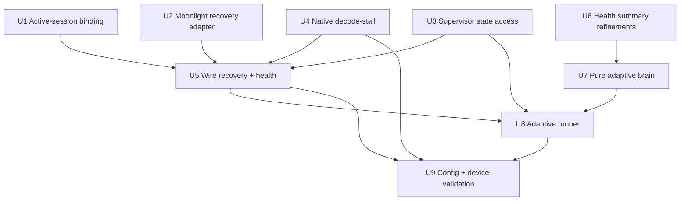

# feat: Build stream-control watchdog wiring and adaptive brain

## Summary

Finish the remaining safety wiring that makes unattended stream-setting changes safe, then add the first headless adaptive controller. The plan wires stream control to the active Moonlight session, completes decode-stall detection and recovery, and builds a continuous math-driven controller that consumes live health samples and dispatches bitrate/FPS/same-aspect resolution changes through the recovery supervisor.

---

## Problem Frame

Korri can now change runtime stream settings live, coerce requested values to the nearest achievable setting, and sample numeric stream health from the Moonlight client. What is still missing is the layer that safely acts on those facts: the active session must own the control socket, the safety supervisor must see decode-stall failures and revert them, and the adaptive controller must compute and apply changes without racing the stream or relying on preset quality rungs.

---

## Requirements

**Session wiring and safety**

- R1. Stream-control consumers bind to the active Moonlight stream session and its per-session control socket; they must not rely on a stale static `MOONLIGHT_LOCAL_CONTROL_SOCKET` environment value.
- R2. The live session setup subscribes once to local-control events and starts/stops all enabled session consumers together: health monitor, recovery supervisor, and — only when explicitly enabled and safety-ready — adaptive controller.
- R3. Resolution changes do not report caller-visible `applied` at host ACK time alone. For resolution, `applied` is held until the Moonlight client decodes a frame at the new geometry; if no frame arrives within a bounded window, the command surfaces as terminal failure over the existing local-control outcome channel, with enough detail to distinguish decode-stall in logs and tests.
- R4. The recovery supervisor is wired to real Moonlight control commands and terminal results, seeded from launch/current applied baseline, and auto-reverts failed/timed-out/decode-stalled changes to last known-good.
- R5. Recovery and controller decisions are never silent: every revert, unrecoverable condition, dispatched adaptive change, and dormant controller reason reaches a structured event sink.
- R6. Platform stream modules remain streamer-agnostic; Moonlight wire/protocol parsing stays inside the Moonlight plugin adapter and is injected into platform orchestration through ports/factories.

**Adaptive controller behavior**

- R7. The adaptive controller consumes Layer 4 `StreamHealthSummary` values and produces continuous math-derived targets, not a fixed quality ladder or preset menu.
- R8. The controller only emits same-aspect resolution scaling; it never requests a different stream aspect ratio or any reshape/stretch behavior.
- R9. The controller respects the global mutation latch by dispatching at most one setting family per tick and by pausing while any mutation is in flight.
- R10. The controller pauses when health samples are stale/no-data or the stream is not in a live streaming state; it does not guess from old measurements.
- R11. The controller exposes a headless latency-vs-quality objective bias with safe defaults; GUI/slider surfacing is explicitly deferred.

**Validation and rollout**

- R12. Device validation remains explicit for live telemetry values, decode-stall timeout tuning, visual never-stretch checks, and adaptive behavior under real network changes.
- R13. The adaptive validation matrix covers bandwidth collapse/recovery, jitter/loss bursts, AP/LAN roam or link flap, disconnect/reconnect, and steady-state recovery after conditions improve.

---

## Scope Boundaries

- No GUI, portal slider, or in-session overlay controls. This plan is headless/session/runtime infrastructure only.
- No external watchdog process, screenshot scraper, ping/iperf probe, or `korri stream show` polling loop. The watchdog signal comes from Moonlight decode truth over local-control.
- No arbitrary aspect-ratio support, letterbox-as-feature, or stream reshape. Resolution adaptation is scale-only along the stream's fixed aspect ratio.
- No non-H.264 codec productization. The first controller operates on the currently validated H.264 path.
- No replacement of Moonlight/Sunshine plugin architecture. The plan adds seams and adapters where needed but does not perform the broader plugin-model refactor.
- No machine-learning or perceptual scoring model. The first controller uses the numeric network/decode health already available.

### Deferred to Follow-Up Work

- GUI latency/quality slider and player-facing explanations: Layer 6.
- In-session overlay for recovery/adaptation notices: tracked separately in `01KWN0KHT7CF3YXHWXTSCYMFNS`.
- Non-H.264 runtime setting support: tracked separately in `01KWMZZCC2MN2WCZ948GRMSXDK`.
- Host-side encode/capture health telemetry: later senses expansion if client-side telemetry proves insufficient.
- More sophisticated controller families such as PID control or perceptual-quality scoring: future tuning after the conservative controller is device-validated.

---

## Context & Research

### Relevant Code and Patterns

- `docs/acceptance/runtime-settings-protocol-contract.md` defines accept-and-adapt, scale-only geometry, global sequencing, applied truth, and recovery ownership.
- `docs/korri-stream-layer3-safety-net-scope.md` is the authoritative Layer 3 safety framing: no external watcher, decode-truth in Moonlight, recovery policy in Korri.
- `work/items/active/01KWN75WS4TFB2WQDC1FF33XDW-accept-and-adapt-foundation/plan.md` captures completed Layer 2 behavior: bitrate/FPS clamp, same-ratio rounding tolerance, CLI coercion visibility.
- `work/items/active/01KWNSXR8H87GJ720M51K1HH31-senses-stream-health-telemetry/plan.md` captures completed Layer 4 sensing: native `quality.sample`, health monitor, session adapter, CLI rendering.
- `product/platform/stream/runtime-recovery.ts` is the pure reducer pattern for known-good bookkeeping and revert decisions.
- `product/platform/stream/runtime-recovery-supervisor.ts` is the live supervisor pattern: platform-owned port, terminal result ingestion, never-silent event sink.
- `product/platform/stream/stream-health.ts` and `product/platform/stream/stream-health-monitor.ts` provide the rolling health window the controller should consume.
- `product/platform/stream/stream-health-session.ts` adapts opaque stream-control events into platform health samples without importing Moonlight plugin types.
- `product/platform/stream-control/stream-control-session.ts` defines the plugin-agnostic session contract; command/query return values are intentionally opaque.
- `product/plugins/moonlight/src/stream-control/session.ts` adapts `MoonlightControlClient` to `StreamControlSession`; Moonlight-specific request/result extraction belongs in this plugin layer.
- `product/plugins/moonlight/src/moonlight-control-protocol.ts` defines the local-control event schema; any additive decode-stall reason belongs here and in the native patch.
- `product/plugins/moonlight/packages/moonlight-embedded-korri/patches/0016-add-stream-health-sampling.patch` is the current native telemetry patch and the likely place to add decode-stall first-frame facts, or a later patch may layer on top if cleaner.
- `product/apps/portal/api/stream-control/service.ts` still resolves generic control through plugin descriptions/actions; active-session binding must replace static socket dependence for live session consumers.
- `product/apps/portal/stream/moonlight-launcher.ts` creates per-session control handles; the session lifecycle wiring must use this launch/session truth rather than process-wide env.
- `tools/testing/nix/korri-moonlight-control-protocol-patch-check.nix` is the native patch invariant + compile gate to extend for decode-stall markers.

### Institutional Learnings

- `docs/solutions/architecture-patterns/stream-control-command-outcome-contract-2026-06-03.md`: `command.accepted` is not applied; displayed/current values and recovery must trust readback/applied truth.
- `docs/solutions/architecture-patterns/gamescope-runtime-control-contract-2026-06-02.md`: shared runtime state must serialize through one queue/FIFO and explicit non-success states must not be collapsed into vague errors.
- `docs/solutions/design-patterns/explicit-cascade-folded-policy-over-incidental-signal-heuristics-2026-05-27.md`: the component that knows a fact records it. The controller should consume explicit health fields and emit explicit policy/target events, not infer from incidental timing or socket behavior.
- `docs/solutions/architecture-patterns/korrid-device-state-subscriptionref-2026-07-01.md`: device facts flow through typed state surfaces, not duplicate sysfs readers. If later power/thermal constraints enter the controller, they should come through the existing device-state pattern.
- `docs/solutions/best-practices/derive-component-states-from-state-machines-2026-06-25.md`: state-heavy controllers should use exhaustive tagged states so new states do not silently go unhandled.
- `docs/solutions/workflow-issues/generic-game-stream-runner-validation-contract-2026-05-19.md`: physical device validation is the acceptance bar for visual/product claims; unit tests prove protocol behavior, not what the user sees.

### External References

- None. The decisive constraints are repo-specific protocol, native patch, and device lifecycle behavior; external research would add little beyond the internal patterns already available.

---

## Key Technical Decisions

- **Use one per-session orchestration seam with injected streamer ports.** Health monitoring, recovery supervision, and adaptive control should start and stop with the live stream session, but platform orchestration receives streamer-specific control/recovery factories from the plugin/product edge rather than importing Moonlight adapters. Rationale: prevents stale socket targeting while preserving the platform/plugin boundary.
- **Resolve active-session binding before autonomous control.** Any implementation that targets a static `MOONLIGHT_LOCAL_CONTROL_SOCKET` is out of scope for the brain/watchdog path. Rationale: autonomous control against a stale socket is worse than no control.
- **Keep platform pure and plugin adapters typed at the edge.** Platform controller/recovery modules use local types and ports; the Moonlight plugin extracts `requestId`, parses `runtime.commandResult`, and handles Moonlight-specific event schema. Rationale: preserves streamer-agnostic architecture.
- **Hold resolution `applied` until decode confirms, then express decode-stall over the existing terminal outcome channel.** Sunshine's host ACK is necessary but not sufficient for resolution success. For resolution only, the native client must delay caller-visible `applied` until first decoded frame at the new geometry, or emit `failed` with additive reason/detail when the decode window expires. Bitrate/FPS keep the existing host-ack terminal semantics. Rationale: if host-applied were emitted first, recovery would clear pending and ignore a later decode-stall.
- **Pause rather than guess.** If the session is not streaming, samples are stale/no-data, capability is unknown, or any mutation is pending, the controller emits a dormant reason and does nothing. Rationale: unattended adaptation must fail safe.
- **Conservative first controller: bitrate first, FPS second, resolution third.** Bitrate is the primary bandwidth lever; FPS tunes frame pacing/latency; resolution is a tertiary pixel-density lever used only when bitrate/FPS are insufficient and safety conditions are good. Rationale: minimizes visual disruption and avoids unnecessary decoder reopens.
- **Continuous setpoint with damping, not a rung selector.** The controller computes numeric targets from health summaries and objective bias; damping/deadband suppresses tiny changes. Rationale: matches the user's north star and depends on Layer 2 accept-and-adapt.
- **Controller reads confirmed/applied state, not just its last request.** Seed from the applied state snapshot at session start. The authoritative aspect source for all resolution math is that confirmed applied stream resolution (falling back to launch baseline only when readback is absent); all later resolution targets scale that fixed ratio. After reverts, the controller must not immediately reapply the reverted bad target. Rationale: avoids oscillation and honors applied truth.
- **Feature-gate automatic adaptation for rollout.** The headless controller should be configurable and safe to keep disabled until the device validation gate passes. Rationale: it mutates live user streams unattended.

---

## Open Questions

### Resolved During Planning

- Should this be one plan or separate watchdog/brain plans? One plan, because both depend on the same active-session lifecycle seam and the brain must dispatch through the recovery supervisor.
- Should the watchdog be an external process? No. It is in-client decode truth plus normal recovery commands.
- Should the controller use a preset quality ladder? No. It uses continuous computed targets with damping/deadband.
- Should resolution adaptation support arbitrary aspect ratios? No. Scale-only along the fixed stream ratio.
- Should GUI/portal controls be included? No. Headless defaults/config only; GUI last.

### Deferred to Implementation

- Exact native patch number and hunk ownership for decode-stall (`0016` extension versus a new follow-up patch): decide after applying the current patch stack in a dev checkout.
- Exact first-frame timeout constant: compile with a conservative default, tune on device.
- Exact controller constants: initial defaults should be conservative and test-covered; live tuning can adjust after device observation.
- Exact production call site for session orchestration: implementation should locate the active stream lifecycle owner and wire there, but must preserve the per-session socket contract.
- Whether decode-stall reason is represented as an optional event field, diagnostic detail, or existing failed reason in native code: choose the smallest additive shape that keeps schema compatibility and logging clarity.

---

## High-Level Technical Design

> *This illustrates the intended approach and is directional guidance for review, not implementation specification. The implementing agent should treat it as context, not code to reproduce.*

The platform modules own policy and state machines; the Moonlight plugin owns wire parsing and command result extraction. Native Moonlight exposes facts (`quality.sample`, `runtime.commandResult`, optional decode-stall detail); Korri decides when to revert or adapt.

---

## Phased Delivery

### Phase A — Make the live session seam real

Bind stream control to the active per-session socket, define ownership of the active `{ sessionId, socketPath }` record, perform hello/state/subscribe once, seed baseline/current settings, and start enabled health/recovery consumers as session-scoped resources. The adaptive controller is not started in this phase unless its explicit safety gate is already satisfied.

### Phase B — Complete the safety net

Add native decode-stall detection, wire the recovery supervisor to real Moonlight command/results, expose pending/known-good state needed by the controller, and device-tune the first-frame window.

### Phase C — Build the conservative brain

Add health-summary refinements, the pure target computation, and the runner that dispatches one safe mutation per tick through the recovery supervisor.

### Phase D — Roll out behind config and validate on hardware

Enable only when configured, deploy to target devices, and validate telemetry, recovery, and adaptation with a human on the screen.

---

## Implementation Units

### U1. Active-session stream-control binding and lifecycle seam

**Goal:** Create the session-scoped binding and lifecycle seam that owns the active control socket record, connection handshake, event subscription, baseline readback, and teardown. Concrete health/recovery/controller startup happens in later units through injected consumers.

**Requirements:** R1, R2, R4, R6, R10

**Dependencies:** None

**Files:**
- Create: `product/platform/stream/stream-session.ts`
- Test: `product/platform/stream/stream-session.test.ts`
- Create or modify: `product/apps/portal/stream/stream-control-session-registry.ts` (or the nearest active-session registry module discovered during implementation)
- Modify: `product/apps/portal/api/stream-control/service.ts`
- Modify: `product/apps/portal/stream/moonlight-launcher.ts` or the active stream lifecycle owner discovered during implementation
- Test: relevant existing portal/session test covering active session registration, replacement, and unregistration

**Approach:**
- Define who owns the active stream-control record: `{ sessionId, socketPath, registeredAt, close }`. The launch/session owner registers it when Moonlight starts and unregisters it on stream exit or setup failure.
- Define a platform-owned session runtime that accepts an already-open/connected stream-control session plus launch/current baseline facts, calls `hello`, `state`, and `subscribe` in a deterministic order, and exposes injection points for enabled consumers.
- Treat `subscribe()` as the seam's responsibility, not an incidental responsibility of health, recovery, or controller modules.
- Generic control descriptions and mutations should resolve against the active session record when one exists; when no active session exists, report disabled/unavailable instead of targeting stale env state.
- Return a closeable resource that stops injected consumers, unsubscribes event listeners, unregisters the active record, and closes the control session exactly once.

**Patterns to follow:**
- `product/platform/stream-control/stream-control-session.ts` for the opaque session boundary.
- `product/platform/stream/stream-health-monitor.ts` and `runtime-recovery-supervisor.ts` close/unsubscribe behavior.
- Existing plugin registry connection pattern in `connectStreamControlSession`.

**Test scenarios:**
- Happy path: a session runtime performs hello/state/subscribe before starting consumers and passes baseline/current settings to consumers.
- Edge case: no active session/socket yields disabled/unavailable state and no connection attempt.
- Error path: subscribe failure closes the session and reports setup failure without leaving partial consumers running.
- Lifecycle: closing the runtime stops all consumers and closes the session exactly once, even if called twice.
- Integration: registering a new active session replaces the previous socket; subsequent control state/actions target the new session, not stale env state.
- Lifecycle: unregistering a session disables generic stream-control state/actions and prevents future controller/recovery dispatch to that socket.

**Verification:**
- Session wiring tests prove subscription ordering, cleanup, and active socket replacement; no production path for the adaptive/recovery stack uses static socket env as its primary active-session binding.

---

### U2. Moonlight recovery-control adapter

**Goal:** Adapt Moonlight's typed local-control client/events to the platform `RuntimeRecoveryControlPort` without leaking Moonlight protocol types into platform modules.

**Requirements:** R4, R6

**Dependencies:** U1 can proceed in parallel, but live wiring depends on both.

**Files:**
- Create: `product/plugins/moonlight/src/stream-control/recovery-port.ts`
- Test: `product/plugins/moonlight/src/stream-control/recovery-port.test.ts`
- Modify: `product/plugins/moonlight/src/stream-control/session.ts` if the adapter needs access to the underlying typed client alongside the opaque session

**Approach:**
- Implement a plugin-owned adapter that calls Moonlight setters and extracts the native runtime-settings request id from `command.accepted` results.
- Return `undefined` for pre-effect local rejection/no request id, so the recovery supervisor does not track commands that never entered the native path.
- Filter `runtime.commandResult` events from the Moonlight event stream and map request id, command, status, and optional reason/detail into platform recovery results.
- Keep the platform `RuntimeRecoveryControlPort` unchanged except for additive state access needs handled in later units.

**Patterns to follow:**
- `moonlightSessionFromClient` in `product/plugins/moonlight/src/stream-control/session.ts`.
- Event parsing posture from `product/platform/stream/stream-health-session.ts`, but typed at the Moonlight plugin edge.
- Runtime supervisor port contract in `product/platform/stream/runtime-recovery-supervisor.ts`.

**Test scenarios:**
- Happy path: `setBitrate`/`setFps`/`setResolution` return the request id from a `command.accepted` result.
- Edge case: an accepted response without a usable request id returns `undefined` and does not throw.
- Error path: transport failure rejects so the supervisor can surface unrecoverable/revert-failed behavior.
- Event filtering: only `runtime.commandResult` events are forwarded; unrelated `quality.sample` and lifecycle events are ignored.
- Optional detail: a native failure with decode-stall detail is preserved in the adapter's mapped result when the protocol exposes it.

**Verification:**
- Moonlight plugin tests prove request id extraction and event filtering without importing plugin types from platform stream modules.

---

### U3. Recovery supervisor state access for safe autonomous dispatch

**Goal:** Expose the minimal read-only state the adaptive runner needs: whether any mutation is pending and what the latest known-good applied settings are.

**Requirements:** R4, R9, R10

**Dependencies:** None, but U7 depends on it.

**Files:**
- Modify: `product/platform/stream/runtime-recovery.ts`
- Test: `product/platform/stream/runtime-recovery.test.ts`
- Modify: `product/platform/stream/runtime-recovery-supervisor.ts`
- Test: `product/platform/stream/runtime-recovery-supervisor.test.ts`

**Approach:**
- Add pure helpers over `RuntimeRecoveryState` for "has any pending command" and read-only known-good snapshot.
- Expose those helpers through the live supervisor without allowing callers to mutate state.
- Preserve existing reducer semantics: conflicts/pre-effect rejections do not become known-good; failed/timed-out outcomes still revert or record unrecoverable.

**Patterns to follow:**
- Existing reducer-first design in `runtime-recovery.ts`.
- Existing `RuntimeRecoverySupervisor` return object style.

**Test scenarios:**
- Happy path: after a sent command, pending reports true until an applied/failed/timed-out terminal result arrives.
- Happy path: applied results update known-good; reverts update known-good only when their terminal applied result arrives.
- Edge case: pre-effect rejected command with no request id never sets pending.
- Error path: failed/timed-out command clears pending and triggers existing revert/unrecoverable behavior.
- Integration: live supervisor reflects pending/known-good changes as results arrive through the port.

**Verification:**
- Runtime recovery tests prove the controller can safely pause while pending and read confirmed state without breaking existing recovery behavior.

---

### U4. Native decode-stall detector over local-control outcomes

**Goal:** Complete the device-facing watchdog signal: a resolution change that reopens the decoder reports caller-visible `applied` only after first decoded frame at the new geometry, or reports terminal failure if no frame arrives in the configured window.

**Requirements:** R3, R4, R5, R12

**Dependencies:** U2 for event mapping shape; can be developed with U1/U3 in parallel.

**Files:**
- Modify or create: `product/plugins/moonlight/packages/moonlight-embedded-korri/patches/0016-add-stream-health-sampling.patch` or a follow-up patch in the same patch stack
- Modify: `product/plugins/moonlight/packages/moonlight-embedded-korri/README.md`
- Modify: `product/plugins/moonlight/src/moonlight-control-protocol.ts` if adding an optional result reason/detail field
- Test: `product/plugins/moonlight/src/moonlight-control-protocol.test.ts` if protocol schema changes
- Modify: `tools/testing/nix/korri-moonlight-control-protocol-patch-check.nix`

**Approach:**
- In native Moonlight, treat the host ACK for resolution as an intermediate host-applied fact, not yet caller-visible `applied`.
- Arm a one-shot first-frame timer when a resolution command causes the decoder to reopen for the new dimensions.
- Cancel the timer when the first decoded frame for the new geometry is observed, then emit the terminal caller-visible `applied` result for that request.
- If the timer expires before a decoded frame, emit a terminal `failed` outcome for the matching runtime command, preserving optional diagnostic detail/reason where additive schema allows.
- Do not emit `applied` before the decode-confirm/timeout decision for resolution; otherwise the recovery supervisor will clear pending and ignore a later stall. Bitrate/FPS terminal behavior stays unchanged.
- Do not implement a standing monitor. The timer exists only for an in-flight resolution mutation.
- Add Nix invariants that prove the decode-stall marker, first-frame timer marker, and local-control outcome emission remain present when patches refresh.

**Execution note:** Use the Moonlight patch dev-checkout/export workflow. Do not hand-edit coupled native patches blindly.

**Patterns to follow:**
- Native event/outcome plumbing in the runtime settings patches.
- Decode reopen paths already touched by the resolution-output-size patches.
- Health sampling's first-frame timing instrumentation in patch `0016`.

**Test scenarios:**
- Protocol happy path: a `runtime.commandResult` with optional decode-stall detail decodes while older events without the field still decode.
- Native invariant: the Nix patch check fails if decode-stall markers or first-frame timer markers are missing.
- Device happy path: a normal resolution change host-acks, decodes a frame before the window, then reports caller-visible applied.
- Device failure path: an induced bad/unsafe resolution path host-acks but produces no decoded frame, reports failed/decode-stall without first reporting applied, and the stream is reverted by Korri.
- Device tuning: normal decoder reopen latency does not trip the timeout under expected network/device load.

**Verification:**
- Nix patch check compiles; protocol tests pass if schema changed; device validation observes applied-vs-decode-stall distinction.

---

### U5. Wire recovery and health into the live stream session

**Goal:** Start the existing health monitor and recovery supervisor in the active session runtime, with baseline seeding, event sinks, and clean teardown.

**Requirements:** R2, R4, R5, R6, R10, R12

**Dependencies:** U1, U2, U3; U4 for full decode-stall behavior, though wiring can land before device tuning.

**Files:**
- Modify: `product/platform/stream/stream-session.ts`
- Test: `product/platform/stream/stream-session.test.ts`
- Modify: `product/platform/stream/stream-health-session.ts` if event subscription ownership requires small adapter adjustment
- Modify: `product/apps/portal/api/stream-control/service.ts` or the active stream lifecycle call site identified in U1
- Test: corresponding portal/session integration test

**Approach:**
- During session setup, read state once to seed launch/current applied bitrate, FPS, and resolution. Prefer applied runtime settings; fall back to stream quality/launch baseline only when applied readback is absent.
- Create the health sample port from the subscribed session and start `createStreamHealthMonitor`.
- Accept an injected `RuntimeRecoveryControlPort` or factory from the Moonlight/product edge, then start `createRuntimeRecoverySupervisor` with the seeded baseline. `product/platform/stream/stream-session.ts` must not import `product/plugins/moonlight/*`.
- Route recovery events to the existing stream-control recorder/log sink so reverts and unrecoverable states are visible without GUI work.
- Close health and recovery consumers when the stream ends, socket closes, or setup fails.

**Patterns to follow:**
- `createStreamControlEventRecorder` in `product/platform/stream-control/runtime-support.ts` for durable event recording.
- Health monitor and recovery supervisor close/unsubscribe semantics.

**Test scenarios:**
- Happy path: setup seeds baseline from state, starts health and recovery, and subscribes to events once.
- Edge case: state lacks applied resolution but stream quality has dimensions; baseline falls back safely.
- Error path: failed state read or failed subscribe prevents controller start and closes the session.
- Lifecycle: stream exit closes health/recovery and no later event mutates their state.
- Integration: a runtime failed result from the session reaches the recovery supervisor and emits a never-silent recovery event.

**Verification:**
- Session integration tests show recovery and health are live only for the active stream and are cleaned up on close.

---

### U6. Controller-ready health summary refinements

**Goal:** Add the derived health metrics the adaptive controller should consume so it does not embed fragile calculations or misuse raw totals.

**Requirements:** R7, R10

**Dependencies:** Existing Layer 4 senses; can run before U7.

**Files:**
- Modify: `product/platform/stream/stream-health.ts`
- Test: `product/platform/stream/stream-health.test.ts`

**Approach:**
- Add exactly one controller-facing derived metric in this tranche: `frameDropFraction` (or equivalently named), representing dropped frames divided by delivered-plus-dropped frames over the rolling window when enough data exists.
- Do not broaden the health-summary surface opportunistically; any additional metrics must be justified by a U7 test consuming them.
- Preserve existing summary fields for CLI/backward compatibility.
- Keep freshness semantics explicit: fresh/stale/no-data remain the controller's first gate.

**Patterns to follow:**
- Existing `summarizeNumeric` and `meanRatio` helpers in `stream-health.ts`.
- Existing tests for stale/no-data and delivery ratios.

**Test scenarios:**
- Happy path: a window with delivered FPS and dropped frames produces a bounded `frameDropFraction` signal.
- Edge case: missing delivered FPS, no dropped-frame data, or no samples leaves `frameDropFraction` undefined instead of dividing by zero.
- Edge case: stale data still reports stale freshness even if derived metrics are numerically available.
- Regression: existing bitrate/FPS delivery ratio and numeric summaries remain unchanged.

**Verification:**
- Stream health tests prove the controller consumes stable derived signals rather than raw window-size-dependent totals.

---

### U7. Pure adaptive controller brain

**Goal:** Implement the deterministic math that turns a fresh health summary, current known-good settings, confirmed baseline stream aspect, and objective bias into a continuous target or a dormant decision.

**Requirements:** R7, R8, R10, R11

**Dependencies:** U6

**Files:**
- Create: `product/platform/stream/stream-adaptive-controller.ts`
- Test: `product/platform/stream/stream-adaptive-controller.test.ts`

**Approach:**
- Define a platform-owned controller core with no timers and no I/O. Inputs include health summary, current known-good settings, confirmed baseline stream aspect/resolution bounds, objective bias, and conservative internal constants.
- Return either a dormant reason or a target with candidate bitrate/FPS/resolution changes.
- Compute an explicit objective score from three normalized pressures: bandwidth pressure (delivered/requested bitrate ratio + loss), latency pressure (RTT mean/trend/variance), and decode pressure (queue/decode time + `frameDropFraction`). The latency-vs-quality bias changes the relative cost of reducing FPS/resolution versus preserving quality.
- Estimate available headroom from delivered/requested bitrate ratio, loss, RTT trend/mean, queue/decode pressure, and frame-drop signal.
- Apply damping/deadband around continuous values so small noisy changes do not dispatch.
- Keep bitrate as the primary bandwidth lever; use FPS for latency/frame-pacing pressure; use resolution only when lower pixel density is needed to make reduced bitrate watchable or decode pressure is high.
- Compute resolution by scaling the confirmed baseline stream aspect proportionally and rounding to achievable even dimensions; never output a different aspect ratio.
- Avoid a `QualityLevel`/`tier` enum as controller state. Any internal step list for FPS candidates is only an actuator constraint, not a quality ladder.

**Technical design:** Directional decision matrix, not implementation specification:

| Input state | Controller decision |
|---|---|
| `freshness` is `no-data` or `stale` | Dormant; no command |
| RTT/loss high, delivery ratio low | Bandwidth pressure dominates; lower bitrate first |
| Latency-biased objective and sustained RTT pressure | Latency pressure carries higher cost; lower FPS after bitrate deadband threshold |
| Quality-biased objective with mild pressure | Prefer smaller bitrate adjustment over FPS/resolution reduction |
| Decode queue/drop pressure persists after bitrate/FPS relief | Decode pressure dominates; propose same-aspect resolution scale-down |
| Delivery ratio healthy, RTT/loss stable low | Negative pressure/headroom; gradually raise bitrate/FPS toward configured ceilings |
| Proposed change inside deadband | Dormant within hysteresis |

**Patterns to follow:**
- Pure reducer/function style from `runtime-recovery.ts`.
- Health summary type boundaries from `stream-health.ts`.

**Test scenarios:**
- Happy path: fresh healthy summary with current settings below ceiling proposes gradual quality increase within configured limits.
- Happy path: poor delivery/loss summary proposes bitrate reduction before FPS or resolution.
- Happy path: latency-biased objective under sustained RTT pressure proposes FPS reduction after bitrate threshold rules are satisfied.
- Happy path: persistent decode/queue pressure proposes a same-aspect resolution scale-down rounded to even dimensions.
- Edge case: stale/no-data summaries return dormant, not a target.
- Edge case: target inside deadband returns dormant within-hysteresis.
- Edge case: baseline/native dimensions never produce off-aspect output; resolution width/height remain proportional to the confirmed baseline aspect.
- Edge case: computed bitrate/FPS outside configured soft bounds are clamped to the controller's operating range, while mechanism-level Layer 2 clamp remains the final hardware truth.
- Regression: no fixed `QualityLevel`/preset rung is required to represent the controller output.

**Verification:**
- Pure controller tests cover objective bias, deadband, stale/no-data, same-aspect scaling, and dimension priority inputs without any socket or timer.

---

### U8. Adaptive controller runner and recovery-supervisor dispatch

**Goal:** Run the pure brain on a controlled cadence during an active session and dispatch at most one runtime setting change per tick through the recovery supervisor.

**Requirements:** R5, R7, R8, R9, R10, R11

**Dependencies:** U3, U5, U7

**Files:**
- Create: `product/platform/stream/stream-adaptive-runner.ts`
- Test: `product/platform/stream/stream-adaptive-runner.test.ts`
- Modify: `product/platform/stream/stream-session.ts`
- Test: `product/platform/stream/stream-session.test.ts`

**Approach:**
- The runner owns the tick clock and reads `StreamHealthMonitor.latestSummary(now)`, supervisor pending/known-good state, and injected lifecycle/streaming readiness from the session seam.
- If adaptive control is disabled, decode-stall/recovery safety is not ready, health is stale/no-data, a mutation is pending, capability is not ready, or the stream is not live, emit a dormant event and dispatch nothing.
- If the pure controller returns a target, choose only one changed setting for this tick using the conservative priority order: bitrate, then FPS, then resolution.
- Dispatch through the recovery supervisor setters, not directly through Moonlight, so all failures/reverts share the same known-good and event path.
- Emit structured controller events for dispatched and dormant decisions; record them through the same never-silent sink used for recovery.
- Stop the interval and ignore late async completions after close.

**Patterns to follow:**
- `createStreamHealthMonitor` close behavior.
- `createRuntimeRecoverySupervisor` event-sink design.
- Test doubles with injected clock/now functions from existing platform tests.

**Test scenarios:**
- Happy path: fresh poor-health summary dispatches one bitrate change on the tick.
- Priority: when target contains bitrate/FPS/resolution, only bitrate dispatches on the first tick; later ticks can dispatch the next dimension after pending clears and health still warrants it.
- Edge case: pending mutation causes dormant `pending` event and no dispatch.
- Edge case: stale/no-data summary causes dormant event and no dispatch.
- Edge case: closed runner clears interval and ignores late port promises.
- Error path: supervisor setter rejection emits an error/dormant event and does not update current-state estimates optimistically.
- Integration: after recovery supervisor emits a revert/known-good change, the next controller tick uses known-good state and does not immediately reapply the reverted bad target unless fresh health still justifies it after deadband/cooldown.

**Verification:**
- Runner tests prove one-dimension-per-tick, pending guard, stale guard, close cleanup, and event emission.

---

### U9. Headless configuration, rollout gate, and device validation runbook

**Goal:** Make the watchdog/brain deployable but safe: default-gated, observable through logs/CLI artifacts, and validated on bandai/aka with minimal human gates.

**Requirements:** R5, R11, R12, R13

**Dependencies:** U4, U5, U8

**Files:**
- Modify: `product/systems/nixos/images/platforms/rocknix-sm8550.nix` or the stream-control service/module that owns device defaults
- Modify: `docs/korri-stream-live-quality-runbook.md`
- Create or modify: `docs/acceptance/runtime-settings-adaptive-controller-gate.md`
- Modify: `product/surfaces/terminal/korri-cli/stream-quality.ts` only if a read-only status line is needed for controller/recovery observability
- Test: `product/surfaces/terminal/korri-cli/stream-quality.test.ts` if CLI output changes

**Approach:**
- Add headless configuration for enabling adaptive control and setting only the operator-facing objective bias. Keep internal deadband/cooldown/ceilings as code defaults until device validation proves extra knobs are needed. Automatic adaptation stays disabled unless explicitly enabled for validation or device profile rollout.
- Record recovery/controller events to the existing stream-control artifact/log path so the user and agent can inspect what happened without GUI work.
- Update the runbook with a validation matrix: Layer 2 coercion, Layer 4 health, Layer 3 decode-stall/revert, and Layer 5 adaptation under controlled network changes.
- Keep device-visual gates explicit: user validates on-screen no-stretch, real black/frozen recovery, and subjective playability.

**Patterns to follow:**
- Existing SM8550 H.264/control defaults in `rocknix-sm8550.nix`.
- Existing acceptance docs in `docs/acceptance/`.
- `korri stream show` display style if adding read-only status.

**Test scenarios:**
- Config happy path: disabled default does not start the adaptive runner but still allows health/recovery infrastructure when configured.
- Config happy path: enabled config passes objective bias to the runner; internal tuning constants are not exposed as user/device config in this tranche.
- CLI/read-only path: if a status line is added, show reports controller dormant/dispatched state without mutating the stream.
- Device validation: live `quality.sample` values are non-placeholder; `korri stream show` reports fresh health; bitrate/FPS/resolution adaptation emits events; induced decode-stall reverts; same-aspect scaling preserves geometry.
- Network validation: bandwidth collapse/recovery, jitter/loss burst, AP/LAN roam or link flap, and disconnect/reconnect each produce safe dormant/adaptive behavior and recover toward better settings when conditions improve.

**Verification:**
- Automated config/CLI tests pass; Nix build gates pass; device runbook captures manual validation results for both client and host sides plus the network-transition matrix.

---

## System-Wide Impact

- **Interaction graph:** Moonlight native patches emit facts; Moonlight plugin adapts wire protocol; platform stream modules own health/recovery/controller policy; portal/session lifecycle owns active session binding; CLI remains read-only for observation unless the user explicitly runs commands.
- **Error propagation:** Native decode-stall becomes a terminal local-control outcome; the recovery supervisor maps terminal failures to revert or unrecoverable events; the controller treats setup, stale data, pending commands, and transport failures as dormant/failed-safe states.
- **State lifecycle risks:** Active session replacement and teardown are critical. Consumers must close on stream exit and must not keep stale socket listeners, intervals, or pending async dispatches alive.
- **API surface parity:** Generic stream-control state/actions must resolve against the active session where applicable; platform modules must not import Moonlight types.
- **Integration coverage:** Unit tests cover reducers, adapters, session wiring, controller math, and runner sequencing; device validation covers native decode timing, real telemetry values, on-screen geometry, and autonomous adaptation feel.
- **Unchanged invariants:** Runtime settings remain individual commands, not a quality-profile command. The protocol remains facts-and-controls, not adaptation policy. Resolution remains scale-only along fixed aspect.

---

## Risks & Dependencies

| Risk | Likelihood | Impact | Mitigation |
|------|------------|--------|------------|
| Static socket/env path accidentally remains in autonomous path | Medium | High | Make active-session binding U1 and test stale socket replacement before controller wiring. |
| Native decode-stall timer false-positives during normal decoder reopen | Medium | High | Use conservative default, device-tune window, and require on-screen validation before enabling broadly. |
| Controller oscillates due to noisy samples | Medium | Medium | Start with EMA/deadband/cooldown and one-dimension-per-tick; pause on stale/pending. |
| Controller state diverges after revert | Medium | High | Read known-good from recovery supervisor and handle recovery events before computing next target. |
| Platform/plugin boundary erodes | Low | Medium | Keep wire parsing in `product/plugins/moonlight`; platform modules use local types/ports only. |
| Health metrics are present but misleading | Medium | Medium | Add derived drop-rate metrics and device-validate non-placeholder values before controller rollout. |
| User-facing failures stay invisible | Medium | Medium | Record structured recovery/controller events now; defer in-session overlay but keep logs/artifacts inspectable. |
| Trunk/device/origin drift makes validation non-reproducible | Medium | Medium | Rollout notes must include durable source pin/push/flake update before treating validation as product evidence. |

---

## Documentation / Operational Notes

- Update `docs/korri-stream-live-quality-runbook.md` with a single end-to-end validation flow for Layers 2–5.
- Add `docs/acceptance/runtime-settings-adaptive-controller-gate.md` for device validation evidence and manual gates.
- Keep `docs/acceptance/runtime-settings-protocol-contract.md` unchanged unless the decode-stall reason field requires a small additive clarification.
- Record that adaptive control is headless and gated; GUI/slider belongs to a later Layer 6 plan.
- Device validation should explicitly state what is automated versus what requires human screen inspection.

---

## Success Metrics

- A live stream session starts health monitoring, recovery supervision, and (when enabled) adaptive control from the active per-session socket and tears them all down on exit.
- A decode-stalled resolution change produces a terminal failure and triggers a recorded auto-revert to last known-good.
- The adaptive controller dispatches no commands when data is stale/no-data or a mutation is pending.
- Under synthetic tests, the controller chooses continuous targets consistent with objective bias and never emits off-aspect resolution.
- On device, `korri stream show` reports fresh numeric health, controller/recovery events are inspectable, manual validation confirms no stretch and successful recovery, and the network-transition matrix demonstrates safe behavior through degradation and recovery.

---

## Sources & References

- `docs/acceptance/runtime-settings-protocol-contract.md`
- `docs/korri-stream-layer3-safety-net-scope.md`
- `docs/korri-stream-live-quality-runbook.md`
- `work/items/active/01KWN75WS4TFB2WQDC1FF33XDW-accept-and-adapt-foundation/plan.md`
- `work/items/active/01KWNSXR8H87GJ720M51K1HH31-senses-stream-health-telemetry/plan.md`
- `work/items/parking-lot/01KWN2M3GSW2FQST7F3M7RX0V2-add-active-frozen-black-screen-watchdog-with-auto-revert-to-.md`
- `work/parking-lot/01KSXN94148T4616TA79KHQD9T-design-adaptive-stream-quality-ladder-with-hysteresis.md`
- `product/platform/stream/runtime-recovery.ts`
- `product/platform/stream/runtime-recovery-supervisor.ts`
- `product/platform/stream/stream-health.ts`
- `product/platform/stream/stream-health-monitor.ts`
- `product/platform/stream/stream-health-session.ts`
- `product/platform/stream-control/stream-control-session.ts`
- `product/plugins/moonlight/src/stream-control/session.ts`
- `product/plugins/moonlight/src/moonlight-control-protocol.ts`
- `product/apps/portal/api/stream-control/service.ts`
- `product/apps/portal/stream/moonlight-launcher.ts`
