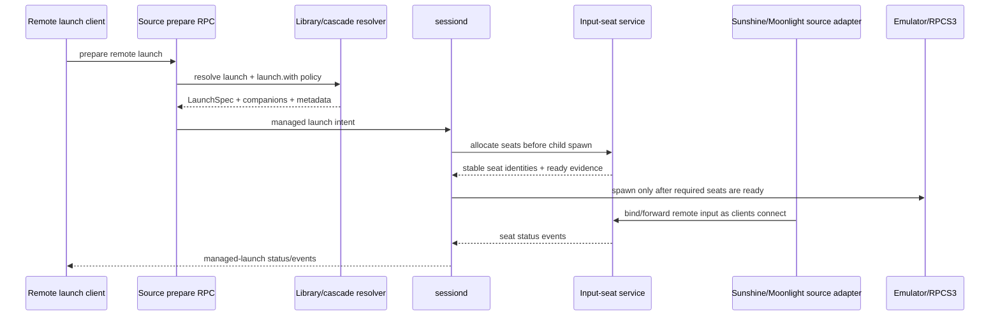
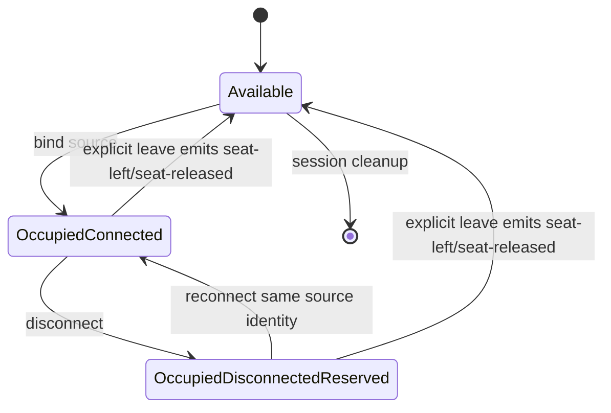
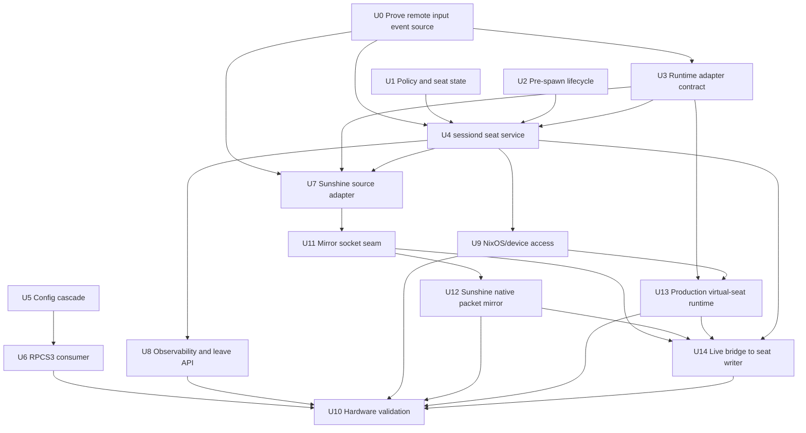
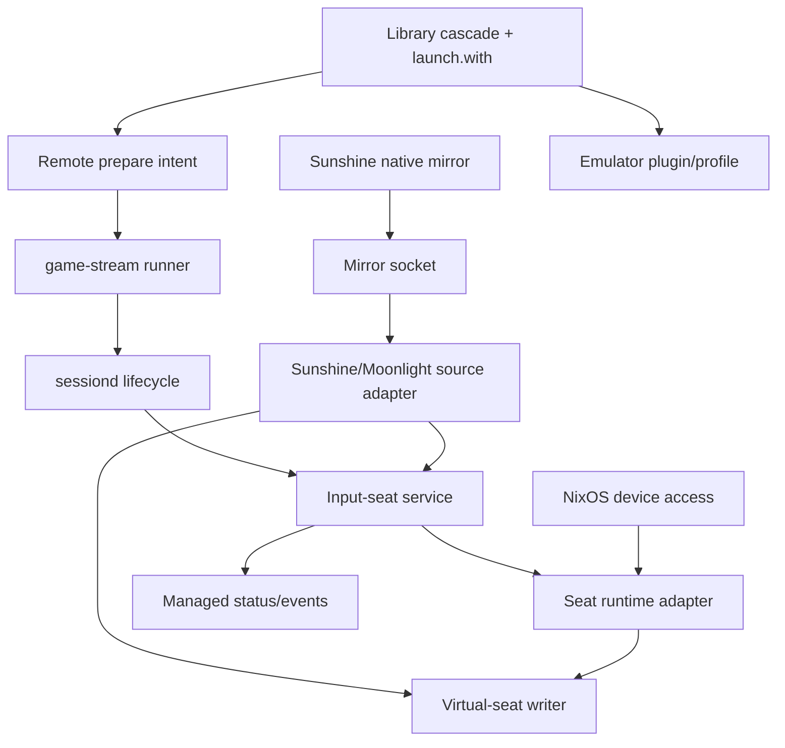

# feat: Add sessiond remote input-seat service

## Summary

Build a generic sessiond-owned input-seat capability for remote emulator launches. Remote launches will pre-create emulator-visible Korri controller seats before spawning the game, expose seat state through the existing managed-launch status/event surfaces, and route Sunshine/Moonlight input through an adapter into those stable seats.

---

## Problem Frame

Remote emulator launches currently depend on stream-client timing: Sunshine creates its virtual controller lazily after client input arrives, while boot-scan emulators such as RPCS3 can scan input before that device exists. Skate 3/RPCS3 proved the failure mode: the stream starts, but the controller is invisible until a restart or manual workaround (see origin: `work/items/active/01KWTZ3DDBRFV3GAJFFDRR7Z57-sessiond-remote-input-seats/item.md`).

The fix should not be RPCS3-specific. Controller readiness should become a foreground-session precondition owned by sessiond, with emulator plugins consuming stable seat identities instead of source-specific Sunshine device names.

---

## Requirements

- R1. sessiond exposes a generic input-seat service that allocates emulator-visible seats for a managed game session before the emulator process is spawned.
- R2. Remote launches for runtimes that declare safe extra-seat support default to a full P1-P4 seat pool, while releases and release profiles can opt down through the normal config cascade. Unknown or unvalidated runtimes do not silently inherit P1-P4.
- R3. If required seats cannot be created, verified, or uniquely identified, the managed launch fails during sessiond pre-spawn readiness before emulator spawn with a clear input-related failure.
- R4. Seat state is observable through managed-launch status, lifecycle events, and structured logs, including available, occupied-connected, occupied-disconnected-reserved, and released cases.
- R5. Remote input is modeled behind an adapter boundary: Sunshine/Moonlight is the first source adapter, while a Korri-native remote input protocol remains possible later.
- R6. Disconnect and intentional leave are distinct: disconnect reserves the source's seat for reconnect; explicit leave releases that seat for another player/source.
- R7. Verification proves the generic contract with unit/integration tests, then validates hardware behavior with Skate 3/RPCS3 and one second emulator or runtime.
- R8. The Sunshine-side event mirror must publish bounded, launch-scoped, gamepad-only frames into a stable local socket contract before the TypeScript adapter writes them into Korri-owned seats.

---

## Scope Boundaries

- This plan does not build user-facing UI for seat status, seat reservation, or leave-seat controls. It exposes the API/status/events first.
- This plan does not decide whether local physical controllers should always route through Korri virtual seats. That question remains parked in `work/items/parking-lot/01KWTW9DBY5NN34BVN7CMXQ8W3-explore-unified-local-and-remote-controller-routing-through-.md`.
- This plan does not build the Korri-native remote input protocol; it leaves a source-adapter seam for it.
- This plan does not solve every emulator's input mapping vocabulary. It integrates RPCS3 as the first consumer and validates one additional runtime to prove the seat lifecycle is not RPCS3-only.
- This plan does not rely on sleep delays, synthetic "wiggle" input, or restarting the emulator after stream connection.

### Deferred to Follow-Up Work

- Build UI/overlay/client affordances for "leave seat", stale-seat operator actions, and seat status.
- Explore unified local and remote controller routing through Korri virtual seats (`01KWTW9DBY5NN34BVN7CMXQ8W3`).
- Design and implement a Korri-native remote input protocol to replace or supplement the Sunshine/Moonlight source adapter.
- Extend neutral `preferences.input` vocabulary after the stable device-identity contract is proven.
- Add reservation timeouts and richer user/participant identity once the first source-session identity contract is proven.

---

## Context & Research

### Relevant Code and Patterns

- `product/services/device/sessiond.ts` owns managed-launch lifecycle, status, SSE events, role handoff, lifecycle hook cleanup, and terminal restore behavior.
- `product/services/device/sessiond-role.ts` already has a role-level `beforeChildLaunch` phase, but plugin lifecycle hooks currently only support `afterChildRunning` and `cleanup` in `product/platform/plugin/session-lifecycle.ts`.
- `product/platform/library/sessiond-managed-launch-protocol.ts` documents additive-only managed-launch protocol evolution and capability flags.
- `product/plugins/cdp-input-bridge/src/session-lifecycle-hook.ts` is the closest hook precedent for input-adjacent session resources, configurable process management, and fail-launch behavior.
- `product/platform/input/native/inputplumber-virtual-gamepad.ts` and `product/platform/input/native/discover-devices.ts` are the existing `/proc/bus/input/devices` discovery and stable virtual-controller resolution patterns.
- `product/platform/library/config/inheritable-fields.ts` and `product/platform/library/config/cascade-resolver.ts` define the cascade fields and `launch.with` provider map used for launch companion policy.
- `product/apps/portal/api/stream/prepare.rpc-handler.ts` writes remote-source launch intents with resolved `LaunchSpec`, `launchCompanions`, `launchMetadata`, and artifacts; this is how remote prepared launches carry seat policy to the source machine.
- `product/services/device/game-stream-runner.ts` forwards prepared launch companions and metadata into sessiond-managed launches.
- `product/plugins/rpcs3/src/input-policy.ts`, `product/plugins/rpcs3/src/input-mapping.ts`, `product/plugins/rpcs3/src/input-config-render.ts`, and `product/plugins/rpcs3/src/materializer.ts` provide the RPCS3 input profile authoring surface that must consume stable Korri seat names.
- `product/platform/input-seat/sunshine-input-seat-mirror-socket.ts` defines the local bounded NDJSON socket contract that the native Sunshine packet mirror must publish into.
- `work/items/active/01KWM7Q408P6VW6RWR66SE6R3R-rpcs3-input-config-authoring/convergence-note.md` defines the boundary between emulator profile authoring and runtime controller ownership.

### Institutional Learnings

- `docs/handoffs/bandai-inputplumber-xb360-controller-normalization-2026-06-09.md`: virtual controller identity is a product contract; normalize at the input layer rather than patching every consumer.
- `docs/solutions/integration-issues/steam-uinput-permissions-block-virtual-xinput-2026-06-13.md`: `/dev/uinput` permissions must be correct before non-root services create or consume virtual devices.
- `docs/solutions/architecture-patterns/sessiond-operator-model-2026-05-29.md`: sessiond is the operator model and `beforeChildLaunch` is the right lifecycle slot for pre-spawn readiness gates.
- `docs/solutions/design-patterns/explicit-cascade-folded-policy-over-incidental-signal-heuristics-2026-05-27.md`: runtime behavior should come from explicit cascade policy, not argv/env/device-name heuristics.
- `docs/solutions/runtime-errors/sessiond-sse-stream-killed-by-bun-idle-timeout-2026-05-27.md`: lifecycle events must ride the existing heartbeat-protected managed-launch SSE stream rather than a new fragile side channel.
- `docs/solutions/runtime-errors/steam-manual-launch-x86-eager-xwayland-dbus-readiness-2026-05-26.md`: readiness must be a domain signal, not process existence or a fixed delay.
- `docs/solutions/architecture-patterns/physical-host-foreground-lifecycle-truth-is-sessiond-2026-05-29.md`: sessiond should remain the single lifecycle truth; input-seat state should not create a parallel authority.

### External References

- Linux uinput kernel docs: `https://www.kernel.org/doc/html/latest/input/uinput.html` — virtual input device lifecycle and readiness constraints.
- libevdev docs: `https://www.freedesktop.org/software/libevdev/doc/latest/` — safer uinput creation and device-node discovery helpers.
- Sunshine source and `60-sunshine.rules`: Sunshine creates Linux virtual pads lazily from controller-arrival/input packets and grants `/dev/uinput` / virtual-pad access through udev rules.
- InputPlumber docs/source: InputPlumber eagerly creates target devices and exposes stable virtual Xbox target metadata through `/proc/bus/input/devices`.

---

## Key Technical Decisions

| Decision | Rationale |
|---|---|
| sessiond owns input-seat lifecycle | Seat readiness is part of foreground-session correctness; sessiond already owns launch, termination, restore, status, and event emission. |
| Device mechanics sit behind ports/adapters | sessiond should not become a raw input daemon. uinput/InputPlumber/Sunshine-specific work stays behind small injected runtime interfaces. |
| Korri creates emulator-visible uinput seats | Sunshine's Linux virtual pads are lazy and cannot be relied on before emulator boot. The first Sunshine/Moonlight adapter supplies remote input events, not the emulator-visible device lifecycle. |
| Full P1-P4 pool is the default | Boot-scan emulators and drop-in players need the seats present up front. Releases and release profiles can opt down for games that misbehave with extra pads. |
| Seat policy rides the existing cascade through `launch.with` | `launch.with` already carries provider-keyed launch companion policy through launcher, release, profile, and override layers into sessiond. It avoids inventing a new top-level config field for the first slice. |
| Stable seat identity is policy, not runtime accident | Emulator plugins should write predictable Korri seat names into their configs before launch; sessiond allocation verifies matching devices rather than discovering arbitrary Sunshine names after the fact. |
| Use existing input failure kinds initially | Clear messages and seat events can explain seat failures while reusing `input-unavailable` and `input-ambiguous`, avoiding unnecessary managed-launch wire-literal churn in the first slice. |
| Seat events use managed-launch status/SSE | Existing clients already understand launch-scoped status/events and heartbeat behavior; a separate input-seat events channel would create a second lifecycle truth. |
| Sunshine publishes to a bounded local NDJSON socket | The TypeScript side owns strict decode, launch filtering, rate limiting, and seat state; the native Sunshine patch only needs to mirror sanitized controller packet frames into a known local contract. |

---

## Open Questions

### Resolved During Planning

- Should this be RPCS3-specific? **No.** The plan builds a generic sessiond input-seat service and uses RPCS3/Skate 3 as the first hardware proof.
- Should Sunshine own emulator-visible virtual pads? **No for the first slice.** Sunshine pads are lazy; Korri creates stable uinput seats and uses Sunshine/Moonlight as a remote input source adapter.
- Should local physical controllers be routed through the same virtual-seat layer now? **No.** That is deferred to `01KWTW9DBY5NN34BVN7CMXQ8W3`.
- Should late-created seats be acceptable? **No.** Required seats must be verified before emulator spawn.
- What is the concrete Sunshine/Moonlight event extraction path? **Sunshine-side packet mirror.** Sunshine should mirror sanitized controller-domain packets to the sessiond/input-seat socket contract; Korri-created seats remain emulator-visible owners.
- Should extra seats be opt-in or opt-out? **Opt-out for validated runtimes.** Full P1-P4 pool is the default for remote-capable runtimes that declare safe extra-seat support; releases and profiles can reduce it. Unknown runtimes must explicitly opt in or stay at a conservative minimum.

### Deferred to Implementation

- Exact native Sunshine packet-field mapping: validate the downstream patch against Sunshine's current controller packet structs during implementation and keep the TypeScript socket schema stable unless the native API forces a documented adjustment.
- Exact production uinput implementation path: choose the smallest production-safe adapter after confirming available dependencies in the Nix closure. The plan requires a real seat runtime/writer, not only the test in-memory port.
- Exact second emulator/runtime for hardware proof: choose a runtime already launchable on the target hardware and representative of a different input path than RPCS3.

---

## Output Structure

Expected new/expanded layout; implementation may adjust names if the same boundaries are preserved.

```text
product/platform/input-seat/
  policy.ts
  seat-state.ts
  seat-runtime-port.ts
  remote-input-source.ts
  sunshine-remote-input-source.ts
  sunshine-input-seat-mirror-socket.ts
  device-identity.ts
product/services/device/
  sessiond-input-seat.ts
product/plugins/rpcs3/src/
  input-seat-policy.ts
```

The implementation-unit file lists below are authoritative; this structure sketch highlights the new platform/service modules rather than every touched protocol, NixOS, Moonlight, and test file.

---

## High-Level Technical Design

> *This illustrates the intended approach and is directional guidance for review, not implementation specification. The implementing agent should treat it as context, not code to reproduce.*



Seat state is explicit and session-scoped:



`Released` is an event, not a durable assignable state: explicit leave emits `seat-left`/`seat-released` and returns the durable seat state to `Available` for same-session reassignment. For the first slice, `OccupiedDisconnectedReserved` has no timeout; a disconnected source identity's seat is reserved until explicit leave or terminal session cleanup. Reservation timeouts are deferred follow-up work.

Implementation-unit dependencies:



---

## Implementation Units

### U0. Prove one concrete Sunshine/Moonlight event-source path

**Goal:** De-risk the central adapter premise before production sessiond/input-seat implementation depends on it.

**Requirements:** R1, R5, R7

**Dependencies:** None

**Files:**
- Create: `docs/acceptance/remote-input-event-source-spike.md`
- Inspect/possibly modify later production targets only after choosing a path: `product/vendor/sunshine-korri/`, `product/plugins/moonlight/packages/moonlight-embedded-korri/patches/`, `product/plugins/moonlight/src/moonlight-control-protocol.ts`, or source-host evdev discovery under `product/platform/input/native/`

**Approach:**
- Prove exactly one source-host event path that can supply remote controller events independently of the emulator-visible Korri seats.
- Compare two viable paths before choosing: (A) extend Sunshine/Moonlight local-control to emit raw validated gamepad events to the source host, or (B) read Sunshine-created source-host evdev pads and forward their gamepad events into Korri seats.
- Record permissions, filtering, disconnect behavior, latency/rate behavior, and feedback-loop avoidance for the chosen path.
- Do not proceed to production U4/U7 wiring until the acceptance note identifies the chosen event path and names its production file targets.

**Test scenarios:**
- Hardware proof: a Moonlight/Sunshine remote controller event is observable on the source host without relying on emulator boot timing.
- Error path: the source path cannot feed events back into its own input source or create duplicate controller loops.
- Error path: event-source permissions are either least-privilege or explicitly documented as requiring a gated NixOS opt-in.
- Edge case: source disconnect is observable separately from explicit leave.

**Verification:**
- The plan has a concrete, buildable event-source choice before sessiond and emulator integrations depend on remote event forwarding.

---

### U1. Define input-seat policy, identity, and state model

**Goal:** Create the pure domain model for seat policy, stable seat identities, and seat lifecycle states without touching sessiond orchestration yet.

**Requirements:** R1, R2, R4, R6

**Dependencies:** None

**Files:**
- Create: `product/platform/input-seat/policy.ts`
- Create: `product/platform/input-seat/device-identity.ts`
- Create: `product/platform/input-seat/seat-state.ts`
- Test: `product/platform/input-seat/policy.test.ts`
- Test: `product/platform/input-seat/device-identity.test.ts`
- Test: `product/platform/input-seat/seat-state.test.ts`

**Approach:**
- Define a strict Effect Schema policy for the input-seat companion: enabled/disabled, player count, source adapter choice, seat naming target, runtime extra-seat capability, and opt-down behavior.
- Model the default seat pool as four stable player seats; a resolved policy can reduce the active pool but cannot exceed supported launcher/device capability.
- Define seat identity as a stable emulator-facing descriptor, not just a name: slot, player index, safe display name, backend/device class, capability profile, VID/PID where used, phys/uniq strategy where available, runtime device path, and readiness evidence. Stable seat names must be strict safe strings (bounded length; no newline, quote, backslash, or config-control characters) because emulator plugins may write them into config files.
- Model seat state as an explicit ADT with cases for available, occupied-connected, occupied-disconnected-reserved, and released.
- Distinguish durable user identity from first-slice source identity. User/participant accounts stay deferred, but binding/reconnect/leave must carry a launch-scoped remote source identity so stale or wrong-launch sources cannot claim or release a seat.

**Execution note:** Implement the pure policy/state tests first; they become the executable specification for later sessiond units.

**Patterns to follow:**
- `product/plugins/rpcs3/src/input-policy.ts`
- `product/platform/library/config/inheritable-fields.ts`
- `product/platform/session/foreground-session-lifecycle.ts`

**Test scenarios:**
- Happy path: omitted policy resolves to enabled full P1-P4 defaults for a remote managed launch context.
- Happy path: release/profile opt-down resolves to fewer seats while preserving deterministic P1-first ordering.
- Edge case: player count zero disables seat allocation without failing decode.
- Error path: player count greater than the supported maximum fails strict policy decode.
- Error path: unknown policy keys fail strict decode.
- Error path: seat identity names containing newline, quote, backslash, or config-control characters fail strict decode.
- Happy path: disconnect transitions an occupied seat to occupied-disconnected-reserved without releasing the emulator-visible seat.
- Happy path: explicit leave transitions an occupied or reserved seat to released.
- Edge case: reconnect with the same launch-scoped source identity reuses the reserved seat; a different or stale source identity does not.

**Verification:**
- The input-seat domain can be exercised without sessiond, uinput, or Sunshine dependencies.

---

### U2. Add sessiond pre-spawn input readiness gate

**Goal:** Add a sessiond-owned pre-spawn readiness gate for input-seat allocation after the role yields the foreground surface but before the child emulator process is spawned, without turning this slice into a broad plugin lifecycle framework.

**Requirements:** R1, R3, R4

**Dependencies:** U1

**Files:**
- Modify: `product/services/device/sessiond.ts`
- Create: `product/services/device/sessiond-pre-spawn.ts` if the helper boundary needs to be shared between sessiond and the input-seat service
- Test: `product/services/device/sessiond.test.ts`
- Test: `product/services/device/sessiond-pre-spawn.test.ts` if a helper is introduced

**Approach:**
- Add an internal pre-spawn readiness gate to sessiond rather than a general-purpose plugin hook API. Existing plugin lifecycle hooks that only implement after-child and cleanup behavior remain unchanged.
- Invoke the input-seat readiness gate after `SessionRole.beforeChildLaunch()` completes and before sessiond marks the game running or calls the launcher spawn path.
- Treat pre-spawn input-seat failures as launch rejections or pre-spawn failures that restore the role without launching the emulator.
- Add a typed failure-kind surface for lifecycle hooks so input-seat failures can map to the existing `input-unavailable` and `input-ambiguous` launch failure kinds instead of being collapsed into `host-unavailable`.
- Track pre-spawn hook handles separately from after-child hook handles. Pre-spawn seat handles must survive child exit and restore attempts for the same launch id, but must still be stopped on pre-spawn rollback, terminal cleanup, or failed launch.
- Run pre-spawn hooks only on the managed `spawn` path; the legacy blocking `run` path remains unaffected because sessiond cannot correlate a pre-spawn lease with a managed child there.
- Thread cancellation into the pre-spawn phase so a force-terminate request during seat allocation can abort readiness polling instead of waiting for a full timeout.

**Execution note:** Add characterization coverage around current hook ordering before changing lifecycle order.

**Patterns to follow:**
- `product/services/device/sessiond.ts` existing launch ordering, restore, cancellation, and cleanup paths
- `product/platform/library/launcher.ts` failure-kind handling
- Existing lifecycle hook cleanup tests as a rollback-symmetry reference, without broadening this unit into plugin lifecycle API work

**Test scenarios:**
- Happy path: the input-seat readiness gate runs after role `beforeChildLaunch` and before launcher `spawn`.
- Happy path: existing after-child lifecycle hooks still run after `child-running` with unchanged request data.
- Error path: an input-seat pre-spawn failure prevents `spawn` from being called and returns an input-related failed launch result.
- Error path: acquired pre-spawn seat handles are stopped before restore on failure.
- Integration: sessiond emits normal restore/readiness events after a pre-spawn failure.
- Edge case: no pre-spawn hooks preserves current managed-launch behavior.
- Error path: force-terminate during a slow pre-spawn allocation aborts the allocation and rolls back acquired seats.
- Error path: input-seat hook failure preserves `input-unavailable` or `input-ambiguous` in the launch result instead of reporting generic host-unavailable.

**Verification:**
- sessiond has a focused pre-spawn input readiness seam without adding a broad new plugin lifecycle abstraction.

---

### U3. Define runtime adapter ports for virtual seats and remote input sources

**Goal:** Define the adapter boundary that keeps sessiond lifecycle policy separate from uinput/InputPlumber/Sunshine mechanics.

**Requirements:** R1, R3, R5, R6

**Dependencies:** U1

**Files:**
- Create: `product/platform/input-seat/remote-input-source.ts`
- Create: `product/platform/input-seat/seat-runtime-port.ts`
- Test: `product/platform/input-seat/remote-input-source.test.ts`
- Test: `product/platform/input-seat/seat-runtime-port.test.ts`

**Approach:**
- Define a runtime port for allocating, verifying, and releasing emulator-visible virtual seat devices.
- Include an explicit gamepad-only capability profile in the port contract so seat devices cannot declare keyboard, mouse, relative-pointer, or other host-control capabilities.
- Define a remote input source adapter that can bind a launch-scoped remote source identity to a stable seat and report connected/disconnected/left transitions.
- Provide in-memory configurable implementations for tests with behaviors for success, failure, partial allocation, delayed readiness, cancellation, disconnect, reconnect, and explicit leave.
- Specify readiness as a domain signal: the runtime adapter must not report ready until the device is present, readable by the intended session user, and matches expected name/identity facts verified against the created device rather than a stale `eventN` guess.
- Treat partial allocation as all-or-nothing for the first slice: any required seat failure rolls back already-created seats and blocks launch.
- Require state transitions and bind/release operations to run through one serialized command path so racing disconnect, leave, and cleanup signals produce one observable transition.

**Execution note:** Implement the in-memory ports before production adapters so sessiond tests can be deterministic.

**Patterns to follow:**
- `product/plugins/cdp-input-bridge/src/bridge-process.ts`
- `product/platform/input/native/discover-devices.ts`
- `product/platform/input/native/inputplumber-virtual-gamepad.ts`

**Test scenarios:**
- Happy path: in-memory runtime allocates N seats and returns ready identities in deterministic order.
- Error path: delayed readiness beyond timeout returns an unavailable result without leaking allocated seats.
- Error path: partial allocation failure releases previously allocated seats.
- Error path: allocation whose resolved capability profile includes keyboard or relative-pointer capabilities is rejected.
- Error path: cancellation during delayed readiness releases already-created seats and returns a non-success outcome.
- Edge case: ambiguous discovered device identity produces an ambiguous result rather than choosing arbitrarily.
- Edge case: duplicate device names appearing during readiness verification are treated as ambiguous rather than silently selected.
- Happy path: remote input source reports connected, disconnected-reserved, reconnected, and explicit-leave transitions for a bound launch-scoped source identity.
- Error path: adapter failure after allocation reports a seat event and leaves emulator-visible seats intact until session cleanup.

**Verification:**
- All later sessiond/input-seat service units can depend on ports rather than concrete Sunshine/uinput details.

---

### U4. Implement the sessiond input-seat service and hook

**Goal:** Wire the input-seat domain and runtime ports into sessiond so managed launches can allocate seats before emulator spawn and release them at session end.

**Requirements:** R1, R3, R4, R6

**Dependencies:** U0, U1, U2, U3

**Files:**
- Create: `product/services/device/sessiond-input-seat.ts`
- Test: `product/services/device/sessiond-input-seat.test.ts`
- Modify: `product/services/device/sessiond-plugin-composition.ts`
- Test: `product/services/device/sessiond-plugin-composition.test.ts`
- Test: `product/services/device/sessiond.test.ts`

**Approach:**
- Create a sessiond-owned `@korri:input-seat` lifecycle service that decodes policy from launch companions and allocates the resolved seat pool in the new pre-spawn phase.
- Store the active launch's seat snapshot and pre-spawn handles in sessiond-owned state so status and event emission can read one source of truth.
- Keep seats alive for the whole managed game session, including child exit handling and restore attempts for the same launch id, then release them during final cleanup.
- Fail closed when the required pool is missing, ambiguous, unreadable, or only partially allocated.
- Wire the service unconditionally through sessiond composition rather than gating it behind `KORRI_ENABLED_PLUGINS`; the policy still decides whether any seats are allocated for a given launch. Use gamescope/steam lifecycle factory wiring as the plugin-hook precedent, but keep input-seat as a core sessiond capability.

**Execution note:** Use the in-memory runtime port in tests; production uinput/Sunshine details come later.

**Patterns to follow:**
- `product/plugins/gamescope/src/session/lifecycle-hook.ts`
- `product/plugins/steam/src/session-lifecycle-hook.ts`
- `product/services/device/sessiond-plugin-composition.ts`
- `product/plugin-host/index.ts` first-party lifecycle factory pattern, while keeping input-seat registration unconditional in sessiond composition

**Test scenarios:**
- Happy path: launch with input-seat policy allocates P1-P4 before spawn and releases all seats after terminal cleanup.
- Happy path: opt-down policy allocates only the requested seats.
- Error path: allocation failure prevents emulator spawn and emits/logs a clear input-seat failure.
- Error path: partial allocation failure rolls back all seats and prevents spawn.
- Edge case: disabled input-seat policy skips allocation and does not affect launch.
- Integration: seats remain allocated while a session-lifecycle launch is anchored and release on managed terminate.
- Integration: seats are released exactly once even when restore retries occur.
- Integration: the input-seat lifecycle service is present regardless of `KORRI_ENABLED_PLUGINS`, while disabled launch policy performs no allocation.
- Error path: concurrent leave, disconnect, and cleanup signals for one seat emit exactly one release transition.

**Verification:**
- A managed launch can be made input-seat-gated without touching emulator-specific code.

---

### U5. Resolve input-seat policy through the launch cascade

**Goal:** Make seat pool defaults and opt-down settings available at launcher, release, profile, and override layers using the existing provider-keyed launch companion cascade.

**Requirements:** R2, R3

**Dependencies:** U1

**Files:**
- Modify: `product/platform/library/config/inheritable-fields.ts`
- Modify: `product/platform/library/config/cascade-resolver.ts`
- Test: `product/platform/library/config/cascade-resolver.test.ts`
- Test: `product/apps/portal/api/stream/prepare.rpc-handler.test.ts`

**Approach:**
- Use `launch.with["@korri:input-seat"]` as the first-slice authoring surface so existing cascade precedence applies without adding a new top-level field.
- Ensure remote prepare preserves resolved input-seat launch companions in the one-shot stream launch intent sent to the source machine.
- Name the defaulting owner explicitly: either remote prepare overlays `launch.with["@korri:input-seat"]` when the resolved runtime declares safe extra-seat support, or built-in runtime/launcher descriptors carry that companion. Do not leave defaulting implicit in sessiond.
- Provide a default policy for validated remote-capable emulator launches that creates P1-P4 unless a more-specific release or release profile opts down. Unknown runtimes default conservatively until they declare safe extra-seat support.
- Keep launcher/plugin capability as a bound on resolved player count; release intent can override within those limits, and release profile can override release.
- Document that future neutral `preferences.input` can translate into this same companion policy instead of replacing it.

**Patterns to follow:**
- `launchCompanionsFromLaunch` in `product/platform/library/config/inheritable-fields.ts`
- `foldLaunchCompanions` behavior in `product/platform/library/config/cascade-resolver.ts`
- `product/apps/portal/api/stream/prepare.rpc-handler.ts`

**Test scenarios:**
- Happy path: launcher/runtime default P1-P4 is present in resolved launch companions for a remote emulator launch whose runtime declares safe extra-seat support.
- Edge case: local launches do not receive remote-seat defaults unless explicitly configured.
- Edge case: unknown runtimes do not silently receive P1-P4 defaults.
- Happy path: release-level opt-down overrides launcher default.
- Happy path: release-profile opt-down overrides release-level setting.
- Edge case: unrelated launcher policies do not affect a launch whose resolved launcher differs.
- Error path: invalid input-seat companion policy fails configuration resolution with a clear config error.
- Integration: `prepareStreamLaunch` writes a launch intent containing the resolved input-seat policy.

**Verification:**
- The same cascade path that currently carries launch companions can carry input-seat policy end-to-end to sessiond.

---

### U6. Integrate stable seat identities with RPCS3 input config

**Goal:** Make RPCS3 consume Korri seat identities so the emulator profile points at stable Korri seats instead of transient Sunshine device names.

**Requirements:** R1, R2, R7

**Dependencies:** U1, U5

**Files:**
- Modify: `product/plugins/rpcs3/src/input-policy.ts`
- Modify: `product/plugins/rpcs3/src/input-mapping.ts`
- Modify: `product/plugins/rpcs3/src/materializer.ts`
- Create: `product/plugins/rpcs3/src/input-seat-policy.ts`
- Test: `product/plugins/rpcs3/src/input-seat-policy.test.ts`
- Test: `product/plugins/rpcs3/src/materializer.test.ts`

**Approach:**
- Add a translation path from resolved input-seat policy to RPCS3 player input config defaults.
- Render RPCS3 player device bindings using deterministic Korri seat descriptors for the active seat pool, including any backend/VID/PID/capability fields RPCS3 actually uses for enumeration.
- Keep the ownership boundary clear: RPCS3 writes the profile file; sessiond/input-seat creates and verifies the runtime devices.
- Preserve explicit RPCS3 plugin input config as the more-specific override when a release needs hand-authored mappings.
- Keep `Keep pads connected` handling in RPCS3 config as a compatibility guard, but do not rely on it to solve boot-time absence.

**Execution note:** Start from existing RPCS3 input profile tests so the diff proves no regression for manually authored input configs.

**Patterns to follow:**
- `work/items/active/01KWM7Q408P6VW6RWR66SE6R3R-rpcs3-input-config-authoring/convergence-note.md`
- `product/plugins/rpcs3/src/preferences-mapping.ts`
- `product/plugins/rpcs3/src/input-config-render.ts`

**Test scenarios:**
- Happy path: input-seat P1-P4 policy produces an RPCS3 input profile with four deterministic player device bindings.
- Happy path: release opt-down to one seat renders only P1 seat defaults.
- Edge case: explicit RPCS3 input policy overrides generated seat defaults for a specific player.
- Error path: invalid generated seat identity is rejected before writing an input config.
- Error path: seat names containing newlines, quotes, backslashes, or other config-injection characters are rejected at the identity boundary before RPCS3 config render.
- Integration: RPCS3 input config is written through an atomic tmpfile-and-rename path so a concurrent emulator read cannot observe a partial profile.
- Integration: materialization writes the RPCS3 input profile and launch spec references it without hand-edited Sunshine device names.
- Hardware/probe: RPCS3 enumerates the created Korri seats exactly as the generated config references them, including duplicate-seat handling and enumeration order.

**Verification:**
- RPCS3 can be configured to scan the same stable seat names that sessiond creates before spawn.

---

### U7. Add the first Sunshine/Moonlight remote input source adapter

**Goal:** Provide the first remote input source that binds Sunshine/Moonlight controller events into Korri-managed seats without making Sunshine the owner of emulator-visible devices.

**Requirements:** R5, R6, R7

**Dependencies:** U0, U3, U4

**Files:**
- Create: `product/platform/input-seat/sunshine-remote-input-source.ts`
- Test: `product/platform/input-seat/sunshine-remote-input-source.test.ts`

**Approach:**
- Implement the TypeScript adapter that consumes decoded Sunshine mirror frames and updates launch-scoped seat state.
- Report `OccupiedConnected` on source-connected or first validated remote controller state for a launch-scoped source identity.
- Keep this unit transport-agnostic: it should accept already-decoded frames and return seat-state/forwarding decisions. U11 and U14 wire the live socket and virtual-seat writer.
- Enforce per-seat event-rate ceilings and validate event type/code pairs against the declared gamepad capability profile before writing to the virtual device; invalid writes are dropped with structured warnings, not adapter crashes.
- Treat a source disappearance or stream disconnect as a reservation transition, not as destruction of the emulator-visible seat.
- Provide an explicit leave command path at the service layer later in U8; do not infer all clean disconnects as leave.
- Keep the adapter swappable so a later Korri-native protocol can feed the same seats.

**Execution note:** The concrete transport mechanism is expected to require close reading of the vendored Moonlight/Sunshine integration. Keep the adapter contract stable even if the first mechanism changes during implementation.

**Patterns to follow:**
- `product/plugins/moonlight/src/stream-control/runtime-session.ts`
- `product/apps/portal/stream/moonlight-launcher.ts`
- `product/services/device/overlay-intercept.ts`

**Test scenarios:**
- Happy path: adapter binds a remote controller source to P1 and reports occupied-connected.
- Happy path: source disconnect reports occupied-disconnected-reserved while the virtual seat remains allocated.
- Happy path: reconnect reuses the reserved seat when the same launch-scoped source identity returns.
- Error path: adapter failure does not tear down the emulator-visible seat before session cleanup.
- Edge case: second remote source binds to the next available seat rather than stealing an occupied or disconnected-reserved seat.
- Error path: event floods above the configured per-seat ceiling are rate-limited without growing an unbounded queue.
- Error path: event codes outside the seat's capability profile are dropped and logged without crashing the adapter.
- Integration: chosen source-host adapter preserves existing Sunshine/Moonlight input-device behavior while enabling the input-seat adapter when policy is active.

**Verification:**
- Decoded Sunshine controller frames can be launch-filtered, rate-limited, and mapped to input-seat state without relying on Sunshine's lazy pad as the emulator-visible device.

---

### U8. Expose seat status, events, and explicit leave control

**Goal:** Make input-seat state operable and debuggable without building UI.

**Requirements:** R4, R6

**Dependencies:** U1, U4

**Files:**
- Modify: `product/platform/library/sessiond-managed-launch-protocol.ts`
- Modify: `product/platform/library/sessiond-managed-launch-protocol.test.ts`
- Modify: `product/platform/library/sessiond-lifecycle-projections.ts`
- Modify: `product/services/device/sessiond.ts`
- Test: `product/services/device/sessiond.test.ts`
- Create: `product/apps/portal/api/session/leave-seat.rpc.ts`
- Create: `product/apps/portal/api/session/leave-seat.rpc-handler.ts`
- Test: `product/apps/portal/api/session/leave-seat.rpc-handler.test.ts`

**Approach:**
- Add optional input-seat capability/status fields to managed-launch status following the protocol's additive evolution rules. Use `inputSeats` as the capability flag name.
- Add a structured wire-safe seat payload for seat events/status, carrying slot/player index, public state, public seat name/descriptor key, reason, and launch id correlation while excluding raw device paths, permission diagnostics, and unredacted source identities from public status/SSE.
- Name and add the seat event literals before any daemon path emits them: `seat-allocated`, `seat-ready`, `seat-connected`, `seat-disconnected-reserved`, `seat-reconnected`, `seat-left`, `seat-released`, and `seat-allocation-failed`.
- Follow the managed-launch protocol rule that schemas update before daemon emission; schema additions and strict-decode tests land before sessiond starts producing seat events/status fields.
- Add seat-state lifecycle events to the existing managed-launch SSE stream rather than a separate stream.
- Emit structured logs for allocation, readiness, bind, disconnect-reserved, explicit leave, release, and cleanup.
- Add an API-level command for explicit seat leave or seat release. The command must be scoped to the launch id and authorized for either the bound launch-scoped source identity or an operator identity; it must distinguish source self-leave from operator-forced release.
- Do not add user-facing UI in this unit.

**Patterns to follow:**
- `product/platform/library/sessiond-managed-launch-protocol.ts` capability flag pattern
- `product/services/device/overlay-remote-stop.ts` for launch-scoped operator command plumbing, not stop semantics
- Existing `product/apps/portal/api/session/*.rpc.ts` RPC module/handler/test layout

**Test scenarios:**
- Happy path: managed-launch status includes input-seat capability and active seat summary when seats are allocated.
- Happy path: seat allocation, disconnect, reconnect, leave, and release events decode through the strict client schema with structured seat payloads.
- Edge case: older status without seat fields still decodes.
- Error path: explicit leave for an unknown or already-released seat returns a non-destructive response.
- Error path: unauthenticated or wrong-launch leave attempts cannot release an occupied seat.
- Error path: source-scoped leave cannot release another source identity's occupied seat unless the caller is an operator.
- Error path: public status/SSE omits raw device paths, broad permission diagnostics, and unredacted source identifiers.
- Integration: explicit leave releases P2 while keeping the game session and other seats active.
- Integration: terminal session cleanup emits release events for all still-allocated seats.

**Verification:**
- Operators and agents can inspect and manipulate seat state headlessly through existing session surfaces.

---

### U9. Add NixOS/device-access support for session-owned virtual seats

**Goal:** Ensure target systems can create and expose uinput-based seats safely and reproducibly.

**Requirements:** R1, R3, R7

**Dependencies:** U3, U4

**Files:**
- Modify: `product/systems/nixos/modules/korri-input.nix`
- Modify: `product/systems/nixos/modules/korri-sessiond.nix`
- Modify: `product/systems/nixos/images/platforms/rocknix-sm8550.nix`
- Test: `tools/testing/nix/korri-rocknix-sm8550-config-check.nix`
- Test: create or extend a sibling check under `tools/testing/nix/` if module assertions need coverage beyond the SM8550 config check.

**Approach:**
- Ensure `/dev/uinput` exists with least-privilege ownership and mode before the sessiond/input-seat runtime needs it. Prefer a dedicated `uinput` group over the broad `input` group; if the target image cannot support that narrower grant, require an explicit opt-in warning that documents read-all-input risk.
- Ensure the service user that owns seat creation has only the required uinput access and not broader physical-input read access unless explicitly accepted.
- Add module assertions/checks so an enabled input-seat path fails evaluation when the device-access contract is impossible.
- Include environment/runtime-dir wiring for any adapter sockets or runtime state needed by sessiond and the source adapter.
- Add startup diagnostics for leftover Korri-named virtual devices so orphaned seats are detected before accepting a new launch.
- Keep this Nix work focused on the input-seat substrate; do not broaden into local-controller routing.

**Patterns to follow:**
- `docs/solutions/integration-issues/steam-uinput-permissions-block-virtual-xinput-2026-06-13.md`
- `product/systems/nixos/modules/korri-input.nix`
- `tools/testing/nix/korri-rocknix-sm8550-config-check.nix`

**Test scenarios:**
- Happy path: NixOS module evaluation exposes least-privilege uinput permissions for the configured service user.
- Error path: enabling input-seat support with an invalid service user or missing group configuration fails module assertions.
- Error path: accidental broad `input` group access is rejected or requires an explicit documented opt-in.
- Integration: SM8550 config check verifies the input-seat device-access contract without requiring a full image build.
- Edge case: disabled input-seat support does not alter existing inputd-only configuration.

**Verification:**
- A deployed source host has the permissions and runtime wiring required for session-owned virtual seats before any hardware validation begins.

---


### U11. Add the Sunshine mirror socket seam

**Goal:** Define the live local IPC contract that the native Sunshine packet mirror publishes into and the TypeScript adapter consumes.

**Requirements:** R5, R6, R8

**Dependencies:** U7

**Files:**
- Create: `product/platform/input-seat/sunshine-input-seat-mirror-socket.ts`
- Test: `product/platform/input-seat/sunshine-input-seat-mirror-socket.test.ts`

**Approach:**
- Use bounded newline-delimited JSON over a Unix socket so the native patch can emit simple frames and the TypeScript side can own strict decode, launch filtering, and diagnostics.
- Require an absolute socket path, unlink stale socket files before bind, set `0600` permissions, and provide cleanup that closes the server and removes the socket.
- Decode each complete frame with `decodeSunshineInputSeatFrame` before passing it to the U7 adapter.
- Treat malformed JSON, schema failures, oversized frames, stale-launch drops, and adapter drops as observable diagnostics, not process crashes.
- Keep the socket contract local and launch-scoped; do not expose it as a network API or UI surface.

**Patterns to follow:**
- `product/plugins/moonlight/src/stream-control/runtime-session.ts`
- `product/platform/input-seat/sunshine-remote-input-source.ts`

**Test scenarios:**
- Happy path: chunked NDJSON frames decode and reach the adapter in order.
- Happy path: a live Unix socket client can connect, send a valid frame, and receive accepted diagnostics.
- Error path: relative socket paths are rejected before server start.
- Error path: malformed JSON, non-gamepad schema failures, oversized frames, stale launch ids, and rate-limit drops are reported without crashing or growing an unbounded buffer.
- Integration: socket cleanup closes the listener and removes the socket path.

**Verification:**
- The native Sunshine patch has a stable local frame contract to write into, independent of hardware validation.

---

### U12. Patch Sunshine to mirror controller packets into the socket

**Goal:** Add the native Sunshine-side producer for sanitized controller-domain input-seat frames.

**Requirements:** R5, R6, R8

**Dependencies:** U0, U11

**Files:**
- Create: `product/vendor/sunshine-korri/patches/0015-add-korri-input-seat-event-mirror.patch`
- Modify: `product/vendor/sunshine-korri/package.nix`
- Test: `tools/testing/nix/korri-sunshine-input-seat-mirror-patch-check.nix`
- Update: `docs/acceptance/remote-input-event-source-spike.md` if native packet details require contract clarification

**Approach:**
- Patch Sunshine controller passthrough seams identified in U0 to mirror only controller-domain events: source-connected, source-state, source-disconnected, and any explicitly supported controller metadata frames.
- Gate emission behind launch-scoped environment/config values for socket path and launch id so stale Sunshine processes cannot publish to a newer launch.
- Emit bounded NDJSON frames matching U11's schema; invalid or unsupported packet shapes should be dropped with local diagnostics rather than widening the public contract.
- Avoid reading Sunshine-created evdev pads and avoid referencing Korri uinput seats from the Sunshine patch, preserving the no-feedback-loop boundary.
- Preserve Sunshine's existing virtual-pad behavior while adding the mirror as a side-effect; the patch should not make Sunshine the emulator-visible allocator.

**Execution note:** Characterize the patch at the package/build level before hardware proof; hardware validation belongs to U10.

**Patterns to follow:**
- `docs/acceptance/remote-input-event-source-spike.md`
- `product/vendor/sunshine-korri/package.nix`
- Existing downstream Sunshine patches in `product/vendor/sunshine-korri/patches/`

**Test scenarios:**
- Happy path: Sunshine package applies the new patch and still includes the existing downstream patch series.
- Happy path: controller arrival/state/disconnect packet paths write bounded NDJSON frames when the socket path and launch id are configured.
- Error path: missing socket path disables mirroring without affecting Sunshine's existing input path.
- Error path: socket write failures are bounded/local diagnostics and do not crash Sunshine's input handling path.
- Error path: keyboard, mouse, text, pen, and non-controller packets produce no input-seat frames.

**Verification:**
- A built Korri Sunshine package can emit the U11 frame contract from controller packet seams without changing emulator-visible device ownership.

---

### U13. Implement the production virtual-seat runtime and writer

**Goal:** Replace the test-only in-memory seat runtime with a production runtime that creates emulator-visible gamepad-only Korri seats and can receive forwarded gamepad state.

**Requirements:** R1, R3, R5, R7

**Dependencies:** U3, U9

**Files:**
- Create: `product/platform/input-seat/uinput-seat-runtime.ts` or the chosen production adapter under `product/platform/input/native/`
- Test: `product/platform/input-seat/uinput-seat-runtime.test.ts` or the corresponding adapter test path
- Modify: `product/services/device/sessiond-input-seat.ts`
- Test: `product/services/device/sessiond-input-seat.test.ts`

**Approach:**
- Implement the `SeatRuntimePort` for real emulator-visible seats using the smallest production-safe uinput/libevdev/InputPlumber-compatible mechanism available in the Nix closure.
- Enforce gamepad-only capability profiles; do not expose keyboard, mouse, text, or relative-pointer capabilities through the virtual seat.
- Verify readiness from discovered device facts: stable name, backend/device class, expected VID/PID or phys/uniq strategy where available, and readability by the session user.
- Provide a write path for validated gamepad state frames from U14 while preserving allocation lifecycle ownership in sessiond.
- Keep partial allocation all-or-nothing and make process/file-descriptor cleanup release virtual devices on terminal session cleanup.

**Execution note:** Start with adapter-level tests against an injectable low-level backend so safety and lifecycle behavior are proven before hardware validation.

**Patterns to follow:**
- `product/platform/input/native/discover-devices.ts`
- `product/platform/input/native/inputplumber-virtual-gamepad.ts`
- `docs/solutions/integration-issues/steam-uinput-permissions-block-virtual-xinput-2026-06-13.md`

**Test scenarios:**
- Happy path: production runtime requests P1-P4 seats and reports deterministic ready identities after discovery verifies matching devices.
- Happy path: forwarded gamepad state writes only allowed button/axis/trigger events to the selected seat.
- Error path: readiness times out when the created device cannot be uniquely discovered or read by the session user.
- Error path: duplicate Korri seat names are ambiguous and block launch rather than selecting arbitrarily.
- Error path: unsupported event types/codes are rejected before reaching uinput.
- Error path: partial allocation failure releases already-created devices.
- Integration: sessiond pre-spawn gate uses the production runtime when enabled and still uses in-memory runtime in deterministic tests.

**Verification:**
- sessiond can allocate real gamepad-only Korri seats and has a safe writer target for live mirrored Sunshine state.

---

### U14. Wire live Sunshine mirror frames to the active seat writer

**Goal:** Connect the U11 socket, U7 adapter, and U13 virtual-seat writer under sessiond's foreground launch lease.

**Requirements:** R1, R4, R5, R6, R8

**Dependencies:** U4, U7, U11, U12, U13

**Files:**
- Modify: `product/services/device/sessiond-input-seat.ts`
- Modify: `product/services/device/sessiond.ts`
- Modify: `product/platform/input-seat/sunshine-input-seat-mirror-socket.ts`
- Test: `product/services/device/sessiond-input-seat.test.ts`
- Test: `product/services/device/sessiond.test.ts`
- Test: `product/platform/input-seat/sunshine-input-seat-mirror-socket.test.ts`

**Approach:**
- Start the Sunshine mirror socket only for an active launch whose input-seat policy selects the Sunshine source adapter.
- Pass launch id, socket path, and any required source adapter env/config through the managed launch intent so Sunshine writes to the correct session-owned socket.
- For each accepted source-state frame, write the validated gamepad state into the active seat writer only while the same launch owns the foreground child/input lease.
- Drop or clear input during pre-spawn, restore gaps, child exit, terminate, cleanup, and launch-id rollover.
- Translate adapter seat transitions into managed-launch seat events/status using the redacted payload contract from U8.
- Stop the socket and release/clear writer state during terminal cleanup, pre-spawn rollback, and failed launch paths.

**Patterns to follow:**
- `product/services/device/sessiond-input-seat.ts`
- `product/services/device/sessiond.ts`
- `product/platform/input-seat/sunshine-input-seat-mirror-socket.ts`
- `product/platform/input-seat/sunshine-remote-input-source.ts`

**Test scenarios:**
- Happy path: a valid source-connected plus source-state frame reaches the writer for P1 while the launch is active.
- Happy path: source-disconnected transitions P1 to disconnected-reserved and stops writing new state without releasing the virtual seat.
- Happy path: reconnect for the same source resumes writing to the same seat.
- Edge case: a second source binds to P2 and writes independently without stealing P1.
- Error path: frames for a stale launch id are dropped and cannot affect the active launch.
- Error path: frames arriving after child exit or during restore are dropped or converted into safe neutral state; they do not write into a new launch's seats.
- Error path: socket or adapter failure emits diagnostics and leaves emulator-visible seats alive until session cleanup.
- Integration: explicit leave releases one seat while other seats and the foreground game session remain active.

**Verification:**
- A live source-host controller frame can flow through the socket and adapter into the correct active Korri virtual seat under sessiond ownership.

---

### U10. Prove end-to-end behavior on RPCS3 and a second runtime

**Goal:** Validate the generic seat service against the original Skate 3/RPCS3 failure and one additional emulator/runtime.

**Requirements:** R7

**Dependencies:** U4, U6, U8, U9, U12, U13, U14

**Files:**
- Create: `docs/acceptance/sessiond-remote-input-seats.md`
- Modify: `work/items/active/01KWTZ3DDBRFV3GAJFFDRR7Z57-sessiond-remote-input-seats/work.md`

**Approach:**
- Define a reproducible device validation checklist that records launch id, resolved seat policy, created seat identities, managed-launch events, RPCS3 input profile facts, and observed controller behavior.
- Validate Skate 3/RPCS3 remote launch with no controller wiggle, no emulator restart, and P1 input working on first boot.
- Validate one second emulator/runtime that exercises a different input path enough to prove the service boundary is generic.
- Capture any remaining runtime limitations as follow-up backlog items rather than expanding this plan.

**Execution note:** Device validation is the final gate, not a substitute for the unit/integration tests in earlier units.

**Patterns to follow:**
- `docs/acceptance/runtime-settings-protocol-contract.md`
- `work/items/parking-lot/01KWK4BCJ2BDM1JTVF7B3T2JF0-codify-all-skate-3-stream-fidelity-hacks-once-rpcs3-plugin-c.md`
- Device validation notes in existing work items under `work/items/active/`

**Test scenarios:**
- Hardware proof: remote Skate 3/RPCS3 launch shows P1 controller input on first boot without manual input/restart.
- Hardware proof: remote disconnect reserves the same seat; reconnect restores control to that seat.
- Hardware proof: explicit leave releases P2 and a later player/source can take P2.
- Hardware proof: a second emulator/runtime launches with pre-created seats and no boot-scan controller race.
- Error path: deliberately disabled/blocked uinput setup fails before emulator spawn with clear managed-launch status and events.

**Verification:**
- The original controller boot race is fixed end-to-end and the generic seat service is proven outside RPCS3.

---

## System-Wide Impact

- **Interaction graph:** remote stream prepare, library cascade resolution, launch companion composition, game-stream runner, sessiond, input-seat runtime adapters, RPCS3 materialization, Moonlight/Sunshine source adapter, and NixOS device-access modules all participate.
- **Error propagation:** seat allocation failures should propagate as input-unavailable/input-ambiguous launch failures with clear seat-specific messages and structured logs. Adapter disconnects during a live session should become seat state changes, not automatic process termination unless policy later requires it.
- **State lifecycle risks:** seats must be correlated by launch id and released exactly once. Partial allocation, session-anchor, restore retries, force termination, and sessiond crashes must not leak virtual devices or tear down a newer launch's seats. Runtime adapters should keep uinput file descriptors owned by sessiond-owned processes so process death closes devices, and startup diagnostics should fail clearly if Korri-named orphan devices are detected.
- **API surface parity:** managed-launch status, managed-launch SSE events, session leave controls, and any CLI/agent status readers must all decode optional seat data consistently, using the same public/redacted payload contract.
- **Integration coverage:** unit tests prove policy/state; sessiond integration tests prove ordering and cleanup; hardware validation proves uinput/Sunshine/RPCS3 timing.
- **Unchanged invariants:** LaunchSpec remains command/argv/env only; emulator plugins still own emulator profile authoring; sessiond remains the lifecycle authority; local physical-controller routing remains unchanged.



---

## Risks & Dependencies

| Risk | Mitigation |
|------|------------|
| Sunshine cannot eagerly create pads | Do not rely on Sunshine pad creation for emulator-visible seats; use Korri-owned uinput seats and treat Sunshine as an event source. |
| Pre-spawn hook changes sessiond lifecycle API | Make the hook optional and additive; preserve existing after-child/cleanup behavior with characterization tests. |
| RPCS3 device names diverge from runtime-created seat names | Define one stable seat identity contract and have both RPCS3 materialization and sessiond allocation consume it. |
| Extra P2-P4 seats affect a single-player game | Default full pool for reliability but allow release/profile opt-down through the cascade. |
| Partial allocation leaks devices | Treat required seat allocation as atomic: rollback successful seats on any failure. |
| `eventN` paths are unstable | Never persist event-node numbers as identity; resolve and report them as runtime facts only. |
| `/dev/uinput` permissions fail after deployment | Add NixOS assertions/checks and explicit hardware validation for `/dev/uinput` ownership and service user group membership. |
| Broad input-device permissions expose host keystrokes | Prefer a dedicated uinput-only group and avoid adding sessiond to the broad `input` group unless explicitly accepted with a warning. |
| Remote input adapter can synthesize non-gamepad events or flood the host | Restrict virtual seat capability profiles to gamepad-only events and enforce per-seat rate limits plus event-code validation before writes. |
| Sunshine mirror emits stale or malformed frames | Gate by launch id, strict-decode bounded NDJSON at the socket, and drop malformed/stale frames before adapter or writer state changes. |
| Socket seam exists but no native producer or writer is wired | Treat U12, U13, and U14 as ship blockers for the full boot-race fix; U11 alone is only the contract seam. |
| Seat leave endpoint can be abused to kick players | Scope leave requests to launch id and caller authority, and require bound launch-scoped source identity or operator identity before releasing an occupied seat. |
| Seat reservation without user identity is incomplete | Use launch-scoped source identity for this slice; preserve disconnect-vs-leave semantics while deferring richer cross-device participant/user identity. |
| Scope balloons into local-controller routing | Keep local physical routing explicitly deferred and isolated in the already-captured backlog item. |

---

## Documentation / Operational Notes

- Add an acceptance document for the hardware validation contract because the final proof depends on physical devices and a remote stream.
- Log detailed diagnostic information locally where needed, but define explicit public/redacted fields for wire status, SSE events, CLI output, and agent-readable status. Raw device paths, broad permission diagnostics, and unredacted source identifiers stay local-only unless a caller has an operator diagnostic path.
- Device validation should record the resolved cascade policy, launch id, seat event sequence, emulator-visible input facts, uinput permission mode/group, and any orphan-seat startup diagnostics so future regressions can be diagnosed without repeating the full investigation.
- If a second-runtime validation reveals emulator-specific profile work, capture it separately unless it blocks proving the generic seat service.

---

## Alternative Approaches Considered

- **Wait for Sunshine's virtual pad before launching RPCS3:** rejected as the product architecture because Sunshine pads are lazy and connection-timing-dependent; it also fails disconnect reservation.
- **RPCS3-specific delay/wiggle/restart workaround:** rejected because it fixes one symptom while preserving the timing race for other boot-scan emulators.
- **Persistent host-level P1-P4 pool:** rejected based on user preference for per-game session ownership and lower always-present device side effects.
- **Default one seat with opt-up:** rejected because drop-in multiplayer and boot-scan emulators should work unless a release opts down, not only when metadata opts up.
- **Decide local physical-controller routing now:** rejected as scope expansion; the separate backlog item preserves the question.

---

## Success Metrics

- Skate 3/RPCS3 remote launch has working P1 input on first boot with no manual wiggle and no emulator restart.
- Managed-launch status/events show the input-seat lifecycle from allocation through cleanup for every remote launch using the service.
- Seat allocation failures are visible before emulator spawn and leave no lingering virtual devices.
- A second emulator/runtime validates that the service is a generic sessiond capability, not a hidden RPCS3 special case.

---

## Sources & References

- **Origin item:** `work/items/active/01KWTZ3DDBRFV3GAJFFDRR7Z57-sessiond-remote-input-seats/item.md`
- Related backlog: `work/items/parking-lot/01KWK4BCJ2BDM1JTVF7B3T2JF0-codify-all-skate-3-stream-fidelity-hacks-once-rpcs3-plugin-c.md`
- Deferred local/remote routing item: `work/items/parking-lot/01KWTW9DBY5NN34BVN7CMXQ8W3-explore-unified-local-and-remote-controller-routing-through-.md`
- RPCS3 input convergence note: `work/items/active/01KWM7Q408P6VW6RWR66SE6R3R-rpcs3-input-config-authoring/convergence-note.md`
- sessiond lifecycle: `product/services/device/sessiond.ts`
- lifecycle hooks: `product/platform/plugin/session-lifecycle.ts`
- managed-launch protocol: `product/platform/library/sessiond-managed-launch-protocol.ts`
- input discovery: `product/platform/input/native/discover-devices.ts`
- InputPlumber resolver: `product/platform/input/native/inputplumber-virtual-gamepad.ts`
- cascade fields: `product/platform/library/config/inheritable-fields.ts`
- RPCS3 input materialization: `product/plugins/rpcs3/src/materializer.ts`
- Sunshine input-seat source adapter: `product/platform/input-seat/sunshine-remote-input-source.ts`
- Sunshine mirror socket seam: `product/platform/input-seat/sunshine-input-seat-mirror-socket.ts`
- Linux uinput docs: `https://www.kernel.org/doc/html/latest/input/uinput.html`
- libevdev docs: `https://www.freedesktop.org/software/libevdev/doc/latest/`
