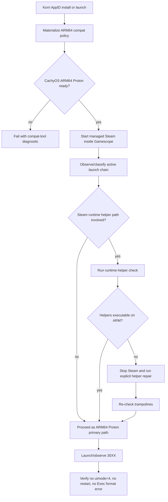
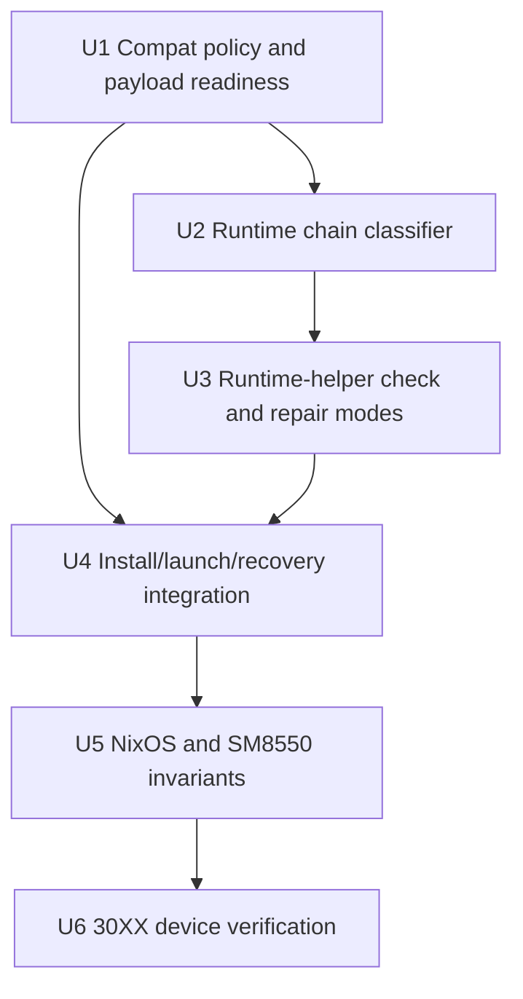
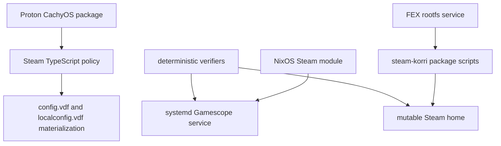

# fix: Build Steam ARM64 Proton runtime guardrails

## Summary

Make SM8550 Steam launches explicitly product-owned around ARM64 Steam + ARM64 CachyOS/Proton 11, while adding a narrow, explicit recovery safety net for Steam-installed x86 Linux runtime helpers. The plan keeps Steam inside Gamescope in desktop UI persona, avoids broad startup-time mutation of Steam-owned files, and validates the current 30XX failure through deterministic install/launch probes.

---

## Problem Frame

30XX installed successfully on Bandai, but Steam/Gamescope restarted when Steam attempted post-install/runtime setup and hit `SteamLinuxRuntime_4/pressure-vessel/bin/pressure-vessel-wrap: cannot execute binary file`. Korri already prefers ARM64 CachyOS Proton, but the current lifecycle lets Steam-installed runtime helper paths appear without either preventing them structurally or repairing them explicitly.

---

## Requirements

- R1. Treat ARM64 Steam + ARM64 CachyOS/Proton 11 as the supported SM8550 product path for Windows Steam games.
- R2. Keep FEX in the architecture for x86 Windows game code and, when needed, for explicitly wrapped x86 Linux Steam runtime helpers.
- R3. Do not switch Bandai to x86 Steam-under-FEX as the primary product path.
- R4. Do not re-enable broad `steam-guest-runtime-prep --apply` mutation on every Steam service startup.
- R5. Cover `SteamLinuxRuntime_4` pressure-vessel helpers, not only older `SteamLinuxRuntime_sniper` paths.
- R6. Keep Steam inside Gamescope on SM8550, in desktop UI persona, with the existing `uimode=4` guard intact.
- R7. Preserve Steam self-update behavior; do not add update suppressors as a product fix.
- R8. Provide deterministic verification for 30XX install/launch recovery without long ad-hoc SSH scripts.
- R9. Make failures operator-readable: missing ARM64 Proton payload, missing FEX rootfs, broken helper trampolines, and Gamepad UI guard exits should fail with clear diagnostics.

---

## Scope Boundaries

- Do not make x86 Steam-under-FEX the SM8550 default.
- Do not bypass Gamescope for Steam on Bandai.
- Do not add Gamepad/Big Picture UI support on SM8550.
- Do not disable Steam updates or suppress Steam bootstrap repair as a workaround.
- Do not mutate Proton/Wine payloads broadly as part of normal Steam startup.
- Do not solve every per-game Proton regression in this plan; 30XX is the validation case because it exposed the runtime-helper failure.
- Do not move Steam-specific runtime-helper repair into generic FEX substrate modules; Steam owns Steam runtime consequences.

### Deferred to Follow-Up Work

- Generalize `repair_game_audio` beyond the current 30XX-specific PipeWire process match.
- Add a first-class install-control UX/API path so `app.plugin.install.request` and `app.plugin.install.status` can be used without bypass helper SSH.
- Investigate per-game ARM64 Proton fixes for 30XX shader compiler, Vector video/codec, and Axiom Verge 2 Unity exits after the core runtime path is stable.
- Decide whether to vendor a newer `proton-cachyos-11.0-20260602` payload after the current payload-readiness checks are in place.

---

## Context & Research

### Relevant Code and Patterns

- `product/plugins/steam/src/plugin.ts` defines `DEFAULT_STEAM_COMPAT_TOOL` as `proton-cachyos-11.0-20260601-slr-arm64`.
- `product/plugins/steam/src/state-materializer.ts` owns `CompatToolMapping`, Steam-stopped VDF writes, and `assertCompatToolExists` validation, including rejection of `toolmanifest.vdf` files containing `require_tool_appid`.
- `product/plugins/steam/packages/steam-korri/scripts/steam-arm64-seed` provisions the ARM64 Steam state and symlinks the CachyOS Proton payload into `compatibilitytools.d`.
- `product/plugins/proton-runtime/packages/proton-cachyos-arm64/default.nix` owns the packaged Proton CachyOS ARM64 artifact and strips upstream `require_tool_appid`.
- `product/plugins/steam/packages/steam-korri/scripts/steam-guest-runtime-prep` already has broad `SteamLinuxRuntime*/pressure-vessel` apply logic and FEX trampoline helpers, but current module tests intentionally keep it out of normal startup ordering.
- `product/plugins/steam/nix/nixos-module.nix` owns Gamescope presentation, service envelope, `uimode=4` guard, FEX rootfs preparation, AppID install/launch helpers, and SM8550 integration.
- `product/plugins/steam/nix/module-check.nix`, `product/plugins/steam/nix/nixos-module.test.ts`, and `tools/testing/nix/korri-rocknix-sm8550-config-check.nix` are the existing contract-test pattern for NixOS module invariants.
- `tools/testing/steam/verify-bandai-steam-state.ts`, `tools/testing/steam/inspect-bandai-steam-restart.ts`, and `tools/testing/steam/retry-bandai-steam-install.ts` establish the deterministic live-verifier pattern for Bandai.

### Institutional Learnings

- `docs/solutions/tooling-decisions/arm64-native-proton-cachyos-steam-runtime-bandai-2026-06-20.md`: ARM64 CachyOS Proton is the structural default because it keeps Wine, GL, audio, and Steamworks ARM-native while FEX translates game code.
- `docs/solutions/runtime-errors/steam-sniper-fex-bwrap-architecture-path-2026-06-19.md`: `srt-bwrap` repair must use x86 bwrap from `FEX_ROOTFS`, prefix host `/run/current-system/sw/bin` in `PATH`, and invoke `/usr/bin/FEX` explicitly.
- `docs/solutions/runtime-errors/steam-arm64-stable-self-update-relaunch-loop-2026-06-27.md`: running runtime prep in normal startup caused Steam file verification/update loops; repair must stay explicit and narrow.
- `docs/solutions/architecture-patterns/fex-substrate-and-steam-runtime-boundary-2026-06-20.md`: FEX owns generic substrate facts, Proton owns runtime defaults, and Steam owns pressure-vessel/runtime-helper repair.
- `docs/solutions/architecture-patterns/steam-inside-gamescope-preserves-steam-input-2026-06-15.md`: Steam itself must run inside Gamescope; per-game nested Gamescope wrappers break Steam Input boundaries.
- `docs/solutions/integration-issues/steam-uinput-permissions-block-virtual-xinput-2026-06-13.md`: `/dev/uinput` permissions are required for Steam Input to synthesize virtual XInput devices consumed by games like 30XX.

### External References

- ROCKNIX Steam documentation: https://rocknix.org/systems/steam/
- CachyOS Proton releases: https://github.com/CachyOS/proton-cachyos/releases
- FEX-Emu Steam guidance: https://wiki.fex-emu.com/index.php/Steam
- Valve Steam Runtime sources: https://github.com/ValveSoftware/steam-runtime
- Steam Runtime 4 public beta images: https://repo.steampowered.com/steamrt4/images/latest-public-beta/

---

## Key Technical Decisions

| Decision | Rationale | Consequence |
|---|---|---|
| ARM64 Steam + ARM64 CachyOS Proton remains the SM8550 primary path | Prior Bandai evidence shows the x86 Proton + FEX + pressure-vessel path hits a structural GL wall on Adreno, while ARM64 Proton keeps GL/audio/native libraries on ARM | Implementation should strengthen default compat-tool materialization, not make x86 Steam the default |
| FEX remains required, but only at explicit architecture boundaries | Windows game code is still x86/x64; pressure-vessel helpers may also be x86 Linux binaries | The plan distinguishes FEX-for-game-code from FEX trampolines for Steam runtime helpers |
| Runtime-helper repair is explicit, not a startup side effect | Broad startup repair previously caused Steam file verification/self-update loops | Safety net runs from install/launch/recovery gates with diagnostics, never as unconditional Steam service startup mutation |
| `SteamLinuxRuntime_4` is a first-class target | The observed 30XX failure and current Steam/Proton 11 direction involve Runtime 4 paths, while older tests focused on sniper | Checks and fixtures must glob or enumerate runtime versions rather than hardcoding sniper only |
| Runtime classification precedes repair policy | It is not yet settled whether the selected CachyOS ARM64 path invokes pressure-vessel for 30XX or whether Steam fell into an official fallback path | The first implementation unit that touches live behavior should classify the active launch chain before making repair automatic |
| Steam-specific repair stays in `@korri:steam` | Pressure-vessel, AppID install, Steam self-update, and Gamescope service state are Steam lifecycle concerns | Do not move wrapper repair into generic `@korri:fex`; consume FEX path facts instead |
| Failure output must be operator-readable | Silent restarts and `Exec format error` logs are costly on a handheld kiosk | Check/recovery tooling should say whether the missing piece is compat tool, FEX rootfs, runtime helper wrapper, UI mode guard, or service state |

---

## Open Questions

### Resolved During Planning

- Should Korri switch to x86 Steam-under-FEX for Bandai? No. It remains useful prior art and a possible ROCKNIX mode, but Korri’s SM8550 product path should optimize for ARM64 Steam + ARM64 Proton because the all-x86 stack is worse for Adreno GL and current controller/compositor requirements.
- Should Korri re-enable broad runtime prep on every Steam startup? No. Prior learnings and current tests intentionally forbid it because it mutates Steam-owned files and can trigger Steam verification/update loops.
- Should the runtime helper safety net live in generic FEX code? No. It is a Steam pressure-vessel lifecycle repair and belongs with the Steam plugin/service envelope.

### Deferred to Implementation

- Does the current CachyOS ARM64 Proton path for 30XX actually invoke `SteamLinuxRuntime_4` pressure-vessel, or did Steam fall back to official Proton/Runtime setup during install? This requires deterministic launch observation on Bandai after code changes; the plan includes a classification unit before broadening repair automation.
- Are the existing Proton Python patches needed for the Korri-symlinked CachyOS ARM64 payload, or only for Steam-managed fallback Proton trees? This depends on inspecting the real vendored payload and observed launch chain; the plan gates payload readiness and documents the result.
- Should `korri-steam-prepare-fex-rootfs.service` become a hard requirement for Steam startup when the rootfs is absent? The plan requires clearer diagnostics first, then lets implementation decide whether `wants` remains acceptable after first-boot behavior is characterized.

---

## High-Level Technical Design

> *This illustrates the intended approach and is directional guidance for review, not implementation specification. The implementing agent should treat it as context, not code to reproduce.*



The important policy line is between `H` and `J`: checking can be part of install/launch readiness, but mutation only happens through an explicit stopped-Steam repair path. Normal Steam service startup stays free of broad runtime prep.

---

## Output Structure

This plan mostly modifies existing modules and scripts. New verifier/test files may be added under existing directories:

```text
tools/testing/steam/
  observe-bandai-steam-runtime.ts        # optional new deterministic launch-chain observer
product/plugins/steam/packages/steam-korri/tests/
  steam-guest-runtime-prep-smoke.sh      # extend or add runtime-helper fixtures
```

---

## Implementation Units



### U1. Harden ARM64 compat policy and payload readiness

**Goal:** Ensure Korri can only materialize the SM8550 default compat policy when the ARM64 CachyOS Proton payload is real, registered, executable, and free of `require_tool_appid`.

**Requirements:** R1, R2, R3, R7, R9

**Dependencies:** None

**Files:**
- Modify: `product/plugins/steam/src/plugin.ts`
- Modify: `product/plugins/steam/src/state-materializer.ts`
- Modify: `product/plugins/steam/src/state-materializer.test.ts`
- Modify: `product/plugins/steam/src/materializer.test.ts`
- Modify: `product/plugins/proton-runtime/packages/proton-cachyos-arm64/default.nix`
- Modify: `product/plugins/steam/packages/steam-korri/check.nix`
- Modify: `product/plugins/steam/packages/steam-korri/scripts/steam-arm64-seed`
- Test: `product/plugins/steam/src/state-materializer.test.ts`
- Test: `product/plugins/steam/src/materializer.test.ts`

**Approach:**
- Keep `DEFAULT_STEAM_COMPAT_TOOL` as the product default for SM8550.
- Strengthen validation around the packaged `compatibilitytools.d` tool so a stub or placeholder Proton payload fails before Steam tries to launch a game.
- Preserve the existing `require_tool_appid` rejection because Korri intentionally runs CachyOS Proton directly inside the Steam FHS rather than asking Steam to resolve an unavailable runtime tool AppID.
- Ensure AppID install/launch materialization cannot silently fall back to official Proton Experimental when the default tool is missing; failure should identify the missing/broken compat tool.

**Execution note:** Start with characterization tests around existing `assertCompatToolExists` and materializer behavior before tightening failure modes.

**Patterns to follow:**
- `assertCompatToolExists` in `product/plugins/steam/src/state-materializer.ts`.
- Memory filesystem/lifecycle tests in `product/plugins/steam/src/state-materializer.test.ts`.
- Package contract checks in `product/plugins/steam/packages/steam-korri/check.nix`.

**Test scenarios:**
- Happy path: state root contains executable `compatibilitytools.d/proton-cachyos-11.0-20260601-slr-arm64/proton` and a manifest without `require_tool_appid`; materialization writes global `CompatToolMapping "0"` to that tool.
- Error path: compat tool directory is absent; materialization fails before writing config and reports the missing tool.
- Error path: `proton` exists but is not executable; materialization fails before writing config and reports the broken tool.
- Error path: `toolmanifest.vdf` contains `require_tool_appid`; materialization fails before writing config and reports that the tool is not eligible for Korri’s direct ARM64 path.
- Error path: packaged Proton payload is a known placeholder/stub; package checks reject it before image build or seed completion.
- Integration: `steam-arm64-seed` still creates the expected symlink into `compatibilitytools.d` and does not replace Steam-owned Proton trees.

**Verification:**
- The default compat tool is validated before VDF writes.
- Broken or ineligible Proton payloads fail loudly.
- The seeded CachyOS Proton path remains the global default and does not require Steam to install a separate runtime tool AppID.

### U2. Add a deterministic runtime-chain classifier for Bandai

**Goal:** Determine whether the active 30XX launch chain uses the intended CachyOS ARM64 Proton path, an official Steam Proton/Runtime fallback, `SteamLinuxRuntime_4` pressure-vessel helpers, or no pressure-vessel at all.

**Requirements:** R1, R2, R5, R8, R9

**Dependencies:** U1

**Files:**
- Create: `tools/testing/steam/observe-bandai-steam-runtime.ts`
- Modify: `tools/testing/steam/inspect-bandai-steam-restart.ts`
- Modify: `packages/pi-korrid-tools/src/korrid-tools.ts`
- Modify: `packages/pi-korrid-tools/tests/korrid-tools.test.ts`
- Test: `packages/pi-korrid-tools/tests/korrid-tools.test.ts`

**Approach:**
- Extend the existing deterministic verifier pattern rather than using long inline SSH scripts.
- Classify launch evidence from process args, Steam logs, and known paths into a small set of outcomes: intended CachyOS ARM64, official Proton fallback, Runtime 4 helper path, sniper helper path, no runtime helper observed, or inconclusive.
- Keep the observer read-only. It should not install, kill broad process patterns, or mutate Steam files.
- Make the output useful for implementation decisions: the repair path is urgent only if the intended ARM64 path still invokes x86 Linux helpers or Steam can fall back to them during install/launch.

**Patterns to follow:**
- `tools/testing/steam/verify-bandai-steam-state.ts` for focused live state summaries.
- `tools/testing/steam/inspect-bandai-steam-restart.ts` for timestamp-windowed Steam/systemd evidence.
- `korri_steam_app_observe` and `korri_steam_launch_supervise` classifier expectations in `packages/pi-korrid-tools`.

**Test scenarios:**
- Happy path: transcript includes `compatibilitytools.d/proton-cachyos-11.0-20260601-slr-arm64/proton`; classifier reports intended ARM64 CachyOS path.
- Edge case: transcript includes `SteamLinuxRuntime_4/_v2-entry-point` and official `Proton - Experimental`; classifier reports official runtime fallback rather than intended CachyOS path.
- Edge case: transcript includes `SteamLinuxRuntime_sniper`; classifier reports older sniper runtime path.
- Error path: transcript includes `pressure-vessel-wrap: cannot execute binary file`; classifier reports runtime-helper architecture failure.
- Error path: transcript shows service restart without runtime evidence; classifier returns inconclusive with restart evidence rather than guessing.
- Integration: live observer output includes service state, Steam UI mode summary, runtime-path classification, and no broad process-kill action.

**Verification:**
- A Bandai 30XX launch can be classified without ad-hoc SSH polling.
- Classification output determines whether U3/U4 repair applies to the primary path, fallback path, or both.

### U3. Narrow runtime-helper check and repair to Steam pressure-vessel helpers

**Goal:** Make `steam-guest-runtime-prep` accurately check and explicitly repair `SteamLinuxRuntime_*` pressure-vessel helpers, including Runtime 4, without broad Proton/Wine mutation in the normal safety-net path.

**Requirements:** R2, R4, R5, R7, R9

**Dependencies:** U2

**Files:**
- Modify: `product/plugins/steam/packages/steam-korri/scripts/steam-guest-runtime-prep`
- Modify: `product/plugins/steam/packages/steam-korri/tests/steam-guest-runtime-prep-smoke.sh`
- Modify: `product/plugins/steam/packages/steam-korri/check.nix`
- Test: `product/plugins/steam/packages/steam-korri/tests/steam-guest-runtime-prep-smoke.sh`

**Approach:**
- Split or clarify modes so the safety net can check/repair pressure-vessel helper executables without also treating Steam-managed Proton/Wine payloads as normal startup targets.
- Make check mode enumerate `SteamLinuxRuntime*/pressure-vessel` rather than hardcoding only `SteamLinuxRuntime_sniper`.
- Preserve existing FEX trampoline properties: original x86 helper backed up as `.x86_64`, wrapper invokes `/usr/bin/FEX`, and `srt-bwrap` resolves bwrap from `FEX_ROOTFS` while prefixing host PATH.
- Keep `.uuid` font marker repair only if it is still necessary for pressure-vessel startup and can be scoped to runtime helper recovery.
- Improve partial-failure behavior so anchor/patch failures are visible to callers instead of being swallowed as successful repair.

**Patterns to follow:**
- Existing `wrap_fex_tool`, `write_fex_tool_wrapper`, `restore_fex_wrapper`, and `runtime_check` structure in `steam-guest-runtime-prep`.
- Prior `srt-bwrap` smoke-test contract from `docs/solutions/runtime-errors/steam-sniper-fex-bwrap-architecture-path-2026-06-19.md`.

**Test scenarios:**
- Happy path: fake `SteamLinuxRuntime_4/pressure-vessel/bin/pressure-vessel-wrap` is x86_64; explicit repair preserves original as `.x86_64` and replaces executable with a FEX trampoline.
- Happy path: fake `SteamLinuxRuntime_4/pressure-vessel/libexec/.../pv-adverb` is x86_64; repair wraps it and check mode reports healthy.
- Happy path: fake `srt-bwrap` is x86_64; repair produces a wrapper that references `FEX_ROOTFS` bwrap, prefixes host PATH, and invokes `/usr/bin/FEX` explicitly.
- Edge case: helper is already a FEX wrapper; repair is idempotent and does not stack another wrapper.
- Edge case: helper is ARM64-native; check mode reports no FEX wrapper required and repair leaves it untouched.
- Error path: `FEX_ROOTFS` is missing or lacks x86_64 bwrap; check mode fails with a clear FEX-rootfs diagnostic.
- Error path: runtime directory is absent; check mode distinguishes “runtime not installed yet” from “runtime installed but broken.”
- Integration: check and apply cover both `SteamLinuxRuntime_4` and `SteamLinuxRuntime_sniper` fixtures with the same mode.

**Verification:**
- Runtime-helper check output matches the helpers that repair would actually touch.
- Explicit repair fixes Runtime 4 pressure-vessel helpers without restoring broad startup mutation.
- Smoke tests lock the `srt-bwrap` three-property contract.

### U4. Wire explicit repair into install, launch, and recovery handoffs

**Goal:** Put the safety net in the right lifecycle places: install completion, launch preflight, and operator recovery — not unconditional Steam service startup.

**Requirements:** R4, R5, R7, R8, R9

**Dependencies:** U1, U3

**Files:**
- Modify: `product/plugins/steam/nix/nixos-module.nix`
- Modify: `product/plugins/steam/nix/nixos-module.test.ts`
- Modify: `product/plugins/steam/nix/module-check.nix`
- Modify: `tools/testing/nix/korri-rocknix-sm8550-config-check.nix`
- Modify: `tools/testing/steam/retry-bandai-steam-install.ts`
- Test: `product/plugins/steam/nix/nixos-module.test.ts`
- Test: `product/plugins/steam/nix/module-check.nix`

**Approach:**
- Keep existing tests that forbid runtime prep in normal `korri-steam-gamescope.service` startup.
- Add a stopped-Steam explicit repair path for runtime helpers and make operator output distinguish “checked,” “repaired,” “not installed,” and “failed.”
- For install helpers, after Steam finishes downloading/installing an AppID and any runtime sidecars, stop the managed Steam service before invoking repair if check mode indicates x86 helpers need wrapping.
- For launch helpers, run a fast check before launching an AppID when the relevant runtime exists. If broken and auto-repair would require stopping Steam, either perform the explicit stopped-Steam recovery path or fail with a clear recovery instruction, depending on the chosen implementation posture.
- Ensure broad process killing remains forbidden; any stop/restart actions target the managed service or exact PIDs already owned by the service wrapper.

**Patterns to follow:**
- Current `korri-steam-app-install` and `korri-steam-app` helper definitions in `nixos-module.nix`.
- Current `korri-steam-service-run` exact Gamescope PID and UI guard behavior.
- Source-text assertions in `product/plugins/steam/nix/nixos-module.test.ts` for shell contract invariants.

**Test scenarios:**
- Happy path: module source still contains no normal-startup `steam-guest-runtime-prep --apply` invocation.
- Happy path: explicit recovery helper invokes pressure-vessel-only repair with Steam stopped and reports success.
- Happy path: install helper preserves managed Steam args and runs runtime-helper check after install completion.
- Edge case: runtime helpers are absent because Steam has not installed runtime sidecars yet; launch proceeds without false failure.
- Edge case: check reports ARM64-native Runtime 4 helpers; repair is skipped and launch proceeds.
- Error path: check reports broken x86 helper while Steam is running; helper stops the managed service before mutation or fails with a clear “stop/recover required” diagnostic.
- Error path: explicit repair fails; service is not left in an ambiguous state and the error identifies the failed helper.
- Regression: service startup remains free of path watchers and full `--apply` repair.

**Verification:**
- Runtime repair is reachable when Steam installs x86 helper binaries.
- Normal Steam startup still does not mutate Steam-owned runtime files.
- Install and launch helpers preserve desktop Gamescope posture and managed arguments.

### U5. Lock SM8550 NixOS invariants for Gamescope, desktop UI, FEX rootfs, and service state

**Goal:** Ensure the product image keeps the intended presentation and runtime envelope while adding the new checks and recovery hooks.

**Requirements:** R3, R4, R6, R7, R9

**Dependencies:** U4

**Files:**
- Modify: `product/plugins/steam/nix/nixos-module.nix`
- Modify: `product/plugins/steam/nix/module-check.nix`
- Modify: `product/plugins/steam/nix/nixos-module.test.ts`
- Modify: `product/systems/nixos/images/platforms/rocknix-sm8550.nix`
- Modify: `tools/testing/nix/korri-rocknix-sm8550-config-check.nix`
- Test: `product/plugins/steam/nix/module-check.nix`
- Test: `product/plugins/steam/nix/nixos-module.test.ts`
- Test: `tools/testing/nix/korri-rocknix-sm8550-config-check.nix`

**Approach:**
- Preserve Gamescope presentation mode for SM8550 and desktop Steam persona arguments.
- Keep the environment unsets that hide Gamescope/libei/SteamOS hints from Steam while still rendering through Gamescope.
- Preserve the `steamwebhelper -uimode=4` lifetime guard and `RestartPreventExitStatus=77` behavior.
- Strengthen rootfs readiness diagnostics so missing or wrong-architecture FEX rootfs failures are visible before runtime-helper repair attempts.
- Keep Steam update suppressors filtered out of managed paths.
- Ensure any `gamescopePreferOutput` or output-routing changes come from SM8550 platform config rather than generic Steam module hardcoding.

**Patterns to follow:**
- Existing source checks forbidding `-gamepadui`, `-steamos3`, `-steampal`, `-steamdeck`, `-silent`, and ` -e ` in managed SM8550 paths.
- Existing exact-PID Sway movement to `korri:steam-debug`.
- Existing FEX rootfs Freedreno architecture verifier expectations from `korri_steam_runtime_verify`.

**Test scenarios:**
- Happy path: composed SM8550 config uses Gamescope presentation and desktop persona args.
- Happy path: Steam child env unsets Gamescope/libei hints while Gamescope still owns the display container.
- Happy path: `uimode=7` is accepted and `uimode=4` remains a guard failure.
- Regression: no Gamepad/Big Picture flags reappear in managed service, install helper, or AppID helper args.
- Regression: no update suppressor flags are passed through managed helpers.
- Error path: FEX rootfs is missing or wrong architecture; runtime-helper check reports a rootfs diagnostic instead of an opaque launch failure.
- Integration: SM8550 config check confirms Steam/Gamescope is isolated from the Korri GUI workspace policy and does not run on the hub workspace.

**Verification:**
- NixOS module and composed SM8550 checks preserve current presentation and update invariants.
- Runtime-helper guardrails do not weaken Gamescope containment, desktop UI persona, or controller navigation constraints.

### U6. Validate 30XX end-to-end on Bandai with deterministic verifiers

**Goal:** Prove the combined design fixes the observed failure mode on the live device without regressing Steam UI mode, workspace isolation, service stability, or controller-input prerequisites.

**Requirements:** R1, R2, R5, R6, R8, R9

**Dependencies:** U2, U4, U5

**Files:**
- Modify: `tools/testing/steam/verify-bandai-steam-state.ts`
- Modify: `tools/testing/steam/inspect-bandai-steam-restart.ts`
- Modify: `tools/testing/steam/retry-bandai-steam-install.ts`
- Modify: `packages/pi-korrid-tools/src/korrid-tools.ts`
- Modify: `packages/pi-korrid-tools/tests/korrid-tools.test.ts`
- Test: `packages/pi-korrid-tools/tests/korrid-tools.test.ts`

**Approach:**
- Use deterministic scripts/verifiers rather than long inline SSH probes.
- Validate existing 30XX install state, runtime-helper repair/check state, and launch classification.
- Observe launch through the managed AppID path with the expected Steam/Gamescope service envelope.
- Verify absence of the original `pressure-vessel-wrap: cannot execute binary file` error in the observation window.
- Confirm that a successful launch does not require Gamepad UI and does not move Steam/Gamescope onto the Korri GUI workspace.

**Patterns to follow:**
- Timestamp-window filtering in `tools/testing/steam/inspect-bandai-steam-restart.ts`.
- Focused state summary output in `tools/testing/steam/verify-bandai-steam-state.ts`.
- Read-only launch classification in `packages/pi-korrid-tools/src/korrid-tools.ts`.

**Test scenarios:**
- Happy path: observer sees 30XX launch through CachyOS ARM64 Proton or a classified expected runtime path and reports no `Exec format error`.
- Happy path: service remains active or exits through expected managed lifecycle, with no systemd restart evidence in the observation window.
- Happy path: Steam UI mode remains `uimode=7`; no `uimode=4` process is observed.
- Happy path: Gamescope/Steam remains on `korri:steam-debug` or the configured Steam workspace, while Korri GUI focus remains separate.
- Error path: launch hits official Proton fallback; observer classifies fallback and reports which compat policy gate failed.
- Error path: runtime helper is still unwrapped; observer reports the broken helper path and recovery state.
- Error path: install-control RPC remains unauthorized; verifier reports that limitation without falling back to unsafe ad-hoc mutation.

**Verification:**
- 30XX launch no longer reproduces `pressure-vessel-wrap: cannot execute binary file`.
- Steam/Gamescope does not restart immediately after post-install/runtime setup.
- Existing Bandai state verifier continues to pass for service state, workspace isolation, UI mode, and controller intercept.

---

## System-Wide Impact



- **Interaction graph:** The change crosses TypeScript plugin policy, NixOS module helpers, package scripts, systemd service state, Steam mutable state, FEX rootfs readiness, and live verifier tooling.
- **Error propagation:** Compat-tool failures should fail before VDF writes; runtime-helper failures should fail before game launch or inside explicit recovery; UI guard failures should remain visible as exit 77 rather than being hidden by restart loops.
- **State lifecycle risks:** Steam can rewrite runtime helpers during self-update; repair must be idempotent and must not race Steam file verification while Steam is running.
- **API surface parity:** Direct AppID helpers, install helpers, and Korri RPC/plugin materialization must agree on the same default compat policy.
- **Integration coverage:** Unit tests cannot prove live Steam update/Runtime 4 behavior; deterministic Bandai observers remain required for final confidence.
- **Unchanged invariants:** Steam remains inside Gamescope; Gamepad UI remains unsupported on SM8550; Steam updates remain enabled; `tools/` verifiers are not shipped product code.

---

## Alternative Approaches Considered

- **Switch Bandai to x86 Steam-under-FEX:** Rejected for this product path because prior evidence shows worse GL behavior on Adreno and it conflicts with the desired ARM64 Proton architecture. ROCKNIX may keep this as a user-selectable mode, but Korri should not make it the SM8550 default.
- **Run full runtime prep on every Steam startup:** Rejected because it mutates Steam-owned files in the same lifecycle Steam uses for verification and self-update, causing repair/update loops.
- **Ignore runtime-helper repair and rely only on ARM64 Proton policy:** Rejected because the 30XX install already showed Steam can still install or invoke official runtime helpers during setup; product policy must have a diagnostic and recovery story.
- **Move helper wrapping into generic FEX substrate:** Rejected because pressure-vessel helper repair depends on Steam runtime layout, AppID launch timing, and Steam service state.

---

## Risks & Dependencies

| Risk | Likelihood | Impact | Mitigation |
|---|---:|---:|---|
| CachyOS ARM64 Proton payload in repo/image is a placeholder or missing | Medium | High | U1 adds package/materializer readiness checks before launch |
| Steam Runtime 4 helpers are ARM64-native in some versions and x86 in others | Medium | Medium | U3 check mode classifies helper architecture and only wraps x86 helpers |
| Repair races Steam self-update or file verification | Medium | High | U4 runs mutation only with Steam stopped and keeps startup mutation forbidden |
| Steam changes readiness/log strings | Medium | Medium | U2/U6 classify multiple evidence sources and keep outputs explicit when inconclusive |
| FEX rootfs download/overlay fails on first boot | Medium | High | U5 requires clearer rootfs diagnostics before runtime-helper repair attempts |
| New checks block launch when runtime sidecars are not installed yet | Medium | Medium | U4 distinguishes absent runtime from installed-but-broken runtime |
| 30XX has a separate D3D shader/compiler issue after runtime helper repair | High | Medium | Treat runtime launch stability as this plan’s success; defer per-game shader fixes |
| Whole-repo typecheck remains red from unrelated issues | High | Low | Use targeted test paths and Nix checks for this plan’s verification surface |

---

## Documentation / Operational Notes

- Update or add operator-facing notes only where implementation changes the recovery workflow. The minimum durable note should explain how to distinguish missing compat tool, missing FEX rootfs, broken runtime helper wrapper, and Gamepad UI guard failure.
- Do not document raw ad-hoc SSH launch recipes as product validation. Device validation should reference deterministic verifiers and managed service state.
- If U2 proves CachyOS ARM64 Proton does not use pressure-vessel on the primary path, document runtime-helper repair as fallback/recovery only, not as a normal launch prerequisite.
- If U2 proves the primary path still invokes `SteamLinuxRuntime_4`, document the stopped-Steam repair point as part of install/launch lifecycle.

---

## Success Metrics

- 30XX AppID `1029210` launches far enough to observe the game process/runtime path without `pressure-vessel-wrap: cannot execute binary file`.
- Steam/Gamescope no longer restarts immediately after 30XX post-install/runtime setup.
- Bandai verifier reports `uimode=7`, no `uimode=4`, `InterceptMode: u 0`, and Steam/Gamescope isolated on the Steam workspace.
- Runtime-helper check reports Runtime 4 helper state accurately: absent, ARM64-native, wrapped, or broken.
- Module checks still prove no full runtime prep runs during normal Steam service startup.

---

## Sources & References

- Related plan: `work/items/active/01KVM124SW03GF7P1XZGKDSS4M-steam-arm64-proton-declarative-policy/plan.md`
- Related code: `product/plugins/steam/src/plugin.ts`
- Related code: `product/plugins/steam/src/state-materializer.ts`
- Related code: `product/plugins/steam/packages/steam-korri/scripts/steam-guest-runtime-prep`
- Related code: `product/plugins/steam/packages/steam-korri/scripts/steam-arm64-seed`
- Related code: `product/plugins/steam/nix/nixos-module.nix`
- Related code: `product/plugins/proton-runtime/packages/proton-cachyos-arm64/default.nix`
- Related tests: `product/plugins/steam/nix/nixos-module.test.ts`
- Related tests: `product/plugins/steam/nix/module-check.nix`
- Related tests: `tools/testing/nix/korri-rocknix-sm8550-config-check.nix`
- Related verifier: `tools/testing/steam/verify-bandai-steam-state.ts`
- Related verifier: `tools/testing/steam/inspect-bandai-steam-restart.ts`
- Related verifier: `tools/testing/steam/retry-bandai-steam-install.ts`
- Institutional learning: `docs/solutions/tooling-decisions/arm64-native-proton-cachyos-steam-runtime-bandai-2026-06-20.md`
- Institutional learning: `docs/solutions/runtime-errors/steam-sniper-fex-bwrap-architecture-path-2026-06-19.md`
- Institutional learning: `docs/solutions/runtime-errors/steam-arm64-stable-self-update-relaunch-loop-2026-06-27.md`
- External docs: https://rocknix.org/systems/steam/
- External docs: https://github.com/CachyOS/proton-cachyos/releases
- External docs: https://wiki.fex-emu.com/index.php/Steam
- External docs: https://repo.steampowered.com/steamrt4/images/latest-public-beta/
