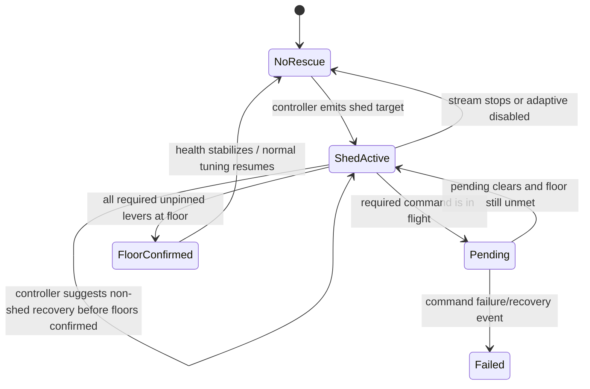
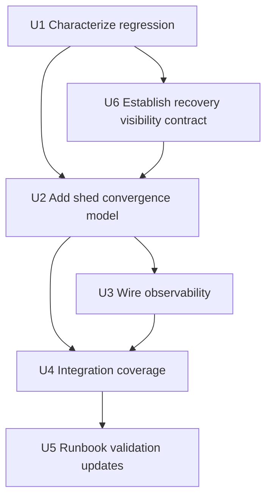
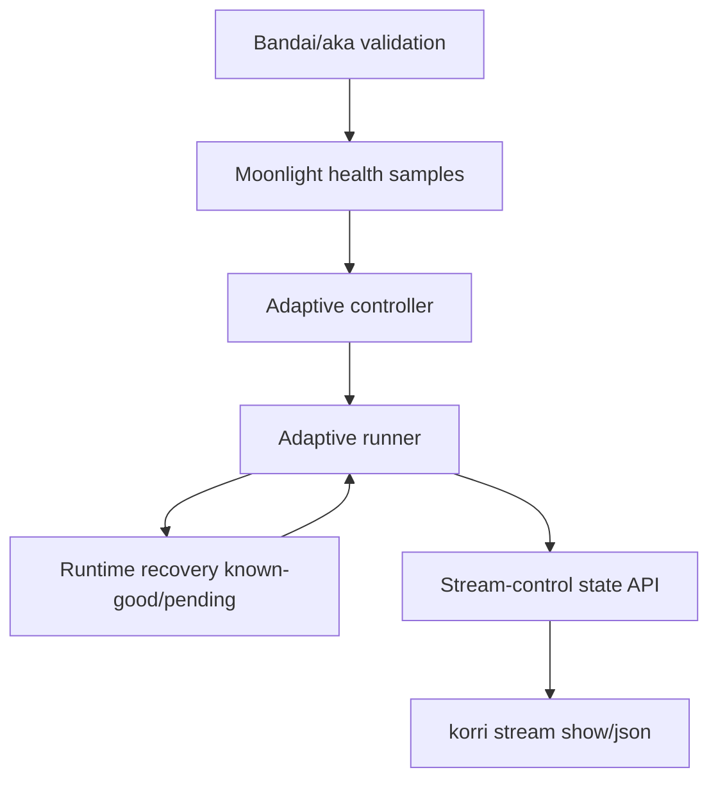

# fix: Complete adaptive shed after resolution-only rescue

## Summary

Fix the adaptive stream rescue loop so a poor-link shed converges on the full playable floor — bitrate, FPS, and resolution — instead of stopping after the resolution floor makes health look less catastrophic. The plan keeps the validated conservative startup behavior intact and focuses on characterization, shed-convergence state, observability, and Bandai/aka validation guidance.

---

## Problem Frame

Live Skate 3 validation on Bandai proved that explicit `floor..startup..ceiling` policy starts Moonlight conservatively and ramps on a healthy link. The same run exposed a rescue regression: after aka shaping, auto adaptation reached `640x360` but left bitrate/FPS at about `28409 kbps / 120 fps`, then reported `dormant / within-hysteresis`; manual bitrate/FPS commands applied immediately, so the runtime control path was still reachable.

---

## Requirements

- R1. Reproduce the live regression in automated coverage: high-ceiling launch policy, current state near `28409 kbps / 120 fps / 1920x1080`, poor-link health, resolution-only improvement, and an incorrect dormant outcome.
- R2. Adaptive shed must continue until readback/known-good state reaches the applicable playable floor for every unpinned rescue lever: bitrate floor, FPS floor, and resolution floor.
- R3. Adaptive state must not report `dormant / within-hysteresis` while any required shed lever remains above its floor and no pending/failed command explains the gap.
- R4. Manual intervention must not be required to reach `500 kbps / 30 fps / 640x360` under the shaped-link scenario.
- R5. Preserve startup behavior already validated in production: `bitrate=500k..6m..40m` launches around `6000 kbps` while retaining a `40000 kbps` adaptive ceiling.
- R6. Preserve existing non-shed behavior: fine-tuning still changes one dimension per tick and ordinary pending mutations still gate non-emergency adjustments.
- R7. Shed-convergence state must clear or recompute when the stream stops, adaptive disables, boundaries change, or a transient shed condition clearly resolves before floor convergence is still justified.

---

## Scope Boundaries

- Do not replace the adaptive controller with a unified controller in this slice.
- Do not add GUI/portal controls; CLI/RPC/readback surfaces are sufficient.
- Do not add ceiling autodetection; explicit user policy remains authoritative.
- Do not introduce SSID, route-name, or device-name heuristics as rescue signals.
- Do not change Moonlight native protocol behavior unless implementation proves the adaptive runner is sending valid commands that the native runtime rejects.
- Do not weaken the validated conservative-startup path or turn the startup value into the adaptive ceiling.

### Deferred to Follow-Up Work

- Unified adaptive controller design: already parked separately as future product/architecture work.
- Rich operator visualization for multi-axis rescue progress: useful later, but this fix only needs enough state to avoid misleading `within-hysteresis` readback.

---

## Context & Research

### Relevant Code and Patterns

- `product/platform/stream/stream-adaptive-controller.ts` computes `target` vs `dormant` decisions, including `shed` mode, floor/ceiling clamping, and `within-hysteresis` outcomes.
- `product/platform/stream/stream-adaptive-runner.ts` gates streaming/pending state, invokes the controller, emits adaptive events, and dispatches shed bursts as bitrate → FPS → resolution → bitrate.
- `product/platform/stream/stream-adaptive-runner.test.ts` already covers stale/early-downshift rescue bursts, pending behavior, non-shed one-dimension tuning, startup bitrate, dynamic boundaries, and dispatch failure events.
- `product/platform/stream/stream-session.ts` wires adaptive runner state into runtime sessions and exposes `snapshot()` / `dryRun()` through adaptive runtime control.
- `product/platform/stream/runtime-recovery-supervisor.ts` owns pending/known-good state for runtime mutations; adaptive current settings come from `knownGood()` rather than direct Moonlight readback.
- `docs/korri-stream-adaptive-validation-runbook.md` is the live validation contract for high-envelope startup, netem shaping, stream show/JSON observation, and cleanup.

### Institutional Learnings

- `docs/solutions/architecture-patterns/stream-control-command-outcome-contract-2026-06-03.md`: command acceptance is not proof of applied state; decisions and displayed values must be grounded in readback/known-good semantics.
- `docs/solutions/architecture-patterns/gamescope-runtime-control-contract-2026-06-02.md`: runtime mutations serialize through the bridge and must distinguish applied, pending, mismatch, timeout, and failed outcomes.
- `docs/solutions/runtime-errors/sessiond-sse-stream-killed-by-bun-idle-timeout-2026-05-27.md`: do not infer domain state from observation side-channel liveness; by analogy, do not infer full rescue convergence from one axis looking healthy.
- `docs/solutions/design-patterns/explicit-cascade-folded-policy-over-incidental-signal-heuristics-2026-05-27.md`: prefer explicit policy gates over incidental signals; rescue completion should be explicit per lever/floor, not inferred from a general hysteresis branch.
- `docs/solutions/architecture-patterns/korrid-device-state-subscriptionref-2026-07-01.md`: stale/current state must be represented explicitly and older observations must not overwrite newer state.

### External References

- External research skipped: this is an internal TypeScript control-loop regression with strong local patterns and direct device evidence.

---

## Key Technical Decisions

- Model rescue convergence as a runner/session obligation, not as a one-tick controller suggestion: The controller can produce a shed target from current health, but the runner sees command dispatch, pending state, and known-good progress over time. Do not add stateful rescue debt to the stateless controller API unless characterization proves that the controller's pure per-tick target calculation is itself wrong.
- Treat `within-hysteresis` and ordinary recovery targets as insufficient during unresolved shed convergence: Once shed has started, the system must confirm every required floor or explain why it cannot; a healthy-looking post-resolution sample must not resume recovery or globally certify rescue completion while bitrate/FPS remain above floor. Pending/failure states are explanatory failure or escalation states, not passing acceptance outcomes for the live regression.
- Keep shed aggressive but bounded by policy: Unpinned levers should converge to their configured floors; pinned levers and absent boundaries should use existing semantics rather than force new behavior.
- Preserve non-shed one-axis tuning: The fix should not make ordinary fine-tune/recovery dispatch multiple dimensions per tick.
- Improve observability at the adaptive event layer: The state surface should show unresolved shed/pending/failed rescue context instead of a misleading dormant reason.

---

## Open Questions

### Resolved During Planning

- Is the primary target Moonlight transport or adaptive decision state? Resolved: manual bitrate/FPS commands applied immediately during validation, so the plan starts in adaptive runner/controller state and only escalates to Moonlight if characterization proves valid commands are rejected.
- Should the fix lower ceilings or startup policy? Resolved: no. Startup behavior is validated and explicit ceilings remain authoritative.
- Should early-downshift bypass pending mutations? Resolved: no. Existing behavior intentionally does not bypass pending for early downshift; only emergency/stale shed is allowed to be more aggressive.

### Deferred to Implementation

- Exact representation of unresolved shed progress: choose the smallest runner/session event shape that keeps tests and readback clear once the implementation touches the current types.
- Whether the failing live path came from commands not being issued, commands pending, commands assuming applied too early, or pure controller reclassification after resolution: characterize first and fix the proven path, but default to runner/session state because the bug spans ticks.
- Whether CLI formatting needs changes beyond JSON/readback state: update only if existing `korri stream show` output would still mislead after the event/state fix.
- Exact transient-shed cancellation threshold: implementation should use existing health summaries and tests to define the smallest safe rule that clears stale debt without allowing the shaped-link resolution-only regression to pass.

---

## High-Level Technical Design

> *This illustrates the intended approach and is directional guidance for review, not implementation specification. The implementing agent should treat it as context, not code to reproduce.*



The important design constraint is that `within-hysteresis` may be valid for ordinary tuning, but while `ShedActive` has unresolved levers it should not transition directly to `NoRescue` unless floors are confirmed or a pending/failed state is surfaced.

---

## Implementation Units



### U1. Characterize resolution-only rescue regression

**Goal:** Add failing automated coverage that captures the Bandai validation shape before changing behavior.

**Requirements:** R1, R3, R5, R6

**Dependencies:** None

**Files:**
- Modify: `product/platform/stream/stream-adaptive-runner.test.ts`
- Conditional modify: `product/platform/stream/stream-adaptive-controller.test.ts` only if characterization proves the stateless per-tick target calculation is wrong independent of rescue history

**Approach:**
- Start with a runner-level scenario with mutable known-good state so the test can model a shed burst where resolution confirms first while bitrate/FPS remain high or unresolved.
- Add a controller-level scenario only if the runner characterization shows the pure per-tick target calculation is wrong even without rescue history. Avoid pushing multi-tick rescue debt into the controller just to make a test pass.
- Leave session-level characterization to U4, where exported adaptive snapshot behavior is the explicit target.
- Keep the existing startup tests intact so the new regression coverage cannot accidentally bless a return to high startup bitrate.

**Execution note:** Characterization-first. Establish the failing case before modifying controller/runner behavior.

**Patterns to follow:**
- `product/platform/stream/stream-adaptive-runner.test.ts` existing stale shed, early-downshift, pending, dynamic-boundary, and startup tests.
- `product/platform/stream/stream-session.test.ts` existing adaptive boundary control and dry-run snapshot tests.

**Test scenarios:**
- Happy path: Given a runner that has entered shed convergence and current settings `28409 kbps / 120 fps / 640x360` with boundaries `500..6000..40000`, `30..120`, `640x360..1920x1080`, and health that has improved after resolution shed, the runner must not settle as plain `within-hysteresis` while bitrate and FPS remain above floor.
- Edge case: Given resolution is already at floor but bitrate and FPS are not, rescue convergence should target only the remaining applicable levers rather than re-dispatching resolution.
- Edge case: Given bitrate is pinned by policy but FPS and resolution are not, characterization should make clear that the pinned bitrate is considered out of scope for rescue convergence while unpinned levers still converge.
- Error path: Given a required command is pending or failed, the surfaced event/state should explain pending/failure instead of reporting generic dormant convergence.
- Regression guard: Given healthy startup with `bitrate=500k..6m..40m`, existing startup behavior still targets the startup bitrate and does not collapse the ceiling.

**Verification:**
- There is a red regression test that mirrors the live failure without requiring Bandai, aka, or Moonlight.
- Existing startup and non-shed one-dimension tests remain part of the targeted suite.

---

### U6. Establish recovery visibility contract

**Goal:** Prove or add the minimal recovery/adaptive status needed to distinguish unresolved bitrate/FPS work from fully confirmed shed convergence.

**Requirements:** R2, R3, R4, R7

**Dependencies:** U1

**Files:**
- Modify: `product/platform/stream/stream-adaptive-runner.test.ts`
- Modify: `product/platform/stream/stream-session.test.ts`
- Conditional modify: `product/platform/stream/runtime-recovery-supervisor.test.ts` if `knownGood()` plus current runner events cannot distinguish unresolved per-lever state
- Conditional modify: `product/platform/stream/runtime-recovery-supervisor.ts` only if a minimal per-command pending/failure/provenance accessor is required

**Approach:**
- Before implementing shed convergence, characterize what the runner/session can know today: current known-good values, global pending state, dispatched command events, and recovery events supplied to the session.
- Prefer proving that runner-owned shed debt plus existing `knownGood()`/`hasPending()` is sufficient; add recovery surface area only if tests show the runner cannot distinguish unresolved levers from confirmed floors.
- If recovery surface area is needed, make it minimal and per-command so adaptive can explain which lever is pending/failed without treating assumed-applied as confirmed external readback.
- Keep manual/external command outcomes ignored by recovery unless recovery issued the request, preserving the existing manual-control boundary.

**Patterns to follow:**
- `RuntimeRecoverySupervisor` pending/known-good tests in `product/platform/stream/runtime-recovery-supervisor.test.ts`.
- Adaptive snapshot tests in `product/platform/stream/stream-session.test.ts`.
- Runner event tests in `product/platform/stream/stream-adaptive-runner.test.ts`.

**Test scenarios:**
- Happy path: After a resolution command confirms but bitrate/FPS do not, runner/session state can identify bitrate/FPS as unresolved rather than floor-confirmed.
- Edge case: A global pending state does not hide which shed levers remain above floor in the runner's convergence model.
- Error path: If a bitrate or FPS command fails or times out, adaptive state can surface failure/pending context without clearing shed convergence as successful.
- Regression: External manual command outcomes remain ignored by recovery and do not accidentally satisfy adaptive convergence unless the runner's own known-good state changes through its normal path.

**Verification:**
- U2 can be implemented against a clear status contract: either existing runner/session state is proven sufficient, or a minimal recovery status addition is covered by tests.
- No broad recovery redesign is introduced.

---

### U2. Add explicit shed-convergence state

**Goal:** Ensure a shed that has started keeps converging unresolved levers to their floors until every required unpinned lever is confirmed, pending, failed, or the stream/adaptive loop exits.

**Requirements:** R2, R3, R4, R5, R6, R7

**Dependencies:** U1, U6

**Files:**
- Modify: `product/platform/stream/stream-adaptive-runner.ts`
- Modify: `product/platform/stream/stream-adaptive-runner.test.ts`
- Conditional modify: `product/platform/stream/stream-adaptive-controller.ts` only if U1 proves a stateless controller target-calculation gap
- Conditional modify: `product/platform/stream/stream-adaptive-controller.test.ts` only if controller behavior changes

**Approach:**
- Prefer runner-owned convergence state because the runner has continuity across ticks and can compare current `knownGood()` against the last shed target.
- When a shed decision produces a multi-axis target, remember the required target per unpinned lever.
- On later ticks, compare current settings to the unresolved shed target before accepting any non-shed controller outcome. If required levers remain above floor, unresolved shed convergence preempts both dormant outcomes and ordinary recovery/fine-tune targets.
- Preserve existing aggressive shed burst order for the initial emergency and preserve one-axis-per-tick behavior for non-shed fine tuning after shed convergence is cleared.
- Respect pinned/absent levers and stream lifecycle exits; clear or recompute convergence state when streaming stops, adaptive disables, boundaries change, or the floor target is confirmed.
- Add a transient-shed escape hatch only when health has clearly returned to a stable good state before unresolved floor convergence remains justified; shaped-link conditions with poor delivery/readback must continue to the full floor.
- Avoid treating assumed-applied command outcomes as external readback if the recovery contract distinguishes pending/assumed/known-good; if ambiguity remains, prefer surfacing unresolved state over claiming convergence.

**Technical design:** *(directional guidance, not implementation specification)*

A shed convergence check should conceptually answer:

```text
required shed target - current confirmed settings - pinned/unsupported levers = unresolved levers
```

Only an empty unresolved set should allow the adaptive loop to surface ordinary dormant convergence after a shed.

**Patterns to follow:**
- `dispatchShedTarget` in `product/platform/stream/stream-adaptive-runner.ts` for burst ordering and non-blocking rescue dispatch.
- `currentSettings` / `adaptiveCurrentSettings` known-good derivation in `product/platform/stream/stream-adaptive-runner.ts` and `product/platform/stream/stream-session.ts`.
- `maybeSetBitrate`, `maybeSetFps`, and `maybeSetResolution` policy clamping in `product/platform/stream/stream-adaptive-controller.ts`.

**Test scenarios:**
- Happy path: Initial shed dispatches bitrate, FPS, resolution, and bitrate reassertion for a full high-envelope current state.
- Happy path: On a subsequent tick where only resolution is confirmed at floor, the runner dispatches bitrate/FPS floor instead of reporting dormant.
- Edge case: If bitrate confirms but FPS remains high, only FPS is retried/continued.
- Edge case: If all unpinned levers are confirmed at floor, convergence state clears and ordinary dormant/recovery behavior can resume.
- Edge case: If streaming stops or adaptive disables while convergence is active, a later healthy stream does not inherit stale floor debt.
- Edge case: If boundaries change or a lever becomes pinned mid-convergence, unresolved levers are recomputed against the new policy and forbidden commands are not sent.
- Edge case: If a one-sample transient shed is followed by clearly healthy stable samples before unresolved floor convergence remains justified, stale shed debt clears; the shaped-link regression does not clear because delivery/readback remains poor.
- Edge case: Pinned bitrate does not block convergence for FPS/resolution, and does not cause a forbidden bitrate command.
- Error path: If `hasPending()` is true for unresolved shed work, the runner surfaces pending state and does not spam duplicate non-emergency commands unless the existing emergency shed rules explicitly allow it.
- Error path: If a required dispatch rejects, the runner emits the existing failure event and leaves enough convergence context for the next tick/state snapshot to avoid false dormant convergence.
- Integration: Fine-tune mode with bandwidth pressure still dispatches only one lever per tick when no shed convergence is active.
- Regression guard: Healthy startup with `bitrate=500k..6m..40m` still targets startup bitrate and keeps the ceiling available for later growth.

**Verification:**
- The characterization tests from U1 pass because unresolved shed levers continue toward floor.
- Existing runner tests for pending behavior, stale shed, early-downshift, startup bitrate, pinned boundaries, and non-shed serialization still pass.

---

### U3. Surface unresolved shed state in adaptive readback

**Goal:** Make adaptive state explain unresolved/pending/failed shed convergence instead of exposing a misleading `dormant / within-hysteresis` while readback remains above floor.

**Requirements:** R2, R3, R4

**Dependencies:** U2, U6

**Files:**
- Modify: `product/platform/stream/stream-adaptive-runner.ts`
- Modify: `product/platform/stream/stream-session.ts`
- Modify: `product/platform/stream/stream-adaptive-runner.test.ts`
- Modify: `product/platform/stream/stream-session.test.ts`
- Conditional modify: `product/apps/portal/api/stream-control/service.ts` only if current pass-through cannot expose the new runner/session state
- Conditional modify: `product/surfaces/terminal/korri-cli/stream-quality.ts` only if existing formatting remains misleading after the event/state addition
- Conditional modify: `product/surfaces/terminal/korri-cli/stream-quality.test.ts` only if CLI formatting changes

**Approach:**
- Extend adaptive runner/session events or snapshot minimally so callers can distinguish ordinary dormant from unresolved shed progress.
- Include enough detail for operators/tests to know which lever remains unresolved, without making UI text the source of truth.
- Prefer the existing stream-control pass-through path for `lastEvent`; only modify API/CLI layers if tests prove the current surface cannot expose the new context.
- Choose a recovery-provenance plumbing path only if needed: either fold relevant recovery events into the session adaptive snapshot, or keep recovery provenance out of adaptive state and make unresolved runner state explicit enough to diagnose the gap.

**Patterns to follow:**
- Existing `StreamAdaptiveRunnerEvent` variants and `lastEvent` snapshot in `product/platform/stream/stream-session.ts`.
- Current `korri stream show` and JSON state formatting in `product/surfaces/terminal/korri-cli/stream-quality.ts`.
- Stream-control state composition in `product/apps/portal/api/stream-control/service.ts`.

**Test scenarios:**
- Happy path: When shed convergence is incomplete, adaptive snapshot includes a last event/state that identifies unresolved rescue rather than plain `within-hysteresis`.
- Happy path: Once all floors are confirmed, the snapshot no longer reports unresolved shed.
- Edge case: Pending unresolved work surfaces as pending/unresolved rather than repeated dormant events.
- Error path: Dispatch failure remains visible as `dispatch-failed` and is not overwritten immediately by a generic dormant event.
- Integration: `korri stream show`/JSON readback can display or expose the unresolved rescue context alongside applied bitrate/FPS/resolution through existing pass-through when possible.
- Error path: If recovery emits assumed-applied/failure context that would otherwise be lost, the chosen session-level plumbing makes that provenance observable or leaves a clearly documented implementation note for why runner state is sufficient.

**Verification:**
- Adaptive state readback makes the Bandai failure mode diagnosable from one `stream-state`/CLI snapshot.
- Existing consumers that only read `enabled`, `boundaries`, or applied plugin readback continue to work.

---

### U4. Prove session-level rescue behavior with mutable known-good/readback

**Goal:** Cover the cross-layer behavior where runtime recovery known-good updates arrive per lever and adaptive state must continue or explain rescue across ticks.

**Requirements:** R1, R2, R3, R4, R6, R7

**Dependencies:** U2, U3, U6

**Files:**
- Modify: `product/platform/stream/stream-session.test.ts`
- Modify: `product/platform/stream/runtime-recovery-supervisor.test.ts`
- Conditional modify: `product/platform/stream/runtime-recovery-supervisor.ts` only if characterization proves recovery semantics are contributing to the false convergence.

**Approach:**
- Use stream-session tests to model quality samples plus recovery outcomes, rather than only pure controller decisions.
- Verify that known-good state changing for resolution alone does not convince adaptive control that bitrate/FPS floors are satisfied.
- Keep runtime recovery supervisor changes out of scope unless tests prove its pending/known-good contract is too weak to represent the live failure.
- If recovery changes are needed, preserve its core contract: command outcomes are tracked per request, external manual outcomes are ignored, pending timeouts are explicit, recovery decisions are surfaced, and any new provenance does not turn assumed-applied into confirmed external readback.

**Patterns to follow:**
- `makeRecoveryPort` / adaptive startup tests in `product/platform/stream/stream-session.test.ts`.
- Pending timeout and known-good promotion tests in `product/platform/stream/runtime-recovery-supervisor.test.ts`.

**Test scenarios:**
- Integration: Given a stream session with adaptive enabled and a full high-envelope baseline, poor health triggers a shed and records unresolved work across ticks.
- Integration: Given a resolution `applied` outcome arrives before bitrate/FPS outcomes, adaptive continues or surfaces pending for bitrate/FPS rather than reporting ordinary dormant convergence.
- Integration: Given shed convergence starts, then streaming stops or adaptive disables, a later healthy stream/session starts without stale unresolved floor commands.
- Integration: Given boundaries change mid-convergence, adaptive recomputes unresolved levers against the new policy before dispatching.
- Error path: Given bitrate/FPS outcomes time out or fail, recovery/adaptive state exposes assumed-applied or failure context instead of silently clearing rescue debt.
- Regression: Manual/external outcomes that recovery did not issue remain ignored by recovery, preserving the existing manual-control boundary.

**Verification:**
- Cross-layer tests prove the adaptive snapshot and runtime recovery state agree enough to prevent false convergence.
- No changes are made to runtime recovery unless its tests show a real contract gap.

---

### U5. Update validation runbook for the regression gate

**Goal:** Record the exact live validation expectation so future adaptive changes are gated on full floor convergence, not startup success alone.

**Requirements:** R1, R2, R3, R4, R5, R7

**Dependencies:** U2, U3, U4, U6

**Files:**
- Modify: `docs/korri-stream-adaptive-validation-runbook.md`
- Modify: `tools/testing/netem/stream-drive.sh` only if the existing helper lacks a scenario label for this regression gate.

**Approach:**
- Add a regression note under the high-envelope/full-stack netem gate: startup success is necessary but not sufficient; shaped-link rescue must confirm bitrate, FPS, and resolution floors.
- Specify the expected readback sequence at the outcome level: initial `~6000 kbps / 120 fps / 1920x1080`, possible healthy ramp, then shaped-link convergence to `500 kbps / 30 fps / 640x360`. Explicit pending/failure state is useful evidence, but it is a failed or incomplete validation result until the floor is reached without manual intervention.
- Preserve cleanup discipline for aka qdisc and Bandai session home state.

**Patterns to follow:**
- Existing runbook sections for safe high-envelope launch, full-stack netem gate, observation fields, and post-run cleanup.
- Existing helper scenarios in `tools/testing/netem/stream-drive.sh` such as `startup-low` and `handoff`.

**Test scenarios:**
- Test expectation: none for documentation-only updates. If `tools/testing/netem/stream-drive.sh` changes, add or update a deterministic helper validation such as dry-run/help/parser coverage or an existing shell-level smoke pattern.

**Verification:**
- The runbook clearly distinguishes the already-fixed startup behavior from the newly fixed shed-convergence behavior.
- A future operator can repeat the Bandai/aka validation and know that resolution-only rescue is a failure, not a pass.

---

## System-Wide Impact



- **Interaction graph:** Health samples drive controller decisions; runner dispatches through recovery; recovery known-good feeds the next controller current state; stream-control state and CLI expose adaptive events/readback.
- **Error propagation:** Dispatch failures and pending recovery outcomes must remain visible as adaptive events/state rather than being overwritten by generic dormant outcomes.
- **State lifecycle risks:** A multi-tick shed target can become stale if streaming stops, adaptive disables, boundaries change, a lever is pinned, or a transient shed resolves; convergence state must clear or recompute at those boundaries without weakening the shaped-link regression gate.
- **API surface parity:** RPC/CLI JSON state should carry enough optional adaptive context to avoid text-only observability. Existing fields should remain backward compatible.
- **Integration coverage:** Unit tests must cover controller math and runner dispatch; session tests must cover known-good/pending transitions; live Bandai validation remains the final proof for Moonlight/Sunshine behavior.
- **Unchanged invariants:** Explicit ceilings stay explicit; startup bitrate stays startup-only; non-shed fine tuning remains one dimension per tick; manual runtime commands remain possible and are not folded into recovery state unless issued by recovery.

---

## Risks & Dependencies

| Risk | Mitigation |
|------|------------|
| The implementation fixes tests but not the live root cause because the actual failure was command rejection rather than false convergence. | Start with runner/session characterization that distinguishes not-issued, pending, failed, assumed-applied, and confirmed states; only change controller, Moonlight, API, CLI, or recovery if evidence points there. |
| Shed convergence state causes repeated command spam under persistent pending. | Respect `hasPending()` and surface pending/unresolved state; keep emergency bypass behavior limited to existing shed semantics. |
| Pinned boundaries make convergence impossible if treated like required floors. | Treat pinned/disabled levers as policy-excluded from convergence and test those cases. |
| Observability changes break downstream state consumers. | Add optional event/context fields and preserve existing applied readback fields. |
| Full floor convergence is too aggressive for mildly poor links. | Scope the behavior to active shed/rescue, add a tested transient-shed clear/recompute rule, and keep the strict shaped-link regression where delivery/readback remains poor. |

---

## Documentation / Operational Notes

- After implementation, repeat the Bandai/aka validation from a clean state: no qdisc residue, Bandai session home, launch Skate 3 with the explicit high envelope, apply aka shaping, observe full floor convergence without manual intervention, clear shaping, stop session, verify home. Pending/failure state should be captured as diagnostic evidence, not treated as a successful validation.
- Capture `app.stream-control.state.get` / `korri stream show` evidence before and after shaping so readback and adaptive last event can be compared.
- Keep the one-off live launch helper out of the repo unless the team decides to formalize a reusable validation script.

---

## Sources & References

- Origin item: [work/items/active/01KWXM1GXMGFJAYGF6Z39FJS6M-fix-adaptive-shed-resolution-only/item.md](work/items/active/01KWXM1GXMGFJAYGF6Z39FJS6M-fix-adaptive-shed-resolution-only/item.md)
- Related code: [product/platform/stream/stream-adaptive-runner.ts](product/platform/stream/stream-adaptive-runner.ts)
- Related code: [product/platform/stream/stream-adaptive-controller.ts](product/platform/stream/stream-adaptive-controller.ts)
- Related code: [product/platform/stream/stream-session.ts](product/platform/stream/stream-session.ts)
- Related code: [product/platform/stream/runtime-recovery-supervisor.ts](product/platform/stream/runtime-recovery-supervisor.ts)
- Related tests: [product/platform/stream/stream-adaptive-runner.test.ts](product/platform/stream/stream-adaptive-runner.test.ts)
- Related tests: [product/platform/stream/stream-adaptive-controller.test.ts](product/platform/stream/stream-adaptive-controller.test.ts)
- Related tests: [product/platform/stream/stream-session.test.ts](product/platform/stream/stream-session.test.ts)
- Validation runbook: [docs/korri-stream-adaptive-validation-runbook.md](docs/korri-stream-adaptive-validation-runbook.md)
- Institutional learning: [docs/solutions/architecture-patterns/stream-control-command-outcome-contract-2026-06-03.md](docs/solutions/architecture-patterns/stream-control-command-outcome-contract-2026-06-03.md)
- Institutional learning: [docs/solutions/architecture-patterns/gamescope-runtime-control-contract-2026-06-02.md](docs/solutions/architecture-patterns/gamescope-runtime-control-contract-2026-06-02.md)
