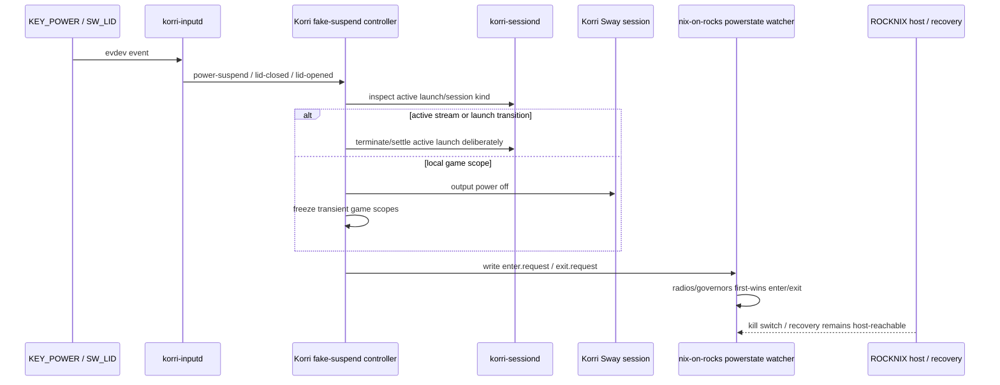

# refactor: Make Bandai fake suspend guest-owned

**Target repos:** Korri (`korri`) and nix-on-rocks (`nix-on-rocks`). Paths below are repo-relative and tagged by repo when needed.

## Summary

Move Bandai fake-suspend behavior into the Korri guest as product policy, while keeping nix-on-rocks as a product-blind substrate with only boot/recovery, guest lifecycle, device pass-through, and narrow power-state verbs. The implementation hardens the already-started split by replacing the inline shell toggle with a tested guest controller, coordinating with sessiond for active launches, and asserting the host/substrate boundary in Nix checks.

---

## Problem Frame

ROCKNIX/SM8550 does not provide a dependable real sleep mode for Bandai, so suspend is necessarily fake. The current direction is correct — Korri should behave like the product OS and own the user-visible sleep policy — but the handoff still needs stronger tests, sessiond coordination, and cross-repo guards so lid-close does not silently degrade into “screen maybe off, radios maybe off, session maybe wedged.”

---

## Requirements

- R1. Korri guest owns lid/power input policy, display blanking, session freeze/thaw, stream/session handoff, and user-visible fake-suspend state.
- R2. nix-on-rocks remains product-blind: no Korri service names, user IDs, Sway sockets, session units, or product lifecycle policy in substrate modules.
- R3. The substrate exposes only narrow privileged actuators and facts: `rocknix-powerstate enter|exit`, request directory ownership, kill switch, device input facts, and recovery services.
- R4. Lid close turns the screen off before low-power radio/governor work and reaches a bounded, observable state even when the power-state watcher is down.
- R5. Lid open resumes only from an active fake-suspend state; spurious open events do not trigger substrate exit work.
- R6. Power button behavior is form-factor aware: while the lid is closed, power does not silently resume a clamshell into an invisible running state.
- R7. Active session behavior is coordinated with sessiond: local games may freeze/thaw; active streams and launch-in-progress states do not get SIGSTOPed into undefined behavior.
- R8. CI can prove the wiring, state transitions, and substrate/product boundary before the final physical Bandai lid-close validation.

---

## Scope Boundaries

- This plan does not implement true SoC suspend, hibernate, or kernel sleep.
- This plan does not move boot, recovery, update, rollback, or guest-supervision authority out of the ROCKNIX host.
- This plan does not make nix-on-rocks depend on Korri or import `services.korri.*`.
- This plan does not attempt perfect network-stream preservation across fake suspend; active streams should be handled deliberately rather than frozen blindly.
- This plan does not rewrite unrelated compositor, input, audio, or sessiond architecture beyond the fake-suspend handoff.

### Deferred to Follow-Up Work

- Full stream pause/reconnect UX beyond graceful termination or explicit disconnect handling.
- Persistent journald / broader device evidence retention improvements.
- Cleanup of unrelated failing raw-gamepad hiding service if it remains outside the fake-suspend path.

---

## Context & Research

### Relevant Code and Patterns

- [korri] `product/services/device/inputd.ts` maps `KEY_POWER` to `power-suspend` and `SW_LID` to `lid-closed` / `lid-opened`.
- [korri] `product/services/device/inputd-actions.ts` dispatches action commands through `KORRI_INPUTD_*` env overrides and already has sessiond client patterns for kill/home actions.
- [korri] `product/systems/nixos/images/platforms/rocknix-sm8550.nix` currently defines the inline `korri-fakesuspend-toggle`, wires inputd env, derives `powerRequestDir` from `config.rocknix.power.runtimeDir`, and sets `rocknix.power.requestGroup = runtime.group`.
- [korri] `product/platform/library/sessiond-managed-launch-client.ts` provides existing status and terminate clients over the sessiond socket.
- [korri] `product/services/device/overlay-session-state-live.ts` shows a thin live adapter that classifies active Moonlight sessions from sessiond/proc state.
- [korri] `tools/testing/nix/korri-rocknix-sm8550-config-check.nix` is the main pure-Nix guard for SM8550 platform wiring.
- [nix-on-rocks] `guest/modules/powerstate.nix` owns the substrate `rocknix-powerstate` verb, request watcher, first-wins snapshots, Wi-Fi/BT/governor handling, kill switch, and logind ignores.
- [nix-on-rocks] `nix/tests/powerstate-script-contract.nix` is the model for testing shell/system actuator behavior with fake sysfs/state roots.
- [nix-on-rocks] `scripts/check-boundary-lint` enforces product-blind substrate sources and specifically guards `powerstate.nix` against old Korri/unit/socket coupling.

### Institutional Learnings

- [korri] `docs/solutions/architecture-patterns/physical-host-foreground-lifecycle-truth-is-sessiond-2026-05-29.md`: sessiond is the foreground lifecycle source; fake suspend must not bypass it when interrupting active launches.
- [korri] `docs/solutions/architecture-patterns/sessiond-operator-model-2026-05-29.md`: sessiond state and restore attempts are observable product state; suspend must not look like a crash loop.
- [korri] `docs/solutions/architecture-patterns/kiosk-renderer-ownership-by-sessiond-2026-05-27.md`: new device-side services must explicitly carry Wayland/Sway/session env and writable paths instead of assuming compositor inheritance.
- [korri] `docs/solutions/architecture-patterns/architectural-posture-as-nix-image-default-2026-05-27.md`: Bandai posture belongs in the SM8550 image/platform composition and must be asserted in config checks.
- [korri] `BANDAI_SLEEP_HANDOFF.md`: live investigation found the old substrate-owned lid path no-oped against stale root-session targets; the validated direction is Korri-owned policy plus product-blind `rocknix-powerstate` substrate verb.

### External References

- External research skipped. This is a repo-specific ROCKNIX/Korri/nix-on-rocks ownership problem with strong local evidence and local patterns.

---

## Key Technical Decisions

- Product policy moves into a Korri fake-suspend controller rather than staying as a large inline Nix shell snippet. Rationale: the behavior now has state, sessiond coordination, testable edge cases, and form-factor policy; that is product logic, not substrate glue.
- Keep the substrate request channel file-based and polled. Rationale: nix-on-rocks already records that systemd path units multi-trigger and can hit start limits; the boring poll loop is the validated actuator boundary.
- Use existing sessiond status/terminate clients before introducing a new suspend protocol. Rationale: current launch lifecycle already exposes status and terminate; new protocol surface should be additive only if implementation proves existing primitives insufficient.
- Treat active streams differently from local games. Rationale: freezing Moonlight can kill the network stream; stream sessions need graceful disconnect/termination semantics, while local game scopes can be frozen/thawed.
- Make lid-open idempotent and guarded. Rationale: spurious `SW_LID=0` events should not run a substrate exit path when Korri never entered fake suspend.
- Make power-button resume lid-state aware on Thor/Bandai. Rationale: pressing power while the clamshell is closed should not resume audio/CPU/radios with no visible display.
- Assert cross-repo boundaries in Nix checks and lint, not comments. Rationale: this bug class came from stale product details in substrate code; CI should fail if that coupling returns.

---

## Open Questions

### Resolved During Planning

- Should this plan attempt true suspend? No — the target is fake suspend because ROCKNIX/SM8550 does not expose a dependable real sleep mode here.
- Should nix-on-rocks own Korri display/session behavior? No — nix-on-rocks keeps only product-blind actuators and neutral facts.
- Should streams be frozen like local games? No — plan for explicit stream/sessiond handling before low-power state.
- Should the Wi-Fi watchdog be part of SM8550 posture? Yes — enable or explicitly assert the intended SM8550 setting as a belt-and-suspenders recovery path unless implementation finds a blocking device reason.

### Deferred to Implementation

- Exact controller packaging shape: TypeScript/Bun controller versus extracted shell package can be decided locally, but the chosen shape must be independently testable and no longer live as untested inline platform glue.
- Exact sessiond coordination primitive: start with existing status/terminate; add a small additive capability only if status/terminate cannot represent suspend safely.
- Exact physical lid-state source for power-button-while-closed behavior: use the most reliable implementation-time source available, such as last observed `SW_LID` marker or a kernel state read.

---

## High-Level Technical Design

> *This illustrates the intended approach and is directional guidance for review, not implementation specification. The implementing agent should treat it as context, not code to reproduce.*

---

## Implementation Units

### U1. Extract a testable Korri fake-suspend controller

**Goal:** Move fake-suspend product policy out of inline SM8550 Nix shell into a testable Korri-owned controller/package while preserving current command-line actions: toggle, suspend, and resume.

**Requirements:** R1, R4, R5, R6, R8

**Dependencies:** None

**Files:**
- Create: [korri] `product/services/device/fakesuspend-controller.ts`
- Create: [korri] `product/services/device/fakesuspend-controller.test.ts`
- Create/Modify: [korri] `product/services/device/nix/fakesuspend-controller.nix`
- Modify: [korri] `product/systems/nixos/overlays/korri-packages.nix` or existing package exposure surface if needed

**Approach:**
- Model fake-suspend controller state explicitly: active marker, last-toggle/debounce marker, last lid state, request directory, runtime dir, and command runner dependencies.
- Keep the controller executable-compatible with inputd env command dispatch: `toggle`, `suspend`, and `resume` remain valid action arguments.
- Replace hidden shell side effects with a small command-runner boundary for Sway output power, systemd user scope freeze/thaw, and request-file writes.
- Treat missing Sway socket as a non-fatal display-control failure but make it observable in logs/results so screen-off failure is diagnosable.
- Do not let the product controller create the substrate request directory silently; substrate tmpfiles owns that directory. The controller should report when the request channel is missing.

**Execution note:** Implement controller behavior test-first with temp directories and a recording command runner; do not rely on physical Bandai for basic state-machine coverage.

**Patterns to follow:**
- [korri] `product/services/device/inputd-actions.ts` for action dispatch and sessiond client fallback style.
- [korri] `product/services/device/overlay-session-state-live.ts` for thin live adapters over process/session state.
- [nix-on-rocks] `nix/tests/powerstate-script-contract.nix` for fake filesystem/state-root testing posture.

**Test scenarios:**
- Happy path: `suspend` with no active marker powers Sway outputs off, freezes local scopes, writes `enter.request`, and records active state.
- Happy path: `resume` with active marker writes `exit.request`, thaws frozen scopes, powers Sway outputs on, and clears active state.
- Edge case: `resume` with no active marker is a no-op and does not write `exit.request`.
- Edge case: two `toggle` actions inside the debounce window produce one suspend action and one debounced result.
- Edge case: `toggle` after the debounce window resumes only when active and lid state allows it.
- Error path: missing Sway socket does not prevent active marker/request-file behavior but records a display-control warning.
- Error path: missing substrate request directory records a degraded/failure result instead of creating the directory and pretending substrate power-state will run.
- Integration: the packaged executable accepts the same command shape that `commandFromEnv` produces for `KORRI_INPUTD_POWER_SUSPEND` and lid actions.

**Verification:**
- Fake-suspend controller tests cover marker state, debounce, lid-open idempotency, request-file writes, and command-runner calls without a real device.
- The controller package exposes an executable usable by inputd env command dispatch.

---

### U2. Wire SM8550 inputd to the packaged controller

**Goal:** Replace the inline `korriFakesuspendToggle` in the SM8550 platform adapter with the packaged Korri controller and assert the full inputd/action/request-channel posture.

**Requirements:** R1, R2, R3, R4, R8

**Dependencies:** U1

**Files:**
- Modify: [korri] `product/systems/nixos/images/platforms/rocknix-sm8550.nix`
- Modify: [korri] `tools/testing/nix/korri-rocknix-sm8550-config-check.nix`
- Modify: [korri] `tools/testing/nix/korri-package-outputs-check.nix` if the controller becomes a first-class package output

**Approach:**
- Wire `KORRI_INPUTD_POWER_SUSPEND`, `KORRI_INPUTD_LID_CLOSED`, and `KORRI_INPUTD_LID_OPENED` to the packaged controller.
- Preserve the existing command semantics: power button toggles, lid close explicitly suspends, lid open explicitly resumes.
- Keep `PULSE_SERVER` and `KORRI_SESSIOND_SOCKET` available to inputd/controller commands when needed.
- Assert `rocknix.power.requestGroup = runtime.group` and that the controller's evaluated request path derives from `config.rocknix.power.runtimeDir`.
- Explicitly set the SM8550 Wi-Fi watchdog decision in platform config, then assert that decision in the config check.

**Patterns to follow:**
- [korri] `tools/testing/nix/korri-rocknix-sm8550-config-check.nix` existing “inputd owns power/lid buttons” check.
- [korri] `product/systems/nixos/images/platforms/rocknix-sm8550.nix` existing `powerRequestDir` derivation from `config.rocknix.power.runtimeDir`.

**Test scenarios:**
- Happy path: Nix config evaluation shows inputd power/lid env values point at the controller package and preserve the right subcommands.
- Edge case: changing `rocknix.power.runtimeDir` changes the evaluated request path consumed by the controller wiring.
- Error path: config check fails if `requestGroup` is unset or no longer equals the Korri runtime group.
- Error path: config check fails if SM8550 reintroduces `KORRI_INPUTD_VOLUME_UP` / `KORRI_INPUTD_VOLUME_DOWN` overrides instead of using the Korri Pulse socket with inputd defaults.

**Verification:**
- SM8550 Nix config check proves inputd, request group, runtime dir, sessiond socket, Pulse socket, and watchdog posture are coherent.
- The inline fake-suspend shell script no longer exists as untested platform glue.

---

### U3. Coordinate fake suspend with sessiond lifecycle

**Goal:** Prevent fake suspend from racing or corrupting sessiond-managed foreground lifecycle by using existing sessiond status/terminate surfaces before freezing or dropping radios.

**Requirements:** R1, R4, R7, R8

**Dependencies:** U1, U2

**Files:**
- Modify: [korri] `product/services/device/fakesuspend-controller.ts`
- Modify: [korri] `product/services/device/fakesuspend-controller.test.ts`
- Modify: [korri] `product/services/device/sessiond.ts` only if existing status/terminate behavior cannot express the needed suspend guard
- Modify: [korri] `product/services/device/sessiond.test.ts` only if sessiond gains a suspend guard or additive capability
- Modify: [korri] `product/platform/library/sessiond-managed-launch-protocol.ts` only if an additive capability is required
- Modify: [korri] `product/platform/library/sessiond-managed-launch-protocol.test.ts` only if protocol changes

**Approach:**
- Query sessiond before suspend when the sessiond socket is configured.
- For active Moonlight/stream sessions, prefer deliberate termination/disconnect over freezing the stream process.
- For launch-in-progress or restoring/recovering states, avoid racing scope creation. Either terminate/settle to idle first or refuse/defer suspend with an observable result.
- For local game sessions, freeze only the transient game scopes and keep compositor, inputd, sessiond, and daemon services running.
- If implementation proves existing sessiond status/terminate APIs insufficient, add the smallest additive suspend capability and capability flag; do not version-break the managed-launch protocol.

**Patterns to follow:**
- [korri] `product/services/device/inputd-actions.ts` `dispatchSessiondTerminateActive` and `dispatchSessiondHomeToggle` for “try sessiond, fall back safely” behavior.
- [korri] `product/services/device/sessiond-state.ts` for foreground modes and active-launch detection.
- [korri] `docs/solutions/architecture-patterns/physical-host-foreground-lifecycle-truth-is-sessiond-2026-05-29.md` for sessiond lifecycle authority.

**Test scenarios:**
- Happy path: local game in `game` mode freezes local scopes and writes `enter.request` without terminating sessiond itself.
- Happy path: active stream session invokes deliberate sessiond termination/disconnect handling and does not freeze Moonlight as a paused scope.
- Edge case: suspend requested during `launching` does not allow a newly-created scope to escape the freeze/terminate decision.
- Edge case: suspend requested while `restoring` or `recovering` does not increment restore attempts as if fake suspend were a crash.
- Error path: sessiond unavailable produces a conservative, observable result; it must not blindly claim a fully-coordinated suspend.
- Integration: a suspended-state marker or sessiond guard prevents new foreground launches while fake suspend is active.

**Verification:**
- Unit tests show controller/sessiond coordination for idle, local game, stream, launching, restoring, and unavailable states.
- If protocol changes are needed, managed-launch protocol tests prove additive compatibility and capability reporting.

---

### U4. Preserve and test the product-blind substrate actuator boundary

**Goal:** Keep nix-on-rocks as the dumb actuator/recovery layer and strengthen checks around `rocknix-powerstate`, request watcher, kill switch, and boundary lint.

**Requirements:** R2, R3, R4, R8

**Dependencies:** None; can land in parallel with U1/U2 if coordinated cross-repo.

**Files:**
- Modify: [nix-on-rocks] `guest/modules/powerstate.nix` only if watcher status, watchdog defaults, or result reporting need hardening
- Modify: [nix-on-rocks] `nix/tests/powerstate-script-contract.nix`
- Modify: [nix-on-rocks] `nix/tests/guest-profile-contract.nix` or add a focused Nix test if request directory/watcher assertions do not already fit
- Modify: [nix-on-rocks] `scripts/check-boundary-lint`

**Approach:**
- Assert that `rocknix-powerstate-watcher.service` is wanted by `multi-user.target`, uses the evaluated request directory, and remains product-blind.
- Preserve first-wins snapshot and consume-on-exit semantics for repeated/duplicate enter requests.
- Ensure request directory group ownership remains declarative via tmpfiles and `rocknix.power.requestGroup`, not through product-side directory creation.
- Keep the host-reachable kill switch path under `/storage/.guest/lid-suspend.disabled`.
- Keep logind ignoring lid/power inside the guest so unsupported real suspend does not take down the container.

**Patterns to follow:**
- [nix-on-rocks] `guest/modules/powerstate.nix` comments documenting path-unit failure and first-wins snapshot lessons.
- [nix-on-rocks] `scripts/check-boundary-lint` product-blind checks.

**Test scenarios:**
- Happy path: powerstate enter snapshots governors/radios once, applies low-power state, and duplicate enter does not overwrite the snapshot.
- Happy path: powerstate exit restores governors/radios, performs Wi-Fi recovery when needed, and consumes the snapshot.
- Edge case: exit without active snapshot is a no-op.
- Error path: kill switch present causes enter/exit requests to skip substrate mutation.
- Error path: boundary lint fails if `powerstate.nix` references Korri units, `main-space-pipewire`, or uid-0 Sway socket patterns.
- Integration: NixOS evaluation proves request directory permissions are group-writable only when `requestGroup` is configured.

**Verification:**
- nix-on-rocks checks prove substrate behavior and boundary lint without importing Korri or naming product services.
- Korri can consume the substrate request channel solely through neutral `rocknix.power.*` options.

---

### U5. Prove bare hardware input access and form-factor edge behavior

**Goal:** Ensure the guest can actually receive the physical power/lid events and that Bandai clamshell edge cases behave intentionally.

**Requirements:** R1, R5, R6, R8

**Dependencies:** U1, U2

**Files:**
- Modify: [korri] `tools/testing/nix/korri-rocknix-sm8550-config-check.nix`
- Modify: [korri] `product/services/device/inputd.test.ts`
- Modify: [korri] `product/services/device/fakesuspend-controller.test.ts`
- Modify: [korri] `product/systems/nixos/modules/korri-rocknix-guest-device-access.nix` only if existing ACL convergence is insufficient
- Modify: [nix-on-rocks] `guest/modules/device-interface.nix` only if neutral input facts need additional shape
- Modify: [nix-on-rocks] `guest/modules/chipsets/sm8550/default.nix` only if Thor/Bandai input fact defaults are incomplete

**Approach:**
- Keep inputd's existing `KEY_POWER` / `SW_LID` event mapping; no TypeScript inputd dispatch change is expected unless tests reveal a missing frame.
- Add targeted Nix assertions that SM8550 device access grants the runtime user direct access to bare `/dev/input/event*` nodes and runs before the login/session path that consumes them.
- Track last lid state in the controller so `toggle` does not resume into a physically closed clamshell.
- Make duplicate lid-close events idempotent; lid-close while already suspended should not corrupt state or overwrite substrate snapshots.

**Patterns to follow:**
- [korri] `product/services/device/inputd.test.ts` existing retained system keys / switch events test.
- [korri] `product/systems/nixos/modules/korri-rocknix-guest-device-access.nix` ACL convergence pattern.
- [nix-on-rocks] `guest/modules/chipsets/sm8550/default.nix` neutral SM8550 event names.

**Test scenarios:**
- Happy path: `KEY_POWER` dispatches `power-suspend`; `SW_LID=1` dispatches `lid-closed`; `SW_LID=0` dispatches `lid-opened`.
- Happy path: lid close writes a closed-lid state marker and suspends.
- Edge case: power toggle while closed-lid marker is active does not resume the device invisibly.
- Edge case: lid open clears closed-lid state and resumes only when fake suspend is active.
- Error path: config check fails if SM8550 no longer grants runtime-user ACLs for input event nodes before the session starts.
- Integration: platform config exposes the neutral SM8550 input facts needed to identify `pmic_pwrkey` and `gpio-keys` without Korri hard-coding chipset-private paths.

**Verification:**
- Unit tests prove input event classification and form-factor state behavior.
- Nix config checks prove Bandai runtime user can access host-bound physical input nodes through the guest.

---

### U6. Add physical Bandai validation gates and operational observability

**Goal:** Define the final on-device proof that the guest-owned fake-suspend path works end-to-end and fails observably when substrate support is absent.

**Requirements:** R1, R3, R4, R5, R6, R7, R8

**Dependencies:** U1, U2, U3, U4, U5

**Files:**
- Modify: [korri] `tools/testing/nix/korri-rocknix-sm8550-config-check.nix` if additional smoke-environment facts need evaluation coverage
- Modify: [nix-on-rocks] `docs/contracts/layer14-soak-checklist.md` only if the implementation explicitly updates substrate acceptance criteria
- No additional documentation file is required unless the implementer is explicitly asked to capture acceptance evidence.

**Approach:**
- Keep validation as an operational gate rather than pretending unit tests can prove physical lid behavior.
- Preflight should inspect active guest services, request directory permissions, inputd env, physical input ACLs, Sway socket presence, and `rocknix-powerstate-watcher.service` activity.
- Physical smoke should cover idle, local game, active stream, launch-in-progress, lid bounce, watcher-down degraded mode, and host kill-switch recovery.
- Observable state should include controller log/result, substrate powerstate log/result, sessiond status before/after, Sway output power, and Wi-Fi recovery time.

**Patterns to follow:**
- [korri] `BANDAI_SLEEP_HANDOFF.md` live validation notes and incident timeline.
- [nix-on-rocks] `docs/contracts/layer14-soak-checklist.md` existing guest substrate checklist.

**Test scenarios:**
- Integration: lid-close from idle blanks screen and powers down substrate state; lid-open restores screen and Wi-Fi.
- Integration: lid-close with a local game freezes/thaws or otherwise preserves session according to U3 policy.
- Integration: lid-close with an active Moonlight stream follows the stream-specific U3 behavior without freezing Moonlight into a broken connection.
- Integration: lid-close during a launch transition does not leave sessiond stuck in `launching` or consume restore attempts as a crash.
- Edge case: rapid lid close/open settles into one coherent final state.
- Edge case: power button while lid is closed follows U5 form-factor policy.
- Error path: stopping `rocknix-powerstate-watcher.service` before suspend creates an observable degraded result and does not claim substrate low-power success.
- Error path: host kill switch prevents substrate mutation while preserving enough host/guest access for recovery.

**Verification:**
- On-device Bandai smoke confirms screen off/on, sessiond state, Wi-Fi restore, and no unexpected failed units after the cycle.
- Physical validation distinguishes PASS/FAIL/DEGRADED instead of relying on visual inspection alone.

---

## System-Wide Impact

- **Interaction graph:** Physical evdev → inputd → fake-suspend controller → sessiond/Sway/systemd user scopes → nix-on-rocks request watcher → substrate radios/governors. Host remains only the recovery and guest-supervision plane.
- **Error propagation:** Product-controller failures should be visible in controller logs/results; substrate actuator failures should be visible in powerstate logs/results; sessiond coordination failures should not masquerade as successful suspend.
- **State lifecycle risks:** Active marker, last-toggle debounce, last lid state, substrate snapshot, request files, and sessiond mode must not drift under duplicate events or partial suspend/resume.
- **API surface parity:** inputd env command contract remains unchanged; sessiond protocol changes, if any, must be additive and capability-flagged.
- **Integration coverage:** Unit and Nix checks can prove state-machine and wiring behavior, but only physical Bandai validation can prove real lid events, display power, Wi-Fi recovery, and host kill-switch recovery.
- **Unchanged invariants:** nix-on-rocks does not import Korri, name Korri services, own product UI/session policy, or reintroduce real logind suspend behavior.

---

## Risks & Dependencies

| Risk | Mitigation |
|------|------------|
| Controller extraction grows beyond the fake-suspend problem | Keep compatibility with current `toggle|suspend|resume` command surface and route unrelated session refactors to follow-up work. |
| Sessiond coordination introduces protocol churn | Prefer existing status/terminate; add only capability-flagged protocol fields if implementation proves necessary. |
| Stream handling surprises users by disconnecting instead of preserving | Make stream behavior explicit and observable; do not freeze Moonlight blindly. |
| Host/substrate watcher missing silently degrades to display-only suspend | Stop creating request dir from product controller; report missing request channel and assert watcher/tmpfiles in Nix checks. |
| Physical lid/power events remain inaccessible to inputd | Add targeted ACL/order assertions and verify on Bandai before accepting the implementation. |
| Cross-repo drift breaks request path or group ownership | Assert evaluated `rocknix.power.runtimeDir` and `requestGroup` from Korri config and substrate tests. |
| Fake suspend drains battery because some scopes fail to freeze | Log freeze failures and decide whether to proceed as degraded; include physical validation for CPU/session state. |

---

## Documentation / Operational Notes

- The plan artifact itself is the durable design record for this refactor. Additional acceptance docs should only be created if explicitly requested during implementation or release validation.
- Any deployed candidate should be validated with a host-reachable kill switch ready: `/storage/.guest/lid-suspend.disabled`.
- Cross-repo changes should land in an order that never leaves Bandai in a red intermediate state: substrate-compatible checks first, Korri controller/package second, device validation last.

---

## Sources & References

- [korri] `BANDAI_SLEEP_HANDOFF.md`
- [korri] `product/systems/nixos/images/platforms/rocknix-sm8550.nix`
- [korri] `product/services/device/inputd.ts`
- [korri] `product/services/device/inputd-actions.ts`
- [korri] `product/platform/library/sessiond-managed-launch-client.ts`
- [korri] `tools/testing/nix/korri-rocknix-sm8550-config-check.nix`
- [korri] `docs/solutions/architecture-patterns/physical-host-foreground-lifecycle-truth-is-sessiond-2026-05-29.md`
- [korri] `docs/solutions/architecture-patterns/sessiond-operator-model-2026-05-29.md`
- [nix-on-rocks] `guest/modules/powerstate.nix`
- [nix-on-rocks] `nix/tests/powerstate-script-contract.nix`
- [nix-on-rocks] `scripts/check-boundary-lint`
