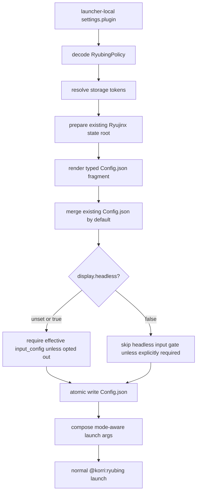

# fix: Make Ryubing plugin config generic and GUI-safe

## Summary

Make the Ryubing plugin's authored config contract small, generic, and mode-aware: normal users point Korri at an existing Ryujinx state root, while Ryujinx-owned config, keys, saves, and controller profiles remain preserved by default. The implementation keeps `display.headless` as the explicit GUI/headless launch policy, moves raw Config.json edits through `launch.overrides.config`, and removes device-specific assumptions from the product path.

---

## Problem Frame

Bandai debugging proved that Switch games can launch through Ryubing when Korri uses the SD card's existing Ryujinx state and the normal Ryujinx GUI path. The temporary debug path worked, but the product plugin still needs a clearer generic contract: no Bandai paths, no controller IDs, no copied keys, no silent Config.json clobbering, and no special config language outside the established `settings.plugin` and launch override surfaces.

---

## Requirements

- R1. The final `@korri:ryubing` behavior must not hard-code a device name, username, media mount path, storage UUID, or controller identifier.
- R2. User-authored Ryubing settings must stay under the established launcher-local `settings.plugin` schema that resolves to the `@korri:ryubing` plugin policy; the plan must not introduce a new `korri:` block or a parallel launch-policy namespace.
- R3. The normal authored config for a card or existing Ryujinx install should be minimal: primarily the Ryujinx state root, plus optional verified typed settings.
- R4. Existing Ryujinx `Config.json` content must be preserved by default except where typed Korri policy or explicit launch overrides intentionally reassert a field; controller profiles and unknown future Ryujinx settings must survive when not explicitly owned by policy.
- R5. Korri must not generate `input_config` unless the user explicitly authors `input.controllers` or a raw override provides it.
- R6. Raw Ryujinx `Config.json` fragments must use the existing `launch.overrides.config` escape hatch, not new plugin-specific raw-config fields.
- R7. `display.headless: false` must select the normal Ryujinx GUI launch path and must not be blocked by headless-only input preflight.
- R8. Headless mode remains safe by default: headless launches still require an effective `input_config` unless explicitly opted out.
- R9. Tests must prove GUI/no-GUI launch selection, Config.json preservation, input gate behavior, and storage-token path handling without relying on Bandai-specific facts.
- R10. The implementation handoff must include device validation: the real `@korri:ryubing` path launches a game with screenshot evidence and working controls, then temporary debug drift is removed.

---

## Scope Boundaries

- This plan does not copy Switch keys, saves, firmware, or game files into Korri-managed state. The existing Ryujinx state root is the source of truth when configured.
- This plan does not build self-relative card config paths. That remains parked separately in `work/items/parking-lot/01KX02NNB9B8ZSMV59T0RQC3R6-support-self-relative-plugin-paths-in-card-carried-korri-con.md`.
- This plan does not model every Ryujinx `Config.json` key as typed policy. Unknown or unverified keys stay in the preserved on-disk file or `launch.overrides.config`.
- This plan does not change the first-party plugin architecture or generic cascade resolver beyond what Ryubing already uses.
- This plan does not make generic process launches the final Switch path. `@korri:process` remains debug-only for this problem.
- This plan does not treat a live process, window listing, or audio as success. Real validation requires screenshot proof of game output.

### Deferred to Follow-Up Work

- Card-carried self-relative paths for `.korri` config files: use the existing parking-lot item rather than folding that platform feature into this Ryubing fix.
- Broader cross-emulator settings vocabulary growth: keep new typed Ryubing settings demand-driven and verified before exposing them.
- Rich UI documentation for every Ryubing field: useful later, but this fix should first tighten behavior and tests.

---

## Context & Research

### Relevant Code and Patterns

- `product/plugins/ryubing/src/plugin.ts` contributes the `@korri:ryubing` launcher, default state storage, Switch system, discovery provider, and package module.
- `product/plugins/ryubing/src/policy.ts` defines the Effect Schema for launcher-local `settings.plugin` once it resolves to the `@korri:ryubing` plugin policy.
- `product/plugins/ryubing/src/preferences-mapping.ts` folds shared launch preferences into Ryubing policy before plugin-specific settings win.
- `product/plugins/ryubing/src/launch-spec.ts` is the pure renderer for Ryubing argv and generated Config.json fragments.
- `product/plugins/ryubing/src/materializer.ts` resolves storage tokens, creates/preserves state, validates keys/input config, merges Config.json, writes atomically, and returns the launch spec.
- `product/plugins/ryubing/src/launch-spec.test.ts` already covers GUI mode omitting `--no-gui`, correct `ignore_applet` / `skip_user_profiles` keys, raw `overrides.config`, and OpenAL defaulting.
- `product/plugins/ryubing/src/materializer.test.ts` covers basic materialization, `overrides.config.replace`, and storage-token state roots, but does not yet cover GUI-mode input validation.
- `product/plugins/retroarch/src/materializer.ts` is a nearby model for plugin-owned materialization boundaries, but Ryubing differs because its state root is persistent user data rather than a disposable launch artifact.

### Institutional Learnings

- `docs/solutions/design-patterns/explicit-cascade-folded-policy-over-incidental-signal-heuristics-2026-05-27.md`: launch behavior should come from explicit cascade-folded policy, not environment or argv heuristics. `display.headless` follows this pattern.
- `docs/solutions/architecture-patterns/gamescope-as-plugin-owned-composition-2026-06-17.md`: plugin-specific schema, validation, and launch composition belong under the plugin boundary; generic platform code should not learn Ryubing semantics.
- `docs/solutions/performance-issues/ryubing-sm8550-turnip26-openal-2026-06-11.md`: OpenAL and Turnip-related behavior are already encoded at the renderer/package layer and should not become device-specific authored config requirements.
- `work/items/active/01KTVNVZSZ4J4YRZPARV25BK6H-ryubing-app-kind/plan.md`: the original Ryubing plan scoped v1 as headless-only; this plan is the follow-up that makes GUI mode a first-class explicit policy path.
- `work/items/parking-lot/01KTWG12PWM75G0JV5E9HEPTQ2-kind-ryubing-launches-are-audio-only-isolate-spawn-path-delt.md`: the earlier audio-only/black-screen investigation showed why process-kind debug success must be converted into plugin-owned behavior rather than accepted as the product path.

### External References

- None needed for the core plan. Local plugin code and the on-device investigation are the source of truth for this fix. If implementation changes GUI-mode flags beyond the already-validated minimal set, the implementer should verify the exact Ryujinx/Ryubing CLI support before emitting new GUI-mode argv.

---

## Key Technical Decisions

- Keep `display.headless` as the explicit mode switch: it is already inside the launcher-local `settings.plugin` policy that resolves to `@korri:ryubing`, follows the explicit-policy pattern, and avoids adding a new mode namespace just to express `--no-gui` vs normal Ryujinx windowing.
- Treat `display.headless: false` as “Ryujinx owns its GUI path,” not “Korri should synthesize GUI state.” Korri still passes the state root and game path, but Ryujinx reads its own config, controller profiles, keys, saves, and UI state from that root.
- Preserve `config.merge-existing: true` and `config.preserve-unknown: true` as safe defaults. Normal examples should omit these knobs; they exist for advanced cases where an operator intentionally wants generated-only config.
- Do not add plugin-specific raw Config.json fields. `launch.overrides.config.prepend`, `append`, and `replace` are the canonical raw emulator escape hatch and already match the RPCS3/Ryubing override pattern.
- Split GUI-mode and headless-mode launch argument rendering where flags differ. Headless remains the current typed path; GUI mode should emit only structural args and verified GUI-safe flags rather than reusing every headless-only flag.
- Make the input preflight mode-aware. The headless gate protects users from black-screen/no-input launches, but GUI mode can rely on Ryujinx's own config and setup UI unless the operator explicitly opts back into requiring `input_config`.
- Reject or remove unmapped “unknown record” schema branches instead of silently accepting fields that render nowhere. If a value is raw Ryujinx config and lacks a verified typed mapping, it belongs in `launch.overrides.config`.
- Keep storage-token path resolution generic. Device config may point `state.root` at removable media through a storage token, but product code must not know the concrete media path.

---

## Open Questions

### Resolved During Planning

- **Should `display.headless` stay?** Yes. It is the smallest explicit policy field for the already-validated behavior and avoids a new schema shape.
- **Should GUI mode require `input_config`?** No by default. GUI mode skips the headless input gate unless `input.require-config: true` is explicitly authored.
- **Should `config.merge-existing` / `preserve-unknown` be user-authored normally?** No. They remain advanced knobs with safe defaults; typical config only needs `state.root` and optional verified typed settings.
- **Where do raw Ryujinx config edits go?** `launch.overrides.config`, not plugin-specific raw fields.
- **How should Bandai facts influence product code?** They are validation evidence only. The product behavior must remain generic.

### Deferred to Implementation

- **Exact GUI-mode flag set beyond the validated minimum:** if implementation wants to emit GUI equivalents for non-structural headless flags, verify the specific Ryubing build accepts them before adding tests.
- **Whether to warn on future Config.json versions:** implementation may add a diagnostic when an existing file has a newer version than Korri's seed version, but this should not block preserving the user file.
- **Exact wording of materialization diagnostics:** keep messages mode-specific and user-actionable, but finalize copy during implementation.

---

## High-Level Technical Design

> *This illustrates the intended approach and is directional guidance for review, not implementation specification. The implementing agent should treat it as context, not code to reproduce.*

Ownership matrix:

| Surface | Owner | Planned behavior |
|---|---|---|
| `state.root` | Korri policy | Resolve storage tokens and pass as Ryujinx root data dir |
| keys, saves, firmware, profiles | Ryujinx state root | Preserve/use existing files; do not copy into product defaults |
| unknown `Config.json` keys | Ryujinx | Preserve by default |
| typed verified settings | Korri plugin policy | Render deterministically and reassert on launch |
| raw Config.json fragments | Launch override | Apply through `launch.overrides.config` last |
| controller profiles in GUI mode | Ryujinx | Preserve existing profile; do not generate unless requested |
| controller config in headless mode | Korri or existing file | Require effective `input_config` unless opted out |
| GUI/headless launch mode | Korri policy | Explicit `display.headless` switch, no device heuristic |

---

## Implementation Units

### U1. Tighten the Ryubing policy contract

**Goal:** Make the launcher-local `settings.plugin` shape for Ryubing describe only verified, typed policy and advanced materialization policy; raw or unmapped emulator config must not be silently accepted.

**Requirements:** R2, R3, R5, R6, R9

**Dependencies:** None

**Files:**
- Modify: `product/plugins/ryubing/src/policy.ts`
- Modify: `product/plugins/ryubing/src/preferences-mapping.ts`
- Test: `product/plugins/ryubing/src/plugin.test.ts`
- Test: `product/plugins/ryubing/src/preferences-mapping.test.ts`

**Approach:**
- Keep `display.headless` in the `display` policy group and document it as the explicit normal-GUI vs no-GUI Ryubing launch switch.
- Keep `config.merge-existing` and `config.preserve-unknown` as advanced materialization policy with defaults that preserve user state.
- Audit schema fields that currently accept unknown records or decode without a renderer. For this fix, remove/reject unmapped raw branches unless they are required by R1-R9; authors should use `launch.overrides.config` for raw Ryujinx keys.
- Ensure shared preferences still fold first and plugin-specific Ryubing settings win, without moving raw emulator config into preferences.

**Patterns to follow:**
- Strict Effect Schema decoding in `product/plugins/ryubing/src/policy.ts`.
- Shared-to-plugin policy folding in `product/plugins/ryubing/src/preferences-mapping.ts`.
- Plugin contribution shape in `product/plugins/ryubing/src/plugin.ts`.

**Test scenarios:**
- Happy path: minimal plugin policy with only `state.root` decodes successfully.
- Happy path: `display.headless: false` decodes successfully as typed policy.
- Happy path: advanced `config.merge-existing` / `config.preserve-unknown` flags decode, but are not required by default policy.
- Error path: raw/unmapped nested records that have no renderer are rejected or otherwise routed to a tested renderer, so schema acceptance cannot silently drop user intent.
- Regression: shared launch preferences continue to map into Ryubing policy without overriding explicit plugin policy.

**Verification:**
- Policy tests show the authored surface is minimal, strict, and does not provide a second raw Config.json path.

---

### U2. Split GUI and headless launch argument rendering

**Goal:** Ensure `display.headless` changes the Ryubing launch shape deliberately, without reusing headless-only flags in GUI mode.

**Requirements:** R1, R7, R8, R9

**Dependencies:** U1

**Files:**
- Modify: `product/plugins/ryubing/src/launch-spec.ts`
- Test: `product/plugins/ryubing/src/launch-spec.test.ts`

**Approach:**
- Preserve the default headless argv behavior when `display.headless` is unset or `true`.
- Preserve the already-validated GUI behavior when `display.headless: false`: no `--no-gui`, still pass the state root, main-config selection, fullscreen when explicitly requested, and the game path last.
- Separate GUI-mode typed args from headless typed args so flags like docked/handheld or PPTC are not emitted in GUI mode unless their GUI parser support is verified.
- Keep `launch.overrides.args` behavior scoped to the intended routed segment; structural args and final game path remain protected.

**Patterns to follow:**
- Existing `composeRyubingLaunchSpec` pure-renderer tests.
- `applyArgsOverrides` segmented override semantics from `@platform/library/config/apply-overrides`.

**Test scenarios:**
- Happy path: default policy includes `--no-gui`, `--root-data-dir`, `--use-main-config`, and the game path last.
- Happy path: `display.headless: false` omits `--no-gui` and still includes the state root and game path.
- Happy path: GUI mode with fullscreen emits only GUI-safe presentation flags already validated for the target launch shape.
- Edge case: GUI mode with headless-only typed settings does not emit unverified headless-only flags.
- Regression: correct Ryujinx Config.json keys remain `ignore_applet` and `skip_user_profiles`.
- Regression: `launch.overrides.args.replace` cannot remove structural root/config arguments or the final content path.

**Verification:**
- Launch-spec tests lock the two mode-specific argv shapes and prevent a future change from accidentally returning GUI launches to the black-screen headless path.

---

### U3. Make Config.json preservation and input validation mode-aware

**Goal:** Let GUI-mode Ryubing launches use existing or first-run Ryujinx-managed config, while preserving the headless input safety gate.

**Requirements:** R4, R5, R7, R8, R9

**Dependencies:** U1, U2

**Files:**
- Modify: `product/plugins/ryubing/src/materializer.ts`
- Test: `product/plugins/ryubing/src/materializer.test.ts`

**Approach:**
- Keep reading existing `Config.json` and deep-merging generated typed fields over it by default.
- Preserve unknown keys and the existing file version by default so controller profiles and future Ryujinx settings survive.
- Do not render `input_config` when `input.controllers` is absent; rely on the existing file or raw override if headless mode needs one.
- Change input validation so default headless mode still requires an effective `input_config`, but GUI mode skips that gate unless `input.require-config: true` is explicitly set.
- Make error messages mode-specific: a GUI launch should not fail with a “headless launch” message unless the user explicitly requested headless-style input validation.
- Keep `overrides.config.replace` semantics: replacement means the on-disk file is not blended, and validation sees only the replacement output.

**Execution note:** Add the GUI-mode materializer tests before changing the validation gate; the current code should fail the first-time GUI/no-input case.

**Patterns to follow:**
- Existing `mergeExistingConfig` and `writeAtomic` flow in `product/plugins/ryubing/src/materializer.ts`.
- Existing `overrides.config.replace` materializer test.

**Test scenarios:**
- Happy path: GUI mode with no existing `Config.json` and no `input.controllers` materializes successfully and writes no generated `input_config`.
- Happy path: GUI mode with existing `Config.json` containing `input_config` preserves that controller profile.
- Happy path: headless mode with existing `input_config` preserved from disk passes validation.
- Happy path: headless mode with authored `input.controllers` generates `input_config` and passes validation.
- Error path: headless mode with no effective `input_config` fails before exec with a headless-specific message.
- Error path: GUI mode with `input.require-config: true` and no effective `input_config` fails with a mode-aware message.
- Edge case: `overrides.config.replace` with no `input_config` succeeds in GUI mode but fails in headless mode.
- Regression: `config.merge-existing: false` intentionally drops on-disk unknowns only when explicitly authored.
- Regression: `config.preserve-unknown: false` intentionally drops unknown keys only when explicitly authored.

**Verification:**
- Materializer tests prove GUI mode is not blocked by headless-only preflight and headless mode still protects users from launches with no effective input config.

---

### U4. Preserve generic storage and state-root behavior

**Goal:** Keep the SD-card/existing-state use case generic by relying on storage tokens and existing materializer preflight, not product hard-coding.

**Requirements:** R1, R3, R4, R9

**Dependencies:** U3

**Files:**
- Review: `product/plugins/ryubing/src/plugin.ts`
- Review: `product/plugins/ryubing/src/materializer.ts`
- Test: `product/plugins/ryubing/src/materializer.test.ts`

**Approach:**
- Keep `state.root` as the only required Korri-owned pointer to Ryujinx state.
- Continue resolving storage tokens in `state.root`, Ryubing env values, and content directory lists before materialization.
- Keep the existing safeguard that refuses to create fake media-root paths when removable media is absent.
- Add or adjust tests so path handling uses temp directories and storage-token records, never the real Bandai SD path.
- Treat this as regression coverage/source review first; modify production path code only if the tests expose a real gap.
- Ensure no default policy, test fixture, or plugin contribution bakes in a removable-media UUID or user-specific path.

**Patterns to follow:**
- `defaultRyubingPluginPolicy` in `product/plugins/ryubing/src/plugin.ts` for product defaults using the plugin-owned state storage token.
- Existing storage-token substitution test in `product/plugins/ryubing/src/materializer.test.ts`.

**Test scenarios:**
- Happy path: `state.root` with a storage token resolves to the configured storage root.
- Happy path: policy env values with storage tokens resolve before launch env is composed.
- Error path: missing storage token roots fail before creating directories.
- Regression: no test fixture or default contains a Bandai media path, username, storage UUID, or controller ID.

**Verification:**
- Tests and source review show the generic product path works with any configured storage root.

---

### U5. Validate the real plugin path and retire debug drift

**Goal:** Prove the generic plugin fix replaces the temporary process/debug route on Bandai without leaving device-local overrides behind.

**Requirements:** R1, R7, R10

**Dependencies:** U1, U2, U3, U4

**Files:**
- Test expectation: none -- this is device validation and cleanup, not a repo code change.

**Approach:**
- Deploy the fixed plugin build to Bandai using the normal device deployment path available at execution time.
- Remove the temporary Ryubing debug override file (`ryubing-sd.korri.yaml` in the device Korri config directory) and direct-X11 wrapper (`ryubing-direct-x11-debug.sh` in the device Korri data directory) from the live device after the product plugin path is ready.
- Configure the live launcher through `@korri:ryubing` with generic settings only: an appropriate state-root pointer, GUI mode when needed, and no hard-coded controller profile.
- Launch a Switch game from Korri GUI through the real plugin path.
- Capture screenshot proof showing actual game output, not just a live Ryujinx process or visible window.
- Confirm controls work using the preserved Ryujinx/InputPlumber state rather than a product hard-coded controller profile.

**Patterns to follow:**
- The earlier Bandai screenshot proof standard from the debugging session.
- Existing deployment tooling for Bandai, with implementation-time fallback if the encoded rebuild helper fails.

**Test scenarios:**
- Integration: launch from Korri GUI through `@korri:ryubing` and capture game-output screenshot.
- Integration: confirm controller input advances the game from an interactive prompt or moves in gameplay.
- Error path: if deployment fails, leave the plan unresolved and document the deployment blocker rather than treating code tests as sufficient.
- Regression: temporary debug process route is no longer required for Switch launches.

**Verification:**
- Repo tests are green, the live plugin path produces screenshot evidence of game output, controls work, and temporary debug drift is removed from the device.

---

## System-Wide Impact

- **Interaction graph:** readable config cascade → plugin policy folding → Ryubing materializer → Config.json merge/write → launch spec → session launch. The change should stay inside the Ryubing plugin boundary.
- **Error propagation:** materializer failures remain `AppMaterializationFailed` so existing launch error surfaces continue to work. Messages should become mode-aware where the user needs an action.
- **State lifecycle risks:** `Config.json` is persistent user state, not a disposable artifact. Atomic writes and merge defaults must avoid clobbering controller profiles, keys, saves, or unknown future settings.
- **API surface parity:** no new public platform API is planned. The user-facing config surface is the existing plugin policy plus existing launch overrides.
- **Integration coverage:** unit tests prove config/argv/materialization, but device validation is still required because prior failures looked alive at the process/window level while the screen remained black.
- **Unchanged invariants:** generic process launches, RetroArch behavior, storage records, and the broader plugin host architecture should not change.

---

## Risks & Dependencies

| Risk | Mitigation |
|------|------------|
| GUI mode accidentally reuses a headless-only flag | Split mode-specific arg rendering and test GUI mode separately. |
| Config merge overwrites user controller profiles | Preserve unknown keys by default and add materializer tests for existing `input_config`. |
| Schema accepts fields that do nothing | Reject or remove unmapped raw branches in this fix; use `launch.overrides.config` for raw Ryujinx keys. |
| Headless safety regresses while fixing GUI mode | Keep the headless input gate and add tests for both pass and fail cases. |
| Bandai works only because of leftover debug files | Include live validation after removing the temporary debug override/wrapper. |
| Self-relative card config is desired but not built | Defer to the existing parking-lot item and keep this fix on storage-token behavior. |
| Future Ryujinx Config.json versions differ from Korri's seed version | Preserve existing version by default; optionally emit a diagnostic rather than blocking launch. |

---

## Documentation / Operational Notes

- Update inline comments near `display.headless`, Config.json merge defaults, and input validation so the Korri-owned vs Ryujinx-owned boundary is visible to future maintainers.
- If examples are added, keep the normal authored shape small: launcher-local `settings.plugin.state.root` plus `settings.plugin.display.headless: false` only when the normal GUI path is desired.
- The frontmatter `verify_command` is the repo unit-test gate only. U5's live Bandai screenshot/control validation remains separate required completion evidence.
- Do not include Switch key contents in logs, docs, screenshots, or review comments.
- For Bandai validation, screenshot proof is mandatory; process state and window visibility are not enough.

---

## Sources & References

- Related work item: `work/items/active/01KTVNVZSZ4J4YRZPARV25BK6H-ryubing-app-kind/plan.md`
- Related parking-lot item: `work/items/parking-lot/01KTWG12PWM75G0JV5E9HEPTQ2-kind-ryubing-launches-are-audio-only-isolate-spawn-path-delt.md`
- Related parking-lot item: `work/items/parking-lot/01KX02NNB9B8ZSMV59T0RQC3R6-support-self-relative-plugin-paths-in-card-carried-korri-con.md`
- Related code: `product/plugins/ryubing/src/policy.ts`
- Related code: `product/plugins/ryubing/src/preferences-mapping.ts`
- Related code: `product/plugins/ryubing/src/launch-spec.ts`
- Related code: `product/plugins/ryubing/src/materializer.ts`
- Related tests: `product/plugins/ryubing/src/launch-spec.test.ts`
- Related tests: `product/plugins/ryubing/src/materializer.test.ts`
- Institutional learning: `docs/solutions/design-patterns/explicit-cascade-folded-policy-over-incidental-signal-heuristics-2026-05-27.md`
- Institutional learning: `docs/solutions/architecture-patterns/gamescope-as-plugin-owned-composition-2026-06-17.md`
- Institutional learning: `docs/solutions/performance-issues/ryubing-sm8550-turnip26-openal-2026-06-11.md`
