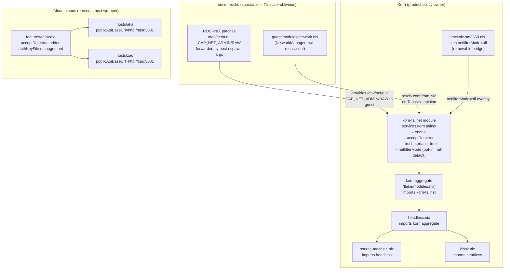

# feat: Korri-owned tailnet fleet policy

## Summary

Move all tailnet/Tailscale policy out of the `nix-on-rocks` substrate and into a Korri-owned `services.korri.tailnet` NixOS module that propagates fleet-wide across ARM and x86 products via the Korri aggregate. The substrate becomes Tailscale-oblivious: it only ensures the generic OS primitives needed to run a VPN client (TUN device, kernel capability forwarding) are available to the guest. The guest OS makes every product tailnet decision. A temporary `netfilterMode = "off"` compatibility option exists in the module to handle the current ROCKNIX kernel's missing MARK/iptables pieces, and a separate substrate unit tracks exposing those missing primitives so the workaround can be removed cleanly.

---

## Problem Frame

Live validation on Bandai proved that `--accept-dns=true` works in the guest, resolving `aka` to its tailnet IP and enabling Korri federation over Tailscale. However, the `nix-on-rocks` guest substrate previously declared `services.tailscale` with `--accept-dns=false`, `--netfilter-mode=off`, and a hostname override — product/policy decisions that belong in Korri, not in the minimal substrate. The substrate should be oblivious to which VPN (if any) a downstream product enables, what DNS mode it uses, and what firewall integration it chooses.

A secondary blocker exists: the running ROCKNIX kernel lacks `xt_mark`, `xt_MARK`, `nft_compat`, `x_tables`, and `iptable_*` loadable modules, so standard Tailscale netfilter integration fails with a MARK health warning when `--netfilter-mode=on` or `nodivert` is used. Until the substrate exposes those kernel pieces to the guest, a product-level `netfilterMode = "off"` override is needed as a removable bridge.

---

## Requirements

- R1. All Tailscale/tailnet configuration must be removed from `nix-on-rocks`; the substrate must be Tailscale-oblivious.
- R2. A Korri-owned `services.korri.tailnet` NixOS module must encapsulate fleet-wide tailnet policy (Tailscale enable, MagicDNS accept, firewall interface trust) and propagate through the Korri aggregate so every product image and source-machine host receives it without per-host wiring.
- R3. The `korri-tailnet` module must default to the "standard path" (`acceptDns = true`, `trustInterface = true`, no `netfilterMode` override) and expose `netfilterMode` only as an opt-in for constrained environments.
- R4. Korri product images (`headless.nix`, `source-machine.nix`, `kiosk.nix`) and the `korri` aggregate in `flake/modules.nix` must wire `korri-tailnet` so it propagates without downstream hosts needing to import it explicitly.
- R5. The Korri daemon's public API URL for Korri hosts must use `config.networking.hostName` (short MagicDNS name) rather than a hardcoded LAN IP, so Tailscale name resolution routes federation fetch traffic over the tailnet.
- R6. The `nix-on-rocks` boundary lint (`scripts/check-boundary-lint` and `guest/scripts/static-checks.sh`) must grow a guard that prevents any future reintroduction of `services.tailscale` or tailnet policy into the substrate.
- R7. Mountainous `features.tailscale` must be updated to include `acceptDns = true` by default for normal NixOS personal hosts, and `hosts/aka` and `hosts/zao` must use `config.networking.hostName` for their Korri public API URL.
- R8. Nix eval checks must verify the `korri-tailnet` module evaluates correctly and that the `korri-source-machine` image includes tailnet posture without SM8550-only carveouts.

---

## Scope Boundaries

- Do not add Tailscale kernel modules or netfilter-mode fixes to the ROCKNIX kernel build in this plan; that is a future substrate substrate-primitive fix tracked separately.
- Do not productize a Tailscale discovery plugin for Korri federation in this plan; mDNS is the current discovery mechanism and tailnet is the transport fix, not a new discovery layer.
- Do not change Korri federation protocol, mDNS advertise behavior, or the `services.korri.daemon.firewallInterfaces` logic.
- Do not touch Nix-on-Rocks RK3326 or RK3566 guest modules; they share `guest/modules/network.nix` and will inherit the substrate cleanup automatically.
- Do not remove the existing `nix-on-rocks` patch-queue checks that guard `/dev/net/tun`, `CAP_NET_ADMIN`, and `CAP_NET_RAW` forwarding from the ROCKNIX host into the guest container — those are substrate primitives, not product Tailscale policy.

### Deferred to Follow-Up Work

- **Expose normal Linux netfilter primitives from the ROCKNIX host kernel**: `xt_mark`, `xt_MARK`, `nft_compat`, etc. are missing from the running ROCKNIX kernel module tree on Bandai/Thor. Exposing them enables removal of the `netfilterMode = "off"` compatibility override from the SM8550 platform adapter. Track in `nix-on-rocks`.
- **Tailscale discovery plugin**: using `tailscaled`'s peer list as a Korri federation discovery source, replacing or supplementing LAN mDNS so off-LAN peers are discovered automatically. Separate plan in Korri.
- **Auth-key management**: declarative tailscale auth-key rotation for Korri device fleet. Out of scope here.

---

## Context & Research

### Relevant Code and Patterns

**Korri (primary repo)**
- `product/systems/nixos/modules/korri-tailnet.nix` — new module (already scaffolded, not yet wired into aggregate or images)
- `product/systems/nixos/flake/modules.nix` — exports `korri-tailnet`; `korri` aggregate must import it
- `product/systems/nixos/images/headless.nix` — base for all federation-capable product images; should enable `korri-tailnet`
- `product/systems/nixos/images/source-machine.nix` — stream-host image; imports `headless.nix`; inherits tailnet via headless
- `product/systems/nixos/images/kiosk.nix` — kiosk/portable device image; needs tailnet via headless
- `product/systems/nixos/images/platforms/rocknix-sm8550.nix` — SM8550 platform adapter; set `services.korri.tailnet.netfilterMode = "off"` and `ambientCapabilities.enable = true` here until substrate primitives are fixed
- `product/systems/nixos/modules/korri-daemon.nix` — `publicApiBaseUrl` option; Nix assertion already validates URL form; `KORRI_PUBLIC_API_BASE_URL` env export
- `tools/testing/nix/korri-source-machine-module-check.nix` — add check that `services.tailscale.enable` is true and `services.tailscale.extraSetFlags` includes `--accept-dns=true`
- `tools/testing/nix/korri-rocknix-sm8550-config-check.nix` — add check that SM8550 composition has `netfilterMode = "off"` and `ambientCapabilities` enabled
- `tools/testing/nix/korri-source-machine-image-check.nix` — add `publicApiBaseUrl` not containing a hardcoded IP check

**nix-on-rocks (cross-repo)**
- `guest/modules/network.nix` — Tailscale block already removed in working tree; needs commit
- `scripts/check-boundary-lint` — boundary lint guard already added in working tree; needs commit
- `guest/scripts/static-checks.sh` — packaged-fallback guard already added in working tree; needs commit
- `patches/rocknix/0010-substrate-pass-fuse-for-document-portal.patch` — contains the host-side `/dev/net/tun`, `CAP_NET_ADMIN`, `CAP_NET_RAW` forwarding check; this is correct substrate primitive behavior, do not remove

**Mountainous (cross-repo)**
- `features/tailscale/default.nix` — `acceptDns` option already added in working tree; needs commit
- `features/tailscale/nixos.nix` — `acceptDnsFlag` wired into `extraUpFlags`/`extraSetFlags` in working tree; needs commit
- `hosts/aka/default.nix` — `publicApiBaseUrl` updated to use `config.networking.hostName` in working tree; needs commit
- `hosts/zao/default.nix` — same as aka; needs commit
- `flake.lock` — Korri input bumped to local trunk rev in working tree; needs commit (or upstream push + lock once Korri changes are merged)
- `presets/core/nixos.nix` — already sets `networking.firewall.trustedInterfaces = ["tailscale0"]`; no change needed

### Institutional Learnings

- `docs/solutions/architecture-patterns/gamescope-as-plugin-owned-composition-2026-06-17.md`: pattern for "product owns the decision, substrate just provides the primitive" — same layering principle applies to Tailscale.
- `docs/solutions/architecture-patterns/architectural-posture-as-nix-image-default-2026-05-27.md`: always-on fleet posture belongs in image/profile composition, not per-host config.

### External References

- Live Bandai validation (this session): `tailscale set --accept-dns=true` succeeded; `getent hosts aka` returned `100.117.97.45 aka.hummingbird-lake.ts.net`; `curl http://aka:3001/` returned `404` from `100.117.97.45` (correct — Korri root 404 is expected). Standard netfilter mode failed with `MARK revision 0 not supported, missing kernel module` — confirmed `xt_mark`/`xt_MARK`/`nft_compat` not present in `/lib/modules/7.0.2` on the running ROCKNIX kernel.

---

## Key Technical Decisions

- **`korri-tailnet` wired into the `korri` aggregate, not per-image**: Every Korri product composition imports `korri`; wiring `korri-tailnet` there means x86 source-machine hosts (aka, zao), ARM kiosk devices (Bandai/Thor), and any future Korri device all inherit it without per-image boilerplate. Images only need to set the platform-specific `netfilterMode` override.
- **Standard defaults, one opt-in for constrained environments**: `acceptDns = true`, `trustInterface = true`, `netfilterMode = null` (Tailscale-managed) are the fleet defaults. `netfilterMode = "off"` is set only in `rocknix-sm8550.nix` as a removable bridge until substrate primitives are fixed.
- **`ambientCapabilities` option in `korri-tailnet` not set globally**: `CAP_NET_ADMIN`/`CAP_NET_RAW` ambient capabilities are already granted by the ROCKNIX host patch queue via the nspawn launch args — adding them again to the NixOS systemd unit is harmless but unnecessary on normal hosts. The option exists for environments where the NixOS unit would otherwise lack them, but the default is off.
- **`publicApiBaseUrl` uses short MagicDNS hostname**: Once Tailscale accept-DNS is on, short hostnames resolve to tailnet IPs, making `http://aka:3001` reachable over Tailscale. This removes the hardcoded LAN IP from Korri daemon advertising.
- **nix-on-rocks changes committed independently**: The three working-tree changes to `nix-on-rocks` (network module cleanup, boundary lint guard, static-check guard) are ready to commit and ship as a standalone substrate cleanup, decoupled from Korri or Mountainous timelines.

---

## Open Questions

### Resolved During Planning

- **Should `netfilterMode = "off"` be the global default?** No. The goal is standard Tailscale behavior everywhere. `off` is a temporary bridge for the specific kernel capability gap in ROCKNIX and should be set only in the SM8550 platform adapter.
- **Should `korri-tailnet` be per-image or in the aggregate?** In the aggregate (`korri`). Fleet-wide posture belongs in the shared base, not duplicated per image.
- **Should `ambientCapabilities` be enabled fleet-wide?** No. The nspawn launch patches already forward the capabilities from the ROCKNIX host. Setting them in the NixOS unit too is double-layering. The option exists as a fallback for future environments that don't get them from the container launcher.
- **Can Mountainous hosts stop owning Tailscale entirely and delegate to `korri-tailnet`?** Not yet — Mountainous non-Korri hosts also use `mountainous.features.tailscale`, and auth-key management lives there. The two coexist: Korri devices get `services.korri.tailnet`; Mountainous wraps that for personal-host concerns like auth-key injection.

### Deferred to Implementation

- **`headless.nix` vs `korri` aggregate as the wiring point**: if `headless.nix` is the right place (because not all `korri`-aggregate consumers need Tailscale), the implementer should prefer that after reading the aggregate consumer list. The plan states the aggregate as the default because every current Korri deployment needs tailnet.
- **Whether `firewallInterfaces` in `korri-daemon.nix` should default to `[ "tailscale0" ]`**: once tailnet is the universal transport, LAN-only firewall scoping becomes redundant for Korri hosts. Assess during implementation but treat it as a follow-up if risky.

---

## High-Level Technical Design

> *This illustrates the intended approach and is directional guidance for review, not implementation specification. The implementing agent should treat it as context, not code to reproduce.*

---

## Implementation Units

### U1. Commit nix-on-rocks substrate cleanup

**Goal:** Land the three working-tree `nix-on-rocks` changes as an atomic commit: Tailscale block removed from `guest/modules/network.nix`, boundary lint guard added to `scripts/check-boundary-lint`, packaged-fallback guard added to `guest/scripts/static-checks.sh`.

**Requirements:** R1, R6

**Dependencies:** None

**Files:**
- Modify: `guest/modules/network.nix` *(working-tree change, ready to commit)*
- Modify: `scripts/check-boundary-lint` *(working-tree change, ready to commit)*
- Modify: `guest/scripts/static-checks.sh` *(working-tree change, ready to commit)*

**Approach:**
- The three changes are already made and correct. Commit them together as a single logical substrate cleanup with a message that frames the intent: substrate becomes Tailscale-oblivious; products own VPN policy.
- Do not add any replacement Tailscale config to the substrate modules — the downstream Korri product layer (U2–U4) owns that.
- The existing patch-queue checks in `patches/rocknix/0010-substrate-pass-fuse-for-document-portal.patch` that assert `/dev/net/tun`, `CAP_NET_ADMIN`, and `CAP_NET_RAW` in the ROCKNIX host are substrate primitives and must stay untouched.

**Test scenarios:**
- Happy path: `bash scripts/check-boundary-lint` exits 0 after commit.
- Happy path: `bash guest/scripts/static-checks.sh` exits 0 after commit.
- Error path: temporarily re-add `services.tailscale.enable = true;` to any guest module, verify lint fails with the new guard message.

**Verification:**
- `bash scripts/check-boundary-lint` and `bash guest/scripts/static-checks.sh` both pass.
- `grep -r "services\.tailscale" guest/modules guest/profiles` returns no matches.

---

### U2. Wire `korri-tailnet` into the Korri aggregate and headless image

**Goal:** Make the `korri-tailnet` module (already created at `product/systems/nixos/modules/korri-tailnet.nix`) propagate fleet-wide by importing it into the `korri` aggregate in `flake/modules.nix`, so every Korri product image and source-machine composition receives fleet tailnet posture without per-host wiring.

**Requirements:** R2, R4

**Dependencies:** None (U1 is substrate-side; these are parallel)

**Files:**
- Modify: `product/systems/nixos/flake/modules.nix` *(working-tree: `korri-tailnet` export added; aggregate import still needed)*
- Modify: `product/systems/nixos/modules/korri-tailnet.nix` *(may need refinement; verify `key = "korri-tailnet"` dedup works)*

**Approach:**
- Add `korri-tailnet` to the `korri` aggregate's `imports` list in `flake/modules.nix` (alongside `korri-bluetooth`, `korri-runtime`, etc.).
- Verify the `key = "korri-tailnet"` field in `korri-tailnet.nix` prevents duplicate imports when `korri-source-machine` (which imports `korri`) and a downstream host both pull it in.
- Confirm `services.korri.tailnet.enable` defaults to `true` so all fleet products get Tailscale without opt-in.
- The `netfilterMode` option defaults to `null` (no override, standard Tailscale behavior); `ambientCapabilities` defaults to off.

**Patterns to follow:**
- `korri-bluetooth` in `flake/modules.nix` as the pattern for a fleet-wide module in the aggregate.
- `key = "korri-bluetooth"` in `product/systems/nixos/modules/korri-bluetooth.nix` for dedup field reference.

**Test scenarios:**
- Happy path: `nix eval .#nixosModules.korri.imports` lists `korri-tailnet`.
- Happy path: a minimal eval of `korri` aggregate produces `services.tailscale.enable = true` and `extraSetFlags` containing `--accept-dns=true`.
- Edge case: importing `korri-source-machine` (which imports `korri`) does not produce a duplicate-import evaluation error.

**Verification:**
- `nix eval --json .#nixosModules.korri-source-machine.imports` (or equivalent test eval) shows tailscale enabled with `acceptDns`.

---

### U3. Set SM8550 platform netfilter compatibility override

**Goal:** Set `services.korri.tailnet.netfilterMode = "off"` and `services.korri.tailnet.ambientCapabilities.enable = true` in the SM8550 platform adapter, scoped as a removable bridge pending substrate kernel module fixes.

**Requirements:** R3

**Dependencies:** U2

**Files:**
- Modify: `product/systems/nixos/images/platforms/rocknix-sm8550.nix`

**Approach:**
- Add a focused block to `rocknix-sm8550.nix` that overrides `services.korri.tailnet.netfilterMode = "off"` and `services.korri.tailnet.ambientCapabilities = true`.
- Add an inline comment referencing the kernel gap (`xt_mark`/MARK module missing on ROCKNIX 7.0.2 kernel tree) and noting this is a removable bridge once the substrate exposes netfilter primitives.
- Do not touch any other Tailscale-adjacent settings in the file — the fleet module (U2) already provides the rest.

**Test scenarios:**
- Happy path: `nix eval .#nixosConfigurations.korri-thor-kiosk.config.services.tailscale.extraSetFlags` includes `--netfilter-mode=off`.
- Happy path: `nix eval .#nixosConfigurations.korri-thor-kiosk.config.services.tailscale.extraSetFlags` also includes `--accept-dns=true` (inherited from fleet default).
- Happy path: `nix eval .#nixosConfigurations.korri-thor-kiosk.config.systemd.services.tailscaled.serviceConfig.AmbientCapabilities` lists `CAP_NET_ADMIN` and `CAP_NET_RAW`.
- Edge case: x86 source-machine eval (no SM8550 platform module) does not have `--netfilter-mode=off` in extraSetFlags.

**Verification:**
- `nix eval` on Thor kiosk config shows `netfilterMode=off` in Tailscale flags and ambient caps set.
- `nix eval` on source-machine check (no SM8550 adapter) shows `netfilterMode` absent from flags.

---

### U4. Update Korri daemon `publicApiBaseUrl` defaults and Mountainous host config

**Goal:** Ensure Korri hosts advertise short MagicDNS hostnames (not LAN IPs) in `publicApiBaseUrl`, so federation peer fetch traffic routes over Tailscale once `acceptDns` is on.

**Requirements:** R5, R7

**Dependencies:** U2

**Files:**
- Modify: `hosts/aka/default.nix` *(working-tree: change already made)*
- Modify: `hosts/zao/default.nix` *(working-tree: change already made)*
- Modify: `features/tailscale/default.nix` *(working-tree: `acceptDns` option added)*
- Modify: `features/tailscale/nixos.nix` *(working-tree: `acceptDnsFlag` wiring added)*
- Modify: `flake.lock` *(working-tree: Korri input bumped)*

**Approach:**
- All working-tree Mountainous changes are already correct. Commit them together.
- Verify `nix eval .#nixosConfigurations.aka.config.services.korri.daemon.publicApiBaseUrl` returns `http://aka:3001` (not a LAN IP).
- Verify `nix eval .#nixosConfigurations.aka.config.services.tailscale.extraSetFlags` includes `--accept-dns=true`.
- After Korri changes from U2/U3 land upstream, update `flake.lock` to the published revision rather than the local file reference.

**Test scenarios:**
- Happy path: `nix eval` on aka config shows `publicApiBaseUrl = "http://aka:3001"`.
- Happy path: `nix eval` on aka config shows Tailscale `extraSetFlags` includes `--accept-dns=true`.
- Happy path: `nix eval` on zao config shows same pattern.
- Error path: setting `publicApiBaseUrl` to a hardcoded IP like `http://192.168.1.117:3001` still passes the Korri daemon Nix assertions (no IP restriction there) — confirm the hostname form is a Mountainous convention choice, not a Korri enforcement.

**Verification:**
- `nix eval` on aka/zao produces short-hostname public API URLs with `--accept-dns=true` in Tailscale flags.

---

### U5. Add Nix eval checks for tailnet posture

**Goal:** Add targeted Nix eval assertions to `korri-source-machine-module-check.nix` and `korri-rocknix-sm8550-config-check.nix` so tailnet posture is part of the verified source-machine and SM8550 contracts.

**Requirements:** R8

**Dependencies:** U2, U3

**Files:**
- Modify: `tools/testing/nix/korri-source-machine-module-check.nix`
- Modify: `tools/testing/nix/korri-rocknix-sm8550-config-check.nix`

**Approach:**
- In `korri-source-machine-module-check.nix`: add a check that `cfg.services.tailscale.enable == true` and that `cfg.services.tailscale.extraSetFlags` contains `"--accept-dns=true"`, and that no `--netfilter-mode=off` appears (source-machine is not SM8550; it should use standard mode or no override).
- In `korri-rocknix-sm8550-config-check.nix`: add a check that the Thor system has `services.tailscale.extraSetFlags` containing both `--accept-dns=true` and `--netfilter-mode=off`, and that `systemd.services.tailscaled.serviceConfig.AmbientCapabilities` includes the two caps.
- Follow the existing `check = message: assertion: { ... }` pattern used throughout both files.

**Patterns to follow:**
- `tools/testing/nix/korri-source-machine-module-check.nix` — `checks` list with `check "message" (assertion)` entries.
- `tools/testing/nix/korri-rocknix-sm8550-config-check.nix` — `checkSystem name system` helper with `lib.hasInfix` for string containment checks.

**Test scenarios:**
- Happy path: checks pass after U2 and U3 land.
- Error path: temporarily setting `services.korri.tailnet.acceptDns = false` in the test eval causes the source-machine check to fail with the new assertion message.
- Error path: removing the SM8550 `netfilterMode = "off"` override causes the sm8550 check to fail.

**Verification:**
- `nix build .#checks.x86_64-linux.korri-source-machine-module` passes.
- `nix build .#checks.x86_64-linux.korri-rocknix-sm8550-config` passes (where the check is build-side; if it is part of a larger check, the relevant assertion group passes).

---

### U6. Live deploy and verify on Bandai and Aka

**Goal:** Rebuild and switch Bandai (via Korri image push) and Aka (via Mountainous nixos-rebuild switch) with the new tailnet policy, then confirm short MagicDNS names resolve and Korri federation fetches remote catalogs over Tailscale.

**Requirements:** R2, R5

**Dependencies:** U2, U3, U4

**Files:** *(no new files; this is deployment verification)*

**Approach:**
- For Aka: `nixos-rebuild switch --flake .#aka` from the Mountainous repo. Confirm live Tailscale prefs show `CorpDNS=true`, `getent hosts bandai` returns a Tailscale IP, and `curl http://bandai:3001/api/rpc` succeeds.
- For Bandai: deploy updated Korri guest image. Confirm `tailscale debug prefs` shows `CorpDNS=true`, `NetfilterMode=0` (off), `getent hosts aka` returns `100.117.97.45`, and `curl http://aka:3001/api/rpc` succeeds.
- Confirm Korri federation sees remote catalog entries: `app.catalog.snapshot` with `scope: fabric` from Bandai includes `source.hostId: aka` entries.
- Watch Tailscale health for clean-state (no warnings) after `netfilterMode=off` applied declaratively.

**Test scenarios:**
- Happy path: after deploy, `getent hosts aka` on Bandai returns `100.117.97.45`.
- Happy path: `curl http://aka:3001/api/rpc` from Bandai returns non-5xx (404 or JSON body from Korri).
- Happy path: Korri fabric catalog from Bandai includes items with `source.hostId: aka`.
- Happy path: `tailscale status` on Bandai shows no health warnings.
- Error path: if Tailscale health shows a warning on Bandai after deploy, verify `tailscale debug prefs` shows `NetfilterMode=0`; if not, the SM8550 override did not apply correctly.

**Verification:**
- Short peer names resolve to tailnet IPs on both devices.
- Korri API is reachable between devices over Tailscale.
- Federation catalog includes cross-device entries.
- No Tailscale health warnings on Bandai.

---

## System-Wide Impact

- **Interaction graph:** `korri-tailnet` adds `services.tailscale.enable = true` to every Korri product NixOS composition. Any downstream host that also declares `services.tailscale` options will see them merged normally; conflicts surface at `nix eval` time.
- **Error propagation:** If `accept-dns` triggers DNS failover (e.g., on a device without Tailscale auth), the system falls back to the OS resolver chain. The resolver file at `/etc/resolv.conf` is managed by Tailscale when accepted; NM fallback depends on the product environment's resolvconf behavior.
- **State lifecycle risks:** Existing live Bandai/Aka Tailscale state (`/var/lib/tailscale/tailscaled.state`) persists across rebuilds. The `tailscale set` flags applied via `extraSetFlags` are idempotent and do not require re-auth.
- **API surface parity:** All Korri product images inherit tailnet posture from the aggregate. Non-Korri Mountainous hosts continue using `mountainous.features.tailscale`. The two option trees are independent; no collision.
- **Integration coverage:** The critical cross-layer path is: `korri-tailnet` enables Tailscale → Tailscale accepts MagicDNS → short peer names resolve to tailnet IPs → `publicApiBaseUrl = "http://<hostname>:3001"` routes over Tailscale → Korri federation fetches succeed. U6 validates this end-to-end.
- **Unchanged invariants:** Korri mDNS/avahi federation advertise behavior is unchanged. The `firewallInterfaces = ["tailscale0"]` constraint on the Korri daemon port is unchanged. Existing `korri-source-machine` launch/session/compositor behavior is unchanged.

---

## Risks & Dependencies

| Risk | Mitigation |
|------|------------|
| Tailscale `accept-dns` on Bandai causes DNS flap if Tailscale loses connectivity | Live-tested: `accept-dns=true` on Bandai is stable; Tailscale falls back to upstream resolvers. `netfilterMode=off` keeps ts-input chains but omits MARK-dependent rules. |
| ROCKNIX kernel missing netfilter modules causes Tailscale health warning if `netfilterMode` is not set to `off` on SM8550 | U3 explicitly sets `netfilterMode = "off"` in the SM8550 platform adapter. |
| `korri-tailnet` duplicate import causes evaluation error | Module uses `key = "korri-tailnet"` for NixOS dedup. U2 test scenarios verify this. |
| Mountainous `flake.lock` pointing to local Korri checkout creates non-reproducible remote builds | After Korri changes merge, update `flake.lock` to the published GitHub revision. |
| Short hostname `http://aka:3001` not resolving on a fresh Bandai without Tailscale auth | `publicApiBaseUrl` is the advertised URL for peers; Bandai can still reach Aka via LAN while the Tailscale path is the preferred route. No regression. |

---

## Sources & References

- Related plan: `work/items/active/01KWF99H29Q52N3BSD8RP0X45V-aka-headless-stream-host/plan.md`
- Live Bandai validation evidence: this planning session (2026-07-01); see conversation context.
- Korri tailnet module: `product/systems/nixos/modules/korri-tailnet.nix`
- nix-on-rocks substrate cleanup (working tree): `guest/modules/network.nix`, `scripts/check-boundary-lint`, `guest/scripts/static-checks.sh`
- Mountainous working-tree changes: `features/tailscale/default.nix`, `features/tailscale/nixos.nix`, `hosts/aka/default.nix`, `hosts/zao/default.nix`
- nix-on-rocks TUN/cap primitives: `patches/rocknix/0010-substrate-pass-fuse-for-document-portal.patch`
