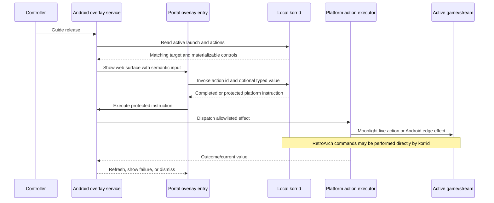
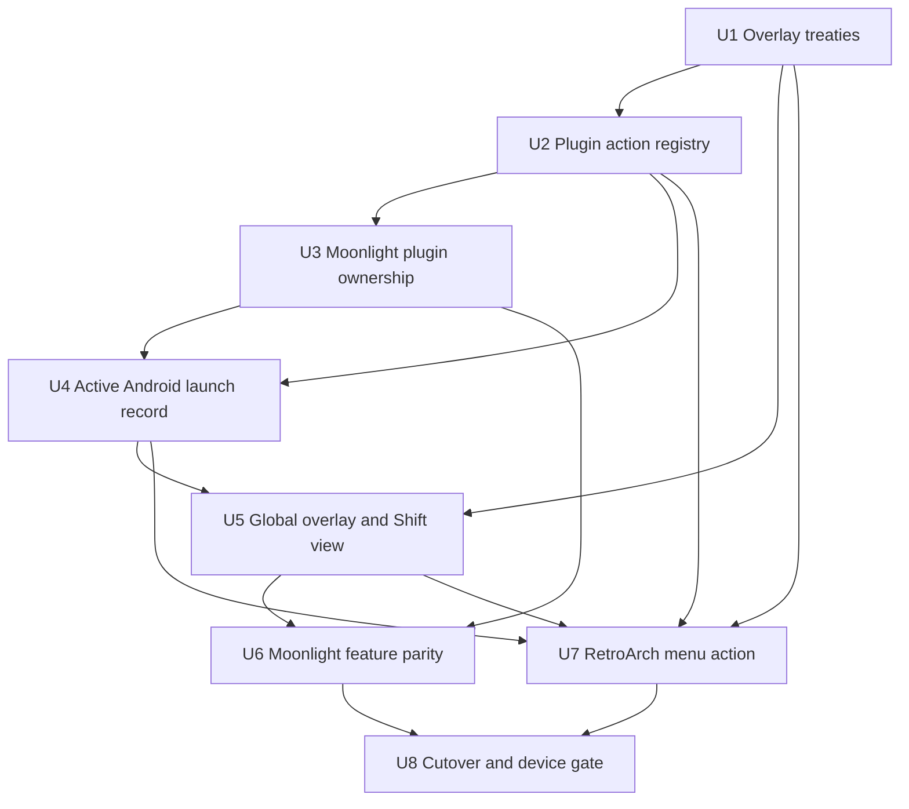
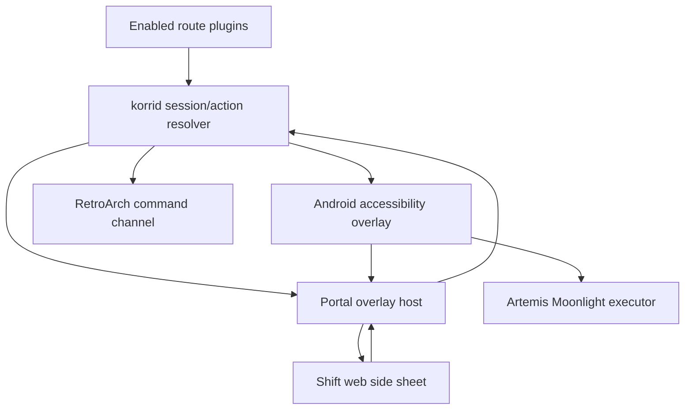

# feat: Unify Android gameplay overlays behind plugin actions

## Summary

Productionize the Android overlay proof of concept as one global, web-rendered Shift side sheet for every Korri-launched gameplay session. The overlay will show only actions that the active route's enabled plugins can fulfill, migrate streaming ownership into `@korri:moonlight`, preserve the complete Artemis gameplay menu and pre-stream lifecycle, and add RetroArch's native menu as a plugin-owned action.

---

## Problem Frame

Korri currently has two incompatible gameplay-menu paths. Artemis streams use `KorriGameOverlay`, an in-activity WebView backed by direct calls into `Game`, while local emulators have no equivalent menu. The `spike/korri-overlay` branch proved that an Android accessibility service can capture Guide and place a WebView over both external games and a live stream, but the spike has no session scoping, bridge, plugin actions, permission recovery, or production tests.

Copying the existing stream menu into each emulator would create a fork treadmill. Conversely, replacing it before every Moonlight control has a working global path would remove features. The implementation therefore needs a single host, a truthful capability-driven action contract, and an explicit parity gate.

---

## Requirements

- **R1. One Android gameplay overlay:** Every Android gameplay session launched through Korri can summon the same global `TYPE_ACCESSIBILITY_OVERLAY` WebView with Guide. Local games and streamed games do not retain separate gameplay-menu hosts.
- **R2. Strict session scoping:** Guide is consumed only when a live Korri launch record matches the foreground game target, or when the overlay is already open. Directly launched games and unrelated applications retain their normal Guide behavior.
- **R3. Web-only presentation:** The gameplay menu is rendered by the bundled portal and Shift surface. Native Android owns windowing, input translation, permissions, and effect execution, but renders no duplicate menu.
- **R4. Literal Shift side-sheet behavior:** The gameplay overlay reuses Shift's existing sheet primitives and controller behavior from the merged-game host chooser: scrim, focus trap, first-control focus, Back claim, nearest-edge scrolling, and side-sheet layout.
- **R5. Capability-based controls:** Resume/dismiss is overlay-owned. Every other command, toggle, choice, or range control is published only when an enabled plugin in the active launch route declares it and the current platform executor can fulfill it. Korri does not invent a universal Quit action.
- **R6. Declaration-only plugin actions:** Plugin authors declare stable action identity, copy, control form, applicability, and a reference to an allowlisted effect. Plugins receive no host I/O. korrid validates the declaration, resolves it against the active session, authorizes invocation, and either performs the effect or returns a typed, integrity-protected platform instruction for the Android edge.
- **R7. Moonlight is a plugin:** `@korri:moonlight` becomes a first-class registered plugin in this work. Every shipped client enables it in its default client policy; registration, default enablement, user policy, platform implementation, and runtime fulfillability remain distinct.
- **R8. Preserve streaming gameplay features:** Before `KorriGameOverlay` or `overlay.html` is removed, the global sheet must preserve Resume, screen fit, keyboard, full keyboard, pan/zoom, mouse modes, rotation, HUD, floating menu button, keyboard-as-controller, touch sensitivity, both SGSR ranges, face-button flip, rumble, picture-in-picture, disconnect, and host quit behavior where each currently applies.
- **R9. Preserve pre-stream lifecycle:** `KorriSessionOverlay` and the portal's full-screen connection/progress/failure screen remain web-rendered and behaviorally unchanged. This work replaces only the gameplay menu shown after a stream is running.
- **R10. Honest session lifecycle:** The overlay arms only after a platform launch succeeds, disarms on explicit end or positive evidence that the launched process/stream ended, auto-closes when its session or foreground match disappears, and rejects stale action invocations.
- **R11. Visible permission state:** Korri reports whether the accessibility service is enabled, offers a path to Android's grant screen, rechecks on shell resume, explains restricted/unavailable states, and remains usable when the grant is absent or revoked.
- **R12. Controller-safe input:** The accessibility service consumes both halves of Guide but toggles on release, translates hardware into the existing semantic input vocabulary, prevents gameplay input leakage while open, and restores input cleanly on dismiss. D-pad and stick/hat navigation must be characterized on the production overlay window before cutover.
- **R13. RetroArch menu action:** `@korri:retroarch` contributes an enabled **Open RetroArch menu** action only for a live Korri RetroArch route. Invocation dismisses the Korri overlay, then uses the authenticated loopback command channel to toggle RetroArch's menu without exposing its token to JavaScript.
- **R14. No streaming regression:** The Moonlight stream can still connect, report lifecycle stages and failures, receive every existing live setting/control, disconnect while leaving the host game running, quit the host game, and recover from connection loss after the gameplay overlay moves out of `Game`.
- **R15. Installed-device proof:** Cutover requires device evidence over one local RetroArch session and one Moonlight stream, plus negative proof that Guide passes through for a directly launched game and an unrelated foreground app.
- **R16. Narrow and replay-safe trust boundary:** The overlay WebView accepts only the bundled asset origin, receives a purpose-built bridge rather than the full shell bridge, and cannot replay a protected destructive platform instruction. Production overlay control exposes no exported command receiver, arbitrary URL transport, bearer token, or RetroArch control token.

---

## Scope Boundaries

- Android is the only overlay host implemented in this plan. Shared session/action and surface contracts must not assume Android, but no Linux compositor or input-capture implementation is included.
- This plan does not create a fixed cross-plugin action list. Common wording or placement is used only when behavior is genuinely equivalent.
- This plan does not give plugin JavaScript access to Android, Moonlight, sockets, processes, files, or korrid internals.
- This plan does not replace the full-screen pre-stream `KorriSessionOverlay`.
- This plan does not add account UI, save-state UI, scanning, overlays for games not launched by Korri, or a general automation API.
- This plan does not redesign the host-selection sheet; it reuses the established Shift sheet compound.
- A user may still override normal plugin enablement through the existing policy model. “Enabled by every client” means each shipped client includes `@korri:moonlight` in its default client policy, not that the plugin bypasses registration or policy.

### Deferred to Follow-Up Work

- **Linux overlay host:** Implement the shared web surface against a Linux compositor and input edge after the Android contract is proven.
- **Automated remote stream liveness:** `01KYWWRS94PRXZJD2S9BFS99AQ` remains the follow-up for replacing human observation with a host-reported stream-live assertion.
- **Third-party plugin execution limits:** QuickJS interruption and memory caps remain separately tracked; this plan's action producers are bundled first-party plugins.

---

## Context & Research

### Relevant Code and Patterns

- `clients/android/app/src/main/java/com/limelight/KorriGameOverlay.java` and `clients/android/app/src/main/assets/korri-shell/overlay.html` are the parity inventory for the current streamed-game menu.
- `clients/android/app/src/main/java/com/limelight/KorriSessionOverlay.java`, `clients/portal/src/session/SessionScreen.tsx`, and `clients/portal/src/session/state.ts` define the pre-stream web lifecycle that remains in place.
- The `spike/korri-overlay` branch's `clients/android/app/src/main/java/com/limelight/korri/overlay/KorriOverlayService.java` proves global Guide capture and `TYPE_ACCESSIBILITY_OVERLAY` over local and streamed games. It is measurement code, not a production base to copy uncritically.
- `surfaces/shift/src/ui/organisms/ShiftLaunchLocationSheet.tsx`, `ShiftSheetRoot.tsx`, `ShiftSheetPanel.tsx`, and related sheet atoms define the required side-sheet interaction.
- `contracts/surface/korri-surface.ts`, `clients/portal/src/surface/SurfaceRoot.tsx`, and `clients/portal/src/surface/surface-model.ts` enforce “host owns facts/effects; surface owns pixels.”
- `services/korrid/src/plugin.rs`, `services/korrid/src/plugin_policy.rs`, `plugins/retroarch/plugin.ts`, and `services/korrid/tests/plugin_registry.rs` define declaration validation, identity reservation, enablement, and fulfillability.
- `services/korrid/src/launcher/types.rs` and `clients/android/app/src/main/java/com/limelight/KorriShellActivity.java` establish the signed-instruction pattern: korrid resolves and authorizes; the Android edge verifies and translates.
- `plugins/retroarch/android/patches/0004-korri-control-channel.patch` and `0007-authenticate-korri-control.patch` establish the authenticated, loopback-only RetroArch command boundary.
- `clients/android/app/src/main/java/com/simonwjackson/korri/korrid/KorriBrainService.java` already owns the foreground lifetime of the embedded korrid server and is the process-local source for its current port/capability.

### Institutional Learnings

- The Guide path must consume both down and up while acting once on release; otherwise Android may also handle the key.
- WebViews remain hardware-blind. Production input must enter through semantic `BridgeInputEvent` delivery, not JavaScript key-code handling or native WebView focus navigation.
- The accessibility grant can disappear and cannot be restored programmatically. If the service is disabled it cannot intercept Guide, so recovery must be proactively visible in Korri rather than promising that a missing service can handle the key press.
- `TYPE_ACCESSIBILITY_OVERLAY`, proven by the spike, supersedes the older parking-lot assumption of `TYPE_APPLICATION_OVERLAY`; no separate draw-over-other-apps permission is required.
- Foreground process presence is not proof of an active game, but process absence is positive end evidence. Foreground package/class and the launch record must be evaluated together.
- Artemis's gameplay controls currently call a live `Game` instance. The replacement needs a lifecycle-safe, process-local Android executor rather than teaching Rust or plugin code about Activity objects.
- The Korri RetroArch fork already supports authenticated `GET_STATUS` and `QUIT`; the menu action must extend that narrow allowlist rather than opening a generic command channel.

### External References

- No external research is required. The decisive behavior has already been measured in this repository and its overlay spike; Android framework documentation cannot replace installed-device proof for Guide routing, accessibility grant behavior, or controller focus.

---

## Key Technical Decisions

| Decision | Rationale |
|---|---|
| Use one global accessibility overlay for running gameplay, including streams | It removes the per-emulator fork treadmill and makes local/stream behavior identical. |
| Keep the pre-stream lifecycle WebView inside `Game` | It appears before gameplay, does not need global permission, and already preserves connection/failure semantics. |
| Load the bundled portal in a dedicated gameplay-overlay entry mode | A portal overlay root still mounts the normal `ShiftSurface` with one `SurfaceModel` and one `SurfaceHost`, but publishes an overlay presentation instead of browsing. This preserves the real portal origin, semantic input stack, korrid client, and surface boundary instead of maintaining a second standalone HTML UI. |
| Reuse the actual Shift sheet compound, not only its styling | The host selector's focus, Back, scrim, scrolling, and controller behavior are part of the requested design; portal code must not bypass the surface treaty by importing the sheet directly. |
| Standardize the control model, not a universal gameplay action list | Resume/close is universally true; quit, disconnect, native menu, and client settings are capabilities of particular active plugins. |
| Materialize only fulfillable controls | Plugin declaration, enablement, active-route participation, platform implementation, and live runtime availability are separate gates. |
| Follow the signed launch-instruction boundary for platform effects | korrid validates values against the materialized control, resolves and authorizes plugin-declared effects, and issues a one-use instruction bound to the current launch id; Android verifies it, rejects replay, and invokes only allowlisted platform adapters. |
| Use a process-local Moonlight action coordinator at the Android edge | `Game`, the brain service, and accessibility service share an application process. A lifecycle-bound coordinator avoids exported broadcasts, Activity references in Rust, and arbitrary IPC while permitting live UI-thread effects. Production overlay lifecycle has no exported show/hide receiver. |
| Keep the active launch record in the foreground brain/session owner | It survives shell Activity destruction, provides the overlay's route/action context, and publishes the same existing `launchId` through the Java/JNI/Rust seam rather than inventing a parallel generation identity. The accessibility service is a reader, not the source of truth. |
| Inject a dedicated origin-locked overlay bridge | The overlay gets only current local-korrid endpoint access, semantic input, and local dismissal. External navigation is blocked, capability access is asset-origin-gated, and the shell's launch, pairing, host-enumeration, and arbitrary transport methods are absent. |
| Match foreground target at package and, where necessary, component level | Artemis's `Game` and Korri's portal share a package, so package-only matching would arm the overlay over Korri itself. External launchers may use package-level matching when their route legitimately changes activities. |
| Register `@korri:moonlight` normally and enable it in client defaults | This preserves registration, policy, and fulfillability distinctions rather than inventing an undisableable plugin tier. |
| Remove `KorriGameOverlay` only after an explicit parity matrix passes | The old path is the only current implementation of many live stream controls; deletion is the final migration step, not the first. |

---

## Plugin Authoring Model

This is directional guidance for the authoring experience, not an exact schema or implementation specification. Field names should be finalized by extending the existing declaration decoder with the minimum records required by the real Moonlight and RetroArch producers.

A plugin author supplies four kinds of information:

| Declared concern | What the author expresses | What the author cannot do |
|---|---|---|
| Ownership | Stable plugin-local action identity and the launcher, transport, or runtime contribution to which it applies | Claim actions for another plugin's route |
| Presentation | Label, description, destructive tone, grouping, and one of the proven control forms: command, toggle, choice, or bounded range | Render custom HTML or import Shift |
| Effect reference | An opaque integration command implemented by korrid or a platform adapter | Run a process, open a socket, call Android, or inspect the host |
| Dismissal behavior | Whether the Korri sheet stays open, refreshes, or closes before the effect becomes visible | Manipulate the overlay window directly |

High-level examples:

- `@korri:moonlight` declares the existing stream controls against its Moonlight transport contribution. Its Android Artemis implementation materializes current values/options and fulfills the allowlisted live effects.
- `@korri:retroarch` declares **Open RetroArch menu** against its RetroArch launcher contribution. korrid fulfills it through the authenticated command channel and requires the overlay to dismiss first.
- A launcher with no reliable quit implementation declares no quit action. The side sheet remains consistent without advertising a false capability.

At runtime, korrid intersects these declarations with the active route, enabled plugin registry, current platform, and executor availability. The web surface receives the resulting controls, not raw plugin declarations or effect payloads.

---

## Open Questions

### Resolved During Planning

- **Does one overlay mean one visual surface or one native host?** One native global accessibility-overlay host for all running gameplay.
- **What happens to stream connection progress and failures?** The existing full-screen web lifecycle remains inside Artemis; only the running-game menu moves.
- **What owns streaming?** `@korri:moonlight`; Artemis is its Android implementation.
- **Is Moonlight special-cased outside plugin policy because every client enables it?** No. Every client enables the normally registered plugin in its default policy.
- **Is Quit a universal action?** No. The universal contract is the sheet and control model; gameplay actions are capability-derived.
- **Does the new overlay copy the host chooser's appearance?** It reuses the actual Shift sheet compound and behavior.
- **Which window type is authoritative?** `TYPE_ACCESSIBILITY_OVERLAY`, as proven by the spike; the older `TYPE_APPLICATION_OVERLAY` note is superseded.
- **How are live Artemis actions reached?** Through a lifecycle-bound, process-local Android Moonlight executor selected by a korrid-authorized typed instruction.

### Deferred to Implementation

- **Can the focused accessibility-overlay WebView receive stick/hat motion directly on every target controller?** Characterize this before removing the in-activity overlay. D-pad semantic navigation is required regardless; inability to preserve stick navigation blocks cutover rather than licensing a hardware-specific JavaScript shortcut.
- **Does the production Korri RetroArch configuration pause when the accessibility overlay takes focus?** Measure on the Korri fork. Preserve `pause_nonactive`; document honest per-transport behavior instead of assuming all games pause.
- **Can the current Korri RetroArch build render a usable command-opened menu under kiosk configuration?** Verify menu assets, driver, kiosk restrictions, and z-order before declaring the action fulfillable. If not, U7 adjusts only what is necessary to make command-opened access work while hardware menu shortcuts stay disabled.
- **Which exact Android restricted-settings path appears on each supported OS build?** Detect and report what Android exposes; do not hardcode a success claim after merely opening Settings.
- **What are the final serialized names for action/control records?** Extract the smallest strict schema from the Moonlight command/toggle/choice/range inventory and RetroArch command case during U1/U2; no compatibility aliases are required on `main`.

---

## High-Level Technical Design

> *This illustrates the intended approach and is directional guidance for review, not implementation specification. The implementing agent should treat it as context, not code to reproduce.*

The active launch record is the join point. It identifies the chosen route's participating plugin contributions, the expected foreground target, and the live platform executor. The accessibility service is only the Guide/window adapter; it does not decide which game is active or which actions are allowed.

---

## Implementation Units

### U1. Define the gameplay-overlay treaties

**Goal:** Establish the minimum cross-deployable contracts for a dedicated gameplay-overlay presentation, materialized controls, typed invocation values/outcomes, active launch identity, and integrity-protected platform effects.

**Requirements:** R3, R4, R5, R6, R10, R12, R16

**Dependencies:** None

**Files:**
- Modify: `services/korrid/src/lib.rs`
- Modify: `services/korrid/src/launcher/types.rs`
- Modify: `contracts/surface/korri-surface.ts`
- Regenerate: `contracts/generated/korrid.ts`
- Modify: `contracts/bridge/korri-native-bridge.ts`
- Create: `clients/portal/src/overlay/overlay-model.ts`
- Create: `clients/portal/src/overlay/overlay-model.test.ts`

**Approach:**
- Model the four control forms already required by the current stream menu: command, toggle, choice, and bounded range. The materialized model carries display copy, enabled/failure state, current value/options where applicable, destructive tone, and whether successful invocation dismisses the sheet.
- Keep raw plugin effect references and platform instructions out of the surface treaty. The surface reports only the opaque control id and a value valid for that control form.
- Add an explicit gameplay-overlay presentation to the single `SurfaceModel`/`SurfaceHost` treaty rather than creating a second native UI or allowing portal code to pass host state directly into Shift components.
- Extend the tagged `app.session.*` korrid RPC family with active-session control listing/invocation outcomes and an integrity-protected platform instruction shape, following `LaunchSpec` signing and tagged failures.
- Reuse the existing `launchId` in listing and invocation so a control fetched for one game cannot execute against a replacement session. Do not add a second generation identity unless implementation proves `launchId` cannot close a concrete race.
- Bind each platform instruction to `launchId` plus a cryptographically random, one-use invocation nonce. Android records consumption for that active launch and rejects a second presentation of the same valid instruction.
- Make korrid the authoritative value validator: no platform instruction is created until command/toggle/choice/range input is valid against the currently materialized control.
- Extend `BridgeInputEvent` with the existing semantic `system` action so Guide reaches the input bus without exposing its Android key code.
- Keep platform-specific payloads closed and allowlisted. JavaScript never receives a RetroArch token, Activity object, arbitrary intent, socket target, Java method name, or network destination.

**Execution note:** Start with contract and pure-model tests that characterize valid controls, malformed values, disabled controls, and stale-session rejection before adding executors.

**Patterns to follow:**
- Tagged outcomes and Typeshare ownership in `services/korrid/src/lib.rs`.
- Signed `LaunchSpec` and native verification in `services/korrid/src/launcher/types.rs`.
- Pure `SurfaceModel` translation in `clients/portal/src/surface/surface-model.ts`.
- Existing `SurfaceAction` and setting interaction types in `contracts/surface/korri-surface.ts` without forcing them to represent ranges they cannot express.

**Test scenarios:**
- **Happy path:** A running session with command, toggle, choice, and range controls materializes into a surface model preserving labels, current values, options, enabled state, tone, and dismiss behavior.
- **Edge case:** A session with only overlay-owned Resume produces a valid sheet with no empty plugin group.
- **Validation:** Choice values outside published options, range values outside bounds or step, and values supplied to command controls are rejected before effect resolution.
- **Stale state:** Invocation carrying an old launch id/generation returns a tagged stale-session outcome and executes nothing.
- **Security:** Tampering with a protected platform instruction's action id, value, launch id, nonce, or payload fails native integrity verification; presenting one untampered instruction twice executes it once and rejects the replay.
- **Surface isolation:** The Shift-facing model contains no generated korrid type, native bridge type, integration command, or platform instruction.

**Verification:**
- Contracts regenerate cleanly; portal and surface typechecks agree; pure tests prove that only valid, current, presentation-safe controls can cross into Shift.

### U2. Add plugin-declared session controls and resolution

**Goal:** Extend the strict plugin registry so enabled plugins can declare contextual session controls and korrid can resolve only the controls owned by an active launcher, transport, or runtime contribution.

**Requirements:** R5, R6, R7, R16

**Dependencies:** U1

**Files:**
- Modify: `services/korrid/src/lib.rs`
- Modify: `services/korrid/src/plugin.rs`
- Modify: `services/korrid/src/plugin_policy.rs`
- Modify: `services/korrid/src/config/resolver.rs`
- Modify: `services/korrid/src/bin/plugin_registry_probe.rs`
- Modify: `services/korrid/tests/plugin_registry.rs`
- Modify: `services/korrid/tests/plugin_registry_probe.rs`
- Create: `services/korrid/tests/session_actions.rs`
- Modify: `services/korrid/package.nix`
- Modify: `services/korrid/SCRIPTING.md`

**Approach:**
- Add the smallest strict contribution records grounded by the Moonlight and RetroArch cases; retain `deny_unknown_fields`, identity normalization, collision rejection, and disabled-plugin identity reservation.
- Attach each control to an existing or newly grounded plugin contribution that can participate in an active route. Do not infer applicability from title, provider name, or game id.
- Validate labels/control metadata and allow only integration commands registered by korrid or a platform executor. Duplicate global action identity and cross-plugin ownership claims fail registry construction.
- Resolve controls in deterministic order: overlay-owned controls first, then active route contributors in route order, then stable plugin-local identity. Disabled, unrelated, unsupported-platform, or unavailable-executor controls are absent rather than optimistically enabled.
- Treat executor availability as live session state published through the Android launch/session seam in U4 and Moonlight coordinator in U6; plugin registration alone never proves an effect can run.
- Preserve normal user policy override semantics. Client defaults enable Moonlight; the registry does not gain a hidden mandatory-plugin exception.

**Execution note:** Implement the new declaration grammar test-first because strict decoding and identity reservation are security boundaries.

**Patterns to follow:**
- Provider/system/launcher/runtime normalization in `services/korrid/src/plugin.rs`.
- Disabled identity reservation and layered policy in `services/korrid/src/plugin_policy.rs`.
- Plugin composition in `services/korrid/src/config/resolver.rs`.

**Test scenarios:**
- **Happy path:** Two active route plugins contribute distinct controls; both appear with stable ownership and ordering.
- **Enablement:** Disabling a plugin removes its controls but reserves their identities; re-enabling restores them without changing ids.
- **Applicability:** A RetroArch control never appears for an Android-app or Moonlight route, even when the plugin is registered and enabled.
- **Platform availability:** A declared Android-only effect is absent on Linux and absent on Android when its executor is not registered.
- **Collision:** Duplicate control identity across plugins and duplicate local identities within one plugin fail deterministically.
- **Malformed declaration:** Unknown fields, nulls, invalid ranges, empty labels/effects, unsafe ownership references, and unsupported control forms fail decoding.
- **Security:** A plugin cannot declare an arbitrary process, URL, intent, socket address, Java method, or effect belonging to another integration.
- **Probe:** Registry reports registered versus enabled controls consistently with existing contribution categories.

**Verification:**
- The registry can explain which plugin owns every materialized control; no plugin code performs an effect or bypasses enablement/route resolution.

### U3. Declare Moonlight as the streaming plugin

**Goal:** Move streaming identity, default enablement, Artemis implementation selection, and stream gameplay-control declarations under `@korri:moonlight` without moving native pairing/protocol effects into plugin JavaScript.

**Requirements:** R6, R7, R9, R14

**Dependencies:** U2

**Files:**
- Create: `plugins/moonlight/plugin.ts`
- Create: `plugins/moonlight/README.md`
- Create symlink: `services/korrid/plugins/moonlight.plugin.ts` → canonical `plugins/moonlight/plugin.ts`
- Modify: `services/korrid/src/plugin_policy.rs`
- Modify: `services/korrid/package.nix`
- Modify: `services/korrid/tests/plugin_registry.rs`
- Modify: `services/korrid/tests/plugin_registry_probe.rs`
- Modify: `clients/portal/src/launchables/state.ts`
- Modify: `clients/portal/src/surface/use-launchables.ts`
- Modify: `clients/portal/src/bridge/launcher-bridge.ts`
- Modify: `clients/portal/src/bridge/launcher-bridge.test.ts`
- Modify: `clients/portal/src/launchables/state.test.ts`
- Modify: `clients/portal/src/surface/surface-model.test.ts`

**Approach:**
- Declare one stable Moonlight transport/launcher identity and its Android Artemis implementation. Keep pairing certificates, host discovery, app lookup, and Activity startup at the Android edge.
- Move ownership of the current hardcoded Sunshine app selection and stream gameplay controls out of portal constants and into the resolved Moonlight contribution/launch instruction.
- Make portal stream discovery and start conditional on an enabled, fulfillable Moonlight contribution. The existing `queryStreamHosts`, `queryStreamApps`, and `startStream` bridge methods remain narrow Artemis platform effects in this slice; portal orchestration may call them only through the resolved Moonlight path, and they no longer establish product ownership or the Sunshine app identity by themselves.
- Keep `plugins/moonlight/plugin.ts` authoritative. The service-local path follows the existing symlink/materialization pattern used by mGBA and RetroArch so development and hermetic Nix builds consume the same declaration without hand-maintained copies.
- Include `@korri:moonlight` in every shipped client's default policy through the same explicit client-policy mechanism as other plugins. User policy still composes normally.
- Keep `KorriSessionOverlay`'s event vocabulary and full-screen presentation unchanged. The plugin owns the transport that produces those events; it does not rewrite the lifecycle UI.
- Document the plugin-author view at a conceptual level in `plugins/moonlight/README.md`: declarations identify capabilities and controls; Artemis code is the Android implementation.

**Patterns to follow:**
- Cross-platform identity/platform implementation split in `plugins/retroarch/plugin.ts`.
- Native streaming bridge seams in `clients/portal/src/bridge/launcher-bridge.ts`.
- Route fulfillability rather than registration-only checks in `services/korrid/src/config/resolver.rs`.

**Test scenarios:**
- **Happy path:** Registered, enabled Moonlight plus available Artemis implementation exposes stream discovery/start and the declared gameplay controls.
- **Default policy:** Each shipped client policy enables `@korri:moonlight` without bypassing the registry.
- **User policy:** An explicit user disable removes Moonlight stream fulfillability and controls while preserving its registered identities.
- **Unavailable implementation:** Enabled Moonlight on a client with no Artemis implementation advertises no playable stream route and no actions.
- **Ownership:** The portal contains no hardcoded Moonlight app/transport identity after resolution is introduced.
- **Regression:** Existing stream host/app query failures and start failures retain their tagged, user-facing behavior.
- **Lifecycle regression:** Pre-stream stage, failure, connected, and termination events remain byte-for-byte treaty-compatible.

**Verification:**
- Streaming remains usable on Android, but its identity and action inventory can be traced from `@korri:moonlight` through registry resolution to the Artemis platform edge.

### U4. Track the active Android launch and productionize service scoping

**Goal:** Give the foreground brain/session owner an honest active-launch record and turn the overlay spike into a permission-aware service that captures Guide only for the matching Korri-launched foreground game.

**Requirements:** R1, R2, R10, R11, R12, R16

**Dependencies:** U2, U3

**Files:**
- Modify: `contracts/bridge/korri-native-bridge.ts`
- Modify: `services/korrid/src/android.rs`
- Modify: `services/korrid/src/lib.rs`
- Modify: `clients/android/app/src/main/AndroidManifest.xml`
- Create: `clients/android/app/src/main/java/com/limelight/korri/overlay/KorriOverlayService.java`
- Create: `clients/android/app/src/main/java/com/limelight/korri/overlay/KorriActiveLaunch.java`
- Create: `clients/android/app/src/main/java/com/limelight/korri/overlay/KorriOverlayPermission.java`
- Create: `clients/android/app/src/main/res/xml/korri_overlay_service.xml`
- Modify: `clients/android/app/src/main/res/values/korri_strings.xml`
- Modify: `clients/android/app/src/main/java/com/simonwjackson/korri/korrid/KorriBrainService.java`
- Modify: `clients/android/app/src/main/java/com/simonwjackson/korri/korrid/KorridServer.java`
- Modify: `clients/android/app/src/main/java/com/limelight/KorriShellActivity.java`
- Modify: `clients/android/app/src/main/java/com/limelight/Game.java`
- Create: `clients/android/app/src/test/java/com/limelight/korri/overlay/KorriActiveLaunchTest.java`
- Create: `clients/android/app/src/test/java/com/limelight/korri/overlay/KorriOverlayPermissionTest.java`
- Create: `clients/android/app/src/test/java/com/limelight/korri/overlay/KorriOverlayServiceTest.java`
- Modify: `clients/portal/src/bridge/launcher-bridge.ts`
- Modify: `clients/portal/src/bridge/launcher-bridge.test.ts`
- Modify: `clients/portal/src/surface/use-launchables.ts`
- Modify: `clients/portal/src/surface/settings-model.ts`
- Modify: `clients/portal/src/surface/settings-model.test.ts`

**Approach:**
- Record a session only after Android has successfully started the selected launch. Carry the existing korrid `launchId`, game identity/title when known, active plugin contribution ids, platform executor identity, and foreground matching rule derived from the resolved route.
- Add an explicit Java/JNI/Rust publication seam so the Android launch edge can publish, clear, and read the active launch snapshot that korrid uses for action resolution. The Java record and Rust `ActiveSession` must agree on one `launchId`; neither side invents a shadow session.
- Use component-aware matching for Artemis because `Game` and `KorriShellActivity` share the same package. Allow package-level matching only for launchers whose foreground flow legitimately changes activities.
- Keep the launch record in the app's foreground owner and publish snapshots to korrid/action resolution and the accessibility service through process-local APIs. Do not persist the korrid bearer capability or expose it in broadcasts/logs.
- End records only on explicit successful stop/quit, stream termination, or positive process/target-end evidence. Shell resume and ordinary backgrounding change armed state but do not falsely claim the game ended.
- Register an exported accessibility service protected by `BIND_ACCESSIBILITY_SERVICE`, requesting only key filtering and window-state events; do not retrieve screen content or perform gestures. Production code registers no exported show/hide broadcast receiver—the spike's adb command receiver is explicitly discarded.
- Consume Guide down/up only while armed or while the sheet is showing, toggle once on release, pass every event through while unarmed, and auto-hide immediately when foreground/session state makes the service unarmed.
- Expose grant state and the open-settings action through the existing Android bridge/settings model. Recheck on `korri-shell-resumed`; report opening Settings separately from receiving the grant.
- If the service is disabled, Korri remains fully launchable and shows a visible permission state. Do not retain the obsolete requirement that a disabled service itself intercept Guide and opens Settings.

**Execution note:** Port the spike as characterization evidence, then write production tests around the armed/unarmed state machine before adding the window.

**Patterns to follow:**
- Foreground lifetime in `KorriBrainService`.
- Permission-state and settings-return pattern used for storage/background notice in `KorriShellActivity` and `clients/portal/src/surface/settings-model.ts`.
- Minimal accessibility configuration measured on `spike/korri-overlay`.

**Test scenarios:**
- **Happy path:** Successful Korri launch plus matching foreground target arms the service; Guide down/up is consumed and toggles once on release.
- **Direct launch:** The same package started outside Korri has no active record; Guide down/up returns unconsumed.
- **Foreground mismatch:** A live session exists but another package or same-package non-Game Activity is foreground; Guide passes through.
- **Overlay open:** Foreground identity temporarily changes to the accessibility window; Guide still closes the sheet and does not disarm prematurely.
- **Stale record:** Game process/stream ends or target changes permanently; the record closes, an open sheet hides, and subsequent Guide passes through.
- **Race:** Session A ends as Session B starts; `launchId` matching prevents A's late callback from clearing or acting on B.
- **Permission:** Enabled, disabled, restricted/unavailable, and Settings-opened states map to distinct user-facing outcomes; resuming the shell rechecks actual state.
- **Revocation:** Service destruction while the sheet is open removes the window and leaves gameplay/input usable.
- **Privacy:** Accessibility configuration requests no window content and no gesture capability.
- **Security:** No bearer capability or RetroArch token is persisted, broadcast, or logged in debug or release behavior; a third-party explicit broadcast cannot show or hide the overlay.

**Verification:**
- The service can explain why it is armed, never consumes Guide outside a matching Korri session, and presents an honest permission state without making the portal dependent on the grant.

### U5. Render the unified Shift gameplay side sheet

**Goal:** Add a dedicated portal gameplay-overlay entry that renders the active session's materialized controls through the existing Shift sheet compound and semantic focus/input system.

**Requirements:** R1, R3, R4, R5, R11, R12, R16

**Dependencies:** U1, U4

**Files:**
- Modify: `clients/android/app/src/main/java/com/limelight/korri/overlay/KorriOverlayService.java`
- Create: `clients/android/app/src/main/java/com/limelight/korri/overlay/KorriOverlayBridge.java`
- Create: `clients/android/app/src/test/java/com/limelight/korri/overlay/KorriOverlayBridgeTest.java`
- Modify: `clients/portal/src/main.tsx`
- Create: `clients/portal/src/overlay/OverlayRoot.tsx`
- Create: `clients/portal/src/overlay/overlay-controller.ts`
- Create: `clients/portal/src/overlay/overlay-controller.test.ts`
- Create: `clients/portal/src/overlay/in-memory-overlay-controller.ts`
- Modify: `clients/portal/src/input/korri-native-adapter.ts`
- Modify: `clients/portal/src/input/korri-native-adapter.test.ts`
- Modify: `surfaces/shift/src/ShiftSurface.tsx`
- Create: `surfaces/shift/src/ui/organisms/ShiftGameplayOverlaySheet.tsx`
- Modify: `surfaces/shift/src/ui/organisms/ShiftSheetPanel.tsx`
- Create: `surfaces/shift/src/ui/molecules/ShiftSheetToggle.tsx`
- Create: `surfaces/shift/src/ui/molecules/ShiftSheetChoice.tsx`
- Create: `surfaces/shift/src/ui/molecules/ShiftSheetRange.tsx`
- Modify: `surfaces/shift/src/shift.css`
- Modify: `surfaces/shift/test/shift-surface.test.tsx`

**Approach:**
- Add the production focusable `TYPE_ACCESSIBILITY_OVERLAY` WebView host to the service state machine from U4. Boot the same bundled portal asset origin in an explicit gameplay-overlay mode.
- Inject a purpose-built overlay bridge, not `KorriShellActivity`'s full `KorriNative` bridge. It exposes only the current local korrid endpoint/capability, local dismissal, and semantic input delivery. It blocks every non-asset navigation and returns no capability unless the WebView is on the trusted asset origin.
- Read the current endpoint/capability from the foreground brain owner rather than caching a server-lifetime value in the service. If korrid restarts, remount/reload the overlay entry against the new endpoint while preserving local Resume/Close.
- `OverlayRoot` is a portal host, not a second surface: it constructs the overlay `SurfaceModel`/`SurfaceHost` and mounts `ShiftSurface`. Shift renders the overlay presentation with `ShiftSheetRoot`, `ShiftSheetPanel`, header/body/group primitives, and peer controls for command, toggle, choice, and range.
- Put Resume first and focus it whenever the sheet opens. Group plugin controls under human-readable contributor sections, omit empty groups, and preserve deterministic order from korrid.
- Translate direction/confirm/back/menu/options/system at the Android edge into the existing input bus. No key codes, controller ids, Activity names, or action effect tokens enter Shift.
- Back, B, Guide, scrim selection, and Resume close the overlay locally even when korrid is unavailable. Other controls become disabled with a calm, retryable error rather than trapping the player.
- Refresh materialized values after any non-dismissing effect and guard asynchronous responses with the current launch generation.

**Execution note:** Add Shift rendering/focus tests before connecting the Android host; the side sheet must be independently renderable in browser fixtures.

**Patterns to follow:**
- `ShiftLaunchLocationSheet.tsx` for exact sheet composition and initial focus.
- `ShiftGameActionsSheet.tsx` for host-owned action rendering.
- `clients/portal/src/input/spatial-focus.ts` for nearest-edge directional reveal.
- `SessionScreen` query-param composition in `clients/portal/src/main.tsx` for a dedicated web entry mode.

**Test scenarios:**
- **Happy path:** Opening over a Moonlight session renders Resume first, followed by all enabled Moonlight groups and live values; initial focus is Resume.
- **RetroArch path:** Opening over RetroArch renders Resume and RetroArch controls only; no Moonlight controls leak across routes.
- **Control forms:** Command invokes once; toggle reflects updated state; choice exposes only materialized options; range respects min/max/step and refreshes the displayed value. Each form uses its dedicated Shift control rather than conditional modes on `ShiftSheetAction`.
- **Focus:** Directional movement stays trapped inside the sheet and scrolls the nearest edge to keep the focused row visible.
- **Dismissal:** Back, Guide semantic action, scrim, and Resume close without requiring a successful korrid call.
- **Stale state:** A response from the previous launch is ignored after the active generation changes; the sheet closes when no active session remains.
- **Failure:** korrid unreachable or a platform action failure leaves Close/Resume operational and presents a user-readable problem without raw codes or payloads.
- **Surface boundary:** Shift imports only `contracts/surface/` and receives no native/korrid/generated types; `OverlayRoot` reaches Shift only through `ShiftSurface` and the treaty.
- **WebView origin:** Attempts to navigate to any non-asset URL are blocked; the overlay bridge withholds korrid capability outside the trusted asset origin.
- **Bridge minimization:** Reflection/contract tests show no overlay bridge method for launching games, starting streams, pairing, host enumeration, arbitrary HTTP, or arbitrary Android intents.
- **Brain restart:** A korrid restart while the sheet is open leads to endpoint refresh/remount and restored controls; Resume/Close works throughout.
- **Browser fixture:** The in-memory controller renders every control form and failure state without Android or a live korrid.
- **Accessibility:** Disabled controls are focusable only when needed to expose their explanation; destructive actions retain Shift's danger tone.

**Verification:**
- The browser fixture and Android-hosted view are visibly the same Shift side sheet as host selection, with controller focus and dismissal working independently of game transport.

### U6. Move every Moonlight gameplay control to the global overlay

**Goal:** Provide a lifecycle-safe Artemis executor for every existing streamed-game menu control, driven by `@korri:moonlight` declarations and korrid-authorized instructions, while preserving the pre-stream lifecycle.

**Requirements:** R7, R8, R9, R10, R12, R14, R16

**Dependencies:** U3, U5

**Files:**
- Create: `clients/android/app/src/main/java/com/limelight/korri/moonlight/KorriMoonlightActionCoordinator.java`
- Create: `clients/android/app/src/main/java/com/limelight/korri/moonlight/KorriMoonlightActionExecutor.java`
- Modify: `clients/android/app/src/main/java/com/limelight/Game.java`
- Modify: `clients/android/app/src/main/java/com/limelight/KorriSettingsBridge.java`
- Modify: `clients/android/app/src/main/java/com/limelight/korri/overlay/KorriOverlayService.java`
- Modify: `clients/android/app/src/main/java/com/simonwjackson/korri/korrid/KorridServer.java`
- Create: `clients/android/app/src/test/java/com/limelight/korri/moonlight/KorriMoonlightActionCoordinatorTest.java`
- Create: `clients/android/app/src/test/java/com/limelight/korri/moonlight/KorriMoonlightActionExecutorTest.java`
- Modify: `clients/android/app/src/test/java/com/limelight/KorriSessionOverlayTest.java`
- Modify: `clients/portal/src/overlay/overlay-controller.test.ts`
- Modify: `services/korrid/tests/session_actions.rs`
- Create: `docs/research/unified-android-game-overlay.md`

**Approach:**
- Register the current `Game` instance with a process-local coordinator on stream start and unregister only that generation on destruction. Hold lifecycle-safe references and marshal all live effects onto the Game UI thread.
- Make the executor expose current fulfillability, values, and choices for the exact controls already implemented by `KorriGameOverlay.OverlayBridge`; do not let the plugin name Java methods or SharedPreferences keys. Model the current `-1` mouse-mode sentinel as a separate local-cursor command rather than weakening choice validation with a magic negative option.
- Verify each korrid-authorized platform instruction before dispatch. Reject unknown effects, wrong control form/value, stale launch generation, no live Game instance, and calls from a non-Moonlight active route.
- Preserve live application behavior: controls that currently hide the menu before acting continue to dismiss; live fill/settings/range changes refresh in place where they do today.
- Keep disconnect and host quit distinct. Preserve the current “disconnect, game keeps running” behavior and use the established Moonlight host-quit path for host termination.
- Keep `KorriSessionOverlay` attached only during connection/failure. Global gameplay actions that end or lose a stream feed the existing graceful/failure lifecycle so return-to-portal and error narration remain intact.
- Characterize direct D-pad and stick/hat input while the global WebView has focus. If stick motion cannot reach the overlay window, retain the in-activity menu until an Android-edge semantic translation is proven; do not ship a touch-only regression.
- Create the device parity matrix in `docs/research/unified-android-game-overlay.md` now and record each current control's old path, new plugin owner, executor, expected dismissal/value behavior, and proof state. U8 consumes this as a cutover gate rather than reconstructing parity from memory.

**Execution note:** Treat `overlay.html` and `KorriGameOverlay.OverlayBridge` as characterization fixtures. Move one control category at a time behind parity tests, but do not remove the old host in this unit.

**Patterns to follow:**
- Existing UI-thread dispatch and live preference application in `KorriGameOverlay.java`.
- Lifecycle generation guards used by portal asynchronous launch state.
- Existing `KorriSessionOverlay` pull-then-push lifecycle log.

**Test scenarios:**
- **Parity commands:** Keyboard, full keyboard, rotate, HUD, floating button, keyboard controller, touch sensitivity, disconnect, and host quit invoke the same Game behavior as the old bridge.
- **Parity toggles:** Fill, pan/zoom, face-button flip, rumble, and PiP publish current state, apply once, and refresh to the resulting state.
- **Parity choices:** Mouse modes preserve valid labels/options and execute only a listed choice; local-cursor toggle appears as a separate command and no `-1` sentinel crosses the choice contract.
- **Parity ranges:** Both SGSR controls preserve bounds/step/current value and apply live without restarting the stream.
- **Lifecycle:** Destroying/recreating `Game` invalidates the old coordinator generation; late actions cannot reach the replacement Activity.
- **Unavailable state:** No live Game instance produces disabled controls or a tagged failure, never a null dereference or silent success.
- **Input isolation:** While the sheet is open, controller actions navigate the sheet and do not reach the remote host; after dismissal, input reaches the stream again.
- **Pre-stream regression:** Connection stages, decoder failure, host failure, graceful termination, and connection-loss presentation remain unchanged.
- **End behavior:** Disconnect keeps the host game running; host quit ends it; both close the global sheet and return/narrate exactly as the current menu does.
- **Manual integration:** Every item in the R8 parity inventory is exercised over a live stream before the old overlay is removed.

**Verification:**
- A streamed game exposes the complete current gameplay menu through the global Shift sheet, and every control has equal behavior or an explicitly blocking parity failure.

### U7. Add the RetroArch native-menu action

**Goal:** Let the active RetroArch plugin advertise and fulfill **Open RetroArch menu** through the existing authenticated loopback control channel.

**Requirements:** R5, R6, R10, R13, R16

**Dependencies:** U1, U2, U4, U5

**Files:**
- Modify: `plugins/retroarch/plugin.ts`
- Modify: `services/korrid/src/plugin.rs`
- Modify: `services/korrid/src/launcher/retroarch.rs`
- Create: `services/korrid/src/launcher/retroarch_control.rs`
- Create: `services/korrid/tests/retroarch_session_actions.rs`
- Modify: `plugins/retroarch/android/patches/0004-korri-control-channel.patch`
- Modify: `plugins/retroarch/android/patches/0007-authenticate-korri-control.patch`
- Modify: `plugins/retroarch/android/test-source-contract.sh`
- Modify: `plugins/retroarch/android/device-acceptance.sh`
- Modify: `plugins/retroarch/android/patches/README.md`
- Modify: `plugins/retroarch/android/NOTES.md`

**Approach:**
- First prove the current fork has the menu driver/assets and that a command-opened menu remains usable under kiosk configuration while normal hardware menu shortcuts stay disabled. If not, adjust only those fork/config constraints required for this explicit action; do not generally re-enable RetroArch UI.
- Extend the fork's authenticated Android allowlist with only the specific upstream menu-toggle command required by this action. Authentication must succeed before allowlist dispatch, and the generic RetroArch network command vocabulary remains unavailable.
- Change the pinned upstream source and regenerate the numbered patch through the existing patch workflow; the committed patch remains the distributable source artifact but is not hand-edited as an ungrounded diff.
- Keep loopback binding and 64-character per-server token validation. korrid derives/retains the session control authority and sends the command directly; JavaScript and the Android bridge never receive the token.
- Materialize the action only for a current RetroArch route with the Korri fork/control executor available. Stock RetroArch, unrelated apps, remote Moonlight copies, and stale routes do not receive it.
- Dismiss the Korri system overlay before toggling the RetroArch menu so the lower-z-order native menu is visible and interactive. The user can close the RetroArch menu normally and summon Korri again with Guide.
- Preserve graceful Quit as a separate plugin control only where the authenticated command channel fulfills it; opening the menu never implies stopping the session.

**Execution note:** Add protocol and allowlist tests before expanding the patch; this is a security-sensitive command boundary.

**Patterns to follow:**
- Loopback/authentication restrictions in `0004-korri-control-channel.patch` and `0007-authenticate-korri-control.patch`.
- Control-token derivation in `services/korrid/src/launcher/types.rs`.
- Existing `GET_STATUS`/`QUIT` device acceptance in `plugins/retroarch/android/device-acceptance.sh`.

**Test scenarios:**
- **Happy path:** Current RetroArch session lists Open RetroArch menu; selecting it closes Korri's sheet and opens the native RetroArch menu.
- **Return path:** Closing RetroArch's menu returns to gameplay; Guide can reopen Korri's sheet.
- **Authentication:** Missing, malformed, or stale tokens cannot toggle the menu.
- **Allowlist:** Unauthenticated menu toggle is rejected before dispatch; authenticated menu toggle is accepted; existing GET_STATUS and QUIT remain accepted; arbitrary authenticated upstream commands remain rejected.
- **Menu viability:** The command-opened menu renders with required assets under Korri's kiosk configuration, while the disabled controller menu shortcut remains disabled.
- **Applicability:** No menu action appears for stock RetroArch, Moonlight, generic Android apps, or a different active session generation.
- **Failure:** No listener, timeout, or rejected command produces a tagged action failure and leaves the Korri overlay dismissible.
- **Regression:** Wario still launches, pauses/saves as before, resumes repeatedly, and gracefully quits with state refresh.

**Verification:**
- On-device proof shows the exact chain: Guide → Korri Shift sheet → Open RetroArch menu → Korri sheet disappears → RetroArch menu is usable → gameplay and Korri overlay remain recoverable.

### U8. Cut over, remove the duplicate gameplay overlay, and gate on devices

**Goal:** Delete the stream-specific gameplay menu only after local, streaming, permission, input, and negative scoping proofs establish that the global overlay is the sole production path.

**Requirements:** R1, R2, R8, R9, R11, R12, R14, R15, R16

**Dependencies:** U6, U7

**Files:**
- Delete: `clients/android/app/src/main/java/com/limelight/KorriGameOverlay.java`
- Delete: `clients/android/app/src/main/assets/korri-shell/overlay.html`
- Modify: `clients/android/app/src/main/java/com/limelight/Game.java`
- Modify: `clients/android/app/src/main/java/com/limelight/KorriSessionOverlay.java`
- Modify: `clients/android/app/src/test/java/com/limelight/KorriSessionOverlayTest.java`
- Create: `clients/android/overlay-acceptance.sh`
- Modify: `services/korrid/android-device-script-review.sh`
- Modify: `nix/tasks.nix`
- Modify: `docs/research/guide-button-overlay.md`
- Modify: `docs/research/overlay-over-a-stream.md`
- Modify: `docs/research/unified-android-game-overlay.md`

**Approach:**
- Keep old and new gameplay hosts mutually exclusive during migration. Remove `Game`'s `KorriGameOverlay` creation, Guide interception, key/motion gates, and standalone `overlay.html` only when the R8 parity checklist is complete.
- Preserve `KorriSessionOverlay`, its intent gating, event log, lifecycle screen, failure reattach, and cleanup. Rename comments only where needed to distinguish pre-stream lifecycle from gameplay overlay.
- Promote spike measurements into a production acceptance task with explicit device targeting, state backup/restoration, no adb writes to accessibility settings, and cleanup that closes streams/emulators and restores intended device state.
- Capture screenshots/video or equivalent observable evidence of the Shift side sheet over RetroArch and a live stream. Pair visual evidence with process/session assertions so a black or stale screenshot cannot be mislabeled as success.
- Verify grant absent/present transitions through user-owned Settings actions; automation may inspect but must never silently grant or rewrite accessibility configuration.
- Record the final action parity matrix, per-transport pause behavior, controller navigation results, and any platform limitation without weakening the cutover gate.

**Execution note:** This is a migration/verification unit. Do not delete the old host in the same change that first introduces an unproven replacement path.

**Patterns to follow:**
- Device-state restoration and explicit adb targeting in existing `services/korrid/*-check.sh` scripts.
- Research correction style in the `spike/korri-overlay` docs: measured facts supersede earlier assumptions explicitly.

**Test scenarios:**
- **Local game:** Launch Wario through Korri, open the Shift sheet with Guide, navigate every visible control, open RetroArch's menu, return, dismiss, and gracefully quit.
- **Stream:** Launch a Moonlight game through Korri, preserve the full-screen connection lifecycle, open the global sheet after frames begin, exercise the entire R8 parity inventory, disconnect, reconnect, then host-quit.
- **Direct-launch negative:** Launch the same emulator outside Korri; Guide is not consumed and no Korri overlay appears.
- **Unrelated-app negative:** With a stale/backgrounded Korri session, foreground another app; Guide passes through.
- **Permission recovery:** Disable the accessibility service through Settings, confirm Korri visibly reports the loss and still launches games, re-enable it, return, and confirm Guide works without reinstall/restart.
- **Mid-overlay end:** End/crash the active game while the sheet is open; the sheet closes, stale controls cannot run, and Korri reports/reloads honestly.
- **Input:** D-pad, Guide, B/Back, confirm, and supported stick/hat navigation work on RG405M; no control input leaks to the local game or stream while open.
- **Regression:** `KorriSessionOverlay` still narrates preparation, decoder failure, host failure, connection loss, and return-to-portal without depending on the accessibility grant.
- **Cleanup:** Acceptance leaves no RetroArch process or remote stream running and restores the intended device configuration.

**Verification:**
- Repository checks pass, the installed APK proves both transports and all negative cases, the old gameplay overlay files and Game hooks are absent, and only the global web side sheet handles running-game Guide menus.

---

## System-Wide Impact

- **Interaction graph:** Successful local or stream launch creates the active launch context; window-state events arm/disarm the service; Guide mounts the portal overlay entry; Shift sends opaque control ids; korrid resolves current-session effects; Android or RetroArch executors perform them; lifecycle termination closes the record and sheet.
- **Error propagation:** Declaration/config errors remain plugin diagnostics. Action-list failures become an overlay problem state with Resume intact. Invocation failures are tagged by korrid, translated to user copy by the portal, and never surface raw native exceptions, command tokens, host payloads, or reusable platform instructions.
- **State lifecycle risks:** Late Activity callbacks, replaced sessions, stream reconnects, process reuse, permission revocation, and korrid restart can all stale an open sheet. Launch generation and active foreground matching gate every list/invoke/cleanup transition.
- **API surface parity:** Rust RPC/Typeshare, the hand-written Android bridge treaty, Java mirrors, portal models, and surface treaty all change together. Generated contracts are regenerated, never edited.
- **Integration coverage:** Unit tests cannot prove global key capture, z-order, pause behavior, controller motion, accessibility grant UX, live Moonlight controls, or RetroArch's native menu. U8 device gates are mandatory.
- **Unchanged invariants:** Plugins remain declaration-only; surfaces remain isolated; the portal speaks only to local korrid; pairing material remains native; external games launched outside Korri are untouched; the pre-stream lifecycle remains web-based inside Artemis.

---

## Risks & Dependencies

| Risk | Mitigation |
|---|---|
| Accessibility permission disappears or is blocked by restricted settings | Treat grant state as visible Android-owned configuration, recheck on resume, keep launches usable without it, and never automate the grant. |
| Package-only foreground matching arms over the Korri portal during streams | Carry a component-aware match for same-package Artemis sessions and test same-package mismatch explicitly. |
| Global WebView cannot preserve stick navigation | Characterize before cutover; retain the old menu until Android-edge semantic motion input is proven. |
| Moonlight action migration loses one of many live controls | Use the explicit R8 parity matrix and keep `KorriGameOverlay` until every item passes on a live stream. |
| A stale action reaches a replacement `Game` Activity or session | Bind coordinator registration, materialized controls, instructions, and callbacks to the existing `launchId`; protect each platform instruction with a one-use nonce. |
| Untrusted content reaches the overlay JavaScript bridge | Block non-asset navigation, gate capability access on the current asset origin, and inject a narrow overlay-only bridge with no launch/pairing/arbitrary-network methods. |
| Another installed app tries to show, hide, or drive the overlay | Remove the spike's exported command receiver; accept overlay lifecycle only from process-local session state and accessibility callbacks. |
| korrid restarts and invalidates its port/capability while the sheet is open | Read current endpoint authority from the foreground owner, remount/retry once after authorization failure, and keep local Resume/Close independent. |
| korrid is temporarily unavailable while a game is running | Resume/Close stays local; other controls disable with an honest retryable state; foreground service ownership remains unchanged. |
| Expanding RetroArch commands weakens its control channel | Add only menu toggle to the authenticated loopback allowlist; retain auth-before-allowlist, token, verb, loopback, and device acceptance checks; redact launch/control tokens in debug and release logs. Root/ADB memory or loopback capture remains outside the app threat boundary and is documented explicitly. |
| RetroArch menu opens behind the global overlay | Mark the action dismiss-before-effect and verify z-order on device. |
| Streaming-plugin work expands into a Moonlight rewrite | Keep native discovery, pairing, protocol, and Activity effects at the Artemis edge; migrate ownership/declaration and signed orchestration only. |
| Session end detection is ambiguous | Clear on explicit end or positive process/stream evidence; do not equate backgrounding or shell resume with end. |
| Existing spike docs conflict with newer measurements | State that `TYPE_ACCESSIBILITY_OVERLAY` and one-grant behavior supersede the older parking-lot assumptions, then update research during U8. |

---

## Documentation / Operational Notes

- `plugins/moonlight/README.md` should show plugin authors the conceptual control declaration boundary and identify Artemis as an Android implementation, without promising arbitrary custom effects.
- `services/korrid/SCRIPTING.md` should document strict action declaration validation, active-route resolution, and that plugins still receive no I/O.
- `plugins/retroarch/android/patches/README.md` and `NOTES.md` must record the narrowed menu-toggle addition and corresponding source/acceptance obligations.
- Android Settings should present the accessibility service alongside other Android-owned permissions so the system remains coherent.
- Device acceptance must never write `enabled_accessibility_services` or `accessibility_enabled`; those writes caused earlier grant loss and invalidate proof.
- Rolling APK/RetroArch distribution follows existing signed release practices. No signing material enters Nix or the repository.

---

## Sources & References

- **Origin item:** `work/items/active/01KYTRBJ7758KAZ56XHFE1C8BR-unified-android-game-overlay/item.md`
- Overlay proof branch: `spike/korri-overlay`
- Overlay proof code: `clients/android/app/src/main/java/com/limelight/korri/overlay/KorriOverlayService.java` on `spike/korri-overlay`
- Overlay proof research: `docs/research/guide-button-overlay.md` and `docs/research/overlay-over-a-stream.md` on `spike/korri-overlay`
- Current stream gameplay menu: `clients/android/app/src/main/java/com/limelight/KorriGameOverlay.java`
- Current stream lifecycle: `clients/android/app/src/main/java/com/limelight/KorriSessionOverlay.java`
- Current stream menu web view: `clients/android/app/src/main/assets/korri-shell/overlay.html`
- Shift host selector: `surfaces/shift/src/ui/organisms/ShiftLaunchLocationSheet.tsx`
- Surface treaty: `contracts/surface/korri-surface.ts`
- Plugin runtime: `services/korrid/src/plugin.rs`, `services/korrid/SCRIPTING.md`
- RetroArch plugin/control channel: `plugins/retroarch/plugin.ts`, `plugins/retroarch/android/patches/0004-korri-control-channel.patch`, `plugins/retroarch/android/patches/0007-authenticate-korri-control.patch`
- Permission recovery backlog: `work/items/parking-lot/01KYWWRHGQK29288GNMFKY89AT-make-the-accessibility-grant-s-disappearance-visible-and-rec.md`
- Stream observability backlog: `work/items/parking-lot/01KYWWRS94PRXZJD2S9BFS99AQ-ask-zao-whether-a-stream-is-live-so-overlay-on-stream-can-be.md`
