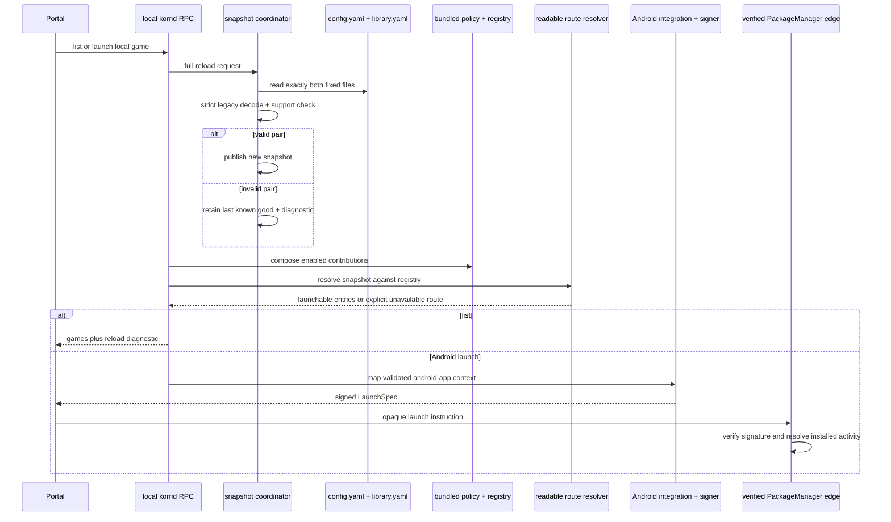
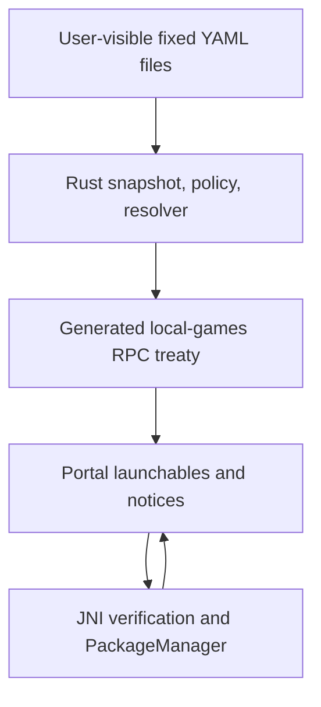

# Load legacy configuration and launch plugin-backed Android apps

## Summary

Deliver Slices 2–4 as three reviewable vertical slices: load the two fixed legacy-readable documents through pinned proseQL source, resolve the TMNT record through the bundled Android plugin and its default policy, then replace the hardcoded Android table with the existing signed Android launch path.

---

## Problem Frame

Slice 1 established strict runtime plugin evaluation and a local enabled-plugin registry, but production korrid still has no persisted readable snapshot, no plugin-backed route resolver, and a hardcoded TMNT record in `services/korrid/src/launcher/android_app.rs`. The Android shell can already verify and execute signed Android application instructions; the missing work is to connect the reviewed legacy documents and declaration-only plugin to that existing edge without inventing a new schema or capability model.

This is a self-contained plan rather than an implementation plan derived from a separate requirements artifact. Its premises are grounded in the landed Slice 1 behavior, the passed Android schema checkpoint, the proseQL research, and the explicit planning choices recorded below.

---

## Requirements

- **R1.** Consume proseQL as source pinned once by `flake.lock`; do not vendor proseQL or consume a Nix-built Rust artifact.
- **R2.** Own exactly `config.yaml` and `library.yaml` beneath the existing korrid local storage root. If either is absent, create it as an empty valid legacy-readable document without inserting device or game records.
- **R3.** Reimplement the unchanged legacy readable contract for all twelve persisted sections: `host`, `storage`, `providers`, `provider-links`, `systems`, `launchers`, `runtimes`, `profiles`, `hooks`, `collections`, `users`, and `library`. Preserve names, identity rules, nullability, nesting, and strict excess-field rejection from legacy revision `0e4cec9d`.
- **R4.** Keep execution narrower than the contract. Fields required by the reviewed Android route are executable; populated features not implemented by these slices must produce an explicit unsupported-configuration diagnostic rather than being ignored.
- **R5.** Treat both files as one logical snapshot. Serialize full-pair reloads before local-game list and launch operations; publish the snapshot and its diagnostic in one state transition only after complete parsing, strict decoding, and support checks. A malformed edit retains the last known good snapshot and is reported to the portal. Loss of storage authorization retains the snapshot internally but withholds all config-backed entries and launches until access and a valid reload return.
- **R6.** Include the repository-owned `@korri:android-app` plugin with the build. Resolve enablement through a generic semantic policy cascade whose internal default enables the plugin; prove a later override layer can disable it without adding a persisted override source in these slices.
- **R7.** Resolve `tmnt-shredders-revenge` from the exact checkpoint documents only through `@korri:android-app/android-app`. When the plugin is disabled, omit TMNT from local games and reject a direct launch request explicitly.
- **R8.** Treat `command: android-app` as an allowlisted integration token, never as a process command. Require the selected launcher kind and complete provider prefix before extracting `com.playdigious.tmnt`.
- **R9.** Map the resolved route to the existing unsigned Android `LaunchSpec`, preserve current HMAC signing and opaque portal transport, and leave installed-package/activity resolution in the JVM `PackageManager` edge.
- **R10.** Remove the hardcoded TMNT record and package table while preserving RetroArch/WL4 listing, provisioning, error mapping, signing, and Android deferred-provision behavior.
- **R11.** Verify the installed application surface on Android: the portal must list configured TMNT, launch the installed package, observe it as top resumed, and retain the existing return/resume task behavior. RPC-only evidence is insufficient.

---

## Scope Boundaries

- No federation publication, peer RPC, capability advertisement, or route-selection policy.
- No external plugin installation, plugin discovery, app-supplied plugin source, or plugin imports.
- No filesystem directory scan, arbitrary filename support, physical file cascade, persistent watcher, or incremental reload.
- No configuration authoring beyond creating the two missing empty documents.
- No user plugin-policy file or UI in these slices. The internal default and generic override semantics land now; a persisted user layer does not.
- No package enumeration or installed-package filtering in Rust. A valid library record remains listable even when the Android package is absent; launch returns the existing native `NotInstalled` failure.
- No redesign of the legacy schema, identity model, `LaunchSpec`, bridge treaty, portal launch state machine, or Android task policy.
- “Atomic snapshot” means all-or-error in-memory publication after reading and validating both files. It does not claim filesystem transaction isolation across independent external writes.

### Deferred to Follow-Up Work

- Load user plugin-policy overrides through the existing legacy `plugins.json` contract and place that layer after bundled defaults.
- Configuration editing, graph save targets, provenance-aware authoring, and import/materialization workflows.
- Persistent or foreground-scoped watching and removable-storage arrival handling.
- Library-scale storage/cache work identified in `docs/research/watching-config-vs-checking-it.md`.
- External plugin containment limits, federation publication, fulfillability policy, and general capability modeling.

---

## Context & Research

### Relevant Code and Patterns

- `services/korrid/src/plugin.rs` provides strict declaration decoding, provider normalization, deterministic enabled contributions, and disabled-plugin isolation from Slice 1.
- `services/korrid/tests/plugin_registry.rs` and `services/korrid/src/bin/plugin_registry_probe.rs` demonstrate production-path behavioral review rather than a diagnostics-only reimplementation.
- `docs/research/android-app-plugin-schema-checkpoint/` contains the exact reviewed plugin, `config.yaml`, `library.yaml`, and legacy validation harness.
- `services/korrid/src/lib.rs` owns `BrainRuntime`, local-games RPC dispatch, source error mapping, signing, and the direct/deferred provisioning split.
- `services/korrid/src/launcher/mod.rs`, `services/korrid/src/launcher/android_app.rs`, and `services/korrid/src/launcher/retroarch.rs` are the current local launcher aggregation seam.
- `services/korrid/src/launcher/types.rs` is the signed launch treaty; Android-app instructions intentionally contain an empty class, extras, directories, and files.
- `clients/android/app/src/main/java/com/limelight/KorriShellActivity.java` verifies package availability before effects and resolves Android launcher activities with `PackageManager`.
- `clients/android/app/src/main/java/com/limelight/KorriLocalLaunchSpec.java` already rejects malformed Android-app instructions and applies Android-app-only task flags.
- `clients/portal/src/launchables/state.ts` already keeps healthy entries while surfacing partial catalog failures; extend that presentation pattern for stale/failed local configuration.
- `services/korrid/android-smoke.sh` already installs the full APK, pushes explicit device inputs, verifies protected RPC, and checks embedded deferred launch instructions.

### Institutional Learnings

- `docs/research/proseql-as-korrid-config.md`: consume proseQL source, use caller-driven reload, and retain last-known-good state.
- `docs/research/proseql-on-android.md`: proseQL cross-compiles cleanly; polling works on shared storage but should not run continuously.
- `docs/research/watching-config-vs-checking-it.md`: full refresh on an operation is simpler and cheap for a two-file/config-scale tree.
- `docs/research/global-storage-on-android.md`: global storage access is revocable and must degrade through the existing visible storage-access state rather than killing korrid.
- `docs/research/returning-to-a-running-game.md`: PackageManager launch plus separate-task flags is the measured Android behavior; top-resumed activity matters in addition to process identity.
- Legacy plugin-policy precedent separates bundled/distribution defaults from user policy. Preserve that semantic layering instead of adding an Android-specific enable switch.

### External References

- proseQL source revision `7ba57cf17c01b15ccdb030237a96b6376a349253`, pinned by the new source-only flake input.
- proseQL APIs used by the plan: `proseql-formats::FormatRegistry`, `proseql-storage::document_graph`, and `proseql-storage::reload`.

---

## Key Technical Decisions

| Decision | Rationale |
|---|---|
| Hydrate proseQL into a gitignored Cargo path from one source-only flake input | Cargo cannot interpolate a Nix input path, and proseQL crates are unpublished workspace members. A Nix-created symlink gives devshell, crane, rust-analyzer, and Android builds one dependency contract without committing source or maintaining a second pin. |
| Use proseQL’s document-graph loader with one root and exact includes | It supplies the existing read-only merge/provenance/reload substrate while the include set remains exactly `config.yaml` and `library.yaml`; no directory discovery contract is introduced. |
| Strictly decode in Korri before accepting proseQL’s normalized values | proseQL’s document-graph transform receives the raw parsed document before final `decode_value`, whose generic struct decoding strips excess properties. Korri must enforce the legacy strict boundary in that transform so unknown or explicit-null fields cannot disappear before validation. |
| Preserve the twelve-section contract, then run a separate support check | Schema validity and executable support are different. This keeps declarations faithful while making populated unimplemented behavior fail explicitly. |
| Seed the in-memory last-known-good store with the approved empty snapshot | korrid can start and the portal can reach storage recovery even when global storage is denied or a pre-existing file is malformed. The canonical empty bytes are `{}` plus a newline; the production decoder must accept the exact bytes it writes. Missing writable files are created empty, while malformed existing files are never overwritten. |
| Serialize reload and publish snapshot plus diagnostic atomically | Concurrent list/launch calls must not let an older read overwrite a newer result or pair one generation’s data with another generation’s diagnostic. Each operation resolves against the immutable state returned by its own reload attempt. |
| Reload on both local list and local launch | Portal resume already lists again, while launch must also check current files. Two files make a full reload cheap; no watcher or generation-marker schema is needed. |
| Report a failed reload through optional local-game failures | This mirrors the existing partial catalog-failure pattern: `LocalGames` keeps healthy games and an optional list of existing `RpcFailure` values. Stable codes distinguish `LocalConfigReloadFailed`, `LocalConfigUnsupported`, `LocalConfigUnauthorized`, `LocalRouteUnavailable`, and `LocalRouteCollision`. Messages may name only the fixed filename and safe validation context—never absolute roots, full YAML contents, secrets, or raw plugin source. A launch from retained configuration does not clear the diagnostic; the portal reports it on the current or next list/resume without changing `LaunchSpec`. |
| Treat permission loss as authorization loss, not a malformed edit | A storage-access failure keeps the snapshot only for possible recovery bookkeeping. Config-backed entries and direct routes are withheld until a successful authorized reload, while the existing portal storage prompt remains reachable. |
| Model bundled enablement as the first generic plugin-policy layer | `@korri:android-app` is enabled by default because it ships with the build, but a later user layer can override the same key. Registration and enablement remain distinct without a persisted special case. |
| Make the production plugin source canonical under `services/korrid/plugins/` | Runtime evaluation still consumes source text, but production code no longer depends on a research-document path. The checkpoint copy remains historical evidence, and a parity gate prevents proof and production from drifting. |
| Port only the legacy readable route needed by the checkpoint | Selection of a launchable release, `launch.use`, provider-ref target resolution, and launcher lookup are required. Repositories, acquisition, watchers, sidecars, and generic effect machinery are not. |
| Keep `android-app` mapping at the launcher integration seam | The resolver remains platform-neutral and returns a domain route with parsed identities plus the legacy flattened target. The Android mapper alone validates the complete provider prefix and integration token before emitting an unsigned instruction; existing signing and JVM effects remain unchanged. |

### Boundary responsibilities

| Boundary | Owns | Must not own |
|---|---|---|
| proseQL adapter | Reading the exact files, YAML-to-value conversion, graph merge/provenance, and reload plumbing | Korri schema semantics, plugin policy, route selection, or execution |
| Korri strict schema | The unchanged twelve-section persisted contract and key-derived identities | Effect execution or installed-package truth |
| Support classifier | Whether populated schema-valid declarations are executable in these slices | Silently deleting unsupported values |
| Snapshot coordinator | Serialized candidate loads and atomic `{snapshot, generation, diagnostic, authorization}` publication | Filesystem watching or authoring existing files |
| Plugin policy/registry | Layered enablement and enabled contribution aggregation | Treating presence as enablement or package fulfillability |
| Route resolver | Release selection, `launch.use`, provider-ref resolution, and typed route availability | Constructing `LaunchSpec` or performing effects |
| Android launcher mapper | Exact plugin/provider/system/token checks and unsigned Android instruction construction | HMAC ownership, PackageManager queries, or generic process fallback |
| RPC signer/portal | Per-server signing and opaque transport | Mutating package, activity, extras, or paths |
| JVM edge | Signature verification, installed activity lookup, task policy, and `startActivity` | Config parsing, plugin enablement, or route authority |

### Fixed file ownership

| File | Allowed legacy sections |
|---|---|
| `config.yaml` | `host`, `storage`, `providers`, `provider-links`, `systems`, `launchers`, `runtimes`, `profiles`, `hooks` |
| `library.yaml` | `collections`, `users`, `library` |

A section in the wrong file, a duplicate record across the physical pair, or an attempted include/reference to another physical document rejects the candidate pair. Plugin-contributed providers, systems, and launchers are registry inputs and are not copied into `config.yaml` merely because that file is allowed to hold user-authored records of those section types. A later collision between a valid user-authored record and an enabled plugin contribution does not invalidate the snapshot and neither source wins: composition omits the affected routes and reports the collision.

### Failure taxonomy

| State | Snapshot | List behavior | Launch behavior |
|---|---|---|---|
| Syntax/schema error | Retain last known good | Keep retained and static entries; report reload failure | Resolve retained snapshot; preserve diagnostic until a later successful list/reload |
| Unsupported global/config behavior | Reject candidate; retain last known good | Keep retained and static entries; report unsupported configuration | Same retained-snapshot rule; never execute the unsupported field |
| Unsupported individual route or playable-ID collision | Snapshot remains valid | Omit the affected dynamic route, preserve static owner, report route diagnostic | Return route unavailable; do not fall through |
| User/plugin provider, system, or launcher collision | Snapshot remains valid; composition marks collision | Neither contribution shadows the other; omit affected routes and report collision | Return route unavailable |
| Disabled or missing plugin contribution | Snapshot remains valid | Omit affected routes without invalidating unrelated records | Return route unavailable |
| Storage authorization lost | Retain snapshot internally but mark unauthorized | Withhold config-backed entries; show recovery state | Refuse config-backed launch until authorized reload succeeds |
| Android package absent | Snapshot and route remain valid | Keep the configured entry | JVM returns existing `NotInstalled` failure |

### Slice 2–4 support classification

| Legacy section | Classification in these slices |
|---|---|
| `host` | `title` is retained declaration metadata; populated launch/moonlight/preferences/plugin/environment/path/hook behavior is snapshot-unsupported. |
| `storage` | Contract-decodable; any populated record is snapshot-unsupported. |
| `providers` | IDs and titles participate in route composition; cross-source collisions are composition diagnostics. |
| `provider-links` | Contract-decodable; any populated record is snapshot-unsupported. |
| `systems` | IDs and titles participate in route composition; cross-source collisions are composition diagnostics. |
| `launchers` | Android plugin/command/system selection participates in route composition; other valid launcher behavior is route-unsupported rather than executable. |
| `runtimes`, `profiles`, `hooks` | Contract-decodable; any populated record is snapshot-unsupported. |
| `collections`, `users` | Contract-decodable; any populated record is snapshot-unsupported. |
| `library` | Title plus the checkpoint release/system/provider-ref/`launch.use` path is executable. Other target/launcher variants are route-unsupported; unrelated populated execution features are snapshot-unsupported. |

`docs/research/legacy-readable-schema-port.md` must refine this into a field-level trace against `0e4cec9d` before U2 is complete. No field may land without one of these explicit classifications.

---

## Open Questions

### Resolved During Planning

- **Missing files:** Create both as empty valid legacy-readable documents; do not seed `host.title`, TMNT, or any device identity.
- **Bad edits:** Retain the last valid snapshot and report the reload failure.
- **Permission revocation:** Retain the snapshot only internally; withhold config-backed list and launch behavior until storage access and a valid reload return.
- **Reload trigger:** Attempt one serialized full two-file reload before local-game list and launch.
- **Disabled plugin:** Omit its TMNT route from local games; a direct request fails explicitly.
- **Default enablement:** Use bundled internal policy with `@korri:android-app` enabled by default and a generic later-override seam.
- **User override timing:** Defer loading legacy `plugins.json`; do not invent a plugin field in `config.yaml`.
- **Cross-source collisions:** Neither user-authored nor plugin-contributed provider/system/launcher records win; omit affected routes and report the composition collision.
- **Package absence:** Preserve current behavior—list from the library, then return `NotInstalled` at the JVM edge.
- **Plan origin:** Keep the plan self-contained with research/checkpoint references; do not mislabel a research note as an `origin:` requirements document.

### Deferred to Implementation

- Exact Rust module subdivision inside `services/korrid/src/config/schema/` may follow dependency pressure while retaining one module per coherent legacy record family.
- If proseQL’s reviewed revision exposes an API mismatch not visible through source inspection, adapt only the Korri adapter first; upstream proseQL changes require a separately reviewed pin bump.
- Exact human wording for portal diagnostics remains presentation-level, but stable failure codes and stale-snapshot behavior are part of this plan’s contract.

---

## Output Structure

```text
services/korrid/
├── proseql-source.nix
├── plugins/
│   └── android-app.plugin.ts
├── src/
│   ├── config/
│   │   ├── mod.rs
│   │   ├── schema/
│   │   │   └── ... legacy-readable record families
│   │   ├── snapshot.rs
│   │   └── resolver.rs
│   ├── plugin_policy.rs
│   └── bin/
│       ├── config_snapshot_probe.rs
│       └── plugin_route_probe.rs
├── tests/
│   ├── fixtures/
│   │   └── legacy-readable/
│   ├── config_schema.rs
│   ├── config_snapshot.rs
│   ├── plugin_policy.rs
│   ├── plugin_route.rs
│   └── android_app_route.rs
├── config-snapshot-review.sh
├── plugin-route-review.sh
└── android-app-route-check.sh

docs/research/
└── legacy-readable-schema-port.md
```

The tree is directional. Existing modules may absorb a small helper when that produces a clearer boundary; the per-unit file lists define the intended ownership.

---

## High-Level Technical Design

> *This illustrates the intended approach and is directional guidance for review, not implementation specification. The implementing agent should treat it as context, not code to reproduce.*



---

## Implementation Units

### U1. Pin and hydrate proseQL source

**Goal:** Make the three proseQL Rust crates available to host, package, and Android builds from one locked source input without vendoring.

**Requirements:** R1

**Dependencies:** Slice 1 commit `9f2f7957`

**Files:**
- Modify: `flake.nix`
- Modify: `flake.lock`
- Modify: `services/korrid/Cargo.toml`
- Modify: `services/korrid/Cargo.lock`
- Modify: `services/korrid/devshell.nix`
- Create: `services/korrid/proseql-source.nix`
- Modify: `services/korrid/package.nix`
- Modify if needed after task audit: `nix/tasks.nix`
- Verify through: `services/korrid/check-in-shell.sh`

**Approach:**
- Add proseQL as a source-only flake input pinned to the reviewed revision.
- Pass the input from the thin root flake into korrid’s devshell and package expressions.
- Put hydration/composed-source logic in `services/korrid/proseql-source.nix` and reuse it from devshell and package setup so there is one path contract rather than duplicated shell snippets.
- Hydrate the full proseQL repository at a stable gitignored path beneath `services/korrid/.cache/`; point Cargo path dependencies at its engine, formats, and storage crates.
- Build a composed crane source containing clean korrid source plus the same symlink. Do not rewrite manifests only for Nix, add Cargo git dependencies, or commit proseQL source.
- Preserve `--override-input proseql path:...` as the local co-development mechanism.

**Patterns to follow:**
- Root input delegation in `flake.nix`.
- Toolchain ownership in `services/korrid/devshell.nix`.
- Crane source construction in `services/korrid/package.nix`.
- Existing source-consumption decision in `docs/research/proseql-as-korrid-config.md`.

**Test scenarios:**
- **Integration:** A clean korrid devshell resolves all three path dependencies from the locked source without network access during Cargo execution.
- **Integration:** The crane package builds from its sandbox-composed source and does not require Cargo git output hashes.
- **Integration:** The arm64 Android cdylib build resolves and compiles the same proseQL revision.
- **Edge case:** Overriding the single flake input with a local proseQL checkout changes the hydrated path without changing `Cargo.toml`.

**Verification:**
- Host tests, the Nix package, and Android cross-compilation all consume the revision recorded in `flake.lock`.
- No proseQL source is added to the Git tree.

---

### U2. Port the strict legacy-readable contract

**Goal:** Establish a faithful Rust declaration contract for all twelve legacy persisted sections before implementing route behavior.

**Requirements:** R3, R4

**Dependencies:** U1

**Files:**
- Create: `services/korrid/src/config/mod.rs`
- Create: `services/korrid/src/config/schema/`
- Create: `services/korrid/tests/config_schema.rs`
- Create: `services/korrid/tests/fixtures/legacy-readable/`
- Create: `docs/research/legacy-readable-schema-port.md`
- Modify: `services/korrid/src/lib.rs`

**Approach:**
- Port the payload shapes and key-derived identities from legacy revision `0e4cec9d`; retain exact persisted names and the plain singleton `host` boundary.
- Use strict deserialization at every record boundary: unknown fields, explicit null where legacy means absent, malformed discriminants, empty required values, and record/key identity disagreement fail.
- Preserve map ordering where it affects readable records and deterministic review output.
- Separate strict schema decoding from a support classifier. The schema recognizes the broad legacy contract; the classifier explicitly identifies populated declarations that Slices 2–4 cannot execute. Unsupported route variants remain route-level diagnostics rather than invalidating otherwise readable records.
- Check in a section-by-section trace from each Rust record family and conformance case to the exact legacy decoder/test/fixture at `0e4cec9d`; copy only existing fixture values needed to prove all twelve sections.
- Enforce the fixed file-ownership matrix independently of the logical schema so trusted execution sections cannot migrate into `library.yaml` and library/user sections cannot migrate into `config.yaml`.
- Do not import legacy repository services, authoring behavior, watchers, migrations, sidecars, acquisition, or effect runtime machinery.

**Execution note:** Add characterization/conformance coverage from the legacy schemas and fixtures before implementing the Rust decoders.

**Patterns to follow:**
- `serde(deny_unknown_fields)` and non-null optional handling in `services/korrid/src/plugin.rs`.
- Legacy `product/platform/library/proseql/library-db-core.ts` at `0e4cec9d` for the twelve section names, strict boundary, host wrapping, and key-derived IDs.
- Legacy `product/platform/library/config/records/` at `0e4cec9d` for payload contracts.
- Existing checkpoint documents for the minimum executable record.

**Test scenarios:**
- **Happy path:** The exact checkpoint `config.yaml` and `library.yaml` strictly decode without schema alteration.
- **Happy path:** Representative records copied from existing legacy fixtures decode for every one of the twelve sections, including plain `host` and map-key-derived IDs.
- **Edge case:** An entirely empty readable document decodes as the approved initial state.
- **Error path:** Unknown top-level sections and unknown nested fields fail rather than being stripped by proseQL.
- **Error path:** Explicit null in legacy-optional fields, malformed provider IDs, malformed playable IDs, and key/record ID mismatches fail.
- **Error path:** A schema-valid record using a populated but unimplemented global/configuration feature returns an explicit unsupported classification rather than silently entering the executable snapshot.
- **Error path:** A valid section placed in the wrong fixed file, or a duplicate record contribution across the pair, rejects the candidate before merge order can decide the result.
- **Compatibility:** No persisted key is renamed to match current Rust terminology, and the checked-in trace accounts for every section and fixture source.

**Verification:**
- The Rust contract has a traceable counterpart for each legacy persisted section.
- Checkpoint and harvested legacy conformance cases pass through the same production decoder used by later units.

---

### U3. Load and review the fixed atomic snapshot

**Goal:** Create missing empty documents, load exactly the two fixed files through proseQL, and retain/report a last-known-good snapshot.

**Requirements:** R2, R4, R5

**Dependencies:** U2

**Files:**
- Create: `services/korrid/src/config/snapshot.rs`
- Create: `services/korrid/tests/config_snapshot.rs`
- Create: `services/korrid/src/bin/config_snapshot_probe.rs`
- Create: `services/korrid/config-snapshot-review.sh`
- Modify: `services/korrid/src/config/mod.rs`
- Modify: `services/korrid/src/lib.rs`
- Modify: `nix/tasks.nix`
- Modify: `services/korrid/check-in-shell.sh`

**Approach:**
- Initialize the coordinator with the approved empty snapshot so the service can start before shared storage becomes readable.
- Create only missing `config.yaml` and `library.yaml`, writing the canonical bytes `{}` plus newline. Never overwrite, truncate, normalize, or repair an existing malformed or unreadable file; partial initialization is idempotent and cannot publish a candidate.
- Configure one proseQL document-graph root with an exact include set for those two filenames and strict fragment-error behavior. Strict Korri validation must run on raw parsed document values before any proseQL normalization that can drop excess fields; if the graph API cannot expose that seam, the adapter parses/validates first and supplies only validated values onward.
- Convert the loaded graph into a Korri-owned immutable snapshot only after both files pass file-ownership, schema, and support checks.
- Give each brain runtime one shareable coordinator instance; cloned Axum/app state must reference that same instance rather than cloning the current snapshot by value.
- Serialize reloads through that coordinator. Publish snapshot generation, diagnostic, and storage-authorization state atomically, and return that same immutable state to the requesting list/launch operation.
- A content failure retains the active authorized snapshot and updates the diagnostic. A storage-access failure retains data internally but marks it unauthorized so callers withhold config-backed behavior. Only a fully successful pair reload replaces data, advances generation, marks it authorized, and clears the diagnostic.
- Add a deterministic review task using the production loader to show empty initialization, the exact checkpoint snapshot, and last-known-good retention after a rejected edit.

**Patterns to follow:**
- Production-path review tools in `services/korrid/plugin-registry-review.sh` and `services/korrid/src/bin/plugin_registry_probe.rs`.
- `proseql-storage::document_graph` for fixed read-only graph loading.
- `proseql-storage::reload` for swap-after-success semantics.
- Existing storage root ownership passed into `BrainRuntime` by `services/korrid/src/lib.rs`.

**Test scenarios:**
- **Happy path:** An empty storage root gains exactly `config.yaml` and `library.yaml`, each containing the canonical empty bytes; those same bytes reload through the production decoder without invented records.
- **Happy path:** The exact checkpoint pair loads as one authorized snapshot with host and TMNT records.
- **Edge case:** One existing file plus one missing file creates only the missing file and preserves the existing bytes.
- **Error path:** If creating the first missing file succeeds and the second fails, no candidate publishes; retry creates only the remaining file and converges without overwriting.
- **Error path:** An unreadable root or denied write leaves the in-memory empty snapshot available, marks it unauthorized, and records a storage diagnostic without crashing korrid.
- **Error path:** Malformed YAML, strict schema failure, or unsupported populated behavior in either file rejects the whole candidate snapshot without changing file bytes.
- **State transition:** After a valid load, a bad edit retains the previous authorized snapshot and records the new error; a later valid edit replaces the snapshot and clears the error atomically.
- **State transition:** Permission revocation withholds the retained snapshot from callers; restoring access and completing a valid reload reauthorizes it and clears the storage diagnostic.
- **Concurrency:** Overlapping list/launch reloads cannot publish out of request order or resolve/sign from different generations; each caller observes one matched snapshot/diagnostic state.
- **Shared ownership:** Two cloned router/app-state handles observe the same generation advance and last-known-good diagnostic, proving the coordinator was not copied by value.
- **Boundary:** Sequential external writes may cause a rejected intermediate pair but never a partial publication; additional files never contribute and no watcher is created.
- **Review surface:** The Nix review task exercises the same loader/coordinator used by production.

**Verification:**
- Callers can obtain the current immutable snapshot and current reload diagnostic independently.
- Review output proves logical all-or-error publication and last-known-good behavior without reading Rust.

---

### U4. Bundle Android plugin policy without a platform exception

**Goal:** Include the first-party Android plugin in the build and enable it by default through a reusable layered policy.

**Requirements:** R6

**Dependencies:** U3

**Files:**
- Create: `services/korrid/plugins/android-app.plugin.ts`
- Preserve: `docs/research/android-app-plugin-schema-checkpoint/android-app.plugin.ts` as the historical reviewed input
- Create: `services/korrid/src/plugin_policy.rs`
- Create: `services/korrid/tests/plugin_policy.rs`
- Modify: `services/korrid/src/plugin.rs`
- Modify: `services/korrid/tests/plugin_registry.rs`
- Modify: `services/korrid/src/bin/plugin_registry_probe.rs`
- Modify: `docs/research/android-app-plugin-schema-checkpoint/README.md`
- Modify: `docs/research/android-app-plugin-schema-checkpoint/validate.sh`
- Modify if required by source lookup: `docs/research/android-app-plugin-schema-checkpoint/validate-legacy.ts`
- Modify: `services/korrid/SCRIPTING.md`

**Approach:**
- Copy the exact reviewed TypeScript declaration into a production-owned source file embedded with the build and still evaluated at runtime by the existing evaluator. Preserve the checkpoint copy as immutable historical evidence and require a byte-for-byte parity test so it cannot drift from production.
- Introduce generic policy layers keyed by plugin ID. The bundled layer sets `@korri:android-app` enabled; later layers override earlier values.
- Keep the user layer empty in these slices, but test an explicit later `false` override so “enabled by default” does not collapse into “cannot be disabled.”
- Feed resolved enabled IDs into the existing `PluginRegistry`; do not add a special Android branch inside registry aggregation.
- Keep the checkpoint harness auditable against its colocated historical input, and add an explicit comparison/use of the production source so either copy changing alone fails.

**Patterns to follow:**
- Slice 1’s distinction between registered and enabled plugins in `services/korrid/src/plugin.rs`.
- Legacy `product/platform/plugin/policy.ts` and plugin-host state at `0e4cec9d` for layered policy semantics.
- Existing repository-owned runtime source under `services/korrid/plugins/`.

**Test scenarios:**
- **Happy path:** Bundled policy registers and enables the Android plugin by default, exposing its provider, system, and launcher contributions.
- **State transition:** A later policy layer with `enabled: false` disables the plugin and removes every announcement.
- **Edge case:** An override for an unregistered plugin reports the existing unknown-enabled/policy diagnostic rather than creating a phantom plugin.
- **Compatibility:** The historical checkpoint source and production source are byte-identical; the checkpoint and `korrid-plugin-review` still produce their exact enabled/disabled behavioral proof.
- **Error path:** Changing either plugin copy without the other fails the parity gate rather than silently invalidating the historical proof.
- **Boundary:** No user policy file, plugin discovery, or app-supplied source is read.

**Verification:**
- Default enablement is data in the common policy cascade, not an Android-specific conditional.
- The production build and checkpoint harness evaluate the same source bytes.

---

### U5. Resolve the checkpoint route through the enabled registry

**Goal:** Reproduce the narrow legacy readable launch-context selection for TMNT and prove the disabled-plugin negative path before changing production launch behavior.

**Requirements:** R7, R8

**Dependencies:** U2, U3, U4

**Files:**
- Create: `services/korrid/src/config/resolver.rs`
- Create: `services/korrid/tests/plugin_route.rs`
- Create: `services/korrid/src/bin/plugin_route_probe.rs`
- Create: `services/korrid/plugin-route-review.sh`
- Modify: `services/korrid/src/config/mod.rs`
- Modify: `nix/tasks.nix`
- Modify: `services/korrid/check-in-shell.sh`
- Modify: `services/korrid/SCRIPTING.md`

**Approach:**
- Port only the legacy operations needed by the checkpoint: select a launchable release, follow `launch.use`, resolve `provider-ref`, and join the library record with the enabled launcher/system/provider announcements.
- Preserve the checkpoint’s resolved identities in a domain route result, including parsed plugin/provider/launcher/system identities and the provider-qualified flattened target expected by the later Android integration. Keep string parsing localized to this boundary and the Android mapper.
- Return a structured unavailable-route result for missing/disabled launchers, unsupported target variants, launcher-system mismatch, and unsupported integration commands. Never fall through to process execution.
- Detect playable-ID collisions with static launchers during aggregation; preserve the existing static owner, omit the conflicting dynamic route, and report a diagnostic instead of shadowing by order.
- Detect provider/system/launcher ID collisions between user-authored snapshot records and enabled plugin contributions. Neither source wins; omit affected routes and report the composition collision without invalidating unrelated snapshot data.
- Keep route resolution separate from package fulfillability and from `LaunchSpec` production.
- Add an enabled/disabled route report that uses the production snapshot, policy, registry, and resolver.

**Execution note:** Start with the exact checkpoint enabled and disabled cases as integration tests, then add fail-closed variants.

**Patterns to follow:**
- `docs/research/android-app-plugin-schema-checkpoint/validate-legacy.ts` for the already-proven resolver behavior.
- Legacy `product/platform/library/config/playable-id.ts`, `source-target-resolution.ts`, and `cascade-resolver.ts` at `0e4cec9d` for the narrow selection semantics.
- Slice 1 review report structure and deterministic ordering.

**Test scenarios:**
- **Happy path:** The exact checkpoint pair plus default-enabled bundled plugin resolves TMNT to launcher `@korri:android-app/android-app`, token `android-app`, system `android`, and target `@korri:android-app:com.playdigious.tmnt`.
- **Negative path:** A later policy layer disables the plugin; TMNT is absent from launchable local entries and a direct resolve returns route unavailable.
- **Error path:** Unknown `launch.use`, missing provider, mismatched system, unsupported target kind, and a launcher command other than the registered integration fail explicitly.
- **Security boundary:** A provider ID containing `:` remains intact; no resolver or diagnostic parser splits the target on the first colon.
- **Compatibility:** Library entries unrelated to the Android plugin remain independently resolvable or ignorable; disabled Android policy does not invalidate the entire snapshot.
- **Collision:** A dynamic library entry reusing `wl4` cannot shadow RetroArch; the static entry remains and the conflict is diagnosed.
- **Cross-source collision:** A user-authored Android provider/system/launcher record matching the enabled bundled plugin lets neither source shadow the other; affected TMNT routes are omitted with a composition diagnostic while unrelated routes remain.
- **Review surface:** The route report proves enabled resolution and disabled isolation through production components.

**Verification:**
- Slice 3 can be reviewed without invoking Android effects.
- The only successful checkpoint route is owned by the enabled plugin and carries the exact legacy-shaped identities.

---

### U6. Replace hardcoded TMNT with the signed plugin route

**Goal:** Make local list and launch use the snapshot/registry/resolver path, map the Android route to the existing signed instruction, and preserve RetroArch behavior.

**Requirements:** R5, R7, R8, R9, R10

**Dependencies:** U5

**Files:**
- Modify: `services/korrid/src/lib.rs`
- Modify: `services/korrid/src/launcher/mod.rs`
- Modify: `services/korrid/src/launcher/android_app.rs`
- Modify: `services/korrid/src/launcher/retroarch.rs`
- Modify: `services/korrid/src/launcher/types.rs`
- Create: `services/korrid/tests/android_app_route.rs`
- Modify: `contracts/generated/korrid.ts` through Typeshare generation only
- Modify: `clients/portal/src/korrid/client.ts`
- Modify: `clients/portal/src/korrid/client.test.ts`
- Modify: `clients/portal/src/launchables/state.ts`
- Modify: `clients/portal/src/launchables/state.test.ts`
- Modify: `clients/portal/src/launchables/LaunchablesRoot.test.tsx`
- Verify unchanged JVM treaty in: `clients/android/app/src/test/java/com/limelight/KorriLocalLaunchSpecTest.java`

**Approach:**
- Add the snapshot coordinator and bundled plugin composition to `BrainRuntime`; preserve direct provisioning for host tests/Linux and deferred provisioning for embedded Android.
- Reload before both local list and launch and resolve from the immutable coordinator state returned by that attempt. Content errors use the retained authorized snapshot; storage-access errors withhold dynamic entries and reject dynamic launch until a successful authorized reload.
- Add optional `failures: Vec<RpcFailure>` to `LocalGames`, generated through Typeshare, so a successful list can retain healthy games while the portal renders the current reload/route diagnostic. Use the stable local config/route codes defined above and sanitize messages to fixed filenames plus safe context. Launching retained content does not clear the diagnostic; a failure discovered only by launch is visible on the next list/resume without changing the bridge `LaunchSpec` treaty.
- Build non-conflicting plugin-backed local entries first, then append existing RetroArch entries so the checkpoint journey retains TMNT-before-WL4 ordering. A collision preserves the static launcher entry and produces a diagnostic.
- Replace `android_app.rs`’s `GAMES` ownership with a narrow mapper from a validated domain route. Require the selected plugin kind, launcher ID/token, system, and full `@korri:android-app:` prefix before extracting the package name.
- Emit the existing unsigned Android-app shape: launcher `android-app`, package name, empty class, no extras/directories/files, and empty integrity. Continue signing only in `services/korrid/src/lib.rs`.
- Keep portal transport opaque and reuse the JVM parser, HMAC verification, PackageManager lookup, `NotInstalled` failure, and separate-task policy unchanged.
- Move shared local launch failures out of RetroArch-only ownership so route-unavailable/config-authorization errors and existing RetroArch errors map deliberately at the RPC seam.
- Direct launch of a library ID whose route is disabled/unavailable returns a stable route-unavailable failure rather than falling through to RetroArch or generic command execution.

**Patterns to follow:**
- Existing local RPC dispatch and signing in `services/korrid/src/lib.rs`.
- Existing `CatalogSnapshot.failures` contract and portal notice handling.
- Existing RetroArch decline/error ownership in `services/korrid/src/launcher/`.
- Android-app validation in `KorriLocalLaunchSpec.java` and effects in `KorriShellActivity.java`.

**Test scenarios:**
- **Happy path:** Valid checkpoint files list TMNT from the resolver and WL4 from RetroArch, with TMNT first and no duplicate hardcoded entry.
- **Happy path:** Launching TMNT reloads configuration, resolves the route, emits the exact unsigned Android-app fields, signs them, and verifies with the current server key.
- **State transition:** After a successful load, malformed current YAML keeps TMNT from the previous snapshot, includes a `RpcFailure` in the successful list response, and still permits a launch from that retained snapshot without clearing the diagnostic.
- **Authorization:** Storage access loss withholds TMNT and rejects its direct launch while leaving the brain and recovery UI available; a valid reload after re-grant restores it.
- **Recovery:** Correcting the files causes the next list/launch reload to replace the snapshot and clear the diagnostic atomically.
- **Negative path:** Disabled plugin omits TMNT; direct TMNT launch returns route unavailable and never reaches RetroArch.
- **Error mapping:** Route unavailable, storage unauthorized, unknown game, and WL4 missing-ROM remain distinguishable at the RPC seam after shared error ownership moves out of `retroarch.rs`.
- **Error path:** Wrong provider prefix, launcher kind, system, or command produces no `LaunchSpec`; `android-app` is never executed as a process.
- **Native contract:** A valid package route remains listable without Rust package probing; existing JVM tests preserve `NotInstalled` as the device-edge outcome, with installed/absent proof completed in U7.
- **Regression:** WL4 list, missing-ROM error, deferred Android provisioning, RetroArch control token, and signed file/config fields remain unchanged.
- **Contract:** Generated TypeScript exposes optional local `RpcFailure` values, and the in-memory client/state tests keep healthy entries while presenting each stable config/route code.
- **Redaction:** Reload and route failures may identify `config.yaml` or `library.yaml` and a safe field path, but never expose the absolute storage root, file contents, capability/signing material, or plugin source.
- **Portal integration:** `LaunchablesRoot` renders TMNT/WL4 entries and the local configuration notice together from one successful local-games outcome; the notice does not replace or disable healthy entries.
- **Integrity:** Tampering with the plugin-derived package or launcher ID after signing fails JNI verification as before.

**Verification:**
- `services/korrid/src/launcher/android_app.rs` contains no TMNT identity/title/package table.
- Production list and launch can reach TMNT only through the current snapshot and enabled plugin registry.
- Existing Java and bridge treaty shapes require no version change.

---

### U7. Prove the installed Android journey and document the new source of truth

**Goal:** Validate the complete installed app surface and make the three slice boundaries reviewable through canonical tasks and documentation.

**Requirements:** R11

**Dependencies:** U6

**Files:**
- Modify: `services/korrid/android-smoke.sh`
- Create: `services/korrid/android-app-route-check.sh`
- Modify: `nix/tasks.nix`
- Modify: `services/korrid/check-in-shell.sh`
- Modify: `services/korrid/SCRIPTING.md`
- Modify: `docs/research/android-app-plugin-schema-checkpoint/README.md`
- Modify: `services/korrid/journey-resume.sh`

**Approach:**
- Extend device setup to copy the exact checkpoint `config.yaml` and `library.yaml` into the existing Android local storage root before starting the brain; do not bake those records into fresh-install defaults.
- Keep RPC assertions for strict snapshot load and signed route shape, then drive the portal’s real local-game selection and native bridge.
- Require the configured TMNT package to be installed for the journey gate. Verify `topResumedActivity`, launch result, process identity where relevant, return to Korri, and relaunch/resume behavior; process existence alone is not proof.
- Correct `journey-resume.sh` to use the measured Home/task-switch path. Back finishes the game and cannot serve as resume evidence.
- Assert WL4 remains present through the local list and existing RetroArch smoke path.
- Make the dedicated review tasks explain: fixed snapshot behavior (Slice 2), enabled/disabled route selection (Slice 3), and installed application launch (Slice 4).
- Update scripting documentation to remove the “not wired into the app yet” status and state the remaining deferrals precisely.

**Patterns to follow:**
- Full-app installation and protected RPC setup in `services/korrid/android-smoke.sh`.
- Top-resumed plus PID evidence in `services/korrid/journey-resume.sh` and `docs/research/returning-to-a-running-game.md`.
- Nix app task composition in `nix/tasks.nix`.

**Test scenarios:**
- **Fresh install:** With an empty writable storage root, startup creates both empty files and the portal remains usable without a false TMNT entry.
- **Configured device:** After installing the exact checkpoint files, portal resume reloads and shows TMNT before WL4.
- **Installed surface:** Confirming TMNT through the portal places `com.playdigious.tmnt` in `topResumedActivity`, not merely in a successful RPC response.
- **Return/resume:** Leaving with the supported Home/task-switch journey and reopening through Korri reaches the game under the existing separate-task policy; assertions include both top activity and process evidence.
- **Not installed contract:** Preserve existing JVM/unit coverage for `NotInstalled`; the canonical device gate does not uninstall or alter the user’s TMNT installation merely to reprobe this unchanged edge.
- **Regression:** Embedded korrid remains alive during the game, the capability-protected RPC still answers, and WL4’s signed deferred instruction still passes the existing smoke assertions.
- **Failure evidence:** Missing storage permission produces the existing reachable storage prompt while korrid remains alive with its empty last-known-good snapshot.

**Verification:**
- The canonical full check passes on host and Android build surfaces.
- The dedicated device task fails unless the installed portal-to-PackageManager journey is observed.
- Review docs and tasks describe production behavior rather than the old hardcoded table.

---

## System-Wide Impact



- **Interaction graph:** Local list and launch now trigger a synchronous full snapshot reload, then policy composition and route resolution. Launch continues through existing signing, portal transport, JNI verification, and JVM activity start.
- **Error propagation:** Parse/schema/support failures are retained as reload diagnostics while the last valid snapshot remains active. Disabled routes fail before launcher mapping. Installed-package failure stays native and returns `NotInstalled`.
- **State lifecycle risks:** One serialized coordinator owns `{snapshot, generation, diagnostic, authorization}`. Only a fully validated pair can advance generation; a failed reload cannot pair old data with a new state accidentally. Missing-file creation is idempotent and never overwrites existing bytes. Signing keys remain per server lifetime.
- **API surface parity:** `LocalGames` gains optional existing `RpcFailure` values through Rust/Typeshare/portal. `LaunchSpec` and the hand-written bridge treaty remain unchanged.
- **Integration coverage:** Unit tests cannot prove Nix source hydration, Android cross-compilation, shared-storage permissions, JNI verification, PackageManager activity resolution, or top-resumed behavior; canonical build and device tasks cover those seams.
- **Unchanged invariants:** Portal speaks only to local korrid and never constructs or mutates Android instructions; config contains no signing keys, capabilities, activity names, launch extras, or installed-package truth; plugins perform no effects; Rust never probes packages; the JVM verifies integrity before PackageManager effects; RetroArch provisioning remains deferred on Android; secrets remain outside user-visible files.

---

## Risks & Dependencies

| Risk | Mitigation |
|---|---|
| The Rust schema accidentally narrows or renames legacy declarations | Trace all twelve sections to `0e4cec9d`, harvest existing fixtures/tests, and keep schema conformance separate from execution support. |
| proseQL strips unknown fields before Korri can reject them | Run Korri’s strict decoder in the document transform before proseQL normalization and test unknown nested properties explicitly. |
| Cargo and Nix pin different proseQL revisions | Use only the source-only flake input and Nix-hydrated path dependencies; no Cargo git revision. |
| Shared-storage permission is absent or revoked | Start from the approved empty in-memory snapshot, report creation/read failures, preserve the existing portal recovery flow, and withhold retained config-backed routes until an authorized reload succeeds. |
| A bad user edit silently leaves stale behavior | Retain last-known-good deliberately, attach the current reload diagnostic to local list results, preserve it across retained-snapshot launches, and clear it only with a fully valid pair reload. |
| Concurrent reloads publish out of order | Serialize reload and return one immutable snapshot/generation/diagnostic state to each list or launch operation. |
| External writes produce a mixed two-file generation | Publish only after both files validate and satisfy ownership together; document that filesystem-level transactions are not provided. Device setup writes both before brain start. A future authoring protocol owns stronger generations if needed. |
| Default enablement becomes an Android-only exception | Represent bundled defaults as the first generic policy layer and test a later disabling override through the same resolver. |
| User-authored and plugin records silently shadow one another | Detect cross-source provider/system/launcher collisions during composition; let neither win, omit affected routes, and report the collision while preserving unrelated data. |
| `android-app` reaches generic process execution | Allowlist the plugin kind, launcher identity, command token, system, and full provider prefix before constructing any instruction; no process fallback exists. |
| Removing the table regresses WL4 or list ordering | Aggregate resolved Android entries before unchanged RetroArch entries and retain dedicated regression tests/device assertions. |
| Device proof passes without launching the app | Gate on `topResumedActivity` and package/process evidence after portal interaction, not RPC success alone. |

---

## Documentation / Operational Notes

- `nix run .#korrid-config-review` should explain empty creation, valid checkpoint load, rejected reload, and retained snapshot.
- `nix run .#korrid-plugin-route-review` should explain enabled resolution and disabled omission without Android effects.
- The canonical Android route task should require an explicit adb target and the installed TMNT package; it must not introduce LAN-IP assumptions.
- Configuration remains user-visible under the existing local storage root. Secrets, capability tokens, and signing keys remain process-private.
- A proseQL bump is a reviewed `flake.lock` change and must re-run host, package, and Android cross-compilation gates.
- Cargo metadata, rust-analyzer, and direct Cargo commands must enter the korrid Nix devshell (or hydrate the same input path); outside-devshell failure is expected rather than a second dependency mode.
- The canonical device gate must not uninstall or mutate a personal game installation to test `NotInstalled`; that unchanged edge remains covered at the JVM contract boundary.

---

## Sources & References

- Slice 1 implementation: `services/korrid/src/plugin.rs`
- Slice 1 behavior: `services/korrid/SCRIPTING.md`
- Schema checkpoint: `docs/research/android-app-plugin-schema-checkpoint/README.md`
- proseQL consumption research: `docs/research/proseql-as-korrid-config.md`
- Android proseQL research: `docs/research/proseql-on-android.md`
- Reload/watcher research: `docs/research/watching-config-vs-checking-it.md`
- Global storage research: `docs/research/global-storage-on-android.md`
- Android return behavior: `docs/research/returning-to-a-running-game.md`
- Current launch aggregation: `services/korrid/src/launcher/mod.rs`
- Current Android table: `services/korrid/src/launcher/android_app.rs`
- Signed launch treaty: `services/korrid/src/launcher/types.rs`
- Android launch edge: `clients/android/app/src/main/java/com/limelight/KorriShellActivity.java`
- Legacy schema/resolver source: `legacy` revision `0e4cec9da3d77e6578b8a01a5d83420ba0d98e62`
- proseQL source pin: `https://github.com/simonwjackson/proseql/commit/7ba57cf17c01b15ccdb030237a96b6376a349253`
