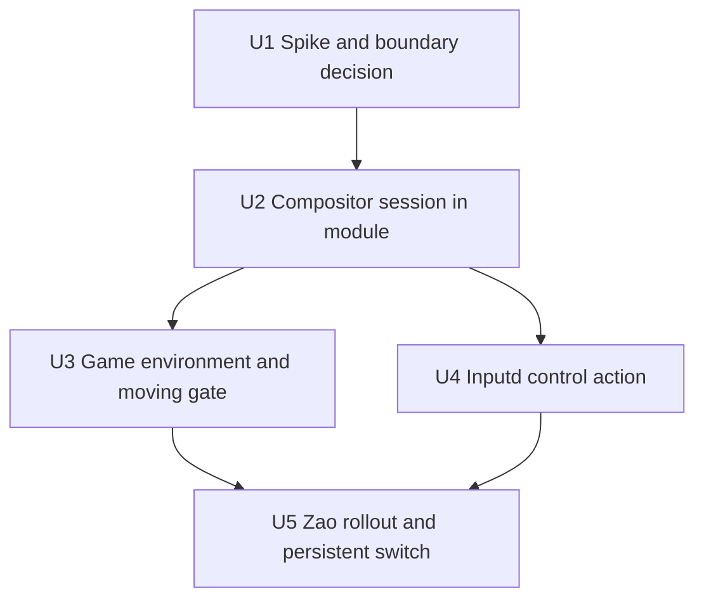

# feat: Restore Korri-owned headless Sway compositor on Zao

This plan uses ASD-STE100 Simplified Technical English. It stays high level. Implementation units select exact mechanisms later.

## Summary

Zao replaces its software Xvfb display with one Korri-owned headless Sway session. Sunshine captures the compositor output through its Wayland path. Inputd sends bounded focus and fullscreen commands for one active game. The client portal remains the only hub. The slice ends with candidate gates and one persistent switch on Zao.

## Problem Frame

Zao streams from `x11-headless.service`, a software Xvfb display. This display has no workspace, focus, or window semantics. The inputd `workspace-next` action runs only a validation fixture. The CPU capture path supplied frames too slowly for 1080p120. Real window control needs a compositor, so Sway is a project requirement.

Legacy Korri ran Sway for the same reason. The legacy branch is read-only reference material. This plan harvests single legacy patterns and does not merge the legacy architecture.

## Requirements

- R1. The Linux host module must start one headless Sway session as the only game display owner.
- R2. The compositor session replaces `x11-headless.service`. The module must not keep both display owners.
- R3. The client portal remains the only hub. An idle Zao output shows no host hub.
- R4. One active game must show fullscreen on the compositor output.
- R5. Sunshine must capture the compositor output through its Wayland capture path.
- R6. A blank or empty capture must fail acceptance.
- R7. Game units must receive only the display environment that a game needs.
- R8. Game units must not have usable compositor control. U1 selects the exact boundary.
- R9. Inputd must own the compositor control action. The action uses immutable absolute argv without a shell.
- R10. The moving 1080p60 gate must stay green on the new path.
- R11. Explicit NVENC keeps the fail-closed posture. The host must not fall back to a different encoder.
- R12. Zao consumes the module through `nixosModules.korri-linux-host` only.
- R13. The rollout uses candidate gates and then one persistent switch. No reboot occurs in this slice.

## Security Invariants

- Launched games stay untrusted. The compositor control path is trusted.
- Possession of the control socket equals compositor authority. The plan treats socket access as the boundary.
- Root-owned Nix configuration defines each control action. Games cannot change an action.
- The device gate keeps its read-only default and its rollback discipline.

## Scope Boundaries

- No host hub and no idle content on Zao.
- No workspace cycling between concurrent apps. Korrid keeps one active launch.
- No 1080p120 acceptance. That decision stays in parked item `01M1F9ADZFCSJA7G1Z7FDV6JN1`.
- No audio work, no pointer repair, and no Sunshine input seats.
- No reboot and no physical-controller HITL. Those stay with the deferred U7 stages.
- No push and no pull request without explicit approval.
- No Android behavior changes.
- No generic capability model.

## Context and Research

### Current code

- `services/inputd/nix/korri-linux-host.nix` owns `x11-headless.service`, the Sunshine unit, the moving gate, and the validation action.
- `services/inputd/nix/korri-linux-host-module-check.nix` evaluates the module and runs the display integration check.
- `services/inputd/nix/korri-input.nix` owns the inputd action allowlist and action environment names.
- `services/inputd/deploy/device-check.sh` owns the Zao candidate, rollback, and persistence gates.
- The pinned Sunshine source contains the Wayland capture path in `wlgrab.cpp` and `wayland.cpp`. It needs `WAYLAND_DISPLAY`, the `xdg_output` wire, and the screencopy wire.

### Legacy patterns to harvest

- `legacy:product/systems/nixos/modules/korri-compositor.nix` publishes a stable compositor control symlink. It starts Xwayland eagerly. It does not set `WAYLAND_DISPLAY` on the compositor unit.
- `legacy:product/systems/nixos/images/source-machine.nix` shows peer service environment for a stream host without a local hub.
- `legacy:work/items/.archive` records one hard failure. Sunshine once captured a blank Xwayland root instead of compositor output. Acceptance must reject that state.

### Institutional learnings

- Do not set `WAYLAND_DISPLAY` on the compositor unit. Wayland tooling then treats the compositor as a nested client.
- Discover the compositor socket at spawn time. Do not hard-code one socket name.
- Nix evaluation checks must inspect generated units, ordering, environment, and assertions.
- A physical rollout needs the exact prior generation available for restore.

## Key Technical Decisions

| Decision | Choice | Reason |
|---|---|---|
| Hub owner | The client portal only | The portal already selects content. A host hub adds a second navigation owner. |
| First control scope | One game with focus and fullscreen actions | Korrid exposes one active launch. Real switching waits for a later slice. |
| Frame-rate scope | Prove 1080p60 only | The 120 decision stays in parked item `01M1F9ADZFCSJA7G1Z7FDV6JN1`. |
| Rollout depth | Candidate gates, then one persistent switch | This matches the accepted v34 discipline and the no-reboot constraint. |
| Control boundary | U1 selects the mechanism | Two candidate shapes exist. Evidence, not preference, picks one. |
| Display stack | Headless wlroots session with GPU rendering and Xwayland | Sunshine capture and the encoder need GPU-backed frames. |
| Capture path | Sunshine Wayland capture only | X11 capture of a Wayland session repeats the blank-root failure. |
| Branch shape | Stack on `feat/restore-linux-inputplumber` | The module under change exists only on that branch. |
| Legacy use | Harvest single patterns deliberately | `AGENTS.md` forbids a wholesale legacy merge. |

### Control boundary candidates for U1

| Shape | Strength | Cost |
|---|---|---|
| One session identity with sandboxed game units | Moderate. Game units cannot see the control path. | Low integration risk. The boundary depends on unit sandboxing. |
| Separate compositor-control identity | Strong process boundary. | High integration cost for sockets, GPU access, and Xwayland. |

## Open Questions

### Resolved during planning

- Does Zao show a hub? No. The client portal owns the hub.
- What does the first control action cover? One game with focus and fullscreen control.
- Does this slice decide 1080p120? No. It proves 1080p60 only.
- How deep is the rollout? Candidate gates and one persistent switch, without a reboot.

### Deferred to implementation

- U1 selects the control boundary mechanism and records the evidence.
- U1 selects the wlroots backend and renderer values for the NVIDIA driver.
- U2 selects the socket discovery mechanism from the legacy stable-symlink pattern.
- U3 confirms whether the moving gate plays as a Wayland client or through Xwayland.
- U4 confirms whether the existing action allowlist can name the control action.

## Implementation Units

### U1. Headless capture and boundary spike

**Goal:** Prove GPU-backed headless Sway capture with NVENC on Zao. Select the control boundary.

**Requirements:** R1, R5, R6, R8

**Dependencies:** None

**Approach:**

- Run one bounded compositor session as an unprivileged user. Do not change host configuration.
- Show one test client on the headless output.
- Capture real frames through the Sunshine Wayland path or an equivalent probe.
- Encode one captured sample with NVENC.
- Probe both boundary shapes. Record which shape denies game processes compositor control.
- Record the decision and the evidence in `work.md`. If the pipeline fails, stop the slice and record why.

**Test scenarios:**

- The headless session starts without a monitor.
- The captured frames are not blank.
- NVENC accepts the captured output.
- A game-like process cannot send a compositor command under the chosen boundary.

**Verification:** The work ledger contains the boundary decision, the backend values, and the capture evidence.

### U2. Compositor session in the Linux host module

**Goal:** The module starts the compositor session as the display owner and orders Sunshine after it.

**Requirements:** R1, R2, R5, R11, R12

**Dependencies:** U1

**Files:**

- `services/inputd/nix/korri-linux-host.nix`
- `services/inputd/nix/korri-linux-host-module-check.nix`

**Approach:**

- Replace `x11-headless.service` with the compositor unit. Keep the service isolation posture.
- Publish one stable control socket path for inputd, per the U1 decision.
- Set the Sunshine unit environment for Wayland capture. Keep the strict NVENC condition.
- Extend the module check for the new unit, ordering, environment, and assertions.
- Run the compositor inside the check sandbox with a software renderer.

**Test scenarios:**

- The valid configuration contains the compositor unit and orders Sunshine after it.
- The configuration does not contain `x11-headless.service`.
- The NVENC variant keeps the driver condition and the strict encoder environment.
- The check shows one real client window on the sandboxed compositor output.

**Verification:** `nix build --no-link .#checks.x86_64-linux.korri-linux-host-module` passes.

### U3. Game environment and moving gate on Wayland

**Goal:** Game units receive the Wayland environment. The moving gate plays on the compositor output.

**Requirements:** R3, R4, R7, R8, R10

**Dependencies:** U2

**Files:**

- `services/inputd/nix/korri-linux-host.nix`
- `services/inputd/nix/korri-linux-host-module-check.nix`

**Approach:**

- Put the Wayland display values in the generated device configuration environment.
- Keep the display values a game needs. Do not pass compositor control values to game units.
- Apply the U1 boundary to every game unit.
- Move the moving gate player to the compositor output. Keep hardware decode and the frame cadence.

**Test scenarios:**

- The generated device configuration contains the Wayland display values.
- The gate window shows fullscreen on the compositor output.
- A probe inside a game unit cannot reach the control path.
- An idle compositor output shows no hub content.

**Verification:** The module check passes and shows the gate window on the compositor output.

### U4. Inputd compositor control action

**Goal:** Replace the validation fixture with one real bounded compositor command.

**Requirements:** R9

**Dependencies:** U2

**Files:**

- `services/inputd/nix/korri-linux-host.nix`
- `services/inputd/nix/korri-input.nix`
- `services/inputd/nix/korri-linux-host-module-check.nix`

**Approach:**

- Build one immutable command that repairs focus and fullscreen for the active game.
- Wire the command as a root-configured inputd action with fixed argv and no shell.
- Extend the action allowlist only when the existing names cannot express this action.
- Give the action process control socket access, per the U1 decision.

**Test scenarios:**

- The configured action starts the command with the expected immutable argv.
- The action obeys the existing runtime, output, and concurrency bounds.
- Repeated actions do not accumulate processes.
- The command changes real compositor state in an integration check.

**Verification:** The module check asserts the action shape. The integration check shows the state change.

### U5. Zao candidate rollout and persistent switch

**Goal:** Prove the complete path on Zao, then switch persistently. Follow the v34 discipline.

**Requirements:** R4, R5, R6, R10, R11, R12, R13

**Dependencies:** U3, U4

**Files:**

- `services/inputd/deploy/device-check.sh`
- `docs/acceptance/` (one new record)
- `work/items/active/01M1FAJABCE7XNZM79PAB4KKNX-restore-korri-owned-headless-sway-compositor-on-zao/work.md`

**Approach:**

- Verify the Zao baseline first: generation, services, game count, marker, lease, and GC root.
- Build the candidate through the Mountainous worktree pin. Keep the pin local.
- Run the ledger, preflight, and automated gates. Extend the gates for compositor capture.
- Stream the moving gate to Bandai at 1080p60. Observe one inputd control action in the stream.
- Exercise one guarded restore before the persistent switch.
- Switch persistently, rerun the gates, and record the acceptance evidence.
- Restore every Bandai setting to its captured baseline.

**Test scenarios:**

- Automated gates pass on the candidate generation.
- Sunshine logs Wayland capture and no X11 capture for the stream.
- The Bandai stream shows the moving video near 60 incoming FPS with zero loss.
- The inputd action changes the streamed output.
- The guarded restore returns the exact prior generation.
- After the persistent switch, the current and default generations equal the candidate.
- The Sunshine private-state digest and the pairing state stay unchanged.

**Verification:** The acceptance record and the work ledger contain the evidence. No reboot occurred.

## Sequencing

## Risks

| Risk | Treatment |
|---|---|
| Headless wlroots rendering fails on the NVIDIA driver. | U1 proves the pipeline first. On failure, stop the slice and record the evidence. |
| The pinned Sway and Sunshine wire versions do not match. | U1 verifies the capture wires against the pinned Sunshine source. |
| The new path regresses 1080p60. | U5 gates the stream result before the persistent switch. |
| A shared identity makes the boundary too weak. | U1 probes both boundary shapes with a real denial test. |
| Socket discovery races on session restart. | U2 uses the legacy stable-symlink pattern with spawn-time discovery. |
| The check sandbox cannot run the compositor. | U2 uses the software renderer inside the sandbox, as Xvfb did. |
| The gate player behaves differently on Wayland. | U3 verifies the fullscreen window and the cadence in the check. |

## Success Criteria

- Zao runs the compositor session persistently through `nixosModules.korri-linux-host` only.
- The portal launches the game, and Bandai shows it at moving 1080p60 with zero loss.
- Sunshine captures compositor output. No blank capture appears.
- One inputd action changes the streamed output.
- Game units fail a compositor-control probe.
- The work ledger and one acceptance record contain the evidence.

## References

- Work item: `work/items/active/01M1FAJABCE7XNZM79PAB4KKNX-restore-korri-owned-headless-sway-compositor-on-zao/work.md`
- Parked frame-rate item: `work/items/parking-lot/01M1F9ADZFCSJA7G1Z7FDV6JN1-make-headless-zao-1080p120-honest-and-sustainable.md`
- Xvfb acceptance baseline: `docs/acceptance/sunshine-korri-headless-real-consumer-2026-09-01.md`
- InputPlumber work item: `work/items/active/019fde6b-8c02-7b01-8dfb-ffe97bcb5ef1-restore-linux-inputplumber/work.md`
- Legacy compositor module: `legacy:product/systems/nixos/modules/korri-compositor.nix`
