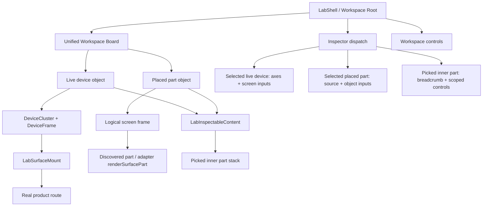

# refactor: Unify lab Device and Compose into one workspace

## Summary

Refactor the dev-lab from an either/or Device-vs-Compose canvas into one workspace where live devices and placed design parts are both selectable canvas objects. The implementation keeps the two object types honest internally, but makes selection, picking, Inspector routing, camera movement, and canvas tools feel like one continuous workspace.

---

## Problem Frame

The lab now has large overlap between Device and Compose: both can render real product content, both support nested part picking, and both route selected content through the Inspector. The remaining user-facing split is the top-level mode switch, which forces the user to decide which world they are in even when the work is really “select an object on the canvas and inspect or edit it.” The next refactor should reduce that mental load without hiding the real difference between live mounted app surfaces and isolated design-part renders.

---

## Requirements

- R1. Replace the user-facing Device/Compose mode switch with a single workspace canvas that can show live device objects and placed part objects together.
- R2. Preserve the real-app-unwrapped principle: live device objects mount the real product surface, and placed part objects render through existing discovered part/story seams and real product inputs.
- R3. Preserve existing nested part picking behavior in both object types: Pick mode, Alt/Option-click, long-press, Escape clearing, breadcrumb selection, and non-product overlay rings.
- R4. Route Inspector content from the selected canvas object type rather than from a global canvas mode.
- R5. Keep live Device state dials, screen inputs, route, and seed/source state shared across live device objects for this iteration, matching today’s preview singleton and live surface behavior.
- R6. Keep placed part object controls object-local: changing a picked inner part inside a placed object updates that placed object’s input values, not the live device surface.
- R7. Preserve current physical device semantics: live device objects still use device frames, millimetre calibration, multi-screen tiling, dual-screen channels, and live router mounting.
- R8. Preserve current Compose semantics: placed part objects remain movable, source-bound, screen-aspect-framed, fixture-backed, and compatible with existing Parts panel placement.
- R9. Keep `product/` independent from lab runtime code; any product-owned metadata remains simple product-side labels or existing part/story conventions.
- R10. Maintain current test coverage for lab, Shift, nested selection, canvas placement, and boundary enforcement.
- R11. Define object bounds for both placed parts and live devices so placement, tidy, camera framing, and selection rings work predictably on a mixed workspace.

---

## Scope Boundaries

- This plan does not implement AI chat, AI proposals, or source-editing agents.
- This plan does not make live Device state dials independent per device object; state axes remain shared for the current surface adapter.
- This plan does not add new Shift product dials or restructure product state machines.
- This plan does not support multiple product surface adapters on the same canvas; the workspace still operates within the currently selected surface adapter.
- This plan does not redesign panel docking, floating layout persistence, or app/panel chrome beyond removing/reframing the Device/Compose view switch. Object-level selection chrome for live device cards is in scope.
- This plan does not create shareable saved workspace scenes.

### Deferred to Follow-Up Work

- Per-device independent live state dials: requires redesigning the preview singleton / axis registry scoping model so each live device object can pin different state.
- Multi-surface workspace objects: requires scoping part discovery, product labels, and Inspector matching by surface adapter.
- Shareable workspace scenes: persist canvas objects, positions, camera, selected object, and panel layout as a durable scene.
- AI proposal layer remains out of scope; do not add AI-specific hooks in this plan.

---

## Context & Research

### Relevant Code and Patterns

- `tools/theme-workshop/lab/LabShell.tsx` owns the current top-level state, `LabCanvasView`, selected IDs, selected placed object, Preview selection, Inspector dispatch, and top-level controls.
- `tools/theme-workshop/lab/model/lab-canvas-state.ts` currently defines `LabCanvasView = "device" | "compose"`, camera helpers, and placed object instance helpers.
- `tools/theme-workshop/lab/canvas/LabCanvasContent.tsx` is the current mode router: Device renders `LabSurfaceView`, Compose renders `LabComposeView`.
- `tools/theme-workshop/lab/canvas/LabSurfaceView.tsx` mounts selected physical devices with `LabDeviceCluster` and `LabInspectableSurfaceMount`.
- `tools/theme-workshop/lab/canvas/LabComposeView.tsx` is a thin wrapper around `LabWorkshopBoard`.
- `tools/theme-workshop/lab/canvas/LabWorkshopBoard.tsx` owns camera, placement, panning, tidy, zoom, and rendering placed objects.
- `tools/theme-workshop/lab/canvas/LabDraggablePart.tsx` is the placed-part card pattern to mirror for live device cards: selectable object chrome, movable position, body renderer, and nested picking.
- `tools/theme-workshop/lab/canvas/LabInspectableContent.tsx` is the shared nested-picking primitive that already works for both live mounts and placed objects.
- `tools/theme-workshop/lab/panels/LabDeviceInspector.tsx`, `tools/theme-workshop/lab/panels/LabObjectInspector.tsx`, and `tools/theme-workshop/lab/panels/LabPreviewInspector.tsx` are the existing selection-specific Inspector surfaces to preserve and dispatch between.
- `tools/theme-workshop/lab/useLabAxisController.ts` owns live axis pinning and remains shared for this plan.
- `tools/theme-workshop/lab/model/lab-surface-registries.ts` registers live mounted product atom registries; current axis changes broadcast to all mounted registries.
- `tools/theme-workshop/lab/lab-boundary.test.ts` enforces the product-to-tool import boundary.
- `tools/theme-workshop/AGENTS.md` and `tools/theme-workshop/lab/AGENTS.md` document the “app unwrapped” rule, screen vs device vocabulary, real-edge controls, and lab/product boundary.
- Prior completed plans to preserve as context: `work/items/active/01KXMBE000TG2AFAW4XFQ0FH6W-lab-screen-device-frames/plan.md` and `work/items/active/20260630154404-lab-state-groups/plan.md`.

### Institutional Learnings

- `docs/solutions/best-practices/mode-as-composition-for-layout-primitives-2026-05-01.md`: avoid burying mode-specific rendering behind boolean or enum prop switches; model meaningful layout strategies as composition over shared context.
- `docs/solutions/best-practices/evolving-shared-context-layout-primitives-2026-05-01.md`: extend shared context additively when converging related roots; do not force unrelated consumers to learn fields they do not need.
- `docs/solutions/best-practices/react-state-components-over-result-render-props-for-effect-atoms-2026-05-03.md`: selection and Inspector state should be modeled as domain variants, not boolean forests.
- `docs/solutions/best-practices/product-owned-composition-keeps-shared-layers-reusable-2026-05-03.md`: lab/tooling must not become product runtime dependency; product-owned capabilities should be exposed through product/platform or adapter seams.
- `docs/solutions/best-practices/derive-component-states-from-state-machines-2026-06-25.md`: state lists and dials should derive from machine tags or declared state families, not hand-maintained duplicate lists.

### External References

- External research skipped. The work is a repo-internal interaction/model refactor with strong local patterns and no new third-party API or framework surface.

---

## Key Technical Decisions

- **One workspace, two object types:** unify the user-facing canvas around selectable objects while keeping live devices and placed parts as different typed object kinds internally.
- **Selection dispatch replaces mode dispatch:** Inspector routing should answer “what is selected?” rather than “which canvas mode are we in?”
- **Live device dials stay shared for now:** current live axes, screen inputs, route, and seed/source state are shared for the current surface adapter; per-device isolation is intentionally deferred.
- **Nested picking remains object-scoped:** a picked inner part carries a scope id that identifies its owning canvas object, so the same `LabPreviewInspector` can edit live screen inputs for device objects or object-local inputs for placed part objects.
- **Device objects reuse real mount infrastructure:** `LabSurfaceMount`, `LabDeviceCluster`, dual-screen channel setup, registry registration, and calibration remain the live-device rendering path.
- **Workspace objects expose measurable bounds:** placement, tidy, and camera framing need object bounds that work for fixed placed-part frames and dynamic live device clusters. The plan should add a shared bounds helper rather than leaving live devices to fake the placed-part cell size.
- **Part objects reuse existing Compose infrastructure:** placed part objects continue to use discovered stories, adapter `renderSurfacePart`, source binding, input values, and screen-aspect framing.
- **Canvas tools act on the unified board:** camera zoom/reset/tidy apply to the workspace board; destructive commands need clear scope labels so users know whether they affect placed parts, device objects, or both.

---

## Open Questions

### Resolved During Planning

- Should live Device state dials be shared or independent per live device object? Resolved: shared for now, matching today’s behavior; per-device independent dials are deferred.
- Should live Device route/source/seed state also be shared? Resolved: yes for this iteration, matching today’s `LabSurfaceView` behavior. Live device objects show the same current surface route and seed/source state.
- Should Device and Compose become one generic implementation type? Resolved: no. They become two typed canvas object kinds under one workspace.
- Should nested picking remain available in both live devices and placed parts? Resolved: yes; this is now part of the shared workspace interaction model.

### Deferred to Implementation

- Exact naming for the new canvas-object model and selected-object state can follow local style during implementation.
- Exact default placement of live device objects relative to newly added parts can be tuned after seeing the current board geometry.
- Exact final copy for toolbar labels can be polished during implementation, but command scope must follow the plan’s toolbar contract.

---

## High-Level Technical Design

> *This illustrates the intended approach and is directional guidance for review, not implementation specification. The implementing agent should treat it as context, not code to reproduce.*

The new workspace should make `LabWorkshopBoard` the always-rendered canvas. Each workspace object renders through an object-specific card component, while nested part picking remains delegated to the shared `LabInspectableContent` wrapper. `LabShell` becomes responsible for maintaining one workspace object list, one selected workspace object, one optional inner part selection, and dispatching the Inspector accordingly.

### Interaction Contracts

| User action | Normal select tool | Hand/space pan | Pick mode | Alt/Option-click | Long-press |
|---|---|---|---|---|---|
| Empty board | Clear workspace-object selection and pan | Pan board | Clear picked part only if any | Clear picked part only if any | No inner pick |
| Live device object chrome / frame | Select live device object | Pan board, no long-press pick | Select live device object | Select live device object | Select live device object |
| Live product viewport | Product interaction passes through | Pan board, long-press pick disabled | Pick inner product part and suppress product click | Pick inner product part and suppress product click | Pick inner product part and suppress following click |
| Placed part object chrome | Select placed part object / drag from header | Pan board outside object drag handles | Select placed part object | Select placed part object | Select placed part object |
| Placed part viewport | Product/part interaction passes through where available | Pan board, long-press pick disabled | Pick inner part and suppress inner click | Pick inner part and suppress inner click | Pick inner part and suppress following click |
| Breadcrumb target | Switch picked target level | N/A | Switch picked target level | Switch picked target level | N/A |

### Inspector States

| State | Inspector surface | Input writes go to | Fallback after Escape / Back to live clicks |
|---|---|---|---|
| No selection | Empty workspace hint + always-present Design panel | N/A | N/A |
| Selected live device object | Live axes + shared screen inputs | Shared live surface axes/inputs | Remains selected live device object |
| Selected placed part object | Source + object-local inputs | The selected placed part object | Remains selected placed part object |
| Picked inner part in live device | Breadcrumb + matching part controls | Shared live screen inputs | Owning live device object |
| Picked inner part in placed part | Breadcrumb + matching part controls | Owning placed part object input values | Owning placed part object |
| Picked part with no matching controls | Breadcrumb + no-controls message | N/A | Owning workspace object |

### Toolbar Command Contract

| Command | Scope | Selection result | Notes |
|---|---|---|---|
| Pick | Whole workspace interaction mode | Preserves current selection | Works inside live devices and placed parts. |
| Hand / pan | Whole board camera | Preserves current selection | Disables long-press part picking while active. |
| Zoom in/out/reset | Whole board camera | Preserves current selection | Affects all visible workspace objects. |
| Tidy | Workspace object layout | Preserves selection when the object remains | Applies to live device and placed part object bounds. |
| Clear placed parts | Placed part objects only | Clears placed part selection and any picked part inside removed objects | Must leave live device objects intact; do not add a clear-all workspace command in this plan. |
| Screen aspect selector | Placed part objects only | Preserves selection | Live device objects render their physical screens independently. |

### Visible Mental Model

- User-facing copy should say **workspace object** for the selectable thing on the board. Code/model naming may use **canvas object** when helpful.
- Use **live device object** for mounted physical device cards and **placed part object** for design parts from the Parts panel.
- A selected workspace object gets the existing quiet object-selection ring/chrome. A picked inner part gets the thin nested selection ring and breadcrumb.
- The live device Inspector should make shared state explicit with wording such as “Live surface — shared across live devices” so users do not infer per-device dials.

---

## Implementation Units

### U1. Introduce a typed workspace object model

**Goal:** Replace the mode-specific Compose object list with a canvas object model that can represent both live devices and placed design parts.

**Requirements:** R1, R2, R4, R7, R8, R11

**Dependencies:** None

**Files:**
- Create: `tools/theme-workshop/lab/model/lab-canvas-object.ts`
- Create: `tools/theme-workshop/lab/model/lab-canvas-object.test.ts`
- Modify: `tools/theme-workshop/lab/model/lab-canvas-state.ts`
- Modify: `tools/theme-workshop/lab/canvas/LabWorkshopBoard.test.tsx`

**Approach:**
- Add a discriminated canvas object model with one kind for live devices and one kind for placed parts.
- Move placed-part-specific helpers out of the generic canvas-state file or clearly narrow them to the placed-part object kind.
- Add helpers for creating, moving, removing, and identifying each object kind.
- Add a shared bounds contract for workspace objects so placement, tidy, and camera framing can treat fixed part frames and dynamic live device clusters consistently.
- Keep camera helpers and placement math independent from object type.
- Preserve stable object ids and avoid sharing id space implicitly between device ids, screen ids, and part object ids.

**Execution note:** Implement the pure model test-first so later React refactors have a stable object contract.

**Patterns to follow:**
- `tools/theme-workshop/lab/model/lab-canvas-state.ts`
- `tools/theme-workshop/lab/model/lab-canvas-placement.ts`
- `tools/theme-workshop/lab/model/lab-object-inputs.ts`

**Test scenarios:**
- Happy path: creating a placed part object preserves story id, source id, input values, and optional position.
- Happy path: creating a live device object records a canvas object id and product device id without story/source fields.
- Happy path: moving either object kind updates only its position.
- Edge case: removing an object leaves unrelated objects unchanged.
- Edge case: helper predicates distinguish device objects from part objects without relying on id prefixes.
- Edge case: converting the existing placed-object fixtures into the new part-object shape preserves current placement tests.
- Edge case: bounds helper returns predictable rectangles for placed parts, single-screen live devices, and multi-screen live device clusters.

**Verification:**
- Pure model tests cover creation, movement, removal, and discrimination of both object kinds.
- Existing placement tests still pass after they use the new object model.

---

### U2. Render live devices as canvas objects on the unified board

**Goal:** Make live device frames render as positioned, selectable board objects beside placed parts, instead of as the separate Device canvas mode.

**Requirements:** R1, R2, R3, R5, R7, R10, R11

**Dependencies:** U1

**Files:**
- Create: `tools/theme-workshop/lab/canvas/LabCanvasDevice.tsx`
- Create: `tools/theme-workshop/lab/canvas/LabCanvasDevice.test.tsx`
- Modify: `tools/theme-workshop/lab/canvas/LabWorkshopBoard.tsx`
- Modify: `tools/theme-workshop/lab/canvas/LabSurfaceView.tsx`
- Modify: `tools/theme-workshop/lab/canvas/LabSurfaceView.test.tsx`
- Modify: `tools/theme-workshop/lab/canvas/LabDraggablePart.tsx`
- Modify: `tools/theme-workshop/lab/lab.css`

**Approach:**
- Extract the reusable “live device card” behavior from the current `LabSurfaceView` path into a board object component.
- Reuse `LabDeviceCluster`, `LabInspectableSurfaceMount`, `LabSurfaceMount`, and dual-screen channel creation so live device behavior remains the same.
- Give the live device object selectable chrome outside the product viewport, mirroring placed part object selection behavior.
- Preserve nested picking inside the live product viewport through `LabInspectableContent`.
- Preserve shared live route/source/seed behavior across live device objects for this iteration.
- Publish measured or derived device object bounds back to the board so mixed layout, tidy, and camera framing do not rely on a placed-part cell size.
- Keep mount/unmount behavior isolated per device object and keep disposal/registry cleanup behavior unchanged.

**Patterns to follow:**
- `tools/theme-workshop/lab/canvas/LabSurfaceView.tsx`
- `tools/theme-workshop/lab/canvas/LabDraggablePart.tsx`
- `tools/theme-workshop/lab/components/LabDeviceCluster.tsx`
- `tools/theme-workshop/lab/LabSurfaceMount.tsx`

**Test scenarios:**
- Happy path: a live device object mounts the product surface inside the physical device frame.
- Happy path: a multi-screen device object mounts primary and companion screens with one shared dual-screen channel.
- Happy path: selecting the live device object via its chrome updates the selected canvas object.
- Happy path: Pick mode inside the live device viewport selects a named product part and suppresses the product click.
- Edge case: removing or unmounting a live device object disposes the mounted surface and unregisters its registry.
- Edge case: two live device objects receive distinct dual-screen channel names.
- Edge case: live device object bounds reflect single-screen and multi-screen clusters closely enough for tidy and camera framing.
- Integration: changing the current surface route/source/seed affects all live device objects, matching today’s shared behavior.
- Integration: existing `LabSurfaceView` tests are migrated or preserved so real mount, route-sync, and companion-follow behavior remain covered.

**Verification:**
- Live device objects behave like the old Device view inside the unified board.
- Existing product route and companion tests remain green.

---

### U3. Collapse the Device/Compose mode router into one workspace board

**Goal:** Remove the top-level `LabCanvasView` branch so the lab always renders one workspace board containing typed canvas objects.

**Requirements:** R1, R4, R7, R8, R10, R11

**Dependencies:** U1, U2

**Files:**
- Modify: `tools/theme-workshop/lab/LabShell.tsx`
- Modify: `tools/theme-workshop/lab/LabRoot.tsx`
- Modify: `tools/theme-workshop/lab/Lab.context.tsx`
- Modify: `tools/theme-workshop/lab/canvas/LabCanvasContent.tsx`
- Modify: `tools/theme-workshop/lab/canvas/LabComposeView.tsx`
- Modify: `tools/theme-workshop/lab/canvas/LabWorkshopBoard.tsx`
- Modify: `tools/theme-workshop/lab/LabRoot.test.tsx`
- Modify: `tools/theme-workshop/lab/model/lab-canvas-state.test.ts`

**Approach:**
- Replace `view: "device" | "compose"` with a single workspace board state.
- Seed the workspace with live device objects that correspond to the selected device configuration, preserving the current Device panel’s meaning.
- Keep placed parts in the same object list rather than in a separate Compose-only list.
- Make selecting a part from the Parts panel add or toggle a placed part object on the same workspace board without switching modes.
- Keep existing camera behavior that frames newly placed objects, so selecting a part remains visible feedback.
- Use object bounds rather than a single fixed cell assumption for mixed live-device and placed-part layout operations.
- Remove or reduce `LabCanvasContent` / `LabComposeView` once they no longer provide meaningful composition boundaries.

**Patterns to follow:**
- `tools/theme-workshop/lab/LabShell.tsx`
- `tools/theme-workshop/lab/canvas/LabWorkshopBoard.tsx`
- `tools/theme-workshop/lab/model/lab-canvas-placement.ts`
- Completed plan: `work/items/active/01KXMBE000TG2AFAW4XFQ0FH6W-lab-screen-device-frames/plan.md`

**Test scenarios:**
- Happy path: the lab root renders a unified board with at least one live device object by default.
- Happy path: selecting a part from the Parts panel adds a placed part object without changing canvas mode.
- Happy path: live device objects and placed part objects can coexist on the board.
- Happy path: selecting empty board space clears the selected canvas object.
- Edge case: switching the surface adapter clears stale objects and inner part selections.
- Edge case: device selection changes add/remove live device objects without deleting placed part objects unless the adapter changes.
- Edge case: camera framing still focuses newly added placed parts even when live device objects are present.
- Edge case: tidy/repack accounts for mixed live-device and placed-part bounds without overlap.

**Verification:**
- There is no user-facing Device/Compose canvas branch after this unit.
- The lab still starts with visible live device content and can still add placed parts.

---

### U4. Route Inspector state from selected workspace object and picked inner part

**Goal:** Replace mode-based Inspector branching with selection-based dispatch for no selection, live device selected, placed part selected, and inner part picked.

**Requirements:** R3, R4, R5, R6, R7, R8

**Dependencies:** U1, U2, U3

**Files:**
- Modify: `tools/theme-workshop/lab/LabShell.tsx`
- Modify: `tools/theme-workshop/lab/panels/LabDeviceInspector.tsx`
- Modify: `tools/theme-workshop/lab/panels/LabObjectInspector.tsx`
- Modify: `tools/theme-workshop/lab/panels/LabPreviewInspector.tsx`
- Modify: `tools/theme-workshop/lab/canvas/LabDraggablePart.test.tsx`
- Modify: `tools/theme-workshop/lab/canvas/LabSurfaceView.test.tsx`
- Create or modify: `tools/theme-workshop/lab/panels/LabWorkspaceInspector.test.tsx`

**Approach:**
- Introduce a small selection read model for Inspector routing, preferably as a pure helper in model code or a focused testable function near the shell boundary.
- Make picked inner part selection take precedence over canvas object selection.
- When a picked inner part belongs to a placed part object, route input changes to that object’s input values.
- When a picked inner part belongs to a live device object, route input changes to shared live screen inputs.
- When inner part selection is cleared, fall back to the owning workspace object’s Inspector state.
- Make picking inside a live device object also select that live device object, mirroring the existing placed-object behavior.
- Keep live axes, screen inputs, route, and seed/source state shared and label the live device Inspector accordingly so users understand dials affect the current surface’s live device objects.

**Execution note:** Add the routing tests before rewriting the `LabShell` conditionals; this is the highest-risk behavior seam.

**Patterns to follow:**
- `tools/theme-workshop/lab/panels/LabDeviceInspector.tsx`
- `tools/theme-workshop/lab/panels/LabObjectInspector.tsx`
- `tools/theme-workshop/lab/panels/LabPreviewInspector.tsx`
- `tools/theme-workshop/lab/model/lab-preview-selection.ts`

**Test scenarios:**
- Happy path: selected live device object shows live axes and screen inputs.
- Happy path: selected placed part object shows source binding and object-local inputs.
- Happy path: picked Battery inside a live device shows Battery controls and writes to live screen inputs.
- Happy path: picked Battery inside a placed Home object shows Battery controls and writes to that object’s input values.
- Happy path: selecting a breadcrumb parent changes the active picked target without changing the owning canvas object.
- Edge case: Escape clears the picked inner part but preserves the owning workspace object selection.
- Edge case: clicking a different canvas object clears stale picked inner selection from the previous object.
- Edge case: a product-labeled part with no matching catalog controls shows a clear “no controls yet” state.
- Integration: live Device axes still pin/release the real mounted product state across live device objects.

**Verification:**
- Inspector behavior is explainable as “selected object, or picked part inside selected object,” with no dependency on a global Device/Compose mode.

---

### U5. Reframe controls and panels around workspace object operations

**Goal:** Remove the Device/Compose view toggle from the controls and clarify which workspace tools affect placed parts, live devices, or the whole board.

**Requirements:** R1, R3, R7, R8, R10

**Dependencies:** U3, U4

**Files:**
- Modify: `tools/theme-workshop/lab/chrome/LabControls.tsx`
- Modify: `tools/theme-workshop/lab/chrome/LabViewToggle.tsx`
- Modify: `tools/theme-workshop/lab/chrome/LabComposeToolStrip.tsx`
- Modify: `tools/theme-workshop/lab/components/LabScreenSelect.tsx`
- Modify: `tools/theme-workshop/lab/panels/LabDevicePanel.tsx`
- Modify: `tools/theme-workshop/lab/panels/LabPartsPanel.tsx`
- Create or modify: `tools/theme-workshop/lab/chrome/LabControls.test.tsx`
- Modify: `tools/theme-workshop/lab/LabRoot.test.tsx`
- Modify: `tools/theme-workshop/lab/lab-chrome.css`

**Approach:**
- Remove the top-level canvas view toggle once the board is always visible.
- Keep Pick, hand/select, zoom, reset, and tidy as workspace tools.
- Preserve the existing placed-parts clear behavior and label/scope it clearly; it must leave live device objects intact. Do not add a clear-all workspace command in this plan.
- Keep screen aspect selection scoped to placed part objects; live device objects render their own physical screens.
- Make Device panel actions read as adding/removing live device objects from the workspace rather than switching into a separate Device view.
- Make Parts panel actions read as adding/removing placed part objects from the same workspace.

**Patterns to follow:**
- `tools/theme-workshop/lab/chrome/LabControls.tsx`
- `tools/theme-workshop/lab/chrome/LabComposeToolStrip.tsx`
- `tools/theme-workshop/lab/panels/LabDevicePanel.tsx`
- `tools/theme-workshop/lab/panels/LabPartsPanel.tsx`

**Test scenarios:**
- Happy path: controls render without a Device/Compose toggle.
- Happy path: Pick toggle remains available and works for both live device objects and placed parts.
- Happy path: clearing placed parts leaves live device objects intact and clears placed-part selections.
- Happy path: screen selector affects placed part frame aspect only.
- Edge case: when no placed parts exist, placed-part-only controls are hidden, disabled, or clearly scoped.
- Edge case: when no live devices are enabled, the workspace shows a clear empty-device affordance without breaking placed parts.

**Verification:**
- The toolbar and panels no longer teach a two-mode model.
- Users can add/remove live devices and placed parts from the same workspace without losing existing behaviors.

---

### U6. Preserve boundaries, docs, and regression coverage

**Goal:** Update durable lab guidance and regression tests so future work keeps the unified workspace model, product boundary, and shared live-dial decision intact.

**Requirements:** R2, R5, R9, R10

**Dependencies:** U1, U2, U3, U4, U5

**Files:**
- Modify: `tools/theme-workshop/AGENTS.md`
- Modify: `tools/theme-workshop/lab/AGENTS.md`
- Modify: `tools/theme-workshop/lab/lab-boundary.test.ts`
- Modify: `tools/theme-workshop/lab/LabRoot.test.tsx`
- Modify: `tools/theme-workshop/lab/canvas/LabWorkshopBoard.test.tsx`
- Modify: `tools/theme-workshop/lab/canvas/LabCanvasDevice.test.tsx`
- Modify: `tools/theme-workshop/lab/model/lab-preview-selection.test.ts`

**Approach:**
- Document the new mental model: one workspace canvas, live device objects, placed part objects, nested picked parts, shared live dials for now.
- Preserve the product/tool boundary language and tests; product code may emit product-owned `data-korri-*` labels but must not import lab modules.
- Add explicit regression tests for the key unified mental model flows rather than only component-level tests.
- Keep the verification posture aligned with current repo reality: focused lab/Shift tests and whole-repo typecheck with known unrelated failures filtered during implementation.

**Patterns to follow:**
- `tools/theme-workshop/AGENTS.md`
- `tools/theme-workshop/lab/AGENTS.md`
- `tools/theme-workshop/lab/lab-boundary.test.ts`
- `tools/theme-workshop/lab/LabRoot.test.tsx`

**Test scenarios:**
- Happy path: boundary test still forbids product runtime imports from lab/tool modules.
- Happy path: unified workspace renders a live device and a placed part together.
- Happy path: nested picking works inside both object types from a top-level lab render.
- Edge case: Escape clears only picked inner part state and preserves the owning workspace object.
- Edge case: adapter switch, object removal, and device disable clear stale workspace and picked-part state.
- Edge case: shared live dials affect the live mounted device objects consistently with today’s behavior.
- Regression: product-owned design labels do not introduce a product import from lab code.

**Verification:**
- Durable docs match the implemented mental model.
- Focused lab and Shift test suites cover the unified workspace flows.
- Whole-repo `just typecheck` should still be run during implementation; if unrelated known failures remain, the implementer must report that touched-area filtering shows no `tools/theme-workshop/lab` or `product/surfaces/web/shift` errors.

---

## System-Wide Impact

- **Interaction graph:** `LabShell` becomes the main workspace state owner, with `LabWorkshopBoard` rendering both object types and Inspector panels dispatched by selected object / picked inner part.
- **Error propagation:** live device mount errors remain localized to `LabSurfaceMount` / live device object cards; part render errors remain bounded by the existing preview boundary path.
- **State lifecycle risks:** adapter changes, device selection changes, and object removal must clean stale selected object and picked inner part state. Escape clears only picked inner part state and preserves the owning workspace object.
- **API surface parity:** `LabSurfaceAdapter` should remain stable; `mountSurface` remains live-device path and `renderSurfacePart` remains placed-part path.
- **Integration coverage:** top-level lab tests must prove live device objects and placed part objects coexist, because unit tests on either object type alone will not catch Inspector dispatch regressions.
- **Unchanged invariants:** product surfaces do not import lab modules; live product routes still mount through `LabSurfaceMount`; discovered part stories remain convention-based; live dials, route, and seed/source state remain shared in this plan.

---

## Risks & Dependencies

| Risk | Mitigation |
|------|------------|
| The unified object model becomes too generic and hides real differences between live devices and placed parts. | Use a discriminated object model and object-specific components; unify selection/canvas behavior, not rendering mechanisms. |
| Shared live dials surprise users when multiple live device objects are visible. | Label the live device Inspector clearly and document per-device independent dials as follow-up. |
| Long-press picking conflicts with board panning from inside live device or placed-part viewports. | Add explicit gesture precedence: hand/space panning disables long-press selection while the pan gesture is active. |
| Removing the mode switch breaks current `/parts` or initial-canvas behavior. | Preserve `/parts` as an alias that seeds the workspace with placed parts visible, and cover route behavior in `LabRoot.test.tsx`. |
| Inspector routing regresses because old `view === "device"` conditions are removed. | Add selection-routing tests before deleting the mode branch. |
| Multi-screen device semantics blur with placed-part screen aspect selection. | Scope screen-aspect controls to placed part cards; live device objects render physical screens independently. |

---

## Documentation / Operational Notes

- Update lab guidance to describe live device objects and placed part objects as workspace object kinds, not modes.
- Note explicitly that live dials are shared across live device objects for now.
- No runtime deployment impact; this remains `tools/theme-workshop` dev-only infrastructure.
- No network or live service dependency should be introduced.

---

## Sources & References

- Related prior plan: `work/items/active/01KXMBE000TG2AFAW4XFQ0FH6W-lab-screen-device-frames/plan.md`
- Related prior plan: `work/items/active/20260630154404-lab-state-groups/plan.md`
- Related prior plan: `work/items/active/01KW12018RD97N1C8WHNN4W985-lab-design-tool-conversion/plan.md`
- Lab guidance: `tools/theme-workshop/AGENTS.md`
- Lab guidance: `tools/theme-workshop/lab/AGENTS.md`
- Canvas state: `tools/theme-workshop/lab/model/lab-canvas-state.ts`
- Canvas board: `tools/theme-workshop/lab/canvas/LabWorkshopBoard.tsx`
- Live surface mount: `tools/theme-workshop/lab/LabSurfaceMount.tsx`
- Nested picking: `tools/theme-workshop/lab/canvas/LabInspectableContent.tsx`
- Inspector panels: `tools/theme-workshop/lab/panels/LabDeviceInspector.tsx`, `tools/theme-workshop/lab/panels/LabObjectInspector.tsx`, `tools/theme-workshop/lab/panels/LabPreviewInspector.tsx`
- Institutional learning: `docs/solutions/best-practices/mode-as-composition-for-layout-primitives-2026-05-01.md`
- Institutional learning: `docs/solutions/best-practices/evolving-shared-context-layout-primitives-2026-05-01.md`
- Institutional learning: `docs/solutions/best-practices/react-state-components-over-result-render-props-for-effect-atoms-2026-05-03.md`
- Institutional learning: `docs/solutions/best-practices/product-owned-composition-keeps-shared-layers-reusable-2026-05-03.md`
