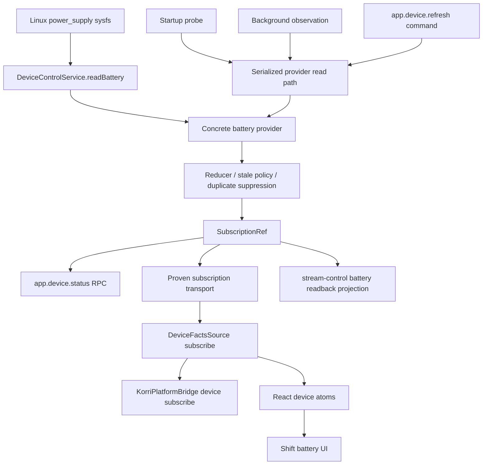

# feat: Add Korrid device-state events foundation

## Summary

Add a Korrid-owned device-state service that normalizes current device facts, exposes current state through typed RPC, and delivers current-state-plus-future-changes through one surface subscription path. Battery percentage is the first proof, with the model shaped for later Wi-Fi, presence, display, storage, and Bluetooth facts.

---

## Problem Frame

Korri surfaces need device facts such as battery percentage without knowing device-specific Linux paths or inventing one-off startup, refresh, and update paths. Korrid already owns the stable daemon-facing API surface, and Effect provides the current-state-plus-changes primitive needed to avoid missed events and duplicated UI state paths.

---

## Requirements

- R1. Provide a generic, Korrid-owned battery abstraction so UI surfaces can display battery percentage without per-device sysfs knowledge.
- R2. Model device facts as current state plus changes, not as event-only notifications that can be missed before a listener attaches.
- R3. Route startup probes, background observations, and manual refresh requests through the same state-update pipeline.
- R4. Expose current device state through a typed RPC snapshot contract for diagnostics, tests, and fallback consumers.
- R5. Expose live device changes through a typed subscription contract whose first delivery is the current state.
- R6. Keep product surfaces API/RPC/bridge-oriented; do not introduce a REST-style product API for battery/device state.
- R7. Make battery the first working proof while preserving an extensible shape for Wi-Fi, presence, display, storage, and related facts.
- R8. Avoid duplicate authoritative battery readers by aligning existing stream-control battery readback with the new device-state source.
- R9. Keep the UI update path singular: refresh responses may acknowledge work, but UI state changes arrive through the same device-state stream/store path as ambient updates.
- R10. Make the subscription path available through a surface-safe bridge/source abstraction so connected Korri surfaces do not depend on transport details.

---

## Scope Boundaries

- This plan implements battery as the first populated device fact; Wi-Fi, presence, display, storage, and Bluetooth providers are shape-compatible future work, not first-slice deliverables.
- This plan does not add per-device product hacks or product-specific battery labels; the provider reads normalized Linux power-supply data through existing abstractions.
- This plan does not replace Korrid's RPC surface with REST. Any HTTP long-lived transport details remain implementation mechanisms behind a Korri source/bridge concept.
- This plan does not rework Steam, session lifecycle, input, or ROCKNIX substrate behavior beyond reusing existing patterns for long-lived state and surface atoms.
- This plan does not require a visual redesign of the Shift status bar beyond replacing stale/default battery data with live normalized battery state.

### Deferred to Follow-Up Work

- Add Wi-Fi/provider events: implement after the battery proof establishes the device-state service, stream contract, and UI bridge.
- Add presence/display/storage providers: implement as separate slices using the same device-state pipeline.
- Add a provider registry abstraction: defer until a second provider exists; the first slice should keep the battery provider concrete while preserving additive schema space.
- Adapt Vigie UI only if stream-control's public battery schema must change; otherwise keep Vigie untouched and verify contract compatibility through stream-control tests.
- Consider a dedicated device-state diagnostics panel once multiple facts exist.

---

## Context & Research

### Relevant Code and Patterns

- `product/apps/portal/peers/peer-discovery.ts` uses `SubscriptionRef<ReadonlyMap<...>>` as current state plus `.changes`, seeded before the live watcher starts.
- `product/platform/stream/lan-stream-discovery.ts` uses Effect `Stream.callback` for long-lived discovery events and scoped cleanup.
- `product/apps/portal/api/config/events.ts` bridges subscribe-style daemon state to a browser event stream and immediately delivers current config state.
- `product/services/device/sessiond.ts` shows long-lived stream concerns: lifecycle replay, heartbeats, and explicit no-idle-timeout handling.
- `product/apps/portal/api/server/status.rpc.ts` and `product/apps/portal/api/server/status.rpc-handler.ts` show Schema-first RPC contracts and class-instance response construction.
- `product/apps/portal/api/app-rpc-group.ts`, `product/apps/portal/api/server/rpc-group.ts`, and `product/apps/portal/api/server/rpc-server.ts` are the app/server RPC registration and handler composition points.
- `product/apps/portal/api/stream-control/device-control-service.ts` already contains the generic `/sys/class/power_supply` reader and injectable file-system seams.
- `product/apps/portal/api/stream-control/service.ts` currently performs on-demand battery reads for stream-control state; this should delegate to the new device-state service to avoid duplicate truth.
- `product/apps/portal/features/home/foreground-session-status-layer-live.ts` and `product/platform/react/library/library-atoms.ts` show the Effect service/layer/atom pattern used to surface daemon-owned status into React.
- `product/platform/surface/bridge.ts` and `product/apps/portal/platform-bridge.ts` are the surface-safe abstraction boundaries that need explicit subscription support.
- `product/surfaces/web/shift/shift-power-state.ts`, `product/surfaces/web/shift/ui/atoms/ShiftBattery.tsx`, and `product/surfaces/web/shift/ui/molecules/ShiftStatusBar.tsx` provide the current battery display mapping, but the current atom is fixture/static rather than live.

### Institutional Learnings

- `docs/solutions/architecture-patterns/physical-host-foreground-lifecycle-truth-is-sessiond-2026-05-29.md`: daemon-owned truth should be proxied through typed Korrid surfaces rather than renderer-to-daemon coupling.
- `docs/solutions/runtime-errors/sessiond-sse-stream-killed-by-bun-idle-timeout-2026-05-27.md`: quiet long-lived streams need heartbeat/no-timeout/reconnect discipline; stream transport lifetime is not domain state.
- `docs/solutions/runtime-errors/effect-rpc-server-headers-concat-undefined-crash-2026-05-27.md`: new RPCs must stay behind the existing Hono envelope guard and not bypass `/api/rpc` composition.
- `docs/solutions/integration-issues/effect-v4-rpc-schema-class-responses-2026-05-03.md`: handlers returning `Schema.Class` responses must return class instances and require real client/server contract coverage.
- `docs/solutions/best-practices/react-state-components-over-result-render-props-for-effect-atoms-2026-05-03.md`: React state should be represented as typed state components/ADTs over raw async render props.
- `docs/solutions/best-practices/derive-component-states-from-state-machines-2026-06-25.md`: device fact states should be modeled as explicit variants so future unavailable/stale/error states do not drift from fixtures and tests.

### External References

- Effect `SubscriptionRef` documentation: current value plus a `changes` stream that emits current state at subscription time and all subsequent changes.
- Effect `PubSub` documentation: useful for event broadcasts, but less appropriate than `SubscriptionRef` when current state is the source of truth.
- Effect `Stream` documentation: represents values over time, replacing ad hoc observables/async iterables for long-lived update flows.
- Effect RPC README/API: `Rpc.make(..., { stream: true })` supports streaming RPC responses, but the current Korri batch JSON HTTP stack needs a proof before this can be treated as working locally.

---

## Key Technical Decisions

- Use `SubscriptionRef<DeviceState>` as the Korrid-side source of truth: it naturally models current state plus future updates and prevents snapshot/subscribe races.
- Prove the streaming transport before building UI on it: Korri currently uses batch JSON RPC and no local streaming RPC example, so the plan starts with a transport proof and fallback decision.
- Keep the product abstraction transport-agnostic: the surface/source API is `status`, `refresh`, and `subscribe`; implementation may use framed Effect RPC if proven, or an SSE bridge behind the same abstraction if current RPC framing cannot stream indefinitely.
- Register device contracts on the app-facing and server-facing RPC surfaces where needed: local surfaces and remote clients should not hit dead methods because only one RPC group was updated.
- Add both snapshot and subscription contracts: snapshot RPC is useful for tests, diagnostics, and fallback, while the subscription path is the primary real-time UI update path.
- Make the subscription current-state-first: late subscribers should receive current state immediately and then future changes, so clients do not need a separate seed call before subscribing.
- Make refresh a command into the pipeline, not a second UI state path: `app.device.refresh` should acknowledge the request and trigger a provider read/update; UI updates should still arrive through the device-state store/subscription.
- Treat battery absence as a valid domain state, not an exceptional failure: source machines and some devices may have no battery, and surfaces should suppress or degrade the indicator rather than show an error.
- Represent transient read failures after a ready value as stale-with-last-known state: users should not lose useful battery data, but the UI must not present stale data as freshly read.
- Reuse `DeviceControlService.readBattery()` rather than duplicate sysfs logic: device-state should wrap and normalize the existing generic power-supply reader.
- Make stream-control battery state read from `DeviceState`: shared adapters may project variants, but they must not become a second authoritative sysfs read path.
- Keep future facts optional/variant-shaped in the schema: first-slice responses should allow additional fact fields later without forcing all clients to understand every future provider.

---

## Open Questions

### Resolved During Planning

- Should refresh return data directly to the UI? Resolution: no. It should acknowledge/trigger work and let the same device-state event pipeline deliver the resulting state.
- Should battery use a REST endpoint? Resolution: no. Snapshot and refresh are RPC contracts, and live updates are a subscription/streaming contract surfaced through a Korri source/bridge.
- Should `PubSub` be the core primitive? Resolution: no for core state. `SubscriptionRef` is the better fit for current-state-plus-changes; `PubSub` remains useful later for separate audit/event streams if needed.
- Should battery absence be an error? Resolution: no. It is a valid state for non-handheld/source-machine contexts and should be represented distinctly.
- Should stream-control keep its own battery reader? Resolution: no. It should map from `DeviceState` so Korrid has one authoritative battery source.

### Deferred to Implementation

- Exact streaming transport mechanics: prove whether Effect RPC streaming works through Korri's current `/api/rpc` stack; if not, implement the accepted fallback behind the same source/bridge contract.
- Final equality helper shape for duplicate suppression: choose the smallest maintainable comparison once the schema is implemented.
- Exact polling cadence constant name and configurability: the plan assumes a conservative battery interval around tens of seconds; implementation should expose an override seam for tests.
- Exact stale display styling in Shift: implementation should choose the minimal visual treatment that avoids showing stale fixture/default data as live state.

---

## Output Structure

The tree below is the expected new-file shape; existing RPC group, bridge, stream-control, and Shift files are listed in their units.

    product/apps/portal/api/device/
      device-state.ts
      device-state.test.ts
      status.rpc.ts
      status.rpc-handler.ts
      status.rpc-handler.test.ts
      refresh.rpc.ts
      refresh.rpc-handler.ts
      refresh.rpc-handler.test.ts
      events.rpc.ts
      events.rpc-handler.ts
      events.rpc-handler.test.ts
      streaming-transport.test.ts
    product/apps/portal/features/home/
      device-facts-layer-live.ts
      device-facts-layer-live.test.ts
    product/platform/device/
      device-facts.ts
      device-facts.test.ts
      device-facts-source.ts
      device-facts-source.test.ts
    product/platform/react/device/
      device-atoms.ts
      device-atoms.test.ts
    docs/solutions/architecture-patterns/
      korrid-device-state-subscriptionref-2026-07-01.md

---

## High-Level Technical Design

> *This illustrates the intended approach and is directional guidance for review, not implementation specification. The implementing agent should treat it as context, not code to reproduce.*

Core control-flow rule: all producer paths enter the serialized provider read path, then write into the same reducer/`SubscriptionRef`; all UI state updates observe the same state stream/store. Startup probe, periodic observation, and refresh command differ only in how they request a provider read.

---

## Implementation Units

### U1. Prove and choose the subscription transport

**Goal:** Establish the local streaming/subscription transport before building device-state UI on top of it.

**Requirements:** R5, R6, R9, R10

**Dependencies:** None

**Files:**
- Create: `product/apps/portal/api/device/streaming-transport.test.ts`
- Modify: `product/apps/portal/api/hono-app.ts`
- Modify: `product/platform/api/rpc/client.ts`
- Modify: `product/platform/api/rpc/client-layer.ts`
- Modify: `product/apps/portal/api/rpc-server.ts`
- Modify: `product/apps/portal/api/server/rpc-server.ts`

**Approach:**
- Prove whether an indefinite Effect streaming RPC can emit through the current `RpcClientLive`, `createHonoApp`, `/api/rpc`, envelope guard, and serialization stack before completion.
- If the current batch JSON stack cannot support indefinite streams, choose a fallback transport behind the same device source/bridge abstraction, such as an SSE bridge that serializes device-state events while snapshot/refresh remain RPC.
- Define content-type, envelope-guard, heartbeat, cancellation, and reconnect expectations for the chosen streaming path.
- Keep the public product abstraction as a typed subscription, not a REST resource, regardless of transport.

**Execution note:** Start with a failing transport contract test; do not proceed to UI units until this unit proves either streaming RPC or the accepted fallback.

**Patterns to follow:**
- `product/apps/portal/api/config/events.ts` for SSE-style streaming if fallback is required.
- `product/services/device/sessiond.ts` for long-lived stream heartbeats and cancellation concerns.
- Effect RPC streaming documentation for `stream: true` if framed RPC is viable.

**Test scenarios:**
- Happy path: an infinite test stream delivers its first item to a client before the stream completes.
- Happy path: client cancellation closes the server-side stream/subscription.
- Edge case: a quiet stream remains connected or heartbeating without being mistaken for domain failure.
- Error path: malformed unary RPC envelopes still use the existing guard and are not broken by streaming support.
- Integration: the selected transport works through the same server shape used by `createHonoApp`, not only an in-memory handler test.

**Verification:**
- The plan has a proven, test-backed subscription transport decision before `app.device.events` or bridge subscription work depends on it.

---

### U2. Define device-state domain schemas and battery normalization

**Goal:** Establish the shared device-state vocabulary and normalize raw battery snapshots without wiring the service into Korrid yet.

**Requirements:** R1, R2, R7

**Dependencies:** U1 only for final transport assumptions; domain work can be developed independently once U1 has a direction.

**Files:**
- Create: `product/platform/device/device-facts.ts`
- Test: `product/platform/device/device-facts.test.ts`
- Modify: `product/apps/portal/api/stream-control/device-control-service.ts`
- Test: `product/apps/portal/api/stream-control/stream-control.rpc-handler.test.ts`

**Approach:**
- Define a portable device-state domain model in `product/platform/device/` that can be imported by server, client, and surface code without crossing `product/apps/` boundaries.
- Use one authoritative first-slice battery state vocabulary:
  - `Unknown`: no successful read has happened yet.
  - `NoBattery`: the host reports no usable battery supply.
  - `Ready`: a current battery read is available.
  - `Stale`: a prior ready read exists, but the latest read failed; carries last-known state and error metadata.
  - `ReadError`: no ready value exists and the read failed.
- Normalize raw `BatterySnapshot` into those variants rather than leaking raw sysfs failures to UI surfaces.
- Treat no battery hardware as a first-class non-error state.
- Define first-slice multi-battery behavior deliberately: use the existing deterministic primary-battery selection for v1, and record aggregation as follow-up only if a real multi-battery target requires it.
- Derive `charging` conservatively from the raw status; start with `Charging` as the only charging state unless implementation uncovers an established local convention.
- Extend optional sysfs reads to tolerate missing or unreadable optional fields without killing the entire battery provider when possible.

**Execution note:** Start with domain conversion tests before changing the existing device-control reader behavior.

**Patterns to follow:**
- `product/platform/state/state-machine.ts` for explicit state variants.
- `product/apps/portal/api/stream-control/rpc-schemas.ts` for existing battery readback shape.
- `product/apps/portal/api/stream-control/device-control-service.ts` for injectable filesystem dependencies.

**Test scenarios:**
- Happy path: raw power-supply snapshot with a `Battery` supply and numeric capacity maps to `Ready` with that percent.
- Happy path: raw status `Charging` maps to `charging: true`.
- Edge case: raw status `Full`, `Discharging`, `Unknown`, or `null` maps to `charging: false`.
- Edge case: a power-supply directory with USB/Mains entries but no `Battery` supply maps to `NoBattery` rather than a thrown UI-facing error.
- Edge case: multiple battery supplies follow the documented primary-selection policy deterministically.
- Edge case: missing optional files such as `status` or `capacity` produce a typed state with nullable/unknown fields instead of crashing normalization.
- Error path: unreadable optional sysfs fields are contained so the provider can continue and retry later.
- Error path: malformed numeric capacity is normalized to an unknown/nullable battery value rather than a bogus percent.

**Verification:**
- Device-state domain types can represent ready, unknown, no-battery, stale, and read-error battery states.
- Existing stream-control tests still pass after any optional-read hardening.

---

### U3. Add Korrid DeviceState service backed by SubscriptionRef

**Goal:** Create the server-side Effect service that owns current device state, performs startup/background observations, serializes provider reads, suppresses duplicate updates, and exposes refresh as a command into the same pipeline.

**Requirements:** R2, R3, R7, R9

**Dependencies:** U1, U2

**Files:**
- Create: `product/apps/portal/api/device/device-state.ts`
- Test: `product/apps/portal/api/device/device-state.test.ts`
- Modify: `product/apps/portal/api/server/rpc-server.ts`

**Approach:**
- Add a Korrid-local `DeviceState` service that owns a `SubscriptionRef<DeviceState>` and exposes current state, changes, and refresh command behavior to RPC handlers.
- Seed the ref with `Unknown`, then run a startup probe through the same update pipeline.
- Serialize startup, background, and refresh provider reads through a single queue or monotonic sequence policy so a slow older read cannot overwrite a newer refresh result.
- Fork a scoped background observation loop for battery using a conservative cadence and injectable scheduler/reader seams for tests.
- Ensure refresh requests trigger the provider read and state update but do not create a separate UI-facing data path.
- Suppress duplicate state emissions before updating the ref so polling unchanged battery values does not churn subscribers.
- Apply stale policy: transient failures after `Ready` become `Stale`; failures before any ready value become `ReadError`.
- Provide a no-op/test layer for environments where real sysfs should not be read.

**Execution note:** Implement with characterization around the new service lifecycle before exposing RPCs.

**Patterns to follow:**
- `product/apps/portal/peers/peer-discovery.ts` for `SubscriptionRef`, seed-then-watch, `Effect.forkScoped`, and scoped service lifetime.
- `product/apps/portal/api/server/rpc-server.ts` for adding live layers to Korrid's server infrastructure.

**Test scenarios:**
- Happy path: startup probe reads a battery snapshot and updates the current state from `Unknown` to `Ready`.
- Happy path: background observation updates the ref when battery percent changes.
- Happy path: refresh command invokes the same provider/reducer pipeline and causes subscribers to observe the refreshed state.
- Edge case: refresh with unchanged battery data does not emit a duplicate state update.
- Edge case: overlapping background poll and refresh cannot overwrite newer state with an older completion.
- Edge case: multiple subscribers receive the same state transition.
- Error path: provider read failure before any successful read records `ReadError` and does not terminate the service permanently.
- Error path: provider read failure after a successful read records `Stale` with last-known battery state.
- Error path: no-battery provider result remains a valid current state and does not retry as a fatal startup failure.
- Integration: closing the service scope stops background fibers/subscriptions cleanly.

**Verification:**
- Korrid has one authoritative device-state service with injectable test seams.
- Startup, background, and refresh paths are visibly unified around the same serialized reducer/update function.

---

### U4. Expose snapshot and refresh RPC contracts on the correct surfaces

**Goal:** Add typed RPCs for reading current device state and triggering a refresh command without making refresh a parallel UI state source.

**Requirements:** R3, R4, R6, R9, R10

**Dependencies:** U1, U2, U3

**Files:**
- Create: `product/apps/portal/api/device/status.rpc.ts`
- Create: `product/apps/portal/api/device/status.rpc-handler.ts`
- Test: `product/apps/portal/api/device/status.rpc-handler.test.ts`
- Create: `product/apps/portal/api/device/refresh.rpc.ts`
- Create: `product/apps/portal/api/device/refresh.rpc-handler.ts`
- Test: `product/apps/portal/api/device/refresh.rpc-handler.test.ts`
- Modify: `product/apps/portal/api/app-rpc-group.ts`
- Modify: `product/apps/portal/api/server/rpc-group.ts`
- Modify: `product/apps/portal/api/rpc-server.ts`
- Modify: `product/apps/portal/api/server/rpc-server.ts`
- Test: `product/apps/portal/api/server/rpc-server.test.ts`

**Approach:**
- Add `app.device.status` as the snapshot contract that returns the current device-state value from `DeviceState`, using Schema classes and class-instance handler responses.
- Add `app.device.refresh` as a command contract that accepts a fact selector or defaults to battery for the first slice, triggers provider refresh through `DeviceState`, and returns acknowledgement/request metadata rather than battery data for UI rendering.
- Register device RPCs on the app-facing and server-facing RPC groups, matching existing cross-surface patterns such as stream-control where local surfaces and daemon/remote callers both need access.
- Keep all new RPCs inside the existing Hono/RPC composition so the envelope guard and middleware continue to apply.
- Preserve additive schema discipline so future facts can be added without forcing first-slice clients to understand every future field.

**Patterns to follow:**
- `product/apps/portal/api/server/status.rpc.ts` and `product/apps/portal/api/server/status.rpc-handler.ts` for Schema-class response contracts.
- `product/apps/portal/api/app-rpc-group.ts` and `product/apps/portal/api/server/rpc-group.ts` for dual-surface registration patterns.
- `product/apps/portal/api/server/status.rpc-handler.test.ts` for handler and client/server contract coverage.

**Test scenarios:**
- Happy path: `app.device.status` returns the current `Ready` battery state from an injected `DeviceState` layer.
- Happy path: `app.device.refresh` returns accepted/acknowledged when a battery refresh is scheduled/performed.
- Edge case: `app.device.status` returns `Unknown`, `NoBattery`, `Stale`, and `ReadError` as valid responses.
- Edge case: refresh with an omitted selector defaults to the first-slice battery fact.
- Error path: refresh provider failure updates device state through the pipeline and does not update UI directly from the response.
- Integration: real RPC client/server test decodes `Schema.Class` responses across `/api/rpc`.
- Integration: default `createHonoApp()` and Korrid server-surface wiring both expose the chosen device RPC tags.
- Integration: malformed RPC envelopes continue to be rejected by the existing envelope guard, not by per-route ad hoc logic.

**Verification:**
- New RPC tags are present on the required RPC surfaces and served through existing Korrid RPC handlers.
- Snapshot reads and refresh commands both interact with `DeviceState`; neither reads sysfs independently.

---

### U5. Add current-state-first device event subscription

**Goal:** Provide a live device-state subscription whose first delivery is the current snapshot and whose later deliveries are the same state transitions caused by startup, background observation, or refresh.

**Requirements:** R2, R3, R5, R6, R9, R10

**Dependencies:** U1, U2, U3, U4

**Files:**
- Create: `product/apps/portal/api/device/events.rpc.ts`
- Create: `product/apps/portal/api/device/events.rpc-handler.ts`
- Test: `product/apps/portal/api/device/events.rpc-handler.test.ts`
- Modify: `product/apps/portal/api/app-rpc-group.ts`
- Modify: `product/apps/portal/api/server/rpc-group.ts`
- Modify: `product/apps/portal/api/hono-app.ts`
- Modify: `product/apps/portal/api/rpc-server.ts`
- Modify: `product/apps/portal/api/server/rpc-server.ts`
- Test: `product/apps/portal/api/server/rpc-server.test.ts`

**Approach:**
- Implement the subscription using the transport proven in U1.
- If U1 proves framed Effect streaming RPC viable, define `app.device.events` as a streaming RPC using the device-state event schema.
- If U1 selects an SSE bridge fallback, keep `app.device.events` as the domain name/contract and implement the transport behind the `DeviceFactsSource` subscription path rather than introducing a UI-facing REST resource.
- Drive the subscription from `SubscriptionRef.changes`, preserving the current-state-first semantic and documenting that clients should not call snapshot-before-subscribe for seeding.
- Provider read failures should be emitted as typed device-state variants (`Stale`/`ReadError`), not as stream failures; reserve stream errors for transport/server failures.
- Apply duplicate suppression before or within the stream so unchanged poll results do not emit downstream.
- Establish test coverage for subscription ordering, current-first delivery, update delivery, transport error mapping, and scope cleanup.

**Execution note:** Treat this as the first local device subscription pattern and make tests exemplary enough for future providers/subscriptions to copy.

**Patterns to follow:**
- U1's selected transport proof.
- `product/apps/portal/peers/peer-discovery.ts` for `SubscriptionRef.changes` current-state-plus-updates behavior.
- `product/services/device/sessiond.ts` and `docs/solutions/runtime-errors/sessiond-sse-stream-killed-by-bun-idle-timeout-2026-05-27.md` for long-lived stream liveness concerns if implementation uses SSE.

**Test scenarios:**
- Happy path: subscribing immediately receives the current `Ready` battery state.
- Happy path: a subsequent refresh/background update emits exactly one new event to active subscribers.
- Edge case: a late subscriber receives the latest current state, not an empty stream waiting for the next change.
- Edge case: unchanged battery reads are not emitted repeatedly.
- Edge case: two concurrent subscribers receive the same ordered updates.
- Error path: provider read failures become typed state emissions rather than crashing the stream.
- Error path: transport/server failure is distinguishable from device-state read failure.
- Integration: client cancellation cleans up the server-side subscription/fiber.
- Integration: the chosen transport can be consumed by the client layer with no snapshot-before-subscribe race.

**Verification:**
- The device-state subscription is the canonical live contract for device-state changes.
- The current-state-first guarantee is encoded in tests and documentation comments near the subscription contract.

---

### U6. Add client DeviceFactsSource, bridge subscription, and React atoms

**Goal:** Surface Korrid device state into client/shared React code through Effect layers, a surface-safe bridge contract, and atoms rather than direct component polling or direct RPC calls in UI components.

**Requirements:** R1, R4, R5, R9, R10

**Dependencies:** U4, U5

**Files:**
- Create: `product/platform/device/device-facts-source.ts`
- Test: `product/platform/device/device-facts-source.test.ts`
- Create: `product/platform/react/device/device-atoms.ts`
- Test: `product/platform/react/device/device-atoms.test.ts`
- Create: `product/apps/portal/features/home/device-facts-layer-live.ts`
- Test: `product/apps/portal/features/home/device-facts-layer-live.test.ts`
- Modify: `product/apps/portal/features/home/HomeRuntimeLayersRoot.tsx`
- Test: `product/apps/portal/features/home/HomeRuntimeLayersRoot.test.tsx`
- Modify: `product/apps/portal/platform-bridge.ts`
- Test: `product/apps/portal/platform-bridge.test.ts`
- Modify: `product/platform/surface/bridge.ts`
- Test: `product/platform/surface/bridge.test.ts`

**Approach:**
- Define a shared `DeviceFactsSource` interface/layer seam mirroring `ForegroundSessionStatusSource`, with methods for status, refresh command, and subscribe behavior.
- Extend `KorriPlatformBridge` with an explicit device subscription capability that returns an unsubscribe function and delivers current state first.
- Add live client wiring that uses the U5 subscription for current-state-plus-updates and `app.device.status` as a diagnostic/fallback read path, not as a concurrent polling source.
- Add atom layer/runtime/data atoms following existing `catalog` and `foregroundSession` atom patterns.
- Ensure manual refresh calls the source command and relies on the stream/store to update React state.
- Seed `HomeRuntimeLayersRoot` with the live device facts layer for production and a fixture layer for non-desktop/dev/test contexts.

**Patterns to follow:**
- `product/apps/portal/features/home/foreground-session-status-layer-live.ts` for RPC-backed Effect service layers.
- `product/platform/react/catalog/catalog-atoms.ts` and `product/platform/react/library/library-atoms.ts` for layer atoms and runtime atoms.
- `product/platform/surface/bridge.ts` for exposing agent/native-safe surface bridge capabilities.

**Test scenarios:**
- Happy path: live layer receives a current-state-first subscription event and updates the device atom to `Ready` battery state.
- Happy path: refresh command invokes `app.device.refresh` but does not directly mutate UI state from the response.
- Edge case: fixture layer provides deterministic `NoBattery` or `Unknown` states for tests/stories.
- Edge case: bridge subscription delivers current state first and cleans up on unsubscribe.
- Error path: subscription transport failure becomes a typed load/error atom state instead of an uncaught render error.
- Error path: RPC snapshot failure affects only diagnostics/fallback state, not an already-live subscription state.
- Integration: `HomeRuntimeLayersRoot` seeds device facts alongside existing catalog/library/foreground-session layers.
- Integration: bridge consumers can subscribe or refresh without depending on concrete transport details.

**Verification:**
- UI-facing code can consume device facts through Effect atoms/bridge abstractions.
- There is no component-level battery polling loop or direct RPC call embedded in a surface component.

---

### U7. Wire Shift battery UI to live device state

**Goal:** Replace the Shift battery indicator's static/default power value with live normalized device state while handling unknown/no-battery/stale states gracefully.

**Requirements:** R1, R5, R7, R9

**Dependencies:** U6

**Files:**
- Modify: `product/surfaces/web/shift/shift-power-state.ts`
- Modify: `product/surfaces/web/shift/routes/ShiftHomeRoute.test.ts`
- Modify: `product/surfaces/web/shift/routes/ShiftHomeRoute.test.tsx`
- Modify: `product/surfaces/web/shift/ui/atoms/ShiftBattery.tsx`
- Modify: `product/surfaces/web/shift/ui/molecules/ShiftStatusBar.tsx`
- Test: `product/surfaces/web/shift/entry.test.ts`

**Approach:**
- Introduce a Shift-facing power display ADT such as hidden/unknown/ready/stale rather than relying on optional props that fall back to a medium battery default.
- Render ready battery percentage and charging state in the existing `ShiftBattery` component style.
- Suppress or neutralize the battery indicator for `Unknown`/`NoBattery` states so stale fixture data is not shown as real device status.
- For `Stale`, preserve useful last-known information only if the UI can clearly avoid presenting it as fresh; otherwise degrade to the same neutral treatment as unknown.
- Keep lab/design fixtures able to drive battery states explicitly without requiring a live Korrid connection.

**Patterns to follow:**
- `product/surfaces/web/shift/shift-power-state.ts` for display-level battery mapping.
- `product/surfaces/web/shift/ui/molecules/ShiftStatusBar.tsx` for status bar composition.
- `product/apps/portal/features/home/HomeRuntimeLayersRoot.tsx` for route-local layer seeding.

**Test scenarios:**
- Happy path: ready device battery state with 82% renders an 82% Shift battery reading.
- Happy path: charging device state renders the charging variant/icon through existing Shift battery props.
- Edge case: `Unknown` battery state does not render the hardcoded default percentage or default medium icon as if it were live.
- Edge case: `NoBattery` suppresses or neutralizes the battery indicator according to the finalized component behavior.
- Edge case: `Stale` does not appear as a fresh ready state.
- Edge case: null/unknown percent does not crash battery level mapping.
- Error path: device atom load error does not break the home route; the battery indicator degrades safely.
- Integration: Shift entry seeds the device facts layer so the production route can receive live updates.

**Verification:**
- Shift status bar reflects live battery state when available and never mistakes fixture defaults for live data.
- Existing lab/design fixture battery behavior remains usable for visual exploration.

---

### U8. Align stream-control battery readback with DeviceState

**Goal:** Prevent two independent Korrid battery truths by making the existing stream-control battery read path delegate to the new device-state service.

**Requirements:** R1, R4, R8

**Dependencies:** U2, U3, U4

**Files:**
- Modify: `product/apps/portal/api/stream-control/service.ts`
- Modify: `product/apps/portal/api/stream-control/rpc-schemas.ts`
- Test: `product/apps/portal/api/stream-control/stream-control.rpc-handler.test.ts`
- Modify: `product/apps/portal/api/server/rpc-server.ts`

**Approach:**
- Keep stream-control's public response schema stable for existing Vigie/control consumers.
- Make stream-control battery readback map from `DeviceState.current` or an explicitly injected device-state snapshot source.
- Ensure `StreamControlLayerLive*` and server infrastructure provide the same `DeviceStateLayerLive` instance to device RPC handlers and stream-control handlers in one server scope.
- Use shared projection helpers only to convert device-state variants into stream-control's existing `ok/error/disabled` readback shape; projection helpers must not read sysfs themselves.
- Preserve existing stream-control behavior for moonlight, brightness, and plugin controls.

**Patterns to follow:**
- `product/apps/portal/api/stream-control/service.ts` for current control-state composition.
- `product/apps/portal/api/server/rpc-server.ts` for shared layer wiring.

**Test scenarios:**
- Happy path: stream-control state reports battery percent matching the current `DeviceState` ready battery fact.
- Edge case: `NoBattery` device state maps to a stable stream-control error/disabled/readback shape without changing the public schema unexpectedly.
- Edge case: `Unknown` battery device state does not fabricate a stale percent.
- Edge case: `Stale` maps to an existing stream-control-compatible shape with clear error/readback semantics.
- Error path: `ReadError` appears in stream-control's existing error channel shape.
- Integration: a single injected `DeviceState` value drives both `app.device.status` and `app.stream-control.state.get`.
- Regression: moonlight, brightness, and plugin state responses remain unchanged.

**Verification:**
- There is one authoritative battery source inside Korrid.
- Existing Vigie/control consumers retain their public contract while benefiting from normalized device state.

---

### U9. Document the device-state contract and future provider pattern

**Goal:** Capture the new architectural contract so future Wi-Fi/presence/display/storage providers plug into the same pipeline instead of creating parallel mechanisms.

**Requirements:** R2, R3, R5, R6, R7, R9, R10

**Dependencies:** U1, U2, U3, U4, U5, U6, U7, U8

**Files:**
- Create: `docs/solutions/architecture-patterns/korrid-device-state-subscriptionref-2026-07-01.md`
- Modify: `product/apps/portal/api/device/device-state.ts`
- Modify: `product/apps/portal/api/device/events.rpc.ts`
- Modify: `product/platform/device/device-facts.ts`
- Modify: `product/platform/device/device-facts-source.ts`

**Approach:**
- Document the invariant that Korrid device facts are current-state-first, streamable/subscribable, and update through one reducer path.
- Document provider expectations: startup probe, observation/refresh triggers, serialized reads, duplicate suppression, stale policy, typed absence/error states, and additive schema evolution.
- Include a short note on why refresh acknowledgements do not directly update UI state.
- Document the selected subscription transport and testing expectations because this plan introduces Korri's first device-state subscription pattern.
- Clarify that provider registry/generalization is deferred until a second provider exists.

**Patterns to follow:**
- Existing `docs/solutions/architecture-patterns/` decision records for concise problem/decision/consequence structure.
- `docs/solutions/architecture-patterns/physical-host-foreground-lifecycle-truth-is-sessiond-2026-05-29.md` for daemon-truth architecture documentation.

**Test scenarios:**
- Test expectation: none -- documentation and inline contract comments only; behavioral coverage belongs to U1-U8.

**Verification:**
- Future provider implementers can identify the required service, schema, update, stream, UI, and test seams without reverse-engineering the battery proof.

---

## System-Wide Impact

- **Interaction graph:** Korrid server/app RPC handlers, device-state service fibers, stream-control readback, platform bridge, React atoms, and Shift surfaces will all touch the new device facts contract.
- **Error propagation:** Raw sysfs read failures should be converted at the provider boundary into typed device-state variants; transport failures should remain transport/client errors; UI components should receive typed load/unavailable/stale states.
- **State lifecycle risks:** Startup unknown state, duplicate emissions, stale overwrites from overlapping reads, slow stream consumers, manual refresh races, and background fiber cleanup are the main lifecycle risks. `SubscriptionRef`, serialized reads, scoped fibers, duplicate suppression, and current-state-first subscription tests address them.
- **API surface parity:** Snapshot, refresh, subscription, platform bridge, and React atoms must all agree on the same domain variants. Stream-control battery readback must stay public-schema-compatible while aligning internally.
- **Integration coverage:** Unit tests alone will not prove the RPC wire contract, selected streaming transport, or cancellation; include real client/server or transport-harness coverage for new snapshot and subscription contracts.
- **Unchanged invariants:** Existing `/api/rpc` remains the main Korrid product API surface; config events and sessiond lifecycle streams are not replaced; stream-control moonlight/brightness/plugin contracts remain intact.

---

## Risks & Dependencies

| Risk | Mitigation |
|------|------------|
| Effect streaming RPC may not work through current batch JSON `/api/rpc` | U1 proves transport first and selects framed RPC or fallback SSE bridge behind the same source/bridge abstraction. |
| Device RPCs could be registered on the wrong surface | U4 requires app and server RPC surface ownership plus integration tests against `createHonoApp`/Korrid wiring. |
| Bridge cannot currently carry subscriptions | U6 explicitly extends the bridge/source contract with current-state-first subscribe and unsubscribe cleanup. |
| Slow or disconnected stream clients could leak resources | Scope streams to transport/client lifetime and add cancellation tests; apply heartbeat/no-timeout guidance if SSE is selected. |
| Polling unchanged battery values could cause UI churn | Suppress duplicate updates before writing to `SubscriptionRef` and test unchanged refresh/poll behavior. |
| Older provider reads could overwrite newer refresh state | U3 serializes or sequences provider reads and tests overlapping completion order. |
| Battery absence could be misreported as an error | Represent `NoBattery` as a valid domain state and have Shift suppress/neutralize the indicator. |
| Transient read failures could hide useful battery data or misrepresent stale data | Use `Stale` with last-known state and metadata, and make Shift distinguish it from fresh `Ready`. |
| Two battery read paths could disagree | U8 makes stream-control map from `DeviceState`, not from an independent sysfs reader. |
| New schema could block future facts | Use additive optional fields and tagged variants so future providers can be introduced without breaking battery-first clients. |
| Refresh response could accidentally become a second UI state path | Keep refresh response as acknowledgement/command outcome; tests verify UI updates come through the device-state subscription/store. |

---

## Documentation / Operational Notes

- Add a `docs/solutions/architecture-patterns/` note once the first slice lands so future provider work preserves the current-state-first and single-pipeline design.
- If implementation selects SSE as the fallback transport, document heartbeat, disconnect, and retry semantics near the endpoint and tests.
- Expose environment/test seams for power-supply directories and polling cadence; avoid production-only paths in tests.
- Treat battery telemetry as local device status, not user-private content, but avoid adding identifying hardware model details to broad federated surfaces unless explicitly needed.

---

## Alternative Approaches Considered

- **Unary snapshot polling only:** simpler and consistent with some existing atoms, but it violates the user's desire for a general event/reaction foundation and creates a second UI update path around refresh.
- **Raw REST/SSE endpoint as the product API:** easy to implement from Hono patterns, but it conflicts with Korri's RPC/bridge-oriented product surface. SSE remains acceptable only as an internal transport behind `DeviceFactsSource.subscribe` if streaming RPC cannot work locally.
- **Generic provider registry in the first slice:** attractive for future facts, but premature with only battery in scope. The plan keeps schema and service seams extensible while deferring registry abstraction until a second provider proves the shape.
- **Leaving stream-control battery independent:** avoids refactoring, but preserves two battery truths and undermines the device-state service as the authoritative source.

---

## Sources & References

- Related code: `product/apps/portal/peers/peer-discovery.ts`
- Related code: `product/platform/stream/lan-stream-discovery.ts`
- Related code: `product/apps/portal/api/config/events.ts`
- Related code: `product/apps/portal/api/app-rpc-group.ts`
- Related code: `product/apps/portal/api/server/status.rpc.ts`
- Related code: `product/apps/portal/api/server/status.rpc-handler.ts`
- Related code: `product/apps/portal/api/server/rpc-group.ts`
- Related code: `product/apps/portal/api/server/rpc-server.ts`
- Related code: `product/apps/portal/api/stream-control/device-control-service.ts`
- Related code: `product/apps/portal/api/stream-control/service.ts`
- Related code: `product/apps/portal/features/home/foreground-session-status-layer-live.ts`
- Related code: `product/platform/surface/bridge.ts`
- Related code: `product/apps/portal/platform-bridge.ts`
- Related code: `product/surfaces/web/shift/shift-power-state.ts`
- Institutional learning: `docs/solutions/architecture-patterns/physical-host-foreground-lifecycle-truth-is-sessiond-2026-05-29.md`
- Institutional learning: `docs/solutions/runtime-errors/sessiond-sse-stream-killed-by-bun-idle-timeout-2026-05-27.md`
- Institutional learning: `docs/solutions/runtime-errors/effect-rpc-server-headers-concat-undefined-crash-2026-05-27.md`
- Institutional learning: `docs/solutions/integration-issues/effect-v4-rpc-schema-class-responses-2026-05-03.md`
- External docs: `https://effect.website/docs/state-management/subscriptionref/`
- External docs: `https://effect.website/docs/concurrency/pubsub/`
- External docs: `https://effect.website/docs/stream/introduction/`
- External docs: `https://github.com/Effect-TS/effect/blob/main/packages/rpc/README.md`
