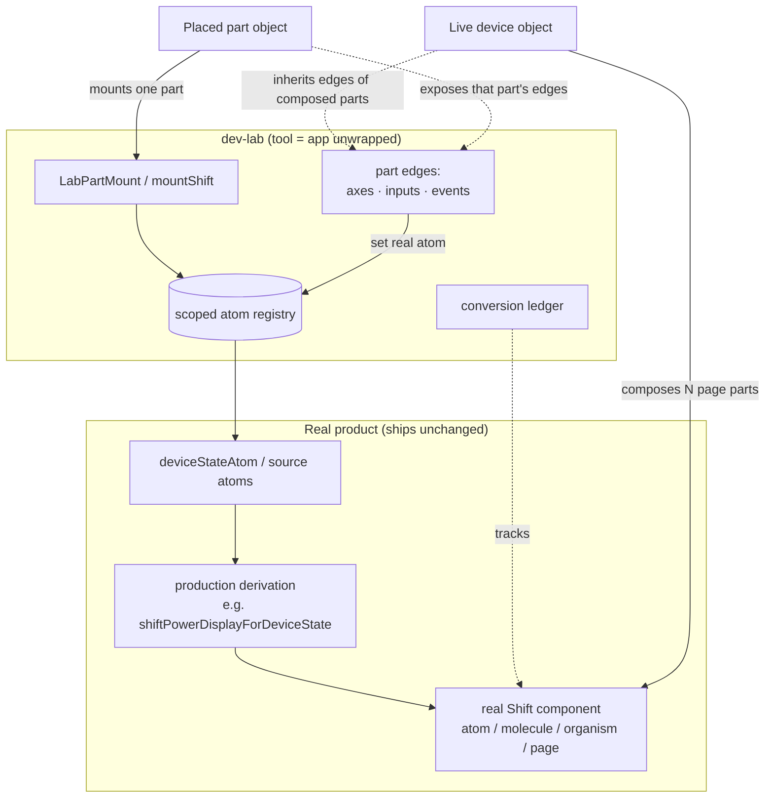

# refactor: Shift part-first atomic conversion — parts are the app, devices are mounts

## Summary

Realize the "parts *are* the application, a device is just a mount" vision in the theme-workshop dev-lab, scoped to the **Shift** surface. Make the three ways to drive a surface — **axes** (state machines), **inputs** (held product values), and **events** (device facts over time) — uniform *part-level* edges; mount placed parts through the same real registry path as live devices so those edges (including battery/network device events) reach any part through its real production derivation; and decompose Shift's remaining monolithic surfaces (Detail, Library) into pure atomic-design parts. The device becomes a pure composition of page parts that inherits its parts' edges rather than owning them.

---

## Problem Frame

The dev-lab's governing principle is "the tool is the app unwrapped, never a simulation — swap the data at the last-mile edge, never the mechanism" (`tools/theme-workshop/AGENTS.md`). Today that principle holds for Shift's **live device** objects and its already-atomic **cinematic Home** family, but two gaps remain:

1. **Edges are anchored to the wrong level.** Events were just added as a *device*-scoped affordance (`eventsForScreen`), inputs are device/screen-held, and only live-mounted devices register a real atom registry. **Placed parts** render through a separate static `renderSurfacePart(story, binding)` path keyed by object-local `inputValues` → props. That is a second render/drive mechanism, and it means device facts (battery, network) cannot reach a part in isolation — the exact limitation surfaced when asking "shouldn't events be available in parts too?" In the target, parts are the app and the device is their mount, so edges belong to parts and the device inherits them by composition.

2. **Shift is only partially decomposed.** Home (`ShiftHome.page.part.tsx`) and the cinematic `ui/` atoms/molecules/organisms are converted, but Shift's **Detail** (`ShiftDetailSplit`, `ShiftDetailActions`, `ShiftDetailHints`, `ShiftLibraryTile`) and the entire **Library** family (`ShiftLibraryDeck/Grid/Lens/Reel/Shelves/FilterBar`) are monolithic `pages/` components with no atomic `.part.tsx` decomposition. Library *is* reachable in the lab today, but only coarsely: `ShiftScreens.page.part.tsx` maps every `shiftConfig.screens` entry (including the Library layouts) to a single page-layer story — a page-level bridge, not an atomic decomposition. So the "meat" of the application is present as whole-screen stories but is not yet expressible as atoms/molecules/organisms driven by real edges.

This roadmap closes both gaps for Shift.

---

## Requirements

- R1. Parts are the unit of the application: every Shift screen and product component is representable as a pure atomic-design `.part.tsx` driven only through real edges — no static re-implementation and no tool-only side channel.
- R2. A device is a composition/mount of page parts; it owns no product state of its own beyond tiling, bezels, and cross-screen wiring.
- R3. Axes, inputs, and events are uniform *part-level* edges, available on any part whose real subtree consumes them; the device inherits its parts' edges by composition rather than declaring its own.
- R4. Placed parts render through the same real mount + scoped registry path as live devices (one renderer, one mechanism); axes/inputs/events reach a placed part through its real registry, not through an object-local props re-render.
- R5. Device facts (battery, network) drive parts through their production derivation — e.g. a battery event flows `deviceStateAtom` → the real battery-display derivation → the atom's props — never a hand-set prop bypass.
- R6. Shift's **Detail** surface is fully decomposed into atomic parts with real-edge stories.
- R7. Shift's **Library** surface is fully decomposed into atomic parts (discoverable/mountable as placed parts) with its catalog **Data** edge real and each interaction control either lifted to a real input edge or explicitly recorded as local interaction state.
- R8. Every Shift product component maps to a tracked entry in a Shift **conversion ledger** recording its atomic layer, real edges, and conversion status.
- R9. The lab→product boundary and the one-renderer / no-preview-singleton invariants are preserved and enforced by tests.
- R10. A repeatable **decomposition playbook** exists so future conversions (including the deferred pico/boxbuster work) follow one documented process.

---

## Scope Boundaries

- This roadmap covers the **Shift** surface only. pico and boxbuster stay on their current mechanisms.
- It does not redesign Shift's visual design; decomposition preserves the rendered output.
- It does not change production product behavior except to add a *real edge* where a value is currently hard-coded (per the governing principle, giving a hard-coded value a real edge is real-app work that ships unchanged, not tool-only work).
- It does not add new Korri product features, new surfaces, or new device-fact providers beyond the existing battery/network events.
- It does not remove the `renderSurfacePart` code path wholesale in one step; it retires it *as a distinct drive mechanism* by routing parts through the real mount, keeping any genuinely presentational leaf render only where no real upstream exists.

### Deferred to Follow-Up Work

- **pico + boxbuster part-first conversion**: a separate future roadmap applies this same foundation + playbook to the other surfaces.
- **Retiring pico's transitional preview-singleton** (`preview ?? live`): tracked as known debt in `tools/theme-workshop/AGENTS.md`; out of scope here (Shift already follows the real-edge pattern).
- **New device-fact providers** (presence, display, storage, Bluetooth) as events: deferred to the device-state foundation's follow-ups (see origin device-state work).
- **Multi-surface generalization of the conversion ledger** into a cross-surface coverage dashboard.
- **A single Library page part with a real `layout` edge** (Deck/Grid/Lens/Reel/Shelves as selectable views): this is a product route/control decision, not a decomposition step. U6 converts the existing variant components as-is; unifying them behind one Library page/route is deferred until that product decision is made.

---

## Context & Research

### Relevant Code and Patterns

- `tools/theme-workshop/AGENTS.md` and `tools/theme-workshop/lab/AGENTS.md` — governing rules: tool = app unwrapped; swap data at the edge; **one-renderer rule** (no static re-implementation); drive out the `preview ?? live` preview-singleton; two object types (live device vs placed part); render vs capture separation.
- `tools/theme-workshop/lab/model/lab-surface-registries.ts` — the live registry hub (`registerLabSurfaceRegistry`, scoped/unscoped entries, seed map, `eachLabSurfaceRegistry[ForScope]`). Only live-mounted surfaces register today.
- `tools/theme-workshop/lab/LabSurfaceMount.tsx` — the real mount path (creates history, mounts via `adapter.mountSurface`, registers the registry, restores on unmount). This is the pattern placed parts should adopt.
- `tools/theme-workshop/lab/adapters/shift-surface-part.tsx` — the current static `renderSurfacePart` path for placed parts (keyed re-render from `inputValues`; the Home branch already mounts a `RegistryProvider` and now seeds `deviceStateAtom`).
- `tools/theme-workshop/lab/surface-registry.ts` — `LabSurfaceAdapter` with `axesForScreen`, `inputsForScreen`, `eventsForScreen`, `surfacePartInputs`, `mountSurface`; `LabStateAxis`, `LabSurfacePartInput`, `LabSurfaceEvent`.
- `tools/theme-workshop/lab/adapters/shift.ts` + `shift-axes.tsx` — Shift's axes (Data, Foreground), clock input, and battery/network events; `eachTargetRegistry` scoping.
- `tools/theme-workshop/lab/parts-discovery.ts` + `product/surfaces/web/parts-glob.ts` — `.part.tsx` discovery via `import.meta.glob`, path grammar `(atom|molecule|organism|template|page).part.tsx`, story extraction, state-variant families.
- `product/surfaces/web/shift/ShiftHome.page.part.tsx`, `ui/molecules/ShiftStatusBar.molecule.part.tsx`, `ui/atoms/*.atom.part.tsx` — the established `.part.tsx` authoring convention (`designPartId`, `layer`, `name`, `note`, `state`, `surface`, `render`, variant arrays).
- Decomposition targets (currently monolithic, no atomic parts): `product/surfaces/web/shift/pages/ShiftDetailSplit.tsx`, `ShiftDetailActions.tsx`, `ShiftDetailHints.tsx`, `ShiftLibraryTile.tsx`, `ShiftLibraryDeck.tsx`, `ShiftLibraryGrid.tsx`, `ShiftLibraryLens.tsx`, `ShiftLibraryReel.tsx`, `ShiftLibraryShelves.tsx`, `ShiftLibraryFilterBar.tsx`.
- `product/surfaces/web/shift/mount-shift.tsx` — the real mount entry the lab and production share; router built from `routes/route-tree`.
- `tools/theme-workshop/lab/lab-boundary.test.ts` — enforces product runtime must not import lab runtime.

### Institutional Learnings

- `docs/solutions/architecture-patterns/korrid-device-state-subscriptionref-2026-07-01.md` — device facts are current-state-first and flow through `deviceStateAtom`; UI consumes normalized facts, not device paths. Battery/network events must drive parts through this same pipeline (R5).
- Governing debt note in `tools/theme-workshop/AGENTS.md`: any `preview ?? live` seam is a tool-only path to drive out; the destination is a single real edge updating live with no second machinery. This roadmap must not reintroduce such a seam for parts (R4, R9).

### External References

- None. This is internal dev-lab architecture with strong local patterns; no external research was warranted.

---

## Key Technical Decisions

- **One drive mechanism for parts and devices.** Route placed parts through a real mount + scoped registry. Because `mountShift` always renders the full routed app (`product/surfaces/web/shift/mount-shift.tsx`), the seam is a **new part registry root** (a `RegistryProvider` + `onRegistry` bridge that mounts one discovered part's real component and registers its registry), not a reuse of the full-router mount. The object-local `inputValues → props` re-render (`renderSurfacePart`, `LabDraggablePart`, `LabPartPreview`) is retired as a *separate* mechanism. This satisfies the one-renderer rule and is what lets events reach parts.
- **Edges attach to parts, derived from what the part's real subtree consumes.** Rather than the device/screen declaring edges (`*ForScreen`), a part exposes the axes/inputs/events its mounted subtree actually reads. The device is the union of its composed page parts' edges — it declares none of its own.
- **Device facts drive parts through production derivation, not props.** A Battery atom shown in isolation is mounted inside its real data context so a battery *event* flows `deviceStateAtom` → `shiftPowerDisplayForDeviceState` → `ShiftBattery` props. The tool never hand-sets `level`/`charging`.
- **Keep three edge kinds; make them part-scoped.** Axes/inputs/events remain distinct concepts (state machine / held value / discrete fact), but keyed to a part instead of a screen. Backward-compatible adapter shape where possible.
- **Decompose by preserving the real component.** Every new `.part.tsx` renders the *real* Shift component (extracted where needed), never a re-implementation. Extraction of sub-components from monolithic pages is real-app work that ships unchanged.
- **Library layouts are views of one Library page.** Model Deck/Grid/Lens/Reel/Shelves as organism-level *view* variants selected by a real "layout" edge on a Library page part, with a shared FilterBar molecule and Library Tile atom — rather than five unrelated pages. (Latitude left to implementation; see Open Questions.)
- **Track coverage in a ledger.** A checked-in Shift conversion ledger enumerates every Shift component, its target atomic layer, its real edges, and status — the objective completion signal for R1/R6/R7/R8.

---

## Open Questions

### Resolved During Planning

- Should events be available on parts? Resolution: yes — edges are part-level; the device inherits them by composition (R3, R4). This is the roadmap's core.
- Should placed parts keep a separate render path? Resolution: no — unify on the real mount + registry so there is one mechanism (R4, governing one-renderer rule).
- Scope breadth? Resolution: **Shift only**; pico/boxbuster deferred (user decision).

### Deferred to Implementation

- Exact shape of the product-side part mount root (a dedicated `mountShiftPart` / `RegistryProvider`+`onRegistry` root vs a generic part-mount host reused across surfaces). Direction is fixed (a real registry root separate from the full-router `mountShift`); the concrete factoring is decided when U1 touches the mount path.
- **Library query/filter real edges do not exist yet.** `ShiftLibraryFilterBar` (`favoriteOnly`/`genres`/`sort`), `ShiftLibraryLens` (`lens`/`sort`), and Deck/Reel (index) hold interaction state in local `useState`. Whether to lift these to controlled props, introduce product atoms, or leave them as local interaction state is a per-component decision in U6. Only the catalog **Data** edge (`catalogFactsSourceLayerAtom`) is real today.
- Whether Library eventually becomes one page part with a `layout` edge is a **product decision deferred out of this plan** (see U6 / Scope Boundaries); this roadmap converts the existing Library variant components/screens into atomic parts without inventing a new Library route/control model.
- Final naming of the part-scoped edges API (`edgesForPart(story)` vs retaining `axes/inputs/eventsForPart`). Decide during U2.
- Which Home-body states (`Loading/Empty/LoadError/Defect`) deserve standalone organism parts vs remaining as page-state-axis variants. Decide during U7 from the ledger.

---

## Output Structure

New/changed part files land beside their real components under `product/surfaces/web/shift/`; foundation changes are under `tools/theme-workshop/lab/`. Illustrative expected shape (implementer may adjust per Open Questions):

    product/surfaces/web/shift/
      ui/
        atoms/
          ShiftLibraryTile.atom.part.tsx            # new
          ShiftDetailArt.atom.part.tsx              # new (if extracted)
        molecules/
          ShiftLibraryFilterBar.molecule.part.tsx   # new
          ShiftDetailActions.molecule.part.tsx      # new
          ShiftDetailHints.molecule.part.tsx        # new
        organisms/
          ShiftLibraryDeck.organism.part.tsx        # new
          ShiftLibraryGrid.organism.part.tsx        # new
          ShiftLibraryLens.organism.part.tsx        # new
          ShiftLibraryReel.organism.part.tsx        # new
          ShiftLibraryShelves.organism.part.tsx     # new
          ShiftDetailSplit.organism.part.tsx        # new (or template)
        templates/
          ShiftLibrary.template.part.tsx            # new (if a Library template emerges)
      ShiftLibrary.page.part.tsx                     # new (Library page + layout axis)
      (existing) ShiftHome.page.part.tsx, ShiftGameDetail.page.part.tsx, ShiftScreens.page.part.tsx

    tools/theme-workshop/lab/
      part-mount/                                    # new: real mount host for placed parts
        LabPartMount.tsx
        LabPartMount.test.tsx
      model/lab-part-edges.ts                        # new: part-scoped edges resolution
      model/lab-part-edges.test.ts
      adapters/shift-edges.tsx                       # new/renamed: part-scoped Shift edges
      (modified) surface-registry.ts, LabShell.tsx, adapters/shift.ts, adapters/shift-surface-part.tsx

    docs/solutions/architecture-patterns/
      lab-parts-are-the-app-2026-07-01.md            # playbook + invariants

    work/items/active/20260701160000-shift-part-first-conversion/
      conversion-ledger.md                           # Shift part inventory + status

---

## High-Level Technical Design

> *This illustrates the intended approach and is directional guidance for review, not implementation specification. The implementing agent should treat it as context, not code to reproduce.*

Target edge/mount model — one renderer, edges owned by parts, device as composition:

Key control-flow rule: **every** object on the canvas — a full device or a single placed atom — mounts a real component into a real registry; edges act on that registry; the component reacts through its real production derivation. There is no props-injection bypass and no device-only edge channel.

Current vs target for the "events on a part" question:

| Aspect | Current | Target |
|---|---|---|
| Placed-part render | static `renderSurfacePart` keyed by `inputValues`→props | real mount + scoped registry |
| Edge owner | device/screen (`*ForScreen`) | part (device inherits by composition) |
| Battery on a Battery atom | hand-set props | battery event → `deviceStateAtom` → real derivation → props |
| Second mechanism? | yes (props path ≠ registry path) | no (one renderer) |

---

## Implementation Units

### U1. Mount placed parts through the real registry path

**Goal:** Give placed part objects the same real mount + scoped registry lifecycle that live devices have, so edges can act on a real registry instead of an object-local props re-render.

**Requirements:** R1, R4, R9

**Dependencies:** None

**Files:**
- Create: `product/surfaces/web/shift/mount-shift-part.tsx` (product-side part registry root: `RegistryProvider` + `onRegistry`, renders one part's real component; **no** `RouterProvider`)
- Create: `tools/theme-workshop/lab/part-mount/LabPartMount.tsx`
- Test: `tools/theme-workshop/lab/part-mount/LabPartMount.test.tsx`
- Modify: `tools/theme-workshop/lab/canvas/LabDraggablePart.tsx` (route placed-part render through the mount host)
- Modify: `tools/theme-workshop/lab/canvas/LabPartPreview.tsx`
- Modify: `tools/theme-workshop/lab/adapters/shift-surface-part.tsx`
- Modify: `tools/theme-workshop/lab/LabShell.tsx`
- Modify: `tools/theme-workshop/lab/model/lab-surface-registries.ts` (only if scope semantics need extending for part hosts)

**Approach:**
- Add a **product-side part registry root** (`mount-shift-part.tsx`) mirroring `mount-shift.tsx` but rendering a single discovered part's real component inside a `RegistryProvider`, exposing the registry via `onRegistry`. This is the missing seam: `mountShift` always renders the full `RouterProvider` (`product/surfaces/web/shift/mount-shift.tsx`), so a part cannot reuse it — the lab needs a real root that hosts an arbitrary part without the route tree.
- Add `LabPartMount` (lab side) that drives this root through the `LabSurfaceMount` lifecycle shape (mount, `registerLabSurfaceRegistry` with the placed object's `scopeId`, restore-on-unmount).
- Re-point `LabDraggablePart` / `LabPartPreview` (which currently render `adapter.renderSurfacePart(...)` / `story.render()` React nodes) at `LabPartMount`, so the object-local `inputValues → props` re-render is no longer the drive mechanism; object-local state becomes seed/initial values fed to the registry.
- Preserve render-vs-capture separation: a placed part host renders the real part but must not publish to the capture seam (only a single running Device/Preview owns the coordinate).

**Execution note:** Characterization-first — capture the current placed-part render output (Battery, Status Bar, Home) before changing the drive path, then keep those green while swapping the mechanism.

**Patterns to follow:**
- `tools/theme-workshop/lab/LabSurfaceMount.tsx` (mount + register + restore lifecycle).
- `tools/theme-workshop/lab/adapters/shift.ts` `eachTargetRegistry` scoping.

**Test scenarios:**
- Happy path: placing a Battery part mounts the real `ShiftBattery` inside a registered scoped registry and renders the seeded battery.
- Happy path: unmounting/removing the placed part unregisters its registry (no leak).
- Edge case: two placed parts of the same story get independent scoped registries.
- Edge case: a placed part on a live-device page does not double-register or clobber the device's registry.
- Error path: a part whose real component throws surfaces a mount error without tearing down the canvas.
- Integration: an axis/input/event dispatched at the part's scope reaches only that part's registry (verified via the real atom value).
- Regression: existing Battery / Status Bar / Home placed-part renders still match their prior output.

**Verification:**
- Placed parts register real scoped registries; the static props-only drive path is no longer the mechanism for parts that have a real data edge.

---

### U2. Make axes, inputs, and events part-scoped edges

**Goal:** Resolve a part's edges from what its real subtree consumes, and have the device inherit the union of its composed parts' edges instead of declaring its own.

**Requirements:** R2, R3, R4

**Dependencies:** U1

**Files:**
- Create: `tools/theme-workshop/lab/model/lab-part-edges.ts`
- Test: `tools/theme-workshop/lab/model/lab-part-edges.test.ts`
- Create: `tools/theme-workshop/lab/adapters/shift-edges.tsx`
- Modify: `tools/theme-workshop/lab/surface-registry.ts`
- Modify: `tools/theme-workshop/lab/adapters/shift.ts`
- Modify: `tools/theme-workshop/lab/LabShell.tsx`
- Modify: `tools/theme-workshop/lab/panels/LabDeviceInspector.tsx`
- Modify: `tools/theme-workshop/lab/panels/LabObjectInspector.tsx` (receive events + onEmitEvent for placed parts)
- Modify: `tools/theme-workshop/lab/panels/LabPreviewInspector.tsx` (receive events + onEmitEvent for picked inner parts)
- Test: `tools/theme-workshop/lab/adapters/shift.test.ts`

**Approach:**
- Define a part-scoped edges resolution: given a selected part (story), return the axes, inputs, and events its real subtree consumes. Concretely map **story id / design-part id → edges** (there is no runtime subtree introspection; use an explicit adapter map keyed by the part, the same way `surfacePartInputs` keys inputs by story today).
- Map the existing Shift declarations (`axesForScreen`/`inputsForScreen`/`eventsForScreen`) onto part scope: the Home page part exposes Data/Foreground axes + clock input + battery/network events; the Status Bar molecule exposes clock input + battery/network events; the Battery atom exposes the battery event; etc.
- **Wire the dispatch paths that don't exist yet.** Today only `LabDeviceInspector` receives `events`/`onEmitEvent` (LabShell); placed-part (`LabObjectInspector`) and picked-part (`LabPreviewInspector`) inspectors render inputs only. This unit adds events + emit wiring to both so a selected part can fire its events.
- Compute a live device's edges as the union of the edges of the page parts it composes. Live device objects store only `deviceId`/`inputValues` (no composition list), and the canvas mounts a global `surfacePath`; so the device's composed page part is resolved via a **`surfacePath` (route) → page-part story** mapping, and the union is taken over the resolved page part(s) (one per mounted screen for multi-screen devices).
- Keep the three edge kinds distinct in the API; decide `edgesForPart(story)` vs retaining three part-keyed resolvers (Open Questions).
- Preserve backward-compatible behavior for the live-device inspector where the current screen-level edges came from.

**Patterns to follow:**
- `tools/theme-workshop/lab/model/lab-object-inputs.ts` (deriving inputs for a story from the adapter).
- `tools/theme-workshop/lab/adapters/shift-axes.tsx` (axis declarations wired to real edges).

**Test scenarios:**
- Happy path: selecting the Battery atom exposes the battery event (and no unrelated edges).
- Happy path: selecting the Status Bar molecule exposes clock + battery + network.
- Happy path: selecting the Home page exposes Data + Foreground axes + clock + battery + network.
- Edge case: a stateless presentational atom exposes no edges.
- Edge case: a live device composing Home inherits exactly the union of Home's edges.
- Error path: an unknown/unmapped part resolves to an empty edge set (no crash).
- Integration: firing a part's battery event updates that part's `deviceStateAtom` and the rendered battery.
- Regression: the live-device inspector still shows the same effective edges it did screen-scoped.

**Verification:**
- Edges are resolved per part; devices declare none and inherit by composition; the inspector renders a part's edges from this resolution.

---

### U3. Drive device-fact parts through their production derivation

**Goal:** Ensure a part shown in isolation reacts to device-fact events through the real production pipeline (`deviceStateAtom` → derivation → props), never through injected props.

**Requirements:** R4, R5

**Dependencies:** U1, U2

**Files:**
- Modify: `tools/theme-workshop/lab/part-mount/LabPartMount.tsx`
- Modify: `tools/theme-workshop/lab/adapters/shift-edges.tsx`
- Modify: `tools/theme-workshop/lab/adapters/shift-surface-part.tsx`
- Test: `tools/theme-workshop/lab/adapters/shift-surface-part.test.tsx`
- Modify: `product/surfaces/web/shift/shift-power-state.ts` (only if an additional real derivation seam is needed)

**Approach:**
- Mount device-fact-consuming parts (Battery atom, Status Bar molecule) inside their real data context so `deviceStateAtom` seeds and drives them via `shiftPowerDisplayForDeviceState`, matching production.
- Remove the hand-set `shiftBatteryPropsForPowerReading(power)` prop bypass for these parts once they read the real derivation; keep the shared `shiftDeviceStateForPowerReading` conversion as the single mapping.
- Confirm network similarly flows through its real reading atom.
- Keep pure presentational atoms (no real upstream) prop-driven, but document them explicitly in the ledger as "no device edge."

**Patterns to follow:**
- `product/surfaces/web/shift/routes/ShiftHomeRoute.tsx` battery derivation (`shiftPowerDisplayForDeviceState` → `ShiftBattery`).
- `docs/solutions/architecture-patterns/korrid-device-state-subscriptionref-2026-07-01.md`.

**Test scenarios:**
- Happy path: firing a Battery event on an isolated Battery atom updates its icon/level through the real derivation (not a prop set).
- Happy path: firing a Battery event on the Status Bar molecule updates its child battery.
- Edge case: `NoBattery`/`Unknown` device state hides/neutralizes the isolated battery exactly as production Home does.
- Edge case: `Stale` device state does not present as fresh on the isolated part.
- Error path: a malformed event payload is canonicalized and does not crash the mounted part.
- Integration: the same event fired at device scope and at part scope produces identical rendered battery state.

**Verification:**
- Isolated device-fact parts are driven by events through the production derivation; no `shiftBatteryProps*` prop bypass remains for them.

---

### U4. Decomposition playbook and Shift conversion ledger

**Goal:** Document one repeatable per-part decomposition process and enumerate every Shift component with its target atomic layer, real edges, and status.

**Requirements:** R8, R10

**Dependencies:** U2

**Files:**
- Create: `docs/solutions/architecture-patterns/lab-parts-are-the-app-2026-07-01.md`
- Create: `work/items/active/20260701160000-shift-part-first-conversion/conversion-ledger.md`

**Approach:**
- Playbook: capture the invariants (tool = app unwrapped, one renderer, no preview singleton, edges owned by parts, device = composition) and the step-by-step conversion recipe (extract real sub-component → add `.part.tsx` story at the right layer → wire real edges via part-scoped resolution → add state variants from real machine tags → add lab-boundary-safe tests → tick the ledger).
- Ledger: table of every Shift component (from `pages/`, `ui/`, `routes/`) → target layer (atom/molecule/organism/template/page) → real edges (axes/inputs/events/none) → status (done / in-progress / to-do) → part file path. Seed statuses from current reality (cinematic Home family + Home/Detail/Screens pages = done; Detail sub-parts + Library family = to-do).

**Test scenarios:**
- Test expectation: none — documentation and inventory only; behavioral coverage lives in U1–U3 and U5–U9.

**Verification:**
- The ledger enumerates every Shift component with an unambiguous status; the playbook is concrete enough to convert a part without re-deriving the mechanism.

---

### U5. Decompose Shift Detail into atomic parts

**Goal:** Break the monolithic Detail surface into real atomic parts (organism/molecule/atom) with real-edge stories, under the unified mount.

**Requirements:** R1, R6

**Dependencies:** U2, U3, U4

**Files:**
- Create: `product/surfaces/web/shift/ui/organisms/ShiftDetailSplit.organism.part.tsx`
- Create: `product/surfaces/web/shift/ui/molecules/ShiftDetailActions.molecule.part.tsx`
- Create: `product/surfaces/web/shift/ui/molecules/ShiftDetailHints.molecule.part.tsx`
- Modify (extract real sub-components as needed): `product/surfaces/web/shift/pages/ShiftDetailSplit.tsx`, `ShiftDetailActions.tsx`, `ShiftDetailHints.tsx`
- Test: `product/surfaces/web/shift/pages/ShiftDetailSplit.test.tsx` (extend for extracted parts)
- Modify: `work/items/active/20260701160000-shift-part-first-conversion/conversion-ledger.md`

**Approach:**
- Identify the Detail composition's real sub-components and extract each to its own layer (Split as organism/template, Actions/Hints as molecules, any art/meta as atoms) without changing rendered output.
- Author a `.part.tsx` per extracted part that renders the *real* component, with fixture-backed stories and any real state variants (e.g. favorite/launchable) derived from real data.
- Wire each part's edges via the part-scoped resolution (U2) — Detail parts consume the selected game/detail-view data edge; expose it as an input/axis as appropriate.
- Update the ledger statuses.

**Execution note:** Extraction is a behavior-preserving refactor of real components; add characterization coverage for the extracted pieces before moving code.

**Patterns to follow:**
- `product/surfaces/web/shift/ui/molecules/ShiftStatusBar.molecule.part.tsx` and `ShiftHome.page.part.tsx` authoring convention.
- Existing `product/surfaces/web/shift/pages/ShiftDetailSplit.test.tsx`.

**Test scenarios:**
- Happy path: each new Detail part is discovered by `parts-discovery` at the correct layer.
- Happy path: the Detail Split part renders the real split composition from fixture data.
- Edge case: favorite / not-launchable variants render distinctly through the real component.
- Edge case: missing optional metadata (no last-played, no playtime) renders without error.
- Error path: absent art falls back exactly as production does.
- Integration: the extracted parts compose back into the real `ShiftGameDetail` page with unchanged output.
- Regression: existing `ShiftDetailSplit` behavior/tests remain green after extraction.

**Verification:**
- Detail is expressed as atomic parts rendering real components; the ledger shows Detail parts done.

---

### U6. Decompose Shift Library into atomic parts

**Goal:** Convert the existing Library variant components into atomic parts (organism/molecule/atom) with real-edge stories, replacing the coarse `ShiftScreens.page.part.tsx` page-level bridge for Library — without inventing a new Library route/control model.

**Requirements:** R1, R7

**Dependencies:** U2, U3, U4

**Files:**
- Create: `product/surfaces/web/shift/ShiftLibrary.page.part.tsx`
- Create: `product/surfaces/web/shift/ui/organisms/ShiftLibraryDeck.organism.part.tsx`
- Create: `product/surfaces/web/shift/ui/organisms/ShiftLibraryGrid.organism.part.tsx`
- Create: `product/surfaces/web/shift/ui/organisms/ShiftLibraryLens.organism.part.tsx`
- Create: `product/surfaces/web/shift/ui/organisms/ShiftLibraryReel.organism.part.tsx`
- Create: `product/surfaces/web/shift/ui/organisms/ShiftLibraryShelves.organism.part.tsx`
- Create: `product/surfaces/web/shift/ui/molecules/ShiftLibraryFilterBar.molecule.part.tsx`
- Create: `product/surfaces/web/shift/ui/atoms/ShiftLibraryTile.atom.part.tsx`
- Modify: `product/surfaces/web/shift/pages/ShiftLibraryTile.tsx`, `ShiftLibraryFilterBar.tsx`, `ShiftLibraryLens.tsx`, `ShiftLibraryDeck.tsx`, `ShiftLibraryReel.tsx` (lift local interaction state to controlled props only where a real edge is warranted)
- Modify: `product/surfaces/web/shift/ShiftScreens.page.part.tsx` (narrow/retire its Library bridge so new atomic Library parts do not duplicate stories)
- Test: `product/surfaces/web/shift/pages/ShiftLibraryGrid.test.tsx` (extend), new part tests as needed
- Modify: `work/items/active/20260701160000-shift-part-first-conversion/conversion-ledger.md`

**Approach:**
- Convert the existing Library variant components (Deck/Grid/Lens/Reel/Shelves as organisms, FilterBar as a molecule, Library Tile as an atom) into `.part.tsx` stories rendering the **real** components with fixture-backed data. Do **not** introduce a new single Library page + `layout` edge — that is a product route/control decision deferred out of this plan (Scope Boundaries / Open Questions).
- Expose the catalog **Data** axis (reuse the same real `catalogFactsSourceLayerAtom` edge Home uses) as the real data edge for Library parts.
- **Query/filter reality:** `ShiftLibraryFilterBar`/`Lens`/`Deck`/`Reel` hold `favoriteOnly`/`genres`/`sort`/`lens`/index in local `useState`. For each, decide per-component (U6-time): lift to a controlled prop and expose it as a real input edge (a behavior-preserving real-app change), or keep it as local interaction state and only expose the Data axis. Do not fabricate a product query atom that production does not use.
- **Avoid duplicate discovery:** Library screens are currently surfaced via `ShiftScreens.page.part.tsx` mapping `shiftConfig.screens`. Narrow or retire that bridge for Library as the atomic parts land, so `parts-discovery` does not collect two stories for the same design part.
- Ensure previews stay fixture-backed / offline (no external art calls), honoring the boundary rule.
- Update the ledger statuses.

**Execution note:** Extract real Library sub-components behavior-preserving; add characterization coverage before moving code.

**Patterns to follow:**
- `product/surfaces/web/shift/pages/shift-library-sections.ts` / `shift-library-query.ts` for the real data/query edges.
- `tools/theme-workshop/lab/adapters/shift-axes.tsx` for the Data axis real-edge swap.

**Test scenarios:**
- Happy path: each Library view organism part renders the real view from fixture library data.
- Happy path: the FilterBar molecule (where lifted to controlled props) drives the visible tiles through the real component.
- Edge case: empty library and no-results-after-filter render the real empty states.
- Edge case: a single-item library renders in every layout without error.
- Error path: a data-load error surfaces the real error state via the Data axis.
- Edge case: `parts-discovery` collects exactly one story per Library design part (no `ShiftScreens` duplicate).
- Integration: each Library part is discoverable by `parts-discovery` and mountable as a placed part.
- Regression: existing `ShiftLibrary*` component tests remain green after any controlled-prop lift.

**Verification:**
- The Library variant components exist as atomic parts driven by real edges, with no duplicate discovery; the ledger shows Library parts done. The single-page/`layout`-edge model is explicitly out of scope.

---

### U7. Close remaining Shift atomic-parity gaps

**Goal:** Convert any remaining Shift components the ledger still flags (e.g. Home-body states, shared atoms) so every Shift component maps to a done part.

**Requirements:** R1, R8

**Dependencies:** U5, U6

**Files:**
- Create: remaining `product/surfaces/web/shift/**/*.part.tsx` per ledger residue (e.g. `ui/organisms/ShiftHomeBody*.organism.part.tsx` if warranted)
- Modify: `work/items/active/20260701160000-shift-part-first-conversion/conversion-ledger.md`
- Test: corresponding part/characterization tests

**Approach:**
- Walk the ledger; for each still-`to-do` Shift component decide standalone part vs page-state-axis variant (Open Questions), and convert accordingly rendering the real component.
- Confirm no Shift `pages/` or `routes/` component lacks a ledger-tracked part representation.

**Test scenarios:**
- Happy path: each newly converted part is discovered at its layer and renders real output.
- Edge case: state-family parts expose their states from real machine tags (not hand-listed).
- Regression: no previously converted part regressed.

**Verification:**
- Every Shift component maps to a done ledger entry; no untracked Shift UI remains.

---

### U8. Formalize device-as-composition and retire device-anchored edge gating

**Goal:** Make the device purely a composition of page parts whose edges are inherited, and remove the device/screen-anchored edge declarations now that parts own edges.

**Requirements:** R2, R3

**Dependencies:** U2, U7

**Files:**
- Modify: `tools/theme-workshop/lab/surface-registry.ts` (deprecate/remove `*ForScreen` device-anchored edge declarations in favor of part-scoped resolution)
- Modify: `tools/theme-workshop/lab/adapters/shift.ts`
- Modify: `tools/theme-workshop/lab/LabShell.tsx`
- Test: `tools/theme-workshop/lab/adapters/shift.test.ts`
- Modify: `tools/theme-workshop/lab/AGENTS.md` (document device = composition; edges owned by parts)

**Approach:**
- Compute a live device's inspector edges purely as the union of the edges of the page parts it composes, resolving the composed page part(s) via the `surfacePath` (route) → page-part mapping introduced in U2 (including multi-screen devices like Thor: primary + companion page parts, one resolved page part per mounted screen).
- Remove or thin the adapter's `axes/inputs/eventsForScreen` once every consumer reads part-scoped edges; keep only what genuinely belongs to physical-device concerns (bezels, cross-screen wiring).
- Update lab AGENTS docs to state the device owns no product edges.

**Test scenarios:**
- Happy path: a device composing Home shows exactly Home's edges via inheritance.
- Happy path: a multi-screen device shows the union of its composed page parts' edges.
- Edge case: a device composing a page part with no edges shows none.
- Regression: firing edges at device scope still updates all composed screens' registries.
- Integration: no code path still declares device-only product edges.

**Verification:**
- Devices inherit edges from composed parts; no device-anchored product-edge declarations remain.

---

### U9. Lock invariants with boundary and one-renderer tests + docs

**Goal:** Enforce the governing invariants (lab→product boundary, one renderer, no preview singleton, edges-owned-by-parts) so the architecture cannot silently regress.

**Requirements:** R9, R10

**Dependencies:** U1, U2, U8

**Files:**
- Modify: `tools/theme-workshop/lab/lab-boundary.test.ts` (extend to assert no second part-render mechanism / no `preview ?? live` seam reintroduced for Shift)
- Create/modify: a test asserting placed parts and live devices share the mount+registry path
- Modify: `docs/solutions/architecture-patterns/lab-parts-are-the-app-2026-07-01.md` (finalize invariants + playbook)
- Modify: `tools/theme-workshop/AGENTS.md` / `tools/theme-workshop/lab/AGENTS.md` (reflect the realized model)

**Approach:**
- Add tests that fail if a Shift part is rendered through a static re-implementation or a props-injection bypass instead of the real mount, and if product runtime imports lab runtime.
- Finalize docs so the invariants are discoverable and the playbook is authoritative for the deferred pico/boxbuster work.

**Test scenarios:**
- Happy path: boundary test passes with product runtime free of lab imports.
- Edge case: a deliberately introduced static part re-implementation is caught by the one-renderer assertion.
- Edge case: a reintroduced `preview ?? live` seam for Shift is caught.
- Integration: placed-part and live-device paths both resolve to the shared mount+registry code.

**Verification:**
- Invariants are test-enforced; docs reflect the realized part-first model.

---

## System-Wide Impact

- **Interaction graph:** Touches the lab mount lifecycle (`LabSurfaceMount`, new `LabPartMount`), the registry hub, the edges resolution, `LabShell` inspector wiring, the Shift adapter, and a large set of Shift `pages/`/`ui/` components (extraction). Production render paths are reused, not duplicated.
- **Error propagation:** Mount/render failures for a single part must be contained to that object (mount-error boundary), never tearing down the canvas; device-fact read failures surface as typed device-state variants through the real derivation.
- **State lifecycle risks:** Registry registration/unregistration leaks, double-registration for parts inside devices, and stale seed restoration are the main risks; scope-keyed registries + unmount cleanup + characterization tests mitigate them.
- **API surface parity:** The lab adapter edge API shifts from screen-scoped to part-scoped; all consumers (inspector, device union, tests) must move together. Shift is the only surface migrated; pico/boxbuster keep the old shape until their roadmap.
- **Integration coverage:** Unit tests alone will not prove the real derivation path; include integration scenarios that fire an edge and assert the rendered real component reacts (battery icon, filtered tiles, layout switch).
- **Unchanged invariants:** Production Shift behavior and output are unchanged; `deviceStateAtom` / catalog / network real edges keep their contracts; the lab→product boundary and one-renderer rule are preserved and now test-enforced.

---

## Risks & Dependencies

| Risk | Mitigation |
|------|------------|
| Unifying placed parts onto the mount path is a large mechanism change that could regress existing part previews | U1 is characterization-first; keep prior render output green while swapping the drive path |
| Extracting sub-components from monolithic Detail/Library pages could change rendered output | Behavior-preserving refactor with characterization coverage before moving code; regression tests on existing page tests |
| Part-scoped edge resolution could over- or under-expose edges | Derive edges from what the real subtree consumes and cover with per-part edge tests; device edges are the composed union |
| Library shape (one page + layout axis vs many pages) may be wrong first try | Left as an Open Question resolved from the real component structure during U6; ledger tracks the outcome |
| Registry leaks / double-registration for parts inside devices | Scope-keyed registries with unmount cleanup; explicit leak and double-register tests in U1 |
| Reintroducing a tool-only side channel while wiring parts | U9 boundary/one-renderer tests fail on any static re-implementation or `preview ?? live` seam |
| Scope creep into pico/boxbuster or product redesign | Scope Boundaries fix Shift-only, output-preserving; other surfaces explicitly deferred |
| Migrating edge API mid-flight breaks the live-device inspector | U2 keeps live-device behavior equivalent; U8 only removes device-anchored declarations after all consumers read part-scoped edges |
| No product-side seam exists to mount a single part (mountShift always renders the full router) | U1 adds a dedicated product part registry root (`mount-shift-part.tsx`) rather than reusing `mountShift`; this is the enabling seam and is decided before conversion units start |
| Placed/picked part inspectors have no event dispatch path today | U2 adds events + `onEmitEvent` wiring to `LabObjectInspector` and `LabPreviewInspector`, not just `LabDeviceInspector` |
| Library "real query/filter edges" don't exist (local `useState`) | U6 decides per-component whether to lift to controlled props (real edge) or keep local interaction state; it does not fabricate a product query atom |
| New Library parts duplicate the existing `ShiftScreens` page bridge | U6 narrows/retires the `ShiftScreens.page.part.tsx` Library bridge as atomic parts land; a discovery-dedupe test guards it |

---

## Documentation / Operational Notes

- The playbook (`docs/solutions/architecture-patterns/lab-parts-are-the-app-2026-07-01.md`) and the conversion ledger are the durable artifacts; the ledger is the objective coverage signal and the handoff point for the deferred pico/boxbuster roadmap.
- No production rollout/monitoring concerns — this is dev-lab tooling and behavior-preserving product refactors. `verify_command` (`bun test tools/theme-workshop product/surfaces/web/shift`) is the completion gate per unit.
- Update `tools/theme-workshop/AGENTS.md` / `lab/AGENTS.md` as the model is realized so future contributors inherit the part-first invariants.

---

## Sources & References

- Governing rules: `tools/theme-workshop/AGENTS.md`, `tools/theme-workshop/lab/AGENTS.md`
- Registry/mount model: `tools/theme-workshop/lab/model/lab-surface-registries.ts`, `tools/theme-workshop/lab/LabSurfaceMount.tsx`
- Edges/adapter: `tools/theme-workshop/lab/surface-registry.ts`, `tools/theme-workshop/lab/adapters/shift.ts`, `tools/theme-workshop/lab/adapters/shift-surface-part.tsx`, `tools/theme-workshop/lab/adapters/shift-axes.tsx`
- Parts discovery/model: `tools/theme-workshop/lab/parts-discovery.ts`, `product/surfaces/web/parts-glob.ts`, `tools/theme-workshop/lab/model/lab-part-model.ts`
- Part authoring convention: `product/surfaces/web/shift/ShiftHome.page.part.tsx`, `product/surfaces/web/shift/ui/molecules/ShiftStatusBar.molecule.part.tsx`
- Decomposition targets: `product/surfaces/web/shift/pages/ShiftDetailSplit.tsx`, `ShiftLibraryDeck.tsx`, `ShiftLibraryGrid.tsx`, `ShiftLibraryLens.tsx`, `ShiftLibraryReel.tsx`, `ShiftLibraryShelves.tsx`, `ShiftLibraryFilterBar.tsx`, `ShiftLibraryTile.tsx`, `ShiftDetailActions.tsx`, `ShiftDetailHints.tsx`
- Device-state pipeline: `docs/solutions/architecture-patterns/korrid-device-state-subscriptionref-2026-07-01.md`, `product/surfaces/web/shift/shift-power-state.ts`
- Prior related work: device-state events foundation (`work/items/active/20260701154000-device-state-events/plan.md`) and the theme-workshop device-event seam (trunk `886f3aa8`)
