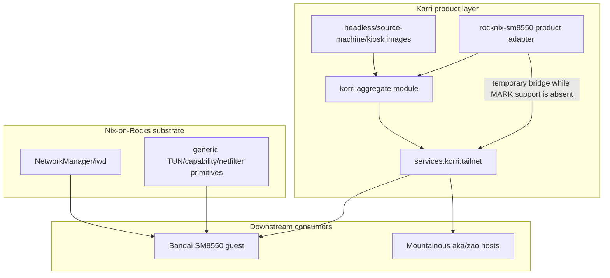
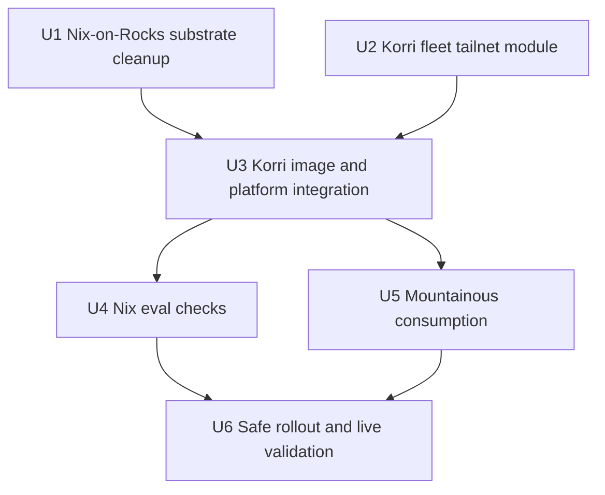

# refactor: Move tailnet policy into Korri product composition

## Summary

Move Tailscale/MagicDNS/trusted-tailnet behavior out of the Nix-on-Rocks substrate and into Korri's product-level NixOS composition so the same tailnet posture can apply across ARM and x86 Korri devices. Nix-on-Rocks should provide generic guest-OS network primitives only; Korri should decide whether and how products join the tailnet, and Mountainous should consume that product posture for personal hosts.

**Target repos:** `korri` primary, with coordinated changes in `nix-on-rocks` and `mountainous`.

---

## Problem Frame

Bandai exposed a layering problem: its Korri fabric peer URL was correct as a hostname, but Bandai's OS resolver was not accepting Tailscale DNS, so short MagicDNS names fell through to home LAN DNS. Investigation found the root policy lived in the wrong layer: Nix-on-Rocks configured `services.tailscale` with `--accept-dns=false`, even though the user wants the NixOS guest to behave as the main product OS and the ROCKNIX/Nix-on-Rocks layer to stay dumb, minimal, and Tailscale-oblivious.

Live validation proved the desired product behavior is viable: on Bandai, `accept-dns=true` made `aka` resolve to `100.117.97.45` and Korri reached Aka over Tailscale. Standard Tailscale firewall mode did not fully work yet because the current ROCKNIX kernel/module tree lacks MARK/iptables compatibility pieces; that should be treated as a substrate primitive gap, not as a permanent Bandai-specific product policy.

---

## Requirements

- R1. Nix-on-Rocks must not configure Tailscale or encode Tailscale-specific product policy in active substrate modules, checks, scripts, or contracts.
- R2. Nix-on-Rocks may provide generic guest networking primitives needed by a product OS: NetworkManager/iwd, `/dev/net/tun` availability, required service capabilities, and kernel/netfilter support when available.
- R3. Korri must own fleet tailnet policy declaratively: enable Tailscale, accept MagicDNS, use short hostnames, and trust only intended Korri ports on `tailscale0` where Korri is the product OS.
- R4. Korri's tailnet module must propagate naturally through Korri product profiles so ARM and x86 Korri devices inherit the same baseline without per-device copy-paste, while aggregate-only consumers can import the option surface without being silently reconfigured.
- R5. Bandai/SM8550 must keep remote access through the transition; deploying or locking a Nix-on-Rocks revision without Korri-owned Tailscale must be blocked until the final Korri SM8550 eval proves the replacement is present.
- R6. Any SM8550 temporary compatibility flag must be justified by the missing generic substrate primitive, protected by compensating port/firewall constraints, and tied to a concrete removal trigger once normal Linux firewall support exists.
- R7. Mountainous hosts such as Aka and Zao must advertise Korri URLs using short MagicDNS hostnames, not LAN IPs, and Korri validation must explicitly permit the chosen trusted tailnet URL shape.
- R8. Verification must prove both local resolver behavior and Korri federation behavior over Tailscale, not merely that Tailscale is running.
- R9. Tailnet reachability is an explicit access-control posture: either Tailscale ACL/tag membership is the accepted authorization boundary for this personal fleet, or Korri API endpoints must enforce application-level auth over `tailscale0`.

---

## Scope Boundaries

- Do not open Korri API ports broadly on LAN as the federation fix.
- Do not model Bandai-to-Aka as a special bilateral connection; this is a fleet-level tailnet posture.
- Do not build the future Tailscale discovery plugin in this slice. Durable peer memory and MagicDNS are sufficient for this plan.
- Do not make Nix-on-Rocks depend on Korri, Tailscale, MagicDNS, or tailnet concepts, except for an explicitly scoped negative boundary lint if the implementation chooses to keep a denylist in active substrate guardrails.
- Do not attempt to solve all ROCKNIX upstream network package composition if the package is merely present upstream; this plan targets Nix-on-Rocks-owned active policy, checks, scripts, and contracts.
- Do not hide a permanent `netfilter-mode=off` exception as product policy. If used, it must be documented as a temporary bridge for the current substrate kernel/module limitation.

### Deferred to Follow-Up Work

- **Normal firewall primitive for ROCKNIX guests:** Add or expose the missing MARK/iptables/nft compatibility support in the ROCKNIX kernel/module substrate so Bandai-like guests can eventually run standard Tailscale firewall mode. Before this implementation lands, create or link a tracking item with owner, acceptance criteria, and the removal trigger for the SM8550 `netfilter-mode=off` bridge.
- **Tailscale discovery plugin:** Later, build a Korri plugin/provider that can discover tailnet peers from local `tailscaled` state instead of relying only on mDNS plus durable peer memory.
- **Historical document cleanup:** If desired, separately update archival Nix-on-Rocks planning docs that mention Tailscale so future readers see the new boundary, without rewriting historical evidence in this implementation slice.

---

## Context & Research

### Relevant Code and Patterns

- `product/systems/nixos/flake/modules.nix` is the Korri module export/aggregate seam. The `korri` aggregate is the natural propagation point for fleet-wide Korri product posture.
- `product/systems/nixos/images/headless.nix` owns the federation-oriented daemon listener/firewall defaults for headless/library-bearing Korri hosts.
- `product/systems/nixos/images/source-machine.nix` imports `headless.nix` and is the path Mountainous Aka uses through `korri-source-machine`.
- `product/systems/nixos/images/platforms/rocknix-sm8550.nix` is Korri's adapter from neutral Nix-on-Rocks substrate facts into the SM8550 Korri product image.
- `product/systems/nixos/modules/korri-daemon.nix` owns Korri API public URL and firewall-interface option behavior.
- `tools/testing/nix/korri-source-machine-module-check.nix`, `tools/testing/nix/korri-source-machine-image-check.nix`, and `product/systems/nixos/flake/checks.nix` are existing Nix eval check patterns for product-composition invariants.
- `guest/modules/network.nix` in `nix-on-rocks` currently owns guest NetworkManager/iwd and previously owned Tailscale policy; it should become free of active Tailscale product policy.
- `nix/tests/guest-profile-contract.nix` in `nix-on-rocks` currently asserts substrate-owned Tailscale and must be updated with the cleanup.
- `scripts/check-boundary-lint` and `guest/scripts/static-checks.sh` in `nix-on-rocks` are the right active guardrails to prevent product vocabulary or Tailscale policy from returning to the substrate.
- `features/tailscale/default.nix` and `features/tailscale/nixos.nix` in `mountainous` already model personal-machine Tailscale defaults and can remain the normal-host personal infrastructure layer.
- `hosts/aka/default.nix` and `hosts/zao/default.nix` in `mountainous` currently carry Korri public API URLs and should use short MagicDNS hostnames.

### Institutional Learnings

- `docs/solutions/architecture-patterns/architectural-posture-as-nix-image-default-2026-05-27.md`: fleet-wide product posture belongs in image/profile composition, while reusable modules and substrates stay conservative.
- `docs/solutions/best-practices/product-owned-composition-keeps-shared-layers-reusable-2026-05-03.md`: product behavior decisions should not leak into shared substrate layers.
- `docs/solutions/architecture-patterns/fex-substrate-and-steam-runtime-boundary-2026-06-20.md`: substrate capability and product policy should remain separate; the same split applies to tailnet capability vs. Tailscale policy.
- `docs/solutions/architecture-patterns/boot-scoped-control-plane-with-session-scoped-runner-2026-05-19.md`: derive downstream service facts from a single option surface instead of scattering flags across consumers.
- `docs/solutions/workflow-issues/rocknix-guest-only-nix-deploy-2026-05-27.md`: the ROCKNIX host is intentionally tiny and guest-only NixOS deploys are the right mental model for product behavior.

### External References

- No external research was needed for planning. The decisive constraints came from live Bandai validation and local NixOS module contracts.

---

## Key Technical Decisions

- **Korri owns the tailnet product module:** Add or complete a `services.korri.tailnet` module and import its option surface through the Korri aggregate. Enable the behavior in explicit Korri product profiles so kiosk, source-machine, headless, ARM, and x86 compositions inherit the posture deliberately rather than by accidental aggregate import.
- **Nix-on-Rocks becomes policy-oblivious with one clear guardrail choice:** Remove active Tailscale service configuration, package requirements, assertions, and policy comments from Nix-on-Rocks substrate code. During implementation, choose either a narrow negative denylist in boundary-lint/static-check files or no Tailscale vocabulary in Nix-on-Rocks at all; do not mix both claims.
- **SM8550 compatibility is a substrate-gap bridge:** If SM8550 needs `netfilter-mode=off` and service capabilities today, express those through Korri's SM8550 product adapter with comments tying them to the missing MARK/netfilter primitive, compensating allowed-port constraints, and a tracked removal trigger, not to Bandai as a special product.
- **Tailnet-first Korri API reachability:** Korri product defaults should make the advertised/public Korri API reachable by short MagicDNS names over `tailscale0`. LAN mDNS can remain useful, but it must not be the only trusted fabric path. The chosen short-hostname HTTP URL shape must be accepted by Korri's `publicApiBaseUrl` validation only under the trusted tailnet posture.
- **Tailnet access control is explicit:** For this personal fleet, tailnet membership may be treated as sufficient reachability only if backed by Tailscale ACL/tag restrictions and narrow port exposure. If that assumption changes, Korri API auth must become part of the product posture before broad tailnet trust ships.
- **Safe cross-repo sequencing is enforced, not remembered:** Do not deploy or lock a Nix-on-Rocks guest substrate that has removed Tailscale until the Korri image that imports it also supplies Korri-owned Tailscale and the SM8550 eval proves exactly one owner. Bandai's remote access depends on that ordering.
- **Mountainous stays a consumer, not the product authority:** Mountainous can set personal-machine Tailscale preferences and host-specific Korri runtime identity, but the reusable Korri tailnet posture should come from Korri modules.

---

## Open Questions

### Resolved During Planning

- **Can Bandai accept MagicDNS from the guest?** Yes. Live `tailscale set --accept-dns=true` changed `/etc/resolv.conf` to Tailscale DNS, `aka` resolved to `100.117.97.45`, and `curl http://aka:3001/` reached the Tailscale address.
- **Can Bandai run standard Tailscale firewall mode today?** Not cleanly. `netfilter-mode=on` and `nodivert` both raised a Tailscale health warning because MARK support is missing from the current kernel/module tree.
- **Is the netfilter issue a product-policy reason to keep Nix-on-Rocks configuring Tailscale?** No. It is a missing generic substrate primitive and should be tracked as such.

### Deferred to Implementation

- **Exact shape of the Korri tailnet module options:** Implementation should choose the smallest option surface that supports the confirmed fleet behavior and SM8550 bridge without overfitting future pluginization.
- **Whether Korri API firewall defaults should be tailnet-only or tailnet-plus-LAN:** The plan leans tailnet-first for personal products, but implementation should preserve any existing LAN/mDNS tests that intentionally require LAN federation.
- **Final nix-on-rocks vocabulary purge extent:** Implementation should remove active policy and contract references; historical docs can be left unless they are read as current contract.

---

## High-Level Technical Design

> *This illustrates the intended approach and is directional guidance for review, not implementation specification. The implementing agent should treat it as context, not code to reproduce.*

---

## Implementation Units

### U1. Remove Tailscale policy from Nix-on-Rocks substrate

**Goal:** Make the Nix-on-Rocks guest substrate free of Tailscale product policy while preserving generic guest networking primitives.

**Requirements:** R1, R2, R5

**Dependencies:** None for code review; deployment depends on U2 and U3.

**Files:**
- Modify: `guest/modules/network.nix` in `nix-on-rocks`
- Modify: `nix/tests/guest-profile-contract.nix` in `nix-on-rocks`
- Modify: `scripts/check-boundary-lint` in `nix-on-rocks`
- Modify: `guest/scripts/static-checks.sh` in `nix-on-rocks`
- Test: `nix/tests/guest-profile-contract.nix` in `nix-on-rocks`
- Test: `scripts/check-boundary-lint` in `nix-on-rocks`
- Test: `guest/scripts/static-checks.sh` in `nix-on-rocks`

**Approach:**
- Remove `services.tailscale` configuration, Tailscale package installation, and Tailscale-specific service capability ownership from the guest network module.
- Keep NetworkManager/iwd, resolver ownership, and generic guest network behavior in the substrate.
- Replace tests that assert “guest substrate owns Tailscale” with assertions that the substrate remains product-blind and network-capable.
- Decide the active guardrail posture explicitly:
  - If narrow denylist guardrails are acceptable, extend boundary lint/static checks so active guest modules, profiles, and flake contracts cannot reintroduce `services.tailscale`, `--accept-dns`, hostname-derived Tailscale flags, or MagicDNS policy.
  - If Nix-on-Rocks must be fully vocabulary-oblivious, move those Tailscale-specific absence checks into Korri or cross-repo validation instead.
- Reword active checks/comments from “for guest Tailscale” to generic “for product guest VPN/TUN/network-device consumers” only where those primitives remain.

**Execution note:** Treat this as a contract refactor. Update the failing contract check in the same unit as the substrate code removal.

**Patterns to follow:**
- `scripts/check-boundary-lint` existing Korri/product vocabulary guards.
- `guest/scripts/static-checks.sh` packaged-source fallback guard style.
- `nix/tests/guest-profile-contract.nix` assertion helper style.

**Test scenarios:**
- Happy path: guest base still enables NetworkManager with iwd and keeps resolver ownership without requiring any Tailscale option.
- Happy path: guest-profile contract passes without asserting `services.tailscale.enable`.
- Edge case: if the narrow-denylist posture is chosen, boundary lint fails if any active guest module/profile reintroduces `services.tailscale`, `--accept-dns`, or hostname-derived Tailscale flags.
- Error path: if the narrow-denylist posture is chosen, packaged fallback static checks fail on the same Tailscale-policy reintroduction even when repo-level scripts are unavailable.

**Verification:**
- Nix-on-Rocks active substrate code contains no Tailscale service policy.
- Nix-on-Rocks contract checks pass with the new product-blind expectation.
- The change is not deployed to Bandai until U2/U3 are ready in Korri.

### U2. Add Korri-owned fleet tailnet module

**Goal:** Introduce the Korri product option surface that owns tailnet behavior across the fleet.

**Requirements:** R3, R4, R6

**Dependencies:** None

**Files:**
- Create: `product/systems/nixos/modules/korri-tailnet.nix`
- Modify: `product/systems/nixos/flake/modules.nix`
- Test: `tools/testing/nix/korri-tailnet-module-check.nix`

**Approach:**
- Define `services.korri.tailnet` as the product-owned Tailscale posture module.
- Define the stable fleet posture: enable Tailscale, accept DNS/MagicDNS, derive hostname from `config.networking.hostName`, and trust the intended Korri API/service ports on `tailscale0` where the NixOS firewall is active.
- Keep normal-host behavior standard: do not set `netfilter-mode=off` globally.
- Do not generalize the temporary SM8550 workaround into a reusable “constrained guest” option unless a second current constrained guest needs the same seam; prefer putting the bridge in `rocknix-sm8550.nix` with removal comments and checks.
- Export the module option surface through the `korri` aggregate, but enable behavior in explicit product profiles. Add an enablement matrix covering headless, source-machine, kiosk, SM8550, live/local development images, and aggregate-only consumers.

**Execution note:** Add the module check before wiring product-profile enablement so the option contract is explicit before it becomes fleet-wide.

**Patterns to follow:**
- `product/systems/nixos/modules/korri-runtime.nix` for reusable Korri option module shape.
- `product/systems/nixos/modules/korri-game-stream.nix` for environment/option derivation with clear defaults.
- `product/systems/nixos/flake/modules.nix` aggregate import pattern and duplicate-import expectations.

**Test scenarios:**
- Happy path: enabling an explicit Korri product profile enables Tailscale through `services.korri.tailnet`.
- Happy path: default product-profile flags include `accept-dns=true` and a hostname derived from the NixOS hostname.
- Happy path: tailnet firewall posture exposes only intended Korri ports/services on `tailscale0`.
- Edge case: aggregate-only import exposes options but does not silently enable Tailscale when no product profile opts in.
- Edge case: disabling `services.korri.tailnet.enable` suppresses Tailscale service configuration without disabling unrelated Korri modules.
- Error path: conflicting or empty hostname configuration is either rejected or produces a safe no-hostname flag outcome.

**Verification:**
- The module evaluates standalone and through the Korri aggregate.
- Normal x86/source-machine composition inherits the enabled product posture without SM8550 compatibility flags, while aggregate-only consumers remain inert until a profile opts in.

### U3. Wire Korri images and SM8550 adapter to the tailnet model

**Goal:** Make Korri product images consume the fleet tailnet module while preserving Bandai remote access and documenting the temporary SM8550 netfilter bridge.

**Requirements:** R3, R4, R5, R6, R8

**Dependencies:** U1, U2

**Files:**
- Modify: `product/systems/nixos/images/headless.nix`
- Modify: `product/systems/nixos/images/platforms/rocknix-sm8550.nix`
- Modify: `flake.lock`
- Test: `tools/testing/nix/korri-source-machine-module-check.nix`
- Test: `tools/testing/nix/korri-source-machine-image-check.nix`
- Test: `tools/testing/nix/korri-tailnet-module-check.nix`

**Approach:**
- Update Korri's `nix-on-rocks` input to the revision that completed U1 so the SM8550 product image does not inherit conflicting substrate-owned Tailscale flags.
- Make headless/source-machine Korri API reachability tailnet-first by default while preserving any intentionally tested LAN/mDNS behavior.
- Update `services.korri.daemon.publicApiBaseUrl` validation so the chosen short-hostname HTTP URL shape is accepted only when the trusted tailnet posture is enabled, or deliberately choose a URL shape the current validator already accepts and update R7/U5 accordingly.
- In the SM8550 platform adapter, set only the compatibility pieces proven necessary by live validation: service capabilities for `tailscaled` if the guest still needs them, and `netfilter-mode=off` while MARK/netfilter support is absent.
- Add compensating SM8550 constraints while `netfilter-mode=off` exists: expose only intended Korri services/ports on `tailscale0`, keep subnet routing and exit-node advertisement disabled unless separately reviewed, and assert the constrained-guest profile does not broaden LAN exposure.
- Keep the compatibility comment explicit: the setting exists because the current substrate lacks normal Linux firewall primitives, not because Bandai has different tailnet policy.
- Ensure the final evaluated SM8550 image has one coherent Tailscale owner: Korri.

**Patterns to follow:**
- `product/systems/nixos/images/platforms/rocknix-sm8550.nix` existing comments that distinguish substrate facts from Korri-owned product policy.
- `product/systems/nixos/images/headless.nix` federation baseline defaults.
- `product/systems/nixos/flake/sources.nix` and current flake input locking pattern.

**Test scenarios:**
- Happy path: source-machine/headless composition advertises a short hostname URL and opens/trusts the tailnet path.
- Happy path: `publicApiBaseUrl` evaluation accepts `http://aka:<port>` / `http://zao:<port>` only under the trusted tailnet posture, or the plan's chosen alternate URL shape is checked instead.
- Happy path: SM8550 evaluated config has Tailscale enabled by Korri with `accept-dns=true`.
- Happy path: SM8550 evaluated config includes the temporary netfilter bridge, required service capabilities, intended tailnet port exposure, and disabled subnet/exit-node advertisement.
- Edge case: normal x86/source-machine evaluated config does not inherit SM8550-only `netfilter-mode=off`.
- Error path: old Nix-on-Rocks substrate Tailscale flags do not merge into the final Korri SM8550 config after the lock update.

**Verification:**
- Korri image evaluation shows one product-owned tailnet configuration path.
- The SM8550 bridge is visibly documented as temporary, tied to the missing substrate primitive, and constrained to intended tailnet exposure.

### U4. Add regression checks for tailnet ownership and propagation

**Goal:** Prevent future drift back to substrate-owned Tailscale or per-device copy-paste.

**Requirements:** R1, R3, R4, R6, R8

**Dependencies:** U1, U2, U3

**Files:**
- Modify: `tools/testing/nix/korri-tailnet-module-check.nix`
- Modify: `product/systems/nixos/flake/checks.nix`
- Modify: `tools/testing/nix/korri-source-machine-module-check.nix`
- Modify: `tools/testing/nix/korri-source-machine-image-check.nix`
- Test: `tools/testing/nix/korri-tailnet-module-check.nix`
- Test: `tools/testing/nix/korri-source-machine-module-check.nix`
- Test: `tools/testing/nix/korri-source-machine-image-check.nix`

**Approach:**
- Register and extend the focused module check for `services.korri.tailnet` option behavior created in U2.
- Add or extend source-machine checks so Aka-like hosts inherit the tailnet posture through Korri product-profile enablement rather than manually copying flags.
- Add daemon URL-validation checks for the chosen short-hostname tailnet URL shape.
- Add SM8550-specific assertions that verify the temporary bridge and compensating exposure constraints are present only for the constrained guest product adapter.
- Keep checks at Nix evaluation level; live device proof belongs in U6.

**Patterns to follow:**
- Existing `tools/testing/nix/*-module-check.nix` assertion helpers.
- `product/systems/nixos/flake/checks.nix` naming and check registration conventions.

**Test scenarios:**
- Happy path: `korri-tailnet-module` check passes for the default fleet posture.
- Happy path: aggregate import check proves `korri` exposes `korri-tailnet` options without requiring aggregate-only consumers to enable behavior.
- Happy path: source-machine check proves tailnet posture through product-profile enablement without per-host overrides.
- Happy path: daemon URL-validation check proves short tailnet HTTP hostnames evaluate only under the trusted tailnet posture, or that the chosen alternate URL shape evaluates.
- Edge case: disabling tailnet in a synthetic config removes Tailscale service configuration.
- Edge case: SM8550 constrained-guest bridge is present in the SM8550 product eval and absent from a normal x86 eval.
- Error path: check fails if a future edit drops `accept-dns=true` from Korri's tailnet posture.

**Verification:**
- The new checks fail before the intended module/profile wiring and pass after it.
- Check names make the ownership boundary and SM8550 exception obvious in CI output.

### U5. Align Mountainous consumption with Korri-owned tailnet posture

**Goal:** Keep personal normal-host configuration consistent with the new Korri product boundary while removing LAN-IP assumptions.

**Requirements:** R3, R7, R8

**Dependencies:** U2, U3

**Files:**
- Modify only if evaluation proves a concrete conflict: `features/tailscale/default.nix` in `mountainous`
- Modify only if evaluation proves a concrete conflict: `features/tailscale/nixos.nix` in `mountainous`
- Modify: `hosts/aka/default.nix` in `mountainous`
- Modify: `hosts/zao/default.nix` in `mountainous`
- Modify: `flake.lock` in `mountainous`
- Test: host evaluation for `aka` in `mountainous`
- Test: host evaluation for `zao` in `mountainous`

**Approach:**
- Keep Mountainous' personal-host Tailscale feature accepting DNS by default for machines that use Mountainous directly; avoid touching feature defaults unless host evaluation proves a concrete conflict or missing behavior.
- Change Korri public API URLs on Aka/Zao to short hostnames so MagicDNS can choose the tailnet address, after Korri's URL validator and checks explicitly accept the chosen trusted tailnet URL shape.
- Re-lock Mountainous to a Korri revision that includes U2/U3, avoiding a long-lived local-only lock when a shared commit is expected.
- Remove or reduce host-local Korri firewall/Tailscale duplication only after Korri's product defaults cover the same behavior.
- Verify existing server-preset netfilter settings do not conflict with the desired normal-host path.

**Patterns to follow:**
- `features/tailscale/default.nix` option style in Mountainous.
- `presets/core/nixos.nix` existing `tailscale0` trusted-interface posture.
- `hosts/aka/default.nix` and `hosts/zao/default.nix` Korri runtime/daemon configuration style.

**Test scenarios:**
- Happy path: Aka evaluates with Korri public API base URL `http://aka:<port>`.
- Happy path: Zao evaluates with Korri public API base URL `http://zao:<port>`.
- Happy path: Mountainous Tailscale feature applies `accept-dns=true` for normal personal hosts.
- Edge case: duplicate `accept-dns=true` from Mountainous and Korri product modules remains idempotent or is deduplicated by implementation.
- Edge case: if `features/tailscale/*` does not conflict, those files remain untouched.
- Error path: no host config reintroduces a hard-coded LAN IP for Korri public API base URL.

**Verification:**
- Aka and Zao NixOS evaluations show short-hostname public URLs and tailnet-trusting posture.
- Mountainous no longer acts as the only place where Korri tailnet behavior is modeled.

### U6. Roll out safely and verify live tailnet federation

**Goal:** Validate the architecture on real devices without stranding Bandai or regressing Aka/Zao source-machine behavior.

**Requirements:** R5, R8

**Dependencies:** U1, U2, U3, U4, U5

**Files:**
- Test: `tools/testing/nix/korri-tailnet-module-check.nix`
- Test: `tools/testing/nix/korri-source-machine-module-check.nix`
- Test: `nix/tests/guest-profile-contract.nix` in `nix-on-rocks`
- Test: `hosts/aka/default.nix` in `mountainous`
- Test: `hosts/zao/default.nix` in `mountainous`

**Approach:**
- Deploy in dependency order with an enforceable preflight: Nix-on-Rocks cleanup can be committed first, but Korri must not update its lock or deploy Bandai until Korri has the tailnet module, profile enablement, SM8550 bridge, and final SM8550 eval proving exactly one Tailscale owner.
- Before switching Bandai, record a rollback generation and confirm LAN SSH fallback because Tailscale is the path under change.
- Verify declarative state replaces the live imperative Bandai state: authenticated `tailscale status --json` on the expected tailnet, `accept-dns=true`, self DNS name present, short MagicDNS names resolve to Tailscale IPs, and DNS health is clean.
- Split Tailscale health gates: DNS/MagicDNS health must be clean; router/firewall warnings may be accepted only when they exactly match the documented deferred MARK/netfilter gap and the SM8550 compensating port constraints are present.
- Verify Korri federation behavior, not just networking: Bandai should fetch Aka's catalog over the Tailscale address and include Aka-sourced entries in fabric scope.
- Verify Aka remains a source-machine stream host and still advertises a short hostname URL.

**Execution note:** Use live validation as a post-build proof, not as a substitute for Nix eval checks. Characterize current live state before switching and compare after switching.

**Patterns to follow:**
- Prior Aka source-machine live validation posture from `work/items/active/01KWF99H29Q52N3BSD8RP0X45V-aka-headless-stream-host/plan.md`.
- Korri `korrid` RPC smoke-check style used by `packages/pi-korrid-tools/skills/korrid-tools/SKILL.md`.

**Test scenarios:**
- Happy path: on Bandai, `aka` resolves to `100.117.97.45` or the current Aka Tailscale IP, not `192.168.1.117`.
- Happy path: from Bandai, `http://aka:3001` reaches Aka over the Tailscale remote address.
- Happy path: Korri fabric catalog on Bandai includes Aka-sourced games after the change.
- Happy path: Bandai `tailscale status --json` confirms authenticated state, expected tailnet, self DNS name, and no DNS health warning after declarative switch.
- Edge case: off-LAN or LAN-DNS-conflicting environment still resolves short names through MagicDNS because Tailscale owns resolver config.
- Edge case: any router/firewall health warning is accepted only if it matches the deferred MARK/netfilter primitive gap and the constrained SM8550 exposure checks pass.
- Error path: if Bandai loses Tailscale after switch, rollback path uses LAN SSH and a previous working guest generation rather than requiring physical intervention.

**Verification:**
- Nix eval checks pass in each repo before live rollout:
  - Korri: `nix build .#checks.x86_64-linux.korri-tailnet-module .#checks.x86_64-linux.korri-source-machine-module .#checks.x86_64-linux.korri-source-machine-image .#checks.x86_64-linux.korri-sm8550-kiosk-config --no-link`
  - Nix-on-Rocks: guest-profile contract plus boundary/static checks from U1.
  - Mountainous: Aka and Zao host evaluations after the Korri lock update.
- Bandai live state matches the previously proven imperative state, but is now declarative and authenticated to the expected tailnet.
- Aka/Bandai federation works over Tailscale, and no LAN firewall opening is required.

---

## System-Wide Impact

- **Interaction graph:** Korri's NixOS aggregate becomes the source of tailnet behavior for product images; Nix-on-Rocks provides generic network substrate; Mountainous consumes Korri modules and may still set personal-host Tailscale defaults.
- **Error propagation:** Resolver or Tailscale service failures should surface as service health/eval failures and live verification failures, not as silent catalog federation timeouts.
- **State lifecycle risks:** Bandai already has live imperative Tailscale state. Declarative rollout must converge without requiring logout/re-auth or deleting `/var/lib/tailscale` state; fresh enrollment remains out of scope for this slice and must fail visibly.
- **Access-control posture:** Tailnet reachability is trusted only for the intended personal fleet boundary and only with narrow Korri port exposure; broader API authorization requires a separate decision.
- **API surface parity:** Korri public API base URLs should use short hostnames consistently across source-machine and portable devices so peer memory remains useful on and off LAN, and URL validation must recognize that shape under the tailnet posture.
- **Integration coverage:** Unit/eval checks prove configuration shape; live checks prove authenticated Tailscale state, resolver behavior, Tailscale health, and Korri fabric fetch.
- **Unchanged invariants:** Nix-on-Rocks remains product-blind and must not import Korri; Korri app-native YAML/config graph is not changed by this plan.

---

## Risks & Dependencies

| Risk | Mitigation |
|------|------------|
| Bandai loses remote access if Nix-on-Rocks removes Tailscale before Korri supplies it | Gate Korri's lock/deploy on a final SM8550 eval proving one Tailscale owner with `accept-dns=true`; record rollback generation and keep LAN SSH fallback during rollout. |
| `netfilter-mode=off` becomes a forgotten permanent exception | Document it in `rocknix-sm8550.nix` as a temporary substrate-gap bridge, constrain exposed tailnet ports while it exists, and create/link a deferred follow-up with removal trigger for MARK/netfilter support. |
| Tailnet membership is accidentally treated as broad API authorization | Document the personal-fleet ACL/tag assumption and expose only intended Korri ports on `tailscale0`; require a separate auth decision before broadening beyond that trust boundary. |
| Tailnet behavior is duplicated between Korri and Mountainous | Let Korri own product posture; keep Mountainous personal-host Tailscale defaults only where they apply outside Korri product composition. |
| LAN mDNS expectations regress | Preserve or explicitly test any existing LAN federation defaults that should remain; tailnet reachability should add a trusted path, not accidentally delete required LAN behavior. |
| Short hostname URLs fail Korri validation or fall through to LAN DNS | Update daemon URL validation and live gates so trusted short hostnames evaluate and resolve to Tailscale addresses before they are accepted as Korri peer URLs. |
| Nix-on-Rocks vocabulary purge breaks historical tests or docs | Scope U1 to active contracts/checks/scripts first; if narrow denylist guardrails are kept, name that exception explicitly. Defer broad historical cleanup unless those docs are treated as current contract. |
| Conflicting Tailscale flags merge from old substrate and new Korri module | Update Korri's `nix-on-rocks` lock to a substrate revision without Tailscale policy in the same Korri integration unit and assert the final evaluated owner. |

---

## Dependencies / Prerequisites

- A Nix-on-Rocks commit/revision that removes substrate-owned Tailscale policy and updates its contract checks.
- A Korri commit that imports the tailnet module option surface, enables it in the intended product profiles, and locks the compatible Nix-on-Rocks revision.
- LAN SSH fallback to Bandai during live rollout because Tailscale is the system under change.
- Current Tailscale node auth state preserved on devices; this plan is scoped to already-enrolled nodes and does not include re-enrollment. Live validation must assert authenticated state and expected tailnet identity.

---

## Documentation / Operational Notes

- Add comments where the boundary is non-obvious: Korri owns Tailscale policy; Nix-on-Rocks owns generic guest network primitives.
- In SM8550 comments, explicitly tie `netfilter-mode=off` to the live-observed missing MARK/netfilter support, the compensating port constraints, and the follow-up removal trigger so future work knows what to remove.
- Create or link a follow-up issue/backlog item for normal firewall primitives before landing the bridge; include the observed missing modules: `xt_mark`, `xt_MARK`, `nft_compat`, `x_tables`, `iptable_filter`, and `iptable_nat`.
- Live validation should record authenticated Tailscale state, resolver proof, and Korri fabric catalog proof.

---

## Alternative Approaches Considered

- **Keep Tailscale in Nix-on-Rocks and flip `accept-dns=true`:** Rejected because it preserves the layering violation and keeps product policy in the substrate.
- **Open Korri API on LAN instead of using MagicDNS:** Rejected because the user wants the personal tailnet fully trusted and usable away from home.
- **Hard-code Tailscale IPs in peer memory or `/etc/hosts`:** Rejected because MagicDNS and durable peer memory already support hostname-based reachability, and hard-coded IPs would be a point-to-point workaround.
- **Set `netfilter-mode=off` globally for all Korri devices:** Rejected because normal hosts should use standard Tailscale behavior; the workaround belongs only where the substrate currently lacks required firewall primitives.

---

## Sources & References

- Related plan: `work/items/active/01KWF99H29Q52N3BSD8RP0X45V-aka-headless-stream-host/plan.md`
- Korri module aggregate: `product/systems/nixos/flake/modules.nix`
- Korri headless/source-machine defaults: `product/systems/nixos/images/headless.nix`, `product/systems/nixos/images/source-machine.nix`
- Korri SM8550 adapter: `product/systems/nixos/images/platforms/rocknix-sm8550.nix`
- Korri checks: `tools/testing/nix/korri-source-machine-module-check.nix`, `tools/testing/nix/korri-source-machine-image-check.nix`
- Nix-on-Rocks guest network substrate: `guest/modules/network.nix`
- Nix-on-Rocks guest profile contract: `nix/tests/guest-profile-contract.nix`
- Mountainous tailnet defaults and host configs: `features/tailscale/default.nix`, `features/tailscale/nixos.nix`, `hosts/aka/default.nix`, `hosts/zao/default.nix`
