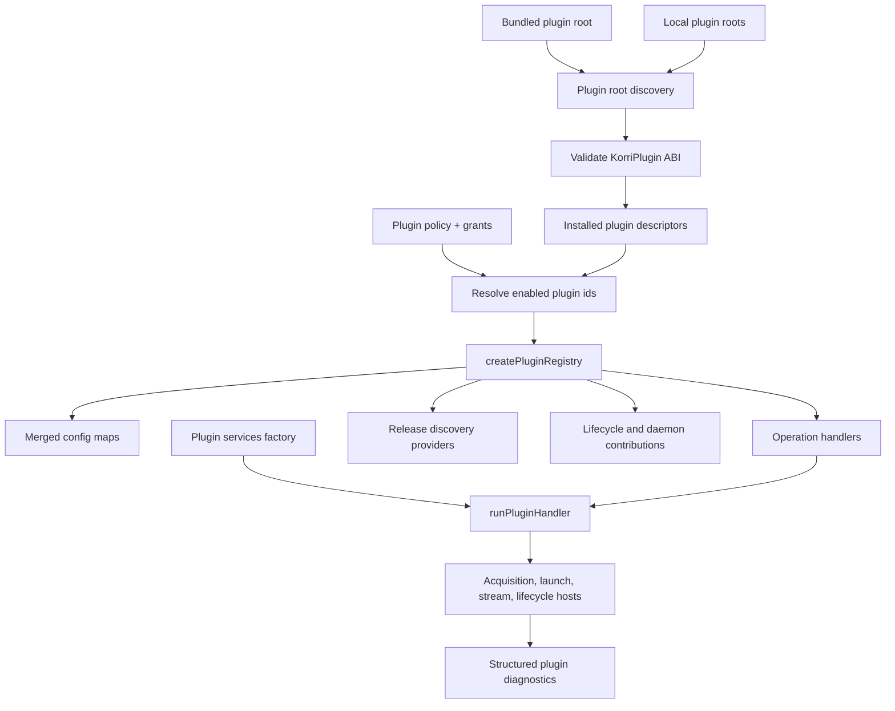

# refactor: Evolve Korri plugin API into one ecosystem ABI

## Summary

Evolve the existing `plugin({ contributes: { config, handlers } })` API into Korri's single plugin ecosystem ABI. The plan preserves the descriptor vocabulary already in the repo, adds dependency-injected handler services through `context.services`, introduces root-based discovery and policy/grants, and demotes `KORRI_ENABLED_PLUGINS` from the control plane to a temporary compatibility/testing layer.

---

## Problem Frame

Korri already has a strong plugin descriptor shape, but it is still consumed like an internal first-party extension registry: plugin modules are statically imported, enablement is env-var driven, handler context is too thin for common plugin work, and local/operator-installed plugins cannot participate without becoming a special case. The user clarified that this should not become a separate drop-in or legacy path; it should be the plugin system Korri intended to have.

The origin requirements intentionally scoped Phase 1 to first-party in-repo plugins. This plan carries forward the successful vocabulary from that work while superseding the old Phase 1 distribution boundary: bundled, local, and future third-party plugins should implement the same ABI.

---

## Requirements

- R1. Preserve current plugin authoring nomenclature: `plugin(...)`, `namespace`, `name`, computed `id`, `requires`, `contributes.config`, `contributes.handlers`, handler `operation`, and `run(context)`.
- R2. Treat bundled first-party plugins, local operator-installed plugins, and future third-party plugins as the same plugin ABI; source location is distribution metadata, not plugin type.
- R3. Add dependency injection by enriching `PluginOperationContext` with `context.services`, not by replacing the one-argument handler shape.
- R4. Provide the common 80% plugin tooling through injected services, starting with the services needed by the PICO-8/acquisition proof and expanding each service group only with a current plugin consumer and tests.
- R5. Add runtime plugin discovery from configured roots and feed discovered descriptors into the existing `PluginRegistry` model.
- R6. Replace env-var-centric enablement with plugin policy/grants as the authoritative control plane.
- R7. Keep capability grants explicit and separate from trust tier; first-party does not mean unrestricted.
- R8. Keep generic Korri engine code free of plugin-specific names, domains, scraping rules, and gray-area provider logic.
- R9. Preserve provider-id keyed composition patterns such as `launch.with."@korri:gamescope"` and structured missing-provider diagnostics.
- R10. Migrate first-party composition toward discovery/policy without regressing existing enabled-plugin behavior, acquisition search, catalog contributions, lifecycle hooks, daemons, and package exposure.
- R11. Validate the new ecosystem API with a real existing plugin before rewriting external local plugin files.

**Origin actors:** A1 Integration author, A2 Planner/implementer, A3 Image/profile composer, A4 Player/operator.
**Origin flows:** F1 static config contributions, F2 host-invoked handlers, F3 requirement/capability validation.
**Origin acceptance examples:** AE1-AE5 remain relevant for config contributions, handler invocation, requirement diagnostics, Effect/plain Promise normalization, and catalog vocabulary.

---

## Scope Boundaries

- Do not add a legacy Bazzar adapter or compatibility shim.
- Do not hardcode local gray-area plugin names, domains, provider ids, or platform mappings in Korri.
- Do not import local/operator plugin bytes into the repo or product image.
- Do not replace the existing descriptor vocabulary with a new `setup(ctx)`-style API.
- Do not require plugin authors to use Effect services directly for common tooling in this slice.
- Do not implement a marketplace, remote package download, plugin update lifecycle, or signature infrastructure in this slice.
- Do not claim sandbox-grade enforcement for in-process local plugin code. In this slice, grants gate Korri-provided services; untrusted plugin execution isolation is deferred unless implementation chooses a subprocess runner before enabling untrusted local roots.
- Do not make local plugins participate in Nix system composition; local plugin binary dependencies should use runtime/staged-path-style fulfillment unless a later plan defines local Nix support.
- Do not migrate every first-party plugin in one pass; use a representative plugin to prove the path, then leave broad migration as phased follow-up.
- Do not keep `KORRI_ENABLED_PLUGINS` as a parallel long-term source of truth once policy/grants are active.

### Deferred to Follow-Up Work

- Marketplace/install/update UX and remote distribution.
- Signature verification and richer provenance attestations beyond local root trust/policy.
- Sandboxed subprocess execution or WASM isolation for untrusted local plugins; until then, local roots are trusted operator/developer code and grants only gate host-provided services.
- Full migration of every first-party plugin after the ABI and discovery path are validated.
- Rewriting the external local plugin files against the new ABI outside the repo.

---

## Context & Research

### Relevant Code and Patterns

- `product/platform/plugin/index.ts` already defines `plugin(...)`, `ProviderId`, `PluginId`, `PluginOperationContext`, `PluginHandler`, `PluginResult`, `KorriPlugin`, `runPluginHandler`, and config contribution maps.
- `product/platform/plugin/registry.ts` already provides `createPluginRegistry`, `enabledPlugins`, merged config maps, `handlers`, `discoveryProviders`, requirement expansion, duplicate plugin detection, and `parseEnabledPluginIds`.
- `product/plugin-host/index.ts` is the current first-party composition source: it statically imports all plugin folders, exposes `firstPartyPlugins`, uses `KORRI_ENABLED_PLUGINS`, and separately wires lifecycle hooks and daemon factories.
- `product/platform/acquisition/product-plugin-adapter.ts` is the reference bridge from generic plugin handlers to a typed host subsystem. It maps `claims.search`, `claims.details`, `claims.parse-url`, `provider.validate`, `artifact.resolve-download`, and `artifact.acquire`.
- `product/platform/acquisition/plugin-runtime.ts` has a smaller acquisition-specific context (`clock`, `logger`, `env`) that should be folded into the general plugin services model rather than recreated per adapter.
- `product/plugins/pico8/src/plugin.ts` is a good validation target because it exercises config contributions, discovery providers, acquisition handlers, network fetches, HTML parsing, claim/detail/download resolution, and runtime requirements.
- `product/plugins/itchio/index.ts` currently adapts an older acquisition definition by creating its own acquisition context inside handler bodies. This is a smell the injected services model should remove.
- `product/plugins/AGENTS.md` is the current plugin authoring guide and should be updated after the ABI change.
- `product/platform/library/config/inheritable-fields.ts` and `product/platform/library/config/cascade-resolver.ts` already carry `PluginPolicyMap` and provider-keyed plugin policy folding; this is the closest existing seam for policy/grants.

### Institutional Learnings

- `docs/solutions/architecture-patterns/korri-plugin-architecture-2026-06-02.md`: plugins contribute data/actions through host seams, user plugins live outside the Nix closure, capability grants are explicit and separate from trust tier, and no plugin receives unconditional startup hooks.
- `docs/solutions/architecture-patterns/gamescope-as-plugin-owned-composition-2026-06-17.md`: generic Korri code must not name specific plugins; provider-keyed composition and structured missing-provider diagnostics are the model to generalize.
- `docs/solutions/design-patterns/explicit-cascade-folded-policy-over-incidental-signal-heuristics-2026-05-27.md`: replace env/argv side channels with explicit cascade-folded policy fields and delete the old heuristic once the field works.
- `docs/solutions/architecture-patterns/korri-product-platform-theme-architecture-2026-06-03.md`: platform exposes capabilities; plugin code imports platform contracts; platform must not import product plugin implementations.
- `docs/solutions/architecture-patterns/architectural-posture-as-nix-image-default-2026-05-27.md`: enabled-by-default posture belongs in image/product composition, not conservative NixOS module defaults.

### External References

- External research skipped. This is an internal architecture evolution with strong repo-local patterns and prior Korri architecture decisions.

---

## Key Technical Decisions

- **Evolve, do not replace, the API.** The canonical authoring shape remains `plugin({ namespace, name, requires, contributes: { config, handlers, discovery } })`.
- **Use `context.services` for dependency injection.** The user selected this as the default. It preserves `run(context)` while giving plugins the common toolbelt without requiring Effect-layer literacy.
- **Make discovery a source of plugin descriptors, not a new registry.** Root discovery returns `KorriPlugin` descriptors, then the existing `createPluginRegistry` remains responsible for duplicate ids, requirement expansion, merged config maps, handlers, and discovery providers.
- **Separate installed, trusted, granted, and enabled.** Installed means discovered; trust is source/provenance; grants authorize capabilities; enabled means the plugin contributes active records/handlers after policy resolution.
- **Policy/grants replace env-var enablement.** `KORRI_ENABLED_PLUGINS` may remain only as a short-lived test/dev translation into policy before registry construction; it must not remain a deploy/runtime override or parallel authority.
- **Policy folds through existing provider-keyed config.** Use the existing `PluginPolicyMap`/cascade direction as the planning anchor rather than inventing another env file model.
- **Load all discovered descriptors before resolving requirements.** Discovery must be two-phase so `requires` closure does not silently skip a dependency that appears later in another root.
- **Plugin root order is deterministic and collisions fail closed.** Bundled plugin roots and local plugin roots are ordered, but duplicate plugin ids still fail registry construction instead of shadowing silently.
- **Load failure policy is explicit.** Bundled plugin root failures block startup/build; local trusted-root plugin failures skip that plugin with diagnostics; duplicate ids, reserved namespace misuse, and unsafe roots always fail closed.
- **Local plugin namespaces are not `@korri`.** Reserve `@korri` for product-owned bundled plugins; local plugins use operator/plugin-owned namespaces such as `@local` or a configured namespace.
- **Nix parity is not part of local plugin ABI in this slice.** Bundled plugins may keep Nix composition; local plugins use runtime/staged-path-style resources until a later plan defines local Nix composition.
- **Lifecycle hooks and daemons need to move into contributions.** A unified ABI is incomplete if Steam/Gamescope-class behavior remains in parallel hardcoded arrays.
- **Representative migration first.** Use PICO-8 as the proof plugin before broad migration because it validates the network/search/details/download/context-services path that external catalog providers will need.
- **Bundled discovery must stay build-reachable.** Replacing hand-maintained static imports uses a generated read-only bundled-plugin manifest/import module with static imports, so `just build-api` and Nix outputs still include plugin modules while humans stop maintaining the list by hand.

---

## Open Questions

### Resolved During Planning

- Dependency injection shape: use `context.services` on the existing `PluginOperationContext`, preserving `run(context)`.
- New API shape: preserve existing Korri plugin nomenclature rather than introducing `defineKorriPlugin({ setup(ctx) })`.
- Legacy support: explicitly excluded; no Bazzar legacy adapter or backwards-compatible shape.
- Drop-in vs normal plugins: explicitly excluded as a distinction; source location differs, ABI does not.
- Whether `KORRI_ENABLED_PLUGINS` remains core: no; it becomes temporary compatibility/testing only.

### Deferred to Implementation

- Exact file format and merge precedence for persisted runtime grants once config-cascade integration begins.
- Exact implementation of untrusted local plugin isolation. Until that lands, local dynamic imports are treated as trusted operator/developer code and grants enforce only access to Korri-provided services, not ambient JavaScript globals.
- Exact names of newly exported service helper types and operation constants.
- Whether duplicate operation handlers should fail by `(operation, capability)` or stay caller-specific for fan-out operations; implementation should start with diagnostics and avoid silent first-match surprises.

---

## Output Structure

    product/platform/plugin/
      index.ts
      registry.ts
      registry.test.ts
      services.ts
      services.test.ts
      discovery-loader.ts
      discovery-loader.test.ts
      policy.ts
      policy.test.ts
      diagnostics.ts
      diagnostics.test.ts

    product/plugin-host/
      index.ts
      index.test.ts
      policy.ts
      policy.test.ts
      roots.ts
      roots.test.ts

    product/plugins/pico8/
      src/plugin.ts
      src/plugin.test.ts

    product/plugins/
      AGENTS.md

This tree is directional. If the active catalog split lands first and moves host wiring to `product/services/server/plugins/`, use that path for host composition files while keeping platform contracts in `product/platform/plugin/` and plugin descriptors in `product/plugins/<plugin>/`.

---

## High-Level Technical Design

> *This illustrates the intended approach and is directional guidance for review, not implementation specification. The implementing agent should treat it as context, not code to reproduce.*

The important architectural line: discovery and policy produce the descriptor set, `PluginRegistry` remains the generic aggregation engine, and host adapters invoke handlers with a shared `context.services` toolbelt.

---

## Implementation Units

### U1. Formalize the public plugin API surface and injected services contract

**Goal:** Preserve the current descriptor shape while making the plugin API stable enough for bundled and local modules to author against.

**Requirements:** R1, R2, R3, R4, R8

**Dependencies:** None

**Files:**
- Modify: `product/platform/plugin/index.ts`
- Create: `product/platform/plugin/services.ts`
- Create: `product/platform/plugin/services.test.ts`
- Modify: `product/platform/plugin/registry.test.ts`
- Modify: `product/plugins/AGENTS.md`

**Approach:**
- Add `services` to `PluginOperationContext` as the dependency-injection seam.
- Define a minimal initial `PluginServices` contract for the PICO-8/acquisition proof: HTTP, cache, HTML parsing, URL helpers, stable IDs, time/logging, claim/download builders, and limits. Add credentials and broader platform helpers only with a current plugin consumer and tests.
- Keep `PluginResult` compatible with plain values, Promise-like values, and Effect values that do not require plugin authors to provide Effect layers.
- Export operation constants or typed aliases for operations already used in practice, including acquisition operations, while preserving extensibility for future operations.
- Document the canonical module export expectation: a loadable plugin module exports a `KorriPlugin` descriptor created by `plugin(...)`.

**Execution note:** Start with characterization coverage for existing handler invocation so adding `context.services` does not break current plugins.

**Patterns to follow:**
- `product/platform/plugin/index.ts`
- `product/platform/plugin/registry.test.ts`
- `product/plugins/AGENTS.md`

**Test scenarios:**
- Happy path: an existing handler that ignores `context.services` still runs unchanged.
- Happy path: a handler can read a fake injected service from `context.services` and return a plain value.
- Happy path: a handler can read `context.services` and return a Promise-like value.
- Happy path: a handler can read `context.services` and return an Effect value already compatible with `runPluginHandler`.
- Edge case: absent optional services fail with a clear plugin-operation diagnostic rather than an undefined-property crash when using a helper accessor.
- Type/contract: `claims.search`, `claims.details`, `provider.validate`, `artifact.resolve-download`, and `artifact.acquire` are represented as first-class operation constants or typed strings.

**Verification:**
- Existing plugin registry tests still pass.
- New service-context tests prove `run(context)` remains the handler shape.

---

### U2. Add plugin root discovery and ABI validation

**Goal:** Discover installed plugin descriptors from roots, validate them, and feed them into the existing registry without creating a second plugin model.

**Requirements:** R2, R5, R8, R11

**Dependencies:** U1

**Files:**
- Create: `product/platform/plugin/discovery-loader.ts`
- Create: `product/platform/plugin/discovery-loader.test.ts`
- Create: `product/platform/plugin/diagnostics.ts`
- Create: `product/platform/plugin/diagnostics.test.ts`
- Modify: `product/platform/plugin/registry.ts`
- Modify: `product/platform/plugin/registry.test.ts`

**Approach:**
- Define plugin roots as configured filesystem locations containing loadable plugin modules.
- Validate discovered modules structurally before registry construction: plugin id shape, namespace rules, title/name, config maps, handlers, discovery providers, requirements, and contribution ids.
- Load all descriptors first, then resolve requirements through `createPluginRegistry` in a second phase.
- Make discovery deterministic: ordered roots, stable sort within each root, stable diagnostics output.
- Fail closed on duplicate plugin ids and invalid `@korri` use by local roots.
- Apply the explicit load-failure policy: bundled plugin root failures block startup/build; trusted local plugin module failures skip that plugin with diagnostics; duplicate ids, reserved namespace misuse, and unsafe roots always fail closed.
- Canonicalize plugin roots, reject symlink escapes/path traversal, restrict loadable entrypoints/extensions, and require safe owner/mode for daemon/kiosk mode unless an explicit dev-mode policy allows relaxed checks.

**Patterns to follow:**
- `product/platform/plugin/registry.ts`
- `product/platform/plugin/discovery.ts`
- `product/platform/acquisition/plugin-loader.ts` for small loader-style seams

**Test scenarios:**
- Happy path: a root with a valid default plugin export produces one installed descriptor.
- Happy path: multiple roots are loaded in deterministic order before dependency expansion.
- Edge case: a malformed local module produces a load diagnostic and is not registered; a malformed bundled module blocks startup/build.
- Edge case: duplicate plugin ids fail closed with the existing `DuplicatePluginId` shape or a richer source-aware equivalent.
- Edge case: a local plugin root module using `@korri:*` is rejected before it can shadow bundled plugins.
- Error path: symlink escape, world-writable kiosk root, invalid extension, or traversal attempt is rejected with a root-safety diagnostic.
- Error path: a plugin requiring a provider discovered from a later root resolves correctly because discovery is two-phase.
- Error path: a discovery provider id not owned by its plugin still fails with the existing owner validation.

**Verification:**
- Discovery tests prove root-loaded descriptors and statically imported descriptors become indistinguishable once inside `PluginRegistry`.

---

### U3. Replace env-var enablement with plugin policy and grants

**Goal:** Make plugin policy/grants the authoritative enablement path and reduce `KORRI_ENABLED_PLUGINS` to temporary compatibility/test input.

**Requirements:** R6, R7, R9, R10

**Dependencies:** U1, U2

**Files:**
- Create: `product/platform/plugin/policy.ts`
- Create: `product/platform/plugin/policy.test.ts`
- Modify: `product/platform/plugin/registry.ts`
- Modify: `product/platform/plugin/registry.test.ts`
- Modify: `product/platform/library/config/inheritable-fields.ts`
- Modify: `product/platform/library/config/cascade-resolver.ts`
- Create: `product/plugin-host/policy.ts`
- Create: `product/plugin-host/policy.test.ts`
- Modify: `product/plugin-host/index.ts`

**Approach:**
- Model installed/discovered plugin state separately from explicitly policy-selected plugins and dependency-expanded enabled plugins.
- Define grants as provider-id keyed policy records with enabled state and capability grants.
- Define credential grants as plugin/provider-scoped handles: no raw env reads through plugin services, explicit per-operation authorization, redacted logs/diagnostics, denied cross-plugin access, and revocation/rotation behavior captured in the service contract.
- Define network grants as per-plugin/per-operation egress policy enforced by `context.services.http`: allowed schemes/hosts, localhost/link-local/private-address blocking by default, redirect policy, timeout, response-size, rate-limit, and plugin-partitioned cache rules.
- Continue to use `requires[].autoEnable` for dependency closure, but record whether a plugin was enabled explicitly by policy or implicitly by a required dependency.
- Fold policy through existing config/cascade semantics rather than process env.
- Preserve separate daemon and interactive defaults intentionally: kiosk/server policy is image/config driven; interactive/dev policy may choose a more permissive default only through an explicit policy mode.
- Keep `KORRI_ENABLED_PLUGINS` only as a test/dev translation layer that produces policy/grant records before registry construction; do not allow it to override deploy/runtime policy after the canonical policy source is present.

**Patterns to follow:**
- `product/platform/library/config/inheritable-fields.ts`
- `product/platform/library/config/cascade-resolver.ts`
- `docs/solutions/design-patterns/explicit-cascade-folded-policy-over-incidental-signal-heuristics-2026-05-27.md`

**Test scenarios:**
- Happy path: a policy grant enables a plugin and its config/handlers appear in the registry.
- Happy path: a granted plugin with `autoEnable` requirements enables required plugins through dependency closure.
- Edge case: an ungranted available plugin remains installed but inactive.
- Edge case: revoking an explicit plugin grant disables that explicitly selected plugin and any dependency that is no longer required by another enabled plugin.
- Error path: a policy grant for an undiscovered plugin reports a structured missing-plugin diagnostic.
- Error path: a requested capability not declared by the plugin reports a denied-grant diagnostic.
- Error path: a plugin cannot access another provider's credential handle and the denial is redacted in logs/diagnostics.
- Error path: a granted HTTP host cannot redirect to a disallowed private/LAN endpoint.
- Regression: `KORRI_ENABLED_PLUGINS` is translated into policy only in test/dev mode and cannot silently outrank deploy/runtime policy.
- Regression: the compatibility translation has a concrete removal check so it cannot become a permanent second authority.

**Verification:**
- Registry construction can be driven entirely from policy/grants without reading `process.env`, except in the explicit test/dev compatibility translator before policy creation.

---

### U4. Thread `context.services` through acquisition and migrate PICO-8 as the proof plugin

**Goal:** Prove the new injected services model on a real acquisition/catalog plugin before rewriting any local external plugin files.

**Requirements:** R3, R4, R8, R11

**Dependencies:** U1, U2, U3

**Files:**
- Modify: `product/platform/acquisition/product-plugin-adapter.ts`
- Modify: `product/platform/acquisition/plugin-runtime.ts`
- Modify: `product/platform/acquisition/product-plugin-adapter.test.ts`
- Modify: `product/plugins/pico8/src/plugin.ts`
- Modify: `product/plugins/pico8/src/plugin.test.ts`
- Modify: `product/plugins/itchio/index.ts` if needed for adapter compatibility only

**Approach:**
- Build plugin services from the host/acquisition runtime context and pass them into `runPluginHandler`.
- Move PICO-8's fetch, time, logging, URL, and claim/download helper usage toward `context.services`.
- Keep PICO-8 behavior equivalent: search, details, parse URL, validate provider, resolve download, diagnostics, discovery provider, systems/modules/runtimes.
- Use this migration to validate the service names and ergonomics that local catalog/acquisition plugins will author against.
- Avoid broad migration of all community source plugins in this unit; only touch other plugins where compatibility with the new adapter requires it.

**Execution note:** Add characterization tests around PICO-8 search/detail/download behavior before changing handler internals.

**Patterns to follow:**
- `product/platform/acquisition/product-plugin-adapter.ts`
- `product/plugins/pico8/src/plugin.ts`
- `product/plugins/pico8/src/plugin.test.ts`

**Test scenarios:**
- Happy path: PICO-8 `claims.search` uses injected HTTP/cache/URL services and returns the same claim shape as before.
- Happy path: PICO-8 `claims.details` and `artifact.resolve-download` continue returning existing detail/download resolution semantics.
- Happy path: provider validation uses injected time/logging instead of ad hoc runtime defaults.
- Edge case: empty query returns no results without network access.
- Error path: unavailable HTTP service or denied network grant through `context.services.http` produces an acquisition error with provider id and operation context.
- Error path: HTTP service blocks disallowed schemes/hosts, localhost/link-local/private IPs by default, redirect escapes, oversized responses, and timeout/rate-limit violations.
- Regression: PICO-8 thumbnails, systems, fake-08 runtime contribution, and cart discovery provider remain unchanged.

**Verification:**
- PICO-8 plugin tests and acquisition adapter tests pass with services injected through the generic plugin operation context.

---

### U5. Move lifecycle hooks and daemon factories into plugin contributions

**Goal:** Remove the biggest remaining out-of-band first-party composition path so the same ABI can represent Steam/Gamescope-class plugins.

**Requirements:** R2, R7, R10

**Dependencies:** U1, U3, U4

**Files:**
- Modify: `product/platform/plugin/index.ts`
- Modify: `product/platform/plugin/registry.ts`
- Modify: `product/platform/plugin/registry.test.ts`
- Modify: `product/platform/plugin/session-lifecycle.ts`
- Modify: `product/plugin-host/index.ts`
- Modify: `product/plugins/gamescope/src/plugin.ts`
- Modify: `product/plugins/steam/src/plugin.ts` or the closest Steam plugin descriptor file
- Test: `product/plugins/gamescope/src/plugin.test.ts`
- Test: `product/plugins/steam/src/plugin.test.ts`

**Approach:**
- Add contribution buckets for lifecycle hooks and daemon factories, or model them as well-known handler operations if that fits better with existing call sites.
- Prefer contribution declarations owned by each plugin descriptor over parallel arrays in `product/plugin-host/index.ts`.
- Ensure lifecycle/daemon contributions are only active for enabled plugins after policy and dependency closure.
- Keep no-plugin compositions clean: if Gamescope or Steam is not discovered/enabled, generic host startup still works.

**Patterns to follow:**
- `product/platform/plugin/session-lifecycle.ts`
- `product/plugin-host/index.ts`
- `product/plugins/gamescope/src/plugin.ts`
- `product/plugins/steam`

**Test scenarios:**
- Happy path: an enabled plugin contributes a lifecycle hook collected by the registry/host.
- Happy path: an enabled plugin contributes a daemon factory collected by the registry/host.
- Edge case: an installed but disabled plugin contributes neither hooks nor daemons.
- Error path: a hook contribution from a malformed descriptor fails validation with plugin id context.
- Regression: Gamescope session cleanup and Steam log observer composition remain available when their plugins are enabled.
- Regression: generic host startup does not import or name Gamescope/Steam when those plugins are absent from the discovered descriptor set.

**Verification:**
- `product/plugin-host/index.ts` no longer maintains plugin-specific lifecycle/daemon arrays as the authoritative source.

---

### U6. Replace static first-party registry construction with discovered bundled roots

**Goal:** Make bundled plugins use the same discovery path as local plugins while preserving current product/image composition behavior.

**Requirements:** R2, R5, R6, R8, R10

**Dependencies:** U2, U3, U4, U5

**Files:**
- Modify: `product/plugin-host/index.ts`
- Modify: `product/plugin-host/index.test.ts`
- Create: `product/plugin-host/roots.ts`
- Create: `product/plugin-host/roots.test.ts`
- Modify: `product/systems/nixos/images/platforms/rocknix-sm8550.nix` if image plugin posture is currently env-var only
- Modify: `tools/testing/nix/korri-rocknix-sm8550-config-check.nix` if checks assert env-var plugin posture

**Approach:**
- Define the bundled plugin root as the product-owned plugin catalog path included in the image/build.
- Add a generated read-only bundled-plugin manifest/import module before removing manual imports. The generated module statically imports each bundled plugin descriptor so API/Nix builds keep plugin modules reachable, while discovery/registry construction consumes the generated inventory instead of a hand-maintained list.
- Have host startup discover bundled descriptors from that emitted inventory, then apply image/product policy to enable the expected plugin set.
- Keep the current `firstPartyPlugins` list only as a transitional assertion source until generated/emitted discovery is authoritative, then remove it or reduce it to generated/test-only inventory.
- Preserve image-specific posture: SM8550/Bandai should continue enabling the product-ready plugin set through image policy, including PICO-8 where currently required.
- Add config checks that assert policy/grants rather than parsing `KORRI_ENABLED_PLUGINS` strings.

**Patterns to follow:**
- `product/plugin-host/index.ts`
- `product/systems/nixos/images/platforms/rocknix-sm8550.nix`
- `tools/testing/nix/korri-rocknix-sm8550-config-check.nix`
- `docs/solutions/architecture-patterns/architectural-posture-as-nix-image-default-2026-05-27.md`

**Test scenarios:**
- Happy path: bundled plugin root discovery finds the same plugin ids as the old static first-party list.
- Happy path: image/product policy enables the same plugin ids previously provided by `KORRI_ENABLED_PLUGINS`.
- Edge case: absent bundled root produces a clear startup/config diagnostic.
- Edge case: duplicate plugin ids across bundled and local roots fail closed.
- Regression: acquisition provider list and catalog/library contributions are equivalent for the enabled product plugin set.
- Build/integration: bundled discovery still works after API build output is produced, proving plugin modules were emitted and not tree-shaken away.
- Regression: SM8550 config check asserts plugin posture through policy/grants, not env-var string parsing.

**Verification:**
- Host registry tests prove static import inventory is no longer the runtime source of truth.

---

### U7. Introduce one canonical plugin-state provider and migrate env call sites

**Goal:** Stop rebuilding first-party registries from `process.env` at scattered call sites and route runtime surfaces through one discovered/policy-backed plugin state provider.

**Requirements:** R6, R7, R10

**Dependencies:** U3, U6

**Files:**
- Create: `product/plugin-host/state.ts`
- Create: `product/plugin-host/state.test.ts`
- Modify: `product/plugin-host/index.ts`
- Modify: `product/plugin-host/library-source-layer.ts` if present in the current checkout
- Modify: `product/apps/portal/api/server/rpc-server.ts`
- Modify: `product/apps/portal/api/rpc-server.ts`
- Modify: `product/apps/portal/api/library/launch.rpc-handler.ts`
- Modify: `product/apps/portal/api/plugin-diagnostics/collect.rpc-handler.ts`
- Modify: `product/apps/portal/api/plugin-lifecycle/collect.rpc-handler.ts`
- Modify: `product/apps/portal/api/plugin-install/request.rpc-handler.ts`
- Modify: `product/apps/portal/api/plugin-install/status.rpc-handler.ts`
- Modify: `product/services/device/sessiond-plugin-composition.ts`
- Modify: `product/services/device/korrid.ts`
- Modify: `product/services/device/game-stream-runner.ts`
- Modify: `product/surfaces/terminal/korri-cli/korri-cli.ts`
- Modify: `product/surfaces/terminal/korri-cli/scout-command.ts`
- Modify: relevant Nix config checks that currently assert `KORRI_ENABLED_PLUGINS`

**Approach:**
- Add a host-owned plugin-state provider that owns discovery, policy/grant loading, dependency expansion, diagnostics, and registry caching/invalidation.
- Convert RPC handlers, library source construction, session composition, device services, and terminal CLI surfaces away from direct `createFirstPartyPluginRegistryFromEnv(process.env)` calls.
- Keep the env compatibility translator at the outermost dev/test composition edge only; all consumers receive a plugin state object or registry from the canonical provider.
- Preserve interactive CLI semantics by expressing them as explicit policy mode, not by reading absence of env vars differently inside every consumer.

**Patterns to follow:**
- `product/plugin-host/index.ts`
- `product/apps/portal/api/plugin-diagnostics/collect.rpc-handler.ts`
- `product/services/device/sessiond-plugin-composition.ts`

**Test scenarios:**
- Happy path: two consumers receive the same cached plugin registry/state for the same policy input.
- Happy path: CLI interactive mode enables its intended policy through explicit mode rather than env absence.
- Edge case: policy changes invalidate or rebuild plugin state through one provider, not per-RPC ad hoc reconstruction.
- Regression: all call sites formerly using `createFirstPartyPluginRegistryFromEnv(process.env)` are converted or explicitly documented as temporary test-only adapters.
- Regression: daemon, portal RPC, terminal CLI, and library-source paths report the same enabled plugin ids and diagnostics for the same policy.

**Verification:**
- A grep for runtime `createFirstPartyPluginRegistryFromEnv(process.env)` call sites is empty outside the explicit test/dev compatibility translator and tests.

---

### U8. Add local plugin root configuration, validation tooling, and documentation

**Goal:** Make local/operator plugins authorable and inspectable against the same ABI without adding any plugin-specific local provider code to the repo.

**Requirements:** R2, R5, R6, R7, R8

**Dependencies:** U2, U3, U6, U7

**Files:**
- Create: `tools/testing/fixtures/plugin-roots/valid-plugin/index.ts` or equivalent fixture under existing test fixture conventions
- Create: `tools/testing/fixtures/plugin-roots/invalid-plugin/index.ts` or equivalent fixture
- Modify: `product/plugins/AGENTS.md`
- Modify: `product/platform/plugin/discovery-loader.test.ts` with local-root fixture cases
- Create or modify CLI/diagnostic surface if an existing plugin diagnostics command exists: `product/surfaces/terminal/korri-cli/korri-cli.ts`
- Modify: `product/apps/portal/api/plugin-diagnostics/collect.rpc-handler.ts` if needed to expose discovery/policy diagnostics

**Approach:**
- Add local root configuration support through policy/config, not through hardcoded provider names.
- Add a validation command or diagnostic RPC that reports installed plugins, source roots, enabled state, grants, denied capabilities, load errors, and malformed descriptors.
- Document the final plugin file shape with `export default plugin(...)` or the chosen canonical module export.
- Ensure docs clearly state that local plugin files are outside the repo/image, use the same ABI, and may not claim `@korri` namespace.
- Do not include any gray-area plugin implementation in fixtures; use harmless toy plugin fixtures.

**Patterns to follow:**
- `product/apps/portal/api/plugin-diagnostics/collect.rpc-handler.ts`
- `product/surfaces/terminal/korri-cli/korri-cli.ts`
- `product/plugins/AGENTS.md`

**Test scenarios:**
- Happy path: a harmless local fixture plugin validates, discovers, and appears as installed.
- Happy path: policy grants enable the local fixture plugin and expose its handler/config contribution through the same registry path.
- Edge case: local plugin with `@korri` namespace is rejected.
- Edge case: local plugin requesting an ungranted network/credential capability is installed but denied access through Korri-provided services for that operation.
- Error path: malformed local plugin reports a diagnostic without crashing unrelated bundled plugins.
- Integration: diagnostic surface shows source root, enabled state, grant state, denied capabilities, and load errors.

**Verification:**
- A local fixture plugin exercises the same ABI path as bundled plugins without any special loader branch for its identity.

---

## System-Wide Impact

- **Interaction graph:** Plugin discovery and policy affect acquisition RPCs, library/catalog source composition, launch composition, stream-control, session lifecycle hooks, daemon startup, diagnostics, Nix image posture, and terminal CLI/plugin diagnostics.
- **Error propagation:** Plugin load errors, invalid descriptors, missing grants, denied capabilities, absent providers, and handler failures must become structured diagnostics carrying plugin id, source root, operation, and capability context.
- **State lifecycle risks:** Runtime discovery should not rebuild registries per request if roots require filesystem scans or dynamic imports. Use startup construction or cache/invalidation rather than per-RPC scanning.
- **API surface parity:** Daemon services, portal RPC handlers, terminal CLI, and image config checks should all read plugin state from the same discovery/policy/registry path.
- **Integration coverage:** Unit tests alone are not enough for U6/U7/U8; include at least one integration-style test that discovers a fixture root, applies policy, builds the registry, and runs a handler with injected services.
- **Unchanged invariants:** Plugin identity remains provider-id based; `product/platform/*` must not import product plugin implementations; plugin handlers remain app-agnostic and operation-scoped; plugins contribute data/actions, not UI ownership or home-grid slots.

---

## Risks & Dependencies

| Risk | Mitigation |
|------|------------|
| Discovery root loading accidentally creates a second plugin model | Keep loader output strictly as `KorriPlugin` descriptors and feed it into `createPluginRegistry`. |
| `context.services` becomes an untyped grab bag | Define typed service groups in `product/platform/plugin/services.ts` and use helper accessors for required capabilities. |
| `KORRI_ENABLED_PLUGINS` survives as a shadow authority | Add tests proving policy is canonical and mark env override as temporary compatibility only. |
| Local plugin loading expands trust surface | Separate installed/trust/grants/enabled, reject reserved namespace misuse, treat in-process local roots as trusted code, deny ungranted Korri service access by default, and defer untrusted isolation to a dedicated runner. |
| Dynamic discovery slows hot RPC paths | Load/cache registry at startup or behind explicit invalidation; do not scan roots per request. |
| Existing first-party plugins break during broad migration | Validate with PICO-8 first and defer broad migration until the API proves ergonomic. |
| Active plugin-catalog split changes host paths | Keep platform contract paths stable and apply host-path edits to `product/plugin-host/` or `product/services/server/plugins/` depending on which work lands first. |

---

## Documentation / Operational Notes

- Update `product/plugins/AGENTS.md` with the final public ABI, `context.services`, local root rules, namespace rules, and policy/grants model.
- Add or update plugin diagnostics docs once the CLI/RPC surface can list installed/enabled/granted/denied plugin state.
- Image-level plugin posture checks should move from env-var assertions to policy/grant assertions.
- Keep gray-area/local plugin implementation guidance out of repo docs except for generic ABI and local-root mechanics.

---

## Sources & References

- **Origin document:** `work/items/active/01KV8NZRAAETDX69P5T73BRVY8-first-party-plugin-system-shape/requirements.md`
- Related prior plan: `work/items/active/01KVBE3W1NTB209YDWBPGC0DBV-plugin-descriptor-sketch-alignment/plan.md`
- Related prior plan: `work/items/active/01KWN2A0P7Q3R5S8T0V2W4X6YZ-plugins-catalog-split/plan.md`
- Current plugin contract: `product/platform/plugin/index.ts`
- Current plugin registry: `product/platform/plugin/registry.ts`
- Current first-party host composition: `product/plugin-host/index.ts`
- Acquisition adapter pattern: `product/platform/acquisition/product-plugin-adapter.ts`
- Plugin authoring guide: `product/plugins/AGENTS.md`
- PICO-8 reference plugin: `product/plugins/pico8/src/plugin.ts`
- Example future plugin file from this session: temporary file produced in chat; not a repo artifact.
- Institutional learning: `docs/solutions/architecture-patterns/korri-plugin-architecture-2026-06-02.md`
- Institutional learning: `docs/solutions/architecture-patterns/gamescope-as-plugin-owned-composition-2026-06-17.md`
- Institutional learning: `docs/solutions/design-patterns/explicit-cascade-folded-policy-over-incidental-signal-heuristics-2026-05-27.md`
