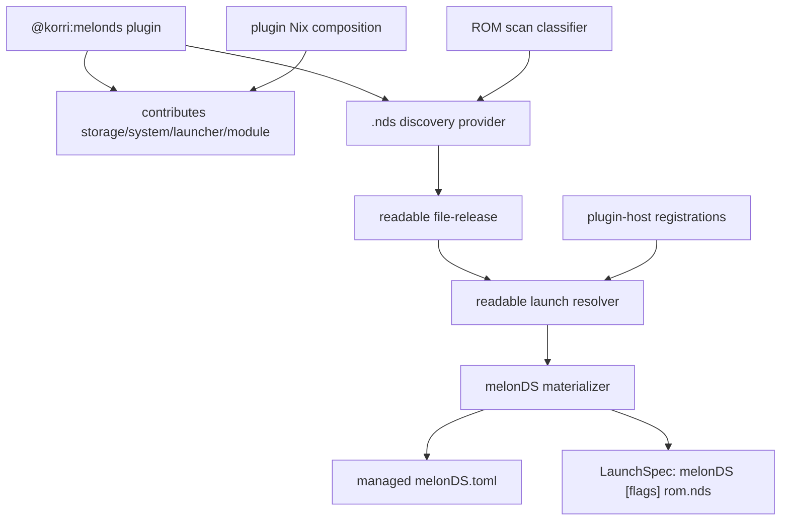
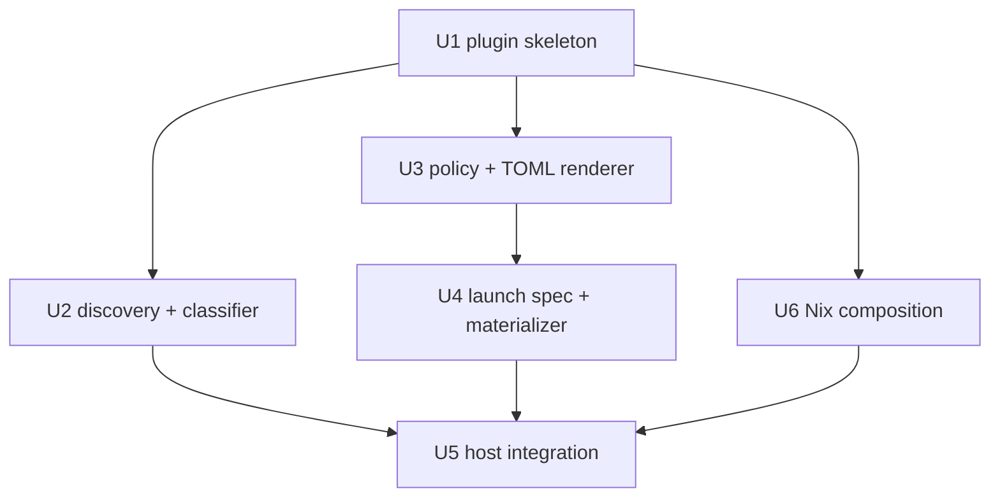
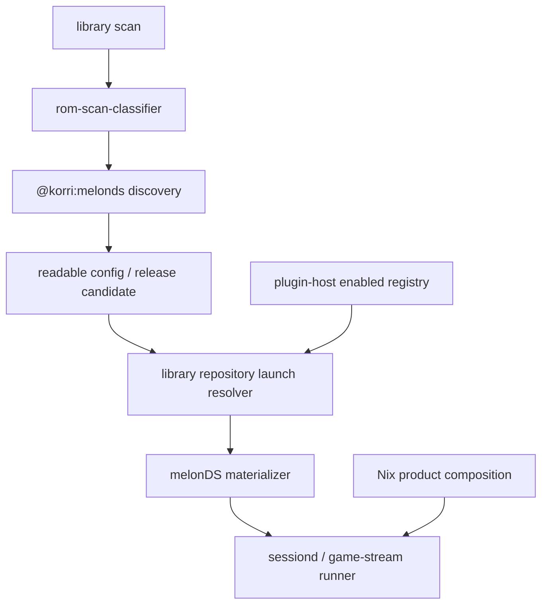

# feat: Add standalone melonDS Nintendo DS launcher plugin

## Summary

Add a first-party `@korri:melonds` plugin that owns Nintendo DS ROM discovery, standalone melonDS launch metadata, typed dual-screen display policy, TOML config materialization, host registration, and Nix composition. The v1 launch path uses standalone melonDS because its native multi-window/screen-layout model is the better fit for true dual-screen setups than routing DS through RetroArch.

---

## Problem Frame

Korri can already model several emulator integrations as first-party plugins, but Nintendo DS is still absent from the plugin-backed launch path. DS emulation has a product-specific wrinkle: the valuable display behavior is not just “run a ROM,” but preserving useful top/bottom screen layouts and, where available, separate windows/displays. That behavior should be owned by a DS launcher plugin rather than leaking Nintendo DS or melonDS-specific policy into generic platform code.

---

## Requirements

- R1. Define a first-party, in-repo plugin with stable identity `@korri:melonds`, following the plugin descriptor contract from the origin requirements (R1-R5, see origin).
- R2. Contribute Nintendo DS system, launcher, storage, and package/module records through normal plugin config contributions, not generic platform special cases (origin R6-R8, R14-R16).
- R3. Discover `.nds` ROMs as file-backed releases and remove the current classifier hard block that prevents plugin discovery from seeing NDS files.
- R4. Launch through standalone melonDS v1 as a direct process: absolute command, ROM positional argument, optional fullscreen flag, and HLE/direct-boot default with no BIOS requirement for normal `.nds` launches.
- R5. Model melonDS display behavior as typed plugin policy: single-window vertical/horizontal/hybrid/top-only/bottom-only layouts, screen sizing, gap, swap, fullscreen, and renderer choices.
- R6. Materialize `melonDS.toml` before launch into a Korri-managed state root, and set XDG config/data env so melonDS does not read/write operator home config or scatter saves beside ROMs.
- R7. Register the readable launch integration and bundled plugin inventory so dry-run and real launches can resolve only when `@korri:melonds` is enabled.
- R8. Provide Nix composition that exposes the nixpkgs melonDS Qt wrapper/binary in the product environment with conservative module defaults and evaluation checks.
- R9. Cover descriptor, discovery, policy/rendering, launch-spec, materializer, registration, and Nix composition behavior with focused tests using real implementations and temp files.

**Origin actors:** A1 Integration author, A2 Planner/implementer, A3 Image/profile composer, A4 Player/operator.
**Origin flows:** F1 static plugin config contribution, F2 host-invoked behavior, F3 simple capability validation.
**Origin acceptance examples:** AE1 plugin app/launch behavior through host-owned handler, AE2 fail-closed missing capability diagnostics, AE4 plain/Effect handler consumption, AE5 catalog-first plugin vocabulary.

---

## Scope Boundaries

- No RetroArch DS support in v1. The RetroArch `melonDS DS` core remains a follow-up under `@korri:retroarch` if Wi-Fi, RetroAchievements, or core-based parity becomes the driver.
- No DSi mode, DSiWare, `.dsi` discovery, DSi NAND, or DSi firmware validation in v1. Normal DS HLE/direct-boot `.nds` launch is the product slice.
- No plugin marketplace, third-party/user-installed plugins, dynamic TypeScript loading, or trust model changes.
- No Android emulator support or Android dual-screen handheld support.
- No broad rewrite of the existing launcher/plugin standardization plan; this plugin authors against the current plugin shapes and leaves broader schema migration to the active launcher-standardization work.
- No UI redesign for configuring DS layouts. The plugin exposes typed policy and launch behavior; any portal settings UI is follow-up.
- No exact physical monitor placement in v1. melonDS supports multiple windows, but there is no CLI for window placement; v1 can seed window layout config and leaves placement/window-manager orchestration to a later slice.
- No raw TOML override merge in v1. Typed `settings.plugin` policy and `overrides.args` are supported; TOML fragment parsing/merging is deferred until the project chooses a TOML parser/stringifier.

### Deferred to Follow-Up Work

- Add `@korri:retroarch` Nintendo DS support using the `melonDS DS` core for RetroArch-specific features.
- Add `.dsi` / DSi mode support with explicit firmware/NAND validation and discovery behavior.
- Add archive-member discovery for `.zip` / `.7z` DS collections after the base `.nds` path is proven.
- Add a portal-visible layout picker and device profile presets for specific dual-screen hardware.
- Add window placement/session orchestration for docked two-display setups if the compositor surface exposes a stable control seam.

---

## Context & Research

### Relevant Code and Patterns

- `product/plugins/AGENTS.md` defines the first-party plugin layout, descriptor pattern, config contribution namespacing, discovery-provider rules, and launch/materializer boundary guidance.
- `product/platform/plugin/index.ts` defines `plugin()`, plugin identity, handler normalization, config contribution maps, and provider records.
- `product/platform/plugin/registry.ts` namespaces non-provider plugin config records and gates enabled plugins/discovery providers.
- `product/plugins/rpcs3/src/plugin.ts` and `product/plugins/rpcs3/src/materializer.ts` show the strongest standalone emulator pattern: plugin-owned launcher, state storage, typed policy, XDG env, state-root validation, and materializer failure shape.
- `product/plugins/ryubing/src/materializer.ts` shows config-at-launch, real filesystem writes, state directory creation, and generated config materialization for a standalone emulator.
- `product/plugins/zquest-classic/src/plugin.ts`, `product/plugins/zquest-classic/src/readable-launch-integration.ts`, and `product/plugins/zquest-classic/nix/composition.nix` show a compact plugin-owned package/composition pattern.
- `product/plugin-host/index.ts` owns `firstPartyLaunchIntegrations`; a new readable launch integration must be listed there and filtered by enabled plugin id.
- `product/plugin-host/bundled-plugins.generated.ts` owns the bundled plugin inventory that currently must be updated when adding a first-party plugin.
- `product/platform/library/discovery/rom-scan-classifier.ts` currently maps `nds` but then marks `.nds` and `nds/*.zip` as unsupported, preventing provider discovery from running.

### Institutional Learnings

- `docs/solutions/architecture-patterns/gamescope-as-plugin-owned-composition-2026-06-17.md`: generic platform code must never name a specific plugin; plugin-specific policy, validation, and Nix artifacts stay in the plugin.
- `docs/solutions/design-patterns/explicit-cascade-folded-policy-over-incidental-signal-heuristics-2026-05-27.md`: wrapper correctness should come from explicit cascade-folded policy, not argv/env/on-disk config sniffing.
- `docs/solutions/runtime-errors/retroarch-bare-passthru-wrapper-injects-l-coredir-2026-05-27.md`: emulator package wrappers can inject surprising defaults; use explicit composition and checks when the launcher needs a clean argv contract.
- `docs/solutions/architecture-patterns/korri-product-platform-theme-architecture-2026-06-03.md`: plugin implementation, tests, Nix fragments, and package artifacts belong under `product/plugins/<plugin>/`.
- `docs/solutions/architecture-patterns/architectural-posture-as-nix-image-default-2026-05-27.md`: Nix modules stay conservative; product image layers opt into plugin posture and assert composed defaults.

### External References

- melonDS CLI source: `https://raw.githubusercontent.com/melonDS-emu/melonDS/master/src/frontend/qt_sdl/CLI.cpp` — ROM path is positional; only `--fullscreen`, `--boot`, and archive member flags materially affect v1 launching.
- melonDS config source: `https://raw.githubusercontent.com/melonDS-emu/melonDS/master/src/frontend/qt_sdl/Config.cpp` — v1 uses `melonDS.toml`, with per-window `Instance0.Window0.*` screen settings.
- melonDS main/path source: `https://raw.githubusercontent.com/melonDS-emu/melonDS/master/src/frontend/qt_sdl/main.cpp` — config root is portable dir or XDG config location; no CLI config path override.
- melonDS releases: `https://github.com/melonDS-emu/melonDS/releases` — v1.0 introduced multi-window support; v1.1 includes Wayland/OpenGL fixes.
- nixpkgs melonDS package: `https://raw.githubusercontent.com/NixOS/nixpkgs/nixos-unstable/pkgs/by-name/me/melonds/package.nix` — nixpkgs exposes `melonDS` with Qt wrapper and Linux/aarch64 support.

---

## Key Technical Decisions

| Decision | Rationale |
|---|---|
| Standalone melonDS is v1 | It directly owns DS layout/multi-window config and launches as one process; RetroArch would route through another plugin and core-options surface. |
| Plugin-specific behavior stays under `product/plugins/melonds/` | Preserves the first-party plugin boundary and avoids generic platform hard-coding of Nintendo DS or melonDS. |
| `.nds` classifier unblock is in scope | The existing classifier marks `.nds` unsupported before provider discovery; without this shared change the plugin cannot discover games. |
| HLE direct boot is the baseline | Normal DS launches need no BIOS files; DSi/firmware complexity is deferred. |
| Typed policy drives TOML | melonDS layout and renderer choices are config-file settings; explicit policy avoids wrapper-side guessing and keeps reviewable semantics. |
| Generated TOML is authoritative in v1 | The plugin controls a Korri-managed state root and writes the minimal known scalar/table keys before launch; raw TOML merge waits for a safe parser/stringifier decision. |
| XDG config and data are co-located | Setting both `XDG_CONFIG_HOME` and `XDG_DATA_HOME` to the managed parent keeps config and save data under Korri state, not operator home or ROM directories. |
| Nix module default is conservative | Product images decide whether melonDS is enabled; the plugin module only exposes the package/state paths and checks when included. |

---

## Open Questions

### Resolved During Planning

- **Which emulator backend is v1?** Standalone melonDS.
- **Is RetroArch DS in v1?** No; defer to a future `@korri:retroarch` DS/core slice.
- **Is DSi in v1?** No; v1 is `.nds` direct-boot Nintendo DS only.
- **Should `.nds` classifier unblock be included?** Yes; discovery cannot work without it.
- **Should the plugin own melonDS config paths?** Yes; use a Korri-managed state root with XDG config/data env injection.

### Deferred to Implementation

- Exact TOML key names and numeric enum values should be verified against the melonDS version pinned by the project at implementation time before committing the renderer tests.
- Whether the nixpkgs `melonDS` wrapper is sufficient or needs plugin-owned wrapping depends on evaluating the package in the current flake; the Nix unit should assert the chosen wrapper still exposes the expected command and runtime libraries.
- Whether `bundled-plugins.generated.ts` has a usable generator or is updated by hand should be confirmed during implementation; either way, the file must include the plugin.

---

## Output Structure

```text
product/plugins/melonds/
  index.ts
  README.md
  nix/
    composition.nix
    nixos-module.nix
  packages/
    melonds/
      check.nix
      default.nix
      README.md
  src/
    config-render.ts
    config-render.test.ts
    discovery.ts
    discovery.test.ts
    ids.ts
    launch-spec.ts
    launch-spec.test.ts
    materializer.ts
    materializer.test.ts
    plugin.ts
    plugin.test.ts
    policy.ts
    policy.test.ts
```

---

## High-Level Technical Design

> *This illustrates the intended approach and is directional guidance for review, not implementation specification. The implementing agent should treat it as context, not code to reproduce.*



### Display mode policy table

| Policy mode | melonDS intent | v1 expectation |
|---|---|---|
| `vertical` | Top above bottom in one window | Default handheld-safe dual-screen layout. |
| `horizontal` | Top beside bottom in one window | Useful for wide displays. |
| `hybrid` | One primary screen emphasized with companion screen | Useful for games where one screen is dominant. |
| `top-only` / `bottom-only` | Render one DS screen | Building block for advanced two-window layouts. |
| `dual-window` | Seed two window configs, one top-only and one bottom-only | Supported as TOML seeding only; physical placement is out of scope. |

---

## Implementation Units



### U1. Add the `@korri:melonds` plugin skeleton and static contributions

**Goal:** Create the first-party plugin module with stable IDs, descriptor, static storage/system/launcher/module contributions, README, and descriptor tests.

**Requirements:** R1, R2, R4, R8, R9

**Dependencies:** None

**Files:**
- Create: `product/plugins/melonds/index.ts`
- Create: `product/plugins/melonds/README.md`
- Create: `product/plugins/melonds/src/ids.ts`
- Create: `product/plugins/melonds/src/plugin.ts`
- Create: `product/plugins/melonds/src/plugin.test.ts`
- Inspect: `product/plugins/AGENTS.md`
- Follow: `product/plugins/rpcs3/src/plugin.ts`
- Follow: `product/plugins/zquest-classic/src/plugin.ts`

**Approach:**
- Define `@korri:melonds` as the plugin id and `melonds` as the local launcher id.
- Contribute a Nintendo DS system record, a state storage record whose default root ends in `melonDS`, a standalone launcher record, and a Nix package/module contribution for the melonDS binary.
- Use an absolute command path consistent with the Nix composition selected in U6; start with `/run/current-system/sw/bin/melonDS` unless U6 introduces a plugin-owned wrapper path.
- Keep the descriptor declarative; no host integration registration or materialization logic in this unit.

**Patterns to follow:**
- `product/plugins/rpcs3/src/ids.ts` for stable plugin-qualified IDs.
- `product/plugins/rpcs3/src/plugin.test.ts` for descriptor assertions.
- `product/plugins/zquest-classic/src/plugin.ts` for compact standalone launcher/module contribution shape.

**Test scenarios:**
- Happy path: descriptor id is exactly `@korri:melonds` and provider record title/description identify melonDS.
- Happy path: launcher contribution has plugin id `@korri:melonds`, absolute command, positional `{content.path}` argument, NDS system support, and allowed-command policy.
- Happy path: state storage contribution resolves to a plugin-qualified storage id and default root ending in `melonDS`.
- Happy path: package/module contribution names the melonDS package and `melonDS` binary.
- Regression: plugin `index.ts` re-exports only the public descriptor/constants needed by plugin host and tests.

**Verification:**
- The plugin descriptor can be imported without side effects and all static contributions are visible through `melondsPlugin.contributes.config`.

---

### U2. Unblock and implement Nintendo DS ROM discovery

**Goal:** Allow `.nds` files to reach provider discovery and add a melonDS discovery provider that emits file-release observations for DS ROMs.

**Requirements:** R2, R3, R9

**Dependencies:** U1

**Files:**
- Modify: `product/platform/library/discovery/rom-scan-classifier.ts`
- Test: `product/platform/library/discovery/release-candidate-scan.test.ts`
- Create: `product/plugins/melonds/src/discovery.ts`
- Create: `product/plugins/melonds/src/discovery.test.ts`
- Modify: `product/plugins/melonds/src/plugin.ts`
- Test: `product/plugins/melonds/src/plugin.test.ts`
- Follow: `product/plugins/rpcs3/src/discovery.ts`
- Follow: `product/plugins/retroarch/src/discovery.ts`

**Approach:**
- Remove the `.nds` hard-block from `unsupportedSystemFor` while keeping unsupported Wii/GBA/archive behavior unchanged.
- Keep `.nds` mapped to `nds` in the classifier so scans produce an unclaimed/candidate state that provider discovery can claim.
- Add a plugin-owned discovery provider with a stable id such as `@korri:melonds/nds-files`.
- Emit `file-release` observations for `.nds` files with NDS system id and melonDS launcher id.
- Defer archive-member detection and `.dsi` discovery; those should remain unclaimed or unsupported according to existing classifier behavior.

**Execution note:** Start with a failing scan/provider test proving `.nds` no longer exits through the unsupported path before adding the provider behavior.

**Patterns to follow:**
- `product/platform/plugin/discovery.ts` for observation shapes.
- `product/plugins/rpcs3/src/discovery.ts` for file-release observations.
- `product/plugins/retroarch/src/discovery.test.ts` for extension-driven provider tests.

**Test scenarios:**
- Happy path: `game.nds` is not classified as unsupported and can be considered by discovery providers.
- Happy path: melonDS discovery emits a high-confidence `file-release` observation for `.nds` with plugin launcher/system ids.
- Edge case: uppercase `.NDS` is accepted by provider matching.
- Edge case: unrelated extensions are ignored by the provider.
- Error path/regression: `nds/collection.zip` is not claimed by v1 melonDS discovery and remains a deferred archive case.
- Integration: scan with `@korri:melonds` enabled can produce a candidate observation; scan without the plugin enabled does not claim NDS files.

**Verification:**
- `.nds` files are visible to the provider pipeline and become plugin-owned launchable release candidates only when the plugin is enabled.

---

### U3. Define melonDS policy and TOML rendering

**Goal:** Create the typed `settings.plugin` policy and deterministic TOML renderer for v1 melonDS launch settings, especially dual-screen display modes.

**Requirements:** R4, R5, R6, R9

**Dependencies:** U1

**Files:**
- Create: `product/plugins/melonds/src/policy.ts`
- Create: `product/plugins/melonds/src/policy.test.ts`
- Create: `product/plugins/melonds/src/config-render.ts`
- Create: `product/plugins/melonds/src/config-render.test.ts`
- Follow: `product/plugins/rpcs3/src/policy.ts`
- Follow: `product/plugins/rpcs3/src/config-render.ts`
- Follow: `product/plugins/ryubing/src/launch-spec.ts`

**Approach:**
- Define a strict Effect Schema policy with delivery-agnostic names: direct boot, fullscreen, renderer, screen layout, screen sizing, screen gap, screen swap, integer scaling, and optional dual-window mode.
- Map policy values to melonDS TOML tables and numeric enum values in one renderer module; the schema should not expose melonDS numeric constants directly.
- Generate only the known v1 scalar/table keys needed for launch. Do not parse or merge raw TOML fragments in v1.
- Include a default profile that sets direct boot/HLE behavior and a single-window vertical dual-screen layout unless overridden.
- Represent dual-window mode as deterministic TOML for `Instance0.Window0` and `Instance0.Window1`; note that window placement remains outside v1.

**Technical design:** Directional mapping only — implementation must verify the exact keys against the pinned melonDS source/package.

| Policy concept | melonDS config intent |
|---|---|
| direct boot | skip DS menu for ROM launches |
| fullscreen | CLI `--fullscreen` and/or persisted window fullscreen state |
| screen layout | `Instance0.Window*.ScreenLayout` enum |
| screen sizing | `Instance0.Window*.ScreenSizing` enum |
| screen gap/swap/integer scaling | per-window display keys |
| renderer | 3D renderer enum |

**Patterns to follow:**
- `product/plugins/rpcs3/src/policy.ts` for strict schema and clean domain names.
- `product/plugins/rpcs3/src/config-render.ts` for rendered config tests.
- `product/platform/library/config/apply-overrides.ts` for why raw config override parsing is intentionally deferred.

**Test scenarios:**
- Happy path: empty/undefined plugin policy decodes to defaults that render a direct-boot single-window dual-screen TOML.
- Happy path: `horizontal`, `vertical`, `hybrid`, `top-only`, and `bottom-only` policies render the expected screen layout/sizing values.
- Happy path: dual-window policy renders two window sections with top-only and bottom-only sizing.
- Edge case: screen gap rejects negative values and values above the verified melonDS range.
- Edge case: unknown policy keys fail strict decoding.
- Error path: unsupported raw config override fragments are not accepted silently by the renderer/materializer path.
- Regression: renderer output is deterministic and stable across object key ordering.

**Verification:**
- Policy tests document the v1 surface and renderer tests prove the generated TOML contains only intended melonDS keys.

---

### U4. Add launch spec composition and materialization

**Goal:** Convert resolved melonDS launch contexts into a validated `LaunchSpec`, write `melonDS.toml` into managed state, and isolate config/save paths through XDG env.

**Requirements:** R4, R5, R6, R9

**Dependencies:** U3

**Files:**
- Create: `product/plugins/melonds/src/launch-spec.ts`
- Create: `product/plugins/melonds/src/launch-spec.test.ts`
- Create: `product/plugins/melonds/src/materializer.ts`
- Create: `product/plugins/melonds/src/materializer.test.ts`
- Modify: `product/plugins/melonds/index.ts`
- Follow: `product/plugins/rpcs3/src/materializer.ts`
- Follow: `product/plugins/ryubing/src/materializer.ts`
- Follow: `product/plugins/zquest-classic/src/readable-launch-integration.ts`

**Approach:**
- Compose `melonDS [--fullscreen] <content.path>` with `applyArgsOverrides` for argv-only escape hatches.
- Fail fast when the command is missing/non-absolute, plugin id does not match, content path is absent, or state root is missing.
- Enforce a state root basename compatible with melonDS XDG resolution, e.g. a root ending in `melonDS`; set both `XDG_CONFIG_HOME` and `XDG_DATA_HOME` to its parent.
- Create the state root and required subdirectories before launch.
- Write `melonDS.toml` atomically before launch using U3 renderer.
- Return a normal `MaterializedReadableLaunch` with the original context and launch spec; do not spawn melonDS inside the materializer.

**Patterns to follow:**
- `product/plugins/rpcs3/src/materializer.ts` for plugin id guard, state-root validation, XDG env building, and `AppMaterializationFailed` wrapping.
- `product/plugins/ryubing/src/materializer.ts` for real filesystem state creation and atomic config writes.
- `product/plugins/rpcs3/src/launch-spec.ts` for absolute command and positional content validation.

**Test scenarios:**
- Happy path: materializer writes `melonDS.toml`, returns `command: /run/current-system/sw/bin/melonDS` (or the U6-selected path), and args ending with the `.nds` content path.
- Happy path: fullscreen policy produces a `--fullscreen` argument without changing the ROM positional argument.
- Happy path: env includes original context env plus XDG config/data values rooted at the managed parent.
- Edge case: missing content path fails with a typed materialization error.
- Edge case: state root basename mismatch fails before writing files.
- Edge case: non-absolute command fails before writing files.
- Error path: TOML write failure returns `AppMaterializationFailed` and does not leave a partial final file.
- Regression: `overrides.args.prepend`, `replace`, and `append` affect only the routed flag segment and never remove the content path.

**Verification:**
- A dry materialization against a temp filesystem produces exactly one managed config file and a launch spec suitable for sessiond/game-stream runner spawning.

---

### U5. Register melonDS with the plugin host and launch-resolution surfaces

**Goal:** Make the plugin and readable launch integration available to runtime composition, gated by enabled plugin policy, with tests that cover dry-run/launch resolution handoff.

**Requirements:** R1, R2, R7, R9

**Dependencies:** U2, U4, U6

**Files:**
- Modify: `product/plugin-host/index.ts`
- Modify: `product/plugin-host/bundled-plugins.generated.ts`
- Modify: `product/plugin-host/roots.test.ts`
- Test: `tools/library/launcher-config-cli.ts` or adjacent launcher-config tests if the CLI surface has coverage
- Test: `product/platform/library/proseql/library-repository.test.ts` or the nearest existing readable launch resolution test
- Follow: `product/plugin-host/index.ts`
- Follow: `product/plugin-host/roots.ts`
- Follow: `tools/library/launcher-config-cli.ts`

**Approach:**
- Export `melonDsReadableLaunchIntegration` and add it to `firstPartyLaunchIntegrations`.
- Add `melonDsPlugin` to the bundled plugin inventory using the repository's current inventory maintenance mechanism.
- Ensure `firstPartyLaunchIntegrationsForRegistry` filters the integration by `providerId` like other plugin-owned launch integrations.
- Add or extend a launch dry-run/resolution test that proves a readable `.nds` release with the plugin enabled reaches the melonDS materializer path.
- Do not introduce generic platform checks for the literal `@korri:melonds` id outside allowed composition roots/tests.

**Patterns to follow:**
- Existing `firstPartyLaunchIntegrations` entries for RPCS3/Ryubing/ZQuest Classic.
- `product/plugin-host/roots.test.ts` for bundled plugin inventory assertions.
- Existing launcher config CLI tests for proving launch integrations are available to tooling.

**Test scenarios:**
- Happy path: bundled plugin inventory includes `@korri:melonds`.
- Happy path: enabled registry includes the melonDS launch integration.
- Error path: disabled registry filters out the melonDS launch integration.
- Integration: dry-run/resolution for a plugin-backed `.nds` release yields a melonDS materialization path rather than a generic app-choice failure.
- Regression: no generic platform module imports `@product/plugins/melonds` except plugin-host composition roots and tests.

**Verification:**
- Runtime composition can resolve a plugin-backed DS launch only when `@korri:melonds` is enabled.

---

### U6. Add Nix composition and package exposure for melonDS

**Goal:** Provide product Nix composition for exposing the melonDS executable and plugin state directories without changing module-level defaults or assuming the plugin is always enabled.

**Requirements:** R2, R4, R6, R8, R9

**Dependencies:** U1

**Files:**
- Create: `product/plugins/melonds/nix/composition.nix`
- Create: `product/plugins/melonds/nix/nixos-module.nix`
- Create: `product/plugins/melonds/packages/melonds/default.nix`
- Create: `product/plugins/melonds/packages/melonds/check.nix`
- Create: `product/plugins/melonds/packages/melonds/README.md`
- Modify: Nix plugin-composition aggregation file that imports plugin `nix/composition.nix`
- Test: nearest Nix check that validates plugin package/composition exposure
- Follow: `product/plugins/zquest-classic/nix/composition.nix`
- Follow: `product/plugins/zquest-classic/nix/nixos-module.nix`
- Follow: `product/plugins/zquest-classic/packages/zquest-classic/check.nix`

**Approach:**
- Wrap or expose nixpkgs `melonDS` so `/run/current-system/sw/bin/melonDS` is available when the plugin module is included.
- Preserve the nixpkgs Qt wrapper unless implementation proves it injects behavior that breaks Korri's explicit argv/config contract; if custom wrapping is required, keep it plugin-owned.
- Add tmpfiles/state directory rules for the managed melonDS state root and saves/config parent.
- Keep module defaults conservative: the plugin is included only by the product/image composition that opts into it.
- Add a Nix check that verifies the package exposes the expected `melonDS` binary and that the composition contributes the plugin id/module when enabled.

**Patterns to follow:**
- `product/plugins/zquest-classic/nix/composition.nix` for plugin-local package/module exposure.
- `product/plugins/zquest-classic/nix/nixos-module.nix` for systemPackages/tmpfiles wiring.
- `docs/solutions/architecture-patterns/architectural-posture-as-nix-image-default-2026-05-27.md` for conservative defaults.

**Test scenarios:**
- Happy path: plugin composition exposes package/check outputs when enabled.
- Happy path: NixOS module places melonDS in `environment.systemPackages` and creates the managed state directory with Korri ownership.
- Edge case: disabled composition does not enable `@korri:melonds` or include the package/module.
- Error path: package check fails if `melonDS` binary is missing or incorrectly cased.
- Regression: module can evaluate on Linux/aarch64-supported systems without assuming BIOS files exist.

**Verification:**
- Nix checks prove the plugin can be included in a product image and the runtime command path expected by the TypeScript descriptor exists in that image.

---

## System-Wide Impact



- **Interaction graph:** Library scanning, plugin discovery, readable launch resolution, plugin-host enabled registry, materialization, and Nix image composition all participate. The plugin itself owns melonDS-specific policy and TOML rendering.
- **Error propagation:** Classifier/provider errors should remain scan diagnostics; launch-time failures use existing `AppMaterializationFailed` / `ResolutionError` paths and occur before process spawn.
- **State lifecycle risks:** melonDS writes config on exit; v1 makes typed policy authoritative by regenerating config before launch. XDG config/data env prevents writes to operator home and ROM directories.
- **API surface parity:** CLI/dry-run and real launch paths must see the same `ReadableLaunchIntegration` registration. No portal-only or CLI-only registration drift.
- **Integration coverage:** Unit tests cover plugin pieces; at least one dry-run/resolution test should exercise classifier → provider → readable release → materializer handoff.
- **Unchanged invariants:** Existing RetroArch, RPCS3, Ryubing, ZQuest, Steam, and generic plugin registry behavior remain unchanged. Generic platform modules do not gain Nintendo DS literals except the existing classifier system id handling required for discovery.

---

## Risks & Dependencies

| Risk | Mitigation |
|------|------------|
| `.nds` files remain skipped before provider discovery | U2 explicitly removes the classifier hard-block and tests the scan path. |
| Wrong melonDS TOML keys silently produce bad display behavior | U3 renderer tests pin the v1 mapping and implementation verifies against the pinned melonDS source/package. |
| Saves/config leak to operator home or ROM directories | U4 sets both XDG config/data roots and U4 tests launch env + file location. |
| Nix exposes the wrong command casing or strips Qt runtime wrapper behavior | U6 package check asserts `melonDS` casing and preserves/evaluates the nixpkgs wrapper. |
| Generic platform code starts depending on `@korri:melonds` | U5 limits imports to plugin-host composition roots/tests and adds a boundary regression check. |
| Dual-window support is overpromised | Scope states v1 seeds TOML window config only; physical monitor placement is deferred. |
| Active launcher-standardization refactor changes record shapes mid-implementation | Keep the plan anchored to current plugin patterns; implementation should rebase descriptors to the latest `launchers` vocabulary if the standardization refactor lands first. |

---

## Documentation / Operational Notes

- `product/plugins/melonds/README.md` should document: plugin id, standalone melonDS v1 posture, `.nds` scope, direct-boot/HLE default, managed state root, supported display policy fields, and out-of-scope RetroArch/DSi/archive behavior.
- The README should explicitly say BIOS files are not required for v1 `.nds` direct-boot launches, while DSi/full firmware boot is deferred.
- Product/image documentation should mention that enabling the plugin requires including its Nix composition so the `melonDS` command is present.
- If a target image enables the plugin by default, add the posture at the image composition layer rather than changing conservative module defaults.

---

## Sources & References

- **Origin document:** [work/items/active/01KV8NZRAAETDX69P5T73BRVY8-first-party-plugin-system-shape/requirements.md](work/items/active/01KV8NZRAAETDX69P5T73BRVY8-first-party-plugin-system-shape/requirements.md)
- Existing related plan: [work/items/active/01KVGDKT01DNT9NRDKS846CJQ1-plugin-launcher-standardization/plan.md](work/items/active/01KVGDKT01DNT9NRDKS846CJQ1-plugin-launcher-standardization/plan.md)
- Plugin authoring guide: [product/plugins/AGENTS.md](product/plugins/AGENTS.md)
- Plugin API: [product/platform/plugin/index.ts](product/platform/plugin/index.ts)
- Plugin registry: [product/platform/plugin/registry.ts](product/platform/plugin/registry.ts)
- Discovery classifier: [product/platform/library/discovery/rom-scan-classifier.ts](product/platform/library/discovery/rom-scan-classifier.ts)
- Standalone emulator pattern: [product/plugins/rpcs3/src/plugin.ts](product/plugins/rpcs3/src/plugin.ts), [product/plugins/rpcs3/src/materializer.ts](product/plugins/rpcs3/src/materializer.ts)
- Nix plugin composition pattern: [product/plugins/zquest-classic/nix/composition.nix](product/plugins/zquest-classic/nix/composition.nix), [product/plugins/zquest-classic/nix/nixos-module.nix](product/plugins/zquest-classic/nix/nixos-module.nix)
- Institutional learning: [docs/solutions/architecture-patterns/gamescope-as-plugin-owned-composition-2026-06-17.md](docs/solutions/architecture-patterns/gamescope-as-plugin-owned-composition-2026-06-17.md)
- Institutional learning: [docs/solutions/design-patterns/explicit-cascade-folded-policy-over-incidental-signal-heuristics-2026-05-27.md](docs/solutions/design-patterns/explicit-cascade-folded-policy-over-incidental-signal-heuristics-2026-05-27.md)
- External melonDS CLI source: `https://raw.githubusercontent.com/melonDS-emu/melonDS/master/src/frontend/qt_sdl/CLI.cpp`
- External melonDS config source: `https://raw.githubusercontent.com/melonDS-emu/melonDS/master/src/frontend/qt_sdl/Config.cpp`
- External melonDS releases: `https://github.com/melonDS-emu/melonDS/releases`
- External nixpkgs package: `https://raw.githubusercontent.com/NixOS/nixpkgs/nixos-unstable/pkgs/by-name/me/melonds/package.nix`
