# fix: Productize Steam AppID exclusive Gamescope lifecycle

## Summary

Make Bandai/SM8550 Steam AppID install and launch a product-owned lifecycle instead of a thin `-applaunch` forwarder. The launch path will reconcile the ARM64 CachyOS Proton policy before install/first launch, run Steam in the desktop UI persona (`steamwebhelper ... -uimode=7`) inside the managed Gamescope service, keep the foreground wrapper alive until the actual game/service reaches a terminal state, transition exclusively between AppIDs, prove the focused game surface with `gamescopectl`, and root-cause/fix the observed Gamescope `status=134` abort rather than misclassifying it as a game/Proton failure.

---

## Problem Frame

Live Bandai validation proved the desired runtime is viable:

- Flinthook `401710`, Downwell `360740`, Cave Story+ `200900`, and 30XX `1029210` can launch through Steam, inside Gamescope, using the real ARM64 CachyOS Proton payload.
- Steam switches native-capable titles to Windows depots when the per-AppID compat mapping is in place before install/launch.
- The Steam desktop UI persona inside Gamescope avoids SM8550 Gamepad UI controller takeover while keeping the service presentation isolated from the KORRI GUI workspace.

The current product path is still too thin around the hard parts:

1. `korri-steam-app-install` can ask Steam to install before the product has reconciled `CompatToolMapping`, so Steam may select native/Linux or an unintended runtime.
2. `korri-steam-app <appid>` forwards `-applaunch` into whichever managed Steam state exists, so stale prior AppID sessions can contaminate logs, focus, screenshots, and process classifiers.
3. Service stop/reset is not a first-class handoff state. A normal stop can time out while the service remains `deactivating`, leaving Wine/FEX descendants behind until an explicit service-cgroup kill/reset is run manually.
4. The observer classifies stale log lines from before the current launch mark and fails to recognize the Nix-store path for the packaged Cachy Proton launcher.
5. Downwell reached `Downwell.exe` through Cachy Proton but then `korri-steam-gamescope.service` aborted with `status=134/SIGABRT`, causing `gamescopereaper` and systemd to kill the game tree. That is a compositor/service failure, not a Downwell compatibility failure.
6. A second live failure mode now explains the consistent 30-60 second Steam game kills: `korri-steam-app` exits when the `SteamLaunch AppId=<id>` wrapper disappears or a console `Game process removed` line appears, even though the Wine/FEX/game process and `steam_app_<id>` window can still be live. That clean wrapper exit triggers the `EXIT` trap's Steam service stop plus sessiond Steam foreground cleanup, killing the real game.

---

## Requirements

- **R1. Canonical AppID launch:** Korrid-controlled Steam games resolve to `/run/current-system/sw/bin/korri-steam-app <appid>`; no raw `steam -applaunch`, direct executable launch, or `korri-steam.service` fallback.
- **R2. SM8550 presentation invariant:** Bandai Steam runs inside `korri-steam-gamescope.service` using desktop Steam UI persona (`-clientbeta steamdeck_stable -nobigpicture -nochatui -nofriendsui -forcedesktopscaling 1.5`) and not Gamepad UI.
- **R3. Gamepad UI guard:** any live `steamwebhelper ... -uimode=4` is fatal for SM8550; Big Picture-titled windows under `uimode=7` remain diagnostic/transient only.
- **R4. Compat before install:** install requests reconcile the intended Windows-via-`proton-cachyos-11.0-20260601-slr-arm64` policy before Steam can choose depots/runtime sidecars.
- **R5. Safe VDF window:** compat/EULA/interstitial VDF writes happen only when Steam and `steamwebhelper` are stopped; the product must not shut Steam down mid-download without an explicit install-in-progress rejection.
- **R6. Exclusive AppID handoff:** a new Steam AppID launch stops or rejects the current Steam foreground AppID, waits for service/process/window/log state to settle, then forwards exactly one requested AppID.
- **R7. Safe cleanup only:** no broad process-pattern kills for `gamescope`/`steam`; cleanup may kill explicit PIDs, sessiond-owned launch process groups, or the explicit `korri-steam-gamescope.service` cgroup. This includes replacing the current materializer lifecycle's broad `pkill -f <stateRoot>` path for managed Steam.
- **R8. Focus proof:** launch success requires current-launch Steam process evidence, focused/visible game surface evidence, Cachy Proton process-chain evidence, and fresh `gamescopectl screenshot` evidence.
- **R9. Crash distinction:** verifier output must distinguish `game exited`, `Steam failed`, `Gamescope aborted`, `Gamepad UI guard exited`, and `service start/stop hygiene failed`.
- **R10. Gamescope abort root cause:** the `status=134` path must be root-caused with the exact journal assertion/site and have a targeted fix that eliminates the captured abort path during repeated SM8550 Steam handoffs. ABRT gates are temporary safety rails, not completion criteria.
- **R11. No Steam-owned runtime mutation:** do not reintroduce broad mutation of Steam Runtime/helper files or disable Steam self-updates.
- **R12. Deterministic verification:** remote validation uses packaged scripts/tools, not long inline SSH scripts, and must not assume `jq` or `python3` exist on the target shell/PATH.
- **R13. True game lifetime:** `korri-steam-app` must not treat `SteamLaunch AppId=<id>` wrapper disappearance or console `Game process removed` alone as terminal after a game has started. The foreground session may exit only after AppID-scoped window/content/process evidence agrees the game is actually done, or service health evidence shows a classified failure cause.

---

## Scope Boundaries

### In scope

- `@korri:steam` install/launch materialization and helpers.
- `product/plugins/steam/nix/nixos-module.nix` service-control, app-install, app-launch, observation-loop, and guard logic.
- Steam observer/verifier tooling under `tools/testing/steam`.
- Narrow Gamescope/service lifecycle changes needed to eliminate or gate the observed `status=134` crash loop.
- Steam AppID wrapper/session-lifetime classification so wrapper handoff does not trigger sessiond cleanup while the real game is still running.
- Bandai validation for Flinthook `401710`, Downwell `360740`, Cave Story+ `200900`, and optionally 30XX `1029210` as a regression canary.

### Out of scope

- Direct game executable launch for Steam titles.
- Gamepad/Big Picture UI support on SM8550.
- Disabling Steam updates or mutating Steam-owned Runtime 4/helper files.
- Replacing the whole foreground lifecycle stack with a new all-launcher supervisor in this slice.
- General-purpose sessiond lifecycle redesign beyond the Steam AppID foreground contract needed here.
- Portal UX for install-control authorization, except where existing install RPC behavior must call the new productized install path.
- Per-title engine fixes unrelated to launch/session hygiene.

---

## Context & Research

### Relevant code anchors

- `product/plugins/steam/src/plugin.ts` defines `DEFAULT_STEAM_COMPAT_TOOL` and routes `install.request` / `install.status`.
- `product/plugins/steam/src/materializer.ts` decodes Steam policy and calls `materializeSteamDesiredState` during launch resolution.
- `product/plugins/steam/src/state-materializer.ts` owns compat-tool validation, VDF writes, and the Steam-stopped lifecycle seam.
- `product/plugins/steam/src/app-control/install-trigger.ts` currently invokes `KORRI_STEAM_APP_INSTALL_HELPER` without first materializing compat state.
- `product/plugins/steam/nix/nixos-module.nix` generates `korri-steam-app-install`, `korri-steam-app`, `korri-steam-service-control`, and `korri-steam-service-run`; its AppID observation loop is the current wrapper-lifetime false-terminal source.
- `product/services/device/sessiond.ts` treats a foreground child exit as launch terminal, then enters restore/cleanup; it already supports `lifecycle: "session"` anchors but Steam AppID launches do not currently use a reliable wait monitor.
- `product/plugins/steam/src/session/lifecycle-hook.ts` and `product/plugins/steam/src/session/foreground-processes.ts` register the AppID and kill matching Steam foreground descendants during sessiond cleanup.
- `tools/testing/steam/observe-bandai-steam-runtime.ts`, `inspect-bandai-steam-restart.ts`, and `verify-bandai-steam-state.ts` are the existing deterministic verifier pattern.
- `product/plugins/gamescope/src/session/reaper.ts` and `lifecycle-hook.ts` own Gamescope cleanup for normal sessiond launches.

### Institutional learnings to preserve

- ARM64 CachyOS Proton is the SM8550 default because x86 Proton/FEX/sniper hits a structural GL wall; fix per-title ARM64 regressions instead of falling back to native Linux or x86 Proton by default.
- Steam VDF writes must be made while Steam is fully stopped; mid-session edits are clobbered on exit.
- Use `gamescopectl screenshot`, not `grim -o DSI-2`, for proof on the handheld panel.
- `status=134` means SIGABRT. If Gamescope aborts, subsequent Wine/FEX/game child exit codes are collateral and must not be interpreted as game failures.
- Sway workspace placement by exact managed Gamescope PID is correct for the Gamescope container; game focus should use `steam_app_<appid>`/title evidence rather than trying to match Wine PIDs.
- The prior sessiond SSE idle-timeout bug established the same architectural lesson at the transport layer: observability/side-channel lifetime must not be treated as supervised game lifetime. This plan applies that lesson to Steam wrapper process lifetime.

### External grounding

- systemd default `KillMode=control-group` means remaining service cgroup children receive termination after the main process exits/fails; this explains `winedevice.exe` kills after a Gamescope abort.
- Gamescope `status=134` commonly corresponds to an internal assertion followed by `abort()`; the assertion text appears in the service journal shortly before the systemd failure line.
- Nested Gamescope under Sway must have a valid Wayland environment; accidentally falling through to DRM on ARM SoC split render/display hardware can produce misleading compositor failures.

---

## Key Technical Decisions

| Decision | Rationale | Consequence |
|---|---|---|
| Keep desktop Steam persona inside Gamescope | Latest Bandai policy rejects Gamepad UI on SM8550 but still requires Gamescope isolation/presentation | Do not revive older Big-Picture/Gamepad warm-gate plans; `uimode=4` remains fatal |
| Make install materialization explicit | Depot/runtime choice is made during install, not only launch | `install.request` or its helper must reconcile compat state before `+app_install` |
| Prefer exact service-cgroup cleanup over process-pattern cleanup | Broad `pkill` risks killing unrelated Steam/Gamescope work and violates operator constraints | Add `reset`/`drain` operations around `korri-steam-gamescope.service`, not global process sweeps |
| Treat sessiond as foreground authority, helper as a defensive gate | Product UI/API should not run two foreground sessions; the helper still protects CLI/manual invocations | Launch transition either stops current session through sessiond or fails closed before forwarding a second AppID |
| Treat Steam wrapper disappearance as a hint, not terminal state | `SteamLaunch AppId=<id>` can disappear after handoff while the real Wine/FEX/game process and `steam_app_<id>` window are still live | `korri-steam-app` remains the foreground child until service/window/content/process evidence proves clean exit or a classified service failure |
| Separate proof from forwarding | `-applaunch` returning is not launch success | The launch verifier must observe current AppID process/window/screenshot/service health |
| Root-cause before patching Gamescope | `status=134` may be teardown-race, Vulkan assert, backend/environment regression, or another assertion | First ship a read-only classifier that captures the exact assert; then implement the smallest targeted fix and prove repeated handoffs |
| No Steam runtime helper mutation | Recent guardrail work fixed damage from mutating Steam-owned helpers | Runtime checks may diagnose, but this plan does not re-enable `steam-guest-runtime-prep --apply` |

---

## Open Questions

### Resolved during planning

- **Should Steam run outside Gamescope for desktop mode?** No. Desktop means Steam desktop UI persona while still inside the managed Gamescope service.
- **Should Big Picture/Gamepad UI be supported on SM8550 now?** No. `uimode=4` is a fatal guard condition.
- **Should product proof use direct game binaries?** No. Steam owns install/launch through AppIDs.
- **Should launch default to native Linux when a native depot exists?** No. Windows via ARM64 Cachy Proton is the default; native Linux is an explicit per-game exception/allowlist.
- **Should broad process-pattern kills be used to recover?** No. Only explicit PIDs, sessiond-owned process groups, or the explicit service cgroup are allowed.
- **Should `SteamLaunch AppId=<id>` wrapper disappearance end the session?** No. It is a handoff/observation hint only. The AppID wrapper must wait for corroborating service/window/content/process evidence before exiting, because its clean exit triggers sessiond and service cleanup.
- **Should Steam AppID launches switch immediately to `lifecycle: "session"` anchor mode?** No for this slice. A session anchor without a trustworthy wait monitor would hide the wrapper-exit bug rather than prove game lifetime. Keep the wrapper as the foreground child and make its lifetime correct; defer a generic wait-monitor protocol until Steam proof is stable.

### Deferred to implementation discovery, not deferred out of scope

- Exact Gamescope abort assertion/site for the Downwell `status=134` event. The implementation must capture it and then choose the targeted fix path.
- Exact code placement for the Steam transition coordinator. This slice should not add a new generic sessiond `replace` API; use the existing stop-session → wait-ready → launch sequence plus a Steam-specific transition lock, then defer a general `replace` protocol until the Steam model is proven.
- Exact numeric exit codes for new `korri-steam-app` terminal classes. The plan requires distinct success vs. service failure vs. Gamepad UI guard vs. timeout outcomes; implementation should choose the smallest additive code mapping and preserve existing 124/125 behavior where possible.
- Exact packaging shape for helper-side install policy enforcement. Direct `korri-steam-app-install <appid>` must not remain a policy bypass: either it runs the same packaged preflight or refuses unless a fresh product-generated policy-prepared stamp proves the requested AppID/default Cachy mapping is in place.

---

## High-Level Lifecycle Design

```mermaid
stateDiagram-v2
  [*] --> InstallOrLaunchRequested
  InstallOrLaunchRequested --> PolicyReconcile: resolve @korri:steam policy
  PolicyReconcile --> RejectInstallBusy: VDF write needed + Steam downloading
  PolicyReconcile --> StopSteamForVdf: VDF drift
  PolicyReconcile --> ForegroundHandoff: no VDF drift
  StopSteamForVdf --> WriteCompatAndGates: Steam/webhelper stopped
  WriteCompatAndGates --> ForegroundHandoff
  ForegroundHandoff --> StopCurrentApp: active foreground AppID exists
  StopCurrentApp --> DrainServiceState: explicit session/service cleanup
  ForegroundHandoff --> EnsureManagedSteam: no active foreground AppID
  DrainServiceState --> EnsureManagedSteam
  EnsureManagedSteam --> FailService: service failed/deactivating/ABRT loop
  EnsureManagedSteam --> ForwardAppId: Gamescope socket + Steam ready
  ForwardAppId --> ObserveCurrentLaunch: mark logs + AppID process chain
  ObserveCurrentLaunch --> StillRunning: SteamLaunch wrapper gone but service/window/content still running
  StillRunning --> ObserveCurrentLaunch
  ObserveCurrentLaunch --> ConfirmExit: Game removed/log/process hint + service/window/content agree stopped
  ObserveCurrentLaunch --> FailGamepadUi: uimode=4 observed or service exit 77
  ObserveCurrentLaunch --> FailGamescopeAbort: status=134/SIGABRT observed
  ObserveCurrentLaunch --> RunningProven: AppID process + focused surface + screenshot fresh
  RunningProven --> ObserveCurrentLaunch: proof recorded; continue supervising
  ConfirmExit --> [*]
```



---

## Implementation Units

### U1. Share Steam policy reconciliation with install requests

**Goal:** Ensure `app.plugin.install.request` and `korri-steam-app-install <appid>` apply the Windows/Cachy policy before Steam chooses depots/runtime sidecars.

**Requirements:** R4, R5, R11

**Files:**
- Modify: `product/plugins/steam/src/app-control/install-trigger.ts`
- Modify: `product/plugins/steam/src/materializer.ts`
- Modify: `product/plugins/steam/src/state-materializer.ts`
- Modify: `product/plugins/steam/src/app-control/install-trigger.test.ts`
- Modify: `product/plugins/steam/src/materializer.test.ts`
- Modify: `product/plugins/steam/src/state-materializer.test.ts`
- Possibly modify: `product/plugins/steam/nix/nixos-module.nix` (`korri-steam-app-install` guard text only)

**Approach:**
- Extract a reusable Steam state preparation function from launch materialization that can reconcile `stateRoot`, default compat tool, per-AppID compat override, EULA/interstitial gates, and tool existence without constructing a foreground launch spec.
- Call this function before spawning the install helper for `install.request`.
- Preserve install-control authorization; this plan does not bypass it.
- Add a global Steam busy guard before any lifecycle shutdown. Introduce `collectSteamBusySnapshot` (or equivalent) that scans the whole Steam library/download state, not only the requested AppID, and returns `idle | active | unknown` with AppID/evidence details. If a VDF write is needed and busy state is `active` or `unknown`, return a structured rejection rather than stopping Steam mid-download.
- Replace the managed-Steam lifecycle shutdown implementation that currently uses broad `pkill -f <stateRoot>` with the product service-control drain/reset path from U3, or with exact PIDs/sessiond process groups when running outside the managed service.
- Enforce the same policy for direct helper usage: `korri-steam-app-install` must either invoke a product-packaged preflight command before `+app_install`, or fail closed unless a fresh product-generated stamp proves the requested AppID/default Cachy policy was prepared after the last Steam shutdown. Do not leave direct helper invocation as a compat-policy bypass.

**Tests:**
- Install request invokes policy reconciliation before helper spawn.
- Reconciliation writes `CompatToolMapping["0"]` and/or per-AppID override for `401710`, `360740`, `200900` before install helper invocation.
- If reconciliation would require shutdown while any app install/download/update is active or busy state is unknown, install/launch returns a clear `install-in-progress`/`steam-busy` failure and does not call lifecycle shutdown.
- A different AppID downloading blocks a VDF shutdown for the requested AppID.
- Managed lifecycle code no longer uses broad `pkill -f <stateRoot>` for Steam cleanup.
- Direct `korri-steam-app-install <appid>` refuses or preflights when the policy-prepared stamp/mapping is absent.
- Already-installed and already-in-progress request paths remain idempotent.

**Verification:**
- Fresh Downwell/Flinthook/Cave Story+ install resolves to Windows depot payload (`*.exe`) without requiring a manual post-install compat edit.

---

### U2. Make `korri-steam-app` an exclusive AppID handoff, not a fire-and-forget forwarder

**Dependency:** implement U3's service-control `drain|reset` first; U2 calls it instead of duplicating service-transition shell logic.

**Goal:** One foreground Steam AppID owns the managed Steam/Gamescope session at a time, each launch starts from a clean current-launch mark, and the wrapper remains alive until the actual AppID session is terminal rather than until Steam's launcher wrapper disappears.

**Requirements:** R1, R2, R3, R6, R7, R9, R13

**Files:**
- Modify: `product/plugins/steam/nix/nixos-module.nix`
- Modify: `product/plugins/steam/nix/nixos-module.test.ts`
- Modify: `product/plugins/steam/src/session/foreground-processes.ts`
- Modify: `product/plugins/steam/src/session/foreground-processes.test.ts`
- Modify: the launch/RPC or sessiond-client layer that currently submits Steam foreground launches, so Steam AppID transitions serialize as stop-session → wait-ready → launch under a Steam transition lock.
- Test: add a race case where two concurrent Steam AppID launch requests result in one forwarded AppID and one structured non-forwarding outcome.
- Test: add source/fixture coverage for the AppID observation loop's post-launch liveness and terminal classification.

**Approach:**
- At `korri-steam-app` start, mark log offsets after cleanup, not before, so stale `Game process removed` lines cannot complete the new launch. If the log file is shorter than the stored mark after a reset/truncation, treat that as a new log generation and avoid reading same-AppID historical removal lines as current-launch evidence.
- Detect active `SteamLaunch AppId=<other>` evidence for a different AppID and treat it as an exclusive handoff requirement.
- Replace the post-`saw_added=1` `SteamLaunch AppId=<appid>` ps disappearance terminal check with a true-game-lifetime check. Wrapper disappearance or console `Game process removed` becomes a hint that starts confirmation, not a reason to exit by itself.
- Confirm clean game exit using AppID-scoped evidence: `steam_app_<appid>` Sway window absence for consecutive polls, no current content/gameprocess running state, and no AppID-scoped process remaining in the managed service cgroup. Treat managed service state as health/failure evidence: `active` is compatible with a clean AppID exit, while `failed`, guard exits, ABRT, or start-limit state are classified failures. Prefer existing `steam_app_<appid>` focus/window evidence over matching Wine/FEX PIDs directly.
- Treat `korri-steam-gamescope.service` `failed`, exit 77, or ABRT evidence during observation as classified failure exits, not wrapper success. Preserve existing launch-time timeout/failure behavior while adding distinct post-running failure classes.
- Extend `app_removed_since_mark` use in `focus_game` and `repair_game_audio`: a current-launch `Game process removed` line may abort those loops only when service/window evidence also says the game is gone or the service failed.
- Product path: implement a Steam foreground transition coordinator using the existing sessiond stop-session → wait-ready → launch sequence, protected by a Steam transition lock so concurrent AppID requests produce exactly one forward and one structured wait/reject/replacement result. Do not add a generic sessiond `replace` API in this slice. Use a daemon-side per-Steam-provider gate for product launches and a defensive wrapper-level lock for direct CLI/helper invocations. Same-AppID launches must be explicit too: either attach/return an `already-running` style structured outcome without forwarding, or stop-session → drain/reset → fresh mark before relaunching; do not proof a new launch against stale same-AppID windows/logs.
- CLI/helper fallback: use the U3 `korri-steam-service-control drain|reset` operation on the explicit `korri-steam-gamescope.service` cgroup and wait for it to settle before launching the new AppID.
- Never use global `pkill` patterns. Use exact process IDs discovered from the current AppID process chain, sessiond launch process group, or `systemctl kill --kill-whom=all korri-steam-gamescope.service` for the explicit service cgroup.
- Wait for all of these before forwarding the new AppID:
  - service no longer `deactivating`,
  - old `SteamLaunch AppId=<old>` gone,
  - old `steam_app_<old>` Sway surface gone; scratchpadding is allowed only for the Steam UI container after old AppID process/content evidence is stopped,
  - Gamescope socket state matches the expected transition (gone during reset, re-created during start),
  - explicit service cgroup scan shows no residual old AppID Wine/FEX/game PIDs after reset/drain,
  - no `steamwebhelper -uimode=4`.
- Keep Steam UI on `korri:steam-debug`/scratchpad or hidden by default, never on the KORRI GUI workspace.
- Gate the existing 30XX-specific audio repair loop so non-30XX validation targets do not burn a fixed delay looking for `30XX.exe` PipeWire ports; broaden to per-AppID audio repair only as a follow-up if needed.

**Tests:**
- Generated script contains an exclusive preflight before `-applaunch`.
- Generated script refuses or drains a different active `SteamLaunch AppId` before forwarding.
- Generated script never contains broad `pkill -f gamescope` or broad `pkill -f steam` cleanup paths.
- `uimode=4` remains `RestartPreventExitStatus=77`/fatal; Big Picture-titled surface messages remain diagnostic.
- Generated script does not exit when `SteamLaunch AppId=<appid>` disappears but `korri-steam-gamescope.service` is still active and the `steam_app_<appid>` window or current-running state remains present.
- Generated script exits cleanly only when AppID-scoped window/content/process evidence agrees the AppID is stopped while service `active` remains acceptable as broker health.
- Generated script exits with a classified non-zero outcome when the managed service enters failed/guard/ABRT state after `saw_added=1`.
- `app_removed_since_mark` plus service-still-active/window-present does not abort `focus_game` or `repair_game_audio`; the same log hint plus service-inactive/window-absent still aborts as a real terminal.
- Source-text assertion prevents reintroducing the old `ps | grep "SteamLaunch AppId=$appid"` check as the sole post-launch liveness condition.
- Concurrent product launches are serialized by the daemon-side Steam transition gate, while direct helper invocations are serialized by the wrapper-level defensive lock. Same-AppID relaunch/attach behavior has coverage for stale same-AppID window/log/process evidence.
- Non-30XX AppIDs skip the 30XX-only audio repair loop unless explicit per-AppID audio repair policy exists.

**Verification:**
- Launch Flinthook → launch Downwell → Cave Story+ and leave each game running past the historical 30-60 second wrapper-handoff window without service stop, sessiond cleanup, or Steam foreground cleanup killing the game. Proof success must not trigger sessiond restore; the wrapper continues supervising until deliberate stop/transition or confirmed game exit. Then stop/transition deliberately and verify no stale prior-title process evidence.

---

### U3. Productize service reset/drain as an explicit helper operation

**Goal:** Replace ad-hoc manual service kill/reset sequences with a deterministic, audited product operation.

**Requirements:** R6, R7, R9

**Files:**
- Modify: `product/plugins/steam/nix/nixos-module.nix`
- Modify: `product/plugins/steam/nix/nixos-module.test.ts`
- Possibly modify: `product/plugins/steam/nix/module-check.nix`

**Approach:**
- Extend `korri-steam-service-control` from `<start|stop>` to `<start|stop|drain|reset>`.
- `drain` waits for active/deactivating transitions to settle and reports the last service state, `Result`, `InvocationID`, and restart count evidence.
- `reset` performs:
  1. `systemctl stop korri-steam-gamescope.service` with a bounded timeout,
  2. if still active/deactivating, `systemctl kill -s SIGKILL --kill-whom=all korri-steam-gamescope.service`,
  3. `systemctl reset-failed korri-steam-gamescope.service`,
  4. wait until `ActiveState=inactive` is stable and `NRestarts`/`InvocationID` have not advanced unexpectedly,
  5. scan the service `ControlGroup`/PID set for residual old AppID Wine/FEX/game descendants and report `cgroup-not-empty` / `cleanup-residual` before any new forward,
  6. remove only known stale Steam IPC/package pending markers if the existing recovery helper already owns that action; do not mutate runtime helpers.
- Return distinct exit codes/messages for stop timeout, SIGKILL escalation, failed-state reset, ABRT/restart observed during drain, keepWarm rapid-restart/non-convergent drain, and successful drain. Callers must distinguish clean inactive, restarting, failed, and timeout rather than treating every non-inactive state as the same failure.
- Keep sudoers narrow: allow only the explicit new service-control command variants for `korri-steam-gamescope.service`.

**Tests:**
- Module tests assert `reset` is present and sudoers still references only `korri-steam-service-control`, not raw `systemctl` wildcards.
- Source text tests assert `systemctl kill --kill-whom=all korri-steam-gamescope.service` is the only SIGKILL escalation path.
- Source text tests assert broad `pkill` patterns are absent from the service-control path and managed Steam materializer lifecycle path.
- Fixture/source test covers keepWarm `Restart=always`: reset/drain must detect if `InvocationID`/`NRestarts` changed because an ABRT restart raced the drain, and must return a distinct restarting/non-convergent outcome rather than hanging until the generic timeout.
- Fixture/source test covers an inactive/stable service with residual old AppID cgroup PIDs and reports a cleanup-residual outcome before the next launch is forwarded.

**Verification:**
- Reproduce the previously manual recovery sequence via `/run/current-system/sw/bin/korri-steam-service-control reset` and observe stale Wine/Gamescope children cleared by service cgroup only.

---

### U4. Root-cause and fix Gamescope `status=134` aborts

**Goal:** Turn the Downwell `status=134` sequence into a classified, fixed failure mode, not a recurring mystery or false Proton regression.

**Requirements:** R9, R10, R12

**Files:**
- Create or modify: `tools/testing/steam/diagnose-bandai-gamescope-abort.ts`
- Modify: `tools/testing/steam/inspect-bandai-steam-restart.ts`
- Modify: `tools/testing/steam/observe-bandai-steam-runtime.ts`
- Possible mitigation files: `product/plugins/steam/nix/nixos-module.nix`, `product/plugins/gamescope/src/session/reaper.ts`, `product/plugins/gamescope/src/session/lifecycle-hook.ts`
- Possible root fix files: `product/plugins/gamescope/packages/gamescope-korri/default.nix` and a new targeted patch under `product/plugins/gamescope/packages/gamescope-korri/patches/`

**Approach:**
- Split the unit into two gates. **U4a diagnose and safety gate** lands first: it captures the exact assertion/site and prevents launches from forwarding into an ABRT restart loop. **U4b targeted root fix** then updates the required files/checks for the captured cause and must eliminate the reproduced abort path before this work is complete.
- Add a read-only abort classifier that collects, for a bounded time window:
  - `systemctl show/status` for `korri-steam-gamescope.service`,
  - service journal lines stripped of ANSI color,
  - exact Gamescope assertion/error lines before `status=134`,
  - `gamescopereaper` child-kill lines,
  - Steam `console_log.txt` / gameprocess log AppID add/remove timing,
  - service restart count/start-limit evidence,
  - service `InvocationID` / journal cursor or timestamp marks,
  - current backend/socket facts (`WAYLAND_DISPLAY`, `GAMESCOPE_WAYLAND_DISPLAY`, socket presence).
- Use two mark classes: a pre-handoff service/journal mark before any stop/drain/reset, and a post-forward Steam gameprocess mark for current AppID add/remove parsing. ABRT classification covers the full pre-handoff → proof window; stale Steam process removal filtering remains scoped to the post-forward mark.
- Classify at least:
  - `gamescope-abort-after-game-running`,
  - `gamescope-abort-before-steam-ready`,
  - `gamepad-ui-guard-exit`,
  - `service-stop-timeout`,
  - `service-killed-by-reset-timeout`,
  - `gamescope-abort-with-rapid-restart`,
  - `gamescope-start-limit-hit`,
  - `normal-game-exit`.
- Implement the targeted U4b fix based on the captured assertion:
  - If the assertion is teardown/socket HUP-like (`IWaitable hung up`, Xwayland/socket handoff), serialize the service/session boundary: wait for old Gamescope/Xwayland sockets and process groups to drain before starting/forwarding a new AppID; add a Gamescope lifecycle drain in the hook if the race is outside Steam.
  - If the assertion is backend/environment fallback, add a pre-start guard that refuses to start Gamescope unless Sway Wayland socket and DBus are available; keep nested Wayland backend explicit/observable.
  - If the assertion is a Gamescope Vulkan/assertion defect that remains after sequencing, add a narrow `gamescope-korri` patch or configuration change with a regression test/check and link it to the exact assertion.
- Prevent loops while root cause is being fixed: after an ABRT-classified service failure, `korri-steam-app` must fail with a structural error instead of repeatedly forwarding the same AppID into an auto-restarting broker. This gate does not satisfy completion unless the targeted U4b fix also makes repeated handoff proof pass without ABRT.
- Ensure post-running service failure is propagated through the session command, not only the verifier: `korri-steam-app` must not exit 0 when service state, exit 77, or journal evidence shows the managed service killed the game.

**Tests:**
- Abort classifier fixture: journal shows `status=134`, `gamescopereaper`, and AppID running first → classify as `gamescope-abort-after-game-running` and not as game failure.
- Abort classifier fixture: normal `Game process removed` with no service ABRT and corroborating stopped window/content state → classify as `normal-game-exit`.
- Abort classifier fixture: service `Result=exit-code` with exit 77 → classify as `gamepad-ui-guard-exit`, distinct from `status=134`.
- Abort classifier fixture: service restarts before failed state can be observed but `InvocationID`/`NRestarts` changed with ABRT journal evidence → classify as `gamescope-abort-with-rapid-restart`.
- Module/source tests assert service readiness and post-launch observation checks collect/report failed/deactivating/ABRT states before forwarding or before exiting successfully.
- If a Gamescope patch is added, add a Nix check that applies the patch and preserves existing `gamescope-korri` patches.

**Verification:**
- Run repeated handoff loop on Bandai (`401710 → 360740 → 200900 → 360740`) and confirm no `status=134` in the bounded journal windows.
- If `status=134` occurs, verifier output includes the exact assertion/site and exits non-zero with `compositorAbort=true`, `gameReachedRunning=<bool>`, and `gameExitCausedByAbort=<bool>`.

---

### U5. Fix observer/verifier classification for current-launch Cachy evidence

**Goal:** Make product proof align with the actual packaged Cachy Proton path and ignore stale historical logs.

**Requirements:** R8, R9, R12, R13

**Files:**
- Modify: `tools/testing/steam/observe-bandai-steam-runtime.ts`
- Modify: `tools/testing/steam/verify-bandai-steam-state.ts`
- Modify or create tests for observer parsing/classification fixtures.

**Approach:**
- Accept both compatibility-tool symlink paths and Nix-store package paths as real ARM64 Cachy Proton:
  - `/var/lib/korri/steam/compatibilitytools.d/proton-cachyos-11.0-20260601-slr-arm64/.../proton`
  - `/nix/store/...proton-cachyos-arm64.../dist/proton`
- Make all AppID add/remove/process classification relative to a current launch mark or explicit `since` timestamp. For same-AppID relaunches, ignore removal/proof lines until a fresh post-forward `Game process added`, content-running, or equivalent current-generation running signal appears; track log generation/size changes so delayed old lines cannot become current evidence.
- Stop treating old `Game process removed` lines as current `processRemoved=true`.
- Stop treating current `Game process removed` as terminal when content/gameprocess/window evidence still says the AppID is running; report it as wrapper/process-tracking removal evidence instead.
- Make `uimode=4` fatal; title-only Big Picture diagnostics under `uimode=7` should not fail the verifier.
- Include service ABRT and `RestartPreventExitStatus=77` in the summary.

**Tests:**
- Fixture with Nix-store `proton-cachyos-arm64.../dist/proton` returns `realProtonCachyos=true`.
- Fixture with stale prior `Game process removed` before mark returns current `processRemoved=false`.
- Fixture with current `Game process removed` plus content log `App Running`/window-present evidence returns `wrapperRemoved` or equivalent non-terminal evidence, not `processRemoved=true` as a game exit.
- Fixture with log truncation after mark treats the new file as a new generation and does not let same-AppID historical removal lines terminate the current launch.
- Fixture with stale same-AppID window/log/process evidence before a fresh post-forward add/running signal does not satisfy launch proof or terminal classification.
- Fixture with `steamwebhelper -uimode=4` returns fatal Gamepad UI failure.
- Fixture with Big Picture title but `uimode=7` returns diagnostic only.

**Verification:**
- Observer no longer reports false failure for validated Downwell/Flinthook/Cave Story+ launches that use the packaged Nix-store Cachy Proton path.

---

### U6. Add a first-class Steam AppID proof verifier

**Goal:** Encode the manual proof checklist into a deterministic script/tool that can be run after deploy without long inline SSH. Prefer extending an existing observer/verifier entrypoint and shared parsers; create a new command only if the existing tools cannot express the full proof flow cleanly.

**Requirements:** R8, R9, R12, R13

**Files:**
- Modify: `tools/testing/steam/prove-bandai-steam-appid-handoff.ts`
- Modify: `tools/testing/steam/prove-bandai-steam-appid-handoff.test.ts`
- Create only if needed: `tools/testing/steam/verify-bandai-steam-appid-launch.ts`
- Modify: `package.json` or `justfile` only if adding a narrow task is useful.

**Approach:**
- Inputs: `--app-id`, `--title`, optional `--expected-exe`, optional `--timeout`, optional `--ssh-config`, optional `--screenshot-path`.
- Steps:
  1. verify `korri-steam-gamescope.service` state and no failed ABRT loop,
  2. record a pre-handoff service/journal mark and a post-forward Steam log mark,
  3. start a bounded independent observer before triggering the launch (for example, SSH log/process polling using product-owned parsers) so evidence collection does not depend on `korri-steam-app` exiting,
  4. spawn the product launch path asynchronously (or observe an already-started launch in observe-only mode) and collect evidence while the launcher is still running; do not wait for `korri-steam-app` to exit before observing,
  5. wait for current-launch AppID evidence without requiring the `SteamLaunch` wrapper process to remain alive,
  6. wait for Cachy Proton process-chain evidence,
  7. wait for focused/visible window/title evidence,
  8. capture with `gamescopectl screenshot <path>` and wait for file completion,
  9. classify black/stale screenshot risk by size/hash if possible,
  10. hold observation beyond the historical wrapper-handoff window and assert `korri-steam-app` remains the foreground child, sessiond does not enter restoring/cleanup, the wrapper trap does not stop the service, and Steam cleanup-hook PID kills do not occur,
  11. summarize service exits/ABRT lines since mark.
- Keep the target shell dependencies limited to POSIX shell, systemd tools, `grep`/`sed`/`ps`, `swaymsg`, and product-provided Gamescope tools; do not require target `jq` or `python3`.

**Tests:**
- Unit-test parser/classifier pieces locally with captured fixture text.
- Add a process/control test proving the verifier records evidence before awaiting launcher exit.
- Add a classifier test where `SteamLaunch` wrapper evidence disappears mid-proof but window/content/service evidence remains running; verifier continues observing instead of declaring terminal.
- Add a hold-window test proving proof success is a readiness milestone, not a terminal wrapper success, and no sessiond restore/cleanup signal is observed during the hold.
- Keep live SSH integration manual-gated; do not make CI depend on Bandai availability.

**Verification:**
- Produce proof artifacts for `401710`, `360740`, and `200900` with screenshot paths and concise summaries.

---

### U7. Wire acceptance into module checks and operational docs

**Goal:** Keep the product invariants from regressing after this slice lands.

**Requirements:** R1-R13

**Files:**
- Modify: `product/plugins/steam/nix/nixos-module.test.ts`
- Modify: `product/plugins/steam/nix/module-check.nix`
- Modify: `docs/solutions/architecture-patterns/steam-appid-launch-ux-policy-2026-06-20.md`
- Modify: `docs/solutions/tooling-decisions/arm64-native-proton-cachyos-steam-runtime-bandai-2026-06-20.md` only if the install-side policy details need refreshing.
- Update: `work/items/parking-lot/01KWX5FYS5CB4S2ZQBABSCWBEA-diagnose-sm8550-gamescope-aborts-during-steam-appid-launches.md` status/notes after root-cause fix lands.

**Approach:**
- Add source/module assertions for:
  - no `korri-steam.service` management,
  - managed Gamescope service remains default,
  - SM8550 uses desktop Steam persona inside `korri-steam-gamescope.service` (`-clientbeta steamdeck_stable`, `-nobigpicture`, no `-gamepadui`, and live `steamwebhelper ... -uimode=7` evidence in device verifier),
  - `uimode=4` guard remains fatal,
  - service reset/drain is explicit and narrow,
  - install helper is not a bypass around compat reconciliation,
  - observer recognizes packaged Cachy Proton path,
  - wrapper disappearance and console `Game process removed` alone are not terminal after `saw_added=1`,
  - post-running service failure and Gamepad UI guard outcomes do not exit as successful game completion.
- Document the new operator commands and failure classes.
- Mark the abort parking-lot item done only after repeated on-device handoff proof is green.

**Verification:**
- Local tests/checks green for the touched slice.
- Device proof for `401710`, `360740`, and `200900` after deploy.

---

## Test and Verification Plan

### Local/unit verification

```sh
bun test \
  product/plugins/steam/src/app-control/install-trigger.test.ts \
  product/plugins/steam/src/materializer.test.ts \
  product/plugins/steam/src/state-materializer.test.ts \
  product/plugins/steam/src/session/foreground-processes.test.ts \
  product/plugins/steam/src/session/lifecycle-hook.test.ts \
  product/plugins/steam/src/observability/log-signals.test.ts \
  product/plugins/steam/src/observability/launch-state.test.ts \
  product/plugins/steam/src/observability/lifecycle-events.test.ts \
  product/plugins/steam/nix/nixos-module.test.ts \
  tools/testing/steam/diagnose-bandai-gamescope-abort.test.ts \
  tools/testing/steam/observe-bandai-steam-runtime.test.ts \
  tools/testing/steam/prove-bandai-steam-appid-handoff.test.ts

nix build .#checks.x86_64-linux.korri-steam-module --no-link
```

If Gamescope hooks/patches are touched, also run the relevant gamescope plugin tests and package check.

### Device verification on Bandai

1. Deploy the NixOS closure to Bandai.
2. Verify baseline state:
   - `korri-steam-gamescope.service` active or cleanly startable,
   - Steam desktop UI persona (`uimode=7`) and no `uimode=4`,
   - Gamescope container on `korri:steam-debug`/scratchpad, not KORRI GUI workspace,
   - Cachy Proton symlink exists and points to the real packaged payload.
3. For each AppID `401710`, `360740`, `200900`:
   - ensure compat mapping exists before install/launch,
   - launch through product path only,
   - verify current AppID process chain uses Cachy Proton,
   - verify focused title/class,
   - capture `gamescopectl` screenshot,
   - keep observing past the historical 30-60 second wrapper-handoff window and verify sessiond remains in the running phase rather than restoring,
   - stop/transition and verify no stale process/window/log contamination.
4. Run repeated transition loop `401710 → 360740 → 200900 → 360740` and assert no `status=134` / ABRT in the bounded journal windows.
5. If `status=134` appears, collect the abort classifier output and do not mark the slice complete until the exact assertion has a targeted fix and repeated handoff proof passes without ABRT. The hard launch gate is only a safety rail while the fix is developed.

---

## Acceptance Checklist

- [ ] `install.request` and direct `korri-steam-app-install <appid>` cannot reach `+app_install` without fresh ARM64 Cachy compat policy preparation.
- [ ] VDF writes fail closed when they would interrupt any active/unknown Steam install/download/update, including a different AppID.
- [ ] Managed Steam materialization no longer uses broad `pkill -f <stateRoot>` cleanup.
- [ ] Steam AppID transitions serialize through sessiond stop-session → wait-ready → launch plus a Steam transition lock; concurrent launches produce one forward and one structured outcome.
- [ ] `korri-steam-app <appid>` enforces defensive exclusive handoff before forwarding the AppID.
- [ ] `korri-steam-app <appid>` survives the historical 30-60 second `SteamLaunch` wrapper handoff while the game window/content/service evidence remains running; proof success does not trigger terminal success, and no service stop or sessiond Steam cleanup fires until true terminal evidence appears.
- [ ] Same-AppID relaunches either attach/return an already-running outcome or perform stop-session → drain/reset → fresh mark before forwarding; stale same-AppID evidence cannot prove a new launch.
- [ ] Service stop/reset/drain is productized and uses only the explicit service cgroup/PIDs.
- [ ] Observer recognizes `/nix/store/...proton-cachyos-arm64.../dist/proton` as real Cachy Proton.
- [ ] Observer ignores stale `Game process removed` lines from prior launches and treats current wrapper removal as non-terminal when running evidence contradicts it.
- [ ] SM8550 Steam runs inside `korri-steam-gamescope.service` with desktop persona evidence (`steamwebhelper ... -uimode=7`); `uimode=4` remains fatal and Big Picture title under `uimode=7` is diagnostic.
- [ ] Launch verifier produces current AppID process/window/screenshot/service summaries.
- [ ] Gamescope `status=134` classifier distinguishes compositor abort from game failure.
- [ ] The captured Gamescope abort root cause has a targeted fix, and repeated AppID handoffs no longer produce ABRT loops; a gate alone is not sufficient for completion.
- [ ] Flinthook, Downwell, and Cave Story+ pass install/launch proof through Windows/Cachy Proton on Bandai.

---

## Risks and Mitigations

| Risk | Mitigation |
|---|---|
| Steam downloads are interrupted by materialization shutdown | Add install-in-progress guard before shutdown; reject with explicit reason |
| Resetting service loses useful Steam warm state | Only reset when exclusive handoff or failed/deactivating state requires it; otherwise use warm service |
| Cgroup SIGKILL kills diagnostics too early | Capture service/log marks before reset; verifier reads journal after the fact |
| Gamescope ABRT assertion is not the expected teardown race | Classifier captures exact assertion and branches to backend/Vulkan/patch fix rather than guessing |
| Steam launcher wrapper exits while the game keeps running | Treat wrapper/process-removal signals as hints and require service/window/content/process corroboration before exiting the foreground child |
| Tests overfit source strings in `nixos-module.test.ts` | Prefer small script functions and semantic fixture tests where possible; source assertions only for non-negotiable shell invariants |
| Device validation is flaky due to Steam first-run/shader work | Use current-launch marks, longer first-run timeouts, and repeat proof after warm-up before classifying as failure |

---

## Follow-Up Work After This Slice

- Product UI for proof screenshots and richer Steam lifecycle diagnostics.
- Install-control authorization UX/API path for `app.plugin.install.request` / `status` without manual unlock friction.
- Per-title ARM64 Proton fixes, such as 30XX D3D compiler/profile issues, once lifecycle proof is stable.
- Broader all-launcher sessiond lifecycle unification from `01KV3A5RNCMMGR8FY5Y8MKPWGD`, after Steam proves the transition model.
- A Steam-specific session-lifecycle wait monitor or generic sessiond `lifecycle: "session"` integration once the true game-lifetime signals are validated.
