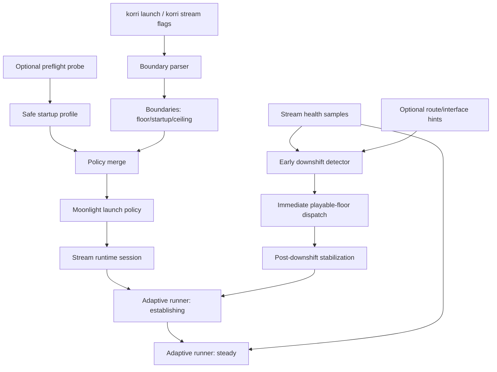

# feat: Add stream startup, preflight, and handoff quality control

## Summary

Extend Korri's existing adaptive stream boundary language so bitrate can express a playable floor, conservative startup point, and pretty ceiling in one `floor..startup..ceiling` value. Use that startup policy to avoid launch-time flooding, add a lightweight preflight path for selecting safe launch settings, and add early running-stream downshift when health signals show the link is about to choke.

---

## Problem Frame

The validated playable-first rescue path works when Korri can still deliver runtime commands, but a very high `1080p120` launch at high bitrate can flood a weak link so badly that both automatic and manual rescue commands fail. The current API already has floor/ceiling boundary grammar and adaptive runtime controls; the missing product slice is a safe initial stream state, a launch-time probe before choosing that state, and earlier in-session downshift before the control path is starved.

---

## Requirements

- R1. Preserve the current CLI-first boundary model: extend the existing `--bitrate`, `--fps`, and `--resolution` `..` grammar rather than adding a separate family of startup flags.
- R2. Support `floor..startup..ceiling` semantics for bitrate in v1, with validation that startup is inside the floor/ceiling box; keep FPS/resolution on the existing floor/ceiling grammar until Moonlight has distinct envelope-vs-initial semantics.
- R3. Use startup quality during launch/establish so a high explicit ceiling does not require the stream to start at max bitrate.
- R4. Preserve explicit ceilings; do not autodetect device ceilings or silently invent a higher maximum than the user/policy supplied.
- R5. Respect the current Moonlight constraint that launch resolution/FPS define the practical runtime envelope; when FPS/resolution ceilings are explicit, launch composition must use those ceilings as the envelope, not a lower startup that traps later recovery.
- R6. Add launch-time preflight as a separate mechanism from adaptive rescue: preflight selects safe startup/boundary defaults before Moonlight starts.
- R7. Add running-stream early downshift driven primarily by stream-health evidence and optionally by network-event hints; avoid brittle SSID/device-name heuristics.
- R8. Maintain accepted-vs-applied truth, runtime command serialization, and plugin removability boundaries.
- R9. Preserve playable-first behavior: default adaptive floors should be low and responsive, e.g. `640x360 / 30fps / 500kbps`; if a user explicitly sets a higher floor, Korri must respect it and surface that it is binding rather than silently violate policy.
- R10. Keep GUI/portal controls deferred; CLI/RPC observability is the product surface for this slice.

---

## Scope Boundaries

- No GUI, portal slider, or overlay control surface.
- No autodetection of device ceiling; ceilings remain explicit policy/CLI inputs.
- No dependency on iperf3 as the product preflight mechanism; iperf3 remains a diagnostic comparison point only.
- No L4S, FEC, QUIC/BBR transport, or out-of-band congestion-prioritized control channel in this slice.
- No full replacement of the explicit shed/emergency path with a unified controller in this implementation slice.
- No named presets, per-game memory, or persisted quality profiles.
- No `floor..startup..ceiling` syntax for FPS/resolution in v1 product help or examples; use `floor..ceiling` for those levers because launch FPS/resolution still define the envelope.

### Deferred to Follow-Up Work

- Out-of-band or congestion-prioritized emergency control path, for cases where the stream has already flooded the link badly enough that normal runtime commands fail.
- Unified-controller exploration for replacing explicit emergency/shed mode: `work/items/parking-lot/01KWX6X2C5RZ08BTG9FSXYBHNY-explore-replacing-explicit-stream-emergency-mode-with-unifie.md`.
- Named stream profiles and per-game memory: `work/items/parking-lot/01KWTQJS39SZGCWQRKH3Z8QE0W-boundary-persistence-named-presets-and-per-game-memory-for-s.md`.
- Device state adaptation for battery/thermal: `work/items/parking-lot/01KWTQ750V3HJZ9AMQKH6H5W13-adapt-streaming-to-handheld-device-state-battery-thermal.md`.
- Final decision on whether `stream` remains a first-class CLI noun long-term: `work/items/parking-lot/01KWTMPE4MJXVR940R4X9GB0PR-reconsider-stream-as-a-first-class-cli-noun-vs-an-implementa.md`.

---

## Context & Research

### Relevant Code and Patterns

- `product/platform/stream/stream-adaptive-boundaries.ts` owns the current `key=value` boundary grammar. It accepts scalar pins, `floor..ceiling`, one-sided ranges, and `auto`; more than two `..` segments currently fails.
- `product/platform/stream/stream-adaptive-controller.ts` already has an `establishing` phase and a `coldStartBitrateKbps` fallback, but startup is not yet a user/policy boundary value.
- `product/platform/stream/stream-adaptive-runner.ts` applies effective ceilings from launch baseline and drives runtime changes, but currently needs explicit phase lifecycle wiring for establish/startup behavior.
- `product/platform/stream/stream-handoff-trigger.ts` already contains handoff hint normalization and pressure conversion; it is not yet consumed by the runner.
- `product/surfaces/terminal/korri-cli/korri-cli.ts` and `product/surfaces/terminal/korri-cli/launch-command.ts` already pass adaptive boundary flags through launch and stream commands.
- `product/apps/portal/api/library/launch.rpc.ts` already accepts `override`, and `product/platform/library/config/ephemeral-override.ts` whitelists `override.moonlight.stream` launch bitrate/FPS/resolution fields.
- `product/apps/portal/api/library/launch.rpc-handler.ts` forwards remote-source `payload.override` into prepare and local Moonlight policy resolution.
- `product/apps/portal/stream/moonlight-launcher.ts` is the shared Moonlight launch path and adaptive runtime registration seam.

### Institutional Learnings

- `docs/acceptance/runtime-settings-protocol-contract.md` — accepted is not applied; product success requires readback; runtime mutations serialize; scale-only resolution semantics matter.
- `docs/solutions/architecture-patterns/stream-control-command-outcome-contract-2026-06-03.md` — product surfaces must preserve pending/failed/applied outcomes and not leak raw backend protocol as UX.
- `docs/korri-stream-resolution-switch-seamlessness-findings-2026-07-05.md` — bitrate/FPS are near-seamless dials; resolution costs about 200ms and should be rare except true rescue.
- `docs/korri-stream-layer3-safety-net-scope.md` — global mutation serialization and decode-confirmed applied truth are safety constraints for autonomous controllers.
- `docs/solutions/design-patterns/explicit-cascade-folded-policy-over-incidental-signal-heuristics-2026-05-27.md` — express launch quality intent as explicit policy, not incidental env/argv heuristics.
- `docs/solutions/tooling-decisions/korri-cli-exit-code-contract-2026-07-03.md` — new CLI failure behavior must respect canonical outcome/exit-code handling.

### External References

- NVIDIA GeForce NOW system requirements: `https://www.nvidia.com/en-us/geforce-now/system-reqs/` — official bandwidth/latency gates, including 15 Mbps for 720p60, 25 Mbps for 1080p60, 35 Mbps for high-FPS QHD tiers, and <80ms latency.
- NVIDIA GeForce NOW network anatomy research: `https://arxiv.org/html/2401.06366v2` — separates pre-game management/probe phase from gameplay streaming.
- Moonlight documentation: `https://github.com/moonlight-stream/moonlight-docs/wiki/Frequently-Asked-Questions` — manual bitrate headroom guidance, 150 Mbps client cap, and stream overlay metric meanings.
- Sunshine configuration docs: `https://docs.lizardbyte.dev/projects/sunshine/latest/md_docs_2configuration.html` — `max_bitrate`, FEC overhead, and host-side bitrate behavior.
- WebRTC GCC reference: `https://datatracker.ietf.org/doc/html/draft-ietf-rmcat-gcc-02` — conservative startup, multiplicative/additive growth, delay/loss signals, and overuse decrease patterns.
- WebRTC probing writeup: `https://webrtchacks.com/probing-webrtc-bandwidth-probing-why-and-how-in-gcc/` — startup probe clusters and post-drop re-probe concepts.

---

## Key Technical Decisions

- Use `floor..startup..ceiling` as the primary user-facing bitrate extension, not separate `--startup-bitrate` flags, because it deepens the existing boundary grammar instead of adding a parallel model.
- Model startup as a bitrate boundary in v1. FPS/resolution remain floor/ceiling envelope constraints; lowering their launch value would also lower the reachable envelope in current Moonlight behavior.
- Launch with startup bitrate when available, not ceiling bitrate followed by a delayed correction, because the gap before the first adaptive tick is exactly where high-bitrate flooding can make rescue commands fail.
- Treat preflight as launch-profile selection, not as ceiling autodetection. It fills missing/default startup values and can choose conservative defaults, but explicit CLI/policy startup values are authoritative unless the caller marks preflight required, in which case unsafe explicit startup should reject with a clear reason rather than silently lowering it.
- Use a lightweight product-owned preflight path as the product direction, but v1 should use existing source-control/RPC reachability and timing facts rather than introducing a new source-side UDP probe service. Keep iperf3 as a diagnostic comparison, not a product dependency.
- Make running-stream early downshift health-driven first using currently available health fields. Route/interface events may reduce the evidence threshold or annotate recovery, but must not be the only reason for a downshift or a prolonged hold when health is good.
- Keep explicit shed/emergency behavior for this slice. Research shows mature controllers can be unified, but Korri's special shed path is currently a proven safety invariant and should not be redesigned concurrently with startup/preflight/handoff.
- Keep preflight and handoff separate: preflight prevents bad launch choices; handoff reacts to a running stream's path degrading.

---

## Open Questions

### Resolved During Planning

- Should the design add separate startup flags? No. Use `floor..startup..ceiling` to extend the existing range mechanism.
- Should iperf3 be the product preflight dependency? No. Use a lightweight built-in probe; compare iperf3 only in diagnostics/validation.
- Should network changes mean SSID/device-name heuristics? No. Use stream-health evidence as primary; use OS/network hints only as supporting early-warning inputs.
- Should this plan include preflight and handoff, or only startup grammar? Include all three as one broader product slice per user direction.

### Deferred to Implementation

- Exact preflight thresholds and profile numbers: start from research-backed defaults, then tune from aka/Bandai validation.
- Exact handoff cooldown duration and stable-sample count: define as tunable constants and verify under shaped traces.
- Whether a future Moonlight/runtime change should support true separate FPS/resolution envelope-vs-initial values; v1 explicitly does not expose that promise.
- Whether above-launch ceiling runtime resolution clamping needs a prerequisite device gate before exposing some 3-part resolution examples broadly.

---

## High-Level Technical Design

> *This illustrates the intended approach and is directional guidance for review, not implementation specification. The implementing agent should treat it as context, not code to reproduce.*



Boundary value forms:

```text
bitrate=6m                 pin at 6 Mbps
bitrate=500k..40m          adapt between floor and ceiling
bitrate=500k..6m..40m      start at 6 Mbps, adapt between 500 kbps and 40 Mbps
bitrate=..6m..40m          default floor, start at 6 Mbps, cap at 40 Mbps
bitrate=500k..6m..         floor 500 kbps, start at 6 Mbps, default ceiling
fps=30..120                adapt between 30 and 120 fps; no startup segment in v1
resolution=640x360..1920x1080 adapt between resolution bounds; no startup segment in v1
```

---

## Implementation Units

### U1. Extend adaptive boundary grammar with startup

**Goal:** Add a `startup` slot to bitrate boundaries and teach the current parser/serializer to understand `floor..startup..ceiling` for bitrate while preserving all existing forms.

**Requirements:** R1, R2, R8

**Dependencies:** None

**Files:**
- Modify: `product/platform/stream/stream-adaptive-boundaries.ts`
- Test: `product/platform/stream/stream-adaptive-boundaries.test.ts`

**Approach:**
- Extend the bitrate/numeric boundary model with an optional startup value.
- Parse three-segment bitrate values as floor/startup/ceiling, validating ordering when adjacent values are present.
- Reject three-segment FPS/resolution values in v1 with a clear explanation that FPS/resolution launch values define the current runtime envelope.
- Preserve current one- and two-segment behavior exactly: scalar pin, floor/ceiling ranges, one-sided ranges, and `auto`.
- Serialize startup-bearing boundaries back to three-segment values so CLI `show`/`watch` output round-trips through the same grammar.
- Keep validation streamer-agnostic; do not import Moonlight policy or runtime types into `product/platform/stream`.

**Patterns to follow:**
- Existing grammar and serializer in `product/platform/stream/stream-adaptive-boundaries.ts`.
- Runtime acceptance/coercion posture in `docs/acceptance/runtime-settings-protocol-contract.md`.

**Test scenarios:**
- Happy path: `bitrate=500k..6m..40m` parses to floor `500`, startup `6000`, ceiling `40000`.
- Happy path: `bitrate=..6m..40m` parses with default floor, startup `6000`, ceiling `40000`.
- Happy path: `bitrate=500k..6m..` parses with floor `500`, startup `6000`, default ceiling.
- Happy path: existing `bitrate=500k..40m`, `bitrate=40m`, `bitrate=auto`, and `bitrate=..` remain unchanged.
- Error path: `fps=30..60..120` and `resolution=640x360..1280x720..1920x1080` are rejected in v1 with a clear envelope-limit explanation.
- Error path: inverted `floor..startup..ceiling` ranges produce targeted validation errors.
- Error path: four or more segments remain invalid.
- Integration: `serializeStreamBoundaries(parseStreamBoundaryArgs(args))` round-trips startup-bearing values.

**Verification:**
- Boundary parsing and serialization are deterministic, backward-compatible for existing valid expressions, and capable of representing bitrate floor/startup/ceiling without teaching a false FPS/resolution startup model.

---

### U2. Compose startup launch policy without losing explicit ceilings

**Goal:** Use startup values to choose the initial Moonlight launch quality, especially bitrate, while preserving explicit ceiling/floor boundaries for the adaptive runtime.

**Requirements:** R3, R4, R5, R8

**Dependencies:** U1

**Files:**
- Modify: `product/platform/control/control-requests.ts`
- Modify: `product/apps/portal/api/library/launch.rpc.ts`
- Modify: `product/apps/portal/api/library/launch.rpc-handler.ts`
- Modify: `product/apps/portal/api/library/remote-stream-prepare.ts` if remote prepare needs to carry stream boundary policy
- Modify: `product/surfaces/terminal/korri-cli/launch-command.ts`
- Modify: `product/apps/portal/stream/moonlight-launcher.ts`
- Modify: `product/platform/library/config/ephemeral-override.ts` if the launch override schema needs a named startup-quality policy extension rather than reusing existing `moonlight.stream`
- Test: `product/surfaces/terminal/korri-cli/launch-command.test.ts`
- Test: `product/apps/portal/api/library/launch.rpc-handler.test.ts`
- Test: `product/surfaces/terminal/korri-cli/moonlight-launcher.test.ts`

**Approach:**
- Introduce a schema-backed launch/request field for stream boundaries or boundary args so CLI, portal RPC, control requests, and remote-source launches can all carry the same startup/floor/ceiling intent.
- For bitrate, when startup is present, launch Moonlight with the startup bitrate so the stream does not begin by flooding the link.
- Preserve the declared bitrate ceiling in adaptive boundaries so the controller may climb after health proves capacity.
- For resolution/FPS, launch at the declared ceiling envelope when the user expects later growth, because current Moonlight runtime behavior cannot reliably climb above launch resolution/FPS.
- Keep explicit CLI/user boundaries higher precedence than preflight-derived defaults.
- Ensure remote-source launch and local CLI launch use the same composition rules rather than diverging.

**Patterns to follow:**
- Existing `override.moonlight.stream` whitelisting in `product/platform/library/config/ephemeral-override.ts`.
- Existing boundary pass-through in `product/surfaces/terminal/korri-cli/launch-command.ts`.
- Remote-source override forwarding in `product/apps/portal/api/library/launch.rpc-handler.ts`.

**Test scenarios:**
- Happy path: launch with `--bitrate=500k..6m..40m` passes startup bitrate to Moonlight launch policy and retains `500k..6m..40m` as adaptive boundaries.
- Happy path: launch with `--resolution=640x360..1920x1080` uses `1920x1080` as launch envelope.
- Edge case: startup bitrate above ceiling is rejected by boundary validation before launch composition.
- Edge case: no startup value falls back to existing launch policy and controller defaults.
- Integration: remote-source launch forwards the same override/boundary intent through prepare and local Moonlight composition.
- Error path: invalid startup grammar fails before Moonlight launch begins, with the existing CLI error style.

**Verification:**
- A high explicit ceiling can coexist with a conservative launch bitrate, and the boundary box remains visible to the adaptive runtime.

---

### U3. Activate establishing phase and startup-driven ramp

**Goal:** Make the adaptive runner actually enter an establishing phase, use boundary startup values during that phase, and transition into steady-state only after healthy samples prove the initial stream is safe.

**Requirements:** R3, R5, R9

**Dependencies:** U1, U2

**Files:**
- Modify: `product/platform/stream/stream-adaptive-controller.ts`
- Modify: `product/platform/stream/stream-adaptive-runner.ts`
- Modify: `product/platform/stream/stream-session.ts` if session start/reconnect needs to reset establish phase
- Test: `product/platform/stream/stream-adaptive-controller.test.ts`
- Test: `product/platform/stream/stream-adaptive-runner.test.ts`
- Test: `product/platform/stream/stream-adaptive-scenario.test.ts`

**Approach:**
- Add controller helpers that read startup values from boundaries, falling back to existing cold-start defaults when absent.
- Track runner phase per session: start in `establishing`, transition one-way to `steady` after enough healthy samples, and reset to `establishing` after reconnect/re-establish events.
- During establishing, target startup values rather than ceiling values; once stable, grow toward ceiling using existing pretty-later recovery behavior.
- Keep floors binding during establish: if startup is still too high for the link, the controller must shed toward floor rather than waiting for steady state.
- Emit phase/decision context in runner events so CLI/watch can explain whether Korri is establishing, shedding, or recovering.

**Patterns to follow:**
- Existing `phase` input and `mode` output in `product/platform/stream/stream-adaptive-controller.ts`.
- Existing runner event pattern in `product/platform/stream/stream-adaptive-runner.ts`.

**Test scenarios:**
- Happy path: establishing with `bitrate=500k..6m..40m` chooses `6m`, not `40m` or the hardcoded cold-start default.
- Happy path: after configured healthy samples, runner transitions from establish to steady and permits upward growth.
- Edge case: establishing samples show high RTT/delivery collapse; controller targets floor and remains playable-first.
- Edge case: no startup specified uses existing cold-start fallback.
- Edge case: reconnect or outage recovery resets phase to establishing.
- Integration: runner events include enough context to distinguish establish, shed, and steady decisions.

**Verification:**
- Startup behavior is not dead code: live runner decisions use the same establish phase currently exercised only in pure/scenario tests.

---

### U4. Add lightweight preflight launch-quality selection

**Goal:** Add a launch-time probe that can choose safe startup defaults before Moonlight starts, without treating the probe as device-ceiling autodetection.

**Requirements:** R4, R6, R8, R9

**Dependencies:** U1, U2

**Files:**
- Create: `product/platform/stream/stream-preflight.ts`
- Test: `product/platform/stream/stream-preflight.test.ts`
- Modify: `product/surfaces/terminal/korri-cli/korri-cli.ts`
- Modify: `product/surfaces/terminal/korri-cli/launch-command.ts`
- Test: `product/surfaces/terminal/korri-cli/launch-command.test.ts`
- Modify: `product/apps/portal/api/library/launch.rpc.ts`
- Modify: `product/apps/portal/api/library/launch.rpc-handler.ts`
- Test: `product/apps/portal/api/library/launch.rpc-handler.test.ts`
- Modify: `product/apps/portal/api/stream/prepare.rpc-handler.ts` only if existing prepare metadata must carry preflight facts; do not add a new source-side probe listener in this plan

**Approach:**
- Implement preflight in two layers: a pure classifier that maps preflight facts to a stream startup profile, and a v1 fact collector that uses existing source-control/RPC reachability/timing rather than a new probe daemon.
- Run preflight before `app.server.stream.prepare` when it can reject or materially change launch policy, so a failed required preflight cannot leave a stale pending source intent.
- Make safe startup the default posture for remote Moonlight stream launches when a high ceiling is present and no explicit startup is supplied: if preflight facts are available, use them; if unavailable, fall back to conservative startup with a visible warning.
- Merge order: defaults < preflight profile < explicit CLI/policy boundaries. Preflight fills missing/default startup values; it must not silently lower explicit startup. In required mode, unsafe explicit startup should fail clearly instead of being rewritten.
- Define failed preflight behavior as conservative fallback with visible warning unless the caller explicitly requires preflight to pass.
- Keep local non-stream launches out of preflight; only remote-source/Moonlight stream launches participate.
- Defer any new UDP echo service, source-machine Nix service, or iperf3-like bandwidth saturation probe to follow-up work.

**Patterns to follow:**
- Existing source-aware launch branch in `product/surfaces/terminal/korri-cli/launch-command.ts`.
- Existing RPC schema additive style in `product/apps/portal/api/library/launch.rpc.ts`.
- Explicit policy over incidental heuristic pattern from `docs/solutions/design-patterns/explicit-cascade-folded-policy-over-incidental-signal-heuristics-2026-05-27.md`.

**Test scenarios:**
- Happy path: excellent probe selects a higher startup profile inside the declared ceiling.
- Happy path: fair/poor probe selects safer startup and default floor without changing explicit ceiling.
- Edge case: user passes explicit `--bitrate=500k..6m..40m`; optional preflight warns if `6m` looks unsafe but still honors it.
- Edge case: probe timeout falls back to conservative startup with a warning and no launch-time flood.
- Edge case: caller marks preflight required; probe failure or unsafe explicit startup rejects launch before remote prepare enqueues an intent.
- Integration: remote-source launch runs preflight before Moonlight launch composition, while local foreground launch does not.
- Error path: source machine lacks preflight capability; behavior follows fallback/required mode rather than throwing an opaque RPC error.

**Verification:**
- Preflight can prevent launching into a high-bitrate choke and composes cleanly with explicit floor/startup/ceiling boundaries.

---

### U5. Wire health-driven and hint-assisted early downshift

**Goal:** Downshift an already-running stream before the link is fully choked, using stream-health leading indicators as primary evidence and network-event hints only as supporting input.

**Requirements:** R7, R8, R9

**Dependencies:** U1, U3

**Files:**
- Modify: `product/platform/stream/stream-handoff-trigger.ts`
- Modify: `product/platform/stream/stream-adaptive-runner.ts`
- Modify: `product/platform/stream/stream-health.ts` only if an existing field needs clearer trend classification
- Modify: `product/platform/stream/stream-health-monitor.ts` to add an event/subscription or urgent-trigger seam if needed for before-next-tick downshift
- Test: `product/platform/stream/stream-handoff-trigger.test.ts`
- Test: `product/platform/stream/stream-adaptive-runner.test.ts`
- Test: `product/platform/stream/stream-health.test.ts`

**Approach:**
- Define an early-downshift signal using currently available health evidence first: fast RTT slope, rising jitter/variance, falling delivery ratio, FPS delivery collapse, stale health while streaming, and existing queue/decode pressure where already present.
- Add an explicit urgent signal seam from the health monitor or runner so early downshift can run before the next scheduled adaptive tick without bypassing pending-command serialization.
- Allow optional `StreamHandoffSignal` hints to reduce thresholds only when paired with degraded/stale health, or to annotate an already-active stabilization window; hints alone record context and do not downshift or hold recovery while health is good.
- Dispatch toward the configured adaptive floor. If that floor is higher than Korri's default playable floor and cannot relieve pressure, surface a binding-constraint reason rather than silently violating the explicit floor.
- Enter a post-downshift stabilization phase; only allow upward recovery after consecutive healthy samples under the new path.
- Treat repeated corroborated signals during stabilization as a reset of the recovery gate, not as a duplicate command storm.

**Patterns to follow:**
- Existing `normalizeHandoffTrigger` and `handoffHintPressure` in `product/platform/stream/stream-handoff-trigger.ts`.
- Existing stale-telemetry panic behavior in `product/platform/stream/stream-adaptive-controller.ts` / runner tests.
- Runtime command outcome contract in `docs/solutions/architecture-patterns/stream-control-command-outcome-contract-2026-06-03.md`.

**Test scenarios:**
- Happy path: RTT slope rises sharply while delivery begins falling; runner dispatches floor targets before the next scheduled tick.
- Happy path: optional handoff hint plus mild health degradation triggers early downshift sooner than health alone.
- Edge case: route/interface hint with healthy stream metrics is reported as ignored/context-only and does not downshift or hold recovery by itself.
- Edge case: repeated handoff signals reset stabilization but do not create unbounded duplicate runtime commands.
- Edge case: configured adaptive floor is above the default playable floor; downshift respects the configured floor and emits a binding-constraint reason if pressure remains.
- Edge case: controller is already in shed mode; early-downshift path does not race or double-dispatch conflicting targets.
- Integration: after stabilization and healthy samples, runner re-enters establish/recovery rather than snapping back to the prior high bitrate.
- Integration: early-downshift urgent trigger runs before the scheduled tick and remains serialized with pending runtime commands.

**Verification:**
- A running stream can preemptively drop to a playable profile when health shows the path is degrading, and recovery is intentionally slower than shed.

---

### U6. Surface startup, preflight, and phase state in CLI/RPC observability

**Goal:** Make the new behavior inspectable through existing CLI/RPC surfaces so operators can understand why the stream started low, preflight selected a profile, or downshifted early.

**Requirements:** R1, R8, R10

**Dependencies:** U1, U3, U4, U5

**Files:**
- Modify: `product/surfaces/terminal/korri-cli/stream-quality.ts`
- Test: `product/surfaces/terminal/korri-cli/stream-quality.test.ts`
- Modify: `product/apps/portal/api/stream-control/service.ts`
- Modify: `product/apps/portal/api/stream-control/rpc-schemas.ts`
- Test: `product/apps/portal/api/stream-control/stream-control.rpc-handler.test.ts`
- Modify: `docs/korri-stream-live-quality-runbook.md` or `docs/korri-stream-adaptive-validation-runbook.md`

**Approach:**
- Update boundary display/serialization so `floor..startup..ceiling` is shown exactly in the same grammar accepted by the CLI.
- Include adaptive phase, last preflight/downshift decision, reason code, hint role, and top evidence metrics in state snapshots when available.
- Preserve concise human output for `korri stream show`; use `--json`/watch for richer machine-readable details.
- Ensure failures still render useful JSON/object details rather than `[object Object]`.
- Keep runtime readback values authoritative for current stream state; boundary/startup/preflight state explains policy, not applied truth.

**Patterns to follow:**
- Existing `formatAdaptiveState` and `serializeStreamBoundaries` output.
- Existing `korri stream show` readback formatting in `product/surfaces/terminal/korri-cli/stream-quality.ts`.

**Test scenarios:**
- Happy path: `korri stream` displays startup-bearing boundaries in round-trippable form.
- Happy path: JSON state includes current phase, last adaptive event, reason code, hint role, and evidence metrics without breaking existing consumers.
- Edge case: preflight unavailable or skipped is represented explicitly, not confused with a failed stream.
- Error path: failed early-downshift command surfaces through existing outcome/error rendering.
- Integration: `korri launch ... --bitrate=500k..6m..40m` followed by stream state shows policy, applied values, preflight/default-startup source, and any binding floor constraint separately.

**Verification:**
- Operators can tell the difference between policy (`floor/startup/ceiling`), applied stream state, preflight choice, establish phase, and handoff/downshift events.

---

### U7. Update validation runbook and add shaped scenarios

**Goal:** Provide deterministic and device-backed validation for startup-low/high-ceiling launch, preflight fallback, and handoff early downshift.

**Requirements:** R6, R7, R9, R10

**Dependencies:** U1, U2, U3, U4, U5, U6

**Files:**
- Modify: `docs/korri-stream-adaptive-validation-runbook.md`
- Modify: `tools/testing/netem/stream-drive.sh`
- Test: `product/platform/stream/stream-adaptive-scenario.test.ts`
- Test: `product/platform/stream/stream-adaptive-runner.test.ts`

**Approach:**
- Add pure scenario coverage for startup at a conservative bitrate with a higher ceiling, then growth under healthy samples.
- Add shaped full-stack validation steps for: `1080p120` envelope with low startup bitrate; 6mbit/55ms/2% pressure; preflight poor-link fallback; and synthetic handoff downshift.
- Preserve cleanup discipline: clear qdisc, stop streams, restore session home, and verify services active.
- Include expected observations: no launch-time multi-second RTT flood, startup ramps only while healthy, downshift reaches floor before control failures, recovery is gradual.
- Document that runtime resolution/FPS above launch envelope remains constrained until Moonlight supports separate envelope and initial values.

**Patterns to follow:**
- Existing validation cleanup/runbook practices in `docs/korri-stream-adaptive-validation-runbook.md`.
- Existing aka netem helper in `tools/testing/netem/stream-drive.sh`.

**Test scenarios:**
- Scenario: high ceiling with low startup under healthy link grows upward without overshooting ceiling.
- Scenario: high ceiling with low startup under shaped link does not flood into multi-second RTT before first correction.
- Scenario: preflight poor result selects safe default startup when startup is missing, warns when explicit startup looks unsafe, and avoids unrecoverable command failure in the default case.
- Scenario: mid-session health cliff triggers early downshift before normal window averaging would trigger.
- Scenario: qdisc cleanup and stream/session cleanup are explicit validation gates.

**Verification:**
- The plan is not considered complete until pure tests pass and a Bandai/aka validation run demonstrates startup-low/high-ceiling behavior plus at least one preflight or synthetic handoff safety case.

---

## System-Wide Impact

- **Interaction graph:** CLI launch flags and stream RPCs feed platform boundary parsing; launch handlers compose Moonlight startup policy; stream runtime sessions drive adaptive runner decisions; recovery supervisor owns runtime mutation dispatch and readback.
- **Error propagation:** Boundary parse errors fail before launch; preflight required failures should use canonical launch refusal/outcome paths; runtime command failures remain applied/pending/failed outcomes, not raw protocol dumps.
- **State lifecycle risks:** Establishing/steady/stabilizing phases are per stream session and must reset on reconnect/stop; repeated handoff hints must not produce command storms.
- **API surface parity:** `korri launch`, `korri stream`, RPC state, and JSON watch output should all use the same boundary grammar and state vocabulary.
- **Integration coverage:** Unit tests cover grammar and pure decisions; runner tests cover phase and handoff dispatch; full-stack shaped validation covers Moonlight/Sunshine command-path timing.
- **Unchanged invariants:** Platform stream modules remain Moonlight-removable; current manual `korri stream bitrate/fps/resolution` commands remain available; explicit ceiling remains user/policy-owned rather than autodetected.

---

## Risks & Dependencies

| Risk | Mitigation |
|------|------------|
| Launching with startup bitrate might accidentally cap later bitrate growth | Validate runtime bitrate growth from startup to ceiling; keep resolution/FPS envelope rules separate from bitrate; document any discovered host-side cap before defaulting high ceilings. |
| Three-part grammar is less common than separate flags | Keep help text explicit; preserve existing one/two-part forms; add strong parser errors and round-trip tests; limit v1 three-part grammar to bitrate to avoid false FPS/resolution promises. |
| Preflight probe becomes a false sense of safety | Treat it as startup selection only; adaptive health remains authoritative after launch; use conservative fallback on probe failure. |
| Handoff hints become hacky network-name heuristics | Make health evidence primary; optional OS/network events only lower thresholds when corroborated; expose reason codes and evidence so users can see it was not SSID/device-name driven. |
| Early downshift races runtime command serialization | Route through existing recovery supervisor; test duplicate/handoff+shed cases. |
| Resolution/FPS startup semantics confuse users because launch envelope is limiting | Do not expose three-part FPS/resolution syntax in v1; document FPS/resolution as envelope bounds and bitrate as the startup lever. |
| Scope expands into transport redesign | Explicitly defer out-of-band control, L4S/FEC, and unified emergency-mode replacement. |

---

## Documentation / Operational Notes

- Update CLI help/examples to show bitrate `floor..startup..ceiling` with concrete values, e.g. `--bitrate=500k..6m..40m`, and FPS/resolution `floor..ceiling` envelope examples.
- Update validation docs with the safe high-envelope launch profile: high resolution/FPS envelope, conservative startup bitrate, playable floor, slow recovery.
- Document cleanup commands for shaped tests and make sure validation starts/ends with no qdisc residue and no active stream.
- Record that GeForce NOW-style preflight and auto bitrate behavior inspired the direction, but Korri still operates through Moonlight/Sunshine constraints and cannot assume control-path resilience under full congestion.

---

## Sources & References

- Existing adaptive plan: `work/items/active/01KSXN94148T4616TA79KHQD9T-adaptive-stream-controller/plan.md`
- Work spine: `work/items/active/20260707045609-stream-startup-preflight-handoff/work.md`
- Preflight parked item: `work/items/parking-lot/01KWX9Q78A1BQ5AAAANNM4SCRJ-add-preflight-probe-for-stream-launch-quality-selection.md`
- Handoff parked item: `work/items/parking-lot/01KWX9Q78CY3QNQ5BXV1BJ47ER-add-handoff-aware-preemptive-stream-downshift.md`
- Emergency-mode design debt: `work/items/parking-lot/01KWX6X2C5RZ08BTG9FSXYBHNY-explore-replacing-explicit-stream-emergency-mode-with-unifie.md`
- Boundary grammar: `product/platform/stream/stream-adaptive-boundaries.ts`
- Adaptive controller: `product/platform/stream/stream-adaptive-controller.ts`
- Adaptive runner: `product/platform/stream/stream-adaptive-runner.ts`
- Handoff trigger: `product/platform/stream/stream-handoff-trigger.ts`
- CLI entrypoint: `product/surfaces/terminal/korri-cli/korri-cli.ts`
- Launch command: `product/surfaces/terminal/korri-cli/launch-command.ts`
- Moonlight launcher: `product/apps/portal/stream/moonlight-launcher.ts`
- Launch RPC: `product/apps/portal/api/library/launch.rpc.ts`
- Launch RPC handler: `product/apps/portal/api/library/launch.rpc-handler.ts`
- Runtime settings contract: `docs/acceptance/runtime-settings-protocol-contract.md`
- Resolution switch findings: `docs/korri-stream-resolution-switch-seamlessness-findings-2026-07-05.md`
- GeForce NOW requirements: `https://www.nvidia.com/en-us/geforce-now/system-reqs/`
- GeForce NOW network anatomy: `https://arxiv.org/html/2401.06366v2`
- Moonlight FAQ: `https://github.com/moonlight-stream/moonlight-docs/wiki/Frequently-Asked-Questions`
- Sunshine configuration: `https://docs.lizardbyte.dev/projects/sunshine/latest/md_docs_2configuration.html`
- WebRTC GCC: `https://datatracker.ietf.org/doc/html/draft-ietf-rmcat-gcc-02`
