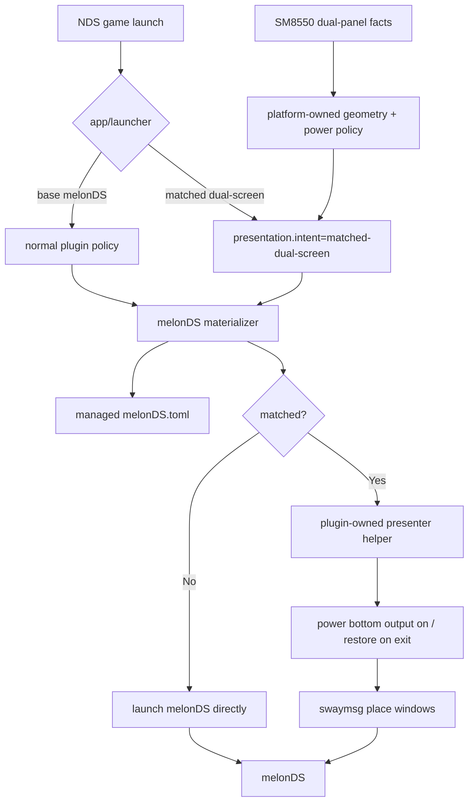

# feat: Productize melonDS matched dual-screen presentation

## Summary

Productize the working melonDS two-display setup as a first-party presentation option: users can choose a device-neutral “matched dual-screen” launcher/presentation, while SM8550/Thor platform defaults provide the physical outputs, pixel geometry, display environment, and input profile needed to realize it. Normal melonDS emulator-native display modes remain available through the base launcher for scaled, emphasized, vertical, horizontal, and single-window layouts.

---

## Problem Frame

The initial `@korri:melonds` plugin added Nintendo DS discovery, launch, TOML rendering, and dual-window seeding, but intentionally deferred exact physical monitor placement. The live Bandai validation proved the desired product behavior — top and bottom DS screens on separate physical panels with matched perceived scale — but it currently depends on a hand-written `/var/lib/korri/bin/melonds-dual-screen` wrapper and local YAML, which is not acceptable as product architecture.

---

## Requirements

- R1. Preserve existing portable melonDS display modes: `vertical`, `horizontal`, `hybrid`, `top-only`, `bottom-only`, and `dual-window` remain emulator-native options.
- R2. Add a device-neutral matched dual-screen presentation option; do not name it after Thor, Bandai, DSI connector names, or any specific device.
- R3. Keep physical output names, pixel geometry, display power policy, and per-device sizing in platform/device configuration, not in generic plugin defaults or game library entries.
- R4. Replace the temporary `/var/lib` launcher wrapper with plugin/module-owned generated launch behavior.
- R5. For matched dual-screen presentation, support the observed behavior: Gamescope bypass, native Wayland melonDS windows, top and bottom windows placed independently, top slightly scaled down relative to bottom, hidden melonDS menu bar, and InputPlumber/Xbox-style controls.
- R6. Ensure Tetris and future `.nds` games use first-party generic melonDS launchers, not game-specific process launchers.
- R7. Keep single-screen SM8550 devices safe: they must not receive unusable two-output placement defaults; explicit matched intent without complete geometry fails before spawn with a clear materialization diagnostic.
- R8. Cover policy, TOML rendering, launch materialization, platform defaults, display env, Gamescope bypass, and SM8550 config output with tests/checks.
- R9. Own secondary-display lifecycle for matched presentation as a transaction: record current state, power on as needed, place windows, and restore the observed prior state on exit; use configured defaults only as fallback.
- R10. Harden the presenter boundary: validated JSON payloads, argv-only process spawning, symlink-safe managed writes, allowlisted display env, and strict window-selector matching.
- R11. Require a dual-panel device smoke gate before cleanup/done: prove generic matched launch, two Wayland windows, expected rectangles, no Gamescope wrapper, hidden menu, output power restore, and working controls.

---

## Scope Boundaries

- No RetroArch DS support in this plan.
- No Android DS emulator support.
- No DSi, DSiWare, NAND, or firmware validation changes.
- No archive-member discovery changes.
- No portal settings UI for editing presentation values.
- No broad compositor/sessiond redesign. The slice may add a melonDS-specific presenter seam and SM8550 env/config defaults, but it should not replace the generic foreground-session model.
- No device-named user-facing presets such as `thor`, `bandai`, or `thor-ds-1to1`.
- No unconditional conversion of all melonDS launches to matched dual-screen. Matched presentation is an option; normal modes stay usable.

### Deferred to Follow-Up Work

- Portal layout picker after backend policy is stable.
- Generalized multi-window presentation framework if a second emulator needs this seam.
- Archive discovery for zipped `.nds` files.
- Capture a `docs/solutions/` learning after implementation proves the final shape on device.

---

## Context & Research

### Relevant Code and Patterns

- `product/plugins/melonds/src/plugin.ts` defines the existing `@korri:melonds` launcher, storage, system, package module, and default plugin settings.
- `product/plugins/melonds/src/policy.ts` validates current `state`, `boot`, `display`, and `video` policy.
- `product/plugins/melonds/src/config-render.ts` maps emulator-native display modes to `melonDS.toml`, including `dual-window` as `Window0` top-only and `Window1` bottom-only.
- `product/plugins/melonds/src/materializer.ts` owns state directory creation, atomic config writes, XDG env injection, and launch-spec composition.
- `product/plugins/gamescope/src/launch-companion/wrapper.ts` treats `launch.with."@korri:gamescope".enable = false` as a bypass, but this is resolved from launch policy rather than dynamically from plugin policy.
- `product/systems/nixos/images/platforms/rocknix-sm8550.nix` computes `resolvedHomeOutput`, `displayBottomConnector`, display facts, `sm8550PlatformDefaults`, and Sway `extraConfig`.
- `tools/testing/nix/korri-rocknix-sm8550-config-check.nix` is the right place for enabled-plugin, platform-default, display-env, and dual-panel/single-panel assertions.

### Institutional Learnings

- `docs/solutions/architecture-patterns/gamescope-as-plugin-owned-composition-2026-06-17.md`: plugin-specific policy and launch wrapping belong to the provider boundary.
- `docs/solutions/design-patterns/explicit-cascade-folded-policy-over-incidental-signal-heuristics-2026-05-27.md`: geometry should be explicit cascade-folded policy, not inferred from device names or argv.
- `docs/solutions/architecture-patterns/kiosk-foreground-app-policy-over-gamescope-overlay-2026-05-24.md`: session/foreground ownership and emulator presentation are separate concerns.
- `docs/solutions/runtime-errors/retroarch-bare-passthru-wrapper-injects-l-coredir-2026-05-27.md`: wrappers must be explicit, testable, and owned by product code.

### External References

- melonDS issue/request history indicates windowed menu-bar hiding is not a first-class melonDS option, so menu suppression is treated as Korri presentation behavior rather than an emulator-native display mode.

---

## Key Technical Decisions

- Separate emulator layout from presentation: `display.mode` means “what melonDS renders”; `presentation.intent` means “how Korri presents the resulting windows.”
- Use intent naming: `matched-dual-screen` is acceptable; Thor/Bandai/connector-derived names are not.
- Keep physical geometry platform-owned: generic TypeScript must not mention `DSI-1`, `DSI-2`, Thor, or Bandai.
- Use a generic first-party matched launcher, not a game-specific launcher. Keep `@korri:melonds/melonds` for normal modes and add a second generic app/launcher, such as `@korri:melonds/matched-dual-screen`, selected explicitly through `launch.use`/appId so app resolution is unambiguous.
- Do **not** rely on plugin policy to dynamically disable Gamescope after launch-companion resolution. Conditional Gamescope bypass must be expressed in the matched app/launcher cascade that already owns `launch.with`.
- Prefer a plugin-owned presenter helper for matched presentation. Static Sway `for_window` rules are too broad because they would constrain normal melonDS layouts.
- Matched dual-screen requires explicit complete geometry. If a user selects matched presentation without complete top/bottom geometry, materialization fails before spawn rather than guessing.
- The presenter must own bottom-output power for matched presentation as a transaction: record observed prior state, power on before placement, wait for output availability, and restore observed prior state in `finally`; configured platform default is fallback only if observation fails.
- Productize InputPlumber mapping as melonDS joystick config, not a Tetris-specific workaround.
- Treat menu hiding as presentation behavior; a Qt stylesheet is acceptable if kept generated, packaged, and tested around the pinned melonDS/Qt build.

---

## Open Questions

### Resolved During Planning

- Should the option be named after Thor/Bandai? No.
- Should matched presentation replace normal melonDS layouts? No; it is optional.
- Where do physical output names and sizes live? In platform/device configuration.
- Is Gamescope suitable for current dual-window DS presentation? No; nested Gamescope collapses the two top-level windows into one outer surface.
- What live melonDS window identity should inform tests? On Bandai, melonDS is a Wayland app with `app_id="net.kuribo64.melonDS"` and dual-window titles `[w1] ...` / `[w2] ...`.
- What happens when matched intent lacks geometry? Fail before spawn with a clear materialization diagnostic.
- What happens if a matched launcher receives a user-authored non-dual `display.mode`? Reject it with a named diagnostic; the matched launcher supplies `dual-window` internally and does not silently override explicit conflicting user intent.

### Deferred to Implementation

- Exact schema spelling (`presentation.intent` vs `display.presentation`) can be chosen during implementation, but the semantic split must remain.
- Exact matched launcher ID can be chosen during implementation, but the selection path is fixed: expose a second generic first-party app/launcher selected explicitly via `launch.use`/appId, not a profile that tries to change the app after resolution. A concrete candidate is `@korri:melonds/matched-dual-screen`.
- Exact presenter command/package shape can be adjusted while implementing Nix composition, as long as no `/var/lib` executable is required.
- Exact stylesheet/menu suppression mechanism should be validated against the pinned Qt/melonDS package.

---

## Output Structure

```text
product/plugins/melonds/
  packages/
    melonds-presenter/          # optional packaged helper
      default.nix
      README.md
  src/
    presentation.ts             # optional policy/geometry helper
    presentation.test.ts
    policy.ts
    policy.test.ts
    config-render.ts
    config-render.test.ts
    launch-spec.ts
    launch-spec.test.ts
    materializer.ts
    materializer.test.ts
  nix/
    composition.nix
    nixos-module.nix
    module-check.nix
    package-check.nix
```

The exact helper-file split may change, but presentation policy, launch composition, and package ownership stay under `product/plugins/melonds/`.

---

## High-Level Technical Design



### Presentation decision matrix

| User/platform policy | Emulator mode | Gamescope | Placement | Expected result |
|---|---|---|---|---|
| Base launcher, no matched intent | User/default mode | Normal platform default | None | Standard melonDS layout behavior. |
| Matched app/launcher with complete dual-panel geometry | Validated `dual-window` | Disabled by matched launcher policy | Presenter applies rectangles | Top/bottom screens on separate panels at matched perceived scale. |
| Matched app/launcher without complete geometry | N/A | N/A | None | Fail before spawn with materialization diagnostic. |
| Explicit non-dual display mode on base launcher | User-chosen mode | Normal platform default | None | User can use normal scale/emphasis modes. |

---

## Implementation Units

### U1. Extend melonDS policy for presentation intent and geometry

**Goal:** Add typed policy for presentation intent without conflating it with emulator-native display modes.

**Requirements:** R1, R2, R3, R7, R8

**Files:**
- Modify: `product/plugins/melonds/src/policy.ts`
- Modify: `product/plugins/melonds/src/policy.test.ts`
- Optional create: `product/plugins/melonds/src/presentation.ts`
- Optional create: `product/plugins/melonds/src/presentation.test.ts`
- Modify: `product/plugins/melonds/README.md`

**Approach:**
- Add presentation intent, with `matched-dual-screen` as the supported v1 intent.
- Add a strict geometry shape for platform-supplied top/bottom windows: output, x, y, width, height, and restore-power/default-power intent.
- Define precedence: matched presentation uses `dual-window` supplied by the matched launcher/default policy. If a user explicitly overrides matched mode to a non-dual `display.mode`, reject before spawn with a named diagnostic instead of silently overriding it.
- Reject matched intent without complete geometry before spawn.
- Keep connector/device names absent from generic defaults and tests except arbitrary fixture strings.

**Tests:**
- Matched intent plus complete geometry decodes.
- Normal display modes still decode without presentation policy.
- Matched intent with missing bottom/top geometry is rejected.
- Unknown presentation intent is rejected.
- Conflicting non-dual `display.mode` and matched intent is rejected with the named diagnostic.

---

### U2. Render managed TOML, input mapping, and menu-support files

**Goal:** Ensure matched presentation reliably starts as two melonDS windows with deterministic controller/menu behavior.

**Requirements:** R1, R4, R5, R8

**Dependencies:** U1

**Files:**
- Modify: `product/plugins/melonds/src/config-render.ts`
- Modify: `product/plugins/melonds/src/config-render.test.ts`
- Modify: `product/plugins/melonds/src/materializer.ts`
- Modify: `product/plugins/melonds/src/materializer.test.ts`
- Modify: `product/plugins/melonds/README.md`

**Approach:**
- Resolve matched presentation to melonDS `dual-window` TOML, with `Window0` top-only and `Window1` bottom-only.
- Render an explicit InputPlumber/Xbox-style joystick profile when requested: A/B/X/Y/L/R/Start/Select and D-pad hat mappings, with `JoystickID = 0` unless policy overrides it.
- Materialize menu-suppression support, such as a Qt stylesheet, under the managed melonDS state root when requested.
- Rewrite authoritative managed TOML on every launch because melonDS can rewrite config on exit.
- Keep normal display modes free of matched-placement assumptions.

**Tests:**
- Matched presentation renders both windows enabled and split top/bottom.
- InputPlumber/Xbox profile renders deterministic joystick mappings.
- Menu suppression disabled does not emit stylesheet args/files.
- A stale config with `Window1.Enabled = false` is replaced before launch.
- Existing save/savestate/cheat path tests remain green.

---

### U3. Add plugin-owned matched presenter launch path

**Goal:** Replace the local wrapper with product-owned launch behavior that can place melonDS windows only for matched presentation.

**Requirements:** R2, R3, R4, R5, R7, R8, R9

**Dependencies:** U1, U2

**Files:**
- Modify: `product/plugins/melonds/src/launch-spec.ts`
- Modify: `product/plugins/melonds/src/launch-spec.test.ts`
- Modify: `product/plugins/melonds/src/materializer.ts`
- Modify: `product/plugins/melonds/src/materializer.test.ts`
- Optional create: `product/plugins/melonds/packages/melonds-presenter/default.nix`
- Optional create: `product/plugins/melonds/packages/melonds-presenter/README.md`
- Modify: `product/plugins/melonds/nix/composition.nix`
- Modify: `product/plugins/melonds/nix/package-check.nix`

**Approach:**
- Keep direct melonDS launch for base/normal modes.
- For matched presentation, compose a plugin-owned presenter command that launches melonDS, reconciles outputs/windows, and exits with the child so sessiond owns one foreground lifecycle.
- Pass geometry, window selectors, display environment, and stylesheet/config inputs explicitly via a managed JSON payload with schema validation.
- Presenter lifecycle is transactional: validate payload → record secondary-output state → power output on if needed → wait for output availability → spawn melonDS with argv-only APIs → wait for exact windows → place windows → monitor child → restore observed prior output state in `finally`.
- Use live-observed defaults only as selector defaults: Wayland `app_id = "net.kuribo64.melonDS"`, titles matching `[w1]` and `[w2]`. Selectors must resolve to exactly one top window and exactly one bottom window within a bounded timeout; missing, duplicate, swapped, or ambiguous matches fail with cleanup.
- Require a direct Wayland/Sway contract for matched mode: matched launch env forces Wayland (`QT_QPA_PLATFORM=wayland`, no inherited X11-only backend), uses an allowlisted `WAYLAND_DISPLAY`, and gets compositor control from a trusted runtime/session env value rather than untrusted inherited env. Missing trusted compositor control should fail before spawn when detectable; if the compositor socket disappears between validation and placement, fail immediately with cleanup.
- Manage TOML, stylesheet, and payload files with explicit owner/mode expectations and symlink-safe writes.

**Tests:**
- Base launcher/direct mode still returns the melonDS binary and ROM path.
- Matched mode returns the presenter helper plus explicit payload path/env.
- Matched mode without complete geometry fails before spawn.
- Matched mode without required trusted compositor control fails deterministically with cleanup.
- Presenter command must be absolute and package-owned; tests reject `/var/lib` wrapper paths.
- Hostile ROM paths, connector names, title selectors, and JSON payload values cannot inject shell/sway commands because all spawning is argv-only and Sway criteria are escaped or rejected by validation.
- Window selector tests cover no match, duplicate `[w1]`, duplicate `[w2]`, swapped/ambiguous matches, and timeout cleanup.
- Placement order is explicit: exact windows → `floating enable` → move to configured output/workspace → resize and move to configured rectangle → assert expected geometry.

---

### U4. Add generic matched launcher and SM8550 dual-panel defaults

**Goal:** Enable the first-party plugin on SM8550 and bind matched presentation, Gamescope bypass, display env, and geometry through a generic app/launcher, not game-specific config.

**Requirements:** R2, R3, R5, R6, R7, R8, R9

**Dependencies:** U1, U2, U3

**Files:**
- Modify: `product/plugins/melonds/src/plugin.ts`
- Modify: `product/plugins/melonds/src/plugin.test.ts`
- Modify as-needed only: `product/plugin-host/index.ts`, `product/plugin-host/index.test.ts`, `product/plugin-host/bundled-plugins.generated.ts`, `product/plugin-host/roots.test.ts`
- Modify: `product/systems/nixos/images/platforms/rocknix-sm8550.nix`
- Modify: `tools/testing/nix/korri-rocknix-sm8550-config-check.nix`
- Inspect: `product/systems/nixos/flake/plugins.nix`

**Approach:**
- Add a generic matched presentation app/launcher, e.g. `@korri:melonds/matched-dual-screen`, to bind matched policy and `launch.with."@korri:gamescope".enable = false` separately from the base launcher.
- Keep `@korri:melonds/melonds` available for normal display modes.
- Do not rely on a profile to change which app was selected after resolver app selection; matched mode is selected by explicit launcher/app id.
- Add `@korri:melonds` to SM8550 enabled plugin env for daemon/sessiond/scout as appropriate.
- Include melonDS packages/modules in the SM8550 image path.
- For dual-panel SM8550, platform defaults provide matched geometry, trusted display env contract (`WAYLAND_DISPLAY` plus trusted compositor-control value), secondary-output power policy, menu suppression default, and InputPlumber/Xbox profile. Force Wayland for matched melonDS by overriding/scrubbing X11-biased env such as `DISPLAY=:0` and `GDK_BACKEND=x11` for this launcher.
- Avoid partial launcher replacement: if SM8550 writes a matched launcher override for the same id, it must emit a complete AppRecord that preserves the `@korri:melonds` plugin/materializer; otherwise put device geometry in a non-replacing policy seam.
- For single-panel SM8550, do not emit matched geometry defaults; base melonDS remains usable, and explicit matched selection fails cleanly.
- Do not set matched presentation as the unconditional default for every melonDS launch in this slice.

**Tests:**
- SM8550 daemon/sessiond/scout env includes `@korri:melonds` where required.
- Dual-panel SM8550 config exposes matched app/launcher defaults with device-neutral intent and device-owned geometry.
- Resolved matched launches still report the melonDS integration/materializer path rather than falling back to `@korri:process`.
- Single-panel SM8550 config does not emit unusable bottom-output geometry.
- Matched app/launcher disables Gamescope while the base launcher remains governed by normal platform Gamescope policy.
- Config checks include trusted display env, Wayland-forced matched mode, and secondary-output power policy for matched presentation.
- No Thor/Bandai-named preset appears in user-facing launcher/policy IDs.

---

### U5. Documentation, cleanup path, and implementation guardrails

**Goal:** Make the supported path obvious and prevent the prototype workaround from becoming permanent.

**Requirements:** R4, R6, R8

**Dependencies:** U1, U2, U3, U4

**Files:**
- Modify: `product/plugins/melonds/README.md`
- Modify: `work/items/active/20260708-melonds-matched-dual-screen-presentation/work.md`
- Optional modify: `product/plugin-host/*` only if U4 changes plugin registration shape.

**Approach:**
- Document the distinction between base launcher modes and the matched presentation app/launcher.
- Document that device geometry is platform-owned and not user-facing preset naming.
- Document that Korri-managed launches overwrite managed `melonDS.toml` keys on each launch.
- Document operational cleanup after deployment and verification:
  - remove `/var/lib/korri/config/melonds-local.korri.yaml`
  - remove or replace `/var/lib/korri/config/tetris-ds.korri.yaml` overrides that point at the local process launcher
  - remove `/var/lib/korri/bin/melonds-dual-screen`
- Do not automate deletion of operator-local files in product code.

**Tests:**
- README examples use generic first-party app/launcher IDs and no device-specific preset names.
- Plugin-host tests are updated only if registration actually changes; avoid churn otherwise.
- Work item status captures remaining deployment cleanup rather than claiming it is done before device validation.

---

## System-Wide Impact

- **Interaction graph:** readable library resolution → generic melonDS app/launcher → plugin materializer → optional presenter → sessiond foreground lifecycle → Sway output/window placement.
- **Error propagation:** invalid geometry, missing trusted display env when detectable, missing presenter executable, missing storage root, and absent secondary output should fail before spawn for matched mode; compositor-control loss after spawn fails immediately with cleanup.
- **State lifecycle:** melonDS rewrites `melonDS.toml`; the materializer must reassert managed config before every launch.
- **Companion policy:** conditional Gamescope bypass belongs to the matched app/launcher cascade, not dynamic plugin-policy inference after companion resolution.
- **Device lifecycle:** matched presentation records prior secondary-output state, powers it on for launch, and restores observed prior state on exit.
- **Runtime smoke:** product cleanup is blocked until dual-panel device smoke verifies generic matched launch resolution, no Gamescope wrapper, exact window rectangles, output lifecycle, hidden menu, and controls.
- **Unchanged invariants:** base melonDS display modes, other plugins, and existing Gamescope behavior for non-matched launchers remain unchanged.

---

## Risks & Mitigations

| Risk | Mitigation |
|------|------------|
| Matched presentation leaks Thor/Bandai naming into config | Use intent names only; keep connector names in SM8550 platform defaults/tests. |
| Gamescope bypass applies to all melonDS modes | Use a separate generic matched app/launcher for bypass; keep base launcher normal. |
| Static Sway rules constrain normal layouts | Use matched presenter path instead of unconditional global rules. |
| Presenter lacks Sway access | Make trusted compositor control and `WAYLAND_DISPLAY` an explicit runtime/session contract; fail deterministically if absent. |
| Bottom screen stays powered off or is incorrectly powered off after exit | Presenter records prior state, powers on, and restores observed prior state in `finally`. |
| Single-screen devices get off-screen windows | Do not emit matched geometry defaults; explicit matched intent without geometry fails before spawn. |
| melonDS rewrites config | Materializer rewrites authoritative TOML every launch. |
| Input profile differs by hardware | Scope Xbox-style profile to SM8550 platform defaults and make it explicit/overridable. |
| Qt stylesheet menu hiding regresses | Keep it contained and documented as presentation behavior; validate on pinned package and device smoke. |
| Payload/env injection affects Sway or process spawn | Validate payload schema, escape/reject unsafe selector values, spawn via argv-only APIs, and allowlist display env. |

---

## Alternative Approaches Considered

- **Device-named preset such as `thor-ds-1to1`:** rejected because the option should describe intent, not hardware identity.
- **Always-on Sway `for_window` rules for melonDS:** rejected because they would affect normal display modes.
- **Keep the `/var/lib` wrapper and local YAML:** rejected because it is not reproducible or testable.
- **Plugin policy dynamically disables Gamescope after resolution:** rejected for this plan because launch companions are resolved through launch policy; conditional bypass needs to live in the matched app/launcher cascade.
- **Wrap melonDS in one Gamescope instance:** rejected for matched dual-window because it hides the two top-level windows from Sway.

---

## Documentation / Operational Notes

- `product/plugins/melonds/README.md` should explain base display modes vs matched presentation.
- The README should say managed keys in `melonDS.toml` are overwritten each launch.
- Deployment notes should say to remove temporary Bandai local config/wrapper files only after dry-run and the required dual-panel device smoke gate confirm the first-party matched path works.

---

## Sources & References

- Existing plan: `work/items/active/20260707-ds-melonds-launcher-plugin/plan.md`
- Plugin guide: `product/plugins/AGENTS.md`
- Existing plugin files: `product/plugins/melonds/src/plugin.ts`, `product/plugins/melonds/src/policy.ts`, `product/plugins/melonds/src/config-render.ts`, `product/plugins/melonds/src/materializer.ts`, `product/plugins/melonds/src/launch-spec.ts`
- Platform defaults: `product/systems/nixos/images/platforms/rocknix-sm8550.nix`
- Platform config checks: `tools/testing/nix/korri-rocknix-sm8550-config-check.nix`
- Related learnings: `docs/solutions/architecture-patterns/gamescope-as-plugin-owned-composition-2026-06-17.md`, `docs/solutions/design-patterns/explicit-cascade-folded-policy-over-incidental-signal-heuristics-2026-05-27.md`, `docs/solutions/architecture-patterns/kiosk-foreground-app-policy-over-gamescope-overlay-2026-05-24.md`, `docs/solutions/runtime-errors/retroarch-bare-passthru-wrapper-injects-l-coredir-2026-05-27.md`
