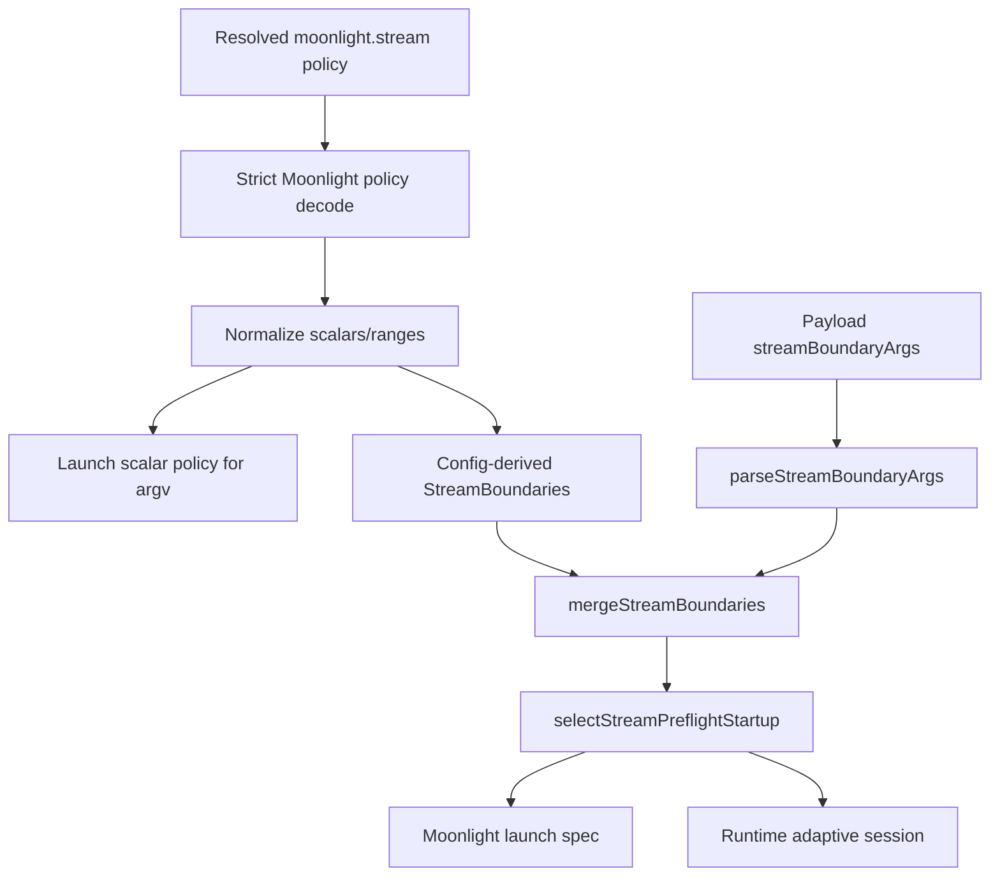

# feat: Add unified Moonlight stream range config

## Summary

Add first-class `moonlight.stream` range authoring for resolution, fps, and bitrate so stream launch defaults and adaptive bounds live in one config surface. Scalars remain the shorthand for locked values; expanded objects use `min`, `start`, and `max`, then map into the existing adaptive boundary/preflight/runtime path.

---

## Problem Frame

Korri currently has scalar Moonlight stream fields and a separate runtime boundary DSL for adaptive control. A recent attempt to expose persisted defaults as `moonlight.adaptive.boundaries` was reverted because it created two competing places to configure the same quality levers. The replacement should preserve cascade semantics and make the authoring shape feel like one stream policy, not a launch policy plus a second adaptive policy.

---

## Requirements

- R1. `moonlight.stream` must be the single persisted authoring namespace for launch quality and adaptive range defaults.
- R2. Scalar shorthand must mean a locked value: internally equivalent to `min = start = max` for that lever.
- R3. Expanded range objects must use user-facing names `min`, `start`, and `max`; the internal adaptive model may continue using `floor`, `startup`, and `ceiling` behind an adapter.
- R4. Resolution, fps, and bitrate must all support the unified authoring model without adding a separate `moonlight.adaptive` namespace.
- R5. Existing remote-source launches, from both portal/API and terminal CLI surfaces, must derive adaptive boundaries from resolved local Moonlight config and merge explicit per-launch boundary args through the existing boundary/preflight path.
- R6. Existing cascade behavior must remain understandable: more-specific config overrides less-specific config, and partial range objects deep-merge only where that is already the generic streamer-policy behavior.
- R7. The Moonlight binary argv must receive scalar launch-time values only; `min` and `max` are Korri-side adaptive bounds, not native Moonlight flags.
- R8. Tests must prove the authoring examples, shorthand expansion, invalid range rejection, cascade behavior, launch argv, and remote adaptive-boundary handoff.

---

## Scope Boundaries

- Do not reintroduce `moonlight.adaptive.boundaries`, `moonlight.adaptive.boundaryArgs`, or any other persisted parallel boundary namespace.
- Do not rename internal `StreamBoundaries` vocabulary (`floor`, `startup`, `ceiling`) as part of this work; map to it from the user-facing config shape.
- Do not mutate live Bandai config or deploy as part of this plan.
- Do not redesign the GUI, stream-control UI, or runtime readback surfaces.
- Do not make source-machine game-level Moonlight stream policy cross the remote prepare boundary in this slice.

### Deferred to Follow-Up Work

- Document and optionally support source-machine game-level stream constraints for remote launches if product requirements later demand per-game remote stream policy.
- Consider a future live-session guard if config-pinned levers should be hard locks against `app.stream-control.adaptive.set`; this plan treats pins as launch defaults that can still be overridden by explicit live operator action.

---

## Context & Research

### Relevant Code and Patterns

- `product/plugins/moonlight/src/config/policy.ts` owns the typed Moonlight policy schema and strict decode; platform config carries `moonlight` opaquely.
- `product/platform/library/config/streamer-policy.ts` defines `StreamerPolicy` as opaque `Record<string, unknown>` so platform config remains plugin-removable.
- `product/platform/library/config/inheritable-fields.ts` documents generic `moonlight` cascade merge rules, including deep object merge and scalar last-win behavior.
- `product/platform/library/config/readable-cascade-resolver.test.ts` already exercises cascade folding for `moonlight` fields and is the right place to lock scalar/range override behavior.
- `product/platform/stream/stream-adaptive-boundaries.ts` owns `StreamBoundaries`, `NumericLeverBoundary`, `ResolutionLeverBoundary`, `parseStreamBoundaryArgs`, `mergeStreamBoundaries`, and serialization.
- `product/platform/stream/stream-preflight.ts` selects/fills launch startup bitrate for existing boundary-arg flows that omit an explicit startup value; typed `moonlight.stream` ranges will require `start`.
- `product/apps/portal/api/library/launch.rpc-handler.ts` is the portal/API remote-source launch path that currently parses `payload.streamBoundaryArgs`, runs preflight, composes Moonlight launch policy, and registers runtime adaptive boundaries.
- `product/surfaces/terminal/korri-cli/launch-command.ts` is the terminal remote launch path and must receive the same config-derived boundary behavior as portal/API launches.
- `product/apps/portal/stream/moonlight-launcher.ts` contains `moonlightPolicyWithStartupBitrate`, the existing bridge from selected adaptive startup bitrate to the launch-time `-bitrate` Moonlight flag.
- `product/plugins/moonlight/src/plugin.ts` is the Moonlight `stream.launch` boundary and should strictly decode incoming policy instead of relying on type casts.
- `product/plugins/moonlight/src/moonlight-launch-spec.ts` renders scalar Moonlight launch policy into argv and must not emit range objects directly.

### Institutional Learnings

- Explicit cascade-folded policy should drive behavior instead of parallel mechanisms or heuristics. The reverted `moonlight.adaptive.boundaries` approach violated this by adding a second persisted policy surface for the same quality levers.
- Korri's config model favors one logical cascade tree. Stream ranges should be fields on the existing `moonlight.stream` object, not an adjacent policy bucket.
- Native Moonlight and Sunshine forks should expose mechanisms and facts; Korri TypeScript policy decides when to act. Therefore range bounds stay in Korri adaptive control and only launch-time scalar values become Moonlight argv.
- Runtime readback is separate from configured targets. Configured `min/start/max` values are controller inputs, not proof that a value is currently applied.

### External References

- External research skipped: local patterns and recent reverted work directly establish the implementation constraints.

---

## Key Technical Decisions

- Keep the persisted field name `bitrateKbps` for this slice: it preserves the existing config contract and avoids an unnecessary rename while adding the range shape. The unit remains explicit in the field name.
- Use `start` as the user-facing launch-time value name. Internally, map it to `startup` only when building `StreamBoundaries` or selecting launch-time bitrate.
- Treat `start` for fps and resolution as the initial Moonlight argv value, not a new adaptive-controller startup concept. The adaptive controller continues to use floor/ceiling/pinned bounds after the session starts.
- Require `start` when resolution is authored as a range. Without it, there is no unambiguous `-width`/`-height` value to launch Moonlight with.
- Require `start` for every expanded range object, including bitrate. Preflight may still fill startup for explicit `streamBoundaryArgs`, but persisted `moonlight.stream` ranges must name their launch-time value.
- Merge config-derived boundaries before per-launch `streamBoundaryArgs`, so explicit launch/RPC args remain the more-specific override.
- Keep typed Moonlight validation in the plugin boundary and keep the platform config cascade opaque. Shared conversion helpers may live next to Moonlight launcher/policy adapter code, but platform cascade code should not learn Moonlight schema details.
- Remove the reverted `moonlight.adaptive` interface rather than supporting it as an alias. Persisted YAML should have one way to express stream ranges.

---

## Open Questions

### Resolved During Planning

- Should the user-facing range field be called `startup` or `start`? Use `start`.
- Should the replacement create a separate adaptive config namespace? No; use `moonlight.stream` only.
- Should scalar shorthand be preserved? Yes; scalars mean locked values.

### Deferred to Implementation

- Exact helper names and file placement for conversion functions may be adjusted to fit imports cleanly while preserving ownership boundaries.
- Exact TypeScript Schema composition for structural unions is deferred to implementation; tests should drive the shape under strict decode mode.
- Whether future UI surfaces display configured ranges is deferred; this plan only covers config, launch, and adaptive handoff.

---

## High-Level Technical Design

> *This illustrates the intended approach and is directional guidance for review, not implementation specification. The implementing agent should treat it as context, not code to reproduce.*

Authoring shape:

```yaml
host:
  moonlight:
    stream:
      resolution:
        min:
          width: 640
          height: 360
        start:
          width: 1280
          height: 720
        max:
          width: 1920
          height: 1080

      fps: 120

      bitrateKbps:
        min: 500
        start: 6000
        max: 40000
```

Equivalent shorthand expansion for locked values:

```yaml
host:
  moonlight:
    stream:
      resolution:
        width: 1280
        height: 720
      fps: 120
      bitrateKbps: 12000
```

Conceptual mapping:

| Config authoring | Launch argv | Adaptive boundary |
| --- | --- | --- |
| `fps: 120` | `-fps 120` | fps pinned to 120 |
| `fps: { min: 60, start: 120, max: 120 }` | `-fps 120` | fps floor 60, ceiling 120 |
| `bitrateKbps: 12000` | `-bitrate 12000` | bitrate pinned to 12000 |
| `bitrateKbps: { min: 500, start: 6000, max: 40000 }` | `-bitrate 6000` | bitrate floor 500, startup 6000, ceiling 40000 |
| `resolution: { width: 1280, height: 720 }` | `-width 1280 -height 720` | resolution pinned to 1280x720 |
| `resolution: { min, start, max }` | `-width/-height` from `start` | resolution floor/ceiling from min/max |

Flow:



---

## Implementation Units

### U1. Replace the Moonlight stream schema with scalar-or-range fields

**Goal:** Define the canonical config interface under `moonlight.stream` and remove the reverted separate adaptive namespace from the typed Moonlight policy.

**Requirements:** R1, R2, R3, R4, R8

**Dependencies:** None

**Files:**
- Modify: `product/plugins/moonlight/src/config/policy.ts`
- Test: `product/plugins/moonlight/src/config/policy.test.ts`

**Approach:**
- Extend `resolution`, `fps`, and `bitrateKbps` to accept either existing shorthand or expanded range objects.
- Preserve existing scalar forms for backwards compatibility:
  - `resolution: { width, height }`
  - `fps: number`
  - `bitrateKbps: number | null`
- Add range objects using `min`, `start`, and `max`.
- Reject `moonlight.adaptive` as excess policy instead of aliasing it.
- Validate range ordering where all relevant values are present: `min <= start <= max`.
- Validate resolution bounds require complete width/height pairs and require `start` when `min` or `max` is present.

**Execution note:** Implement schema and validation test-first so strict decode behavior is locked before launch wiring changes.

**Patterns to follow:**
- Strict Effect Schema decode in `product/plugins/moonlight/src/config/policy.ts`.
- Retired vocabulary rejection tests in `product/plugins/moonlight/src/config/policy.test.ts`.

**Test scenarios:**
- Happy path: decode existing scalar `resolution`, `fps`, and `bitrateKbps` unchanged.
- Happy path: decode `fps: { min: 60, start: 120, max: 120 }`.
- Happy path: decode `bitrateKbps: { min: 500, start: 6000, max: 40000 }`.
- Happy path: decode resolution range with complete `min`, `start`, and `max` width/height pairs.
- Error path: reject bitrate range with `min`/`max` but no `start`.
- Edge case: preserve `bitrateKbps: null` as the existing “do not emit bitrate flag” behavior.
- Error path: reject `start` below `min` or above `max`.
- Error path: reject resolution range missing `start`.
- Error path: reject partial resolution dimensions inside any bound.
- Error path: reject `moonlight.adaptive.boundaries` as an unknown field.

**Verification:**
- Moonlight policy tests prove the public YAML-facing shape and invalid cases.
- No persisted adaptive namespace is accepted by the plugin schema.

---

### U7. Validate Moonlight policy at the stream launch boundary

**Goal:** Ensure the real Moonlight plugin launch boundary enforces the new schema instead of accepting opaque policy casts that can bypass validation.

**Requirements:** R1, R3, R4, R8

**Dependencies:** U1

**Files:**
- Modify: `product/plugins/moonlight/src/plugin.ts`
- Test: `product/plugins/moonlight/src/plugin.test.ts`

**Approach:**
- Replace policy type-casting at the `stream.launch` handler boundary with strict `decodeMoonlightPolicy` validation.
- Preserve the platform invariant that `moonlight` is carried opaquely until it reaches the Moonlight plugin boundary.
- Surface schema failures as existing plugin/launch configuration failures, not as later argv rendering failures.

**Patterns to follow:**
- Existing `decodeMoonlightPolicy` helper in `product/plugins/moonlight/src/config/policy.ts`.
- Existing plugin handler tests in `product/plugins/moonlight/src/plugin.test.ts`.

**Test scenarios:**
- Happy path: plugin launch accepts scalar stream policy and composes the same launch spec as before.
- Happy path: plugin launch accepts range stream policy after U1 schema support.
- Error path: plugin launch rejects `moonlight.adaptive` policy before composing or spawning.
- Error path: plugin launch rejects range policy missing required `start`.

**Verification:**
- Invalid persisted or RPC-carried Moonlight policy cannot bypass validation through a cast.

---

### U2. Add stream-policy normalization and boundary conversion

**Goal:** Convert the unified `moonlight.stream` policy into two products: scalar launch-time values for Moonlight argv and `StreamBoundaries` for adaptive control.

**Requirements:** R2, R3, R5, R7, R8

**Dependencies:** U1

**Files:**
- Modify: `product/apps/portal/stream/moonlight-launcher.ts`
- Modify or create: `product/plugins/moonlight/src/config/policy.ts` or `product/apps/portal/stream/moonlight-stream-policy.ts`
- Test: `product/plugins/moonlight/src/config/policy.test.ts` and/or new focused test beside the helper

**Approach:**
- Add a pure conversion seam that maps user-facing fields to internal `StreamBoundaries`:
  - scalar numeric values become pinned boundaries;
  - range `min/start/max` maps to `floor/startup/ceiling` for bitrate;
  - range `min/max` maps to floor/ceiling for fps and resolution;
  - `start` for fps/resolution is retained for launch scalar selection, not as a controller startup field.
- Add a normalization seam that resolves launch-time scalar values:
  - scalar fields render as themselves;
  - range fields render `start` for launch;
  - persisted bitrate ranges require `start`; preflight fill remains for explicit boundary-arg flows, not for typed config ranges.
- Keep conversion at Moonlight adapter boundaries rather than teaching platform cascade code about Moonlight policy.

**Technical design:** Directional mapping table:

| User field | Boundary field | Launch scalar source |
| --- | --- | --- |
| `min` | `floor` | never directly rendered |
| `start` | `startup` for bitrate only | rendered for resolution/fps/bitrate |
| `max` | `ceiling` | never directly rendered unless scalar shorthand pins |

**Patterns to follow:**
- `moonlightPolicyWithStartupBitrate` in `product/apps/portal/stream/moonlight-launcher.ts`.
- `mergeStreamBoundaries` and boundary type definitions in `product/platform/stream/stream-adaptive-boundaries.ts`.

**Test scenarios:**
- Happy path: scalar `fps: 120` produces pinned fps boundary and launch scalar 120.
- Happy path: scalar `bitrateKbps: 12000` produces pinned bitrate boundary and launch scalar 12000.
- Happy path: bitrate range with `start` produces floor/startup/ceiling and launch scalar from `start`.
- Happy path: resolution range produces floor/ceiling and launch scalar from `start`.
- Error path: bitrate range without `start` is rejected before conversion.
- Edge case: `bitrateKbps: null` produces no bitrate launch scalar or adaptive bitrate boundary.
- Error path: impossible range shapes are rejected by U1 before conversion runs.

**Verification:**
- Conversion tests show the exact `StreamBoundaries` object that existing preflight/runtime code will receive.
- Launch normalization never passes range objects into Moonlight argv rendering.

---

### U3. Render Moonlight launch argv from normalized stream values

**Goal:** Ensure the Moonlight launch spec renderer emits only scalar command-line flags while accepting resolved range-aware policies.

**Requirements:** R2, R4, R7, R8

**Dependencies:** U1, U2

**Files:**
- Modify: `product/plugins/moonlight/src/moonlight-launch-spec.ts`
- Test: `product/plugins/moonlight/src/moonlight-launch-spec.test.ts`

**Approach:**
- Update stream arg rendering to use normalized launch scalar values instead of directly stringifying `stream.fps` or `stream.bitrateKbps`.
- Preserve current arg order and existing flags for scalar policies.
- For range policies, render `start` for fps/resolution/bitrate when present.
- Leave `min` and `max` out of argv entirely; those are adaptive-controller inputs.

**Patterns to follow:**
- Existing `renderStreamArgs` behavior and tests in `product/plugins/moonlight/src/moonlight-launch-spec.test.ts`.
- Existing validation that resolution requires both width and height.

**Test scenarios:**
- Happy path: existing scalar stream policy renders exactly the same args as before.
- Happy path: `fps: { min: 60, start: 120, max: 120 }` renders `-fps 120`.
- Happy path: resolution range with `start: 1280x720` renders `-width 1280 -height 720`.
- Happy path: bitrate range with `start: 6000` renders `-bitrate 6000`.
- Error path: bitrate range without `start` never reaches the renderer because schema validation rejects it.
- Error path: renderer does not stringify objects as `[object Object]` for any stream lever.

**Verification:**
- Moonlight launch spec tests prove scalar backwards compatibility and range launch-time rendering.

---

### U4. Wire config-derived boundaries into remote-source launches

**Goal:** Make GUI/portal remote-source launches use resolved local `moonlight.stream` policy as adaptive defaults while preserving explicit launch boundary overrides.

**Requirements:** R1, R5, R7, R8

**Dependencies:** U2, U3

**Files:**
- Modify: `product/apps/portal/api/library/launch.rpc-handler.ts`
- Test: `product/apps/portal/api/library/launch.rpc-handler.test.ts`

**Approach:**
- Resolve local Moonlight launcher policy before stream preflight for remote-source launches.
- Convert `localPolicy.moonlight.stream` into config-derived boundaries.
- Parse existing `payload.streamBoundaryArgs` as the explicit per-launch override surface.
- Merge in this order: config-derived boundaries first, payload boundary args second.
- Pass the merged boundaries into `selectStreamPreflightStartup` and then reuse the existing `preflight.boundaries` output for launch policy normalization and runtime session registration.
- Keep `streamBoundaryArgs` supported as an RPC/CLI runtime override surface, not as persisted YAML authoring syntax.

**Patterns to follow:**
- Existing `streamPreflightFromPayload` flow in `product/apps/portal/api/library/launch.rpc-handler.ts`.
- Existing tests for remote-source bitrate startup and preflight rejection in `product/apps/portal/api/library/launch.rpc-handler.test.ts`.

**Test scenarios:**
- Happy path: remote launch with `moonlight.stream.resolution.start`, `fps`, and bitrate range starts Moonlight with `-width 1280 -height 720 -fps 120 -bitrate 6000`.
- Error path: remote launch with config bitrate range lacking `start` fails policy validation before peer prepare/spawn.
- Integration: config-derived boundaries are registered with runtime adaptive session when runtime control is enabled.
- Integration: `streamBoundaryArgs` override config-derived bounds for the same lever.
- Edge case: config with only fps/resolution and no bitrate does not force bitrate preflight.
- Error path: invalid resolved Moonlight stream policy returns launch configuration failure before peer prepare/spawn.
- Regression: no `moonlight.adaptive` field is read from local policy.

**Verification:**
- Remote launch handler tests prove GUI/portal launches can request the desired 720p/120 start with 360p..1080p adaptive resolution and pinned 120fps using config only.

---

### U8. Wire config-derived boundaries into terminal remote launches

**Goal:** Give terminal `korri launch` / remote Moonlight launches the same config-derived adaptive defaults as portal/API launches.

**Requirements:** R1, R5, R7, R8

**Dependencies:** U2, U3

**Files:**
- Modify: `product/surfaces/terminal/korri-cli/launch-command.ts`
- Modify if needed: `product/surfaces/terminal/korri-cli/moonlight-launch-policy.ts`
- Test: `product/surfaces/terminal/korri-cli/launch-command.test.ts`
- Test if needed: `product/surfaces/terminal/korri-cli/moonlight-launcher.test.ts`

**Approach:**
- Resolve local Moonlight launcher policy before terminal remote preflight when a remote Moonlight launch is selected.
- Convert `moonlight.stream` into config-derived boundaries through the same helper used by portal/API wiring.
- Merge config-derived boundaries before CLI `streamBoundaryArgs` so explicit command-line overrides remain more specific.
- Pass the effective boundaries into the existing preflight and `launchMoonlight` options rather than adding a CLI-specific config path.

**Patterns to follow:**
- Existing terminal remote launch tests for `streamBoundaryArgs` in `product/surfaces/terminal/korri-cli/launch-command.test.ts`.
- Existing local Moonlight policy resolution in `product/surfaces/terminal/korri-cli/moonlight-launch-policy.ts`.

**Test scenarios:**
- Happy path: CLI remote launch with configured 720p/120 start and 360p..1080p bounds passes matching `adaptiveBoundaries` to Moonlight launch.
- Integration: CLI `streamBoundaryArgs` override configured bounds for the same lever.
- Error path: invalid configured range fails before remote prepare/launch.
- Regression: CLI behavior with no configured ranges and no `streamBoundaryArgs` is unchanged.

**Verification:**
- Portal/API and CLI remote Moonlight launches have parity for top-level `moonlight.stream` defaults.

---

### U5. Preserve cascade semantics for scalar/range overrides

**Goal:** Lock how the generic config cascade behaves when less-specific and more-specific layers mix scalar and range forms.

**Requirements:** R1, R2, R6, R8

**Dependencies:** U1

**Files:**
- Modify: `product/platform/library/config/readable-cascade-resolver.test.ts`
- Modify if required: `product/platform/library/config/cascade-resolver.ts`

**Approach:**
- Prefer using the existing generic streamer-policy merge rather than adding Moonlight-specific cascade behavior.
- Test the intended semantics explicitly:
  - scalar in a more-specific layer replaces a range from a less-specific layer;
  - range in a more-specific layer replaces a scalar from a less-specific layer;
  - partial range object in a more-specific layer deep-merges with a less-specific range object, matching existing object merge behavior.
- Only change cascade code if tests reveal the current generic behavior does not match the chosen semantics.

**Patterns to follow:**
- Existing `moonlight.input.devices`, `moonlight.environment`, and `moonlight.stream` cascade tests in `product/platform/library/config/readable-cascade-resolver.test.ts`.
- Merge rules documented in `product/platform/library/config/inheritable-fields.ts`.

**Test scenarios:**
- Happy path: host `fps: 60`, profile `fps: { min: 30, start: 60, max: 60 }` resolves to the profile range.
- Happy path: host `bitrateKbps: { min: 500, start: 6000, max: 40000 }`, profile `bitrateKbps: 12000` resolves to scalar 12000.
- Edge case: host `fps: { min: 30, start: 60, max: 120 }`, profile `fps: { min: 50 }` resolves with inherited `start: 60` and `max: 120` if generic deep-merge remains the chosen behavior.
- Regression: environment/input list merge semantics are not changed by range support.

**Verification:**
- Cascade tests document how users can override ranges across host/user/profile/launcher layers without adding custom Moonlight cascade code.

---

### U6. Update examples and validation notes for the new authoring shape

**Goal:** Show the final user-facing config shape and remove examples that encourage the separate boundary DSL as persisted YAML.

**Requirements:** R1, R2, R3, R4

**Dependencies:** U1, U2, U3, U4, U5, U7, U8

**Files:**
- Modify: `korri-catalog-display-metadata.example.yaml`
- Modify: `docs/brainstorms/2026-06-08-002-moonlight-policy-one-to-one.example.yaml`
- Modify if needed: `docs/korri-stream-adaptive-validation-runbook.md`

**Approach:**
- Update examples to show both shorthand and expanded range authoring under `host.moonlight.stream`.
- Prefer the user's target example as the canonical expanded shape:
  - resolution `min/start/max` from 360p through 720p start to 1080p max;
  - `fps: 120` shorthand as a lock;
  - `bitrateKbps` scalar or range depending on the example's purpose.
- If the validation runbook references boundary arg syntax, clarify that boundary args remain a CLI/RPC control surface while persisted config uses `moonlight.stream`.

**Patterns to follow:**
- Existing readable config examples in `korri-catalog-display-metadata.example.yaml`.
- Moonlight policy example commentary in `docs/brainstorms/2026-06-08-002-moonlight-policy-one-to-one.example.yaml`.

**Test scenarios:**
- Test expectation: none for prose/example-only edits, but schema/example snippets should correspond to shapes already covered by U1-U5, U7, and U8 tests.

**Verification:**
- A reader can copy the documented `host.moonlight.stream` shape without using `moonlight.adaptive` or boundary DSL strings.

---

## System-Wide Impact

- **Interaction graph:** Config cascade resolves opaque `moonlight` policy; Moonlight plugin/adapter validates and normalizes; portal/API and CLI remote launch handlers merge config-derived and explicit launch boundaries; preflight remains available for boundary-arg flows; Moonlight spec renderer emits scalar argv; runtime adaptive session receives bounds.
- **Error propagation:** Invalid persisted policy should fail during policy decode/launch configuration before peer prepare or spawn, producing existing launch-configuration failure responses.
- **State lifecycle risks:** Config ranges are launch defaults. Runtime `adaptive.set` remains a live operator override for the current session and is not persisted by this work.
- **API surface parity:** Persisted YAML moves to typed `moonlight.stream` ranges. Existing RPC/CLI `streamBoundaryArgs` remain supported as launch/live override inputs but should not be documented as persisted config authoring.
- **Integration coverage:** Portal/API and CLI remote-source launch tests are required because the bug-prone seam is cross-layer: config policy → boundary conversion → preflight → argv → runtime registration.
- **Unchanged invariants:** Platform config continues to carry streamer policy opaquely; native Moonlight receives only scalar flags; adaptive controller continues using internal `StreamBoundaries` types.

---

## Risks & Dependencies

| Risk | Mitigation |
|------|------------|
| Structural union ambiguity for `resolution` under strict Schema decode | Add decode tests for scalar and range forms before wiring launch behavior. |
| Range objects accidentally stringify into Moonlight argv | Add launch-spec tests that assert no object values are emitted and expected scalar start values are used. |
| Duplicate persisted policy surfaces reappear | Treat `moonlight.adaptive` as invalid and cover it in retired-vocabulary tests. |
| Cascade deep-merge surprises users for partial range objects | Document and test existing generic streamer-policy behavior; do not silently invent Moonlight-specific merge rules. |
| Bitrate preflight conflicts with explicit config `start` | Require typed config ranges to include `start`; keep preflight fill for explicit boundary-arg flows only. |
| Remote launch uses local launcher policy only | Keep this as an explicit scope boundary; defer cross-machine game-level stream constraints. |

---

## Documentation / Operational Notes

- The final authoring examples should make `start` visibly the launch-time value and avoid the term `startup` in user-facing YAML.
- Boundary DSL examples should be framed as CLI/RPC inputs only, not as persisted config.
- Bandai validation can reuse the existing adaptive validation runbook once the new config shape produces equivalent effective boundaries.

---

## Sources & References

- Work item: `work/items/active/20260710-unified-moonlight-stream-config/work.md`
- Current Moonlight policy schema: `product/plugins/moonlight/src/config/policy.ts`
- Moonlight launch spec renderer: `product/plugins/moonlight/src/moonlight-launch-spec.ts`
- Remote launch handler: `product/apps/portal/api/library/launch.rpc-handler.ts`
- Moonlight launcher/runtime bridge: `product/apps/portal/stream/moonlight-launcher.ts`
- Stream boundary model: `product/platform/stream/stream-adaptive-boundaries.ts`
- Stream preflight: `product/platform/stream/stream-preflight.ts`
- Cascade merge rules: `product/platform/library/config/inheritable-fields.ts`
- Opaque streamer policy: `product/platform/library/config/streamer-policy.ts`
- Config cascade tests: `product/platform/library/config/readable-cascade-resolver.test.ts`
- Example config: `korri-catalog-display-metadata.example.yaml`
