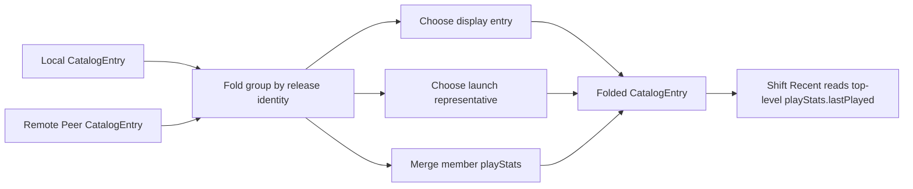

# fix: Preserve Play Stats Across Federated Catalog Folds

## Summary

Extend the existing catalog fold so a folded logical game/release carries merged `playStats` from every member entry in the fold group. Folding remains the desired federated behavior; the change makes Shift Recent ask the intended question: “has this game been played recently anywhere the coordinator can see?”

---

## Problem Frame

Bandai’s fabric catalog can see AKA entries and correctly folds duplicate Steam/provider identities, but the folded representative currently inherits `playStats` from the display entry only. When the local display entry has no `lastPlayed`, a remote AKA sibling with `playStats.lastPlayed` is folded away for Recent purposes, so Shift omits a game that was recently played in the federation.

---

## Requirements

- R1. Federated release folding remains a feature: duplicate local/remote entries with the same exact release identity continue to render as one logical catalog item.
- R2. A folded catalog entry exposes `playStats.lastPlayed` when any member entry in the fold group has been played.
- R3. A folded catalog entry’s `lastPlayed` is the newest `lastPlayed` across all member entries in the fold group.
- R4. A folded catalog entry’s `playCount` and `totalPlaytimeSeconds` sum only the currently visible per-member derived stats; this slice does not replicate logs, persist fold-group history, or dedupe sessions across peers.
- R5. Shift Recent continues to sort and cap by the folded entry’s top-level `playStats.lastPlayed`; Shift must not inspect `launchAlternatives`, source host, availability, or raw duplicate entries to infer recency.
- R6. Existing launch representative, display metadata, availability, and `launchAlternatives` routing semantics remain unchanged.
- R7. Unfolded/self snapshots and singleton fold groups keep their current playStats behavior.

---

## Scope Boundaries

- Do not undo or weaken release folding. A shared provider/hash identity still produces one user-facing item.
- Do not add play-history fields to `LaunchAlternative`; alternatives are routing choices, not metadata sources for UI inference.
- Do not change Shift’s Recent algorithm beyond regression coverage. The daemon/catalog layer must stamp the folded fact.
- Production changes should be limited to the catalog fold projection unless a test exposes an existing serialization/type mismatch. Shift changes are test-only in this slice.
- Do not introduce cross-device play-log replication, durable fold-group play-history storage, or session-id deduplication in this slice.
- Do not change launch routing, remote stream preparation, install state, or Steam/provider identity matching.

### Deferred to Follow-Up Work

- If play logs become replicated across peers later, add stable play-session ids and dedupe semantics before summing cross-peer play counts/time.
- Consider a richer “where this was played” history view separately; Recent only needs the merged folded `playStats` fact.

---

## Context & Research

### Relevant Code and Patterns

- `product/apps/portal/api/catalog/fold-catalog-entries.ts` groups entries by exact release identity, chooses a launch representative, chooses a display entry, and returns the folded `CatalogEntry`. Today `...display` is the only source of `playStats` in the folded result.
- `product/apps/portal/api/catalog/catalog-snapshot.ts` calls `foldCatalogEntries` for `scope: "fabric"`; `scope: "self"` returns local entries unfolded.
- `product/apps/portal/peers/peer-source-fetcher.ts` spreads remote peer self entries and only overwrites `source`, so peer-provided `playStats` already survives peer fetch.
- `product/apps/portal/api/catalog/snapshot.rpc.ts` builds `CatalogEntrySchema` from `PlayableLibraryEntry.fields`, so the wire schema already includes `playStats`.
- `product/platform/library/play-stats.ts` defines the derived stats shape and derivation rules: newest `lastPlayed`, counted entries, and summed duration.
- `product/surfaces/web/shift/routes/ShiftHomeRoute.tsx` already filters Recent by `entry.playStats?.lastPlayed` and sorts by that timestamp; it should keep consuming a single top-level catalog fact.

### Institutional Learnings

- `work/items/active/01KVVMYE5SFC4H8X5H0EBY7WG3-federated-single-file-folding/plan.md` establishes that folding and availability are daemon/catalog-layer facts consumed by surfaces.
- `work/items/active/01KWM98ZFYY12JTNYWDJ2MD18C-play-log-recording/requirements.md` states that plays count regardless of where the game runs and that existing recency surfaces read derived play stats.
- `docs/solutions/design-patterns/explicit-cascade-folded-policy-over-incidental-signal-heuristics-2026-05-27.md` says emitters should stamp facts explicitly; consumers should not infer from incidental signals.
- `docs/solutions/architecture-patterns/physical-host-foreground-lifecycle-truth-is-sessiond-2026-05-29.md` keeps play recording tied to authoritative session lifecycle; this plan does not alter recording.

### External References

- External research intentionally skipped. The fix follows local catalog-fabric, fold, play-stats, and Shift consumption patterns.

---

## Key Technical Decisions

- **Merge play stats inside the fold engine:** `foldCatalogEntries` already owns the group of equivalent entries, so it is the correct place to stamp the folded `playStats` fact.
- **Use an explicit never-played merge contract:** return `undefined` only when no group member has `playStats`; preserve a singleton member’s `playStats` exactly; otherwise merge defined stats by taking the newest defined `lastPlayed` and summing `playCount` / `totalPlaytimeSeconds` from every defined `playStats`.
- **Keep Recent game/release-centric, not host-centric:** `lastPlayed` is the newest timestamp among all visible fold members, independent of which member is local, launchable, or selected as display.
- **Treat counts and duration as additive under current federation:** Peer self snapshots expose each host’s local derived stats; the coordinator can safely sum visible `playCount` and `totalPlaytimeSeconds` for this trusted-LAN, non-replicated model.
- **Preserve launch/display selection unchanged:** Play-history merging is metadata projection only; it must not affect `id`, `itemId`, `releases`, `source`, `availability`, or `launchAlternatives` selection.
- **Keep UI simple:** Shift continues to use top-level `playStats`; no UI-side alternative inspection or host-specific heuristics.

---

## Open Questions

### Resolved During Planning

- Should folding be treated as a problem? No. Folding is the intended federated model; the issue is that folded metadata currently loses sibling play history.
- Should Shift inspect alternatives to recover remote last-played state? No. The catalog layer should emit one folded fact.
- Should remote peer `playStats` count toward Recent? Yes, for the current product intent: Recent answers whether the logical game was recently played in the federation the coordinator can see.

### Deferred to Implementation

- Exact helper naming and import placement for the playStats merge helper in `fold-catalog-entries.ts`.
- Whether any existing tests assume zero-valued `playStats` on a never-played folded entry; if they do, preserve that pre-existing caller contract while still keeping absent `lastPlayed` as the Recent signal.

---

## High-Level Technical Design

> *This illustrates the intended approach and is directional guidance for review, not implementation specification. The implementing agent should treat it as context, not code to reproduce.*

Merge behavior, conceptually:

| Member stats visible in fold group | Folded `lastPlayed` | Folded count/time |
|---|---|---|
| None | no merged `playStats` unless an existing caller contract requires a zero-valued object | preserve current never-played behavior |
| One member with stats | that member’s `lastPlayed` | preserve that member’s `playStats` exactly |
| Multiple members with stats | newest defined member `lastPlayed` | sum visible count/time |

---

## Implementation Units

### U1. Merge playStats in folded catalog entries

**Goal:** Make folded catalog entries carry a merged play-history fact computed from all entries in the fold group.

**Requirements:** R1, R2, R3, R4, R6, R7

**Dependencies:** None

**Files:**
- Modify: `product/apps/portal/api/catalog/fold-catalog-entries.ts`
- Modify: `product/apps/portal/api/catalog/catalog-folding-fixtures.ts`
- Test: `product/apps/portal/api/catalog/fold-catalog-entries.test.ts`

**Approach:**
- Add a small fold-local helper that reads each group member’s optional `playStats` and computes the folded `playStats` value.
- Apply the merged value after the `...display` spread so the folded result is not limited to the chosen display entry’s history.
- Keep the existing `id`, `itemId`, `containedId`, `releases`, `launchable`, `source`, `availability`, and `launchAlternatives` assignments unchanged.
- Extend the catalog folding fixtures with a playStats option instead of hand-building large catalog entries in every test.

**Patterns to follow:**
- `foldCatalogEntries` grouping and `foldGroup` representative-selection style in `product/apps/portal/api/catalog/fold-catalog-entries.ts`.
- `PlayStats` shape and derivation intent in `product/platform/library/play-stats.ts`.
- Existing fixture helpers in `product/apps/portal/api/catalog/catalog-folding-fixtures.ts`.

**Test scenarios:**
- Happy path: local and remote entries share a provider identity; local has no `lastPlayed`, remote has `lastPlayed`; folded entry keeps the local launch/display representative but exposes the remote `lastPlayed`.
- Happy path: local and remote entries both have stats; folded entry uses the newest `lastPlayed` and sums `playCount` / `totalPlaytimeSeconds`.
- Edge case: three peers in one fold group with mixed played and never-played members; folded stats ignore missing `lastPlayed` members for recency while still handling zero counts/time consistently.
- Edge case: singleton folded group preserves its existing `playStats` exactly.
- Edge case: no group member has `playStats.lastPlayed`; folded entry remains never-played according to the current catalog contract.
- Regression: launch representative and launch alternatives remain the same as existing folding tests for local-preferred and remote fallback cases.

**Verification:**
- Folded catalog entries expose merged `playStats` without changing representative selection or availability semantics.
- Existing folding tests continue to pass, proving identity-based folding remains intact.

---

### U2. Prove fabric snapshots publish merged playStats from peers

**Goal:** Cover the real coordinator path where a peer self snapshot contributes `playStats` and the fabric snapshot folds it with local entries.

**Requirements:** R2, R3, R4, R6

**Dependencies:** U1

**Files:**
- Test: `product/apps/portal/api/catalog/snapshot.rpc-handler.test.ts`
- Test: `product/apps/portal/api/catalog/federated-fold.integration.test.ts`
- Test: `product/apps/portal/api/catalog/snapshot.rpc.test.ts`

**Approach:**
- Add a handler-level regression where the local source has an entry with the same release identity as a peer entry, the local entry has no `lastPlayed`, and the peer entry does.
- Verify the `scope: "fabric"` response contains one folded entry with merged `playStats.lastPlayed`, while peer counts in snapshot diagnostics remain raw/unfolded.
- Add or adjust the integration fold case so the peer fetch path proves `peerCatalogEntryToCatalogEntry` preserves playStats through to the fold.
- Add schema/wire coverage that a serialized string `playStats.lastPlayed` decodes to a `Date`, because Shift sorts with `getTime()`.
- Prefer augmenting existing fold/fabric cases over adding parallel scenarios when the same peer-preservation path is already covered.

**Patterns to follow:**
- Existing peer fixture setup in `product/apps/portal/api/catalog/snapshot.rpc-handler.test.ts`.
- Existing fold integration coverage in `product/apps/portal/api/catalog/federated-fold.integration.test.ts`.
- Current invariant from `product/apps/portal/peers/peer-source-fetcher.ts`: peer entries are retagged by source only, not stripped.

**Test scenarios:**
- Integration: `scope: "self"` on the coordinator remains unfolded and local-only; `scope: "fabric"` folds local+peer and carries peer `lastPlayed` onto the folded entry.
- Wire/schema: decoding a catalog snapshot entry with string `playStats.lastPlayed` yields a `Date` usable with `getTime()`.
- Integration: a peer with `playStats.lastPlayed` and matching identity contributes to folded `lastPlayed` even when the coordinator chooses the local entry for display/launch.
- Error path: a failed/unreachable peer contributes no entries and therefore no stats; existing local stats and availability handling remain stable.
- Regression: `peers[].entryCount` and health fields continue to describe raw peer fetch state, not folded group counts.

**Verification:**
- The fabric RPC response provides the merged playStats fact Shift needs without any consumer-side reconstruction.
- Self snapshots remain a source feed, not a folded user-facing view.

---

### U3. Lock Shift Recent to daemon-stamped folded playStats

**Goal:** Ensure Shift continues to render Recent from top-level folded catalog facts and does not learn host- or alternative-specific logic.

**Requirements:** R2, R3, R5

**Dependencies:** U1

**Files:**
- Test: `product/surfaces/web/shift/routes/shift-home-sections.test.ts`
- Reference only: `product/surfaces/web/shift/routes/ShiftHomeRoute.tsx` — do not change production UI logic unless the route already mishandles top-level `playStats`.

**Approach:**
- Add a focused route-level test using catalog entries that resemble folded fabric outputs: one entry with top-level merged `playStats.lastPlayed`, no need for duplicate raw entries or launchAlternative inspection.
- Confirm Recent ordering and capping are based only on top-level `playStats.lastPlayed`.
- Do not add production UI logic unless the test reveals an existing Date/string normalization mismatch in the route projection.

**Patterns to follow:**
- Existing `shiftHomeGamesFromCatalog` tests in `product/surfaces/web/shift/routes/shift-home-sections.test.ts`.
- `toCinematicGame` playStats mapping in `product/surfaces/web/shift/routes/ShiftHomeRoute.tsx`.

**Test scenarios:**
- Happy path: a folded entry with top-level `playStats.lastPlayed` appears in the `Recent` section with the expected title and last-played label.
- Happy path: multiple entries with top-level `lastPlayed` sort newest-first, independent of their `source.hostId` or availability.
- Edge case: an entry with launch alternatives but no top-level `lastPlayed` does not appear in Recent; this protects the rule that the daemon must stamp the fact.
- Regression: the existing Recent cap behavior still applies after folded playStats entries are included.

**Verification:**
- Shift remains a consumer of catalog facts, not a second fold/playStats engine.
- The user-facing Recent rail reflects the merged fabric truth produced by U1/U2.

---

## System-Wide Impact

- **Interaction graph:** `LibrarySource` and peer self snapshots feed `CatalogSnapshotLive`; `foldCatalogEntries` emits folded entries; Shift consumes the folded fabric snapshot. This plan changes only the catalog fold projection.
- **Error propagation:** Peer fetch failures remain catalog health/availability concerns. A failed peer simply has no visible entries or stats to merge.
- **State lifecycle risks:** The merge is read-time projection. It does not mutate play logs, peer cache state, or persistent catalog records.
- **API surface parity:** `app.catalog.snapshot` already carries `playStats`; no new wire fields are expected. Compatibility callers benefit automatically from the corrected top-level fact.
- **Integration coverage:** Unit fold tests prove merge semantics; catalog snapshot tests prove peer-to-fabric propagation; Shift route tests prove UI consumption remains top-level.
- **Unchanged invariants:** Release identity remains the only fold key; internal ids remain excluded from folding; local launch preference and remote fallback semantics remain unchanged.

---

## Risks & Dependencies

| Risk | Mitigation |
|------|------------|
| Cross-peer play counts/time could double-count if future play logs are replicated rather than local-only. | Limit this plan to current trusted, non-replicated peer self stats; defer stable session-id dedupe to follow-up work before replication. |
| A consumer might start depending on `launchAlternatives` for metadata. | Add Shift regression coverage that alternatives without top-level `lastPlayed` do not make an entry Recent. |
| Merging stats might accidentally change launch representative selection. | Keep playStats merge orthogonal and assert existing representative/alternative behavior in fold tests. |
| Date values may arrive as strings from remote RPC. | Use the existing schema-normalized `CatalogEntry` shape and add integration coverage through the RPC handler path. |

---

## Documentation / Operational Notes

- No user-facing documentation change is required for this focused fix.
- If this lands alongside live AKA validation, verify with a fabric snapshot that a folded 30XX entry exposes the newest AKA/Bandai `playStats.lastPlayed`, then reload Shift and confirm it appears in Recent when within the cap.

---

## Sources & References

- Related requirements: `work/items/active/01KWM98ZFYY12JTNYWDJ2MD18C-play-log-recording/requirements.md`
- Related plan: `work/items/active/01KVVMYE5SFC4H8X5H0EBY7WG3-federated-single-file-folding/plan.md`
- Related plan: `work/items/active/01KWM98ZFYY12JTNYWDJ2MD18C-play-log-recording/plan.md`
- Related code: `product/apps/portal/api/catalog/fold-catalog-entries.ts`
- Related code: `product/apps/portal/api/catalog/catalog-snapshot.ts`
- Related code: `product/apps/portal/peers/peer-source-fetcher.ts`
- Related code: `product/surfaces/web/shift/routes/ShiftHomeRoute.tsx`
- Institutional learning: `docs/solutions/design-patterns/explicit-cascade-folded-policy-over-incidental-signal-heuristics-2026-05-27.md`
